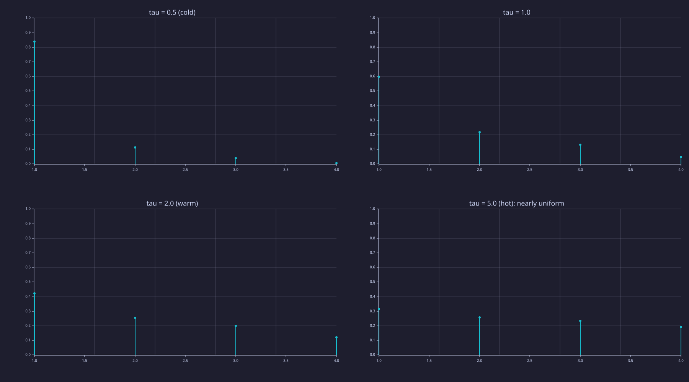
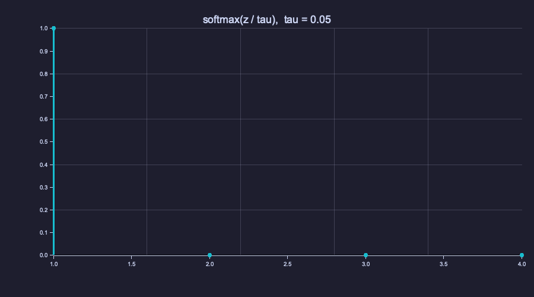
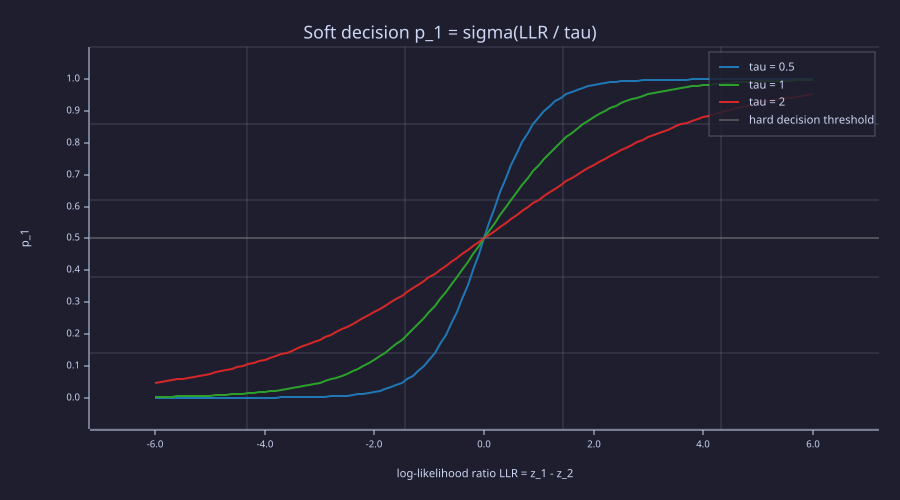
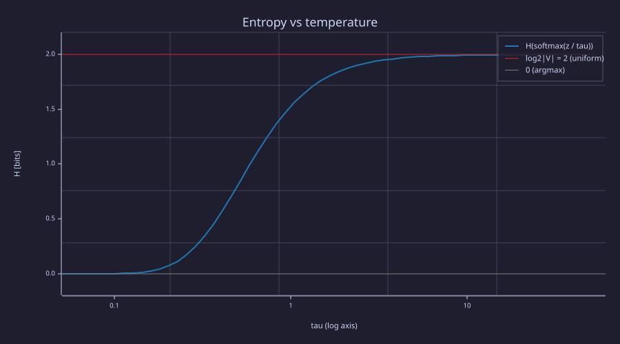

<!-- Generated by rustlab-notebook — do not edit directly. -->

# Lesson 02: Probability & Softmax

A language model produces raw scores called **logits** — one per vocabulary token. This lesson *derives* the **softmax function** that converts logits into a valid probability distribution — it is the maximum-entropy distribution consistent with an expected score, not an arbitrary construction — and introduces the **temperature** $\tau$ and **entropy** as tools for reading model confidence. (Temperature is $\tau$ throughout this course; $T$ is reserved for sequence length.)

## Learning Objectives

- Interpret the output of a language model as a **probability distribution** over the vocabulary.
- **Derive** softmax as the maximum-entropy distribution under an expected-score constraint, and name the **partition function** $Z$ and **log-sum-exp**.
- Read logits as **log-odds**, and state the softmax **Jacobian** in one line.
- Explain the role of **temperature** $\tau$ — the $\tau \to 0$ and $\tau \to \infty$ limits — in controlling the sharpness of a distribution.
- Compute **Shannon entropy** in bits and read entropy-versus-$\tau$ as the model's confidence curve.

## Background

One-hot encoding and the unigram entropy from [01-tokens-and-encoding](01-tokens-and-encoding.md). The exponential and logarithm functions $e^x$, $\ln x$, $\log_2 x$. Lagrange multipliers for a constrained maximum. The definition of a probability distribution: non-negative values that sum to 1.

## From Scores to Probabilities

### Theory

Logits $\mathbf{z} = (z_1, \ldots, z_{|\mathcal{V}|})$ can be any real numbers. We want a distribution $\mathbf{p}$ that (1) is non-negative, (2) sums to 1, and (3) preserves the ordering of the logits. Many maps do that; softmax is the one singled out by a principle.

**Derivation — the maximum-entropy distribution.** Among all distributions with a prescribed expected score $\sum_i p_i z_i = \mu$, pick the one that assumes the least: the one with maximum entropy $H(\mathbf{p}) = -\sum_i p_i \ln p_i$ (nats here; bits differ by the constant $1/\ln 2$, which does not move the maximiser). With multipliers $\alpha$ for normalisation and $\beta$ for the score constraint, the Lagrangian is

$$\mathcal{L}(\mathbf{p}, \alpha, \beta) = -\sum_i p_i \ln p_i + \alpha \Big(\sum_i p_i - 1\Big) + \beta \Big(\sum_i p_i z_i - \mu\Big).$$

$$\frac{\partial \mathcal{L}}{\partial p_i} = -\ln p_i - 1 + \alpha + \beta z_i = 0 \quad\Longrightarrow\quad p_i = e^{\alpha - 1} \, e^{\beta z_i}.$$

Normalisation fixes the first factor, $e^{\alpha - 1} = 1 / \sum_j e^{\beta z_j}$, so

$$p_i = \frac{e^{\beta z_i}}{Z(\beta)}, \qquad Z(\beta) = \sum_{j=1}^{|\mathcal{V}|} e^{\beta z_j}.$$

$Z$ is the **partition function**; $\beta$ is set by the constraint $\mu$ and is written $\beta = 1/\tau$ — the inverse **temperature**. Because $-\sum p_i \ln p_i$ is strictly concave and the constraints are linear, this stationary point is the unique maximum. At $\tau = 1$ it is the standard softmax: $\mathbf{p} = \text{softmax}(\mathbf{z})$, $p_i = e^{z_i} / Z$.

**Log-sum-exp.** $\ln Z(\mathbf{z}) = \ln \sum_j e^{z_j} \equiv \text{LSE}(\mathbf{z})$, so $p_i = e^{z_i - \text{LSE}(\mathbf{z})}$ and $\nabla_{\mathbf{z}} \text{LSE} = \text{softmax}(\mathbf{z})$. LSE is a smooth maximum: $\max_j z_j \le \text{LSE}(\mathbf{z}) \le \max_j z_j + \ln |\mathcal{V}|$.

> [!NOTE] Numerical stability
> $\text{LSE}(\mathbf{z}) = m + \text{LSE}(\mathbf{z} - m)$ for any constant $m$, so implementations subtract $m = \max(\mathbf{z})$ before exponentiating — the constant $e^{-m}$ cancels top and bottom, and nothing overflows. The same shift invariance means softmax only sees *differences* of logits.

**Logits are log-odds.** Dividing two components, $\ln \dfrac{p_i}{p_j} = z_i - z_j$: a logit gap of one unit is a factor $e$ in probability. For two classes, $p_1 = \dfrac{e^{z_1}}{e^{z_1} + e^{z_2}} = \dfrac{1}{1 + e^{-(z_1 - z_2)}} = \sigma(z_1 - z_2)$ — the **logistic sigmoid** of the log-odds.

**The Jacobian.** Differentiating $p_i = e^{z_i}/Z$ gives, in one line, $\dfrac{\partial p_i}{\partial z_j} = p_i(\delta_{ij} - p_j)$ — the matrix $\text{diag}(\mathbf{p}) - \mathbf{p}\mathbf{p}^\top$, whose rows sum to zero (shift invariance again). [03-cross-entropy-loss](03-cross-entropy-loss.md) uses it to reduce the loss gradient to $\mathbf{p} - \mathbf{y}$.

### Example — Softmax, Z, log-sum-exp, and log-odds in numbers

```rustlab
z = [2.0, 1.0, 0.5, -0.5];
p = softmax(z);
Z = sum(exp(z));
LSE = log(Z);

print("p = softmax(z):", p, "  sum =", sum(p));
print("Z =", Z, "  LSE = ln Z =", LSE, "  exp(z - LSE) =", exp(z - LSE));
print("shift invariance max|softmax(z + 100) - p| =", max(abs(softmax(z + 100) - p)));
print("log-odds: z1 - z2 =", z(1) - z(2), "  ln(p1/p2) =", log(p(1) / p(2)));

J = diag(p) - p' * p;                    % dp_i/dz_j = p_i (delta_ij - p_j)
print("Jacobian diag(p) - p p':");
print(J);
print("max |row sum of J| (should be 0):", max(max(abs(sum(J, 2)))));
```

<!-- rustlab:output-start -->
```text
p = softmax(z): [1×4]  0.597695  0.219880  0.133364  0.049062   sum = 1
Z = 12.362589857802456   LSE = ln Z = 2.514674965500975   exp(z - LSE) = [1×4]  0.597695  0.219880  0.133364  0.049062
shift invariance max|softmax(z + 100) - p| = 0
log-odds: z1 - z2 = 1   ln(p1/p2) = 1
Jacobian diag(p) - p p':
Matrix(4x4)
  [0.240456, -0.131421, -0.079711, -0.029324]
  [-0.131421, 0.171533, -0.029324, -0.010788]
  [-0.079711, -0.029324, 0.115578, -0.006543]
  [-0.029324, -0.010788, -0.006543, 0.046655]
max |row sum of J| (should be 0): 0.0000000000000000242861286636753
```

<!-- rustlab:output-end -->

Token 1 gets $p_1 = 0.598$ of the mass with $Z = 12.363$ and $\text{LSE} = 2.515$; adding 100 to every logit changes nothing, and $z_1 - z_2 = \ln(p_1/p_2) = 1.000$ exactly. The Jacobian's diagonal entry $p_1(1 - p_1) = 0.240$ is the largest: the most probable token is also the most sensitive to its own logit.

## Temperature Scaling

### Theory

The **temperature** $\tau > 0$ scales the logits before softmax:

$$p_i(\tau) = \frac{e^{z_i / \tau}}{\sum_{j} e^{z_j / \tau}} = \frac{e^{z_i/\tau}}{Z(1/\tau)}.$$

| Temperature | Limit | Entropy |
|-------------|-------|---------|
| $\tau \to 0$ (cold) | $z_i/\tau$ gaps grow without bound: all mass on $\arg\max_i z_i$ — a hard **argmax** | $H \to 0$ |
| $\tau = 1$ (neutral) | Standard softmax | between |
| $\tau \to \infty$ (hot) | $z_i/\tau \to 0$ for every $i$: $p_i \to 1/\lvert\mathcal{V}\rvert$ — **uniform** | $H \to \log_2 \lvert\mathcal{V}\rvert$ |

Temperature does not change *which* token has the highest probability — the log-odds $(z_i - z_j)/\tau$ keep their sign — it changes *how much* higher it is. Temperature is the knob the **generation** stage ([21-sampling-and-generation](21-sampling-and-generation.md)) uses to trade focused against diverse output.

### Example — Softmax of four logits at four temperatures

```rustlab
p_cold    = softmax(z / 0.5);
p_neutral = softmax(z / 1.0);
p_warm    = softmax(z / 2.0);
p_hot     = softmax(z / 5.0);

print("tau=0.5 (cold)   :", p_cold);
print("tau=1.0 (neutral):", p_neutral);
print("tau=2.0 (warm)   :", p_warm);
print("tau=5.0 (hot)    :", p_hot);
print("sum at tau=0.5:", sum(p_cold));
```

<!-- rustlab:output-start -->
```text
tau=0.5 (cold)   : [1×4]  0.839025  0.113550  0.041773  0.005653
tau=1.0 (neutral): [1×4]  0.597695  0.219880  0.133364  0.049062
tau=2.0 (warm)   : [1×4]  0.422761  0.256418  0.199698  0.121123
tau=5.0 (hot)    : [1×4]  0.315848  0.258594  0.233986  0.191572
sum at tau=0.5: 1.0000000000000002
```

<!-- rustlab:output-end -->

Each row sums to 1.000 — a valid distribution. At $\tau = 0.5$ token 1 gets $0.839$ of the mass; at $\tau = 2$ only $0.423$; at $\tau = 5$ it is $0.316$, closing in on the uniform $0.25$.

### Example — PMFs at τ ∈ {0.5, 1, 2, 5}

A PMF over four tokens is four numbers on a 1-based index axis, so it is drawn as stems, not as a curve:

```rustlab
figure();
subplot(2, 2, 1)
stem(1:4, p_cold)
title("tau = 0.5 (cold)")
ylim([0, 1])
subplot(2, 2, 2)
stem(1:4, p_neutral)
title("tau = 1.0")
ylim([0, 1])
subplot(2, 2, 3)
stem(1:4, p_warm)
title("tau = 2.0 (warm)")
ylim([0, 1])
subplot(2, 2, 4)
stem(1:4, p_hot)
title("tau = 5.0 (hot): nearly uniform")
ylim([0, 1])
```

<!-- rustlab:output-start -->


<!-- rustlab:output-end -->

> [!TIP]
> All four panels share the $[0, 1]$ scale. The tallest stem is always token 1 — temperature never reorders — but by $\tau = 5$ the four stems are within a factor of 1.6 of each other, heading for the flat $0.25$ line.

### Example — Animation: from argmax to uniform

Sweeping $\tau$ from $0.05$ to $50$ on a log grid morphs the PMF continuously from a single spike (the hard argmax) to the uniform distribution:

```rustlab
figure();
taus_anim = logspace(log10(0.05), log10(50), 32);
for k = 1:32
  pk = softmax(z / taus_anim(k));
  stem(1:4, pk)
  title(sprintf("softmax(z / tau),  tau = %.2f", taus_anim(k)))
  ylim([0, 1])
  frame()
end
saveanim("softmax_temperature.gif", 8)
```

<!-- rustlab:output-start -->


<!-- rustlab:output-end -->

> [!TIP]
> Watch the first stem: it starts at 1.0, passes 0.598 at $\tau = 1$, and settles toward 0.25. The other three rise in order of their logits and never overtake each other.

## Shannon Entropy

### Theory

The **entropy** of a distribution $\mathbf{p}$ measures how uncertain or spread-out it is:

$$H(\mathbf{p}) = -\sum_{i=1}^{|\mathcal{V}|} p_i \log_2 p_i \quad [\text{bits}], \qquad \text{with the convention } 0 \log 0 = 0.$$

The convention is the limit $\lim_{p \to 0^+} p \log p = 0$: an outcome of probability zero contributes nothing. Softmax outputs are strictly positive, so the convention is never triggered here; it matters for one-hot targets and for the shared helpers in `lib/info.rlab`, which implement it by skipping zero entries.

- $H = 0$: all mass on one token (perfectly certain).
- $H = \log_2 |\mathcal{V}|$: uniform distribution (maximally uncertain) — the maximum, by the same Lagrangian as above with the score constraint removed.

Higher temperature $\to$ higher entropy, monotonically: differentiating the Gibbs form gives $dH/d\tau = \text{Var}_p(z)/\tau^3 \ge 0$ (in nats), with equality only when all logits tie.

### Example — Entropy at four temperatures

Every $p_i > 0$, so the sum is written directly:

```rustlab
vocab_size = 4;
H05 = -sum(p_cold    .* log2(p_cold));
H10 = -sum(p_neutral .* log2(p_neutral));
H20 = -sum(p_warm    .* log2(p_warm));
H50 = -sum(p_hot     .* log2(p_hot));
print("H(tau=0.5) =", H05, " H(tau=1) =", H10, " H(tau=2) =", H20, " H(tau=5) =", H50, "bits");
```

<!-- rustlab:output-start -->
```text
H(tau=0.5) = 0.8024252882978413  H(tau=1) = 1.525296073088579  H(tau=2) = 1.8615588961498242  H(tau=5) = 1.9767728958188087 bits
```

<!-- rustlab:output-end -->

Entropy climbs with temperature: $H(\tau{=}0.5) = 0.802$, $H(\tau{=}1) = 1.525$, $H(\tau{=}2) = 1.862$, $H(\tau{=}5) = 1.977$ bits, against a maximum of $\log_2 4 = 2$.

### Example — Sanity checks: uniform vs. near-deterministic

```rustlab
p_uniform = ones(vocab_size) / vocab_size;
H_uniform = -sum(p_uniform .* log2(p_uniform));

p_det = [0.999, 0.0003, 0.0003, 0.0004];
H_det = -sum(p_det .* log2(p_det));
print("H(uniform) =", H_uniform, "bits   H(near-deterministic) =", H_det, "bits");
```

<!-- rustlab:output-start -->
```text
H(uniform) = 2 bits   H(near-deterministic) = 0.012978708331915804 bits
```

<!-- rustlab:output-end -->

Uniform over 4 tokens: $H = 2.000$ bits (matches $\log_2 4 = 2$). Near-deterministic: $H = 0.0130$ bits. From here on the lesson calls `entropy_bits` from `lib/info.rlab` — the same sum, with the $0 \log 0 = 0$ convention built in.

## Engineering Lenses

No systems reading adds to this lesson: softmax is a memoryless map with no state and no update law. The statistical-mechanics reading of the Boltzmann form is an information statement and sits under Information.

### Signals

**Exact.** Softmax is a **soft-argmax**: $\tau \to 0$ recovers the hard comparator $\arg\max$, and every finite $\tau$ returns a graded decision instead of a hard one. For two hypotheses with log-likelihoods (plus log-priors) $z_1, z_2$, the posterior is $\text{softmax}(\mathbf{z})$ and $\Lambda = z_1 - z_2$ is the **log-likelihood ratio**; the two-class softmax $p_1 = \sigma(\Lambda/\tau)$ is a **soft-decision demapper** — the block that feeds a soft-input decoder — where a hard detector would output $\text{sign}(\Lambda)$. For BPSK in Gaussian noise $\Lambda = 2Ay/\sigma^2$, so dividing $\Lambda$ by $\tau$ is the same operation as multiplying the noise variance by $\tau$: temperature enters exactly where noise variance does.

```rustlab
z2 = [2.0, 1.0];                                  % two classes, LLR = 1
for tau = [0.5, 1.0, 2.0]
  p_sm = softmax(z2 / tau);
  print("tau =", tau, ": softmax(z/tau)(1) =", p_sm(1), "  sigma(LLR/tau) =", 1 / (1 + exp(-(z2(1) - z2(2)) / tau)));
end

Lam = linspace(-6, 6, 121);
figure();
plot(Lam, 1 ./ (1 + exp(-Lam / 0.5)), "color", "blue",  "label", "tau = 0.5")
hold("on")
plot(Lam, 1 ./ (1 + exp(-Lam / 1.0)), "color", "green", "label", "tau = 1")
plot(Lam, 1 ./ (1 + exp(-Lam / 2.0)), "color", "red",   "label", "tau = 2")
hline(0.5, "gray", "hard decision threshold")
hold("off")
title("Soft decision p_1 = sigma(LLR / tau)")
xlabel("log-likelihood ratio  LLR = z_1 - z_2")
ylabel("p_1")
```

<!-- rustlab:output-start -->
```text
tau = 0.5 : softmax(z/tau)(1) = 0.8807970779778823   sigma(LLR/tau) = 0.8807970779778823
tau = 1 : softmax(z/tau)(1) = 0.7310585786300049   sigma(LLR/tau) = 0.7310585786300049
tau = 2 : softmax(z/tau)(1) = 0.6224593312018546   sigma(LLR/tau) = 0.6224593312018546
```



<!-- rustlab:output-end -->

> [!TIP]
> All three curves cross $p_1 = 0.5$ at $\text{LLR} = 0$ — the hard decision never moves. Lower $\tau$ steepens the curve toward the sign function; higher $\tau$ flattens it toward $0.5$ everywhere, exactly what more noise does to a demapper.

### Information

**Exact.** Softmax is the maximum-entropy distribution under the expected-score constraint — the derivation above — and the claim can be checked numerically. The direction $\mathbf{v} = (1, -1, -1, 1)$ changes neither the total mass ($\sum v_i = 0$) nor the expected score ($\sum v_i z_i = 0$ for this $\mathbf{z}$), so $\mathbf{p} \pm \varepsilon \mathbf{v}$ satisfies the same constraints as $\mathbf{p} = \text{softmax}(\mathbf{z})$ and must have lower entropy:

```rustlab
v = [1, -1, -1, 1];
mu = sum(p .* z);
q_plus  = p + 0.03 * v;
q_minus = p - 0.03 * v;
print("constraint check: sum(v) =", sum(v), "  sum(v .* z) =", sum(v .* z), "  E_q[z] =", sum(q_plus .* z), " = mu =", mu);
print("H(p) =", entropy_bits(p), "  H(p + 0.03 v) =", entropy_bits(q_plus), "  H(p - 0.03 v) =", entropy_bits(q_minus), "bits");
```

<!-- rustlab:output-start -->
```text
constraint check: sum(v) = 0   sum(v .* z) = 0   E_q[z] = 1.4574202929204703  = mu = 1.4574202929204705
H(p) = 1.525296073088579   H(p + 0.03 v) = 1.5047064047570426   H(p - 0.03 v) = 1.499543090911674 bits
```

<!-- rustlab:output-end -->

Both perturbed distributions lose entropy — $1.5047$ and $1.4995$ bits against $1.5253$ — while keeping $\mathbb{E}[z] = 1.457$: softmax is the least-committed distribution consistent with the logits.

**Exact.** Entropy is a continuous, monotone function of temperature with the two limits derived above. Sweeping $\tau$ on a log axis shows both asymptotes at once:

```rustlab
taus = logspace(log10(0.05), log10(50), 60);
H_tau = zeros(length(taus));
for k = 1:length(taus)
  H_tau(k) = entropy_bits(softmax(z / taus(k)));
end
print("H at tau = 0.05:", H_tau(1), " bits;  at tau = 50:", H_tau(end), " bits");

figure();
semilogx(taus, H_tau, "color", "blue", "label", "H(softmax(z / tau))")
hold("on")
yline(log2(vocab_size), "red", "log2|V| = 2 (uniform)")
yline(0, "gray", "0 (argmax)")
hold("off")
title("Entropy vs temperature")
xlabel("tau (log axis)")
ylabel("H  [bits]")
```

<!-- rustlab:output-start -->
```text
H at tau = 0.05: 0.00000006245012320586353  bits;  at tau = 50: 1.9997655839197161  bits
```



<!-- rustlab:output-end -->

> [!TIP]
> The curve is an S between the two reference lines: flat near 0 bits for $\tau \lesssim 0.1$ (a hard argmax), steepest around $\tau \approx 0.5$–$1$, and within $0.001$ bits of $\log_2 4 = 2$ by $\tau = 50$. The four entropies computed above are four points on this curve.

**Exact.** The form $p_i = e^{z_i/\tau}/Z$ is the **Boltzmann–Gibbs distribution** of statistical mechanics with $z_i = -E_i$ (negative energies), $\tau$ the temperature, and $Z$ the partition function; the name is not a metaphor — as $\tau \to 0$ the system freezes into its ground state (highest logit), and $\ln Z$ is the free-energy generating function whose gradient is the mean occupancy $\mathbf{p}$. And $H(\mathbf{p})$ is the source-coding bound: the minimum expected code length for symbols drawn from $\mathbf{p}$ is $H$ bits, with the optimal code giving symbol $i$ a length of $-\log_2 p_i$ bits. The entropies computed above are therefore bit-budgets:

| Distribution | $H$ (bits) | Optimal avg bits/token |
|---|---|---|
| `p_cold`  ($\tau{=}0.5$) | $0.802$ | $0.802$ |
| `p_neutral` ($\tau{=}1$) | $1.525$ | $1.525$ |
| `p_uniform` (4 tokens) | $2.0$ (= $\log_2 4$) | $2.0$ — fixed-width is already optimal |

These facts return in [03-cross-entropy-loss](03-cross-entropy-loss.md) (cross-entropy as expected code length under the model) and [20-perplexity-and-evaluation](20-perplexity-and-evaluation.md) (perplexity as $2^H$).

## Key Takeaways

- Softmax is not a convention: it is the unique maximum-entropy distribution with a prescribed expected score, $p_i = e^{z_i/\tau} / Z$, with partition function $Z$ and $\ln Z = \text{LSE}(\mathbf{z})$.
- Logits are log-odds: $z_i - z_j = \ln(p_i/p_j)$; two classes give the logistic sigmoid; the Jacobian is $p_i(\delta_{ij} - p_j)$.
- Temperature $\tau$ rescales the log-odds: $\tau \to 0$ is the hard argmax ($H \to 0$), $\tau \to \infty$ is uniform ($H \to \log_2|\mathcal{V}|$), and the ordering never changes.
- Entropy in bits is the source-coding bound; softmax with temperature is the Boltzmann distribution and a soft-decision demapper. ML borrowed all three names exactly.

## Standalone Scripts

| Script | What it computes |
|---|---|
| `softmax_maxent.rlab` | softmax of `[2.0, 1.0, 0.5, -0.5]`, $Z$, log-sum-exp, shift invariance, log-odds, the Jacobian, the two-class sigmoid identity, and the max-entropy perturbation check |
| `softmax_temperature.rlab` | softmax at $\tau = 0.5, 1, 2, 5$; the 2×2 stem-plot figure |
| `softmax_animation.rlab` | the argmax-to-uniform GIF over 32 temperatures (`softmax_temperature.gif`) |
| `entropy.rlab` | entropy at the four temperatures plus uniform and near-deterministic baselines; the entropy-vs-$\tau$ `semilogx` curve |

Run all with `make lesson-02` (or `rustlab run lessons/02-probability-and-softmax/<name>.rlab`).

## Expected Numerical Outputs Summary

| Variable | Expected Value |
|---|---|
| `p(1)` (τ = 1) | ≈ `0.598` |
| `Z`, `LSE` | ≈ `12.363`, `2.515` |
| `z(1) - z(2)` = `log(p(1)/p(2))` | `1.000` |
| `J(1, 1)` = $p_1(1 - p_1)$ | ≈ `0.240`; every row of `J` sums to 0 |
| `p_cold(1)`, `p_warm(1)`, `p_hot(1)` | ≈ `0.839`, `0.423`, `0.316` |
| `H05`, `H10`, `H20`, `H50` | ≈ `0.802`, `1.525`, `1.862`, `1.977` bits |
| `H_uniform`, `H_det` | `2.0`, ≈ `0.013` bits |
| `softmax(z2 / tau)(1)` at τ = 0.5, 1, 2 | ≈ `0.881`, `0.731`, `0.622` (= σ(2), σ(1), σ(0.5)) |
| `entropy_bits(q_plus)`, `entropy_bits(q_minus)` | both below `H10` = `1.525` bits |
| `H_tau(1)`, `H_tau(end)` | ≈ `6e-8`, `1.9998` bits |

## Exercises

1. **Softmax invariance to shift.** Show algebraically that adding a constant $c$ to all logits does not change the softmax output, and relate it to the row sums of the Jacobian. Verify numerically on `[2, 1, 0]` and `[5, 4, 3]`.
2. **Temperature limits.** Write out $\lim_{\tau \to 0} \text{softmax}(\mathbf{z}/\tau)$ and $\lim_{\tau \to \infty} \text{softmax}(\mathbf{z}/\tau)$ from the formula, then read both off the entropy-vs-$\tau$ curve. What happens at $\tau \to 0$ when two logits tie?
3. **Entropy calculation.** For the logits `[3.0, 3.0, 3.0, 3.0]`, compute the softmax probabilities and the entropy by hand. Does the result match $\log_2 4$?
4. **Solve for β.** In the max-entropy derivation $\beta$ is fixed by the constraint $\mu$. For $\mathbf{z} = [2, 1, 0.5, -0.5]$, find numerically the $\tau = 1/\beta$ that gives $\mathbb{E}_p[z] = 1.0$ (bisection on $\tau \in [0.1, 10]$ is enough). Is it hotter or colder than $\tau = 1$?
5. **Softmax Jacobian.** Starting from $p_i = e^{z_i}/Z$, derive $\partial p_i / \partial z_j = p_i(\delta_{ij} - p_j)$ and show that $\sum_j \partial p_i / \partial z_j = 0$.

<details><summary>Solution</summary>

For $j = i$: $\dfrac{\partial}{\partial z_i}\dfrac{e^{z_i}}{Z} = \dfrac{e^{z_i}}{Z} - \dfrac{e^{z_i}\, e^{z_i}}{Z^2} = p_i - p_i^2 = p_i(1 - p_i)$, using $\partial Z / \partial z_i = e^{z_i}$. For $j \ne i$: $\dfrac{\partial}{\partial z_j}\dfrac{e^{z_i}}{Z} = -\dfrac{e^{z_i}\, e^{z_j}}{Z^2} = -p_i p_j$. Both cases read $p_i(\delta_{ij} - p_j)$. Summing over $j$: $p_i\big(1 - \sum_j p_j\big) = p_i(1 - 1) = 0$ — a uniform shift of every logit leaves $\mathbf{p}$ unchanged, which is exercise 1 seen from the derivative side.

</details>

## What's next

[03-cross-entropy-loss](03-cross-entropy-loss.md) introduces **cross-entropy loss** — the standard training objective for a language model. Cross-entropy measures the gap between the predicted distribution $\mathbf{p}$ from this lesson and the one-hot target from Lesson 01; written as $-z_c + \text{LSE}(\mathbf{z})$ and differentiated with the Jacobian above, its gradient is the bounded error signal $\mathbf{p} - \mathbf{y}$.
