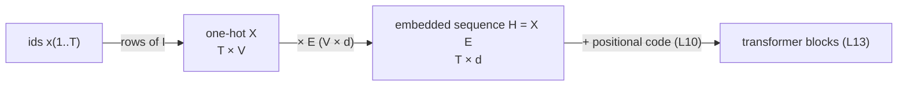
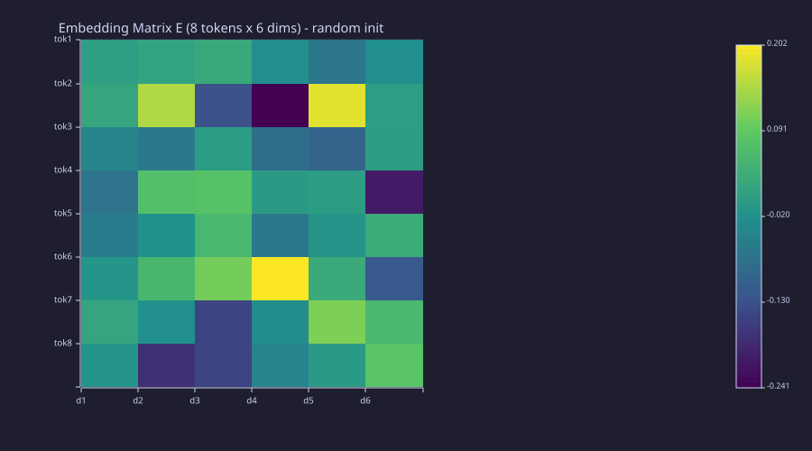
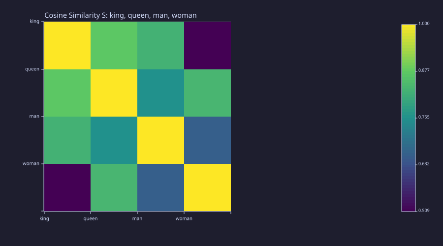
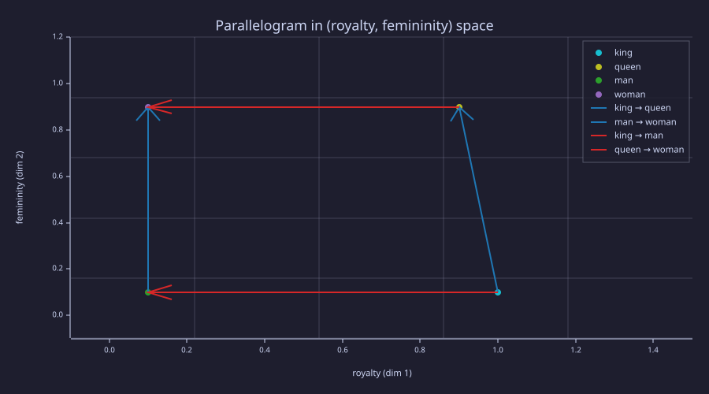
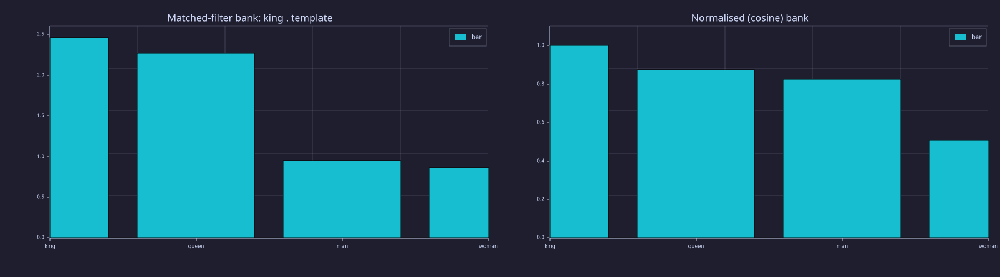
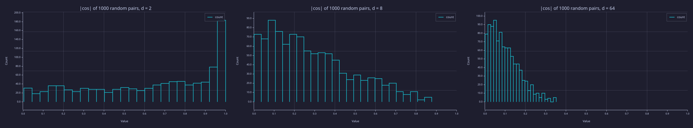

<!-- Generated by rustlab-notebook — do not edit directly. -->

# Lesson 04: Embeddings & Similarity

One-hot vectors are orthogonal — every pair of tokens is equally "distant". This lesson introduces **dense embeddings**: low-dimensional vectors, one per token, in which geometric proximity can encode similarity. The embedding matrix $\mathbf{E}$ is a *learned* parameter — [18-training-loop](18-training-loop.md) trains it for the bigram model and [23-putting-it-all-together](23-putting-it-all-together.md) for the full transformer — but in this lesson nothing is trained yet: $\mathbf{E}$ is either random (to show the lookup mechanics) or hand-set by construction (to show what similarity looks like once structure exists). The tools built here — the dot product as a correlator, cosine as normalised correlation, $\mathbf{E}$ as a codebook — are the ones [08-scaled-dot-product-attention](08-scaled-dot-product-attention.md) reuses for $\mathbf{q} \cdot \mathbf{k}$.

## Learning Objectives

- Explain why **dense embeddings** are preferred over one-hot vectors as token representations.
- Describe the **embedding matrix** $\mathbf{E} \in \mathbb{R}^{|\mathcal{V}| \times d}$ and show that lookup is row selection, $\mathbf{e}_i \mathbf{E} = \mathbf{E}_{i,:}$, in the course's row convention.
- Compute **cosine similarity** between two vectors, interpret it geometrically, and read the full similarity matrix $\mathbf{S} = \hat{\mathbf{E}}\hat{\mathbf{E}}^\top$ as a correlation (Gram) matrix.
- Read the **dot product as a correlator / matched filter** and cosine as its normalised form, and say why magnitude matters for one and not the other.
- Reason about the embedding dimension $d$ from the near-orthogonality of random vectors, and read $\mathbf{E}$ as a **codebook**.

## Background

One-hot encoding from [01-tokens-and-encoding](01-tokens-and-encoding.md) (tokens as rows of the identity; $\mathbf{X}\mathbf{M}$ selects rows of $\mathbf{M}$). Vector dot products and norms. Cross-correlation of two signals at zero lag. The idea that right-multiplication by a matrix, $\mathbf{x}\mathbf{W}$, is a linear map.

## The Problem with One-Hot Vectors

One-hot vectors (Lesson 01) are orthogonal — every pair of tokens is equally "distant". A model operating on one-hot vectors cannot leverage any prior knowledge that `king` and `queen` are semantically closer to each other than to `table`. They also have dimension $|\mathcal{V}|$ (potentially tens of thousands), which is expensive to process.

## The Embedding Matrix

### Theory

The fix is a **dense, low-dimensional representation** for each token. The **embedding matrix** is

$$\mathbf{E} \in \mathbb{R}^{|\mathcal{V}| \times d},$$

where $d \ll |\mathcal{V}|$ is the embedding dimension (e.g. $d = 64$ or $d = 512$). Row $i$, written $\mathbf{E}_{i,:} \in \mathbb{R}^d$, is the embedding vector for token $i$.

**Lookup as matrix multiplication (row convention).** Tokens are rows throughout this course, so a token is a one-hot *row* vector $\mathbf{e}_i \in \{0,1\}^{1 \times |\mathcal{V}|}$ and the lookup is a right-multiplication:

$$\mathbf{e}_i \mathbf{E} = \mathbf{E}_{i,:}.$$

For a sequence of $T$ tokens encoded as $\mathbf{X} \in \{0,1\}^{T \times |\mathcal{V}|}$ the same product embeds the whole sequence at once:

$$\mathbf{H} = \mathbf{X} \mathbf{E} \in \mathbb{R}^{T \times d}.$$



In practice implementations index rows directly — no explicit multiply — but the linear-algebra view is what makes gradients flow into $\mathbf{E}$ during training ([15-backpropagation](15-backpropagation.md)): $\partial \mathcal{L}/\partial \mathbf{E} = \mathbf{X}^\top\, \partial\mathcal{L}/\partial \mathbf{H}$, which routes each row's gradient back to the token that used it.

### Example — Building a deterministic 8×6 embedding matrix

`seed(N)` re-seeds rustlab's shared RNG with a fixed value, so subsequent `randn` draws are bit-stable across re-renders. This is what $\mathbf{E}$ looks like *at initialisation* — small Gaussian noise, no structure:

```rustlab
vocab_size = 8;
d_embed = 6;

seed(42);                                    % deterministic init
E = randn(vocab_size, d_embed) * 0.1;

print("Embedding matrix E:");
print(E);
```

<!-- rustlab:output-start -->
```text
Embedding matrix E:
Matrix(8x6)
  [0.006943, 0.013294, 0.026258, -0.022530, -0.066422, -0.021539]
  [0.019392, 0.147642, -0.131004, -0.241089, 0.182684, 0.003609]
  [-0.040899, -0.063393, 0.001728, -0.080328, -0.099360, 0.002251]
  [-0.070393, 0.070619, 0.076319, -0.000985, 0.001283, -0.205239]
  [-0.056209, -0.019614, 0.054621, -0.063203, -0.011816, 0.029221]
  [-0.012380, 0.053437, 0.106295, 0.201838, 0.028142, -0.120393]
  [0.018009, -0.021512, -0.148168, -0.026601, 0.113074, 0.056558]
  [-0.013213, -0.177213, -0.147622, -0.041186, -0.002510, 0.080970]
```

<!-- rustlab:output-end -->

Shape: 8 $\times$ 6 — one row per token in a 6-dimensional embedding space.

### Example — One-hot lookup recovers a row

```rustlab
% Token id 3 -> one-hot row e3 selects row 3 via  h3 = e3 * E
e3 = [0, 0, 1, 0, 0, 0, 0, 0];
h3 = e3 * E;

diff = max(abs(h3 - E(3, :)));       % E(3, :) is row 3; E(3) would be a single scalar
print("Embedded representation h3:", h3);
print("Row 3 of E:              ", E(3, :));
```

<!-- rustlab:output-start -->
```text
Embedded representation h3: [1×6]  -0.040899  -0.063393  0.001728  -0.080328  -0.099360  0.002251
Row 3 of E:               [1×6]  -0.040899  -0.063393  0.001728  -0.080328  -0.099360  0.002251
```

<!-- rustlab:output-end -->

The one-hot multiply reproduces row 3 bit-for-bit: $\max|\mathbf{h}_3 - \mathbf{E}_{3,:}| = 0.00e+00$ — exactly zero.

### Example — Embedding matrix heatmap

```rustlab
tok_labels = {"tok1", "tok2", "tok3", "tok4", "tok5", "tok6", "tok7", "tok8"};
dim_labels = {"d1", "d2", "d3", "d4", "d5", "d6"};

figure();
heatmap(dim_labels, tok_labels, E, "Embedding Matrix E  (8 tokens x 6 dims)  - random init", "viridis")
```

<!-- rustlab:output-start -->


<!-- rustlab:output-end -->

> [!TIP]
> Signed values, no structure: at initialisation every row is independent noise of scale 0.1, so no two rows are more alike than chance. Training ([18-training-loop](18-training-loop.md)) is what makes rows of related tokens move together.

## Cosine Similarity

### Theory

In embedding space, **direction** is the signal. Two tokens are related if their vectors point the same way. The measure is **cosine similarity**:

$$\cos(\mathbf{a}, \mathbf{b}) = \frac{\mathbf{a} \cdot \mathbf{b}}{\|\mathbf{a}\| \, \|\mathbf{b}\|}.$$

| Value | Meaning |
|-------|---------|
| $\cos = 1$ | Same direction — maximally similar |
| $\cos = 0$ | Orthogonal — no linear relationship |
| $\cos = -1$ | Opposite directions — maximally dissimilar |

Cosine similarity ignores vector magnitude and focuses only on direction, making it robust to tokens that appear at different frequencies (and thus may have different embedding magnitudes).

The full pairwise similarity matrix for $N$ embeddings stacked as rows of $\mathbf{E}$ is

$$\mathbf{S} = \hat{\mathbf{E}} \, \hat{\mathbf{E}}^\top \in \mathbb{R}^{N \times N}, \qquad \hat{\mathbf{E}}_{i,:} = \frac{\mathbf{E}_{i,:}}{\|\mathbf{E}_{i,:}\|}.$$

Entry $S_{ij}$ is the cosine similarity between tokens $i$ and $j$; the diagonal is always 1. $\mathbf{S}$ is the **Gram matrix** of the unit-normalised rows — a correlation matrix in the statistician's sense.

### Example — Hand-crafted king/queen/man/woman vectors

These four vectors are set **by construction** with dimensions meaning $[\text{royalty}, \text{femininity}, \text{age}, \text{authority}]$ — a toy that shows what a structured $\mathbf{E}$ looks like. A trained $\mathbf{E}$ has no labelled axes.

```rustlab
king  = [1.0,  0.1,  0.8,  0.9];
queen = [0.9,  0.9,  0.7,  0.8];
man   = [0.1,  0.1,  0.6,  0.4];
woman = [0.1,  0.9,  0.5,  0.3];

print("king :", king);
print("queen:", queen);
print("man  :", man);
print("woman:", woman);

function s = cos_sim(a, b)
  s = sum(a .* b) / (sqrt(sum(a .^ 2)) * sqrt(sum(b .^ 2)))
end
```

<!-- rustlab:output-start -->
```text
king : [1×4]  1.000000  0.100000  0.800000  0.900000
queen: [1×4]  0.900000  0.900000  0.700000  0.800000
man  : [1×4]  0.100000  0.100000  0.600000  0.400000
woman: [1×4]  0.100000  0.900000  0.500000  0.300000
```

<!-- rustlab:output-end -->

### Example — Three cosines and the 4×4 matrix form

Three scalar calls fix the intuition; the matrix product $\hat{\mathbf{E}}\hat{\mathbf{E}}^\top$ then delivers all sixteen entries at once:

```rustlab
s_kq = cos_sim(king,  queen);
s_km = cos_sim(king,  man);
s_qw = cos_sim(queen, woman);
print("cos(king, queen) =", s_kq, "  cos(king, man) =", s_km, "  cos(queen, woman) =", s_qw);

E4 = [king; queen; man; woman];          % 4 x 4: one embedding per row
row_norms = sqrt(sum(E4 .^ 2, 2));        % ||E_i|| for each row
En = E4 ./ row_norms;                     % Ê — unit-length rows
S = En * En';                             % S_ij = cos(E_i, E_j)

print("Cosine similarity matrix S (king, queen, man, woman):");
print(S);
sym_err = max(max(abs(S - S')));
print("max|S - S'| =", sym_err, "   min(S) =", min(min(S)), "  (king/woman)");
```

<!-- rustlab:output-start -->
```text
cos(king, queen) = 0.8727542186034795   cos(king, man) = 0.824250409967643   cos(queen, woman) = 0.8342398413242228
Cosine similarity matrix S (king, queen, man, woman):
Matrix(4x4)
  [1.000000, 0.872754, 0.824250, 0.509099]
  [0.872754, 1.000000, 0.754961, 0.834240]
  [0.824250, 0.754961, 1.000000, 0.657018]
  [0.509099, 0.834240, 0.657018, 1.000000]
max|S - S'| = 0    min(S) = 0.5090986003882718   (king/woman)
```

<!-- rustlab:output-end -->

Key pairs: king/queen = $0.873$ (both royal), king/man = $0.824$ (same gender), queen/woman = $0.834$ (same gender). The matrix reproduces the scalar calls in its $(1,2)$, $(1,3)$ and $(2,4)$ entries, is symmetric to machine precision ($\max|\mathbf{S} - \mathbf{S}^\top| = 0.00e+00$), has ones on the diagonal, and its smallest entry is king/woman at $0.509$ — every pair here is positively correlated, because all four vectors live in the positive orthant by construction.

### Example — Similarity heatmap

Both axes index the same four tokens, so each cell reads as $\cos(\text{row token}, \text{col token})$:

```rustlab
vocab = {"king", "queen", "man", "woman"};

figure();
heatmap(vocab, vocab, S, "Cosine Similarity S: king, queen, man, woman", "viridis")
```

<!-- rustlab:output-start -->


<!-- rustlab:output-end -->

> [!TIP]
> The colour scale autoscales to the data range $[0.509, 1]$, not to $[-1, 1]$: the darkest cell (king/woman) is $0.509$, still a clearly positive correlation, not orthogonality. Read the numbers from the printed $\mathbf{S}$; read the *pattern* — a bright royal pair, a bright female pair — from the picture.

## Analogy Arithmetic

### Theory

Trained embeddings can organise so that semantic relationships correspond to geometric ones. The classic example:

$$\mathbf{E}_{\text{king}} - \mathbf{E}_{\text{man}} + \mathbf{E}_{\text{woman}} \approx \mathbf{E}_{\text{queen}}.$$

Here the four vectors were set by hand, so the relationship holds *by construction*; in a trained model it is an empirical finding.

### Example — Closest token to king − man + woman

```rustlab
analogy = king - man + woman;
print("king - man + woman:", analogy);

sim_to_king  = cos_sim(analogy, king);
sim_to_queen = cos_sim(analogy, queen);
sim_to_man   = cos_sim(analogy, man);
sim_to_woman = cos_sim(analogy, woman);
print("cos to king/queen/man/woman:", sim_to_king, sim_to_queen, sim_to_man, sim_to_woman);
```

<!-- rustlab:output-start -->
```text
king - man + woman: [1×4]  1.000000  0.900000  0.700000  0.800000
cos to king/queen/man/woman: 0.8812662277999913 0.9987995268037284 0.7380952380952381 0.8122479038345392
```

<!-- rustlab:output-end -->

Similarity of $\mathbf{E}_{\text{king}} - \mathbf{E}_{\text{man}} + \mathbf{E}_{\text{woman}}$ to each vocab item: king = $0.881$, **queen = 0.999**, man = $0.738$, woman = $0.812$. The closest token is **queen**, as the construction intended. In a trained embedding this structure is not programmed — it arises from next-token prediction, as a compressed summary of co-occurrence patterns.

### Example — Visualising the parallelogram

The algebra says $\mathbf{E}_{\text{queen}} - \mathbf{E}_{\text{king}} \approx \mathbf{E}_{\text{woman}} - \mathbf{E}_{\text{man}}$: the four points form an *approximate* parallelogram. Because the toy axes are labelled, dimensions 1 (royalty) and 2 (femininity) can be plotted directly; each point is its own labelled series, and the two displacement pairs are drawn as arrows:

```rustlab
function arrow(x0, y0, x1, y1, c, lbl)
  % shaft plus a small arrowhead, drawn as one polyline so it is one legend entry
  dx = x1 - x0;  dy = y1 - y0;  L = sqrt(dx ^ 2 + dy ^ 2);
  ux = dx / L;   uy = dy / L;
  hx = x1 - 0.06 * ux;  hy = y1 - 0.06 * uy;
  plot([x0, x1, hx - 0.03 * uy, x1, hx + 0.03 * uy], [y0, y1, hy + 0.03 * ux, y1, hy - 0.03 * ux], "color", c, "label", lbl)
end

figure();
scatter([king(1)], [king(2)], "label", "king")
hold("on")
scatter([queen(1)], [queen(2)], "label", "queen")
scatter([man(1)], [man(2)], "label", "man")
scatter([woman(1)], [woman(2)], "label", "woman")
arrow(king(1), king(2), queen(1), queen(2), "blue", "king → queen")
arrow(man(1),  man(2),  woman(1), woman(2), "blue", "man → woman")
arrow(king(1), king(2), man(1),   man(2),   "red",  "king → man")
arrow(queen(1), queen(2), woman(1), woman(2), "red", "queen → woman")
hold("off")
title("Parallelogram in (royalty, femininity) space")
xlabel("royalty (dim 1)")
ylabel("femininity (dim 2)")
xlim([-0.1, 1.5])                       % room on the right for the legend
ylim([-0.1, 1.2])
```

<!-- rustlab:output-start -->


<!-- rustlab:output-end -->

> [!TIP]
> Blue arrows are the femininity displacements, $(-0.1, +0.8)$ and $(0, +0.8)$; red arrows are the (negative) royalty displacements, $(-0.9, 0)$ and $(-0.8, 0)$ — nearly, not exactly, parallel. The $0.1$ mismatch on the royalty axis (king at $1.0$, queen at $0.9$) is why king − man + woman lands *near* queen rather than on it; that residual lives in dimension 1, which this projection keeps.

## Engineering Lenses

No systems reading adds to this lesson: the lookup $\mathbf{X}\mathbf{E}$ has no state and no update law — the update law that changes $\mathbf{E}$ is gradient descent, which is [06-linear-layers-and-gradient-descent](06-linear-layers-and-gradient-descent.md)'s subject.

### Signals

**Exact.** The dot product $\mathbf{a} \cdot \mathbf{b} = \sum_n a_n b_n$ is the zero-lag **cross-correlation** of two length-$d$ sequences, so a dot product with a fixed template is a **correlator**; cosine similarity is the *normalised* cross-correlation, and $\mathbf{S} = \hat{\mathbf{E}}\hat{\mathbf{E}}^\top$ is the correlation (Gram) matrix of the row signals. A **matched filter** is a correlator too: its output at the sampling instant is the inner product of the received signal with the template it is matched to. Correlating one query vector against every row of $\mathbf{E}$ is therefore a **bank of matched filters**, one per token — exactly the operation $\mathbf{q}\mathbf{K}^\top$ performs in [08-scaled-dot-product-attention](08-scaled-dot-product-attention.md). The raw correlator responds to amplitude; the normalised one does not:

```rustlab
dots = king * E4';                       % king correlated against the four templates
coss = (king / norm(king)) * En';     % the same bank, normalised
print("raw correlator outputs   (king . row):", dots);
print("normalised (cosine)      (king , row):", coss);

king10 = 10 * king;                      % amplitude x10: correlator scales, cosine does not
print("10*king . queen =", sum(king10 .* queen), "   cos(10*king, queen) =", cos_sim(king10, queen), "  (was", s_kq, ")");

figure();
subplot(1, 2, 1)
bar(vocab, dots, "Matched-filter bank: king . template")
ylim([0, 2.6])
subplot(1, 2, 2)
bar(vocab, coss, "Normalised (cosine) bank")
ylim([0, 1.1])
```

<!-- rustlab:output-start -->
```text
raw correlator outputs   (king . row): [1×4]  2.460000  2.270000  0.950000  0.860000
normalised (cosine)      (king , row): [1×4]  1.000000  0.872754  0.824250  0.509099
10*king . queen = 22.7    cos(10*king, queen) = 0.8727542186034793   (was 0.8727542186034795 )
```



<!-- rustlab:output-end -->

> [!TIP]
> Both panels rank the templates the same way — king, queen, man, woman — but the raw bank's left bar is $\|\mathbf{king}\|^2 = 2.46$ and would grow ×10 if the query were scaled, while the cosine bank tops out at 1 regardless. Attention uses the raw form, which is why [08-scaled-dot-product-attention](08-scaled-dot-product-attention.md) has to divide by $\sqrt{d_k}$.

### Information

**Exact.** $\mathbf{E}$ is a **codebook** in the vector-quantisation sense: $|\mathcal{V}|$ codewords of dimension $d$, and the one-hot product $\mathbf{e}_i\mathbf{E}$ is codebook lookup by index. The index costs $\log_2|\mathcal{V}|$ bits to transmit; the codeword is $d$ real numbers the model can do arithmetic on. The question "how large should $d$ be" has an exact geometric answer: two independent Gaussian vectors in $\mathbb{R}^d$ have cosine with mean $0$ and standard deviation $1/\sqrt{d}$, so as $d$ grows, random vectors become nearly orthogonal and the space can hold many almost-independent directions. That is what a large vocabulary needs: distinct tokens must be distinguishable, and near-orthogonality is what makes room for them.

```rustlab
seed(7);
n_pairs = 1000;
dims = [2, 8, 64];
figure();
for k = 1:3
  d = dims(k);
  A = randn(n_pairs, d);  B = randn(n_pairs, d);
  c = sum(A .* B, 2) ./ (sqrt(sum(A .^ 2, 2)) .* sqrt(sum(B .^ 2, 2)));
  print("d =", d, ": mean|cos| =", mean(abs(c)), "  std(cos) =", std(c), "  1/sqrt(d) =", 1 / sqrt(d));
  subplot(1, 3, k)
  histogram(abs(c), 25);
  title(sprintf("|cos| of 1000 random pairs, d = %d", d))
  xlim([0, 1])
end
```

<!-- rustlab:output-start -->
```text
d = 2 : mean|cos| = 0.6293227817710451   std(cos) = 0.7014465768602673   1/sqrt(d) = 0.7071067811865475
d = 8 : mean|cos| = 0.2835495335637865   std(cos) = 0.34894596930814564   1/sqrt(d) = 0.35355339059327373
d = 64 : mean|cos| = 0.09817975782434396   std(cos) = 0.12163438477024725   1/sqrt(d) = 0.125
```



<!-- rustlab:output-end -->

> [!TIP]
> Left to right the histograms collapse toward zero: at $d = 2$ the cosine of two random directions is spread over the whole of $[0, 1]$, at $d = 64$ it is concentrated below $0.3$ with standard deviation $1/8$. Real models pick $d$ in the hundreds so that tens of thousands of tokens can each own a nearly orthogonal direction while still sharing directions with the tokens they resemble.

## Key Takeaways

- Embeddings are the first transformation inside every language model: one-hot $\to$ dense vector via right-multiplication by $\mathbf{E}$; $\mathbf{H} = \mathbf{X}\mathbf{E}$ embeds a whole sequence.
- $\mathbf{E}$ is **learned** by gradient descent ([06-linear-layers-and-gradient-descent](06-linear-layers-and-gradient-descent.md) for the mechanism, [18-training-loop](18-training-loop.md) and [23-putting-it-all-together](23-putting-it-all-together.md) for the training). At initialisation it is random; here the structured example is hand-set by construction.
- The dot product is a correlator / matched filter; cosine is its normalised form, which measures direction, not magnitude; $\mathbf{S} = \hat{\mathbf{E}}\hat{\mathbf{E}}^\top$ is a correlation matrix.
- $\mathbf{E}$ is a codebook of $|\mathcal{V}|$ codewords of dimension $d$; random directions in $\mathbb{R}^d$ are nearly orthogonal with spread $1/\sqrt{d}$, which is why $d$ can be far smaller than $|\mathcal{V}|$.

## Standalone Scripts

| Script | What it computes |
|---|---|
| `embedding_matrix.rlab` | random `8 × 6` embedding matrix; one-hot lookup demo; signed heatmap |
| `cosine_similarity.rlab` | three scalar cosines, the 4×4 matrix form $\hat{\mathbf{E}}\hat{\mathbf{E}}^\top$, analogy arithmetic; heatmap |
| `analogy_parallelogram.rlab` | the labelled parallelogram figure with the two displacement pairs drawn as arrows |
| `matched_filter_bank.rlab` | `king` correlated against the four templates, raw and normalised; the ×10 norm-effects check |
| `random_cosines.rlab` | histograms of $\lvert\cos\rvert$ for 1000 random pairs at $d = 2, 8, 64$ against the $1/\sqrt{d}$ law |

Run all with `make lesson-04` (or `rustlab run lessons/04-embeddings-and-similarity/<name>.rlab`).

## Expected Numerical Outputs Summary

| Variable | Expected Value |
|---|---|
| `size(E)` | `[8, 6]` |
| `diff` (`h3 − E(3, :)`) | `0` (exact — one-hot multiply reproduces the row) |
| `s_kq`, `s_km`, `s_qw` | ≈ `0.873`, `0.824`, `0.834` |
| `S` diagonal, `sym_err`, `min(S)` | `1.000`, ≈ `0` (machine epsilon), ≈ `0.509` (king/woman) |
| `sim_to_queen` (analogy → queen) | ≈ `0.999` (closest match) |
| `dots` (king · king/queen/man/woman) | ≈ `2.46`, `2.27`, `0.95`, `0.86` |
| `cos(10*king, queen)` | `0.873` (unchanged); `10*king . queen` = `22.7` |
| `std(cos)` at $d = 2, 8, 64$ | ≈ `0.70`, `0.35`, `0.12` (the $1/\sqrt{d}$ law: `0.707`, `0.354`, `0.125`) |

## Exercises

1. **Embedding lookup.** If the embedding matrix has shape $|\mathcal{V}| \times d$, and you embed a sequence of $T$ tokens, what is the shape of the output $\mathbf{H}$? Express in terms of $T$, $|\mathcal{V}|$, and $d$.
2. **Parameter count.** How many learnable parameters does the embedding matrix have for $|\mathcal{V}| = 50{,}000$ and $d = 512$? Compare this to the parameters in one attention head ([08-scaled-dot-product-attention](08-scaled-dot-product-attention.md)).
3. **Cosine symmetry.** Prove algebraically that $\cos(\mathbf{a}, \mathbf{b}) = \cos(\mathbf{b}, \mathbf{a})$. What does this say about the similarity matrix $\mathbf{S}$, and why is $\hat{\mathbf{E}}\hat{\mathbf{E}}^\top$ automatically symmetric?
4. **Matched filter with a negative template.** Add a fifth hand-set vector `peasant = [0.0, 0.5, 0.6, 0.1]` and recompute the filter-bank figure. Which template now gives the smallest response to `king`, and is any cosine negative? Change one sign in `peasant` to make one negative.
5. **Effect of dimension.** Extend `random_cosines.rlab` to $d = 512$ and compare `std(cos)` with $1/\sqrt{512}$. Then estimate how many random directions you can pack in $\mathbb{R}^{512}$ with every pairwise $|\cos| < 0.1$ before the $1/\sqrt{d}$ spread makes collisions likely (a rough argument is enough).

## What's next

[05-bigram-language-model](05-bigram-language-model.md) builds the first **language model** of the series: a count-based bigram model that learns next-token probabilities from the Lesson 01 corpus and samples text from them. The lookup-table structure of this lesson reappears — a $|\mathcal{V}| \times |\mathcal{V}|$ matrix indexed by the current token — this time storing transition probabilities rather than learned vectors.
