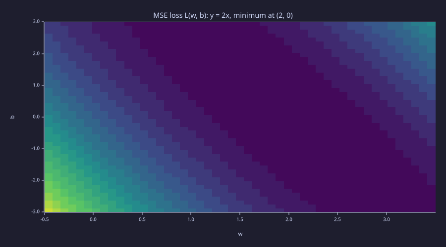
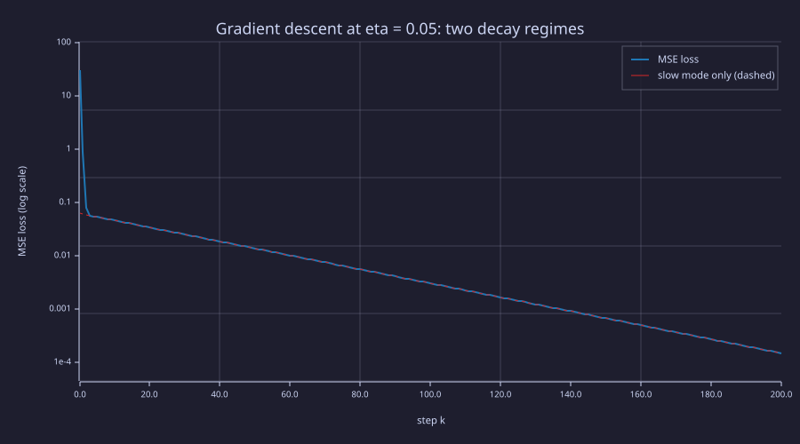
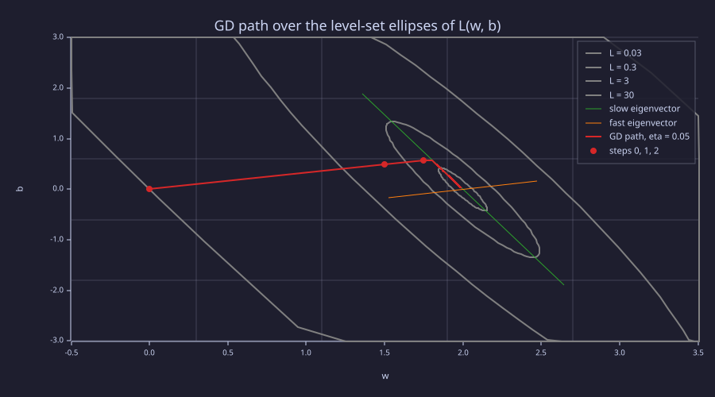
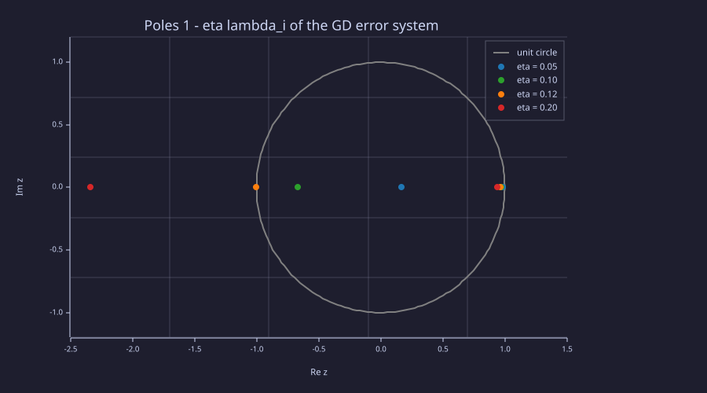
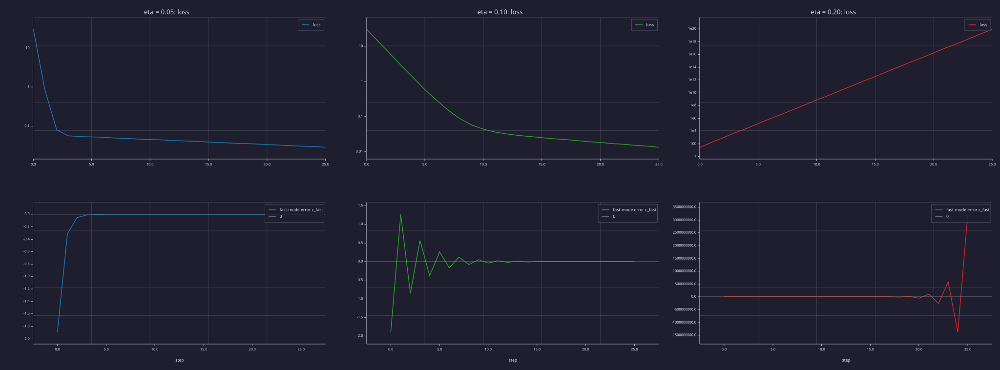
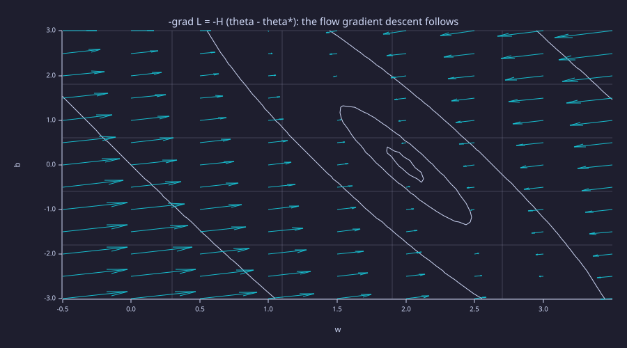
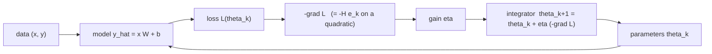
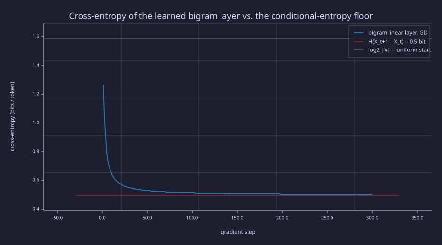

<!-- Generated by rustlab-notebook — do not edit directly. -->

# Lesson 06: Linear Layers & Gradient Descent

The bigram model ([05-bigram-language-model](05-bigram-language-model.md)) uses fixed counts. To learn from data we need **learnable parameters** and a method to improve them. This lesson introduces the **linear layer** $\mathbf{y} = \mathbf{x}\mathbf{W} + \mathbf{b}$ and **gradient descent** — the engine that trains every neural network — and reads gradient descent the way a control engineer would: as a discrete-time linear system whose poles decide whether, and how fast, it converges. It closes the loop Lesson 05 opened by training the bigram model *as* a linear layer and recovering the count estimator.

## Learning Objectives

- Write the equation for a **linear layer** $\mathbf{y} = \mathbf{x}\mathbf{W} + \mathbf{b}$ (row convention) and identify what each component represents.
- Define the **mean squared error** loss, derive its gradient with respect to $w$ and $b$ step by step, and apply one step of gradient descent by hand.
- Read a loss landscape through its **Hessian**: eigenvalues set the per-mode decay rates, the condition number sets the slow mode, and the eigenvectors are the axes of the contour ellipses.
- State and verify the **stability bound** $\eta < 2 / \lambda_{\max}$ for gradient descent on a quadratic and recognise the three regimes (monotone, oscillating, diverging).
- Train the **bigram model as a linear layer** and show gradient descent converges to the count estimator's optimum and to Lesson 05's conditional-entropy floor.

## Background

Matrix-vector multiplication and dot products from linear algebra; eigenvalues and eigenvectors of a symmetric matrix. The chain rule from calculus: $\frac{d}{dx}[f(g(x))] = f'(g(x)) \cdot g'(x)$. Cross-entropy, its logit gradient $\hat{\mathbf{p}} - \mathbf{y}$, and the Gaussian-likelihood reading of MSE from [03-cross-entropy-loss](03-cross-entropy-loss.md). Embeddings from [04-embeddings-and-similarity](04-embeddings-and-similarity.md), the bigram count matrix from [05-bigram-language-model](05-bigram-language-model.md), and the notation of [00-the-llm-as-a-system](00-the-llm-as-a-system.md) (tokens are rows; layers act by right-multiplication).

## The Linear Layer

A **linear layer** (also called a fully-connected layer) maps an input row $\mathbf{x} \in \mathbb{R}^{1 \times d_{\text{in}}}$ to an output row $\mathbf{y} \in \mathbb{R}^{1 \times d_{\text{out}}}$:

$$\mathbf{y} = \mathbf{x}\mathbf{W} + \mathbf{b}.$$

- $\mathbf{W} \in \mathbb{R}^{d_{\text{in}} \times d_{\text{out}}}$ — the **weight matrix** (learnable); column $j$ holds the weights of output $j$.
- $\mathbf{b} \in \mathbb{R}^{1 \times d_{\text{out}}}$ — the **bias vector** (learnable).
- Each output is a linear combination of the input features. A batch of $T$ inputs stacks as rows, $\mathbf{Y} = \mathbf{X}\mathbf{W} + \mathbf{b}$ with $\mathbf{X} \in \mathbb{R}^{T \times d_{\text{in}}}$ — the same right-multiplication every later layer uses.

The embedding lookup from [04-embeddings-and-similarity](04-embeddings-and-similarity.md) is the special case $\mathbf{W} = \mathbf{E}$ with a one-hot input: $\mathbf{e}_i \mathbf{E}$ selects row $i$. The last concept section of this lesson uses exactly that form with $\mathbf{W} \in \mathbb{R}^{|\mathcal{V}| \times |\mathcal{V}|}$ to turn the bigram table into a trainable layer.

## Loss Function: Mean Squared Error

### Theory

For regression tasks (fitting a curve to data) the **mean squared error** loss is

$$\mathcal{L}(w, b) = \frac{1}{N} \sum_{i=1}^{N} (\hat{y}_i - y_i)^2 = \frac{1}{N} \sum_{i=1}^{N} (w x_i + b - y_i)^2,$$

where $(x_i, y_i)$ are data points and $\hat{y}_i = w x_i + b$ is the model's prediction — a $1 \times 1$ linear layer. Language models use cross-entropy ([03-cross-entropy-loss](03-cross-entropy-loss.md)), and Lesson 03 showed the two are one principle: MSE is the negative log-likelihood under Gaussian noise, cross-entropy under categorical noise. MSE is used here because with a linear model it makes the loss landscape an *exact quadratic* — everything about gradient descent can then be read off two eigenvalues.

### Example — Loss at the optimum vs. at the origin

Visualise it for the dataset $x = [1,2,3,4]$, $y = [2,4,6,8]$ where the true relationship is $y = 2x$ (so $w^* = 2$, $b^* = 0$):

```rustlab
x = [1.0, 2.0, 3.0, 4.0];
y = [2.0, 4.0, 6.0, 8.0];

% Loss at true parameters (w=2, b=0) and at initial parameters (w=0, b=0)
L_true = mean((2.0 * x + 0.0 - y) .^ 2);
L_init = mean((0.0 * x + 0.0 - y) .^ 2);
```

At the optimum, $\mathcal{L}(2, 0) = 0.000$ — zero loss because $y = 2x$ exactly. Starting from $(w, b) = (0, 0)$ the loss is $30.00$, the distance we need gradient descent to close.

## The Loss Landscape

### Theory

The loss $\mathcal{L}(w, b)$ defines a 2-D surface over the $(w, b)$ plane. For MSE with a linear model this surface is a **convex paraboloid** — a bowl with a unique global minimum and no local minima. The analytic expansion for $x = [1,2,3,4]$, $y = [2,4,6,8]$ is

$$\mathcal{L}(w,b) = 7.5w^2 + b^2 + 5wb - 30w - 10b + 30.$$

Write the parameters as $\boldsymbol{\theta} = (w, b)$ and the error from the optimum as $\mathbf{e} = \boldsymbol{\theta} - \boldsymbol{\theta}^*$ with $\boldsymbol{\theta}^* = (2, 0)$. A quadratic whose minimum value is zero is completely described by its **Hessian**, the matrix of second derivatives:

$$\mathcal{L} = \tfrac{1}{2}\, \mathbf{e}^\top \mathbf{H}\, \mathbf{e}, \qquad \mathbf{H} = \frac{2}{N}\begin{bmatrix} \sum_i x_i^2 & \sum_i x_i \\ \sum_i x_i & N \end{bmatrix} = \begin{bmatrix} 15 & 5 \\ 5 & 2 \end{bmatrix}.$$

(Check: $\tfrac{1}{2}(15 e_w^2 + 2 \cdot 5\, e_w e_b + 2 e_b^2) = 7.5 e_w^2 + 5 e_w e_b + e_b^2$, which is the expansion with $e_w = w - 2$, $e_b = b$.) $\mathbf{H}$ is symmetric positive-definite, so it has orthogonal eigenvectors $\mathbf{v}_1, \mathbf{v}_2$ and positive eigenvalues. The level sets $\mathcal{L} = c$ are ellipses whose axes are the eigenvectors and whose semi-axes are $\sqrt{2c/\lambda_i}$: the **long axis of every contour is the eigenvector of the small eigenvalue** — the floor of the valley. The ratio $\kappa = \lambda_{\max} / \lambda_{\min}$ is the **condition number**, and it is the whole story of how gradient descent behaves on this surface.

### Example — Hessian, eigenvalues, and eigenvectors

```rustlab
npts = 4.0;
H = (2.0 / npts) * [sum(x .* x), sum(x); sum(x), npts];
[V, D] = eig(H);
V   = real(V);                       % eigenvectors in the columns
lam = real(diag(D));                 % eigenvalues, in the same column order
i_fast = argmax(lam);  i_slow = argmin(lam);
lam_fast = lam(i_fast);  lam_slow = lam(i_slow);
v_fast = V(:, i_fast);   v_slow = V(:, i_slow);
kappa = lam_fast / lam_slow;
print("H ="); print(H);
print("eigenvalues: fast =", lam_fast, "  slow =", lam_slow, "   kappa =", kappa);
print("fast eigenvector =", [v_fast(1), v_fast(2)], "   slow eigenvector =", [v_slow(1), v_slow(2)]);
```

<!-- rustlab:output-start -->
```text
H =
Matrix(2x2)
  [15.000000, 5.000000]
  [5.000000, 2.000000]
eigenvalues: fast = 16.700609733428365   slow = 0.2993902665716366    kappa = 55.7820730936566
fast eigenvector = [1×2]  0.946738  0.322006    slow eigenvector = [1×2]  -0.322006  0.946738
```

<!-- rustlab:output-end -->

The eigenvalues are $16.70$ and $0.299$ — a condition number of $\kappa = 55.8$. The slow eigenvector has slope $\Delta b / \Delta w = -2.94$: along the valley floor about three units of $b$ trade for one of $w$ and the loss barely notices, while the steep direction is almost pure $w$. The asymmetry is between eigen-directions, not between "$w$" and "$b$".

### Example — Loss contours over (w, b)

```rustlab
n_grid = 50;
w_grid = linspace(-0.5, 3.5, n_grid);
b_grid = linspace(-3.0, 3.0, n_grid);
[W_mesh, B_mesh] = meshgrid(w_grid, b_grid);
L_matrix = 7.5 * W_mesh .^ 2 + B_mesh .^ 2 + 5.0 * W_mesh .* B_mesh - 30.0 * W_mesh - 10.0 * B_mesh + 30.0;
min_loss_flat = min(reshape(L_matrix, 1, n_grid * n_grid));

figure();
contourf(W_mesh, B_mesh, L_matrix, 20)
title("MSE loss L(w, b): y = 2x, minimum at (2, 0)")
xlabel("w")
ylabel("b")
```

<!-- rustlab:output-start -->


<!-- rustlab:output-end -->

> [!TIP]
> The dark trough runs diagonally from upper-left to lower-right with slope $\approx -3$: that is the slow eigenvector. Bands are far apart along it and crowd together across it — low curvature along the valley, high curvature across it.

Analytic check: $\mathcal{L}(2, 0) = 0.000$ from the expanded formula. The minimum over the $50 \times 50$ grid is $0.0014$ — a hair above zero because the grid doesn't land exactly on $(2, 0)$.

## Gradient Descent

### Theory

The **gradient** $\nabla \mathcal{L} = [\partial \mathcal{L}/\partial w,\; \partial \mathcal{L}/\partial b]$ points toward steepest ascent. We move in the opposite direction:

$$w \leftarrow w - \eta \frac{\partial \mathcal{L}}{\partial w}, \qquad b \leftarrow b - \eta \frac{\partial \mathcal{L}}{\partial b},$$

where $\eta > 0$ is the **learning rate**. To find the partial derivatives, start from the loss written out explicitly:

$$\mathcal{L}(w, b) = \frac{1}{N} \sum_{i=1}^{N} (w x_i + b - y_i)^2.$$

Differentiate term by term. The chain rule on each square pulls down a factor of $2$ times the inside, times the derivative of the inside with respect to the parameter. That inner derivative is $x_i$ for $w$ and $1$ for $b$:

$$\frac{\partial \mathcal{L}}{\partial w} = \frac{1}{N} \sum_{i=1}^{N} 2 (w x_i + b - y_i)\, x_i, \qquad \frac{\partial \mathcal{L}}{\partial b} = \frac{1}{N} \sum_{i=1}^{N} 2 (w x_i + b - y_i)\, (1).$$

Factor the constant $2/N$ out of each sum and write $\hat{y}_i = w x_i + b$:

$$\frac{\partial \mathcal{L}}{\partial w} = \frac{2}{N} \sum_{i=1}^{N} (\hat{y}_i - y_i) \cdot x_i, \qquad \frac{\partial \mathcal{L}}{\partial b} = \frac{2}{N} \sum_{i=1}^{N} (\hat{y}_i - y_i).$$

For a quadratic this is the same as $\nabla \mathcal{L} = \mathbf{H}\,\mathbf{e}$ — the gradient is the Hessian times the current error — which is the fact the Systems lens turns into a stability theory.

### Example — 200 steps from (0, 0) at η = 0.05

```rustlab
lr = 0.05;
n_steps = 200;

w = 0.0;
b = 0.0;

w_path    = zeros(n_steps + 1);
b_path    = zeros(n_steps + 1);
loss_path = zeros(n_steps + 1);

w_path(1)    = w;
b_path(1)    = b;
loss_path(1) = mean((w * x + b - y) .^ 2);

for step = 1:n_steps
  pred     = w * x + b;
  residual = pred - y;
  dw = (2.0 / npts) * sum(residual .* x);
  db = (2.0 / npts) * sum(residual);
  w -= lr * dw;
  b -= lr * db;
  w_path(step + 1)    = w;
  b_path(step + 1)    = b;
  loss_path(step + 1) = mean((w * x + b - y) .^ 2);
end
print("after", n_steps, "steps: w =", w, "  b =", b, "  loss =", loss_path(n_steps + 1));
```

<!-- rustlab:output-start -->
```text
after 200 steps: w = 1.9898446957772915   b = 0.029857832820454414   loss = 0.00014888983103998946
```

<!-- rustlab:output-end -->

After 200 steps with $\eta = 0.05$: $w = 1.9898$ (true $w^* = 2$), $b = 0.0299$ (true $b^* = 0$), $\mathcal{L} = 1.49e-04$. That is small, but it is **not converged**, and the Hessian says exactly why. In the eigenbasis the two error components decay independently, each by its own factor $1 - \eta\lambda_i$ per step (derived in the Systems lens): the fast mode by $1 - 0.05 \times 16.70 = 0.165$ — gone within five steps — and the slow mode by $1 - 0.05 \times 0.299 = 0.985$, so after 200 steps $0.049$ of it remains: **5 % of the initial slow-mode error**. The remaining error should therefore point along the slow eigenvector with that length:

```rustlab
e0   = [0.0 - 2.0; 0.0 - 0.0];                          % initial error (w - w*, b - b*)
coef = V' * e0;                                          % modal coordinates of e0
rho_slow = 1.0 - lr * lam_slow;
e_pred = v_slow * (coef(i_slow) * rho_slow ^ n_steps);   % slow mode alone, 200 steps on
print("slow-mode pole =", rho_slow, "   rho^200 =", rho_slow ^ n_steps);
print("predicted error (slow mode only) =", [e_pred(1), e_pred(2)]);
print("actual error   (w - 2, b)        =", [w - 2.0, b]);
```

<!-- rustlab:output-start -->
```text
slow-mode pole = 0.9850304866714181    rho^200 = 0.04897048688929904
predicted error (slow mode only) = [1×2]  -0.010155  0.029858
actual error   (w - 2, b)        = [1×2]  -0.010155  0.029858
```

<!-- rustlab:output-end -->

The prediction matches the actual error to four decimals: the fast mode contributes $3.0e-157$ of its start, nothing. The path has been crawling along the valley floor for 195 of its 200 steps. The slow mode's time constant is $-1/\ln 0.985 \approx 66$ steps, so reaching $10^{-6}$ of the initial error would take about $916$ steps at this learning rate.

### Example — Loss vs. step

On a log axis a geometric decay is a straight line, and this run has two of them.

```rustlab
steps  = 0:n_steps;
L_slow = 0.5 * lam_slow * (coef(i_slow) * rho_slow .^ steps) .^ 2;   % the slow mode's share of the loss

figure();
hold("on")
semilogy(steps, loss_path, "color", "blue", "label", "MSE loss")
semilogy(steps, L_slow, "color", "red", "label", "slow mode only (dashed)", "style", "dashed")
title("Gradient descent at eta = 0.05: two decay regimes")
xlabel("step k")
ylabel("MSE loss (log scale)")
legend()
hold("off")
```

<!-- rustlab:output-start -->


<!-- rustlab:output-end -->

> [!TIP]
> The first five steps drop the loss by two decades at the fast pole's rate; from then on the blue curve lies exactly on the dashed slow-mode line, whose slope is $2 \ln 0.985$ per step. "Converged" on a linear axis, still decaying on a log axis.

### Example — Trajectory in (w, b) space

The level sets of $\mathcal{L}$ are ellipses on the Hessian eigenvectors, so they can be drawn in closed form and the path laid over them.

```rustlab
phi = linspace(0, 2 * pi, 100);
figure();
hold("on")
for c = [0.03, 0.3, 3.0, 30.0]
  ew = 2.0 + v_fast(1) * sqrt(2 * c / lam_fast) * cos(phi) + v_slow(1) * sqrt(2 * c / lam_slow) * sin(phi);
  eb =       v_fast(2) * sqrt(2 * c / lam_fast) * cos(phi) + v_slow(2) * sqrt(2 * c / lam_slow) * sin(phi);
  plot(ew, eb, "color", "gray", "label", sprintf("L = %g", c))
end
plot([2 - 2 * v_slow(1), 2 + 2 * v_slow(1)], [-2 * v_slow(2), 2 * v_slow(2)], "color", "green", "label", "slow eigenvector", "style", "dashed")
plot([2 - 0.5 * v_fast(1), 2 + 0.5 * v_fast(1)], [-0.5 * v_fast(2), 0.5 * v_fast(2)], "color", "orange", "label", "fast eigenvector", "style", "dashed")
plot(w_path, b_path, "color", "red", "label", "GD path, eta = 0.05")
scatter(w_path(1:3), b_path(1:3), "color", "red", "label", "steps 0, 1, 2")
xlim([-0.5, 3.5])
ylim([-3.0, 3.0])
title("GD path over the level-set ellipses of L(w, b)")
xlabel("w")
ylabel("b")
legend()
hold("off")
```

<!-- rustlab:output-start -->


<!-- rustlab:output-end -->

> [!TIP]
> One step takes the path from $(0, 0)$ to $(1.5, 0.5)$ — almost all of the fast-mode error — then it turns onto the green valley floor and crawls toward $(2, 0)$ without reaching it in 200 steps. The "curve" is one sharp bend, not a smooth arc.

## Learning Rate Sensitivity

### Theory

| $\eta$ | Behaviour |
|--------|-----------|
| Too large | Overshoots the minimum; loss oscillates or diverges |
| Too small | Convergence is slow; many iterations needed |
| Well-chosen | Loss decreases smoothly to the minimum |

The threshold between the rows is not a matter of taste: it is $\eta < 2/\lambda_{\max} = 0.1198$ for this problem, derived in the Systems lens below, where the three rows become three pole locations.

### Example — One step verified by hand

- Initial: $w_0 = 0$, $b_0 = 0$, predictions $= [0,0,0,0]$, residuals $= [-2,-4,-6,-8]$.
- $\partial \mathcal{L}/\partial w = 0.5 \times ((-2)(1) + (-4)(2) + (-6)(3) + (-8)(4)) = -30$.
- $\partial \mathcal{L}/\partial b = 0.5 \times (-2-4-6-8) = -10$.
- $w_1 = 0 - 0.05 \times (-30) = 1.5,\;\; b_1 = 0 - 0.05 \times (-10) = 0.5$.

These match the **second** entries `w_path(2)` / `b_path(2)` from the descent loop above — entry 1 holds the initial $(0, 0)$, and entry 2 is the state after the first update.

## The Bigram Model as a Linear Layer

### Theory

Lesson 05 estimated $P(x_{t+1} \mid x_t)$ by counting. The same model is a linear layer with a one-hot input: take $\mathbf{W} \in \mathbb{R}^{|\mathcal{V}| \times |\mathcal{V}|}$, feed the one-hot of the current token $\mathbf{e}_i$, and read the logits $\mathbf{z} = \mathbf{e}_i \mathbf{W} = \mathbf{W}_{i,:}$ — row $i$ of $\mathbf{W}$. Softmax of that row is the model's $\hat{\mathbf{p}}(\cdot \mid i)$, and the training loss is Lesson 03's cross-entropy averaged over the $N$ bigrams of the corpus. Grouping the bigrams by their current token, with $C_{ij}$ the count matrix and $n_i = \sum_j C_{ij}$,

$$\mathcal{L}(\mathbf{W}) = -\frac{1}{N}\sum_{i,j} C_{ij} \log \mathrm{softmax}(\mathbf{W}_{i,:})_j.$$

Its gradient is Lesson 03's error signal, one row at a time, weighted by how often that row occurs:

$$\frac{\partial \mathcal{L}}{\partial \mathbf{W}_{i,:}} = \frac{n_i}{N}\Bigl(\mathrm{softmax}(\mathbf{W}_{i,:}) - \mathbf{P}_{i,:}\Bigr), \qquad \mathbf{P}_{i,:} = \mathbf{C}_{i,:} / n_i,$$

because summing $\hat{\mathbf{p}} - \mathbf{y}$ over the $n_i$ bigrams that start at $i$ replaces the one-hot targets by their average, the empirical row $\mathbf{P}_{i,:}$. The gradient vanishes exactly when $\mathrm{softmax}(\mathbf{W}_{i,:}) = \mathbf{P}_{i,:}$, i.e. when

$$W_{ij} = \log P_{ij} + c_i$$

for any per-row constant $c_i$ (softmax is shift-invariant). Gradient descent on the linear layer therefore converges to the **same optimum the count estimator finds in closed form** — "learn" and "look up" agree — and the loss it converges to is Lesson 05's conditional entropy $H(X_{t+1} \mid X_t)$. Where $P_{ij} = 0$ the optimum sits at $W_{ij} \to -\infty$: the asymptotic floor of Lesson 03's loss surface, approached but never reached.

### Example — Training the bigram layer on `"abcbabcba"`

```rustlab
seq = [1, 2, 3, 2, 1, 2, 3, 2, 1];          % "abcbabcba", a=1 b=2 c=3 (Lesson 05)
vocab_size = 3;
C = zeros(vocab_size, vocab_size);
for t = 1:(length(seq) - 1)
  C(seq(t), seq(t + 1)) = C(seq(t), seq(t + 1)) + 1;
end
n_row = sum(C, 2);                            % bigrams starting at each token
N_big = sum(n_row);
P = C ./ n_row;                               % Lesson 05's count estimator

W_bi = zeros(vocab_size, vocab_size);         % all logits equal: uniform rows
lr_bi = 2.0;
n_bi = 300;
loss_bi = zeros(n_bi);
for k = 1:n_bi
  P_hat = softmax(W_bi);                      % row-wise softmax: one-hot . W for every row at once
  G = (n_row .* P_hat - C) / N_big;           % (n_i / N) (p_hat_i - P_i), row by row
  W_bi = W_bi - lr_bi * G;
  loss_bi(k) = -sum(sum(C .* log(softmax(W_bi)))) / N_big;
end
print("softmax(W) after", n_bi, "steps ="); print(softmax(W_bi));
print("count estimator P ="); print(P);
print("loss:", loss_bi(1), "->", loss_bi(n_bi), "nats;   H(X_t+1 | X_t) =", log(2) / 2, "nats");
print("row b logits:", W_bi(2, :), "   W_ba - W_bc =", W_bi(2, 1) - W_bi(2, 3), "= log(P_ba / P_bc)");
```

<!-- rustlab:output-start -->
```text
softmax(W) after 300 steps =
Matrix(3x3)
  [0.002249, 0.995502, 0.002249]
  [0.498892, 0.002215, 0.498892]
  [0.002249, 0.995502, 0.002249]
count estimator P =
Matrix(3x3)
  [0.000000, 1.000000, 0.000000]
  [0.500000, 0.000000, 0.500000]
  [0.000000, 1.000000, 0.000000]
loss: 0.8761984286823383 -> 0.3499364930370649 nats;   H(X_t+1 | X_t) = 0.34657359027997264 nats
row b logits: [1×3]  1.805701  -3.611401  1.805701    W_ba - W_bc = 0 = log(P_ba / P_bc)
```

<!-- rustlab:output-end -->

Lesson 05 printed $0.3466$ nats as the cross-entropy of $\mathbf{P}$ on this corpus; after 300 steps the layer is at $0.3499$ nats, within $0.0034$ of it, and $\mathrm{softmax}(\mathbf{W})$ matches $\mathbf{P}$ to two decimals. Row $b$ — the one row with no zero counts — has converged exactly: $W_{ba} - W_{bc} = 0.0000 = \log(0.5 / 0.5)$. Rows $a$ and $c$ keep pushing their two zero-count logits toward $-\infty$ and account for the whole remaining gap.

## Engineering Lenses

Gradient descent on a quadratic is not *like* a linear discrete-time system — it *is* one, so the Systems lens here is exact and carries the lesson's main result. No signals reading adds to this lesson: the only signal is the four-sample residual, and nothing filters it yet (momentum will, in [16-adamw-optimizer](16-adamw-optimizer.md)).

### Systems

**Exact.** Substitute the gradient $\nabla \mathcal{L} = \mathbf{H}(\boldsymbol{\theta} - \boldsymbol{\theta}^*)$ of a quadratic into the update $\boldsymbol{\theta}_{k+1} = \boldsymbol{\theta}_k - \eta \nabla \mathcal{L}$ and subtract $\boldsymbol{\theta}^*$ from both sides:

$$\mathbf{e}_{k+1} = (\mathbf{I} - \eta \mathbf{H})\, \mathbf{e}_k .$$

This is an autonomous linear time-invariant system: state $\mathbf{e}_k$ (the parameter error), state matrix $\mathbf{A} = \mathbf{I} - \eta\mathbf{H}$, no input. In the eigenbasis of $\mathbf{H}$ it decouples into scalar modes $c_{i,k+1} = (1 - \eta\lambda_i)\, c_{i,k}$, so the **poles** are

$$z_i = 1 - \eta \lambda_i, \qquad \mathbf{e}_k = \sum_i c_{i,0}\, z_i^{\,k}\, \mathbf{v}_i .$$

Discrete-time stability requires every pole inside the unit circle, $|1 - \eta\lambda_i| < 1$, i.e. $0 < \eta < 2/\lambda_i$ for every $i$:

$$\boxed{\;\eta < \frac{2}{\lambda_{\max}}\;}$$

Each mode has time constant $\tau_i = -1/\ln|z_i|$ steps: the slowest mode sets the settling time, the stiffest sets the stability limit, and their ratio $\kappa$ is why no single $\eta$ serves both — the best fixed step, $\eta^* = 2/(\lambda_{\max} + \lambda_{\min})$, still leaves both poles at magnitude $(\kappa - 1)/(\kappa + 1)$. A pole in $(0, 1)$ decays monotonically; one in $(-1, 0)$ decays while flipping sign every step (the zig-zag across the valley); one beyond $-1$ grows. [16-adamw-optimizer](16-adamw-optimizer.md) and [17-learning-rate-scheduling](17-learning-rate-scheduling.md) reuse this bound: momentum moves the poles, a schedule makes them time-varying.

```rustlab
eta_crit = 2.0 / lam_fast;
eta_star = 2.0 / (lam_fast + lam_slow);
print("stability limit 2/lambda_max =", eta_crit, "   best fixed step =", eta_star, "  (pole magnitude", (kappa - 1) / (kappa + 1), ")");
etas = [0.05, 0.10, 0.12, 0.20];
for i = 1:length(etas)
  poles = 1.0 - etas(i) * [lam_fast, lam_slow];
  print("eta =", etas(i), "   poles =", poles, "   tau_slow =", -1.0 / log(abs(poles(2))), "steps");
end

A_gd = eye(2) - lr * H;
e_k  = e0;
for k = 1:n_steps
  e_k = A_gd * e_k;             % (I - eta H)^k e0 by repeated multiplication (A^k is element-wise in rustlab)
end
print("(I - eta H)^200 e0 =", [e_k(1), e_k(2)], "   GD's actual error =", [w - 2.0, b]);
```

<!-- rustlab:output-start -->
```text
stability limit 2/lambda_max = 0.11975610662865495    best fixed step = 0.11764705882352941   (pole magnitude 0.9647776156974546 )
eta = 0.05    poles = [1×2]  0.164970  0.985030    tau_slow = 66.30118204786606 steps
eta = 0.1    poles = [1×2]  -0.670061  0.970061    tau_slow = 32.8986864766667 steps
eta = 0.12    poles = [1×2]  -1.004073  0.964073    tau_slow = 27.33130061650427 steps
eta = 0.2    poles = [1×2]  -2.340122  0.940122    tau_slow = 16.195464586885233 steps
(I - eta H)^200 e0 = [1×2]  -0.010155  0.029858    GD's actual error = [1×2]  -0.010155  0.029858
```

<!-- rustlab:output-end -->

At $\eta = 0.05$ the poles are $0.165$ and $0.985$ — the two slopes of the loss curve above — and iterating $\mathbf{I} - \eta\mathbf{H}$ two hundred times reproduces the descent loop's final error exactly. At $\eta = 0.10$ the fast pole crosses to $-0.670$: still stable, but $w$ now overshoots the valley on every step. At $\eta = 0.12$ it sits at $-1.004$, just outside the circle, and at $0.20$ at $-2.34$.

```rustlab
theta = linspace(0, 2 * pi, 200);
pole_cols = {"blue", "green", "orange", "red"};
figure();
hold("on")
plot(cos(theta), sin(theta), "color", "gray", "label", "unit circle")
for i = 1:length(etas)
  poles = 1.0 - etas(i) * [lam_fast, lam_slow];
  scatter(poles, [0.0, 0.0], "color", pole_cols(i), "label", sprintf("eta = %.2f", etas(i)))
end
axis("equal")
xlim([-2.5, 1.5])
ylim([-1.2, 1.2])
title("Poles 1 - eta lambda_i of the GD error system")
xlabel("Re z")
ylabel("Im z")
legend()
hold("off")
```

<!-- rustlab:output-start -->


<!-- rustlab:output-end -->

> [!TIP]
> Each colour is one learning rate and has two dots: the slow pole hugging $+1$ (it barely moves with $\eta$) and the fast pole marching left through $0$, past $-1$ at $\eta = 0.12$, and off to $-2.3$. Stability is lost by the *fast* mode while the *slow* mode is still crawling.

The three regimes, run for 25 steps each. Because the loss is a sum of squared modal errors it decays monotonically whenever the run is stable — it cannot see a sign flip — so the bottom row plots the fast-mode coordinate $c_{\text{fast},k} = \mathbf{v}_{\text{fast}}^\top \mathbf{e}_k$ itself.

```rustlab
function [loss_hist, c_fast] = gd_run(x, y, eta, n_steps, v_fast)
  w = 0.0; b = 0.0; npts = length(x);
  loss_hist = zeros(n_steps + 1); c_fast = zeros(n_steps + 1);
  loss_hist(1) = mean((w * x + b - y) .^ 2);
  c_fast(1) = v_fast(1) * (w - 2.0) + v_fast(2) * b;
  for k = 1:n_steps
    r  = w * x + b - y;
    w -= eta * (2.0 / npts) * sum(r .* x);
    b -= eta * (2.0 / npts) * sum(r);
    loss_hist(k + 1) = mean((w * x + b - y) .^ 2);
    c_fast(k + 1) = v_fast(1) * (w - 2.0) + v_fast(2) * b;
  end
end

etas3 = [0.05, 0.10, 0.20];
cols3 = {"blue", "green", "red"};
k25 = 0:25;
figure();
for j = 1:3
  [L_run, c_run] = gd_run(x, y, etas3(j), 25, v_fast);
  print("eta =", etas3(j), "  loss after 25 steps =", L_run(26), "  fast-mode error, steps 0-3 =", c_run(1:4));
  subplot(2, 3, j)
  semilogy(k25, L_run, "color", cols3(j), "label", "loss")
  title(sprintf("eta = %.2f: loss", etas3(j)))
  subplot(2, 3, 3 + j)
  hold("on")
  plot(k25, c_run, "color", cols3(j), "label", "fast-mode error c_fast")
  hline(0.0, "gray", "0")
  xlabel("step")
  hold("off")
end
```

<!-- rustlab:output-start -->
```text
eta = 0.05   loss after 25 steps = 0.029206519013275662   fast-mode error, steps 0-3 = [1×4]  -1.893475  -0.312366  -0.051531  -0.008501
eta = 0.1   loss after 25 steps = 0.013581563460824012   fast-mode error, steps 0-3 = [1×4]  -1.893475  1.268744  -0.850136  0.569643
eta = 0.2   loss after 25 steps = 86725340321479300000   fast-mode error, steps 0-3 = [1×4]  -1.893475  4.430963  -10.368993  24.264708
```



<!-- rustlab:output-end -->

> [!TIP]
> Top row (poles $0.165$ / $-0.670$ / $-2.34$ for the fast mode): monotone, monotone, diverging — the loss hides the oscillation. Bottom row: the fast-mode error decays smoothly at $\eta = 0.05$, alternates sign every step while shrinking at $\eta = 0.10$, and alternates while growing $2.34\times$ per step at $\eta = 0.20$.

**Exact.** The vector field $-\nabla \mathcal{L} = -\mathbf{H}\mathbf{e}$ is the flow the update follows; drawn over the contours it shows *why* the path bends.

```rustlab
w_q = linspace(-0.5, 3.5, 9);
b_q = linspace(-3.0, 3.0, 13);
[W_q, B_q] = meshgrid(w_q, b_q);
U_q = -(H(1, 1) * (W_q - 2.0) + H(1, 2) * B_q);     % -dL/dw
V_q = -(H(2, 1) * (W_q - 2.0) + H(2, 2) * B_q);     % -dL/db
figure();
hold("on")
contour(W_mesh, B_mesh, L_matrix, [0.03, 0.3, 3.0, 30.0])
quiver(W_q, B_q, U_q, V_q)
title("-grad L = -H (theta - theta*): the flow gradient descent follows")
xlabel("w")
ylabel("b")
hold("off")
```

<!-- rustlab:output-start -->


<!-- rustlab:output-end -->

> [!TIP]
> Almost every arrow points *across* the valley, not along it: the field is dominated by the stiff eigenvector ($\lambda = 16.7$). Only on the two eigenvector lines through $(2, 0)$ does an arrow point straight at the minimum; everywhere else gradient descent first slams into the valley floor and then turns.

**Model.** As a block diagram, gradient descent is a feedback loop whose only dynamic element is an integrator — the parameter memory — with loop gain $\eta\mathbf{H}$ and closed-loop poles $1 - \eta\lambda_i$. Later lessons change one block at a time: [15-backpropagation](15-backpropagation.md) computes the gradient block for any network, [16-adamw-optimizer](16-adamw-optimizer.md) puts a filter (momentum) and a per-coordinate gain (Adam) in the gradient path, [17-learning-rate-scheduling](17-learning-rate-scheduling.md) schedules $\eta$, and [18-training-loop](18-training-loop.md) adds the noisy minibatch sensor and a limiter.



### Information

**Exact.** The bigram layer's loss cannot go below Lesson 05's conditional entropy, and it gets there. The floor is $H(X_{t+1} \mid X_t) = \sum_i \pi_i H(\mathbf{P}_{i,:})$ with $\pi_i = n_i / N$ the frequency of the *current* token. A one-hot input carries no information beyond the identity of the current token, so no linear layer — indeed no function of $x_t$ alone — can do better than the count table; gradient descent simply approaches the same bound from the uniform start $\log_2 |\mathcal{V}| = 1.585$ bits.

```rustlab
H_rows  = row_entropies_bits(P);                 % bits per row of the count estimator
pi_cur  = n_row' / N_big;                        % frequency of the current token
floor_bits = sum(pi_cur * H_rows');              % H(X_t+1 | X_t) = sum_i pi_i H(P_i,:)
print("row entropies (bits):", H_rows, "   pi =", pi_cur);
print("conditional-entropy floor =", floor_bits, "bits =", floor_bits * log(2), "nats");
print("linear layer after", n_bi, "steps:", loss_bi(n_bi) / log(2), "bits   gap =", loss_bi(n_bi) / log(2) - floor_bits, "bits");

figure();
hold("on")
plot(1:n_bi, loss_bi / log(2), "color", "blue", "label", "bigram linear layer, GD")
hline(floor_bits, "red", "H(X_t+1 | X_t) = 0.5 bit")
hline(log2(3), "gray", "log2 |V| = uniform start")
title("Cross-entropy of the learned bigram layer vs. the conditional-entropy floor")
xlabel("gradient step")
ylabel("cross-entropy (bits / token)")
legend()
hold("off")
```

<!-- rustlab:output-start -->
```text
row entropies (bits): [1×3]  0.000000  1.000000  0.000000    pi = Matrix(1x3)
  [0.250000, 0.500000, 0.250000]
conditional-entropy floor = 0.5 bits = 0.34657359027997264 nats
linear layer after 300 steps: 0.5048516431306489 bits   gap = 0.004851643130648897 bits
```



<!-- rustlab:output-end -->

> [!TIP]
> The curve falls from $\log_2 3 = 1.585$ bits toward the red floor and flattens $0.005$ bit above it: gradient descent rediscovers the count table's $0.5$ bit per token, and nothing that sees only the current token can go lower.

## Key Takeaways

- A linear layer is $\mathbf{y} = \mathbf{x}\mathbf{W} + \mathbf{b}$ with $\mathbf{W} \in \mathbb{R}^{d_{\text{in}} \times d_{\text{out}}}$; every component of a language model is one, or a composition of them with non-linear activations.
- Gradient descent on a quadratic is the LTI system $\mathbf{e}_{k+1} = (\mathbf{I} - \eta\mathbf{H})\mathbf{e}_k$: poles $1 - \eta\lambda_i$, stable iff $\eta < 2/\lambda_{\max}$ ($0.1198$ here). The condition number $\kappa = 55.8$ is why 200 steps still leave 5 % of the slow-mode error.
- The valley is the slow eigenvector, not "the $b$ axis": the path takes one step across it and then crawls along it.
- The bigram model is a $|\mathcal{V}| \times |\mathcal{V}|$ linear layer; gradient descent drives it to $W_{ij} = \log P_{ij} + c_i$ and to the $0.5$-bit conditional-entropy floor — "learn" and "look up" agree.
- Stacking linear layers without non-linearity is still one linear layer; the activation function ([11-feed-forward-block](11-feed-forward-block.md)) is what makes deep networks expressive.

## Standalone Scripts

| Script | What it computes |
|---|---|
| `loss_landscape.rlab` | the Hessian, its eigenvalues / eigenvectors and $\kappa$; filled contours of $\mathcal{L}(w, b)$ on real axes |
| `gradient_descent.rlab` | 200 steps at $\eta = 0.05$; the slow-mode prediction of the remaining error; `semilogy` loss with the slow-mode line; the path over the level-set ellipses |
| `gd_stability.rlab` | poles $1 - \eta\lambda_i$ for four learning rates on the unit circle; the monotone / oscillating / diverging runs; the $-\nabla\mathcal{L}$ flow field |
| `bigram_linear_layer.rlab` | the bigram model as a $\lvert\mathcal{V}\rvert \times \lvert\mathcal{V}\rvert$ linear layer trained by gradient descent; convergence to $\mathbf{P}$ and to the $0.5$-bit floor |

Run all with `make lesson-06` (or `rustlab run lessons/06-linear-layers-and-gradient-descent/<name>.rlab`).

## Expected Numerical Outputs Summary

| Variable | Expected Value |
|---|---|
| `L_true` (= $\mathcal{L}(2, 0)$) | `0.000` |
| `L_init` (= $\mathcal{L}(0, 0)$) | `30.0` |
| `lam_fast`, `lam_slow` | `16.70`, `0.2994` |
| `kappa` | ≈ `55.8` |
| `L_check` (analytic) | `0.000` |
| `min_loss_flat` (over the 50 × 50 grid) | ≈ `0.0014` |
| Final `w`, `b` after 200 steps | `1.9898`, `0.0299` (not converged) |
| Final `loss_path(end)` | ≈ `1.49e-04` |
| `rho_slow`, `rho_slow^200` | `0.9850`, `0.0490` |
| `e_pred` = actual error | ≈ `[-0.0102, 0.0299]` |
| Step-1 hand check $w_1$, $b_1$ | `1.5`, `0.5` |
| `eta_crit` (= $2/\lambda_{\max}$), `eta_star` | `0.1198`, `0.1176` |
| Poles at $\eta = 0.05 / 0.10 / 0.12 / 0.20$ (fast) | `0.165` / `-0.670` / `-1.004` / `-2.340` |
| `loss_bi(1)` → `loss_bi(300)` | `0.876` → `0.3499` nats (floor `0.3466`) |
| `floor_bits` | `0.5` bits |

## Exercises

1. **Predict, then run.** Using the poles, predict what happens at $\eta = 0.11$ and at $\eta = 0.15$ before running `gd_stability.rlab` with those values. At what learning rate would the *slow* pole leave the unit circle, and why is that number irrelevant in practice?
2. **Gradient at the minimum.** At $(w^*, b^*) = (2, 0)$, compute $\partial \mathcal{L}/\partial w$ and $\partial \mathcal{L}/\partial b$ by hand. Confirm both are zero, and confirm $\nabla \mathcal{L} = \mathbf{H}\mathbf{e}$ at $(0, 0)$ reproduces $(-30, -10)$.
3. **Non-zero bias.** Change the dataset to $y = [3, 5, 7, 9]$ (true relationship $y = 2x + 1$). Re-run `gradient_descent.rlab`. Where does the algorithm converge? Does $\mathbf{H}$ — and therefore $\kappa$ and the stability limit — change?
4. **Counting parameters.** A language model uses a linear layer to project from embedding dimension $d = 512$ to vocabulary size $|\mathcal{V}| = 50{,}000$. How many parameters does this output linear layer have (weights + biases)? What fraction of GPT-2-small's 117M parameters does this represent?
5. **The best fixed step.** Set $\eta = \eta^* = 2/(\lambda_{\max} + \lambda_{\min})$. What are the two poles? How many steps does it take to bring the slow-mode error to $10^{-6}$ of its start, compared with $\eta = 0.05$?

## What's next

[07-context-and-naive-averaging](07-context-and-naive-averaging.md) returns to the language-modelling thread: it gives the bigram model **more context** by averaging the embedding vectors of all tokens seen so far — the simplest form of attention. This sets up [08-scaled-dot-product-attention](08-scaled-dot-product-attention.md), which replaces the uniform average with **learned attention weights** computed from queries, keys, and values. The gradient itself is generalised to arbitrary compositions of layers in [15-backpropagation](15-backpropagation.md), and the feedback loop drawn above is refined block by block in Lessons 16–18.
