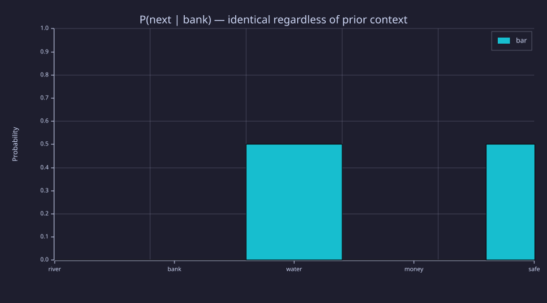
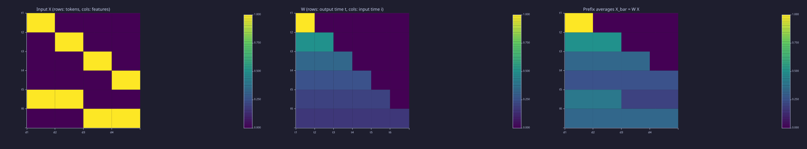
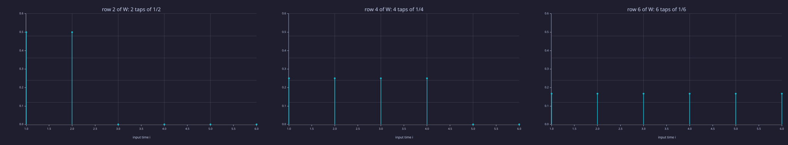
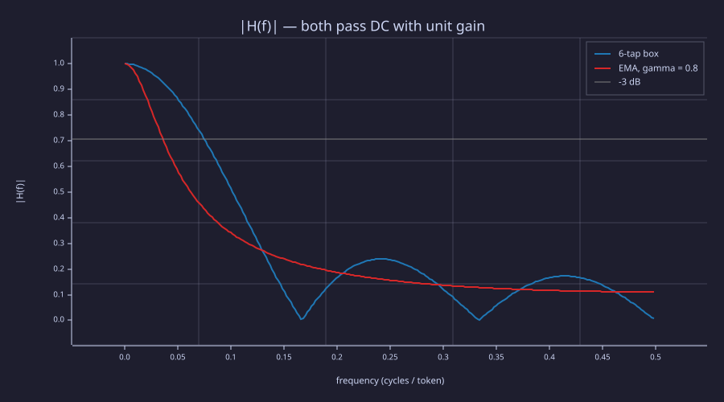

<!-- Generated by rustlab-notebook — do not edit directly. -->

# Lesson 07: Context and Naive Averaging

The bigram model ([05-bigram-language-model](05-bigram-language-model.md)) predicts the next token from a single previous token. That's a structural limit — no amount of data can make it context-aware. Fixing this means letting the prediction depend on *all* earlier tokens. The simplest aggregator is the **prefix average**. Writing it as a matrix multiply is the bridge to attention ([08-scaled-dot-product-attention](08-scaled-dot-product-attention.md)); reading that multiply as a **causal filter along the token axis** is the frame the rest of the course keeps.

## Learning Objectives

- Explain why a **bigram** (Markov-1) language model is context-free beyond a single previous token, and measure that failure in bits.
- Define **prefix averaging** — the simplest context-aware aggregation — as $\bar{\mathbf{x}}_t = \frac{1}{t}\sum_{i=1}^{t} \mathbf{x}_i$.
- Rewrite that sum as a **matrix multiplication** $\bar{\mathbf{X}} = \mathbf{W}\mathbf{X}$ where $\mathbf{W}$ is a lower-triangular averaging matrix, and read it as a causal, time-varying FIR filter.
- Read the lower-triangular causal structure of $\mathbf{W}$ and explain why it enforces the "no peek at the future" rule.
- Articulate the remaining weaknesses of uniform averaging — every past token gets equal weight, and order is lost — that motivate **attention** (Lesson 08).

## Background

Bigram language models, row-normalised probability matrices and the entropy chain rule from [05-bigram-language-model](05-bigram-language-model.md). Linear layers and matrix multiplication from [06-linear-layers-and-gradient-descent](06-linear-layers-and-gradient-descent.md). Embeddings as dense row vectors from [04-embeddings-and-similarity](04-embeddings-and-similarity.md). The Engineering Lenses assume you have met a moving-average (FIR) filter and a one-pole (IIR) low-pass and their frequency responses. Notation follows [00-the-llm-as-a-system](00-the-llm-as-a-system.md): tokens are rows (time $t$), features are columns.

## Where the Bigram Fails

### Theory

Consider two sentences sharing an ambiguous token:

- `river bank water`
- `money bank safe`

`bank` is the same token in both, but its continuation depends on the history. A bigram sees only the previous token, so both histories collapse to the same row of $\mathbf{P}$.

### Example — P(next | bank) collapses to a 50/50

```rustlab
vocab_size = 5;
% river=1, bank=2, water=3, money=4, safe=5

C = zeros(vocab_size, vocab_size);
C(1, 2) = 1;   % river -> bank
C(2, 3) = 1;   % bank  -> water
C(4, 2) = 1;   % money -> bank
C(2, 5) = 1;   % bank  -> safe

P = zeros(vocab_size, vocab_size);
for i = 1:vocab_size
  row_sum = sum(C(i, :));
  if row_sum > 0
    P(i, :) = C(i, :) / row_sum;
  end
end

p_after_bank = P(2, :);
```

The bigram's continuation distribution after `bank` is

$$P(\text{next} \mid \text{bank}) = [0, 0, 0.5, 0, 0.5].$$

P(water | bank) = $0.50$, P(safe | bank) = $0.50$ — whether the history was `river bank` or `money bank`. The model has no mechanism to tell them apart.

### Example — Bar of P(next | bank)

```rustlab
figure();
labels = {"river", "bank", "water", "money", "safe"};
bar(labels, p_after_bank)
title("P(next | bank) — identical regardless of prior context")
ylabel("Probability")
ylim([0, 1])
```

<!-- rustlab:output-start -->


<!-- rustlab:output-end -->

> [!TIP]
> Two equal bars: one full bit of uncertainty that the earlier token (`river` or `money`) would have removed. The Information lens below puts a number on it.

This is a structural failure, not a data failure.

## The Fix: Summarise the Whole Prefix

### Theory

If the prediction depends only on the *last* token, it can't see prior context. So let the state at position $t$ summarise *every* earlier token. The simplest summary is the average

$$\bar{\mathbf{x}}_t \;=\; \frac{1}{t}\sum_{i=1}^{t} \mathbf{x}_i.$$

Each $\bar{\mathbf{x}}_t$ is a "bag of past tokens" — every prior embedding blended in with equal weight.

## Rewrite as a Matrix Multiply

### Theory

Stack embeddings into $\mathbf{X} \in \mathbb{R}^{T \times d}$ and define a **lower-triangular** averaging matrix $\mathbf{W}$:

$$\mathbf{W}_{t, i} = \begin{cases} \frac{1}{t} & i \le t \\ 0 & i > t. \end{cases}$$

Then the entire stack of prefix averages is a single matrix multiply

$$\bar{\mathbf{X}} \;=\; \mathbf{W}\mathbf{X}.$$

The upper triangle is zero — this is the **causal** constraint: position $t$ cannot see a future token. (In the course notation this $\mathbf{W}$ is the mixing matrix $\mathbf{A}$ of [08-scaled-dot-product-attention](08-scaled-dot-product-attention.md) in its uniform special case; from Lesson 08 on, $\mathbf{W}$ denotes a learned projection.)

### Example — Build W and the input embeddings X

```rustlab
T = 6;
d = 4;

% Rows 1-4 are the one-hot basis; row 5 = x1 + x2 and row 6 = x3 + x4,
% so the averages can be checked by hand.
X = [ 1.0, 0.0, 0.0, 0.0;
      0.0, 1.0, 0.0, 0.0;
      0.0, 0.0, 1.0, 0.0;
      0.0, 0.0, 0.0, 1.0;
      1.0, 1.0, 0.0, 0.0;
      0.0, 0.0, 1.0, 1.0 ];

W = zeros(T, T);                                 % (a) the definition, cell by cell
for t = 1:T
  for i = 1:t
    W(t, i) = 1.0 / t;
  end
end
W_vec  = cumsum(eye(T), 1) ./ repmat((1:T)', 1, T);   % (b) mask [i <= t] divided by the row index t
diff_W = max(reshape(abs(W - W_vec), 1, T * T));
print("max|W_loop - W_vec| =", diff_W);
```

<!-- rustlab:output-start -->
```text
max|W_loop - W_vec| = 0
```

<!-- rustlab:output-end -->

Form (b) mirrors the math $W_{t, i} = \frac{1}{t} \cdot [i \le t]$: `cumsum(eye(T), 1)` extends each diagonal 1 down its column (the causal mask), and dividing by the row index sets the weight. It generalises at once — another mask, or another per-row weighting, as the Engineering Lenses do below. (The running-sum loop that the multiply replaces appears in the Systems lens.)

### Example — Read X̄ back by hand

```rustlab
X_bar_mm = W * X;
x_bar_3_expected = [1/3, 1/3, 1/3, 0];
err_row3 = max(abs(X_bar_mm(3, :) - x_bar_3_expected));
print("x_bar_3 =", X_bar_mm(3, :), "  max|error| =", err_row3);
print("x_bar_6 =", X_bar_mm(6, :));
```

<!-- rustlab:output-start -->
```text
x_bar_3 = [1×4]  0.333333  0.333333  0.333333  0.000000   max|error| = 0
x_bar_6 = [1×4]  0.333333  0.333333  0.333333  0.333333
```

<!-- rustlab:output-end -->

Row 3 is $(\mathbf{x}_1 + \mathbf{x}_2 + \mathbf{x}_3)/3 = [\tfrac13, \tfrac13, \tfrac13, 0]$ (error $0.0e+00$). Row 6 is more telling: rows 5 and 6 of $\mathbf{X}$ were $\mathbf{x}_1 + \mathbf{x}_2$ and $\mathbf{x}_3 + \mathbf{x}_4$, so the six rows sum to $[2, 2, 2, 2]$ and $\bar{\mathbf{x}}_6 = [\tfrac13, \tfrac13, \tfrac13, \tfrac13]$ — perfectly flat. From $\bar{\mathbf{x}}_6$ alone you cannot tell which token came last, or that token 6 was `x3+x4` rather than `x1+x2`. The average has kept the *set* of features and thrown away order and salience.

### Example — X, W and X̄ side by side

```rustlab
positions = {"t1", "t2", "t3", "t4", "t5", "t6"};
dims = {"d1", "d2", "d3", "d4"};

figure();
subplot(1, 3, 1)
heatmap(dims, positions, X, "Input X (rows: tokens, cols: features)", "viridis")
subplot(1, 3, 2)
heatmap(positions, positions, W, "W (rows: output time t, cols: input time i)", "viridis")
subplot(1, 3, 3)
heatmap(dims, positions, X_bar_mm, "Prefix averages X_bar = W X", "viridis")
```

<!-- rustlab:output-start -->


<!-- rustlab:output-end -->

> [!TIP]
> Left to right: sharp one-hot rows; the causal triangle whose row $t$ is $t$ equal cells of $1/t$; and the blurred result whose last row is a single flat colour.

## The Remaining Weakness

### Theory

Uniform $1/t$ weights treat every past token as equally informative, and the average is **order-blind**: any permutation of the first $t$ tokens gives the same $\bar{\mathbf{x}}_t$. In *"the cat sat on the mat, it was soft"*, the model standing at `was` must predict $X_{t+1} = $ `soft`; the token that tells it what *it* refers to is `mat`, several positions back, while `the`, `on` and the comma tell it essentially nothing.

**Information-theoretic framing.** Let $X_{t+1}$ be the next token and $X_{1..t}$ the prefix — the same target every later lesson uses. By the chain rule of entropy from [05-bigram-language-model](05-bigram-language-model.md), $H(X_{t+1} \mid X_t) \ge H(X_{t+1} \mid X_{1..t})$: extra context never hurts, and the gap is the conditional mutual information $I(X_{t+1};\, X_{1..t-1} \mid X_t)$ — bits about the next token that live further back than one position. Those bits are spread very unevenly over the prefix: $I(X_{t+1};\, X_i \mid X_{i+1..t})$ is large for $i = $ `mat` and near zero for $i = $ `the`. A uniform average cannot exploit that unevenness — it dilutes the informative token by $1/t$ along with everything else.

That is exactly what **attention** does. It replaces the fixed $1/t$ entries of $\mathbf{W}$ with $\mathrm{softmax}(\text{scores})$, where the scores depend on query and key vectors derived from the embeddings themselves — so the model can route weight toward whichever past tokens carry the most information about the next. The lower-triangular (causal) structure and the per-row weighted sum stay identical.

## Engineering Lenses

### Signals

**Exact.** $\bar{\mathbf{X}} = \mathbf{W}\mathbf{X}$ is a **causal, linear, time-varying FIR filter** along the token axis. Output time $t$ is $\bar{\mathbf{x}}_t = \sum_{i \le t} h_t[t - i]\, \mathbf{x}_i$ with taps $h_t[n] = W_{t,\,t-n}$: row $t$ of $\mathbf{W}$ *is* the impulse response observed at output time $t$ — a box of $t$ taps of height $1/t$. The filter acts on each of the $d$ feature columns independently, so it is $d$ identical channels.

```rustlab
figure();
rows_to_show = [2, 4, 6];
for k = 1:3
  t = rows_to_show(k);
  subplot(1, 3, k)
  stem(1:T, W(t, :))
  title(sprintf("row %d of W: %d taps of 1/%d", t, t, t))
  xlabel("input time i")
  ylim([0, 0.6])
end
```

<!-- rustlab:output-start -->


<!-- rustlab:output-end -->

> [!TIP]
> The box grows with $t$ and its height falls as $1/t$: the window never forgets, and each new token gets a smaller share. Time-varying because the impulse response at time 6 is not the one at time 2.

**Exact.** The exponential moving average $y_t = \gamma\, y_{t-1} + (1 - \gamma)\, x_t$ is a first-order **IIR** filter with one pole at $z = \gamma$ and impulse response $(1-\gamma)\gamma^{n}$, $n \ge 0$. Renormalised over the tokens available at time $t$ it is another causal mixing matrix, $W^{\text{ema}}_{t,i} = (1 - \gamma)\gamma^{t-i} / (1 - \gamma^{t})$ for $i \le t$ — same triangle, geometric rows instead of flat ones. The box forgets nothing; the EMA forgets with time constant $-1/\ln\gamma$ tokens.

```rustlab
gamma = 0.8;
W_ema = zeros(T, T);
for t = 1:T
  for i = 1:t
    W_ema(t, i) = (1 - gamma) * gamma ^ (t - i) / (1 - gamma ^ t);
  end
end
tau_ema = -1 / log(gamma);
print("W     row 6 =", W(6, :));
print("W_ema row 6 =", W_ema(6, :), "  (sums to", sum(W_ema(6, :)), ")");
print("EMA pole z = gamma =", gamma, "  time constant =", tau_ema, "tokens");
```

<!-- rustlab:output-start -->
```text
W     row 6 = [1×6]  0.166667  0.166667  0.166667  0.166667  0.166667  0.166667
W_ema row 6 = [1×6]  0.088819  0.111024  0.138780  0.173476  0.216844  0.271056   (sums to 1.0000000000000002 )
EMA pole z = gamma = 0.8   time constant = 4.481420117724551 tokens
```

<!-- rustlab:output-end -->

**Model.** Freeze the window at $t = T$ and the row becomes an LTI filter with a frequency response — "smoother" means **low-pass**. Frequency is in cycles per token (Nyquist $= 0.5$): a feature that flips sign every token is at $0.5$, a topic that persists for a paragraph is near DC. `freqz` of the $T$-tap box against the EMA (its impulse response truncated at 64 taps, $\gamma^{64} < 10^{-6}$):

```rustlab
n_f = 256;
h_box = ones(1, T) / T;                        % row T of W: a T-tap box
h_ema = (1 - gamma) * gamma .^ (0:63);         % one-pole IIR, truncated
R_box = freqz(h_box, n_f, 1.0);                % row 1: f (cycles/token), row 2: H(f) complex
R_ema = freqz(h_ema, n_f, 1.0);
f = real(R_box(1, :));
H_box = abs(R_box(2, :));
H_ema = abs(R_ema(2, :));
print("box first null at 1/T =", 1 / T, "   EMA gain at Nyquist (1-g)/(1+g) =", (1 - gamma) / (1 + gamma), " measured", H_ema(end));

figure();
plot(f, H_box, "color", "blue", "label", "6-tap box")
hold("on")
plot(f, H_ema, "color", "red", "label", "EMA, gamma = 0.8")
hline(1 / sqrt(2), "gray", "-3 dB")
hold("off")
title("|H(f)| — both pass DC with unit gain")
xlabel("frequency (cycles / token)")
ylabel("|H(f)|")
legend("6-tap box", "EMA, gamma = 0.8", "-3 dB")
```

<!-- rustlab:output-start -->
```text
box first null at 1/T = 0.16666666666666666    EMA gain at Nyquist (1-g)/(1+g) = 0.11111111111111108  measured 0.1111131276434191
```



<!-- rustlab:output-end -->

> [!TIP]
> Both curves start at 1 (rows sum to 1, so DC passes unchanged). The box has nulls at multiples of $1/6$ and sidelobes between them — a sinc; the EMA rolls off monotonically and never gets below $(1-\gamma)/(1+\gamma) = 0.11$. The box crosses −3 dB later than the EMA: the 6-token box is the sharper, but leakier, low-pass.

**Analogy.** Attention ([08-scaled-dot-product-attention](08-scaled-dot-product-attention.md)) keeps this FIR form but computes the taps from the signal itself — an *adaptive* filter in spirit, though with no error-driven tap update at inference time.

### Systems

**Exact.** The running mean is a first-order system: $\bar{\mathbf{x}}_t = \bar{\mathbf{x}}_{t-1} + \tfrac{1}{t}\,(\mathbf{x}_t - \bar{\mathbf{x}}_{t-1})$ (multiply the definition by $t$ and subtract the $t-1$ case). Its gain $1/t$ decays to zero, so the state responds less and less to new input — token 100 moves the average by 1 %. The EMA is the same recursion with constant gain $1 - \gamma$: fixed pole, fixed memory. [16-adamw-optimizer](16-adamw-optimizer.md) reuses exactly this one-pole system on gradients.

```rustlab
X_bar_rec = zeros(T, d);
x_bar = zeros(1, d);
for t = 1:T
  x_bar = x_bar + (X(t, :) - x_bar) / t;       % state update with gain 1/t
  X_bar_rec(t, :) = x_bar;
end
diff_rec = max(reshape(abs(X_bar_rec - X_bar_mm), 1, T * d));
print("max|recursion - W*X| =", diff_rec);
print("running-mean gains 1/t:", 1 ./ (1:T), "   EMA gain 1 - gamma:", 1 - gamma);
```

<!-- rustlab:output-start -->
```text
max|recursion - W*X| = 0.00000000000000005551115123125783
running-mean gains 1/t: [1×6]  1.000000  0.500000  0.333333  0.250000  0.200000  0.166667    EMA gain 1 - gamma: 0.19999999999999996
```

<!-- rustlab:output-end -->

### Information

**Exact.** Conditioning cannot increase entropy, so $H(X_{t+1} \mid X_t) \ge H(X_{t+1} \mid X_{1..t})$, and the difference is the bits a longer context recovers. On the two-sentence corpus both sides are computable by the chain rule $H(X_{t+1} \mid \text{ctx}) = H(\text{ctx}, X_{t+1}) - H(\text{ctx})$ with empirical distributions (the helper below builds them; `entropy_bits` is from `lib/info.rlab`).

```rustlab
function H = empirical_entropy_bits(labels)
  % entropy (bits) of the empirical distribution of a vector of integer labels
  counts = zeros(max(labels));
  for m = 1:length(labels)
    counts(labels(m)) = counts(labels(m)) + 1;
  end
  H = entropy_bits(counts / sum(counts));
end

sents = [1, 2, 3;      % river bank water
         4, 2, 5];     % money bank safe
base = vocab_size + 1;
prev = []; ctx = []; nxt = [];
for s = 1:2
  for t = 1:2
    prev = [prev, sents(s, t)];                             % bigram context: last token only
    ctx  = [ctx, sents(s, 1:t) * (base .^ (0:t-1))'];      % full-prefix context, as one integer id
    nxt  = [nxt, sents(s, t + 1)];
  end
end
H_bank   = entropy_bits(P(2, :));
H_bigram = empirical_entropy_bits(prev + base * nxt) - empirical_entropy_bits(prev);
H_prefix = empirical_entropy_bits(ctx + base ^ 3 * nxt) - empirical_entropy_bits(ctx);
print("H(next | bank)               =", H_bank, "bits");
print("H(X_{t+1} | X_t)             =", H_bigram, "bits  (average over the corpus)");
print("H(X_{t+1} | X_{1..t})        =", H_prefix, "bits");
print("I(X_{t+1}; X_{1..t-1} | X_t) =", H_bigram - H_prefix, "bits recovered by the prefix");
order_bits_6 = log2(prod(1:6));
print("order bits a bag of 6 distinct tokens discards: log2(6!) =", order_bits_6);
```

<!-- rustlab:output-start -->
```text
H(next | bank)               = 1 bits
H(X_{t+1} | X_t)             = 0.5 bits  (average over the corpus)
H(X_{t+1} | X_{1..t})        = 0 bits
I(X_{t+1}; X_{1..t-1} | X_t) = 0.5 bits recovered by the prefix
order bits a bag of 6 distinct tokens discards: log2(6!) = 9.491853096329674
```

<!-- rustlab:output-end -->

After `bank` the bigram is left with $1.0$ bit; averaged over every position it is $0.50$ bits per token, and the full prefix drives it to $0.0$ — every sentence is determined by its first token. The $0.50$-bit gap is the *floor difference* between the Lesson 05 model class and any context-aware one on this corpus; [08-scaled-dot-product-attention](08-scaled-dot-product-attention.md) measures, row by row, how much of a prefix an attention head actually uses.

**Exact.** The prefix average is permutation-invariant, so at position $t$ it also discards the $\log_2 t!$ bits that distinguish the orderings of $t$ distinct tokens — $9.49$ bits at $t = 6$. [10-positional-encoding](10-positional-encoding.md) puts them back.

## Key Takeaways

- A bigram's next-token distribution depends only on the previous token; histories that share the same last token are indistinguishable — on the toy corpus that costs 0.5 bits per token.
- The simplest context-aware summary is a **prefix average** over all tokens $1..t$; it is a single matrix multiply $\bar{\mathbf{X}} = \mathbf{W}\mathbf{X}$ with $\mathbf{W}$ lower-triangular and each row normalised to sum to 1.
- $\mathbf{W}$ is a causal, time-varying FIR filter along the token axis — a growing box, hence a low-pass; the EMA is its one-pole IIR cousin, and both have a one-line recursive state update.
- The lower-triangular shape encodes **causality** — position $t$ cannot look at the future.
- Uniform averaging discards *which* past tokens matter and *in what order* — the next lesson replaces the fixed taps with data-dependent ones.

## Standalone Scripts

| Script | What it computes |
|---|---|
| `context_failure.rlab` | bigram count + probability matrix on the `bank` corpus; bar of $P(\text{next} \mid \text{bank})$ |
| `prefix_averaging.rlab` | prefix averages two ways (running-sum loop and matrix multiply); hand read-back of rows 3 and 6; labelled heatmaps of $\mathbf{X}$, $\mathbf{W}$, $\bar{\mathbf{X}}$ |
| `averaging_as_fir.rlab` | rows of $\mathbf{W}$ as impulse responses; the EMA mixing matrix; recursive updates; `freqz` of the box vs the one-pole IIR |
| `context_entropy.rlab` | $H(X_{t+1} \mid X_t)$ vs $H(X_{t+1} \mid X_{1..t})$ on the corpus via the chain rule; the order bits a bag of tokens discards |

Run all with `make lesson-07` (or `rustlab run lessons/07-context-and-naive-averaging/<name>.rlab`).

## Expected Numerical Outputs Summary

| Variable | Expected Value |
|---|---|
| `p_after_bank(3)` ($P(\text{water}\mid\text{bank})$) | `0.50` |
| `p_after_bank(5)` ($P(\text{safe}\mid\text{bank})$) | `0.50` |
| `W(1, 1)`; `W(2, 1)`, `W(2, 2)`; `W(t, i)`, $i \le t$; `W(t, i)`, $i > t$ | `1.0`; `0.5` each; `1/t`; `0` |
| `diff_W`, `diff_rec` (loop vs vectorised $\mathbf{W}$; recursion vs $\mathbf{W}\mathbf{X}$) | `0` / ≈ `0` (machine epsilon) |
| `X_bar_mm(3, :)`, `X_bar_mm(6, :)` | `[1/3, 1/3, 1/3, 0]`, `[1/3, 1/3, 1/3, 1/3]` |
| `W_ema(6, :)` ($\gamma = 0.8$) | `[0.089, 0.111, 0.139, 0.173, 0.217, 0.271]`, sums to `1` |
| `tau_ema` ($-1/\ln 0.8$) | `4.48` tokens |
| `1/T` (box first null), `(1-g)/(1+g)` (EMA at Nyquist) | `0.1667`, `0.1111` |
| `H_bank`, `H_bigram`, `H_prefix` | `1`, `0.5`, `0` bits |
| `order_bits_6` ($\log_2 6!$) | `9.49` bits |

## Exercises

1. **Extending the ambiguity.** Modify `context_failure.rlab` to add a third sentence `river bank fish`. What does $P(\text{next} \mid \text{bank})$ become, and what are $H(X_{t+1} \mid X_t)$ and $H(X_{t+1} \mid X_{1..t})$ now? Why does adding more data *not* fix the underlying structural problem?
2. **Box length and bandwidth.** In `averaging_as_fir.rlab`, plot $\lvert H(f) \rvert$ for boxes of length $L = 2, 4, 8, 16$ and find each −3 dB frequency (first $f$ where $\lvert H \rvert < 1/\sqrt{2}$). Show that it scales roughly as $0.44 / L$ cycles/token. What does it mean, for a language model, that a longer context window is a *narrower* low-pass?
3. **Non-causal averaging.** What matrix $\mathbf{W}'$ would average *all* tokens (past and future) uniformly at every position? Write it out for $T=4$. Why is this wrong for language modelling but fine for, e.g., sentence classification?
4. **Counting operations.** For a sequence of length $T$ and embedding dimension $d$, how many scalar multiplies does $\mathbf{W}\mathbf{X}$ take? How does this scale with $T$? (Hint: count the non-zero entries of $\mathbf{W}$.) How many does the recursive update take?
5. **Preview of attention.** In attention (Lesson 08), the weights in row $t$ of $\mathbf{W}$ are replaced by $\mathrm{softmax}(\mathbf{q}_t \mathbf{K}^\top / \sqrt{d_k})$, still with a causal mask. What property of softmax guarantees each row still sums to 1 — and therefore that DC still passes with unit gain?
## What's next

[08-scaled-dot-product-attention](08-scaled-dot-product-attention.md) replaces the fixed $1/t$ taps with **learned, content-dependent** ones derived from query and key projections of the embeddings. The matrix shape and the causal mask stay; only the entries change — and that change is the entire mechanism behind modern transformer attention.
