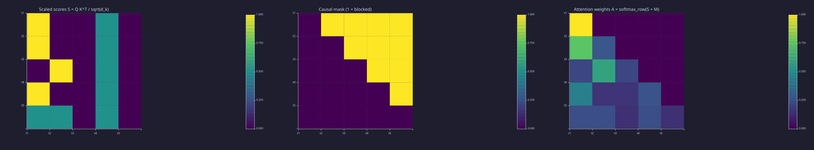
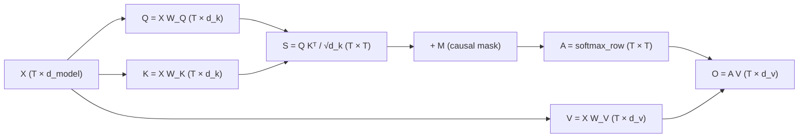
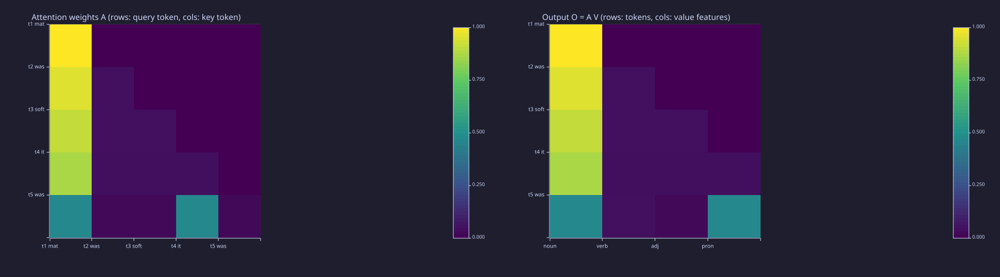
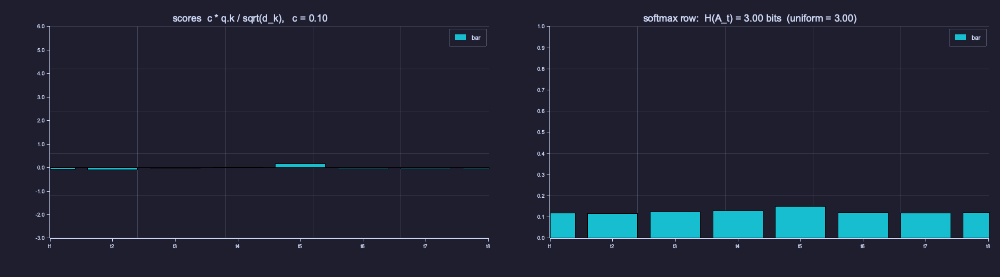

<!-- Generated by rustlab-notebook — do not edit directly. -->

# Lesson 08: Scaled Dot-Product Attention

[07-context-and-naive-averaging](07-context-and-naive-averaging.md) rewrote causal prefix averaging as a matrix multiply $\bar{\mathbf{X}} = \mathbf{W}\mathbf{X}$ where $\mathbf{W}$ was lower-triangular with fixed $1/t$ weights — a causal FIR filter along the token axis. Attention keeps the same skeleton but makes the taps **learned** and **data-dependent**. This lesson derives the full operation:

$$\mathrm{Attn}(\mathbf{Q},\mathbf{K},\mathbf{V}) \;=\; \mathrm{softmax}\!\left(\frac{\mathbf{Q}\mathbf{K}^\top}{\sqrt{d_k}} + \mathbf{M}\right)\mathbf{V}.$$

One renaming, stated once: Lesson 07's mixing matrix $\mathbf{W}$ is called $\mathbf{A}$ from here on (rows = query time $t$, columns = key time $i \le t$), and $\mathbf{W}$ now denotes a learned projection such as $\mathbf{W}_Q$.

## Learning Objectives

- Define the **query**, **key**, and **value** matrices $\mathbf{Q}, \mathbf{K}, \mathbf{V}$ derived from a sequence of embeddings via three learned linear projections, and say why they are three *different* projections.
- Write and explain the scaled dot-product attention equation $\mathrm{Attn}(\mathbf{Q},\mathbf{K},\mathbf{V}) = \mathrm{softmax}\!\left(\tfrac{\mathbf{Q}\mathbf{K}^\top}{\sqrt{d_k}}\right)\mathbf{V}$ one piece at a time.
- Motivate the $1/\sqrt{d_k}$ scale from the variance of a dot product of independent vectors, and measure what it does to the entropy of an attention row.
- Apply a **causal mask** so position $t$ cannot see tokens at positions $> t$ and verify the resulting attention matrix is lower-triangular.
- Read attention as a correlation receiver, a kernel smoother and an associative memory, and read a hand-built attention matrix entry by entry.

## Background

Embeddings as dense row vectors and the dot product as a correlator from [04-embeddings-and-similarity](04-embeddings-and-similarity.md). Softmax, entropy and probability row-normalisation from [02-probability-and-softmax](02-probability-and-softmax.md) and [03-cross-entropy-loss](03-cross-entropy-loss.md). Linear layers from [06-linear-layers-and-gradient-descent](06-linear-layers-and-gradient-descent.md), where a layer was written $\mathbf{y} = \mathbf{W}\mathbf{x} + \mathbf{b}$ with $\mathbf{x}$ a column vector. Here rows are tokens, so we right-multiply instead: $\mathbf{X}\mathbf{W}$ applies the same linear map to every row of $\mathbf{X}$ at once. Causal prefix averaging as a time-varying FIR filter from [07-context-and-naive-averaging](07-context-and-naive-averaging.md). Entropies are computed with `lib/info.rlab`.

## Queries, Keys, Values

### Theory

Given an input $\mathbf{X} \in \mathbb{R}^{T \times d_{\text{model}}}$ (row $t$ is the embedding of token $t$), three learned linear projections produce three matrices:

$$\mathbf{Q} = \mathbf{X}\mathbf{W}_Q \in \mathbb{R}^{T \times d_k}, \quad \mathbf{K} = \mathbf{X}\mathbf{W}_K \in \mathbb{R}^{T \times d_k}, \quad \mathbf{V} = \mathbf{X}\mathbf{W}_V \in \mathbb{R}^{T \times d_v}.$$

- $\mathbf{W}_Q, \mathbf{W}_K \in \mathbb{R}^{d_{\text{model}} \times d_k}$ — project each embedding into a **query** and **key** vector.
- $\mathbf{W}_V \in \mathbb{R}^{d_{\text{model}} \times d_v}$ — project into a **value** vector.

Each token emits three vectors: a **query** (what it's looking for), a **key** (what it advertises), a **value** (what it contributes if selected). They are separate projections because what a token asks for, what it advertises, and what it hands over are three different things — a pronoun asks for a noun, advertises "pronoun", and hands over whatever features the next layer needs. The parameters are learned by gradient descent ([06-linear-layers-and-gradient-descent](06-linear-layers-and-gradient-descent.md)); once trained, they encode which features matter for prediction.

### Example — Hand-crafted Q and K with an interpretable pattern

```rustlab
T = 5;
d_k = 4;
scale = 1.0 / sqrt(d_k);

% Hand-crafted Q, K designed so the attention pattern is interpretable.
% Key 1 advertises feature 1 loudly; queries 2 and 4 look for feature 1;
% query 3 looks for feature 2, which key 2 advertises; query 5 wants a bit of both.
K = [ 2.0, 0.0, 0.0, 0.0;
      0.0, 2.0, 0.0, 0.0;
      0.0, 0.0, 2.0, 0.0;
      1.0, 1.0, 0.0, 0.0;
      0.0, 0.0, 1.0, 1.0 ];

Q = [ 1.0, 0.0, 0.0, 0.0;
      1.0, 0.0, 0.0, 0.0;
      0.0, 1.0, 0.0, 0.0;
      1.0, 0.0, 0.0, 0.0;
      0.5, 0.5, 0.0, 0.0 ];
```

The pay-off of this design is read off $\mathbf{A}$ below, entry by entry.

## The Score Matrix

### Theory

Entry $(t, i)$ of $\mathbf{S} = \mathbf{Q}\mathbf{K}^\top$ is the dot product $\mathbf{q}_t \cdot \mathbf{k}_i$ — a raw similarity between query $t$ and key $i$.

**Why divide by $\sqrt{d_k}$?** If $\mathbf{q}$ and $\mathbf{k}$ are independent of each other and each has $d_k$ i.i.d. components with mean 0 and variance 1, then $\mathbf{q}\cdot\mathbf{k} = \sum_{j=1}^{d_k} q_j k_j$ has variance $d_k$ (sum of $d_k$ independent unit-variance products) and so standard deviation $\sqrt{d_k}$. As $d_k$ grows, raw dot products grow too, softmax becomes razor-sharp (one entry approaches 1, others approach 0), and gradients vanish. Scaling by $1/\sqrt{d_k}$ keeps the input to softmax at roughly unit variance regardless of dimension:

$$\mathbf{S}_{\text{scaled}} = \frac{\mathbf{Q}\mathbf{K}^\top}{\sqrt{d_k}}.$$

### Example — Compute the scaled score matrix

```rustlab
S = Q * K' * scale;
```

### Example — Empirical variance grows with $d_k$, and softmax saturates without scaling

The variance argument above is the central justification for the $1/\sqrt{d_k}$ factor in the original *Attention Is All You Need* paper. Verify it numerically: sample i.i.d. $\mathcal{N}(0, 1)$ vectors at three dimensions and measure $\mathrm{Var}(\mathbf{q}\cdot\mathbf{k})$. (Names ending in `_v` are local to this example so the global `T`, `Q`, `K` from earlier blocks stay intact for the sections below.)

```rustlab
seed(8);
n_samples = 5000;
dks = [4, 64, 512];
for kk = 1:3
  dk_v = dks(kk);
  dots_v = zeros(n_samples);
  for s = 1:n_samples
    q_v = randn(1, dk_v);
    k_v = randn(1, dk_v);
    dots_v(s) = sum(q_v .* k_v);
  end
  var_v = mean(dots_v .^ 2);          % variance, since dots have mean ~0
  ratio_v = var_v / dk_v;             % variance of (q.k)/sqrt(d_k) is ratio_v
  print("d_k =", dk_v, "  Var(q.k) =", var_v, "  Var(q.k) / d_k =", ratio_v);
end
```

<!-- rustlab:output-start -->
```text
d_k = 4   Var(q.k) = 3.9421480253630032   Var(q.k) / d_k = 0.9855370063407508
d_k = 64   Var(q.k) = 64.25729915186785   Var(q.k) / d_k = 1.0040202992479352
d_k = 512   Var(q.k) = 528.3374583922757   Var(q.k) / d_k = 1.0319090984224135
```

<!-- rustlab:output-end -->

The expected ratio is $\approx 1$ at every $d_k$ — the variance scales linearly with $d_k$, which is why dividing by $\sqrt{d_k}$ restores unit-variance scores regardless of dimension. The downstream consequence, measured on one row at $d_k = 512$ with the row's entropy in bits as the yardstick:

```rustlab
seed(8);
dk_v = 512;
T_v  = 8;
Q_v = randn(T_v, dk_v);
K_v = randn(T_v, dk_v);
S_unscaled_v = Q_v * K_v';                            % raw dot products, variance ~512
S_scaled_v   = Q_v * K_v' * (1.0 / sqrt(dk_v));        % unit variance after scaling
A_unscaled_v = softmax(S_unscaled_v(1, :));            % row 1 of the attention distribution
A_scaled_v   = softmax(S_scaled_v(1, :));
H_unscaled_v = entropy_bits(A_unscaled_v);
H_scaled_v   = entropy_bits(A_scaled_v);
print("unscaled: max A =", max(A_unscaled_v), "  H(A) =", H_unscaled_v, "bits");
print("scaled:   max A =", max(A_scaled_v),   "  H(A) =", H_scaled_v, "bits   (uniform over 8 =", log2(T_v), "bits)");
```

<!-- rustlab:output-start -->
```text
unscaled: max A = 0.9999999999999583   H(A) = 0.000000000001914218322257698 bits
scaled:   max A = 0.5235101584047486   H(A) = 2.1887527342740865 bits   (uniform over 8 = 3 bits)
```

<!-- rustlab:output-end -->

Unscaled, the row puts $\approx 1.0$ on one position and carries $1.9e-12$ bits — a hard selector. Scaled, the same row spreads (max $0.52$, $2.19$ of the $3$ available bits) and the model can actually *blend* values across positions. **Preview of [15-backpropagation](15-backpropagation.md):** the diagonal of the softmax Jacobian is $p(1-p)$, which goes to 0 as $p \to 1$, so a saturated row passes no gradient through *any* column, the argmax included — training stalls. The $\sqrt{d_k}$ factor is what keeps attention trainable in practice. The Information lens below animates the whole transition from flat to one-hot.

## The Causal Mask

### Theory

For a language model, token $t$ must not see tokens at positions $i > t$. Add a mask $\mathbf{M}$ with entries $-\infty$ above the diagonal and 0 elsewhere:

$$M_{t, i} = \begin{cases} 0 & i \le t \\ -\infty & i > t. \end{cases}$$

In code the mask is a large finite negative number ($-10^9$) rather than literal $-\infty$. For a *causal* mask that is a convenience, not a necessity: every row keeps its diagonal, so the row maximum that a numerically stable softmax subtracts is finite, $-\infty - \max$ is still $-\infty$, and $\exp(-\infty) = 0$ exactly. The genuine failure case is a row that is masked *entirely* — padding positions in batched training — where $-\infty - (-\infty) = \text{NaN}$. The other honest reason is portability: frameworks add the mask in the tensor's own dtype, and a finite "very negative" constant chosen per dtype ($-10^9$ would itself overflow fp16) works for float and integer masks alike.

### Example — Apply the mask to S

```rustlab
NEG_INF = -1.0e9;
M = NEG_INF * (1 - cumsum(eye(T), 1));   % 0 on / below the diagonal, -1e9 above (Lesson 07's mask trick)
S_masked = S + M;
```

## Row-wise Softmax → Attention Weights

### Theory

Applying softmax to each row turns the scores into a probability distribution. The $-10^9$ entries become exactly 0:

$$A_{t, i} = \frac{\exp(\tilde S_{t, i})}{\sum_{j=1}^{T} \exp(\tilde S_{t, j})}.$$

### Example — Build A and read it back

```rustlab
% softmax(M) acts on each row independently (dim = 2 default, ML convention),
% so the whole attention matrix is one call; the per-row max subtraction is automatic.
A = softmax(S_masked);
print("A =");
print(A);
```

<!-- rustlab:output-start -->
```text
A =
Matrix(5x5)
  [1.000000, 0.000000, 0.000000, 0.000000, 0.000000]
  [0.731059, 0.268941, 0.000000, 0.000000, 0.000000]
  [0.211942, 0.576117, 0.211942, 0.000000, 0.000000]
  [0.426933, 0.157060, 0.157060, 0.258948, 0.000000]
  [0.237357, 0.237357, 0.143964, 0.237357, 0.143964]
```

<!-- rustlab:output-end -->

Now read the design back. Row 2 puts $0.73$ on $t_1$ (query 2 asked for feature 1; key 1 has it) against $0.5$ under uniform averaging. Row 3 puts $0.58$ on $t_2$, the key advertising feature 2. Row 4 puts $0.43$ on $t_1$ — a token **three positions back**, retrieved by content, against the $0.25$ that Lesson 07's $1/4$ would give; its own half-strength key earns it $0.26$. Row 5's half-and-half query ties $t_1$, $t_2$ and $t_4$ at $0.24$ each. Token 1 can only attend to itself, so $A_{1,1} = 1.0000$; every row sums to 1; the largest entry in the upper triangle is $0.00e+00$ — zero, as causality requires.

### Example — Three-stage pipeline heatmap

Both axes are **token positions**: rows are the query positions $t$ (which token is asking) and columns are the key positions $i$ (which token is being read).

```rustlab
positions = {"t1", "t2", "t3", "t4", "t5"};
M_ind = (M < 0);   % 1 where the causal mask blocks attention, 0 elsewhere

figure();
subplot(1, 3, 1)
heatmap(positions, positions, S, "Scaled scores S = Q K^T / sqrt(d_k)", "viridis")
subplot(1, 3, 2)
heatmap(positions, positions, M_ind, "Causal mask (1 = blocked)", "viridis")
subplot(1, 3, 3)
heatmap(positions, positions, A, "Attention weights A = softmax_row(S + M)", "viridis")
```

<!-- rustlab:output-start -->


<!-- rustlab:output-end -->

> [!TIP]
> Left: a score lights up wherever a query's feature meets a key's feature (column $t_4$ is warm everywhere because key 4 carries both features). Middle: the blocked upper triangle. Right: the same triangle as Lesson 07's $\mathbf{W}$, but with mass pulled onto $t_1$ in rows 2 and 4 and onto $t_2$ in row 3.

## Full Pipeline: X → Q, K, V → Output

### Theory

Wire it all together: three projections, the score → mask → softmax chain, and the value mix $\mathbf{O} = \mathbf{A}\mathbf{V}$. Shapes on every edge:



> [!TIP]
> Only the $T \times T$ boxes mix along the token axis; every other box is a per-token linear map. That is why the causal mask lives in exactly one place.

### Example — Project X into Q, K, V

Five tokens, read as *"mat was soft, it was …"*. The columns of $\mathbf{X}$ are hand-labelled features `[noun, verb, adjective, pronoun, spare, spare]`, one-hot so the arithmetic can be followed by eye. The projections are chosen so that a pronoun *asks for* a noun but *advertises* "pronoun" — which is exactly why queries and keys must be different maps.

```rustlab
d_model = 6;
d_v = 4;
tokens = {"t1 mat", "t2 was", "t3 soft", "t4 it", "t5 was"};
X = [ 1, 0, 0, 0, 0, 0;     % mat   (noun)
      0, 1, 0, 0, 0, 0;     % was   (verb)
      0, 0, 1, 0, 0, 0;     % soft  (adjective)
      0, 0, 0, 1, 0, 0;     % it    (pronoun)
      0, 1, 0, 0, 0, 0 ];   % was   (verb, again)

% W_Q: what each kind of token LOOKS FOR. Query dim 1 = "a noun", dim 2 = "a pronoun".
W_Q = zeros(d_model, d_k);
W_Q(2, :) = [2, 2, 0, 0];   % a verb looks for its subject: a noun or a pronoun
W_Q(3, :) = [2, 0, 0, 0];   % an adjective looks for the noun it describes
W_Q(4, :) = [2, 0, 0, 0];   % a pronoun looks for the noun it stands for

% W_K: what each kind of token ADVERTISES, on the same dims.
W_K = zeros(d_model, d_k);
W_K(1, :) = [3, 0, 0, 0];   % a noun advertises "noun"
W_K(4, :) = [0, 3, 0, 0];   % a pronoun advertises "pronoun"
W_K(2, :) = [0, 0, 3, 0];   % verbs and adjectives advertise on dims no query asks for
W_K(3, :) = [0, 0, 0, 3];

% W_V: what a token HANDS OVER when selected — here its first four features, unchanged.
W_V = [eye(4); zeros(2, 4)];

Q2 = X * W_Q;
K2 = X * W_K;
V2 = X * W_V;
```

### Example — Compute attention weights and output, and read them back

```rustlab
S2 = Q2 * K2' * scale;
M2 = NEG_INF * (1 - cumsum(eye(T), 1));
A2 = softmax(S2 + M2);            % row-wise softmax in one call
O  = A2 * V2;
print("A2 =");
print(A2);
print("O =");
print(O);
```

<!-- rustlab:output-start -->
```text
A2 =
Matrix(5x5)
  [1.000000, 0.000000, 0.000000, 0.000000, 0.000000]
  [0.952574, 0.047426, 0.000000, 0.000000, 0.000000]
  [0.909443, 0.045279, 0.045279, 0.000000, 0.000000]
  [0.870049, 0.043317, 0.043317, 0.043317, 0.000000]
  [0.465255, 0.023164, 0.023164, 0.465255, 0.023164]
O =
Matrix(5x4)
  [1.000000, 0.000000, 0.000000, 0.000000]
  [0.952574, 0.047426, 0.000000, 0.000000]
  [0.909443, 0.045279, 0.045279, 0.000000]
  [0.870049, 0.043317, 0.043317, 0.043317]
  [0.465255, 0.046327, 0.023164, 0.465255]
```

<!-- rustlab:output-end -->

Query 4 (`it`) meets key 1 (`mat`) with score $2 \cdot 3 / \sqrt{4} = 3$ and every other visible key with score 0, so $A_{4,1} = e^{3}/(e^{3} + 3) = 0.870$: **token 4 retrieves token 1**, three positions back, against the $0.25$ uniform averaging would give. That is content-based retrieval — the thing Lesson 07 could not do. Row 2's verb finds its subject ($0.95$ on `mat`), row 3's adjective does too ($0.91$), and row 5's second verb has *two* candidate subjects and splits $0.465$ / $0.465$ between `mat` and `it` — attention represents the ambiguity instead of guessing. In the output, row 4 is $0.87$ of `mat`'s value plus three slivers of $0.043$: the `it` row now carries the noun's content. Row 1 of $\mathbf{O}$ equals row 1 of $\mathbf{V}$ (token 1 attends only to itself): $\max|\mathbf{O}_1 - \mathbf{V}_1| = 0.00e+00$. The block's learnable parameters are $3 \cdot d_{\text{model}} \cdot d_k = 3 \cdot 6 \cdot 4 = 72$ — a count that does **not** depend on the sequence length $T$.

### Example — Attention weights and output heatmaps

```rustlab
out_dims = {"noun", "verb", "adj", "pron"};

figure();
subplot(1, 2, 1)
heatmap(tokens, tokens, A2, "Attention weights A (rows: query token, cols: key token)", "viridis")
subplot(1, 2, 2)
heatmap(out_dims, tokens, O, "Output O = A V  (rows: tokens, cols: value features)", "viridis")
```

<!-- rustlab:output-start -->


<!-- rustlab:output-end -->

> [!TIP]
> The bright cell at (`t4 it`, `t1 mat`) is the retrieval; compare with the flat rows of Lesson 07's $\mathbf{W}$. Row `t5 was` has two bright cells — the unresolved subject. On the right, the `noun` column is lit for every token that looked one up.

## Engineering Lenses

Attention has no state of its own inside a single forward call — the stored keys and values only become a *state* when generation reuses them as the KV cache ([21-sampling-and-generation](21-sampling-and-generation.md)) — so no systems reading is given here; the training-time dynamics of these weights are [15-backpropagation](15-backpropagation.md) and [16-adamw-optimizer](16-adamw-optimizer.md).

### Signals

**Exact.** *Correlation receiver.* $s_{t,i} = \mathbf{q}_t \cdot \mathbf{k}_i$ correlates one template (the query) against every stored waveform (the keys) — the matched-filter operation of [04-embeddings-and-similarity](04-embeddings-and-similarity.md), applied $t$ times per row. Softmax is a soft-argmax detector on the correlator outputs, and $1/\sqrt{d_k}$ normalises the noise floor: for independent unit-variance components the correlator output has variance $d_k$ (measured above), so the scale returns it to unit variance whatever the dimension.

**Exact.** *Kernel smoother.* Row $t$ of the output is a Nadaraya–Watson estimate,

$$\mathbf{o}_t = \frac{\sum_{i \le t} \kappa(\mathbf{q}_t, \mathbf{k}_i)\, \mathbf{v}_i}{\sum_{i \le t} \kappa(\mathbf{q}_t, \mathbf{k}_i)}, \qquad \kappa(\mathbf{q}, \mathbf{k}) = \exp\!\big(\mathbf{q}\cdot\mathbf{k} / \sqrt{d_k}\big),$$

and softmax's normalisation *is* the smoother's denominator. Lesson 07 is the special case $\kappa \equiv 1$ — a box kernel: set $\mathbf{W}_Q = \mathbf{W}_K = \mathbf{0}$ and $\mathbf{A}$ collapses to $\mathbf{W}_{\text{avg}}$ exactly. Two lessons, one formula.

```rustlab
% Nadaraya-Watson form of row 4, computed from the raw kernel weights
t = 4;
num = zeros(1, d_v);
den = 0.0;
for i = 1:t
  kappa = exp(S2(t, i));                  % S2 already carries the 1/sqrt(d_k)
  num = num + kappa * V2(i, :);
  den = den + kappa;
end
diff_nw = max(abs(num / den - O(t, :)));
print("max|Nadaraya-Watson row 4 - O(4, :)| =", diff_nw);

% Box kernel: zero projections give Lesson 07's averaging matrix back
A_box = softmax(zeros(T, T) + M2);
W_avg = cumsum(eye(T), 1) ./ repmat((1:T)', 1, T);
diff_box = max(reshape(abs(A_box - W_avg), 1, T * T));
print("max|A(W_Q = W_K = 0) - W_avg| =", diff_box);
```

<!-- rustlab:output-start -->
```text
max|Nadaraya-Watson row 4 - O(4, :)| = 0.00000000000000033306690738754696
max|A(W_Q = W_K = 0) - W_avg| = 0
```

<!-- rustlab:output-end -->

**Exact** (as a functional description). *Associative memory.* Keys are addresses, values are contents, the query is a probe, and the read-out is a convex combination of contents weighted by address match. Row 4 above is one lookup: probe "a noun" → address `mat` → content $\mathbf{v}_1$, with $0.87$ fidelity; row 5 is a probe that matches two addresses.

**Analogy.** Because the taps of the FIR filter are computed from the signal itself, attention behaves like an adaptive filter — but there is no error-driven tap update at inference time; the adaptation is instantaneous and feed-forward.

### Information

**Exact.** The row entropy $H(\mathbf{A}_t) = -\sum_i A_{t,i}\log_2 A_{t,i}$ (bits) measures how spread row $t$ is, and $2^{H}$ is the **effective number of tokens attended**. Lesson 07's uniform row has $H = \log_2 t$, the maximum; a hard lookup has $H = 0$. Computed for both matrices of this lesson:

```rustlab
H_A  = row_entropies_bits(A);
H_A2 = row_entropies_bits(A2);
print(" t  log2(t) |  hand-crafted A: H(A_t)  2^H  |  pipeline A2: H(A_t)  2^H");
for t = 1:T
  fprintf(" %d   %.2f   |        %.2f            %.2f  |        %.2f          %.2f\n", t, log2(t), H_A(t), 2 ^ H_A(t), H_A2(t), 2 ^ H_A2(t));
end
```

<!-- rustlab:output-start -->
```text
t  log2(t) |  hand-crafted A: H(A_t)  2^H  |  pipeline A2: H(A_t)  2^H
 1   0.00   |        0.00            1.00  |        0.00          1.00
 2   1.00   |        0.84            1.79  |        0.28          1.21
 3   1.58   |        1.41            2.65  |        0.53          1.44
 4   2.00   |        1.87            3.65  |        0.76          1.70
 5   2.32   |        2.28            4.87  |        1.40          2.65
```

<!-- rustlab:output-end -->

Row 4 of the hand-crafted $\mathbf{A}$ attends to $3.65$ effective tokens of the 4 available; the pipeline's row 4 attends to $1.70$ — the lookup is nearly hard. Row 5 of $\mathbf{A}_2$ sits at $2.65$: the two candidate subjects plus a little leakage. Trained heads typically sit far below $\log_2 t$; these entropies are the measurement that says how far.

**Exact.** $\mathbf{S} = \mathbf{Q}\mathbf{K}^\top$ is a bilinear form, so $\operatorname{rank}\mathbf{S} \le \min(\operatorname{rank}\mathbf{Q}, \operatorname{rank}\mathbf{K}) \le d_k$ however long the sequence:

```rustlab
print("rank(S)  =", rank(S),  "  rank(Q)  =", rank(Q),  "  rank(K)  =", rank(K),  "  d_k =", d_k);
print("rank(S2) =", rank(S2), "  rank(Q2) =", rank(Q2), "  rank(K2) =", rank(K2));
```

<!-- rustlab:output-start -->
```text
rank(S)  = 2   rank(Q)  = 2   rank(K)  = 4   d_k = 4
rank(S2) = 2   rank(Q2) = 2   rank(K2) = 4
```

<!-- rustlab:output-end -->

Both score matrices have rank 2: the queries only ever ask two questions. A head with $d_k$ dimensions can pose at most $d_k$ independent questions, which is why [09-multi-head-attention](09-multi-head-attention.md) can afford $d_k = 2$ per head and why a single head cannot realise an arbitrary $T \times T$ pattern. (Mask and softmax act after $\mathbf{S}$, so $\mathbf{A}$ itself is generally full rank; the budget is on the scores.)

**Exact.** The scale is an entropy knob. One query row against 8 random keys, scores at unit variance, softmaxed at multiples $c$ of the $1/\sqrt{d_k}$ operating point:

```rustlab
seed(16);
T_g = 8;
dk_g = 16;
q_g = randn(1, dk_g);
K_g = randn(T_g, dk_g);
s_g = q_g * K_g' / sqrt(dk_g);              % one query row against 8 keys, unit-variance scores
keys_g = {"t1", "t2", "t3", "t4", "t5", "t6", "t7", "t8"};
scales = linspace(0.1, 3.0, 30);
figure();
for k = 1:length(scales)
  c = scales(k);
  a = softmax(c * s_g);
  subplot(1, 2, 1)
  bar(keys_g, c * s_g)
  ylim([-3, 6])
  title(sprintf("scores  c * q.k / sqrt(d_k),   c = %.2f", c))
  subplot(1, 2, 2)
  bar(keys_g, a)
  ylim([0, 1])
  title(sprintf("softmax row:  H(A_t) = %.2f bits  (uniform = 3.00)", entropy_bits(a)))
  frame();
end
saveanim("softmax_sharpening.gif", 6)
H_c01 = entropy_bits(softmax(0.1 * s_g));
H_c1  = entropy_bits(softmax(s_g));
H_c3  = entropy_bits(softmax(3.0 * s_g));
print("H(A_t) at c = 0.1, 1, 3:", H_c01, H_c1, H_c3, "bits   (log2 8 =", log2(T_g), ")");
```

<!-- rustlab:output-start -->
```text
H(A_t) at c = 0.1, 1, 3: 2.995300634107477 2.2559471769069237 0.1687290966557756 bits   (log2 8 = 3 )
```



<!-- rustlab:output-end -->

> [!TIP]
> At $c = 0.1$ the row is flat ($3.00$ bits — all 8 tokens); at $c = 1$, the $1/\sqrt{d_k}$ operating point, it is $2.26$ bits; by $c = 3$ it is nearly one-hot on $t_5$ ($0.17$ bits). The scores' *ordering* never changes — only how many bits the row keeps.

**Model.** The floor $H(X_{t+1} \mid X_{1..t})$ from [05-bigram-language-model](05-bigram-language-model.md) and [07-context-and-naive-averaging](07-context-and-naive-averaging.md) is what any predictor must approach. Uniform averaging collapses the prefix into one bag and dilutes most of $I(X_{t+1};\, X_{1..t})$; per-row re-weighting lets $\mathbf{o}_t$ stay informative about $X_{t+1}$ for whichever prior token carries the information — the $0.5$ bits the toy corpus lost to the bigram are recoverable by a head that puts its mass on the first token. The row entropies above are the per-position measurement of how selective that routing is.

## Key Takeaways

- **Queries, keys, values** are three linear projections of the same input $\mathbf{X}$ — self-attention means they all come from the same sequence — and they differ because asking, advertising and handing over are different jobs.
- The **score matrix** $\mathbf{S} = \mathbf{Q}\mathbf{K}^\top / \sqrt{d_k}$ is a bank of correlator outputs of rank $\le d_k$; the $1/\sqrt{d_k}$ scale keeps it at unit variance, which is what keeps the row entropy — and the gradient — alive.
- The **causal mask** zeros out future positions so position $t$ can only look at tokens $1..t$; $-10^9$ stands in for $-\infty$ for fully-masked rows and dtype portability, not because $\exp(-\infty)$ misbehaves.
- **Softmax is row-wise**: each row of $\mathbf{A}$ is a distribution over the first $t$ tokens, and $\mathbf{O} = \mathbf{A}\mathbf{V}$ is a Nadaraya–Watson kernel smoother whose box-kernel special case is Lesson 07's prefix average.
- The **parameter count** of one self-attention block ($\mathbf{W}_Q, \mathbf{W}_K, \mathbf{W}_V$) is $3 \cdot d_{\text{model}} \cdot d_k$ when $d_v = d_k$ (in general $d_{\text{model}}(2 d_k + d_v)$), independent of sequence length.

## Standalone Scripts

| Script | What it computes |
|---|---|
| `attention_weights.rlab` | scores → masked → softmax pipeline on hand-crafted $\mathbf{Q}, \mathbf{K}$; $\mathbf{A}$ printed and read back entry by entry; three-stage heatmap |
| `attention_output.rlab` | full $X \to Q, K, V \to O$ pipeline on the five-token `mat was soft it was` example; token 4 retrieves token 1; heatmaps |
| `attention_entropy.rlab` | row entropies $H(\mathbf{A}_t)$ against $\log_2 t$ and $2^H$; $\operatorname{rank}\mathbf{S} \le d_k$; Nadaraya–Watson and box-kernel checks; bar chart of entropies |
| `softmax_sharpening.rlab` | GIF of one query row's scores and softmax as the scale sweeps $0.1 \to 3$, $H(\mathbf{A}_t)$ in the title |

Run all with `make lesson-08` (or `rustlab run lessons/08-scaled-dot-product-attention/<name>.rlab`).

## Expected Numerical Outputs Summary

| Variable | Expected Value |
|---|---|
| `scale` (= $1/\sqrt{4}$) | `0.5` |
| `Var(q.k) / d_k` at $d_k = 4 / 64 / 512$ | ≈ `0.99` / `1.00` / `1.03` (variance grows linearly with $d_k$) |
| `max A_unscaled`, `H_unscaled_v` at $d_k = 512$ | ≈ `1.0`, ≈ `0` bits (saturated) |
| `max A_scaled`, `H_scaled_v` at $d_k = 512$ | ≈ `0.52`, ≈ `2.19` bits of `3` (well-spread) |
| `A(2,1)`, `A(3,2)`, `A(4,1)`, `A(5,1)` | `0.731`, `0.576`, `0.427`, `0.237` |
| `A_1_1`; `row_sums`; `max_upper` | `1.0000`; `1.0` each; ≈ `0` |
| `A2(4,1)` (`it` → `mat`); `A2(2,1)`; `A2(5,1)` = `A2(5,4)` | `0.870`; `0.953`; `0.465` |
| `O(4, :)` | `[0.870, 0.043, 0.043, 0.043]` |
| `diff_row1` ($\max\lvert\mathbf{O}_1 - \mathbf{V}_1\rvert$); `n_params_qkv` | ≈ `0`; `72` |
| `diff_nw`, `diff_box` | ≈ `0` (machine epsilon), `0` |
| `H_A` (hand-crafted rows 1–5) | `0, 0.84, 1.41, 1.87, 2.28` bits vs $\log_2 t$ = `0, 1, 1.58, 2, 2.32` |
| `H_A2` (pipeline rows 1–5) | `0, 0.28, 0.53, 0.76, 1.40` bits |
| `rank(S)`, `rank(S2)`; `d_k` | `2`, `2`; `4` |
| `H_c01`, `H_c1`, `H_c3` (animation row) | `3.00`, `2.26`, `0.17` bits |

## Exercises

1. **The scale matters.** Remove the $1/\sqrt{d_k}$ factor in `attention_weights.rlab`. How do the row entropies change when $d_k = 4$? Try doubling the diagonal of $\mathbf{Q}$ and $\mathbf{K}$ to make the dot products larger — what does softmax do to $H(\mathbf{A}_t)$ as the scores grow?
2. **Drop the mask.** Disable the causal mask in `attention_weights.rlab`. Confirm that token 1 now attends to future tokens. Why does this break language-model training?
3. **Self vs. cross.** In `attention_output.rlab`, let the keys and values come from a *different* sequence $\mathbf{Y} \in \mathbb{R}^{T' \times d_{\text{model}}}$ (cross-attention) while queries still come from $\mathbf{X}$. Which shapes change in the pipeline diagram? Does a causal mask still make sense, and when?
4. **Parameter counting.** For $d_{\text{model}} = 384$, $d_k = d_v = 64$, compute the parameter count of $\mathbf{W}_Q, \mathbf{W}_K, \mathbf{W}_V$ together. Add an output projection $\mathbf{W}_O \in \mathbb{R}^{d_v \times d_{\text{model}}}$ — what's the total now?
5. **Complexity.** The score matrix $\mathbf{S} = \mathbf{Q}\mathbf{K}^\top$ has $T \times T$ entries. How does the cost of computing $\mathbf{S}$ scale with sequence length $T$? Why is this the bottleneck that motivates efficient attention variants (FlashAttention, sliding window, linear attention)?

## What's next

[09-multi-head-attention](09-multi-head-attention.md) runs **multiple attention heads in parallel**, each with its own $\mathbf{W}_Q^{(h)}, \mathbf{W}_K^{(h)}, \mathbf{W}_V^{(h)}$, then concatenates their outputs and projects them back to $d_{\text{model}}$ — a filter bank of rank-$d_k$ mixers. Different heads learn to specialise — one might track syntax, another long-range references — without any explicit supervision telling them which is which.
