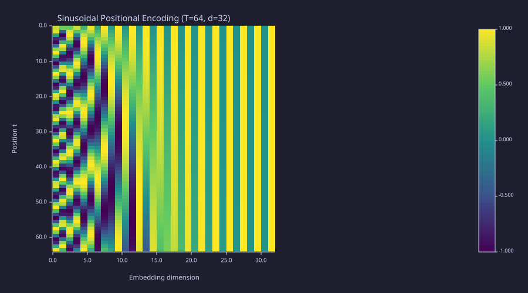
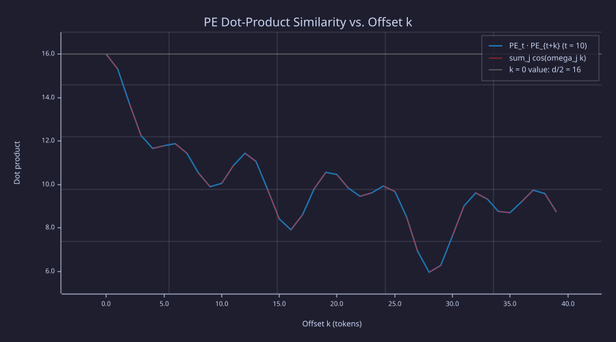
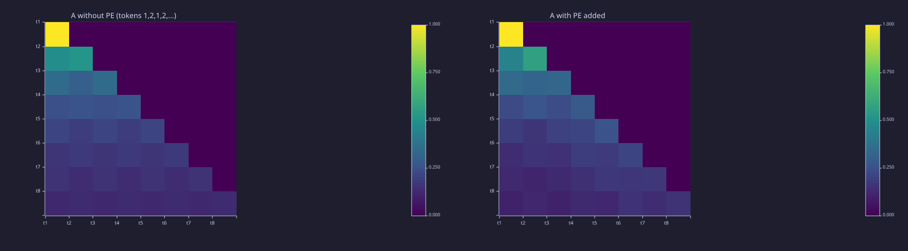
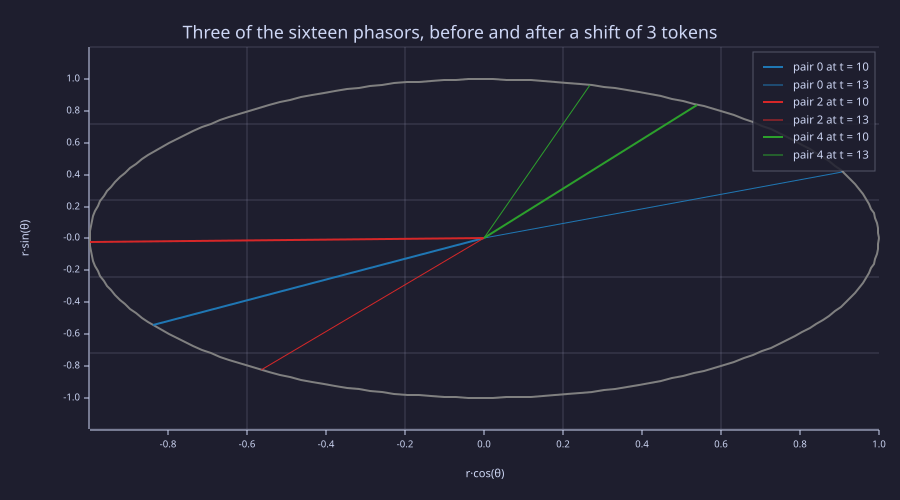
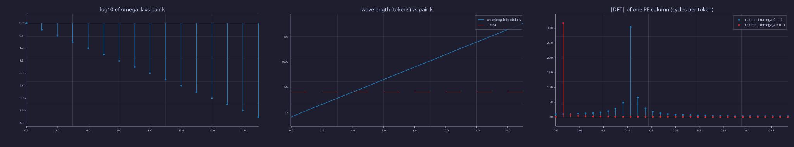
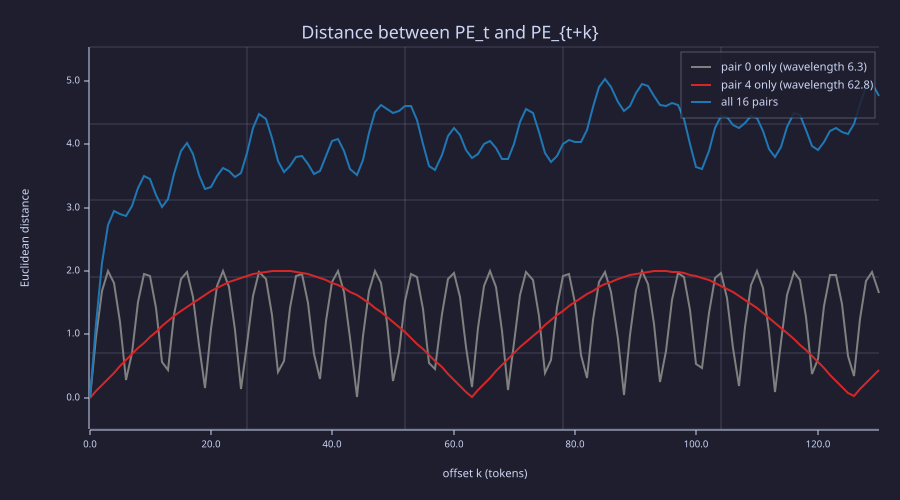

<!-- Generated by rustlab-notebook — do not edit directly. -->

# Lesson 10: Positional Encoding

Attention as built so far ([07-context-and-naive-averaging](07-context-and-naive-averaging.md) to [09-multi-head-attention](09-multi-head-attention.md)) is **permutation-equivariant**: shuffle the input tokens and the output rows shuffle the same way — no information about *order* enters the computation. That is fatal for language: "dog bites man" and "man bites dog" use the same multiset of tokens with completely different meanings. Positional encoding is the fix — a deterministic vector added to each token's embedding that tags it with its position. The sinusoidal version is a **bank of phasors**: sixteen clocks ticking at geometrically spaced rates, so that "how far apart" is a phase difference the model can read linearly.

## Learning Objectives

- Show that scaled dot-product attention is permutation-equivariant, state precisely what the causal mask changes, and explain why this rules out language modelling without a positional signal.
- Write the **sinusoidal positional encoding** formula, identify the role of each variable, and read each $(\sin, \cos)$ pair as a phasor $e^{j\omega_k t}$.
- Compute the full $T \times d_{\text{model}}$ PE matrix, read its banded heatmap, and verify the closed form $\mathrm{PE}_t \cdot \mathrm{PE}_{t+k} = \sum_j \cos(\omega_j k)$.
- Explain, with the aliasing / unambiguous-range argument, why the frequencies form a geometric ladder and why its base is $10^4$.
- Explain the trade-off between **fixed sinusoidal** PE and **learned** PE.

## Background

Scaled dot-product attention from [08-scaled-dot-product-attention](08-scaled-dot-product-attention.md) and the causal-mask helper in `lib/transformer.rlab`. Embeddings as dense rows from [04-embeddings-and-similarity](04-embeddings-and-similarity.md). Sine and cosine over arbitrary arguments, complex exponentials $e^{j\theta} = \cos\theta + j\sin\theta$, the discrete Fourier transform, and the notion of aliasing.

## Why Attention is Order-Blind

### Theory

Let $\boldsymbol{\Pi}$ be a $T \times T$ permutation matrix. If we permute the input rows, $\mathbf{X}' = \boldsymbol{\Pi}\mathbf{X}$, then the projections become

$$\mathbf{Q}' = \boldsymbol{\Pi}\mathbf{Q}, \qquad \mathbf{K}' = \boldsymbol{\Pi}\mathbf{K}, \qquad \mathbf{V}' = \boldsymbol{\Pi}\mathbf{V}.$$

The score matrix transforms as $\mathbf{S}' = \mathbf{Q}'\mathbf{K}'^\top = \boldsymbol{\Pi}\mathbf{S}\boldsymbol{\Pi}^\top$ — the same scores, just relabelled. After softmax and multiplying by $\mathbf{V}'$ the output is $\mathbf{O}' = \boldsymbol{\Pi}\mathbf{O}$: the output rows are simply the permuted original rows. **No information about the original order survived.** This is what "permutation-equivariant" means and why a vanilla self-attention layer cannot learn that adjacent tokens are different from far-apart tokens.

The causal mask from [08-scaled-dot-product-attention](08-scaled-dot-product-attention.md) does not restore order. With the mask, output row $t$ is $\mathbf{o}_t = \sum_{i \le t} A_{ti}\mathbf{v}_i$ where $A_{ti}$ depends on $\mathbf{q}_t$ and $\mathbf{k}_i$ only, so

$$\mathbf{o}_t = f\big(\mathbf{x}_t,\ \{\!\{\mathbf{x}_1, \dots, \mathbf{x}_{t-1}\}\!\}\big):$$

a function of the current token and the **unordered multiset** of its predecessors. Shuffle the prefix and the prediction made at $t$ does not change — the model's next-token distribution after *the cat sat* equals its distribution after *cat the sat*. We need to inject position into the *features* themselves. (One caveat: this applies to the *single* attention layer built here. Multi-layer causal decoders trained with *no* explicit positional encoding can still recover position indirectly through the mask — each layer can count how many tokens precede it, Haviv et al., 2022. The sinusoidal scheme below is the direct, single-layer way to supply the signal.)

### Example — Permutation equivariance, with and without the mask

Build a tiny attention block, run it on $\mathbf{X}$ and on a row-shuffled $\boldsymbol{\Pi}\mathbf{X}$, and check that the unmasked outputs differ only by the same permutation; then add the causal mask, shuffle only the prefix $\mathbf{x}_1..\mathbf{x}_3$, and check that row 4 does not move at all:

```rustlab
seed(10);
T = 4;
d_model = 4;
X = randn(T, d_model);
W_Q = randn(d_model, d_model) * 0.5;
W_K = randn(d_model, d_model) * 0.5;
W_V = randn(d_model, d_model) * 0.5;
scale = 1.0 / sqrt(d_model);

function O = attn(X, W_Q, W_K, W_V, scale, M)
  S = (X * W_Q) * (X * W_K)' * scale;
  A = softmax(S + M);          % M = 0: unmasked; M = causal_mask(T): causal
  O = A * (X * W_V);
end

Pi = [0, 1, 0, 0; 0, 0, 0, 1; 1, 0, 0, 0; 0, 0, 1, 0];          % full row permutation
no_mask = zeros(T, T);
O      = attn(X, W_Q, W_K, W_V, scale, no_mask);
O_perm = attn(Pi * X, W_Q, W_K, W_V, scale, no_mask);
perm_err = max(max(abs(O_perm - Pi * O)));
print("unmasked: max |attn(Pi X) - Pi attn(X)| =", perm_err);

M = causal_mask(T);
Pi_prefix = [0, 0, 1, 0; 1, 0, 0, 0; 0, 1, 0, 0; 0, 0, 0, 1];   % shuffles rows 1-3, fixes row 4
O_c        = attn(X, W_Q, W_K, W_V, scale, M);
O_c_prefix = attn(Pi_prefix * X, W_Q, W_K, W_V, scale, M);
prefix_err = max(abs(O_c(4, :) - O_c_prefix(4, :)));
print("causal:   max |row 4 after shuffling the prefix - row 4| =", prefix_err);
```

<!-- rustlab:output-start -->
```text
unmasked: max |attn(Pi X) - Pi attn(X)| = 0.0000000000000004440892098500626
causal:   max |row 4 after shuffling the prefix - row 4| = 0.000000000000000020816681711721685
```

<!-- rustlab:output-end -->

Both discrepancies are at machine precision — $4.44e-16$ (unmasked: equivariance) and $2.08e-17$ (masked: the last row is invariant to the order of its prefix). Without a positional signal, the prediction made at position 4 cannot depend on the order of positions 1–3.

## The Sinusoidal Positional Encoding

### Theory

The original transformer paper uses a fixed (non-learned) encoding built from sinusoids of geometrically spaced frequencies. For position $t \in \{1, \dots, T\}$ and embedding dimension $d_{\text{model}}$, the entry at column $i$ is

$$\mathrm{PE}_{t, 2k}   = \sin\!\left(\frac{t}{10000^{\,2k/d_{\text{model}}}}\right), \qquad
  \mathrm{PE}_{t, 2k+1} = \cos\!\left(\frac{t}{10000^{\,2k/d_{\text{model}}}}\right),$$

with $k = 0, 1, \dots, d_{\text{model}}/2 - 1$. Write $\omega_k = 10000^{-2k/d_{\text{model}}}$ for the angular rate of pair $k$ in radians per token. The $k = 0$ pair has wavelength $2\pi$ (one full cycle every $\sim 6$ tokens); for $d_{\text{model}} = 32$ the slowest pair ($k = 15$) has wavelength $2\pi \cdot 10000^{30/32} \approx 35\,300$ tokens (essentially constant over any practical sequence). The $2\pi \cdot 10000$ figure is the asymptotic design bound, reached only as the pair exponent $2k/d_{\text{model}} \to 1$. The model gets fast and slow position clocks at every dimension pair, so it can read both fine-grained ("which token am I?") and coarse ("which half of the sequence am I in?") position from the same vector.

The encoding is *added* to the token embedding, not concatenated:

$$\mathbf{X}'_t \;=\; \mathbf{E}_{x_t} + \mathrm{PE}_t.$$

Why addition is enough is taken up below, once the attention scores are in view.

### Example — Build the PE matrix for T=64, d=32

The loop mirrors the textbook formula one cell at a time (Exercise 1 vectorises it with `meshgrid`; `lib/transformer.rlab` ships the same table as `sinusoidal_pe(T, d)` with 0-based positions for the later lessons).

```rustlab
T_seq = 64;
d_model_pe = 32;

PE = zeros(T_seq, d_model_pe);
for t = 1:T_seq
  for i = 1:d_model_pe
    pair_idx = floor((i - 1) / 2);                            % k = 0,0,1,1,2,2,...
    div = 10000.0 ^ (2.0 * pair_idx / d_model_pe);
    theta = t / div;
    if mod(i - 1, 2) == 0
      PE(t, i) = sin(theta);
    else
      PE(t, i) = cos(theta);
    end
  end
end

print("PE shape:", size(PE));
print("PE(1, 1:6):", PE(1, 1:6));
print("PE(64, 1:6):", PE(64, 1:6));
```

<!-- rustlab:output-start -->
```text
PE shape: [1×2]  64.000000  32.000000
PE(1, 1:6): [1×6]  0.841471  0.540302  0.533168  0.846009  0.310984  0.950415
PE(64, 1:6): [1×6]  0.920026  0.391857  -0.990428  -0.138029  0.983524  0.180776
```

<!-- rustlab:output-end -->

Position 1 produces $[\sin(1), \cos(1), \sin(0.562), \cos(0.562), \dots]$ — the $k = 1$ pair uses angle $1/10000^{2/32} = 0.5623$, so `PE(1, 3)` renders as $\sin(0.5623) = 0.533$. Position 64 cycles much further around the fastest sinusoids while barely moving on the slowest ones.

### Example — Heatmap of the full PE matrix

```rustlab
figure();
imagesc(PE, "viridis")
title("Sinusoidal Positional Encoding (T=64, d=32)")
xlabel("Embedding dimension")
ylabel("Position t")
```

<!-- rustlab:output-start -->


<!-- rustlab:output-end -->

> [!TIP]
> The left columns (fast clocks) stripe rapidly down the page; the right half is nearly constant over 64 positions because those clocks have wavelengths of hundreds to tens of thousands of tokens. Each row is a unique fingerprint, and nearby rows look alike — the smoothness that makes relative position a learnable feature.

## Why Sinusoids: Translation in Position is a Linear Map

### Theory

Pick any pair of dimensions $(2k, 2k+1)$ and any offset $\delta$. The $\sin$/$\cos$ angle-addition formulas give

$$\begin{pmatrix} \sin(\omega_k(t+\delta)) \\ \cos(\omega_k(t+\delta)) \end{pmatrix} \;=\;
\underbrace{\begin{pmatrix} \cos(\omega_k \delta) & \sin(\omega_k \delta) \\ -\sin(\omega_k \delta) & \cos(\omega_k \delta) \end{pmatrix}}_{R_k(\delta)}
\begin{pmatrix} \sin(\omega_k t) \\ \cos(\omega_k t) \end{pmatrix},$$

where $\omega_k = 1/10000^{2k/d_{\text{model}}}$. Translation by $\delta$ acts as a fixed rotation $R_k(\delta)$ on each $(2k, 2k+1)$ pair. The Q/K projection matrices the model learns can therefore implement "look $\delta$ tokens back" as a *linear* operation, independent of the absolute $t$: relative offset is **linearly decodable** from the code (demonstrated in the Systems lens below). This is a property of the code, not a guarantee about unseen lengths — sinusoidal models are known to degrade on sequences longer than they were trained on, because the *learned* projections were never calibrated for the phases those positions produce.

The same identity gives the dot product between two positions in closed form. For pair $j$, $\sin(\omega_j t)\sin(\omega_j(t+k)) + \cos(\omega_j t)\cos(\omega_j(t+k)) = \cos(\omega_j k)$, so summing over pairs,

$$\mathrm{PE}_t \cdot \mathrm{PE}_{t+k} \;=\; \sum_{j=0}^{d_{\text{model}}/2 - 1} \cos(\omega_j k),$$

independent of $t$. At $k = 0$ every cosine is 1 and the sum is $d_{\text{model}}/2 = 16$; for $k > 0$ the fast pairs oscillate while the slow pairs ($\omega_j k \ll 1$) stay near 1.

### Example — Dot-product similarity vs. distance

The similarity $\mathrm{PE}_t \cdot \mathrm{PE}_{t+k}$ depends only on $k$, not $t$, and equals the closed form — verify both numerically and plot the curve:

```rustlab
n_pairs = d_model_pe / 2;
omega = 10000.0 .^ (-2 * (0:(n_pairs - 1)) / d_model_pe);   % ω_0 = 1 ... ω_15 = 1.78e-4 rad/token
sims_short = zeros(40);                        % similarity for offsets k=0..39 starting at t=10
sims_far   = zeros(40);                        % same offsets starting at t=20
sims_cf    = zeros(40);                        % closed form sum_j cos(ω_j k)
for k = 0:39
  sims_short(k + 1) = sum(PE(10, :) .* PE(10 + k, :));
  sims_far(k + 1)   = sum(PE(20, :) .* PE(20 + k, :));
  sims_cf(k + 1)    = sum(cos(omega * k));
end
drift  = max(abs(sims_short - sims_far));
cf_err = max(abs(sims_short - sims_cf));
[sim_min, k_min] = min(sims_short);
k_min = k_min - 1;
n_slow = sum(cos(omega * 39) > 0.9);
print("max |sim_t=10(k) - sim_t=20(k)| over k=0..39 =", drift);
print("max |sim(k) - sum_j cos(omega_j k)|        =", cf_err);
print("minimum", sim_min, "at k =", k_min, ";  pairs with cos(omega_j 39) > 0.9:", n_slow);

figure();
hold("on")
plot(0:39, sims_short, "color", "blue", "label", "PE_t · PE_{t+k}  (t = 10)")
plot(0:39, sims_cf, "color", "red", "style", "dashed", "label", "sum_j cos(omega_j k)")
hline(n_pairs, "gray", "k = 0 value: d/2 = 16")
hold("off")
title("PE Dot-Product Similarity vs. Offset k")
xlabel("Offset k (tokens)")
ylabel("Dot product")
```

<!-- rustlab:output-start -->
```text
max |sim_t=10(k) - sim_t=20(k)| over k=0..39 = 0.000000000000005329070518200751
max |sim(k) - sum_j cos(omega_j k)|        = 0.000000000000005329070518200751
minimum 5.968563765195686 at k = 28 ;  pairs with cos(omega_j 39) > 0.9: 9
```



<!-- rustlab:output-end -->

> [!TIP]
> The curve starts at $d/2 = 16$ and never returns there: it drops to 7.9 at $k = 16$, rebounds to 10.6 at $k = 19$, bottoms out at 6.0 at $k = 28$ and climbs again. The dashed closed form lies exactly on it.

Drift across base position $t$ is $5.33e-15$ and the closed form matches to $5.3e-15$: whatever similarity we measure between two positions is a function of *only* their separation. Read the sum. 9 of the 16 cosines have $\omega_j \cdot 39 < 0.45$ rad and stay above $0.9$ across the whole plot, so they contribute a near-constant floor of about 9; the fast pairs beat against each other on top of it. There is no decay to zero and no settling — the curve is the **autocorrelation of a 16-tone signal**, and a sum of undamped cosines is itself undamped. What attention can use is that the value is a fixed function of the offset $k$ alone: with learned Q/K projections that reweight the pairs, "close" and "far" become distinguishable scores.

## Adding PE to Embeddings

### Theory

In a real transformer block the embedded sequence is $\mathbf{H} = \mathbf{X}_{\text{onehot}} \mathbf{E} + \mathrm{PE}$ (with PE truncated to length $T$). The embedding magnitude is set by the initialisation scale ($\sim 0.1$) while PE has unit amplitude, so early in training *position* dominates the representation and token identity reasserts itself as $\mathbf{E}$ is trained up; some implementations multiply the embedding by $\sqrt{d_{\text{model}}}$ to balance the two from the start.

**Why addition is enough.** Write the row for position $t$ as $\mathbf{e}_t + \mathbf{p}_t$. With $\mathbf{W} = \mathbf{W}_Q \mathbf{W}_K^\top$ the attention score between positions $t$ and $i$ expands into four terms,

$$(\mathbf{e}_t + \mathbf{p}_t)\,\mathbf{W}\,(\mathbf{e}_i + \mathbf{p}_i)^\top = \underbrace{\mathbf{e}_t \mathbf{W} \mathbf{e}_i^\top}_{\text{content–content}} + \underbrace{\mathbf{e}_t \mathbf{W} \mathbf{p}_i^\top + \mathbf{p}_t \mathbf{W} \mathbf{e}_i^\top}_{\text{content–position}} + \underbrace{\mathbf{p}_t \mathbf{W} \mathbf{p}_i^\top}_{\text{position–position}},$$

so one learned bilinear form scores "what is there", "where it is", and their interaction. Concatenating $[\mathbf{e}, \mathbf{p}]$ instead would produce the same four terms through a block-structured $\mathbf{W}$ of twice the width: addition is concatenation with a shared projection, at no extra width, relying on the $d_{\text{model}}$ dimensions being roomy enough to keep the two parts roughly separable.

### Example — Token + PE, and the attention matrix with and without it

An alternating sequence of two tokens: without PE every copy of token 1 is the same row, so a causal head with random projections must give identical weight to every visible copy. The embeddings are scaled by $\sqrt{d_{\text{model}}}$ so that content and position are comparable in the second half:

```rustlab
seed(42);
vocab_pe = 6;
T_demo = 8;
E_pe = randn(vocab_pe, d_model_pe) * 0.1;
ids = [1, 2, 1, 2, 1, 2, 1, 2];
X_tok = E_pe(ids, :) * sqrt(d_model_pe);        % row gather: token content only
X_pos = X_tok + PE(1:T_demo, :);                % content + position (matrix + matrix)
diff_tok_only = max(abs(X_tok(1, :) - X_tok(3, :)));   % both rows are token 1
diff_with_pe  = max(abs(X_pos(1, :) - X_pos(3, :)));
print("max |row1 - row3|  token only:", diff_tok_only, "  token + PE:", diff_with_pe);

seed(7);
W_Qa = randn(d_model_pe, d_model_pe) * 0.1;
W_Ka = randn(d_model_pe, d_model_pe) * 0.1;
M_demo = causal_mask(T_demo);
scale_pe = 1.0 / sqrt(d_model_pe);
A_noPE = softmax((X_tok * W_Qa) * (X_tok * W_Ka)' * scale_pe + M_demo);
A_PE   = softmax((X_pos * W_Qa) * (X_pos * W_Ka)' * scale_pe + M_demo);
print("row 5 weights on the token-1 positions 1, 3, 5 -- no PE:", A_noPE(5, 1), A_noPE(5, 3), A_noPE(5, 5));
print("row 5 weights on the token-1 positions 1, 3, 5 -- PE:   ", A_PE(5, 1), A_PE(5, 3), A_PE(5, 5));

pos8 = {"t1", "t2", "t3", "t4", "t5", "t6", "t7", "t8"};
figure();
subplot(1, 2, 1)
heatmap(pos8, pos8, A_noPE, "A without PE  (tokens 1,2,1,2,...)", "viridis")
subplot(1, 2, 2)
heatmap(pos8, pos8, A_PE, "A with PE added", "viridis")
```

<!-- rustlab:output-start -->
```text
max |row1 - row3|  token only: 0   token + PE: 1.5302948024685852
row 5 weights on the token-1 positions 1, 3, 5 -- no PE: 0.21107649686042962 0.21107649686042962 0.21107649686042962
row 5 weights on the token-1 positions 1, 3, 5 -- PE:    0.18095986764064959 0.19700350376113004 0.25360475109171016
```



<!-- rustlab:output-end -->

> [!TIP]
> Left: a two-colour checkerboard — every row gives *identical* weight to every visible copy of the same token (row 5 puts 0.211 on each of positions 1, 3 and 5), because identical tokens produce identical keys. Right: the copies separate (0.181, 0.197, 0.254) — position is now in the keys.

Without PE the token-1 rows at positions 1 and 3 are bit-identical (difference 0); adding PE opens a gap of 1.53 in the largest coordinate, and the attention pattern stops being a function of token identity alone.

## Sinusoidal vs. Learned Positional Encoding

### Theory

Two practical choices coexist in modern transformers:

| Choice | How it works | Pros | Cons |
|---|---|---|---|
| **Sinusoidal (fixed)** | Closed-form $\sin / \cos$ table, no parameters | Defined for *any* sequence length, zero parameters | No way to adapt the encoding to the data; accuracy still degrades beyond the training length |
| **Learned** | Add a separate `randn(T_max, d_model)` and train it like an embedding | Can specialise per dataset, marginally better at training-length contexts | Bounded by `T_max`; must extrapolate or interpolate to go longer |

GPT-2 and the original BERT use **learned** PE; the original Vaswani transformer uses the fixed sinusoidal table above. Recent long-context work favours other *fixed* schemes applied to the attention computation rather than added to the embedding. **RoPE** rotates the query and key vectors by a position-dependent angle, so it shares the sinusoidal "translation = rotation" property derived above but applies it to $\mathbf{q}$ and $\mathbf{k}$ instead of $\mathbf{x}$ ([24-modern-architectural-variants](24-modern-architectural-variants.md)). **ALiBi** takes a different route entirely: it adds *no* positional vector at all, instead biasing each attention score by a fixed penalty proportional to the query–key distance. Either way *some* positional signal must enter, and the rotation property is the geometric reason the sinusoidal family works.

## Engineering Lenses

### Signals

**Exact.** *Phasor bank.* Pair $k$ of the code is the imaginary and real part of one phasor,

$$z_k(t) = e^{j\omega_k t} = \cos(\omega_k t) + j\sin(\omega_k t), \qquad (\mathrm{PE}_{t,2k}, \mathrm{PE}_{t,2k+1}) = (\operatorname{Im} z_k(t), \operatorname{Re} z_k(t)),$$

and translation by $\delta$ is multiplication by a unit complex number: $z_k(t+\delta) = e^{j\omega_k\delta}\, z_k(t)$. The rotation matrix $R_k(\delta)$ above is this complex multiply written out in real coordinates. RoPE ([24-modern-architectural-variants](24-modern-architectural-variants.md)) uses the same phasor on $\mathbf{q}$ and $\mathbf{k}$ instead of adding it to $\mathbf{x}$, so a score depends on the phase difference $\omega_k(t - i)$ alone.

```rustlab
t0 = 10;
delta = 3;
z_t  = exp(1j * omega * t0);                % 16 phasors at position t
z_td = exp(1j * omega * (t0 + delta));      % the same phasors δ tokens later
rot  = exp(1j * omega * delta);             % one unit complex number per pair
phasor_err = max(abs(z_t .* rot - z_td));
print("max |e^{j w d} z(t) - z(t+d)| =", phasor_err);
print("PE(10, 1:2) =", PE(10, 1:2), "  [Im, Re] of z_0(10) =", imag(z_t(1)), real(z_t(1)));

figure();
hold("on")
circ = linspace(0, 2 * pi, 200);
polar(circ, ones(1, 200), "color", "gray")
pick = [1, 3, 5];                            % pairs k = 0, 2, 4
cols = {"blue", "red", "green"};
for m = 1:3
  k = pick(m);
  polar([angle(z_t(k)), angle(z_t(k))], [0, 1], "color", cols(m), "label", sprintf("pair %d at t = 10", k - 1))
  polar([angle(z_td(k)), angle(z_td(k))], [0, 1], "color", cols(m), "style", "dashed", "label", sprintf("pair %d at t = 13", k - 1))
end
hold("off")
title("Three of the sixteen phasors, before and after a shift of 3 tokens")
```

<!-- rustlab:output-start -->
```text
max |e^{j w d} z(t) - z(t+d)| = 0.00000000000000011102230246251565
PE(10, 1:2) = [1×2]  -0.544021  -0.839072   [Im, Re] of z_0(10) = -0.5440211108893698 -0.8390715290764524
```



<!-- rustlab:output-end -->

> [!TIP]
> Each pair advances by its own angle $\omega_k \delta$: the fast pair 0 swings 3 rad (almost half a turn), pair 2 about 0.95 rad, pair 4 only 0.3 rad. The same $\delta$ is read on three clocks of different rates.

One complex multiply per pair reproduces the rotation identity to $1.1e-16$.

**Exact.** *Frequency ladder and spectrum.* The 16 rates $\omega_k = 10000^{-2k/d}$ are geometrically spaced — a straight line on a log axis, wavelengths $\lambda_k = 2\pi/\omega_k$ from $6.28$ to $35\,300$ tokens — constant-Q coverage from one token to the ten-thousand-token scale. Each column of PE is a single tone, so the DFT of a column shows one spectral line.

```rustlab
lambda = 2 * pi ./ omega;
F1 = abs(fft(PE(:, 1)));                     % column 1: ω_0 = 1 rad/token
F9 = abs(fft(PE(:, 9)));                     % column 9: ω_4 = 0.1 rad/token
f  = fftfreq(T_seq, 1);                      % cycles per token
[peak1, i1] = max(F1(1:32));
[peak9, i9] = max(F9(1:32));
print("wavelengths (tokens): pair 0 =", lambda(1), " pair 4 =", lambda(5), " pair 15 =", lambda(16));
print("spectral lines: column 1 at f =", f(i1), " (omega_0 / 2 pi =", omega(1) / (2 * pi), "),  column 9 at f =", f(i9), " (omega_4 / 2 pi =", omega(5) / (2 * pi), ")");

figure();
subplot(1, 3, 1)
stem(0:(n_pairs - 1), log10(omega), "color", "blue")
title("log10 of omega_k vs pair k")
subplot(1, 3, 2)
hold("on")
semilogy(0:(n_pairs - 1), lambda, "color", "blue", "label", "wavelength lambda_k")
semilogy(0:(n_pairs - 1), T_seq * ones(1, n_pairs), "color", "red", "style", "dashed", "label", "T = 64")
hold("off")
title("wavelength (tokens) vs pair k")
subplot(1, 3, 3)
hold("on")
stem(f(1:32), F1(1:32), "color", "blue", "label", "column 1 (omega_0 = 1)")
stem(f(1:32), F9(1:32), "color", "red", "label", "column 9 (omega_4 = 0.1)")
hold("off")
title("|DFT| of one PE column (cycles per token)")
```

<!-- rustlab:output-start -->
```text
wavelengths (tokens): pair 0 = 6.283185307179586  pair 4 = 62.83185307179585  pair 15 = 35332.94752055899
spectral lines: column 1 at f = 0.15625  (omega_0 / 2 pi = 0.15915494309189535 ),  column 9 at f = 0.015625  (omega_4 / 2 pi = 0.015915494309189534 )
```



<!-- rustlab:output-end -->

> [!TIP]
> Left: the ladder is a straight line — one decade of frequency every 4 pairs. Middle: pairs above the dashed line have a wavelength longer than the whole $T = 64$ context and barely move within it. Right: one line per column (column 9 falls almost exactly on a DFT bin; column 1's line leaks into neighbouring bins because 64 tokens is not a whole number of its cycles).

**Exact.** *Aliasing and the unambiguous range — why 10000.* A single clock $e^{j\omega k}$ is one-to-one in $k$ only over one period: offsets $k$ and $k + 2\pi/\omega$ give the same phasor. So the **fastest** clock sets the resolution — $\omega_0 = 1$ rad/token is below the Nyquist rate of $\pi$ rad/token at one sample per token, so adjacent positions are never aliased and differ by $2\sin(0.5) = 0.96$ on that pair alone — and the **slowest** clock sets the unambiguous range: $\lambda_{15} = 35\,300$ tokens here, approaching the design bound $2\pi \cdot 10^4 \approx 62\,800$ tokens as $2k/d \to 1$. The original model trained on 512-token contexts; base $10^4$ puts the slowest clock two decades above that, so absolute position stays monotone across any context the model will see while the fastest clock still resolves single tokens. Any base within an order of magnitude would do the same job — $10^4$ is a margin, not a magic number. From the closed form, $\lVert\mathrm{PE}_t - \mathrm{PE}_{t+k}\rVert^2 = \sum_j (2 - 2\cos\omega_j k)$, which lets the distance be traced far beyond the 64 rows built above:

```rustlab
kk = 0:130;
dist_pair0 = sqrt(2 - 2 * cos(omega(1) * kk));            % pair 0 only (λ = 6.3)
dist_pair4 = sqrt(2 - 2 * cos(omega(5) * kk));            % pair 4 only (λ = 62.8)
dist_all   = zeros(length(kk));
for i = 1:length(kk)
  dist_all(i) = sqrt(sum(2 - 2 * cos(omega * kk(i))));    % all 16 pairs
end
dist_floor = min(dist_all(2:end));
print("pair 4 alone: |PE_t - PE_{t+63}| =", dist_pair4(64), "   all 16 pairs:", dist_all(64), "   smallest full-code distance (k = 1):", dist_floor);

figure();
hold("on")
plot(kk, dist_pair0, "color", "gray", "label", "pair 0 only (wavelength 6.3)")
plot(kk, dist_pair4, "color", "red", "label", "pair 4 only (wavelength 62.8)")
plot(kk, dist_all, "color", "blue", "label", "all 16 pairs")
hold("off")
title("Distance between PE_t and PE_{t+k}")
xlabel("offset k (tokens)")
ylabel("Euclidean distance")
```

<!-- rustlab:output-start -->
```text
pair 4 alone: |PE_t - PE_{t+63}| = 0.016814494734299912    all 16 pairs: 3.782219814811988    smallest full-code distance (k = 1): 1.1716234976260362
```



<!-- rustlab:output-end -->

> [!TIP]
> Each single clock returns to zero every wavelength — pair 4 cannot tell $t$ from $t + 63$ (distance 0.017). The full code never comes back below 1.17, its neighbour distance, because no two clocks share a period.

### Systems

**Exact.** *An autonomous oscillator bank.* Stack the pair rotations into $\Phi = \mathrm{blockdiag}(R_0(1), \dots, R_{15}(1))$. The code obeys a linear state update with no input,

$$\mathrm{PE}_{t+1} = \Phi\,\mathrm{PE}_t, \qquad \Phi = \exp(\Omega), \quad \Omega = \mathrm{blockdiag}(\omega_k \mathbf{J}), \quad \mathbf{J} = \begin{pmatrix} 0 & 1 \\ -1 & 0 \end{pmatrix}$$

(in the course's row convention, $\mathrm{PE}(t+1, :) = \mathrm{PE}(t, :)\,\Phi^\top$). $\Omega$ is skew-symmetric, so $\Phi$ is orthogonal and its eigenvalues are $e^{\pm j\omega_k}$ — all on the unit circle: a marginally stable, lossless system with no damping and sixteen natural frequencies. Position is the time index of this oscillator bank started from $\mathrm{PE}_1$, and "position $t + \delta$" is $\Phi^\delta = \exp(\delta\Omega)$, which is why offsets are linear maps.

```rustlab
J = [0, 1; -1, 0];
Omega = zeros(d_model_pe, d_model_pe);
for k = 1:n_pairs
  c = 2 * k - 1;
  Omega(c:(c + 1), c:(c + 1)) = omega(k) * J;
end
Phi = expm(Omega);                                          % block-diagonal rotations
step_err = max(max(abs(PE(2:T_seq, :) - PE(1:(T_seq - 1), :) * Phi')));
Phi63 = expm(63 * Omega);                                   % Φ^63 — rustlab's A^k is element-wise, so use expm
jump_err = max(abs(PE(64, :) - PE(1, :) * Phi63'));
eig_dev = max(abs(abs(eig(Phi)) - 1));
orth_err = max(max(abs(Phi' * Phi - eye(d_model_pe))));
print("max |PE_{t+1} - Phi PE_t| =", step_err, "   |PE_64 - Phi^63 PE_1| =", jump_err);
print("max ||lambda(Phi)| - 1| =", eig_dev, "   |Phi' Phi - I| =", orth_err);
```

<!-- rustlab:output-start -->
```text
max |PE_{t+1} - Phi PE_t| = 0.000000000000003774758283725532    |PE_64 - Phi^63 PE_1| = 0.000000000000019761969838327786
max ||lambda(Phi)| - 1| = 0.0000000000000002220446049250313    |Phi' Phi - I| = 0.0000000000000008881784197001252
```

<!-- rustlab:output-end -->

**Exact.** *Relative offset is linearly decodable — from data.* Fit, by least squares and without being told the answer, the $2 \times 2$ map that carries each pair from position $t$ to position $t+3$ over the 61 available row pairs. The residual is zero and the fitted blocks are the analytic $\Phi^3$ blocks:

```rustlab
offset = 3;
P_in  = PE(1:(T_seq - offset), :);
P_out = PE((1 + offset):T_seq, :);
B_fit = zeros(d_model_pe, d_model_pe);
for k = 1:n_pairs
  c = 2 * k - 1;
  Pk = P_in(:, c:(c + 1));
  Yk = P_out(:, c:(c + 1));
  B_fit(c:(c + 1), c:(c + 1)) = inv(Pk' * Pk) * (Pk' * Yk);   % normal equations, 2 unknowns per output
end
fit_resid  = max(max(abs(P_in * B_fit - P_out)));
fit_vs_phi = max(max(abs(B_fit - expm(offset * Omega)')));
rank_in = rank(P_in);
print("least-squares residual of PE_t -> PE_{t+3}:", fit_resid, "   max |B_fit - (Phi^3)'| =", fit_vs_phi);
print("numerical rank of the 61 x 32 input block:", rank_in);
```

<!-- rustlab:output-start -->
```text
least-squares residual of PE_t -> PE_{t+3}: 0.0000000000000043298697960381105    max |B_fit - (Phi^3)'| = 0.00000000000009738954434568292
numerical rank of the 61 x 32 input block: 15
```

<!-- rustlab:output-end -->

A $\mathbf{W}_Q/\mathbf{W}_K$ pair can therefore implement "attend 3 back" as a fixed linear map. One honest caveat sits in the last line: over 64 tokens the input block has numerical rank 15 — the slow columns are all $\approx \omega_k t$ and collinear — so an *unconstrained* $32 \times 32$ fit would not be unique. At short range the slow clocks carry no information; they exist for the ten-thousand-token scale.

### Information

**Exact.** *A redundant, multi-resolution code.* Naming a position in $T = 64$ takes $\log_2 64 = 6$ bits; the code spends 32 real numbers. It is not a minimal encoding but a redundant one, and the redundancy is what buys linear decodability (Systems) and an unambiguous range of $10^4$ tokens at one-token resolution (Signals). At this $T$ only some of the pairs actually vary, and because distance depends on the offset alone, the closest two of the 64 codes are neighbours:

```rustlab
bits_needed = log2(T_seq);
var_pair = zeros(n_pairs);
for k = 1:n_pairs
  var_pair(k) = std(PE(:, 2 * k - 1))^2;                    % variance of the sin column down the 64 rows
end
n_active = sum(var_pair > 0.1);
print("bits to name a position in T = 64:", bits_needed, "   reals spent:", d_model_pe);
print("pairs whose sin column has variance > 0.1 over 64 rows:", n_active, "of", n_pairs, "   smallest distance between two codes:", dist_floor);
```

<!-- rustlab:output-start -->
```text
bits to name a position in T = 64: 6    reals spent: 32
pairs whose sin column has variance > 0.1 over 64 rows: 6 of 16    smallest distance between two codes: 1.1716234976260362
```

<!-- rustlab:output-end -->

Only 6 of 16 pairs move appreciably within 64 tokens (the rest are the long-range clocks), yet all 64 codes are distinct with a margin of 1.17 — the code is well separated, and the separation is carried entirely by the fast pairs.

**Model.** *What PE makes recoverable.* Without a positional signal the network maps every permutation of a prefix to the same state (the masked check above), so whatever information the *order* of $X_{1..t}$ carries about $X_{t+1}$ beyond its multiset — $I(X_{t+1}; \text{order} \mid \text{multiset})$, positive for any natural-language source — is discarded before it can be used. PE creates no bits about the corpus; it makes those bits visible to attention, which is why removing it collapses language-modelling perplexity while leaving bag-of-words tasks nearly unchanged. This is stated as a model because the mutual information is not computed here; the attention heatmaps above show the mechanism.

## Key Takeaways

- Self-attention is permutation-equivariant; with the causal mask, row $t$ is a function of $\mathbf{x}_t$ and the *unordered* multiset of its predecessors — order is invisible either way.
- **Sinusoidal PE** is a bank of 16 phasors $e^{j\omega_k t}$ at geometrically spaced rates. Translation is multiplication by $e^{j\omega_k\delta}$ (a rotation per pair), and $\mathrm{PE}_t \cdot \mathrm{PE}_{t+k} = \sum_j \cos(\omega_j k)$ depends on $k$ alone — both verified numerically.
- The fastest clock sets one-token resolution (below Nyquist); the slowest sets the unambiguous range ($\sim 10^4$ tokens). That is what base 10000 buys: a margin, not a magic number.
- $\mathrm{PE}_{t+1} = \Phi\,\mathrm{PE}_t$ with $\Phi = \exp(\Omega)$ orthogonal — an undamped oscillator bank; relative offsets are linear maps, recoverable by least squares from the code itself.
- Adding PE to the token embedding is the standard injection point; the score expands into content–content, content–position and position–position terms, so addition is concatenation with a shared projection. **Learned PE** specialises to the data but is bounded by the trained length.
- Information: 6 bits of position spent as 32 reals — a redundant code that trades bits for linear decodability; PE makes the order-dependent part of $I(X_{t+1}; X_{1..t})$ recoverable.

## Standalone Scripts

| Script | What it computes |
|---|---|
| `pe_matrix.rlab` | the $64 \times 32$ sinusoidal PE matrix (loop and vectorised forms); signed heatmap |
| `pe_translation.rlab` | similarity vs. offset at two base positions against the closed form $\sum_j \cos(\omega_j k)$; translation-only dependence |
| `pe_phasor_bank.rlab` | phasor form $e^{j\omega_k t}$ and translation as one complex multiply; polar plot; frequency ladder, wavelengths and the DFT of two columns |
| `pe_aliasing.rlab` | distance vs. offset for single clocks and the full bank; resolution and unambiguous range |
| `pe_oscillator_bank.rlab` | $\Phi = \exp(\Omega)$ state update, unit-circle eigenvalues, least-squares recovery of the offset-3 map |
| `pe_attention_order.rlab` | equivariance with and without the mask; attention matrices with and without PE |

Run all with `make lesson-10` (or `rustlab run lessons/10-positional-encoding/<name>.rlab`).

## Expected Numerical Outputs Summary

| Variable | Expected Value |
|---|---|
| `perm_err`, `prefix_err` | ≈ `0` (machine epsilon) |
| `size(PE)`; `PE(1, 1)`, `PE(1, 2)` | `[64, 32]`; ≈ `0.841` ($\sin 1$), ≈ `0.540` ($\cos 1$) |
| `drift`, `cf_err` | ≈ `0`, ≈ `5e-15` |
| `sims_short(1)`; `sims_short(17)`; `sim_min` at `k_min` | `16` ($= d/2$); ≈ `7.9`; ≈ `5.97` at $k = 28$ |
| `diff_tok_only`, `diff_with_pe` | `0`; ≈ `1.53` |
| `A_noPE(5, [1 3 5])`; `A_PE(5, [1 3 5])` | three identical values ≈ `0.211`; ≈ `0.181, 0.197, 0.254` |
| `phasor_err` | ≈ `1e-16` |
| `lambda(1)`, `lambda(5)`, `lambda(16)` | `6.28`, `62.8`, `35333` tokens |
| spectral lines, columns 1 and 9 | `0.156` and `0.0156` cycles/token ($\omega/2\pi$ = `0.159`, `0.0159`) |
| `dist_pair4(64)`, `dist_all(64)`, `dist_floor` | ≈ `0.017`, ≈ `3.78`, ≈ `1.17` |
| `step_err`, `jump_err`, `eig_dev`, `orth_err` | all ≈ `1e-15` – `1e-14` |
| `fit_resid`, `fit_vs_phi`, `rank_in` | ≈ `4e-15`, ≈ `1e-13`, `15` |
| `bits_needed`, `n_active` | `6`; `6` of 16 |

## Exercises

1. **Vectorise the table.** Rebuild `PE` without loops: `[I_grid, T_grid] = meshgrid(1:d, 1:T)`, `angles = T_grid ./ 10000 .^ (2 floor((I_grid - 1)/2) / d)`, and an even-column mask `1 - mod(I_grid - 1, 2)` to pick $\sin$ or $\cos$. Check `max(abs(PE - PE_vec))` is exactly 0 (`pe_matrix.rlab` has the answer).
2. **Wavelength of pair $k$.** Show algebraically that the wavelength of the $k$-th sinusoid pair is $2\pi \cdot 10000^{2k/d_{\text{model}}}$. For $d_{\text{model}} = 32$, $k = 15$, what is the wavelength in tokens, and for which $k$ does it first exceed the 512-token training context of the original transformer?
3. **Permutation breaking.** Rebuild the sinusoidal PE at $d_{\text{model}} = 4$ for the demo's $T = 4$ positions (the `PE` from the heatmap example was built at $d = 32$ and will not conform to the $4 \times 4$ input), add `PE(1:T, :)` to `X` before applying `attn`, and re-check `O_perm` against `Pi * O` and the masked prefix test. Does either still match? Explain why not.
4. **Replace with learned.** Sketch the parameter count for a learned PE table at `T_max = 1024` and `d_model = 512`. Is this larger or smaller than the token embedding for $\lvert\mathcal{V}\rvert = 50000$? What goes wrong if you ever feed a sequence longer than `T_max`?
5. **Choosing the base.** Rebuild `omega` with bases $10^2$ and $10^6$ at $d_{\text{model}} = 32$ and redraw the distance-vs-offset figure. For each base, at what offset does the *full* code first come within 0.5 of itself, and which pairs are effectively constant over 512 tokens?
6. **RoPE in one line.** Instead of adding PE to $\mathbf{x}$, multiply the phasor form of $\mathbf{q}_t$ by $e^{j\omega_k t}$ and of $\mathbf{k}_i$ by $e^{j\omega_k i}$ (pair by pair) and take the real part of $\mathbf{q}_t \bar{\mathbf{k}}_i$. Show numerically that the score depends only on $t - i$. [24-modern-architectural-variants](24-modern-architectural-variants.md) builds the full mechanism.

## What's next

[11-feed-forward-block](11-feed-forward-block.md) introduces the second sublayer of every transformer block: the **position-wise feed-forward network**. Each token's representation passes through the same two-layer MLP independently — a per-position non-linearity that gives the model the expressive power a stack of pure linear projections lacks. The non-linearity is **GELU**, a smooth cousin of ReLU, and we'll see why the smoothness matters for gradient flow.
