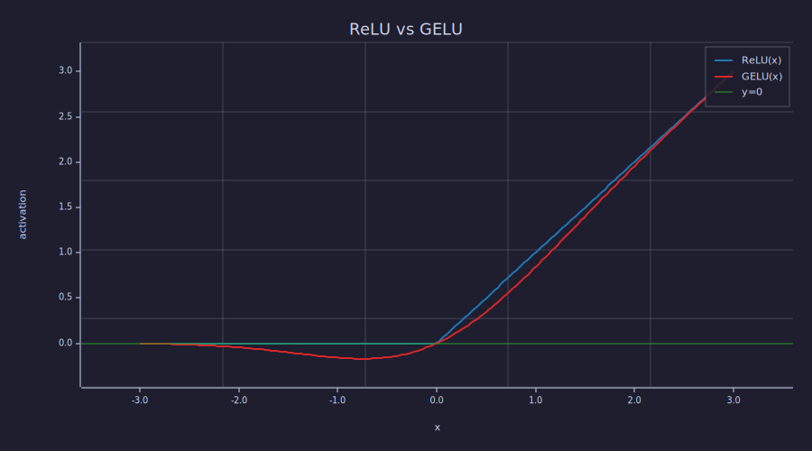
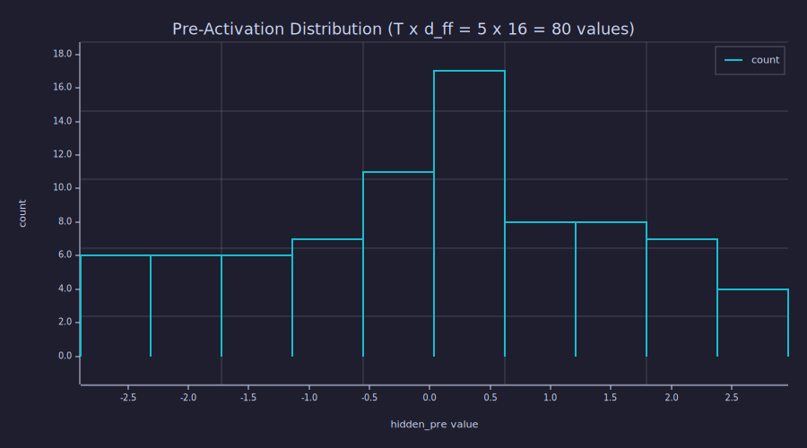
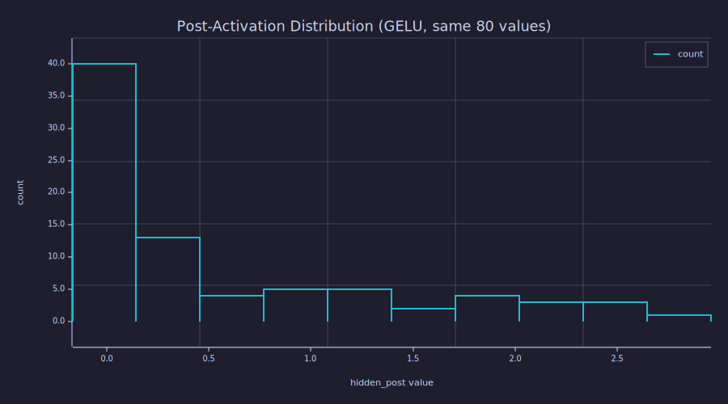

<!-- Generated by rustlab-notebook — do not edit directly. -->

# Lesson 11: Feed-Forward Block (MLP)

Attention ([Lessons 08–09](08-scaled-dot-product-attention.md)) mixes information *across* positions. The **feed-forward network** (FFN, sometimes "position-wise MLP") mixes information *within* each position — a small two-layer neural net applied independently to every token vector. Together, attention + FFN form one transformer block; the model alternates them, depth after depth.

## Learning Objectives

- Write the equation for the position-wise feed-forward network and identify each weight, bias, and activation.
- Explain why a single linear layer cannot replace the FFN (and what the activation buys you).
- Compute and plot **GELU** alongside **ReLU**, and identify the regime where they differ most.
- Read pre- and post-activation distributions and explain how the activation reshapes them.
- Justify the standard hidden-dimension choice $d_{\text{ff}} = 4 d_{\text{model}}$.

## Background

Linear layers and biases from [Lesson 06](06-linear-layers-and-gradient-descent.md). Softmax-normalised attention output as a $T \times d_{\text{model}}$ matrix from [Lessons 08–09](08-scaled-dot-product-attention.md). Histograms as visualisation of an empirical distribution.

## The Position-Wise Feed-Forward Network

### Theory

Given a per-token input $\mathbf{x} \in \mathbb{R}^{d_{\text{model}}}$, the FFN sublayer is

$$\mathrm{FFN}(\mathbf{x}) \;=\; \mathbf{W}_2 \;\sigma\!\left(\mathbf{W}_1 \mathbf{x} + \mathbf{b}_1\right) \;+\; \mathbf{b}_2,$$

with

- $\mathbf{W}_1 \in \mathbb{R}^{d_{\text{ff}} \times d_{\text{model}}}$, $\mathbf{b}_1 \in \mathbb{R}^{d_{\text{ff}}}$ — first projection (typically widening).
- $\mathbf{W}_2 \in \mathbb{R}^{d_{\text{model}} \times d_{\text{ff}}}$, $\mathbf{b}_2 \in \mathbb{R}^{d_{\text{model}}}$ — second projection (back to model width).
- $\sigma$ — a non-linear activation, in modern transformers GELU.

"**Position-wise**" means the *same* $\mathbf{W}_1, \mathbf{W}_2, \mathbf{b}_1, \mathbf{b}_2$ are applied to every row of the input matrix $\mathbf{H} \in \mathbb{R}^{T \times d_{\text{model}}}$ — there is no cross-token mixing inside FFN. (That's attention's job.) Concretely:

$$\mathbf{H}_{\text{ff}} \;=\; \sigma\!\left(\mathbf{H} \mathbf{W}_1^\top + \mathbf{1}_T \mathbf{b}_1^\top\right) \mathbf{W}_2^\top + \mathbf{1}_T \mathbf{b}_2^\top.$$

If $\sigma$ were the identity, the whole block would collapse to a single linear map $\mathbf{H} (\mathbf{W}_2 \mathbf{W}_1)^\top + \text{bias}$ — no benefit from having two layers. The non-linearity is what makes the FFN expressive. With it, the FFN can approximate any continuous per-position function (universal approximation), letting each transformer layer rewrite token features in highly non-linear ways before the next attention layer mixes them across positions again.

### Example — A small FFN forward pass

Build $\mathrm{FFN}$ with $d_{\text{model}} = 4$, $d_{\text{ff}} = 16$ (the canonical $4\times$ widening), and run a $T = 5$ sequence through it.

```rustlab
seed(11);
T = 5;
d_model = 4;
d_ff = 4 * d_model;

H = randn(T, d_model);

W1 = randn(d_model, d_ff) * sqrt(2.0 / d_model);   % He init for the GELU layer
b1 = zeros(d_ff);
W2 = randn(d_ff, d_model) * sqrt(2.0 / d_ff);
b2 = zeros(d_model);

% Forward pass — broadcast biases by adding row vectors via outer with ones
ones_T = ones(T);
hidden_pre  = H * W1 + outer(ones_T, b1);
hidden_post = gelu(hidden_pre);
out         = hidden_post * W2 + outer(ones_T, b2);

print("input H shape:        ", size(H));
print("hidden pre  (T, d_ff):", size(hidden_pre));
print("hidden post (T, d_ff):", size(hidden_post));
print("output      (T, d):   ", size(out));

% Per-position independence: rows do not mix.
% Use a permutation matrix to reorder rows — vector indexing M([3,1,2,5,4]) is not
% yet available in rustlab (see AGENTS.md Rustlab Recommendations).
P_perm = [0, 0, 1, 0, 0;
          1, 0, 0, 0, 0;
          0, 1, 0, 0, 0;
          0, 0, 0, 0, 1;
          0, 0, 0, 1, 0];
H_perm = P_perm * H;
out_perm = gelu(H_perm * W1 + outer(ones_T, b1)) * W2 + outer(ones_T, b2);
shuffle_err = max(reshape(abs(out_perm - P_perm * out), 1, T * d_model));
print("max | FFN(P*H) - P*FFN(H) | =", shuffle_err);
```

```text
input H shape:         [1×2]  5.000000  4.000000
hidden pre  (T, d_ff): [1×2]  5.000000  16.000000
hidden post (T, d_ff): [1×2]  5.000000  16.000000
output      (T, d):    [1×2]  5.000000  4.000000
max | FFN(P*H) - P*FFN(H) | = 0
```

Reshuffling the rows of $\mathbf{H}$ via a permutation matrix and re-applying FFN produces exactly the same rows in the same shuffled order — confirmed numerically with $\max\Delta = 0.00e+00$. FFN is row-independent; only attention mixes across positions.

## ReLU vs GELU

### Theory

The two activations share a "small inputs cause small outputs, large positive inputs pass through" character but disagree near zero.

- **ReLU**: $\mathrm{ReLU}(x) = \max(0, x)$. Hard cutoff at zero. Gradient is $1$ for $x > 0$ and $0$ for $x < 0$ — discontinuous at the kink. A neuron that drifts negative gets zero gradient and is effectively "dead" until a future update kicks it back.
- **GELU** (Gaussian Error Linear Unit): $\mathrm{GELU}(x) = x \cdot \Phi(x)$, where $\Phi$ is the standard normal CDF. Smooth everywhere, with a non-zero gradient on both sides of zero. Slightly negative inputs produce slightly negative outputs (small but real signal); large negatives still vanish.

GELU is the default in GPT-2/3, BERT, and almost every recent decoder transformer. The empirical justification is "trains faster, slightly better final loss" — and the mechanism is the smoother gradient near zero, which keeps more neurons producing useful gradient signal during training.

### Example — Plot both activations on the same axes

```rustlab
xs = linspace(-3.0, 3.0, 200);
y_relu = relu(xs);
y_gelu = gelu(xs);

figure()
hold("on")
plot(xs, y_relu, "color", "blue", "label", "ReLU(x)")
plot(xs, y_gelu, "color", "red",  "label", "GELU(x)")
hline(0.0, "gray", "y=0")
title("ReLU vs GELU")
xlabel("x")
ylabel("activation")
legend()
hold("off")
```

```text
26
```



For $x \gg 0$ both curves merge into the line $y = x$. For $x \ll 0$ both vanish. The action is in the strip $x \in [-2, 2]$, where GELU bows smoothly while ReLU has its kink.

### Example — Numerical derivatives near zero

The *gradient* is what matters for training. Estimate it with a finite difference:

```rustlab
h_step = 1e-4;
xs_grad = -2:0.05:2;
n_grad = length(xs_grad);

dRelu = zeros(n_grad);
dGelu = zeros(n_grad);
for i = 1:n_grad
  x = xs_grad(i);
  dRelu(i) = (relu(x + h_step) - relu(x - h_step)) / (2.0 * h_step);
  dGelu(i) = (gelu(x + h_step) - gelu(x - h_step)) / (2.0 * h_step);
end

% Sample at x = -0.5 (a slightly-negative neuron)
i_neg = round((-0.5 - xs_grad(1)) / 0.05) + 1;
print("d/dx ReLU(x=-0.5) =", dRelu(i_neg));
print("d/dx GELU(x=-0.5) =", dGelu(i_neg));
```

```text
d/dx ReLU(x=-0.5) = 0
d/dx GELU(x=-0.5) = 0.13263009756736555
```

At $x = -0.5$, ReLU's derivative is exactly $0$ — a neuron stuck there receives **no learning signal**. GELU's derivative is 0.1326$ — small but non-zero (it equals $\Phi(-0.5) + (-0.5)\,\phi(-0.5) \approx 0.309 - 0.176 = 0.133$ analytically), enough for gradient descent to correct the neuron's bias. This is the "no dead neurons" benefit, and the entire reason GELU has displaced ReLU in modern transformers.

## Pre- vs Post-Activation Distributions

### Theory

A useful diagnostic: histogram the values of the hidden vector before and after the activation. Because the pre-activation is a linear projection of the input, it tends to look roughly Gaussian (sum of many weighted inputs). The activation then warps that distribution — ReLU clips half of it to zero, while GELU leaves a smoothed left tail.

### Example — Histogram pre-activation

```rustlab
% Reuse the small FFN's hidden_pre from earlier — flatten T x d_ff to a single vector
pre_flat = reshape(hidden_pre, 1, T * d_ff);

figure()
histogram(pre_flat)
title("Pre-Activation Distribution (T x d_ff = 5 x 16 = 80 values)")
xlabel("hidden_pre value")
ylabel("count")
```

```text
27
Matrix(2x10)
  [-2.600594, -2.014954, -1.429314, -0.843673, -0.258033, 0.327608, 0.913248, 1.498889, ...]
  [6.000000, 6.000000, 6.000000, 7.000000, 11.000000, 17.000000, 8.000000, 8.000000, ...]
```



The pre-activation is roughly symmetric around zero — the He-initialised projection mixes signed inputs into both positive and negative half-spaces.

### Example — Histogram post-activation (GELU)

```rustlab
post_flat = reshape(hidden_post, 1, T * d_ff);

figure()
histogram(post_flat)
title("Post-Activation Distribution (GELU, same 80 values)")
xlabel("hidden_post value")
ylabel("count")
```

```text
28
Matrix(2x10)
  [-0.013319, 0.299546, 0.612411, 0.925277, 1.238142, 1.551007, 1.863873, 2.176738, ...]
  [40.000000, 13.000000, 4.000000, 5.000000, 5.000000, 2.000000, 4.000000, 3.000000, ...]
```



After GELU the negative half-space is heavily attenuated but not erased — there is a thin left tail near zero rather than a delta at zero (which is what ReLU would produce). The right half is essentially unchanged: GELU leaves the positive identity nearly intact.

## Why $d_{\text{ff}} = 4 \cdot d_{\text{model}}$?

### Theory

The empirical convention since the original transformer is to widen by $4\times$ in the FFN's hidden layer: $d_{\text{ff}} = 4 d_{\text{model}}$. Two pressures justify this:

1. **Capacity.** The FFN is where most of a transformer's parameters live. With $d_{\text{ff}} = 4 d_{\text{model}}$, the FFN holds $2 \cdot d_{\text{model}} \cdot d_{\text{ff}} = 8 d_{\text{model}}^2$ parameters per block — twice the $4 d_{\text{model}}^2$ from multi-head attention ([Lesson 09](09-multi-head-attention.md)). A wider hidden layer means more "feature detectors" the model can learn.
2. **Bottleneck-then-expand-then-bottleneck.** The FFN projects up to $4 d_{\text{model}}$, applies the non-linearity in that wider space, then projects back. This temporarily-wider hidden layer is where the non-linear function shaping happens; collapsing back to $d_{\text{model}}$ keeps the residual stream ([Lesson 12](12-layer-norm-and-residuals.md)) at fixed width.

### Example — Parameter count for a typical config

```rustlab
d_model_typ = 384;
d_ff_typ = 4 * d_model_typ;

n_attn = 4 * d_model_typ * d_model_typ;            % from Lesson 09
n_ffn  = 2 * d_model_typ * d_ff_typ;               % W1 + W2, biases ignored

print("d_model:             ", d_model_typ);
print("d_ff = 4 * d_model:  ", d_ff_typ);
print("Attention params:    ", n_attn);
print("FFN params:          ", n_ffn);
print("FFN / Attention:     ", n_ffn / n_attn);
```

```text
d_model:              384
d_ff = 4 * d_model:   1536
Attention params:     589824
FFN params:           1179648
FFN / Attention:      2
```

For $d_{\text{model}} = 384$ the FFN is $2\times$ the attention block — most of every transformer block's weight budget lives in the feed-forward sublayer. Recent variants (Mistral, LLaMA) use $d_{\text{ff}} \approx 8/3 \cdot d_{\text{model}}$ to balance the parameter count of "gated" FFN variants (SwiGLU) at the same effective capacity.

## Connection to Information Theory

The FFN is a **per-token, lossy non-linear transform**. Two information-theoretic angles are useful:

**ReLU destroys information; GELU attenuates it.** Any ReLU neuron with input $x < 0$ outputs exactly $0$, mapping all negative inputs to a single value. By the data processing inequality, the post-ReLU vector cannot retain any information that distinguishes between two negative inputs — that information is gone forever. GELU compresses but does not collapse the negative half: $-0.5$ and $-1.5$ produce different (small, negative) outputs, so $I(\text{post}; \text{pre})$ is strictly larger for GELU than for ReLU at the same neuron. The smoother gradient is the consequence.

**The 4× widening is an information bottleneck the wrong way around.** The FFN expands to $4 d_{\text{model}}$, applies non-linearity, then projects back. Viewed as a channel, the bottleneck is at the input and output (width $d_{\text{model}}$); the wide hidden layer has plenty of capacity to represent intermediate non-linear features. This is structurally similar to the *information bottleneck* framework — except the FFN is *not* a learned compressor of inputs; it's a learned non-linear *re-mapping* of a fixed-width vector. The hidden layer's role is geometric (room to bend the manifold), not informational (compress to sufficient statistic).

The FFN does not change the information $I(X_{t+1}; X_{1..t})$ that attention extracted — it only re-shapes it. The next attention layer is what extracts more.

## Key Takeaways

- The FFN is a per-position 2-layer MLP: linear → non-linearity → linear. Same parameters at every token, no cross-position mixing.
- Without the non-linearity, two stacked linear layers collapse to one — the activation is what gives the FFN expressive power.
- **GELU** beats **ReLU** in modern transformers because it has non-zero gradient on both sides of zero ("no dead neurons").
- Standard widening: $d_{\text{ff}} = 4 d_{\text{model}}$. The FFN holds about twice as many parameters as the attention block at this ratio.
- The FFN does not mix tokens; attention does. Every transformer block alternates the two.

## Standalone Scripts

| Script | What it computes |
|---|---|
| `ffn_forward.r` | small $T = 5$, $d_{\text{model}} = 4$, $d_{\text{ff}} = 16$ FFN forward pass; per-position independence check |
| `gelu_vs_relu.r` | overlay plot of GELU vs ReLU on $[-3, 3]$ and the finite-difference derivative around zero |

Run all with `make lesson-11` (or `rustlab run lessons/11-feed-forward-block/<name>.r`).

## Expected Numerical Outputs Summary

| Variable | Expected Value |
|---|---|
| `size(hidden_pre)` | `[5, 16]` |
| `size(out)` | `[5, 4]` |
| `shuffle_err` (per-position independence) | `0` (machine epsilon) |
| `dRelu(x = -0.5)` | `0.0` exactly |
| `dGelu(x = -0.5)` | ≈ `0.133` (small but non-zero) |
| `n_attn` ($4 d_{\text{model}}^2$, $d_{\text{model}} = 384$) | `589824` |
| `n_ffn` ($8 d_{\text{model}}^2$) | `1179648` |
| `n_ffn / n_attn` | `2` |

## Exercises

1. **Collapse without activation.** Replace `gelu` with the identity in `ffn_forward.r`. Show numerically that the result equals `H * (W1 * W2) + b'` for a single combined bias. Why is this a problem for an N-layer transformer?
2. **Dead-neuron experiment.** Build a small ReLU-FFN and feed it 1000 random inputs. Count the fraction of hidden neurons that are negative across *all* inputs (effectively dead). Repeat with GELU. Comment on the gap.
3. **Why 4×?** Try `d_ff = d_model` and `d_ff = 8 * d_model`. For each, count the FFN parameters and qualitatively describe what changes (forward-pass FLOPs, expressiveness).
4. **Per-position symmetry.** Argue why `FFN(P @ H) = P @ FFN(H)` for any row-permutation matrix `P`. Why is this *not* true for attention?
5. **Activation choice.** Look up SiLU (`x * sigmoid(x)`) and compare its shape to GELU at $x = -0.5$. Without computing, would you expect the gradient to also be non-zero?

## What's next

Lesson 12 introduces the third sublayer of every transformer block: **LayerNorm**, plus the **residual connections** that wire the sublayers together. LayerNorm rescales each token vector to zero-mean unit-variance before it enters attention or FFN; residuals add the sublayer's output back to its input rather than replacing it. Together these are what allows transformers to be *deep* — without them, gradient propagation collapses past a handful of layers.

