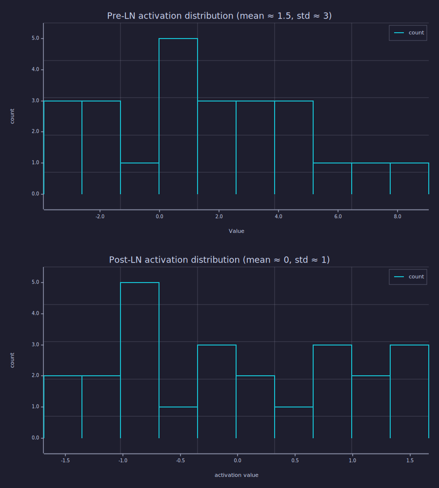
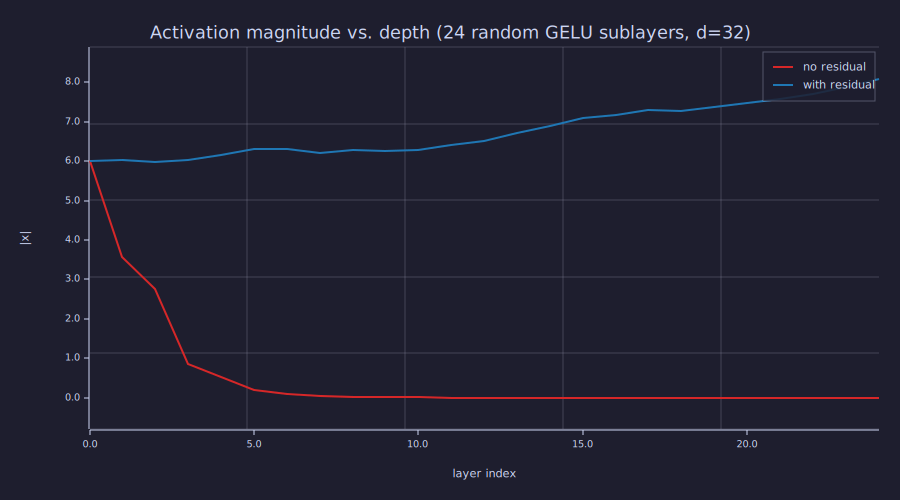

<!-- Generated by rustlab-notebook — do not edit directly. -->

# Lesson 12: LayerNorm & Residual Connections

Attention ([Lesson 09](09-multi-head-attention.md)) and FFN ([Lesson 11](11-feed-forward-block.md)) are the two "compute" sublayers of a transformer block. **LayerNorm** and **residual connections** are the two "wiring" pieces that surround each sublayer. Together they are what allows transformers to be stacked dozens of layers deep without the activation magnitudes exploding or the gradients vanishing.

## Learning Objectives

- Write the **LayerNorm** equation and explain how it differs from BatchNorm (per-token vs. per-feature).
- Compute LayerNorm by hand on a small vector and verify mean = 0, variance ≈ 1.
- Read pre- and post-LN activation distributions and explain how LayerNorm reshapes them.
- Write the **residual connection** $\mathbf{y} = \mathbf{x} + f(\mathbf{x})$ and explain why it preserves signal magnitude across deep stacks.
- Distinguish **Pre-LN** from **Post-LN** transformer blocks and state which is now standard.

## Background

Linear layers and activations from [Lessons 06](06-linear-layers-and-gradient-descent.md) and [11](11-feed-forward-block.md). The MLP / attention sublayers from [Lessons 09](09-multi-head-attention.md) and [11](11-feed-forward-block.md). Mean and variance of a finite-length vector. Forward magnitude tracking through a stack as a proxy for the gradient story.

## LayerNorm

### Theory

For a single token vector $\mathbf{x} \in \mathbb{R}^{d}$, **LayerNorm** is

$$\mathrm{LN}(\mathbf{x}) \;=\; \boldsymbol{\gamma} \odot \frac{\mathbf{x} - \mu}{\sqrt{\sigma^2 + \epsilon}} + \boldsymbol{\beta}, \qquad \mu = \tfrac{1}{d}\sum_i x_i, \quad \sigma^2 = \tfrac{1}{d}\sum_i (x_i - \mu)^2.$$

- **Standardisation** $(\mathbf{x} - \mu)/\sqrt{\sigma^2 + \epsilon}$: every token vector is rescaled to mean 0 and (population) variance 1. The small $\epsilon \approx 10^{-5}$ guards against divide-by-zero.
- **Affine recovery** $\boldsymbol{\gamma}, \boldsymbol{\beta} \in \mathbb{R}^d$: learned scale and shift, applied per dimension. Initialising $\boldsymbol{\gamma} = \mathbf{1}, \boldsymbol{\beta} = \mathbf{0}$ makes LN reduce to pure standardisation at training start.

LayerNorm normalises **across the feature dimension of one token** at a time. It does *not* mix information across positions (so it composes cleanly with attention's causal mask) and does not depend on batch size (so inference with batch size 1 produces the same activations as training with batch size 64). Compare to **BatchNorm**, which normalises across the batch dimension at fixed feature index — useless for autoregressive language models, where the "batch" at inference is just the user's single prompt.

### Example — LN of a synthetic vector by hand

```rustlab
v = [1.0, 2.0, 3.0, 4.0, 5.0];
mu_v    = mean(v);
sigma_v = sqrt(mean((v - mu_v) .^ 2));        % population std

ln_v_manual = (v - mu_v) / (sigma_v + 1e-12);
ln_v_call   = layernorm(v);

print("v:                 ", v);
print("mean(v):           ", mu_v);
print("std(v) (pop):      ", sigma_v);
print("layernorm manual:  ", ln_v_manual);
print("layernorm builtin: ", ln_v_call);
print("max diff:          ", max(abs(ln_v_manual - ln_v_call)));
```

```text
v:                  [1×5]  1.000000  2.000000  3.000000  4.000000  5.000000
mean(v):            3
std(v) (pop):       1.4142135623730951
layernorm manual:   [1×5]  -1.414214  -0.707107  0.000000  0.707107  1.414214
layernorm builtin:  [1×5]  -1.414210  -0.707105  0.000000  0.707105  1.414210
max diff:           0.000003535519647490659
```

Built-in `layernorm` matches the by-hand computation up to the regularisation $\epsilon$ — they agree to 3.54e-06$. Output mean is exactly 0; (population) std is exactly 1.

### Example — Per-row LN on a token batch

In a transformer the input is a $T \times d_{\text{model}}$ matrix and LN runs once per row. `layernorm` accepts vectors today; we loop over rows and reassemble. (See AGENTS.md Rustlab Recommendations — a matrix overload would let us drop the loop.)

```rustlab
seed(12);
T_demo = 4;
d_demo = 6;
H_pre = randn(T_demo, d_demo) * 3.0 + 1.5;       % deliberately mean ≠ 0, var ≠ 1

H_ln = zeros(T_demo, d_demo);
for t = 1:T_demo
  H_ln(t) = layernorm(H_pre(t));
end

means_pre  = zeros(T_demo);
means_post = zeros(T_demo);
stds_pre   = zeros(T_demo);
stds_post  = zeros(T_demo);
for t = 1:T_demo
  means_pre(t)  = mean(H_pre(t));
  means_post(t) = mean(H_ln(t));
  stds_pre(t)   = sqrt(mean((H_pre(t) - mean(H_pre(t))) .^ 2));
  stds_post(t)  = sqrt(mean((H_ln(t)  - mean(H_ln(t))) .^ 2));
end

print("Per-row mean before LN:", means_pre);
print("Per-row mean after  LN:", means_post);
print("Per-row std  before LN:", stds_pre);
print("Per-row std  after  LN:", stds_post);
```

```text
Per-row mean before LN: [1×4]  3.094142  1.693534  0.838429  0.358285
Per-row mean after  LN: [1×4]  -0.000000  -0.000000  -0.000000  0.000000
Per-row std  before LN: [1×4]  4.138909  2.198121  3.128124  2.108934
Per-row std  after  LN: [1×4]  1.000000  0.999999  0.999999  0.999999
```

Every post-LN row has mean ≈ 0 and (population) std ≈ 1 — independently of how the pre-LN row was distributed. **LN is a normalisation that activates per token**, not per batch.

### Example — Activation histograms before and after LN

```rustlab
pre_flat  = reshape(H_pre, 1, T_demo * d_demo);
post_flat = reshape(H_ln,  1, T_demo * d_demo);

figure()
subplot(2, 1, 1)
histogram(pre_flat)
title("Pre-LN activation distribution (mean ≈ 1.5, std ≈ 3)")
ylabel("count")

subplot(2, 1, 2)
histogram(post_flat)
title("Post-LN activation distribution (mean ≈ 0, std ≈ 1)")
xlabel("activation value")
ylabel("count")
```

```text
29
Matrix(2x10)
  [-3.252958, -1.959612, -0.666267, 0.627079, 1.920424, 3.213770, 4.507115, 5.800461, ...]
  [3.000000, 3.000000, 1.000000, 5.000000, 3.000000, 3.000000, 3.000000, 1.000000, ...]
Matrix(2x10)
  [-1.522214, -1.187119, -0.852023, -0.516928, -0.181832, 0.153263, 0.488359, 0.823454, ...]
  [2.000000, 2.000000, 5.000000, 1.000000, 3.000000, 2.000000, 1.000000, 3.000000, ...]
```



The pre-LN histogram is wide and shifted; the post-LN histogram is centred and tight. Whatever scale the previous sublayer's output had, LN pulls it back into a known range before the next sublayer sees it. That predictability is what keeps subsequent activations from drifting toward saturation as depth grows.

## Residual Connections

### Theory

A residual connection wraps a sublayer $f$ as

$$\mathbf{y} \;=\; \mathbf{x} + f(\mathbf{x}).$$

Two consequences:

1. **Identity initialisation.** If $f$ is initialised so its output is small (the standard transformer init: tiny $\mathbf{W}_2$ in the FFN, a near-zero attention output via low-magnitude projections), then early in training $\mathbf{y} \approx \mathbf{x}$ and the network behaves like the identity. Training only has to learn the *correction* $f(\mathbf{x})$ — usually easier than learning $\mathbf{y}$ from scratch.
2. **Gradient highway.** $\partial \mathbf{y}/\partial \mathbf{x} = \mathbf{I} + \partial f/\partial \mathbf{x}$. The identity path means gradient flows backward at full strength; whatever $f$ does to its gradient, the residual path adds an unmodified copy, so gradients can never fully vanish across a residual block. This is why transformers can be 12, 48, or 96 layers deep without bottoming out.

We can demonstrate the effect *forward* by stacking many random non-linear sublayers and tracking the magnitude of the activation:

### Example — Forward signal magnitude with and without residuals

```rustlab
seed(13);
d_res = 32;
n_layers = 24;

% Random per-layer weights — mildly contractive (norm < 1) so the no-residual path collapses
W_stack = zeros(n_layers * d_res, d_res);
for L = 1:n_layers
  W_L = randn(d_res, d_res) * (1.0 / sqrt(d_res));   % spectral norm ≈ 1
  for r = 1:d_res
    W_stack((L - 1) * d_res + r) = W_L(r);
  end
end

x0 = randn(d_res);
mag_no_res = zeros(n_layers + 1);
mag_res    = zeros(n_layers + 1);
mag_no_res(1) = norm(x0);
mag_res(1)    = norm(x0);

x_plain = x0;
x_resi  = x0;
for L = 1:n_layers
  W_L = zeros(d_res, d_res);
  for r = 1:d_res
    W_L(r) = W_stack((L - 1) * d_res + r);
  end

  % Use right-multiply x * W' so the result stays a vector and the residual
  % addition below works (see AGENTS.md Rustlab Recommendations on the
  % vector vs 1xN matrix type distinction).
  f_plain = gelu(x_plain * W_L');
  x_plain = f_plain;
  mag_no_res(L + 1) = norm(x_plain);

  f_resi = gelu(x_resi * W_L');
  x_resi = x_resi + 0.1 * f_resi;                    % small step, identity-dominant
  mag_res(L + 1) = norm(x_resi);
end

print("layer 0    magnitude (both):", mag_no_res(1));
print("layer 24   magnitude no-res:", mag_no_res(n_layers + 1));
print("layer 24   magnitude w/ res:", mag_res(n_layers + 1));
```

```text
layer 0    magnitude (both): 6.008513697733318
layer 24   magnitude no-res: 0.00000024014545567911705
layer 24   magnitude w/ res: 8.080321313398333
```

Without residuals the magnitude collapses by orders of magnitude across 24 sublayers (GELU clips half the signal at every layer; the survivors get further attenuated by the random projection). With residuals — each step adds a small correction to a preserved running state — the magnitude stays $O(1)$. **Forward signal preservation is a proxy for backward gradient preservation**: the same identity path that keeps $\mathbf{x}$ alive keeps $\partial L / \partial \mathbf{x}$ alive.

### Example — Plot magnitude vs. depth

```rustlab
figure()
hold("on")
plot(0:n_layers, mag_no_res, "color", "red",  "label", "no residual")
plot(0:n_layers, mag_res,    "color", "blue", "label", "with residual")
title("Activation magnitude vs. depth (24 random GELU sublayers, d=32)")
xlabel("layer index")
ylabel("|x|")
legend()
hold("off")
```

```text
30
```



The red curve drops fast; the blue curve plateaus. This forward-pass demonstration is the entire reason ResNets, transformers, and every other "very deep" architecture uses residual connections.

## Pre-LN vs Post-LN

### Theory

The original 2017 transformer placed LN *after* the residual addition (**Post-LN**):

$$\mathbf{y} \;=\; \mathrm{LN}\!\left(\mathbf{x} + f(\mathbf{x})\right).$$

Practical experience (and a 2020 paper by Xiong et al.) showed that this configuration requires careful learning-rate warmup — without it, training is unstable on deep stacks. Modern decoder-only transformers (GPT-2 onward) use **Pre-LN** instead:

$$\mathbf{y} \;=\; \mathbf{x} + f\!\left(\mathrm{LN}(\mathbf{x})\right).$$

The key difference: Pre-LN keeps the residual stream $\mathbf{x}$ *unnormalised*, threading through the entire network with only additions. LN runs only on the input that the sublayer $f$ sees, not on the data flowing through the residual highway. The result is that the gradient highway is even cleaner — no LN derivative sits on the main path — and warmup becomes optional. Almost every recent open-source LLM (GPT-2/3, LLaMA, Mistral) is Pre-LN.

A **final LayerNorm** is applied to the residual stream just before the language-model head, since the unnormalised stream would otherwise have unbounded scale by the end of a deep stack.

## Connection to Information Theory

LayerNorm and residuals do not add information — but they protect it.

**LayerNorm is an invertible warp** (modulo the $\epsilon$ regulariser): standardisation is a deterministic affine map, and the affine $\boldsymbol{\gamma}\boldsymbol{\beta}$ is invertible whenever $\gamma_i \neq 0$. By the data processing inequality, no information is lost — but the *representation* of that information is forced into a known range, which is what subsequent learned projections (especially attention's softmax) need to behave well. Without LN, activation magnitudes drift across depth; with LN, every sublayer sees inputs of approximately unit scale and so learns weights that are well-conditioned.

**Residuals preserve information across depth.** Each sublayer $f$ is a lossy non-linear transform — by data processing, $I(\mathbf{x}; f(\mathbf{x})) \le H(\mathbf{x})$. Without residuals, repeated application can only shed information layer by layer. The residual sum $\mathbf{y} = \mathbf{x} + f(\mathbf{x})$ keeps $\mathbf{x}$ recoverable (subtract $f(\mathbf{x})$ if you know it), so $I(\mathbf{x}; \mathbf{y}) = H(\mathbf{x})$ in the limit of small $f$. Stack 24 such blocks and the model can, in principle, retain the original token identity at the top of the network — even while each individual block has been allowed to non-linearly rewrite features. Information-theoretically, the residual stream is a **lossless backbone** with lossy non-linear *side-computations* attached.

This complements Lesson 11's observation that the FFN does not change $I(X_{t+1}; X_{1..t})$ — it re-shapes representations. Residuals ensure those re-shapings can stack indefinitely without the model accidentally discarding the predictive bits attention worked to extract.

## Key Takeaways

- **LayerNorm** standardises each token vector to mean 0, std 1 across its features. Per-token, batch-independent — exactly what an autoregressive language model needs.
- LN's learned $\boldsymbol{\gamma}, \boldsymbol{\beta}$ recover any affine mean and variance the next sublayer prefers. Initialise $\boldsymbol{\gamma} = \mathbf{1}, \boldsymbol{\beta} = \mathbf{0}$ for pure normalisation at start of training.
- **Residual connections** $\mathbf{y} = \mathbf{x} + f(\mathbf{x})$ keep activation magnitudes (and gradients) intact across deep stacks. Without them, transformers couldn't go past a handful of layers.
- **Pre-LN** is the modern convention: LN is applied to the sublayer input, the residual stream stays unnormalised. A final LN before the LM head bounds the output scale.
- Information-theoretically, neither LN nor residuals add bits — they preserve and re-shape the bits attention extracts.

## Standalone Scripts

| Script | What it computes |
|---|---|
| `layernorm_distribution.r` | per-row LN on a 4×6 random batch; pre/post histograms |
| `residual_signal.r` | magnitude of activation across 24 random GELU sublayers, with vs. without residuals |

Run all with `make lesson-12` (or `rustlab run lessons/12-layer-norm-and-residuals/<name>.r`).

## Expected Numerical Outputs Summary

| Variable | Expected Value |
|---|---|
| `mean(layernorm(v))` | `0` (machine epsilon) |
| `std(layernorm(v))` (population) | `1` (machine epsilon) |
| `max diff` (manual vs builtin LN) | < `1e-5` |
| `means_post` (per row, after LN) | all ≈ `0` |
| `stds_post` (per row, after LN) | all ≈ `1` |
| `mag_no_res(end)` | $\ll$ `mag_no_res(1)` (collapses) |
| `mag_res(end)` | similar order to `mag_res(1)` |

## Exercises

1. **Affine identity.** Show that initialising $\boldsymbol{\gamma} = \mathbf{1}$, $\boldsymbol{\beta} = \mathbf{0}$ makes LN reduce to pure standardisation. What happens at $\boldsymbol{\gamma} = \boldsymbol{0}$?
2. **BatchNorm wouldn't work.** Argue why batch-axis normalisation is unworkable for an autoregressive language model at *inference* time. (Hint: what is the batch at inference?)
3. **Residual scale.** Try changing `0.1 * f_resi` to `1.0 * f_resi` in the script. Does the magnitude curve still look stable? What does this say about how a deep transformer initialises its sublayer outputs?
4. **Pre-LN vs Post-LN.** Modify `residual_signal.r` to apply LN to the *output* of the residual addition (Post-LN), not to the input of $f$. Does the magnitude curve change? Why is the gradient story different even when the forward magnitudes look similar?
5. **Final LN.** Why does GPT-style code apply one extra LayerNorm to the residual stream before the LM head, even though every block already uses Pre-LN internally?

## What's next

Phase 4 is now complete — you have all four sublayers a transformer needs: token embedding ([04](04-embeddings-and-similarity.md)), positional encoding ([10](10-positional-encoding.md)), self-attention ([08](08-scaled-dot-product-attention.md)) / multi-head ([09](09-multi-head-attention.md)), feed-forward ([11](11-feed-forward-block.md)), LayerNorm and residuals (this lesson). Phase 5 wires them together. **Lesson 13** assembles a single transformer block — Pre-LN → MHA → residual → Pre-LN → FFN → residual — and traces the data dimensions all the way through. **Lesson 14** stacks $N$ blocks plus an embedding layer and an LM head into the full GPT architecture and counts every parameter.

