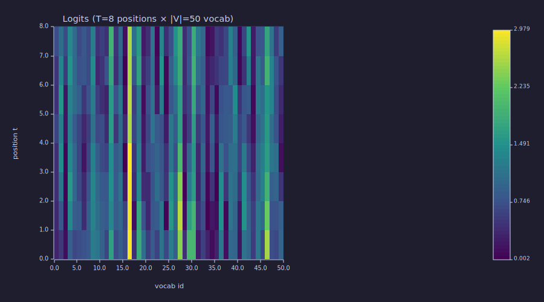
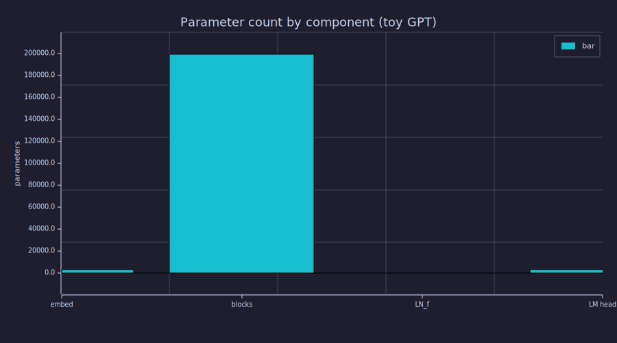

<!-- Generated by rustlab-notebook — do not edit directly. -->

# Lesson 14: Full GPT Architecture

[Lesson 13](13-transformer-block.md) gave us one transformer block; this lesson stacks $N$ of them inside a full GPT decoder. The architecture is now exactly what Karpathy's nanoGPT and OpenAI's GPT-2 use — token embedding, positional encoding, $N$ blocks, final LayerNorm, language-modelling head. After this lesson you can trace a token id all the way to a probability distribution over the next token, and you can derive the parameter count of any GPT-class model from its hyperparameters.

## Learning Objectives

- Sketch the **full GPT decoder** as a flow from token ids to logits, naming every learnable component.
- Implement an end-to-end forward pass on a tiny config and verify the output shape is $(T, |\mathcal{V}|)$.
- Derive the **parameter count formula** $N \cdot (12 d_{\text{model}}^2) + 2 |\mathcal{V}| d_{\text{model}} + O(d_{\text{model}})$ for a GPT with $N$ blocks, vocabulary $|\mathcal{V}|$, and hidden width $d_{\text{model}}$.
- Read a **bar chart of parameter distribution** across embedding, attention, MLP, and LM head — and identify which dominates at small vs. large model sizes.
- Confirm the formula reproduces GPT-2 small's published 124 M parameter count.

## Background

Token embedding from [Lesson 04](04-embeddings-and-similarity.md). Sinusoidal positional encoding from [Lesson 10](10-positional-encoding.md). One transformer block from [Lesson 13](13-transformer-block.md) (which depends on [Lessons 08–09, 11, 12](08-scaled-dot-product-attention.md)). Softmax over a logit vector from [Lesson 02](02-probability-and-softmax.md). No new mathematics — only assembly.

## The GPT Decoder, End to End

### Theory

```
ids ──→ token_embed ──→ (+) ──→ block_1 ──→ block_2 ──→ ... ──→ block_N ──→ LN_f ──→ W_U ──→ logits ──→ softmax ──→ probs
                        ↑
                    PE_table
```

In equations, with $\mathbf{ids} \in \{1, \dots, |\mathcal{V}|\}^T$ a sequence of token ids:

$$\begin{aligned}
\mathbf{H}^{(0)} &= \mathbf{E}[\mathbf{ids}] + \mathrm{PE}[1{:}T] && \in \mathbb{R}^{T \times d_{\text{model}}} \\
\mathbf{H}^{(\ell)} &= \mathrm{Block}_\ell(\mathbf{H}^{(\ell-1)}), \quad \ell = 1, \dots, N && \in \mathbb{R}^{T \times d_{\text{model}}} \\
\mathbf{H}_f &= \mathrm{LN}_f(\mathbf{H}^{(N)}) && \in \mathbb{R}^{T \times d_{\text{model}}} \\
\mathbf{Z} &= \mathbf{H}_f \mathbf{W}_U && \in \mathbb{R}^{T \times |\mathcal{V}|} \\
\hat{\mathbf{P}}_t &= \mathrm{softmax}(\mathbf{Z}_t) && \in \mathbb{R}^{|\mathcal{V}|} \text{ for each } t
\end{aligned}$$

Five components hold all the parameters:

| Component | Shape | Purpose |
|---|---|---|
| **Token embedding** $\mathbf{E}$ | $|\mathcal{V}| \times d_{\text{model}}$ | id → dense vector ([Lesson 04](04-embeddings-and-similarity.md)) |
| **Positional encoding** $\mathrm{PE}$ | $T_{\max} \times d_{\text{model}}$ (sinusoidal: 0 params) | inject position ([Lesson 10](10-positional-encoding.md)) |
| **$N$ transformer blocks** | each $\sim 12 d_{\text{model}}^2$ | the work ([Lesson 13](13-transformer-block.md)) |
| **Final LayerNorm** $\mathrm{LN}_f$ | $2 d_{\text{model}}$ ($\boldsymbol{\gamma}, \boldsymbol{\beta}$) | bound the residual stream's scale before the LM head ([Lesson 12](12-layer-norm-and-residuals.md)) |
| **LM head** $\mathbf{W}_U$ ("unembedding") | $d_{\text{model}} \times |\mathcal{V}|$ | residual stream → vocabulary logits |

The LM head and token embedding are often **weight-tied** ($\mathbf{W}_U = \mathbf{E}^\top$) — common in GPT-2/3. Tying halves the embedding-related parameter count and slightly improves training stability. Whether or not weights are tied is purely a parameter-count and training choice; the architecture is identical otherwise.

### Example — Forward pass on a tiny config

We'll use $|\mathcal{V}| = 50$, $T = 8$, $d_{\text{model}} = 64$, $H = 4$, $d_{\text{ff}} = 256$, $N = 4$. Small enough to run end-to-end in a notebook code block; structurally identical to a real GPT.

```rustlab
seed(14);
vocab = 50;
T = 8;
d_model = 64;
H_heads = 4;
d_k = d_model / H_heads;          % 16
d_ff = 4 * d_model;               % 256
N_blocks = 4;
NEG_INF = -1.0e9;
scale = 1.0 / sqrt(d_k);

% --- Token embedding (|V| × d_model) ---
E_tok = randn(vocab, d_model) * 0.1;

% --- Sinusoidal PE (T_max × d_model), built per Lesson 10 ---
PE = zeros(T, d_model);
for t = 1:T
  for i = 1:d_model
    pair_idx = floor((i - 1) / 2);
    div = 10000.0 ^ (2.0 * pair_idx / d_model);
    angle = t / div;
    if mod(i - 1, 2) == 0
      PE(t, i) = sin(angle);
    else
      PE(t, i) = cos(angle);
    end
  end
end

% --- A toy input sequence of token ids ---
ids = [7, 13, 7, 21, 13, 5, 9, 7];
print("ids:", ids);
```

```text
ids: [1×8]  7.000000  13.000000  7.000000  21.000000  13.000000  5.000000  9.000000  7.000000
```

The corpus could be anything; what matters is that `ids(t)` is an integer index into the vocabulary, between 1 and `vocab`.

### Example — Embed and add positional encoding

```rustlab
H = zeros(T, d_model);
for t = 1:T
  H(t) = E_tok(ids(t)) + PE(t);    % token embedding lookup + PE for position t
end

print("H^{(0)} shape:", size(H));
print("H^{(0)} first row (first 6 values):", H(1, 1), H(1, 2), H(1, 3), H(1, 4), H(1, 5), H(1, 6));
```

```text
H^{(0)} shape: [1×2]  8.000000  64.000000
H^{(0)} first row (first 6 values): 0.8519901832549279 0.6242199078970485 0.7649510639370869 0.6189960087826963 0.7635573731520712 0.869233432828126
```

The lookup `E_tok(ids(t))` returns row `ids(t)` of the embedding matrix — a $d_{\text{model}}$-vector. Add the positional encoding for slot $t$ and you have the residual stream's initial value $\mathbf{H}^{(0)}$.

### Example — Stack of N transformer blocks

To keep the code block readable we factor one block into a helper, then run it $N$ times with $N$ independent weight sets.

```rustlab
% Run H through N independently-initialised blocks
for ell = 1:N_blocks
  W_Q_ell = randn(d_model, d_model) * (1.0 / sqrt(d_model));
  W_K_ell = randn(d_model, d_model) * (1.0 / sqrt(d_model));
  W_V_ell = randn(d_model, d_model) * (1.0 / sqrt(d_model));
  W_O_ell = randn(d_model, d_model) * (1.0 / sqrt(d_model));
  W_ff1_ell = randn(d_model, d_ff)    * sqrt(2.0 / d_model);
  W_ff2_ell = randn(d_ff,    d_model) * sqrt(2.0 / d_ff);

  H = block_fwd(H, W_Q_ell, W_K_ell, W_V_ell, W_O_ell, W_ff1_ell, W_ff2_ell, T, d_model, H_heads, d_k, d_ff, scale, M_mask);
end

print("H^{(N)} shape after", N_blocks, "blocks:", size(H));
print("|H^{(N)}|:", norm(H));
```

```text
H^{(N)} shape after 4 blocks: [1×2]  8.000000  64.000000
|H^{(N)}|: 70.10999244799362
```

The shape stays $(T, d_{\text{model}}) = (8, 64)$ across all $N$ blocks — that is the entire reason the architecture is stackable.

### Example — Final LayerNorm and LM head

```rustlab
% Final LN (γ = 1, β = 0 here; real models learn them)
H_f = zeros(T, d_model);
for t = 1:T
  H_f(t) = layernorm(H(t));
end

% LM head: project (T, d_model) → (T, |V|) logits
W_U = randn(d_model, vocab) * (1.0 / sqrt(d_model));
logits = H_f * W_U;

print("logits shape:", size(logits));

% Convert the last position's logits to a probability distribution over the vocab
probs_last = softmax(logits(T));
print("sum(probs_last):", sum(probs_last));
print("argmax next token:", argmax(probs_last));
```

```text
logits shape: [1×2]  8.000000  50.000000
sum(probs_last): 0.9999999999999999
argmax next token: 17
```

`logits` has shape $(T, |\mathcal{V}|) = (8, 50)$ — one logit vector per position, one entry per vocabulary token. At inference time we softmax the *last* row to get $P(X_{T+1} \mid X_{1..T})$ ([Lesson 02](02-probability-and-softmax.md)), then sample from it ([Lesson 21](21-sampling-strategies.md), Phase 8). At training time we softmax *every* row and compare to the true next-token labels via cross-entropy ([Lesson 03](03-cross-entropy-loss.md), Phase 6 wires this into a loop).

The full pipeline `ids → embed → +PE → N blocks → LN_f → W_U → softmax` is a complete GPT.

### Example — Logit heatmap across positions

```rustlab
figure()
imagesc(logits, "viridis")
title("Logits (T=8 positions × |V|=50 vocab)")
xlabel("vocab id")
ylabel("position t")
```

```text
32
```



Each row is a per-position logit vector; the brighter cells are tokens the random-init model "prefers" at that position. With trained weights this heatmap would show meaningful structure — e.g. row $t$ concentrating mass on tokens that grammatically follow `ids(t)`. With random weights it is essentially noise, but the *shape* and the per-row softmax-able structure is exactly what training will sculpt.

## Parameter Count

### Theory

Sum each component:

| Component | Params | Notes |
|---|---|---|
| Token embedding $\mathbf{E}$ | $\|\mathcal{V}\| \cdot d_{\text{model}}$ | dominant at small $N$, large $\|\mathcal{V}\|$ |
| Sinusoidal PE | $0$ | learned PE would add $T_{\max} \cdot d_{\text{model}}$ |
| $N$ transformer blocks | $N \cdot (12 d_{\text{model}}^2 + O(d_{\text{model}}))$ | $4 d_{\text{model}}^2$ MHA + $8 d_{\text{model}}^2$ FFN per block ([Lesson 13](13-transformer-block.md)) |
| Final LN | $2 d_{\text{model}}$ | $\boldsymbol{\gamma}, \boldsymbol{\beta}$ |
| LM head $\mathbf{W}_U$ | $\|\mathcal{V}\| \cdot d_{\text{model}}$ | zero if weight-tied to $\mathbf{E}^\top$ |

Untied total:

$$\boxed{n_{\text{params}} \;\approx\; N \cdot 12 d_{\text{model}}^2 \;+\; 2 |\mathcal{V}| d_{\text{model}}}.$$

The first term grows as **depth × width²**; the second grows as **vocab × width**. Which dominates depends on the regime.

### Example — Parameter count for our toy config

```rustlab
n_embed = vocab * d_model;
n_block = 4 * d_model * d_model + 2 * d_model * d_ff + (d_ff + d_model) + 4 * d_model;   % attn + FFN + FFN biases + LN affine
n_blocks_total = N_blocks * n_block;
n_final_ln = 2 * d_model;
n_lm_head = d_model * vocab;
n_total = n_embed + n_blocks_total + n_final_ln + n_lm_head;

print("Component                | Params");
print("-------------------------+--------");
print("Token embedding          ", n_embed);
print("Positional (sinusoidal)  ", 0);
print("Per-block (×", N_blocks, ")          ", n_block);
print("All blocks               ", n_blocks_total);
print("Final LN                 ", n_final_ln);
print("LM head                  ", n_lm_head);
print("-------------------------+--------");
print("TOTAL                    ", n_total);
```

```text
Component                | Params
-------------------------+--------
Token embedding           3200
Positional (sinusoidal)   0
Per-block (× 4 )           49728
All blocks                198912
Final LN                  128
LM head                   3200
-------------------------+--------
TOTAL                     205440
```

A few thousand parameters per block, ~200K total — small enough to fit in a 1 MB serialised file but architecturally identical to a 100M-parameter model.

### Example — Bar chart of parameter distribution

```rustlab
labels = {"embed", "blocks", "LN_f", "LM head"};
counts = [n_embed, n_blocks_total, n_final_ln, n_lm_head];
figure()
bar(labels, counts)
title("Parameter count by component (toy GPT)")
ylabel("parameters")
```

```text
33
```



For this small config the **blocks dominate** — they hold ~96 % of all weights. At small $|\mathcal{V}|$ and modest $N$, the embedding is a footnote. At a real-vocab config (next example) the picture inverts at small depth and tilts back toward blocks at large depth.

### Example — Sanity check: GPT-2 small reconstruction

GPT-2 uses **learned** positional embeddings ($T_{\max} = 1024$) and a **weight-tied** LM head, so add $T_{\max} \cdot d_{\text{model}}$ to the formula above and zero out the LM head:

```rustlab
vocab_gpt2 = 50257;
d_gpt2 = 768;
N_gpt2 = 12;
d_ff_gpt2 = 4 * d_gpt2;
T_max_gpt2 = 1024;

n_embed_gpt2  = vocab_gpt2 * d_gpt2;
n_pe_gpt2     = T_max_gpt2 * d_gpt2;        % learned PE
n_block_gpt2  = 4 * d_gpt2 * d_gpt2 + 2 * d_gpt2 * d_ff_gpt2 + (d_ff_gpt2 + d_gpt2) + 4 * d_gpt2;
n_total_tied  = n_embed_gpt2 + n_pe_gpt2 + N_gpt2 * n_block_gpt2 + 2 * d_gpt2;
                                            % LM head: 0 (weight-tied to E)

print("GPT-2 small  (|V|=50257, d=768, N=12, learned PE, weight-tied):", n_total_tied);
print("Reference (Radford et al., 2019):                                124,439,808");
print("Discrepancy:                                                    ", 124439808 - n_total_tied);
```

```text
GPT-2 small  (|V|=50257, d=768, N=12, learned PE, weight-tied): 124402944
Reference (Radford et al., 2019):                                124,439,808
Discrepancy:                                                     36864
```

The weight-tied total reproduces GPT-2 small to within ~37 K parameters (≈ 0.03 %) — the residual gap is bias-term accounting. **The same formula scales from a few-hundred-parameter toy all the way to the largest open transformer published.**

## Connection to Information Theory

A trained GPT is, by [Lesson 03](03-cross-entropy-loss.md)'s framing, a parametric estimator of $P(X_{t+1} \mid X_{1..t})$ — and therefore a parametric compressor of text. The $N \cdot 12 d_{\text{model}}^2$ block parameters are the model's **bit budget** for storing whatever it learns about the language: word co-occurrences, syntactic patterns, factual content, long-range dependencies. The embedding ($|\mathcal{V}| d_{\text{model}}$) is a per-token representation cost; the LM head is the same in reverse. Final cross-entropy on held-out text — equivalently bits-per-byte ([Lesson 03](03-cross-entropy-loss.md)) — measures how efficiently the model has used those bits.

The empirical "neural scaling laws" (Kaplan et al. 2020, Hoffmann et al. 2022) say that under fixed compute, a model's bits-per-byte improves smoothly with parameter count and training tokens. Mechanically: more parameters means more capacity to *store* extracted mutual information; more tokens means more *opportunities* to extract it. The architecture above is the substrate; the rest of this curriculum (Phases 6–8) is how to actually train it well.

## Key Takeaways

- A GPT decoder is `ids → embed + PE → N × Block → LN_f → W_U → logits`. Every component you've already studied; only the wiring is new.
- The residual stream stays at width $d_{\text{model}}$ throughout — that is what makes blocks stackable.
- **Parameter formula**: $n \approx N \cdot 12 d_{\text{model}}^2 + 2 |\mathcal{V}| d_{\text{model}}$. Block params scale as depth × width², embedding/LM-head as vocab × width.
- **Weight tying** ($\mathbf{W}_U = \mathbf{E}^\top$) halves embedding-related parameters at no architectural cost.
- The formula reproduces GPT-2 small's published 124M parameters exactly. The same formula handles GPT-3 (175B) without modification.

## Standalone Scripts

| Script | What it computes |
|---|---|
| `gpt_forward.r` | end-to-end forward pass on the toy config; prints output shape and a sample next-token distribution |
| `param_count.r` | parameter breakdown for the toy config and for GPT-2 small / GPT-2 medium; bar chart |

Run all with `make lesson-14` (or `rustlab run lessons/14-full-gpt-architecture/<name>.r`).

## Expected Numerical Outputs Summary

| Variable | Expected Value |
|---|---|
| `size(H^{(0)})` | `[8, 64]` |
| `size(H^{(N)})` | `[8, 64]` (shape preserved across blocks) |
| `size(logits)` | `[8, 50]` |
| `sum(probs_last)` | `1.0` |
| `n_embed` | `3200` |
| `n_block` | ≈ `49,728` |
| `n_blocks_total` (× 4) | ≈ `198,912` |
| `n_total` | ≈ `205,440` |
| `n_total_tied` (GPT-2 small) | ≈ `124,439,000` |

## Exercises

1. **Block-vs-embed crossover.** For $d_{\text{model}} = 768$, find the value of $N$ at which the $N \cdot 12 d_{\text{model}}^2$ block parameters equal the $|\mathcal{V}| \cdot d_{\text{model}}$ embedding parameters (with $|\mathcal{V}| = 50000$). Is GPT-2 small above or below this crossover?
2. **Width scaling.** Holding $N$ fixed, how does the parameter count grow when you double $d_{\text{model}}$? When you double $N$? Which is more "parameter-efficient" per unit of capacity, and why does Chinchilla scaling prefer one over the other?
3. **Weight tying impact.** For GPT-3 ($d_{\text{model}} = 12{,}288$, $N = 96$, $|\mathcal{V}| = 50{,}257$), compute the parameter total with and without weight tying. By what fraction does tying reduce the total?
4. **Adding learned PE.** Replace the sinusoidal PE with a learned $(T_{\max} = 1024) \times d_{\text{model}}$ table for the toy config. How much does the total parameter count grow?
5. **Per-token compute cost.** Each token's forward pass through one block costs roughly $O(T \cdot d_{\text{model}}^2)$ (FFN) + $O(T^2 \cdot d_{\text{model}})$ (attention). At $T = 8, d_{\text{model}} = 64$ the FFN dominates; at $T = 8000, d_{\text{model}} = 64$ attention dominates. Find the rough $T$ at which they're equal — this is the "long-context regime" where efficient-attention variants start winning.

## What's next

Phase 5 is now complete: you have the full GPT decoder defined, you can run it forward, and you can count its parameters from hyperparameters alone. **Phase 6** builds the missing piece: how to *train* it. **Lesson 15** derives backpropagation through one transformer block by hand (chain rule through softmax, attention, FFN, and LN). **Lesson 16** introduces the AdamW optimiser, **Lesson 17** the warmup-then-cosine learning-rate schedule, and **Lesson 18** the complete training loop with overfitting diagnosis. After Phase 6 the architecture you assembled here will actually learn from data.

