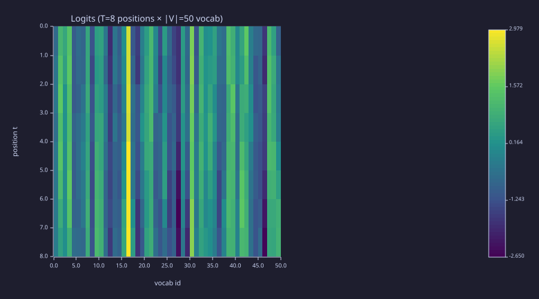
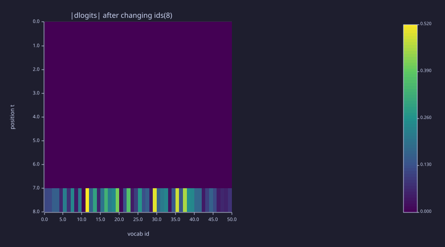
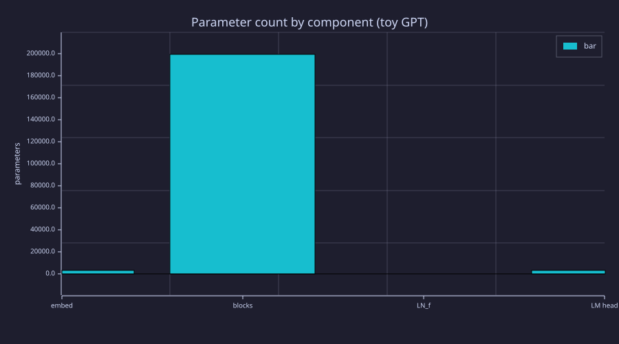
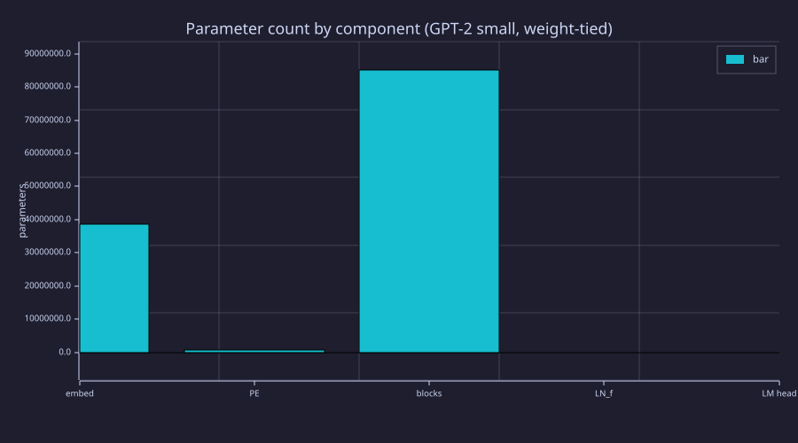
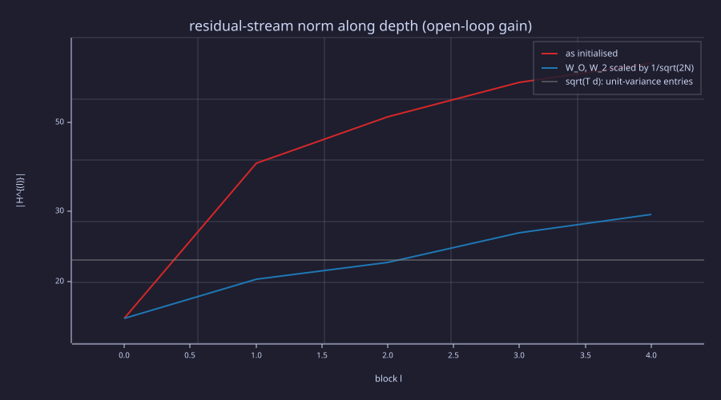

<!-- Generated by rustlab-notebook — do not edit directly. -->

# Lesson 14: Full GPT Architecture

[Lesson 13](13-transformer-block.md) gave us one transformer block; this lesson stacks $N$ of them inside a full GPT decoder. The architecture is now exactly what Karpathy's nanoGPT and OpenAI's GPT-2 use — token embedding, positional encoding, $N$ blocks, final LayerNorm, language-modelling head. After this lesson you can trace a token id all the way to a probability distribution over the next token, prove that the whole pipeline is causal, and derive both the parameter count and the compute cost per token of any GPT-2-class model from its hyperparameters.

## Learning Objectives

- Sketch the **full GPT decoder** as a signal-flow graph from token ids to logits, with the tensor shape on every edge and every learnable component named.
- Implement an end-to-end forward pass on a tiny config, verify the output shape is $(T, |\mathcal{V}|)$, and prove **causality end-to-end**: changing token 8 leaves the logits of positions 1–7 bit-identical.
- Derive the **parameter count formula** $N \cdot (12 d_{\text{model}}^2) + 2 |\mathcal{V}| d_{\text{model}} + O(d_{\text{model}})$ and confirm it reproduces GPT-2 small's published 124 M parameters.
- Estimate the **compute budget**: FLOPs per token $\approx 2 \times$ parameters forward and $\approx 6 \times$ per training token, plus attention's $T$-dependent term, and find the context length at which attention's score FLOPs equal the FFN's.
- Read bar charts of the parameter distribution for the toy config and for GPT-2 small, where the embedding is $\approx 31\,\%$ of the model.

## Background

Token embedding from [Lesson 04](04-embeddings-and-similarity.md). Sinusoidal positional encoding from [Lesson 10](10-positional-encoding.md). One transformer block from [Lesson 13](13-transformer-block.md) (which depends on [Lessons 08–09, 11, 12](08-scaled-dot-product-attention.md)). Softmax over a logit vector from [Lesson 02](02-probability-and-softmax.md). No new mathematics — only assembly.

## The GPT Decoder, End to End

### Theory

```mermaid
flowchart LR
  ids["token ids (T)"] -->|row lookup in E (V × d)| emb["E[ids] (T × d)"]
  pe["PE table (T_max × d)"] -->|rows 1..T (T × d)| add0(("+"))
  emb -->|T × d| add0
  add0 -->|H(0) (T × d)| B1["Block 1"]
  B1 -->|H(1) (T × d)| Bd["Blocks 2 .. N−1"]
  Bd -->|T × d| BN["Block N"]
  BN -->|H(N) (T × d)| LNf["LN_f (per row)"]
  LNf -->|H_f (T × d)| head["LM head W_U (d × V)"]
  head -->|logits Z (T × V)| sm["softmax (per row)"]
  sm -->|P-hat (T × V)| out["P(next token) per position"]
```

> [!TIP]
> Every edge from the `+` node to $\mathrm{LN}_f$ carries the same $(T, d)$ residual stream; the only shape changes are the lookup at the start ($T$ integers become $T \times d$) and the head at the end ($T \times d$ becomes $T \times |\mathcal{V}|$). $V$ in the diagram is $|\mathcal{V}|$.

In equations, with $\mathbf{ids} \in \{1, \dots, |\mathcal{V}|\}^T$ a sequence of token ids:

$$\begin{aligned}
\mathbf{H}^{(0)} &= \mathbf{E}[\mathbf{ids}] + \mathrm{PE}[1{:}T] && \in \mathbb{R}^{T \times d_{\text{model}}} \\
\mathbf{H}^{(\ell)} &= \mathrm{Block}_\ell(\mathbf{H}^{(\ell-1)}), \quad \ell = 1, \dots, N && \in \mathbb{R}^{T \times d_{\text{model}}} \\
\mathbf{H}_f &= \mathrm{LN}_f(\mathbf{H}^{(N)}) && \in \mathbb{R}^{T \times d_{\text{model}}} \\
\mathbf{Z} &= \mathbf{H}_f \mathbf{W}_U && \in \mathbb{R}^{T \times |\mathcal{V}|} \\
\hat{\mathbf{P}}_t &= \mathrm{softmax}(\mathbf{Z}_t) && \in \mathbb{R}^{|\mathcal{V}|} \text{ for each } t
\end{aligned}$$

Five components hold all the parameters:

| Component | Shape | Purpose |
|---|---|---|
| **Token embedding** $\mathbf{E}$ | $\lvert\mathcal{V}\rvert \times d_{\text{model}}$ | id → dense vector ([Lesson 04](04-embeddings-and-similarity.md)) |
| **Positional encoding** $\mathrm{PE}$ | $T_{\max} \times d_{\text{model}}$ (sinusoidal: 0 params) | inject position ([Lesson 10](10-positional-encoding.md)) |
| **$N$ transformer blocks** | each $\sim 12 d_{\text{model}}^2$ | the work ([Lesson 13](13-transformer-block.md)) |
| **Final LayerNorm** $\mathrm{LN}_f$ | $2 d_{\text{model}}$ ($\boldsymbol{\gamma}, \boldsymbol{\beta}$) | bound the residual stream's scale before the LM head ([Lesson 12](12-layer-norm-and-residuals.md)) |
| **LM head** $\mathbf{W}_U$ ("unembedding") | $d_{\text{model}} \times \lvert\mathcal{V}\rvert$ | residual stream → vocabulary logits |

The LM head and token embedding are often **weight-tied** ($\mathbf{W}_U = \mathbf{E}^\top$) — common in GPT-2/3. Tying halves the embedding-related parameter count and slightly improves training stability. Whether or not weights are tied is purely a parameter-count and training choice; the architecture is identical otherwise.

**Why logits → softmax → loss.** The head is linear, so it cannot emit a normalised non-negative vector; it emits *logits*, which softmax reads as log-odds ($z_i - z_j = \ln \hat P_i / \hat P_j$) and turns into the maximum-entropy — Gibbs — distribution consistent with those scores ([Lesson 02](02-probability-and-softmax.md)). Cross-entropy then charges $-\log_2 \hat P_t(x_{t+1})$ bits per position: the code length of the true next token under the model's distribution ([Lesson 03](03-cross-entropy-loss.md)), which is why the training loss is measured in nats or bits and why its floor is the entropy of the source.

### Example — Forward pass on a tiny config

We'll use $|\mathcal{V}| = 50$, $T = 8$, $d_{\text{model}} = 64$, $H = 4$, $d_{\text{ff}} = 256$, $N = 4$. Small enough to run end-to-end in a notebook code block; structurally identical to a real GPT. The sinusoidal table $\mathrm{PE}$ ($T \times d_{\text{model}}$) is built exactly as in [Lesson 10](10-positional-encoding.md) (construction hidden).

```rustlab
seed(14);
vocab = 50;
T = 8;
d_model = 64;
H_heads = 4;
d_k = d_model / H_heads;          % 16
d_ff = 4 * d_model;               % 256
N_blocks = 4;

% --- Token embedding (|V| × d_model) ---
E_tok = randn(vocab, d_model) * 0.1;

% --- A toy input sequence of token ids ---
ids = [7, 13, 7, 21, 13, 5, 9, 7];
print("ids:", ids);
```

<!-- rustlab:output-start -->
```text
ids: [1×8]  7.000000  13.000000  7.000000  21.000000  13.000000  5.000000  9.000000  7.000000
```

<!-- rustlab:output-end -->

The corpus could be anything; what matters is that `ids(t)` is an integer index into the vocabulary, between 1 and `vocab`.

### Example — Embed and add positional encoding

```rustlab
H = zeros(T, d_model);
for t = 1:T
  H(t, :) = E_tok(ids(t), :) + PE(t, :);    % token embedding lookup + PE for position t
end

print("H^{(0)} shape:", size(H));
print("H^{(0)} first row (first 6 values):", H(1, 1), H(1, 2), H(1, 3), H(1, 4), H(1, 5), H(1, 6));
```

<!-- rustlab:output-start -->
```text
H^{(0)} shape: [1×2]  8.000000  64.000000
H^{(0)} first row (first 6 values): 0.8519901832549279 0.6242199078970485 0.7649510639370869 0.6189960087826963 0.7635573731520712 0.869233432828126
```

<!-- rustlab:output-end -->

The lookup `E_tok(ids(t), :)` returns row `ids(t)` of the embedding matrix — a $d_{\text{model}}$-vector (the trailing `:` selects the whole row). Add the positional encoding for slot $t$ and you have the residual stream's initial value $\mathbf{H}^{(0)}$.

### Example — Stack of N transformer blocks

The block itself comes from the shared library `lib/transformer.rlab`: `mha_block_forward` is exactly the [Lesson 13](13-transformer-block.md) block. Every block gets its own weights; they are drawn up front and stored stacked block-by-block (rows $(\ell-1) d_{\text{model}} + 1 \dots \ell\, d_{\text{model}}$ belong to block $\ell$) so the causality test and the Systems lens below can re-run the *same* model.

```rustlab
W_Q_all = zeros(N_blocks * d_model, d_model);  W_K_all = zeros(N_blocks * d_model, d_model);
W_V_all = zeros(N_blocks * d_model, d_model);  W_O_all = zeros(N_blocks * d_model, d_model);
W_ff1_all = zeros(N_blocks * d_model, d_ff);   W_ff2_all = zeros(N_blocks * d_ff, d_model);
for ell = 1:N_blocks
  r  = ((ell - 1) * d_model + 1):(ell * d_model);     % this block's rows in the d_model-row stacks
  rf = ((ell - 1) * d_ff + 1):(ell * d_ff);           % ... and in the d_ff-row stack
  W_Q_all(r, :) = randn(d_model, d_model) * (1.0 / sqrt(d_model));
  W_K_all(r, :) = randn(d_model, d_model) * (1.0 / sqrt(d_model));
  W_V_all(r, :) = randn(d_model, d_model) * (1.0 / sqrt(d_model));
  W_O_all(r, :) = randn(d_model, d_model) * (1.0 / sqrt(d_model));
  W_ff1_all(r, :)  = randn(d_model, d_ff) * sqrt(2.0 / d_model);
  W_ff2_all(rf, :) = randn(d_ff, d_model) * sqrt(2.0 / d_ff);
end

% Run H through the N blocks, recording the residual-stream norm after each.
norms_l = zeros(N_blocks + 1);
norms_l(1) = norm(H);
for ell = 1:N_blocks
  r  = ((ell - 1) * d_model + 1):(ell * d_model);
  rf = ((ell - 1) * d_ff + 1):(ell * d_ff);
  H = mha_block_forward(H, W_Q_all(r, :), W_K_all(r, :), W_V_all(r, :), W_O_all(r, :), ...
                        W_ff1_all(r, :), W_ff2_all(rf, :), H_heads, M_mask);
  norms_l(ell + 1) = norm(H);
end

print("H^{(N)} shape after", N_blocks, "blocks:", size(H));
print("|H^{(N)}|:", norm(H));
print("|H^{(l)}| for l = 0..N:", norms_l);
print("sqrt(T * d_model), the norm of an (8 × 64) matrix of unit-variance entries:", sqrt(T * d_model));
```

<!-- rustlab:output-start -->
```text
H^{(N)} shape after 4 blocks: [1×2]  8.000000  64.000000
|H^{(N)}|: 70.10999244799362
|H^{(l)}| for l = 0..N: [1×5]  16.167976  39.454181  51.481187  62.771013  70.109992
sqrt(T * d_model), the norm of an (8 × 64) matrix of unit-variance entries: 22.627416997969522
```

<!-- rustlab:output-end -->

The shape stays $(T, d_{\text{model}}) = (8, 64)$ across all $N$ blocks — that is the entire reason the architecture is stackable. The *scale* does not stay put: $\|\mathbf{H}^{(N)}\| = 70.1$ for an $8 \times 64$ matrix, whereas unit-variance entries would give $\sqrt{512} = 22.6$. The stream grew from $\|\mathbf{H}^{(0)}\| = 16.2$ to $39.5 \to 51.5 \to 62.8 \to 70.1$ — about $3\times$ over four blocks, [Lesson 13](13-transformer-block.md)'s accumulation story continued. That growth is exactly why $\mathrm{LN}_f$ exists: without it the logit scale, and therefore the effective softmax temperature ([Lesson 02](02-probability-and-softmax.md)), would depend on depth and on initialisation.

### Example — Final LayerNorm and LM head

```rustlab
% Final LN (γ = 1, β = 0 here; real models learn them)
H_f = layernorm(H);

% LM head: project (T, d_model) → (T, |V|) logits
W_U = randn(d_model, vocab) * (1.0 / sqrt(d_model));
logits = H_f * W_U;

print("logits shape:", size(logits));

% Convert the last position's logits to a probability distribution over the vocab
probs_last = softmax(logits(T, :));
print("sum(probs_last):", sum(probs_last));
print("argmax next token:", argmax(probs_last));
```

<!-- rustlab:output-start -->
```text
logits shape: [1×2]  8.000000  50.000000
sum(probs_last): 0.9999999999999999
argmax next token: 17
```

<!-- rustlab:output-end -->

`logits` has shape $(T, |\mathcal{V}|) = (8, 50)$ — one logit vector per position, one entry per vocabulary token. At inference time we softmax the *last* row to get $P(X_{T+1} \mid X_{1..T})$ ([Lesson 02](02-probability-and-softmax.md)), then sample from it ([Lesson 21](21-sampling-and-generation.md), Phase 8). At training time we softmax *every* row and compare to the true next-token labels via cross-entropy ([Lesson 03](03-cross-entropy-loss.md), Phase 6 wires this into a loop).

The full pipeline `ids → embed → +PE → N blocks → LN_f → W_U → softmax` is a complete GPT.

### Example — Logit heatmap across positions

```rustlab
figure();
imagesc(logits, "viridis")
title("Logits (T=8 positions × |V|=50 vocab)")
xlabel("vocab id")
ylabel("position t")
```

<!-- rustlab:output-start -->


<!-- rustlab:output-end -->

> [!TIP]
> Each row is a per-position logit vector on a signed scale; the brighter cells are tokens the random-init model "prefers" at that position. With trained weights row $t$ would concentrate on tokens that plausibly follow `ids(1..t)`; with random weights it is noise — but the shape, and the per-row softmax-able structure, is exactly what training will sculpt.

### Example — End-to-end causality test

The mask makes every *block* causal; the claim for the *model* is that $\hat{\mathbf{P}}_t$ depends only on $\mathbf{ids}(1..t)$. Test it directly: change the last token and compare the logits at every position. A hidden wrapper `toy_gpt_forward` re-runs the exact pipeline above (embed → the same stacked weights → $\mathrm{LN}_f$ → head) for any id sequence.

```rustlab
[logits_chk, norms_chk] = toy_gpt_forward(ids, E_tok, PE, W_Q_all, W_K_all, W_V_all, W_O_all, W_ff1_all, W_ff2_all, W_U, H_heads, M_mask, 1.0);
print("wrapper reproduces the step-by-step logits: max |diff| =", max(max(abs(logits_chk - logits))));
ids_b = ids;
ids_b(T) = 42;                                   % change only the last token
[logits_b, norms_b] = toy_gpt_forward(ids_b, E_tok, PE, W_Q_all, W_K_all, W_V_all, W_O_all, W_ff1_all, W_ff2_all, W_U, H_heads, M_mask, 1.0);
dZ = logits_b - logits;
print("max |dZ| over positions 1..7:", max(max(abs(dZ(1:(T - 1), :)))));
print("max |dZ| at position 8:      ", max(abs(dZ(T, :))));
figure();
imagesc(abs(dZ), "viridis")
title("|dlogits| after changing ids(8)")
xlabel("vocab id")
ylabel("position t")
```

<!-- rustlab:output-start -->
```text
wrapper reproduces the step-by-step logits: max |diff| = 0
max |dZ| over positions 1..7: 0
max |dZ| at position 8:       0.5198977558530139
```



<!-- rustlab:output-end -->

> [!TIP]
> Rows 1–7 are not merely small — they are *exactly* zero. Row 8 changes across the whole vocabulary. Positions before $t$ never see position $t$, through four blocks, two LayerNorms per block, and the head: the model is causal end-to-end. (Masked scores underflow to exactly 0 after the softmax, so even the floating-point bits agree.)

## Parameter Count

### Theory

Sum each component (counting convention as in [Lesson 13](13-transformer-block.md): weight matrices and FFN biases, LayerNorm affines listed, attention biases omitted):

| Component | Params | Notes |
|---|---|---|
| Token embedding $\mathbf{E}$ | $\lvert\mathcal{V}\rvert \cdot d_{\text{model}}$ | dominant at small $N$, large $\lvert\mathcal{V}\rvert$ |
| Sinusoidal PE | $0$ | learned PE would add $T_{\max} \cdot d_{\text{model}}$ |
| $N$ transformer blocks | $N \cdot (12 d_{\text{model}}^2 + O(d_{\text{model}}))$ | $4 d_{\text{model}}^2$ MHA + $8 d_{\text{model}}^2$ FFN per block ([Lesson 13](13-transformer-block.md)) |
| Final LN | $2 d_{\text{model}}$ | $\boldsymbol{\gamma}, \boldsymbol{\beta}$ |
| LM head $\mathbf{W}_U$ | $\lvert\mathcal{V}\rvert \cdot d_{\text{model}}$ | zero if weight-tied to $\mathbf{E}^\top$ |

Untied total:

$$\boxed{n_{\text{params}} \;\approx\; N \cdot 12 d_{\text{model}}^2 \;+\; 2 |\mathcal{V}| d_{\text{model}}}.$$

The first term grows as **depth × width²**; the second grows as **vocab × width**. Which dominates depends on the regime.

### Example — Parameter count for our toy config

```rustlab
n_embed = vocab * d_model;
n_block = 4 * d_model * d_model + 2 * d_model * d_ff + (d_ff + d_model) + 4 * d_model;   % attn + FFN + FFN biases + LN affine
n_blocks_total = N_blocks * n_block;
n_final_ln = 2 * d_model;
n_lm_head = d_model * vocab;
n_total = n_embed + n_blocks_total + n_final_ln + n_lm_head;

print("Component                | Params");
print("-------------------------+--------");
print("Token embedding          ", n_embed);
print("Positional (sinusoidal)  ", 0);
print("Per-block (×", N_blocks, ")          ", n_block);
print("All blocks               ", n_blocks_total);
print("Final LN                 ", n_final_ln);
print("LM head                  ", n_lm_head);
print("-------------------------+--------");
print("TOTAL                    ", n_total);
print("f32 size (MB):           ", n_total * 4 / 1e6);
```

<!-- rustlab:output-start -->
```text
Component                | Params
-------------------------+--------
Token embedding           3200
Positional (sinusoidal)   0
Per-block (× 4 )           49728
All blocks                198912
Final LN                  128
LM head                   3200
-------------------------+--------
TOTAL                     205440
f32 size (MB):            0.82176
```

<!-- rustlab:output-end -->

~50 K parameters per block and ~205 K total — $205{,}440 \times 4$ bytes $= 0.82$ MB in f32 (twice that in the f64 rustlab computes with) — but architecturally identical to a 100M-parameter model.

### Example — Bar chart of parameter distribution

```rustlab
labels = {"embed", "blocks", "LN_f", "LM head"};
counts = [n_embed, n_blocks_total, n_final_ln, n_lm_head];
print("blocks share of the toy model:", n_blocks_total / n_total);
figure();
bar(labels, counts)
title("Parameter count by component (toy GPT)")
ylabel("parameters")
```

<!-- rustlab:output-start -->
```text
blocks share of the toy model: 0.9682242990654205
```



<!-- rustlab:output-end -->

> [!TIP]
> For this small config the **blocks dominate** — 96.8 % of all weights; the embedding and head are footnotes at $|\mathcal{V}| = 50$. Compare with the GPT-2 chart two examples down, where the vocabulary is a thousand times larger.

### Example — Sanity check: GPT-2 small reconstruction

GPT-2 uses **learned** positional embeddings ($T_{\max} = 1024$) and a **weight-tied** LM head, so add $T_{\max} \cdot d_{\text{model}}$ to the formula above and zero out the LM head:

```rustlab
vocab_gpt2 = 50257;
d_gpt2 = 768;
N_gpt2 = 12;
d_ff_gpt2 = 4 * d_gpt2;
T_max_gpt2 = 1024;

n_embed_gpt2  = vocab_gpt2 * d_gpt2;
n_pe_gpt2     = T_max_gpt2 * d_gpt2;        % learned PE
n_block_gpt2  = 4 * d_gpt2 * d_gpt2 + 2 * d_gpt2 * d_ff_gpt2 + (d_ff_gpt2 + d_gpt2) + 4 * d_gpt2;
n_total_tied  = n_embed_gpt2 + n_pe_gpt2 + N_gpt2 * n_block_gpt2 + 2 * d_gpt2;
                                            % LM head: 0 (weight-tied to E)

print("GPT-2 small  (|V|=50257, d=768, N=12, learned PE, weight-tied):", n_total_tied);
print("Reference (Radford et al., 2019):                                124,439,808");
print("Discrepancy:                                                    ", 124439808 - n_total_tied);
```

<!-- rustlab:output-start -->
```text
GPT-2 small  (|V|=50257, d=768, N=12, learned PE, weight-tied): 124402944
Reference (Radford et al., 2019):                                124,439,808
Discrepancy:                                                     36864
```

<!-- rustlab:output-end -->

The weight-tied total, `124,402,944`, reproduces GPT-2 small to within 36,864 parameters (≈ 0.03 %). That residual is **not** slop — it is exactly the attention biases this formula omits: a bias on each of the four projections per block, $12 \text{ blocks} \times 4 \cdot 768 = 36{,}864$. Add them and the count is exact. The same reconciliation holds one size up: `param_count.rlab` also reconstructs GPT-2 medium ($d = 1024$, $N = 24$) and lands at `354,724,864` against the published `354,823,168` — a gap of `98,304`, which is again exactly the attention biases, $24 \text{ blocks} \times 4 \cdot 1024$. The bias term scales with depth and width in lock-step with the formula. **The same formula covers the whole GPT-2/3 family**, from this toy to GPT-3's 175 B; the post-2020 variants of [Lesson 24](24-modern-architectural-variants.md) (SwiGLU's three FFN matrices, grouped-query attention, no biases) change the $12 d_{\text{model}}^2$ coefficient and need their own count.

### Example — Parameter distribution at GPT-2 scale

```rustlab
labels_gpt2 = {"embed", "PE", "blocks", "LN_f", "LM head"};
counts_gpt2 = [n_embed_gpt2, n_pe_gpt2, N_gpt2 * n_block_gpt2, 2 * d_gpt2, 0];
print("GPT-2 small: embedding share =", n_embed_gpt2 / n_total_tied, "  blocks share =", N_gpt2 * n_block_gpt2 / n_total_tied);
figure();
bar(labels_gpt2, counts_gpt2)
title("Parameter count by component (GPT-2 small, weight-tied)")
ylabel("parameters")
```

<!-- rustlab:output-start -->
```text
GPT-2 small: embedding share = 0.3102609533099152   blocks share = 0.6834050486779477
```



<!-- rustlab:output-end -->

> [!TIP]
> The picture inverts relative to the toy: at $|\mathcal{V}| = 50{,}257$ the embedding alone is 31.0 % of GPT-2 small — nearly a third of the model, and it would be two thirds without weight tying. Deeper stacks tilt the balance back toward the blocks (Exercise 1 finds the crossover depth).

## Compute Budget: FLOPs per Token

### Theory

Parameters are only half the design budget; the other half is arithmetic. A row vector of width $n_{\text{in}}$ times a weight matrix $n_{\text{in}} \times n_{\text{out}}$ costs $2\, n_{\text{in}} n_{\text{out}}$ floating-point operations (one multiply and one add per weight). Every weight matrix in the model multiplies each token's activations exactly once per forward pass, so

$$\text{FLOPs}_{\text{forward}} \approx 2\, n_{\text{params}} \;\text{per token}, \qquad \text{FLOPs}_{\text{train}} \approx 6\, n_{\text{params}} \;\text{per token},$$

the training figure because the backward pass costs about twice the forward (one matmul for the activation gradient, one for the weight gradient — [Lesson 15](15-backpropagation.md)). Two refinements: the embedding lookup is a row gather and costs nothing, while the LM head costs $2\, d_{\text{model}} |\mathcal{V}|$ whether or not it is tied. And attention has a term with **no weights at all**: the scores $\mathbf{Q}\mathbf{K}^\top$ and the mix $\mathbf{A}\mathbf{V}$ each cost $2 T d_{\text{model}}$ per token per layer (summed over heads), i.e. $4 T d_{\text{model}}$, growing with context length. Set that equal to the FFN's $2 \cdot 2 d_{\text{model}} d_{\text{ff}} = 16 d_{\text{model}}^2$ per token per layer and the crossover is

$$4 T d_{\text{model}} = 16 d_{\text{model}}^2 \quad\Longrightarrow\quad T^\ast = 4 d_{\text{model}}.$$

Below $T^\ast$ the model is weight-bound (FFN-dominated); above it, attention's activation–activation products dominate and the efficient-attention variants of [Lesson 24](24-modern-architectural-variants.md) start to pay.

### Example — FLOPs for the toy config and GPT-2 small

```rustlab
f_fwd_toy   = 2 * (n_blocks_total + n_lm_head);      % weights that multiply activations
f_train_toy = 3 * f_fwd_toy;
f_attn_toy  = 4 * T * d_model * N_blocks;            % QK' and AV, all layers, at this T
print("toy: forward FLOPs/token ≈", f_fwd_toy, "  (2 × n_total =", 2 * n_total, ")");
print("toy: training FLOPs/token ≈", f_train_toy);
print("toy: attention-score FLOPs/token at T =", T, ":", f_attn_toy, "  =", f_attn_toy / f_fwd_toy * 100, "% of forward");
print("toy: crossover T* = 4 d_model =", 4 * d_model);

n_head_gpt2 = d_gpt2 * vocab_gpt2;                    % tied, but the matmul still runs
f_fwd_gpt2  = 2 * (N_gpt2 * n_block_gpt2 + n_head_gpt2);
f_attn_gpt2 = 4 * T_max_gpt2 * d_gpt2 * N_gpt2;
print("GPT-2 small: forward FLOPs/token ≈", f_fwd_gpt2, "  training ≈", 3 * f_fwd_gpt2);
print("GPT-2 small: attention-score FLOPs/token at T = 1024:", f_attn_gpt2, "  =", f_attn_gpt2 / f_fwd_gpt2 * 100, "% of forward");
print("GPT-2 small: crossover T* = 4 d_model =", 4 * d_gpt2, "  (its context is", T_max_gpt2, ")");
```

<!-- rustlab:output-start -->
```text
toy: forward FLOPs/token ≈ 404224   (2 × n_total = 410880 )
toy: training FLOPs/token ≈ 1212672
toy: attention-score FLOPs/token at T = 8 : 8192   = 2.026599113362888 % of forward
toy: crossover T* = 4 d_model = 256
GPT-2 small: forward FLOPs/token ≈ 247229952   training ≈ 741689856
GPT-2 small: attention-score FLOPs/token at T = 1024: 37748736   = 15.268674242188906 % of forward
GPT-2 small: crossover T* = 4 d_model = 3072   (its context is 1024 )
```

<!-- rustlab:output-end -->

At $T = 8$ the toy spends 2.0 % of its forward FLOPs on attention scores; its crossover is $T^\ast = 256$. GPT-2 small at its full $T = 1024$ context spends 15 % — its crossover is $T^\ast = 3072$, three times its context, so GPT-2 is firmly weight-bound. Contexts of $32$k–$128$k tokens, forty to a hundred times $T^\ast$, are why long-context inference is an attention problem.

## Engineering Lenses

### Signals

**Exact (with weight tying).** When $\mathbf{W}_U = \mathbf{E}^\top$, the logit for token $v$ at position $t$ is $z_{t,v} = \langle \mathbf{h}_f(t), \mathbf{e}_v \rangle$: the LM head is a **bank of $|\mathcal{V}|$ correlators** — a matched-filter bank whose templates are the embedding rows ([Lesson 04](04-embeddings-and-similarity.md)'s dot product as correlation) — followed by softmax, the Gibbs normalisation of [Lesson 02](02-probability-and-softmax.md). The temperature $\tau$ that [Lesson 21](21-sampling-and-generation.md) puts in front of the softmax rescales every correlator output at once. **Model.** With an untied $\mathbf{W}_U$ (as in the forward pass above) the head is still a filter bank, but its templates are learned separately from the embeddings.

```rustlab
Z_tied = H_f * E_tok';                                 % logits under weight tying: <h_f(t), e_v> for every v
v_star = argmax(Z_tied(T, :));
print("tied head at position T: best-matching token", v_star, "  score", Z_tied(T, v_star), "  = <h_f(T), e_v*> =", dot(H_f(T, :), E_tok(v_star, :)));
print("max |Z_tied(T, v) - <h_f(T), e_v>| over all v:", max(abs(Z_tied(T, :) - (E_tok * H_f(T, :)')')));
p_tied = softmax(Z_tied(T, :));
print("after Gibbs normalisation: sum =", sum(p_tied), "  max =", max(p_tied));
```

<!-- rustlab:output-start -->
```text
tied head at position T: best-matching token 26   score 1.9129375403189588   = <h_f(T), e_v*> = 1.9129375403189584
max |Z_tied(T, v) - <h_f(T), e_v>| over all v: 0
after Gibbs normalisation: sum = 0.9999999999999998   max = 0.09321944761590627
```

<!-- rustlab:output-end -->

The identity holds to the last bit (the maximum difference over all $|\mathcal{V}|$ templates prints as 0): under tying, "which token comes next" is literally "which embedding row is most correlated with the final hidden state".

### Systems

**Exact.** The whole model is a **causal, nonlinear, finite-memory system**: input the symbol sequence $\mathbf{ids}(1..T)$, output the distribution $\hat{\mathbf{P}}_t$ at every $t$, with $\hat{\mathbf{P}}_t$ a function of $\mathbf{ids}(1..t)$ only (the causality test above is the figure) and of at most $T_{\max}$ past symbols (finite memory: the PE table has $T_{\max}$ rows). The mask is the $h[n] = 0$ for $n < 0$ constraint applied in every layer. Its state has two axes: along **depth** the residual stream $\mathbf{H}^{(\ell)}$ is the state of the block cascade ([Lesson 13](13-transformer-block.md)); along **time** the keys and values of every past position are the state a generator has to carry — the KV cache of [Lesson 21](21-sampling-and-generation.md). **Model.** Along depth the stack is open-loop, so its "stability" is the growth of $\|\mathbf{H}^{(\ell)}\|$ with $\ell$. The same weights with the residual-branch outputs scaled by $1/\sqrt{2N}$ (the initialization sidebar's rule) give the gain plot below.

```rustlab
[logits_s, norms_s] = toy_gpt_forward(ids, E_tok, PE, W_Q_all, W_K_all, W_V_all, W_O_all, W_ff1_all, W_ff2_all, W_U, H_heads, M_mask, 1.0 / sqrt(2 * N_blocks));
print("|H^{(N)}| / |H^{(0)}|: as initialised", norms_l(N_blocks + 1) / norms_l(1), "  with 1/sqrt(2N) branch scaling", norms_s(N_blocks + 1) / norms_s(1));
figure();
semilogy(0:N_blocks, norms_l, "color", "red", "label", "as initialised")
hold("on")
semilogy(0:N_blocks, norms_s, "color", "blue", "label", "W_O, W_2 scaled by 1/sqrt(2N)")
hline(sqrt(T * d_model), "gray", "sqrt(T d): unit-variance entries")
hold("off")
title("residual-stream norm along depth (open-loop gain)")
xlabel("block l")
ylabel("|H^{(l)}|")
```

<!-- rustlab:output-start -->
```text
|H^{(N)}| / |H^{(0)}|: as initialised 4.336349298961599   with 1/sqrt(2N) branch scaling 1.8153253945797936
```



<!-- rustlab:output-end -->

> [!TIP]
> Red: as initialised, four blocks multiply the stream norm by 4.3 and carry it far above the unit-variance line. Blue: the same weights with $\mathbf{W}_O, \mathbf{W}_2$ scaled by $1/\sqrt{2N} = 1/\sqrt{8}$ grow it by only 1.8. The first block is the biggest jump in both — $\mathbf{H}^{(0)}$ is small ($0.1 \cdot$ randn plus a unit-amplitude PE), so the first branch outputs are large relative to it.

### Information

**Model.** A trained GPT is, by [Lesson 03](03-cross-entropy-loss.md)'s framing, a parametric estimator of $P(X_{t+1} \mid X_{1..t})$ — a parametric compressor of text — and its parameters are the **budget** for whatever it learns about the language. Three budgets meet here: parameters ($n_{\text{params}}$), compute ($\approx 6 n_{\text{params}}$ FLOPs per training token, from the section above), and data. The Chinchilla scaling result (Hoffmann et al. 2022) is that, for a fixed compute budget $C \approx 6 n_{\text{params}} D$, held-out cross-entropy is minimised near $D \approx 20$ tokens per parameter. Read in bits: a parameter stored as f32 is 32 bits of budget, and a token of English carries roughly 5 bits of information (≈ 1.1 bits per character, [Lesson 20](20-perplexity-and-evaluation.md), times ≈ 4.5 characters per token), so a Chinchilla-optimal run shows each 32-bit parameter about 100 bits of source information — ≈ 3 bits of data per bit of budget. That the ratio is $O(1)$ rather than $O(10^3)$ is a statement about how little of the 32 bits a parameter really uses; [Lesson 26](26-quantization-and-fixed-point-inference.md) shows int8 (and often int4) weights lose almost nothing. Under a fixed compute budget, held-out bits-per-byte improves smoothly with both $n_{\text{params}}$ and $D$ (Kaplan et al. 2020): more parameters mean more capacity to *store* extracted mutual information, more tokens more opportunities to *extract* it. The architecture above is the substrate; the rest of this curriculum (Phases 6–8) is how to train it well.

```rustlab
P_toy = n_total;  P_gpt2 = n_total_tied;
D_toy = 20 * P_toy;  D_gpt2 = 20 * P_gpt2;                    % Chinchilla: ≈ 20 tokens per parameter
C_toy = 6 * P_toy * D_toy;  C_gpt2 = 6 * P_gpt2 * D_gpt2;     % ≈ 6 P D training FLOPs
bits_per_token = 5;                                           % ≈ 1.1 bits/char × ~4.5 chars/token (Lesson 20)
print("toy:   P =", P_toy, "  D ≈", D_toy, "tokens  C ≈", sprintf("%.2e", C_toy), "FLOPs");
print("GPT-2: P =", P_gpt2, "  D ≈", D_gpt2, "tokens  C ≈", sprintf("%.2e", C_gpt2), "FLOPs");
print("GPT-2: f32 parameter budget", sprintf("%.2e", 32 * P_gpt2), "bits;  training-data information ≈", sprintf("%.2e", bits_per_token * D_gpt2), "bits");
print("bits of data per bit of f32 parameter budget ≈", bits_per_token * D_gpt2 / (32 * P_gpt2));
```

<!-- rustlab:output-start -->
```text
toy:   P = 205440   D ≈ 4108800 tokens  C ≈ 5.06e+12 FLOPs
GPT-2: P = 124402944   D ≈ 2488058880 tokens  C ≈ 1.86e+18 FLOPs
GPT-2: f32 parameter budget 3.98e+09 bits;  training-data information ≈ 1.24e+10 bits
bits of data per bit of f32 parameter budget ≈ 3.125
```

<!-- rustlab:output-end -->

## Sidebar: Initialization

### Theory

Random initial weights determine the variance of activations at each layer of the forward pass. Pick them poorly and the network either saturates (every layer outputs the same vector) or blows up (activations grow exponentially with depth). Two standard schemes solve this:

- **Xavier / Glorot:** $W_{ij} \sim \mathcal{N}(0, 2 / (n_{\text{in}} + n_{\text{out}}))$. Designed for tanh / sigmoid networks.
- **Kaiming / He:** $W_{ij} \sim \mathcal{N}(0, 2 / n_{\text{in}})$. Designed for ReLU and GELU; preserves variance through nonlinearities that zero out roughly half the activations.

[nanoGPT](https://github.com/karpathy/nanoGPT) uses a third scheme, specifically tuned for the transformer residual stream:

$$W_{ij} \sim \mathcal{N}(0, 0.02^2), \qquad \text{except residual projections: } W_{ij} \sim \mathcal{N}\!\left(0, \frac{0.02^2}{2 N}\right).$$

Two things are happening:

1. **Base scale $0.02$.** The fixed standard deviation $0.02$ comes from GPT-2 (Radford et al. 2019); it works empirically for $d_{\text{model}}$ in the typical 512–2048 range and is close to Xavier at those widths.
2. **Residual projection rescaling by $1/\sqrt{2N}$.** Every transformer block adds two sublayer outputs (attention output + FFN output) to the residual stream. After $N$ blocks the residual stream has accumulated $2N$ projections; without rescaling its variance grows linearly with depth. Dividing the output-projection variance by $2N$ keeps the residual stream's variance bounded — the Systems lens above shows the effect on this lesson's own four-block stack.

The biases are initialised to zero. LayerNorm parameters initialise as $\gamma = 1$, $\beta = 0$ (the identity at layer zero).

### Why it matters

The reason is a variance argument. Each $d$-dimensional matmul multiplies the activation variance by $n_{\text{in}} \sigma^2$, where $\sigma^2$ is the per-weight variance. With naive $\mathcal{N}(0, 1)$ weights ($\sigma^2 = 1$) at $d_{\text{model}} = 768$, that is a factor of $768$ *per projection* — activations blow up after the very first matmul, and the gradients with them. The fan-in-aware scales above are chosen so $n_{\text{in}} \sigma^2 \approx 1$ (or $\approx 2$ for the GELU case), holding the variance roughly constant across each matmul; Pre-LN then resets the scale at the entry to every sublayer, which is what tames the *accumulation* across a deep stack. Initialisation is the *most* often-skipped detail when porting a transformer implementation between frameworks; many "untrainable" implementations have a single line-of-code bug in this section.

These lessons do not use one fixed scale; each matrix is initialised for its own fan-in. The attention and LM-head projections use $1/\sqrt{d_{\text{model}}}$ (so the $\mathbf{Q}\mathbf{K}^\top$ scores start at unit scale), the two FFN matrices use He scaling $\sqrt{2/n_{\text{in}}}$ (matched to the GELU that follows), and the token embedding uses a flat $0.1$. Combined with Pre-LN's per-block renormalisation, this keeps activations well-behaved at the shallow depths ($N \le 4$) these toy models use — though, as the printed norms show, "well-behaved" still means a $3\times$ growth over four blocks. Production-scale code at $N = 12$ and beyond should add the nanoGPT residual-projection rescaling ($1/\sqrt{2N}$) above.

## Sidebar: Weight Tying (in practice)

### Theory

The [parameter-count section](#parameter-count) introduces weight tying as a formula-level identity: $\mathbf{W}_U = \mathbf{E}^\top$. In code it is a single assignment that ties the two parameter tensors so the optimiser updates them as one:

```python
# nanoGPT (PyTorch):
self.transformer.wte.weight = self.lm_head.weight   # tied — one tensor, two views
```

The gradient back through the LM head and back through the embedding lookup both flow into the same buffer, so a single AdamW step updates both simultaneously. The semantics are:

- **Forward:** the LM head is $h W_U = h E^\top$ — the dot product of the final hidden state against every row of the embedding table (the matched-filter bank of the Signals lens).
- **Backward:** $\partial \mathcal{L} / \partial E$ gets contributions from both the embedding lookup (one row, the input token) and the LM head (every row, weighted by the output gradient).

### Why GPT-2 does it

- **Parameter savings.** For GPT-2 small the LM head is $50257 \cdot 768 \approx 38.6$ M parameters — nearly a third of the total 124 M. Tying eliminates the duplicate.
- **Representation alignment.** Both $E$ and $W_U$ map between "token id" and "$d_{\text{model}}$-dim vector". Tying forces them to use the same coordinate system; the model cannot learn two unrelated representations for the same vocabulary.
- **Slight regularisation.** Half the parameters can't co-adapt independently; the model has less surface area to overfit.

The downside is one extra constraint on what the model can express. Empirically this is a net win at every scale that has been tested for autoregressive LMs. The lessons keep $E$ and $W_U$ separate for pedagogical clarity (the LM head as a distinct layer is easier to read) — production code should tie them.

## Key Takeaways

- A GPT decoder is `ids → embed + PE → N × Block → LN_f → W_U → logits`. Every component you've already studied; only the wiring is new.
- The residual stream stays at width $d_{\text{model}}$ throughout — that is what makes blocks stackable — but not at constant *scale*: it grew $3\times$ over four blocks here, which is what $\mathrm{LN}_f$ and the $1/\sqrt{2N}$ init are for.
- The model is **causal end-to-end**: changing token $t$ leaves the logits at positions $< t$ bit-identical.
- **Parameter formula**: $n \approx N \cdot 12 d_{\text{model}}^2 + 2 |\mathcal{V}| d_{\text{model}}$. Block params scale as depth × width², embedding/LM-head as vocab × width. It reproduces GPT-2 small's 124M to within 0.03 % — the residual is exactly the attention biases the formula omits ($12 \times 4 \cdot 768 = 36{,}864$) — and covers the GPT-2/3 family.
- **Compute**: $\approx 2 n_{\text{params}}$ FLOPs per token forward, $\approx 6 n_{\text{params}}$ per training token, plus $4 T d_{\text{model}}$ per layer for attention scores; attention overtakes the FFN only beyond $T^\ast = 4 d_{\text{model}}$.
- **Weight tying** ($\mathbf{W}_U = \mathbf{E}^\top$) halves embedding-related parameters at no architectural cost and makes the head a matched-filter bank over the embedding rows.

## Standalone Scripts

| Script | What it computes |
|---|---|
| `gpt_forward.rlab` | end-to-end forward pass on the toy config; prints output shape and a sample next-token distribution |
| `causality_test.rlab` | the same toy GPT as a function; changes `ids(8)` and shows $\lvert\Delta\mathbf{Z}\rvert$ is exactly zero at positions 1–7; residual-stream norm along depth with and without the $1/\sqrt{2N}$ branch scaling |
| `param_count.rlab` | parameter breakdown for the toy config and for GPT-2 small / GPT-2 medium; side-by-side bar charts |
| `flops_budget.rlab` | FLOPs per token (forward / training / attention scores) for the toy config and GPT-2 small; the crossover $T^\ast = 4 d_{\text{model}}$; Chinchilla token and compute budgets |

Run all with `make lesson-14` (or `rustlab run lessons/14-full-gpt-architecture/<name>.rlab`).

## Expected Numerical Outputs Summary

| Variable | Expected Value |
|---|---|
| `size(H^{(0)})` | `[8, 64]` |
| `size(H^{(N)})` | `[8, 64]` (shape preserved across blocks) |
| `norms_l` ($\lVert\mathbf{H}^{(\ell)}\rVert$, $\ell = 0..4$) | `[16.17, 39.45, 51.48, 62.77, 70.11]`; `sqrt(T * d_model)` = `22.63` |
| `size(logits)` | `[8, 50]` |
| `sum(probs_last)` | ≈ `1.0` (up to FP rounding; prints `0.9999999999999999`) |
| `argmax(probs_last)` | `17` |
| causality test: `max(abs(dZ))` at positions 1–7 / at position 8 | `0` (exactly) / `0.520` |
| `n_embed` | `3200` |
| `n_block` | `49,728` |
| `n_blocks_total` (× 4) | `198,912` |
| `n_total` | `205,440` (`0.82` MB in f32) |
| `n_total_tied` (GPT-2 small) | `124,402,944` (36,864 below the published 124,439,808 — the attention biases this formula omits) |
| GPT-2 small embedding share / blocks share | `0.310` / `0.684` |
| `f_fwd_toy` / `f_train_toy` / `f_attn_toy` at $T = 8$; `f_fwd_gpt2` / `f_attn_gpt2` at $T = 1024$ | `404,224` / `1,212,672` / `8,192` (≈ 2.0 % of forward); `247,229,952` / `37,748,736` (≈ 15 %) |
| crossover $T^\ast = 4 d_{\text{model}}$ (toy / GPT-2) | `256` / `3072` |
| tied head: `v_star`, `Z_tied(T, v_star)` | `26`, `1.913`; identity check prints `0` |
| `norms_s(5) / norms_s(1)` vs `norms_l(5) / norms_l(1)` | `1.82` vs `4.34` |
| `D_gpt2` (Chinchilla tokens), `C_gpt2` | `2,488,058,880`, `1.86e18` FLOPs; ≈ `3.1` bits of data per bit of f32 budget |

## Exercises

1. **Block-vs-embed crossover.** For $d_{\text{model}} = 768$, find the value of $N$ at which the $N \cdot 12 d_{\text{model}}^2$ block parameters equal the $|\mathcal{V}| \cdot d_{\text{model}}$ embedding parameters (with $|\mathcal{V}| = 50000$). Is GPT-2 small above or below this crossover?
2. **Width scaling.** Holding $N$ fixed, how does the parameter count grow when you double $d_{\text{model}}$? When you double $N$? Which is more "parameter-efficient" per unit of capacity, and why does Chinchilla scaling prefer one over the other?
3. **Weight tying impact.** For GPT-3 ($d_{\text{model}} = 12{,}288$, $N = 96$, $|\mathcal{V}| = 50{,}257$), compute the parameter total with and without weight tying. By what fraction does tying reduce the total?
4. **Causality from the other end.** Repeat the causality test changing `ids(1)` instead of `ids(8)`. Which rows of $\Delta\mathbf{Z}$ are now non-zero, and why is this the *maximum* spread the mask allows? Then break the mask (`M_mask = zeros(T, T)`) and show that changing `ids(8)` now changes every row.
5. **Long-context share.** Using the FLOPs formulas, compute the fraction of forward FLOPs per token spent on attention scores for GPT-2 small's dimensions at $T = 4096$, $32{,}768$ and $131{,}072$. At what $T$ does attention pass 90 %? This is the regime where the KV-cache bandwidth argument of [Lesson 24](24-modern-architectural-variants.md) takes over.

## What's next

Phase 5 is now complete: you have the full GPT decoder defined, you can run it forward, you have proved it causal, and you can count both its parameters and its FLOPs from hyperparameters alone. **Phase 6** builds the missing piece: how to *train* it. [Lesson 15](15-backpropagation.md) derives backpropagation by hand — the chain rule through a small MLP, through softmax + cross-entropy, and through one attention head, each checked against finite differences — and [Lesson 22](22-full-backprop-through-the-block.md) later completes the pass through LayerNorm, GELU and the whole block. [Lesson 16](16-adamw-optimizer.md) introduces the AdamW optimiser, [Lesson 17](17-learning-rate-scheduling.md) the warmup-then-cosine learning-rate schedule, and [Lesson 18](18-training-loop.md) the complete training loop with overfitting diagnosis. After Phase 6 the architecture you assembled here will actually learn from data.
