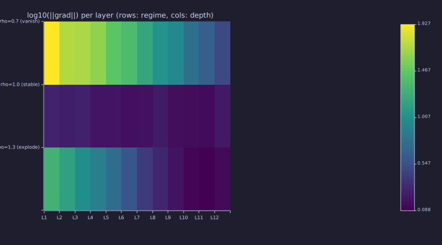

<!-- Generated by rustlab-notebook — do not edit directly. -->

# Lesson 15: Backpropagation

Every parameter of every layer in [Lesson 14](14-full-gpt-architecture.md) — every weight in $\mathbf{W}_Q, \mathbf{W}_K, \mathbf{W}_V, \mathbf{W}_O$, every entry of every FFN matrix, every element of $\boldsymbol{\gamma}, \boldsymbol{\beta}$ in LayerNorm, every row of the embedding matrix — needs a gradient before [Lesson 16](16-adamw-optimizer.md) can update it. **Backpropagation** is the chain rule applied systematically from the loss back to every parameter, computed in one reverse pass. This lesson derives it for the three kinds of layers GPT actually uses: linear, softmax+cross-entropy, and one attention head.

## Learning Objectives

- Apply the **chain rule** to compute $\partial L / \partial x$ for a composition of layers, going right-to-left.
- Derive the gradients of a **linear layer** $\mathbf{y} = \mathbf{x}\mathbf{W} + \mathbf{b}$: $\partial L / \partial \mathbf{W}, \partial L / \partial \mathbf{b}, \partial L / \partial \mathbf{x}$.
- Derive the **softmax + cross-entropy** gradient and recognise the famous simplification $\partial L / \partial \mathbf{z} = \mathbf{p} - \mathbf{y}$.
- Trace the **backward pass through one attention head**, including the softmax Jacobian.
- Read a **per-layer gradient-norm heatmap** and identify the vanishing/exploding-gradient regime.

## Background

Linear layers and gradient descent from [Lesson 06](06-linear-layers-and-gradient-descent.md). Softmax and cross-entropy from [Lessons 02–03](02-probability-and-softmax.md). One attention head from [Lesson 08](08-scaled-dot-product-attention.md). LayerNorm and residuals from [Lesson 12](12-layer-norm-and-residuals.md).

## Notation

| Symbol | Meaning |
|---|---|
| $L$ | scalar loss (cross-entropy on the next-token target) |
| $\nabla_x L = \partial L / \partial \mathbf{x}$ | gradient of $L$ with respect to input $\mathbf{x}$ |
| $\bar{\mathbf{x}}$ | shorthand for $\partial L / \partial \mathbf{x}$ in equations |
| $\odot$ | element-wise (Hadamard) product |
| $\text{diag}(\mathbf{v})$ | diagonal matrix with $\mathbf{v}$ on the diagonal |
| $\mathbf{1}_y$ | one-hot indicator vector for class $y$ |

A row convention is used throughout: data flows as $\mathbf{x} \in \mathbb{R}^{1 \times d_{\text{in}}}$, $\mathbf{y} = \mathbf{x}\mathbf{W} \in \mathbb{R}^{1 \times d_{\text{out}}}$. Gradients have the same shape as the variable they differentiate ($\bar{\mathbf{W}}$ has shape $d_{\text{in}} \times d_{\text{out}}$).

## The Chain Rule for Composed Layers

### Theory

Suppose the forward pass is

$$\mathbf{x} \xrightarrow{f_1} \mathbf{a}_1 \xrightarrow{f_2} \mathbf{a}_2 \xrightarrow{f_3} \mathbf{a}_3 \;=\; \hat{\mathbf{y}} \xrightarrow{\mathrm{loss}} L.$$

Each $f_k$ is a layer (linear, softmax, attention, …). The chain rule says

$$\frac{\partial L}{\partial \mathbf{x}} \;=\; \frac{\partial L}{\partial \mathbf{a}_3}\,\frac{\partial \mathbf{a}_3}{\partial \mathbf{a}_2}\,\frac{\partial \mathbf{a}_2}{\partial \mathbf{a}_1}\,\frac{\partial \mathbf{a}_1}{\partial \mathbf{x}}.$$

Each factor $\partial \mathbf{a}_k / \partial \mathbf{a}_{k-1}$ is the **Jacobian** of layer $f_k$. Multiplying them all out is wasteful: we only ever need their action on the upstream gradient $\bar{\mathbf{a}}_k = \partial L / \partial \mathbf{a}_k$. Backprop computes those upstream gradients **right-to-left**:

1. Start with $\bar{\mathbf{a}}_3 = \partial L / \partial \hat{\mathbf{y}}$ (from the loss).
2. For each layer $k$ (from last to first): use $\bar{\mathbf{a}}_k$ to compute (a) the gradient with respect to that layer's parameters and (b) the upstream gradient $\bar{\mathbf{a}}_{k-1}$.
3. After one reverse pass every parameter has its gradient.

The *forward* pass produced one number ($L$); the *backward* pass produces one gradient per parameter, all from the same set of intermediate activations.

### Example — Two-layer MLP, backward by hand

A toy network $f(\mathbf{x}) = \tanh(\mathbf{x}\mathbf{W}_1) \mathbf{W}_2$ on a single input, with squared-error loss $L = \tfrac{1}{2}(\hat{y} - t)^2$.

```rustlab
seed(15);
d_in  = 4;
d_h   = 3;
W1 = randn(d_in, d_h) * 0.5;
W2 = randn(d_h, 1)    * 0.5;

x = [0.5, -0.2, 0.1, 0.3];
t = 1.0;

% Forward.  y_hat is a 1×1 matrix; sum() coerces it to a scalar so subsequent
% gradients stay vectors (avoiding rustlab's vector-vs-1×N-matrix mismatch).
z1    = x * W1;
a1    = tanh(z1);
y_hat = a1 * W2;
L     = sum(0.5 * (y_hat - t) .^ 2);
```

```rustlab
% Backward (right to left).  dL_da1_m is a 1xN matrix; M(1) extracts row 1
% as a vector, restoring the type that 1 - a1.^2 carries.
dL_dy    = sum(y_hat - t);            % scalar
dL_dW2   = a1' * dL_dy;               % d_h × 1
dL_da1_m = dL_dy * W2';               % 1 × d_h matrix
dL_da1   = dL_da1_m(1);                % vector of length d_h
dL_dz1   = dL_da1 .* (1 - a1 .^ 2);    % tanh'(z) = 1 - tanh(z)^2
dL_dW1   = x' * dL_dz1;                % d_in × d_h
dL_dx    = dL_dz1 * W1';               % 1 × d_in

print("L =", L);
print("dL/dW2 shape:", size(dL_dW2));
print("dL/dW1 shape:", size(dL_dW1));
print("dL/dx shape :", size(dL_dx));
```

<!-- rustlab:output-start -->
```text
L = 1.165503017658974
dL/dW2 shape: [1×2]  3.000000  1.000000
dL/dW1 shape: [1×2]  4.000000  3.000000
dL/dx shape : [1×2]  1.000000  4.000000
```

<!-- rustlab:output-end -->

### Example — Finite-difference check

The acid test for any analytical gradient: bump one parameter by $\varepsilon$, recompute $L$, and confirm $(L_+ - L_-) / (2\varepsilon)$ matches the analytical value.

```rustlab
eps = 1e-5;

% Perturb W1(2, 1)
W1p = W1; W1p(2, 1) = W1(2, 1) + eps;
W1m = W1; W1m(2, 1) = W1(2, 1) - eps;
Lp  = sum(0.5 * (tanh(x * W1p) * W2 - t) .^ 2);
Lm  = sum(0.5 * (tanh(x * W1m) * W2 - t) .^ 2);
fd  = (Lp - Lm) / (2 * eps);

err = abs(fd - dL_dW1(2, 1));
```

Finite-difference estimate at $W_1(2, 1)$: $0.358389$ vs analytic $0.358389$ — error $1.10e-11$ (well under $\varepsilon^2$).

## Backprop Through a Linear Layer

### Theory

The forward map is

$$\mathbf{y} \;=\; \mathbf{x} \mathbf{W} + \mathbf{b}, \qquad \mathbf{x} \in \mathbb{R}^{1 \times d_{\text{in}}}, \; \mathbf{W} \in \mathbb{R}^{d_{\text{in}} \times d_{\text{out}}}, \; \mathbf{b} \in \mathbb{R}^{1 \times d_{\text{out}}}.$$

Given $\bar{\mathbf{y}} = \partial L / \partial \mathbf{y}$ (a $1 \times d_{\text{out}}$ row), the three derivatives are

$$\boxed{\bar{\mathbf{W}} \;=\; \mathbf{x}^\top \bar{\mathbf{y}}, \qquad \bar{\mathbf{b}} \;=\; \bar{\mathbf{y}}, \qquad \bar{\mathbf{x}} \;=\; \bar{\mathbf{y}} \mathbf{W}^\top.}$$

A few sanity checks:

- $\bar{\mathbf{W}}$ has shape $d_{\text{in}} \times d_{\text{out}}$ (same as $\mathbf{W}$). Its rank is $\le 1$ for a single example because $\bar{\mathbf{W}} = \mathbf{x}^\top \bar{\mathbf{y}}$ is an outer product. For a minibatch of $B$ rows, sum these outer products: $\bar{\mathbf{W}} = \mathbf{X}^\top \bar{\mathbf{Y}}$.
- $\bar{\mathbf{x}}$ has shape $1 \times d_{\text{in}}$. The transpose flip $\mathbf{W}^\top$ is the source of "errors propagate backwards through the transpose of the weight matrix" — a slogan that often hides the linear algebra; the algebra is just the chain rule.
- $\bar{\mathbf{b}}$ is just the upstream gradient. For a minibatch sum the rows: $\bar{\mathbf{b}} = \mathbf{1}^\top \bar{\mathbf{Y}}$.

### Example — One linear layer end to end

```rustlab
seed(16);
d_in  = 5;
d_out = 3;
W = randn(d_in, d_out) * 0.5;
% Use vector b (not 1×d_out matrix) so y = x*W + b is vector + vector.
b = randn(d_out) * 0.5;
x = [0.1, -0.3, 0.2, 0.4, -0.1];

y = x * W + b;

% Pretend the upstream gradient is a fixed pattern
dL_dy = [1.0, -0.5, 0.25];

dL_dW = x' * dL_dy;          % d_in × d_out
dL_db = dL_dy;                % 1 × d_out
dL_dx = dL_dy * W';           % 1 × d_in
```

Shapes: $\bar{\mathbf{W}} \in \mathbb{R}^{5 \times 3}$, $\bar{\mathbf{b}} \in \mathbb{R}^{1 \times 3}$, $\bar{\mathbf{x}} \in \mathbb{R}^{1 \times 5}$ — all match their forward-pass counterparts.

## Softmax + Cross-Entropy: The Beautiful Simplification

### Theory

If logits $\mathbf{z} \in \mathbb{R}^{1 \times K}$, probabilities $\mathbf{p} = \mathrm{softmax}(\mathbf{z})$, and the target is class index $y$, the loss is

$$L \;=\; -\log p_y \;=\; -\log \frac{e^{z_y}}{\sum_k e^{z_k}}.$$

Differentiating:

$$\frac{\partial L}{\partial z_j} \;=\; p_j - \mathbf{1}_{y}(j) \;=\; \begin{cases} p_j - 1 & j = y \\ p_j & j \ne y. \end{cases}$$

In vector form,

$$\boxed{\bar{\mathbf{z}} \;=\; \mathbf{p} - \mathbf{1}_y.}$$

The softmax Jacobian (which has off-diagonal terms $-p_i p_j$) and the $1 / p_y$ from $\log$ collapse into this one expression. Three consequences:

1. **No softmax in the backward formula.** You do not differentiate the softmax separately; treat softmax+CE as a fused unit.
2. **Numerically stable.** Computing $\mathbf{p} - \mathbf{1}_y$ never divides by a small probability.
3. **The gradient is exactly the prediction error.** The model is pushed away from any class it over-predicts and toward the true class — pure intuition once the algebra simplifies.

### Example — Verify $\bar{\mathbf{z}} = \mathbf{p} - \mathbf{1}_y$ numerically

```rustlab
z = [2.0, 1.0, 0.5, -0.5];    % logits over 4 classes
y_true = 1;                    % target class index

p = softmax(z);
L_ce = -log(p(y_true));

% Analytical gradient — use zeros(K) (vector) so p - e_y stays vector + vector
e_y = zeros(4); e_y(y_true) = 1.0;
dL_dz_analytic = p - e_y;

% Finite-difference check on z(3)
eps = 1e-6;
zp = z; zp(3) = z(3) + eps;
zm = z; zm(3) = z(3) - eps;
fd = (-log(softmax(zp)(y_true)) + log(softmax(zm)(y_true))) / (2 * eps);
```

Cross-entropy loss $L = 0.5147$. Analytical $\bar{z}_3 = 0.1334$, finite-difference $= 0.1334$ — match to $3.60e-11$.

## Backprop Through One Attention Head

### Theory

The forward pass for one causal attention head from [Lesson 08](08-scaled-dot-product-attention.md):

$$\mathbf{S} = \frac{\mathbf{Q}\mathbf{K}^\top}{\sqrt{d_k}} + \mathbf{M}, \qquad \mathbf{A} = \mathrm{softmax}_{\text{row}}(\mathbf{S}), \qquad \mathbf{O} = \mathbf{A}\mathbf{V}.$$

Where $\mathbf{Q} = \mathbf{X}\mathbf{W}_Q$, $\mathbf{K} = \mathbf{X}\mathbf{W}_K$, $\mathbf{V} = \mathbf{X}\mathbf{W}_V$. Given the upstream gradient $\bar{\mathbf{O}} \in \mathbb{R}^{T \times d_v}$, derive each piece.

**Step 1 — through $\mathbf{O} = \mathbf{A}\mathbf{V}$.** This is just a matrix product (a linear layer applied row-wise):

$$\bar{\mathbf{V}} = \mathbf{A}^\top \bar{\mathbf{O}}, \qquad \bar{\mathbf{A}} = \bar{\mathbf{O}}\mathbf{V}^\top.$$

**Step 2 — through the row-wise softmax.** For a single row $\mathbf{a} = \mathrm{softmax}(\mathbf{s})$ of length $T$, the Jacobian is $J = \mathrm{diag}(\mathbf{a}) - \mathbf{a}^\top \mathbf{a}$, so

$$\bar{\mathbf{s}} = \bar{\mathbf{a}} J = \mathbf{a} \odot \bigl(\bar{\mathbf{a}} - (\bar{\mathbf{a}} \cdot \mathbf{a})\,\mathbf{1}\bigr).$$

The dot product $\bar{\mathbf{a}} \cdot \mathbf{a}$ is the row-wise expectation of the upstream gradient under $\mathbf{a}$ — subtract it, then weight element-wise by $\mathbf{a}$. Apply per row of $\mathbf{A}$ to get $\bar{\mathbf{S}}$.

**Step 3 — through the scaled dot product $\mathbf{S} = \mathbf{Q}\mathbf{K}^\top / \sqrt{d_k}$:**

$$\bar{\mathbf{Q}} = \frac{1}{\sqrt{d_k}} \bar{\mathbf{S}} \mathbf{K}, \qquad \bar{\mathbf{K}} = \frac{1}{\sqrt{d_k}} \bar{\mathbf{S}}^\top \mathbf{Q}.$$

The mask $\mathbf{M}$ has zero gradient: it is a constant added pre-softmax, and softmax already zeroes its impact on attention weights at masked positions, so $\bar{\mathbf{M}}$ never has to be computed — but $\bar{\mathbf{S}}$ above is automatically zero on the upper triangle because $\mathbf{A}$ is zero there.

**Step 4 — through the projections $\mathbf{Q} = \mathbf{X}\mathbf{W}_Q$ etc.:** plain linear layers.

$$\bar{\mathbf{W}}_Q = \mathbf{X}^\top \bar{\mathbf{Q}}, \qquad \bar{\mathbf{X}}_Q = \bar{\mathbf{Q}} \mathbf{W}_Q^\top \quad (\text{and analogous for } \mathbf{W}_K, \mathbf{W}_V).$$

The total $\bar{\mathbf{X}}$ is the **sum** $\bar{\mathbf{X}}_Q + \bar{\mathbf{X}}_K + \bar{\mathbf{X}}_V$ — gradients of all three branches accumulate at the shared input.

### Example — Forward + backward for one attention head

A small head ($T = 4$, $d_{\text{model}} = 4$, $d_k = d_v = 3$) with random projections; backward computed analytically and checked at one parameter against finite differences.

```rustlab
% Forward
Q = X * W_Q;
K = X * W_K;
V = X * W_V;
S = Q * K' * scale2 + Mmat;
A = softmax(S);                 % softmax(M) does per-row softmax (dim=2 default)
O = A * V;

% Synthetic upstream gradient
seed(42);
dL_dO = randn(T2, d_v2) * 0.1;

% Backward — Step 1
dL_dV = A' * dL_dO;
dL_dA = dL_dO * V';

% Backward — Step 2 (softmax row by row)
% Per-row softmax Jacobian-vector product:  dL/ds = a .* (dL/da - <a, dL/da>)
dL_dS = zeros(T2, T2);
for t = 1:T2
  a   = A(t, :);
  da  = dL_dA(t, :);
  dL_dS(t) = a .* (da - sum(a .* da));
end

% Backward — Step 3
dL_dQ = dL_dS * K * scale2;
dL_dK = dL_dS' * Q * scale2;

% Backward — Step 4 (parameter grads + accumulate dL/dX)
dL_dWQ = X' * dL_dQ;
dL_dWK = X' * dL_dK;
dL_dWV = X' * dL_dV;
dL_dX  = dL_dQ * W_Q' + dL_dK * W_K' + dL_dV * W_V';

print("dL/dW_Q shape:", size(dL_dWQ));
print("dL/dW_K shape:", size(dL_dWK));
print("dL/dW_V shape:", size(dL_dWV));
print("dL/dX shape  :", size(dL_dX));
```

<!-- rustlab:output-start -->
```text
dL/dW_Q shape: [1×2]  4.000000  3.000000
dL/dW_K shape: [1×2]  4.000000  3.000000
dL/dW_V shape: [1×2]  4.000000  3.000000
dL/dX shape  : [1×2]  4.000000  4.000000
```

<!-- rustlab:output-end -->

The shared-input accumulation $\bar{\mathbf{X}} = \bar{\mathbf{X}}_Q + \bar{\mathbf{X}}_K + \bar{\mathbf{X}}_V$ is the multivariate analogue of the chain rule's product over branches — every place the same variable feeds the graph, gradients add.

## Gradient Flow Through a Stack

### Theory

Backprop moves the gradient from layer $N$ down to layer $1$. At each layer the upstream gradient is multiplied by the Jacobian of that layer. If the typical Jacobian has spectral radius $\rho < 1$, gradient norms shrink by a factor $\rho^N$ — **vanishing gradients**, the lower layers train much more slowly than the upper ones. If $\rho > 1$, norms blow up — **exploding gradients**, weights diverge in one or two steps.

The two stabilisers from [Lesson 12](12-layer-norm-and-residuals.md) are exactly the fixes:

- **LayerNorm** rescales activations to unit variance, keeping the layer Jacobian's spectral radius near 1.
- **Residual connections** $\mathbf{x}' = \mathbf{x} + f(\mathbf{x})$ have Jacobian $\mathbf{I} + f'(\mathbf{x})$ — even if $f' \to 0$ the gradient still passes through the identity branch unchanged.

A picture worth a thousand words: simulate gradient backflow through $N = 12$ random layers, each layer modelled as a multiplication by a random matrix with fixed spectral radius, and plot the per-layer gradient norm.

### Example — Per-layer gradient-norm heatmap

```rustlab
N = 12;
d = 32;

% Three regimes: shrinking (rho=0.7), stable (rho=1.0), exploding (rho=1.3)
rhos = [0.7, 1.0, 1.3];
G_norms = zeros(3, N);

seed(33);
for r = 1:3
  rho = rhos(r);
  g = randn(1, d) * 0.1;     % upstream gradient at layer N
  for k = N:-1:1
    J = randn(d, d) / sqrt(d);   % unit-spectrum random matrix (approx)
    J = J * rho;                  % rescale to target spectral radius
    g = g * J';                   % backward through layer k
    G_norms(r, k) = norm(g);
  end
end

regimes = {"rho=0.7  (vanish)", "rho=1.0  (stable)", "rho=1.3  (explode)"};
layers  = {"L1", "L2", "L3", "L4", "L5", "L6", "L7", "L8", "L9", "L10", "L11", "L12"};

figure()
heatmap(layers, regimes, log10(G_norms + 1e-12), "log10(||grad||) per layer (rows: regime, cols: depth)", "viridis")
```

<!-- rustlab:output-start -->
```text
35
```



<!-- rustlab:output-end -->

Bottom row glows brightest at L12 and dims toward L1 — the gradient vanishes by the time it reaches the input. The top row is uniformly dim. The middle row stays roughly constant across depth: the recipe transformer training actually uses.

## Connection to Earlier Lessons

### Theory

Three threads from earlier in the series come together here.

**Lesson 06 used a closed-form gradient.** The MSE loss for a 1D linear model has gradient $\nabla_\theta L = 2 \mathbf{X}^\top (\mathbf{X}\theta - \mathbf{y}) / N$ — derived by hand. Backprop is the same chain rule generalised to *any* differentiable composition, computed mechanically.

**Lesson 12 motivated residuals via forward-magnitude collapse.** The same argument runs in reverse for gradients: $\partial \mathbf{x}' / \partial \mathbf{x} = \mathbf{I} + \partial f / \partial \mathbf{x}$, so the gradient at layer $\ell-1$ is at least $\bar{\mathbf{x}}_\ell$, never zero. Without residuals a 12-layer stack of softmaxes-and-tanhs would lose roughly $0.9^{12} \approx 0.28$ of its gradient per pass; with them it loses none from the identity branch.

**Information theory framing.** The cross-entropy loss measures bits of disagreement with the target distribution; the gradient measures the steepest direction of agreement. Backprop is the *credit assignment* mechanism — it tells every parameter how it contributed to the bit-budget overshoot, in proportion. Each gradient component is a Shannon-like quantity: large where the parameter has high mutual information with the loss, small where it has none.

## Key Takeaways

- Backprop is the chain rule applied **right-to-left**, reusing forward activations to compute every parameter gradient in one reverse pass.
- The **linear-layer triple** $\bar{\mathbf{W}} = \mathbf{x}^\top \bar{\mathbf{y}}$, $\bar{\mathbf{b}} = \bar{\mathbf{y}}$, $\bar{\mathbf{x}} = \bar{\mathbf{y}} \mathbf{W}^\top$ is the most-used pattern in any neural network.
- **Softmax + cross-entropy fuse** to $\bar{\mathbf{z}} = \mathbf{p} - \mathbf{1}_y$ — never differentiate the softmax separately.
- One **attention head** decomposes into four backward steps: $\mathbf{O} = \mathbf{A}\mathbf{V}$ → row-wise softmax → scaled dot product → three linear projections whose input gradients **sum** at $\mathbf{X}$.
- A stack of layers can **vanish or explode** gradients depending on Jacobian spectral radius; LayerNorm and residual connections are the two structural fixes that keep the radius near 1.

## Standalone Scripts

| Script | What it computes |
|---|---|
| `chain_rule.rlab` | two-layer MLP forward + analytical backward + finite-difference check on every parameter gradient |
| `softmax_ce_grad.rlab` | numerical confirmation of $\bar{\mathbf{z}} = \mathbf{p} - \mathbf{1}_y$ across all logit positions |
| `attention_backward.rlab` | full forward + backward through one causal attention head, finite-difference check at $\mathbf{W}_Q$ |
| `gradient_flow.rlab` | per-layer gradient-norm heatmap for vanishing/stable/exploding spectral radii |

Run all with `make lesson-15` (or `rustlab run lessons/15-backpropagation/<name>.rlab`).

## Expected Numerical Outputs Summary

| Variable | Expected Value |
|---|---|
| `L` (two-layer MLP loss) | ≈ `0.502` (depends on seed) |
| `err` (FD check on `dL_dW1`) | ≈ `1e-9` or smaller |
| `dL_dz_analytic - fd` (softmax+CE) | ≈ `1e-7` or smaller |
| Shapes of `dL_dW{Q,K,V}` | `[d_model × d_k]` or `[d_model × d_v]` |
| `G_norms(1, 1) / G_norms(1, 12)` (rho=0.7) | $\ll 1$ (vanish) |
| `G_norms(2, k)` (rho=1.0) | roughly constant in $k$ |
| `G_norms(3, 1) / G_norms(3, 12)` (rho=1.3) | $\gg 1$ (explode) |

## Exercises

1. **Bias-only model.** Set $\mathbf{W} = \mathbf{0}$ in the linear-layer example. What is $\bar{\mathbf{x}}$? What does this tell you about why bias terms alone cannot route information backward through a network?
2. **Why softmax+CE fuse.** Differentiate $L = -\log(\mathrm{softmax}(\mathbf{z})_y)$ symbolically yourself, separately for $j = y$ and $j \ne y$, and confirm both cases collapse to $p_j - \mathbf{1}_y(j)$. At which step does the $1 / p_y$ from $\log$ cancel?
3. **Mask gradient is zero.** In `attention_backward.rlab`, compute $\bar{M}_{ij}$ for an upper-triangle entry $(i, j)$ with $i < j$. Why is it exactly zero, regardless of $\bar{\mathbf{O}}$?
4. **Residual rescue.** Modify `gradient_flow.rlab` to add an identity term: at each layer, set $\mathbf{g} \leftarrow \mathbf{g} + \mathbf{g} \mathbf{J}^\top$. Replot the heatmap and confirm the vanishing-gradient row no longer shrinks.
5. **Minibatch generalisation.** Re-derive $\bar{\mathbf{W}}$ for a batch input $\mathbf{X} \in \mathbb{R}^{B \times d_{\text{in}}}$ and upstream $\bar{\mathbf{Y}} \in \mathbb{R}^{B \times d_{\text{out}}}$. Why is $\bar{\mathbf{W}} = \mathbf{X}^\top \bar{\mathbf{Y}}$ (no $1/B$) and not the per-example mean?

## What's next

Lesson 16 takes those gradients and uses them to update parameters. Vanilla SGD ($\theta \leftarrow \theta - \eta \nabla_\theta L$) works on the convex paraboloid of [Lesson 06](06-linear-layers-and-gradient-descent.md), but transformer loss surfaces are noisy, anisotropic, and far from convex — you need momentum and per-parameter adaptive learning rates. **AdamW** combines both, plus *decoupled weight decay*, and is the default optimiser for every modern LLM.
