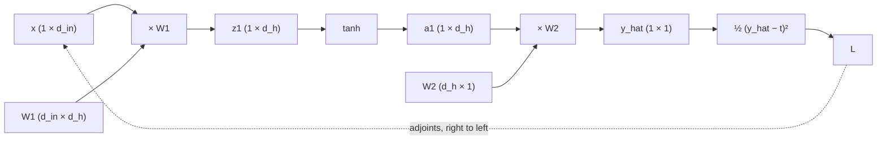
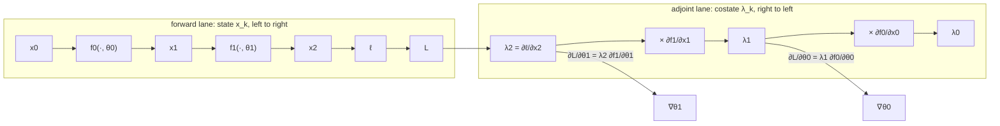
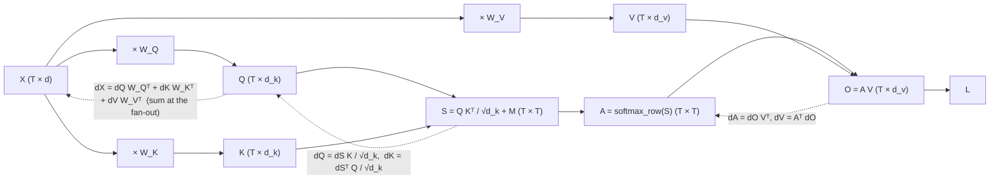
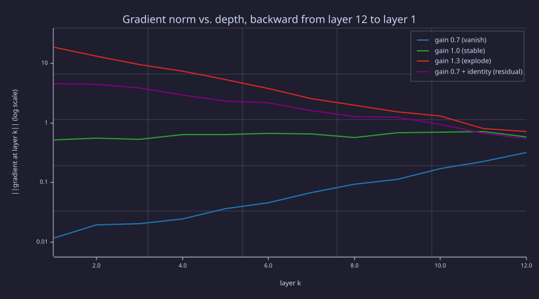
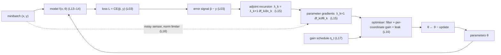

<!-- Generated by rustlab-notebook — do not edit directly. -->

# Lesson 15: Backpropagation

Every parameter of every layer in [14-full-gpt-architecture](14-full-gpt-architecture.md) — every weight in $\mathbf{W}_Q, \mathbf{W}_K, \mathbf{W}_V, \mathbf{W}_O$, every entry of every FFN matrix, every element of $\boldsymbol{\gamma}, \boldsymbol{\beta}$ in LayerNorm, every row of the embedding matrix — needs a gradient before [16-adamw-optimizer](16-adamw-optimizer.md) can update it. **Backpropagation** is the chain rule applied systematically from the loss back to every parameter, computed in one reverse pass. To a control engineer it is an old friend under a new name: the discrete-time **adjoint (costate) recursion** of optimal control. This lesson derives it for the three kinds of layers GPT actually uses — linear, softmax + cross-entropy, and one attention head — states the adjoint theorem it instantiates, and ends by drawing the closed loop that Lessons 16–18 fill in.

## Learning Objectives

- Apply the **chain rule** to compute $\partial L / \partial \mathbf{x}$ for a composition of layers, going right-to-left, and explain why **reverse mode** is the right choice for a scalar loss.
- State backprop as the **adjoint / costate recursion** $\boldsymbol{\lambda}_k = \boldsymbol{\lambda}_{k+1}\, \partial f_k / \partial \mathbf{x}_k$ and show that the MLP code is that recursion relabelled.
- Derive the gradients of a **linear layer** $\mathbf{y} = \mathbf{x}\mathbf{W} + \mathbf{b}$: $\partial L / \partial \mathbf{W}, \partial L / \partial \mathbf{b}, \partial L / \partial \mathbf{x}$ — and recognise $\bar{\mathbf{x}} = \bar{\mathbf{y}}\mathbf{W}^\top$ as the adjoint operator.
- Derive the **softmax + cross-entropy** gradient $\partial L / \partial \mathbf{z} = \mathbf{p} - \mathbf{y}$ and trace the **backward pass through one attention head**, including the softmax Jacobian and the fan-in at $\mathbf{X}$.
- Read per-layer **gradient-norm curves** as a cascade of per-stage RMS gains and identify the vanishing / stable / exploding regimes and the residual fix.

## Background

Linear layers and gradient descent — including the stability bound $\eta < 2/\lambda_{\max}$ — from [06-linear-layers-and-gradient-descent](06-linear-layers-and-gradient-descent.md). Softmax and cross-entropy, and the bounded error signal $\hat{\mathbf{p}} - \mathbf{y}$, from [02-probability-and-softmax](02-probability-and-softmax.md) and [03-cross-entropy-loss](03-cross-entropy-loss.md). One attention head from [08-scaled-dot-product-attention](08-scaled-dot-product-attention.md). LayerNorm and residuals from [12-layer-norm-and-residuals](12-layer-norm-and-residuals.md). The adjoint notation $\bar{\mathbf{x}}$ of [00-the-llm-as-a-system](00-the-llm-as-a-system.md).

## Notation

| Symbol | Meaning |
|---|---|
| $L$ | scalar loss (cross-entropy on the next-token target) |
| $\nabla_x L = \partial L / \partial \mathbf{x}$ | gradient of $L$ with respect to input $\mathbf{x}$ |
| $\bar{\mathbf{x}}$ | shorthand for $\partial L / \partial \mathbf{x}$ in equations — the **adjoint** of $\mathbf{x}$ |
| $\boldsymbol{\lambda}_k$ | the **costate** of optimal control: the adjoint of the state at stage $k$. In this lesson $\boldsymbol{\lambda}_k \equiv \bar{\mathbf{a}}_k$ — the same object under the name the controls literature gives it |
| $\odot$ | element-wise (Hadamard) product |
| $\text{diag}(\mathbf{v})$ | diagonal matrix with $\mathbf{v}$ on the diagonal |
| $\mathbf{1}_y$ | one-hot indicator vector for class $y$ |

A row convention is used throughout: data flows as $\mathbf{x} \in \mathbb{R}^{1 \times d_{\text{in}}}$, $\mathbf{y} = \mathbf{x}\mathbf{W} \in \mathbb{R}^{1 \times d_{\text{out}}}$. Gradients have the same shape as the variable they differentiate ($\bar{\mathbf{W}}$ has shape $d_{\text{in}} \times d_{\text{out}}$).

## The Chain Rule for Composed Layers

### Theory

Suppose the forward pass is

$$\mathbf{x} \xrightarrow{f_1} \mathbf{a}_1 \xrightarrow{f_2} \mathbf{a}_2 \xrightarrow{f_3} \mathbf{a}_3 \;=\; \hat{\mathbf{y}} \xrightarrow{\mathrm{loss}} L.$$

Each $f_k$ is a layer (linear, softmax, attention, …). The chain rule says

$$\frac{\partial L}{\partial \mathbf{x}} \;=\; \frac{\partial L}{\partial \mathbf{a}_3}\,\frac{\partial \mathbf{a}_3}{\partial \mathbf{a}_2}\,\frac{\partial \mathbf{a}_2}{\partial \mathbf{a}_1}\,\frac{\partial \mathbf{a}_1}{\partial \mathbf{x}}.$$

Each factor $\partial \mathbf{a}_k / \partial \mathbf{a}_{k-1}$ is the **Jacobian** of layer $f_k$. Multiplying them all out is wasteful: we only ever need their action on the upstream gradient $\bar{\mathbf{a}}_k = \partial L / \partial \mathbf{a}_k$. Backprop computes those upstream gradients **right-to-left**:

1. Start with $\bar{\mathbf{a}}_3 = \partial L / \partial \hat{\mathbf{y}}$ (from the loss).
2. For each layer $k$ (from last to first): use $\bar{\mathbf{a}}_k$ to compute (a) the gradient with respect to that layer's parameters and (b) the upstream gradient $\bar{\mathbf{a}}_{k-1}$.
3. After one reverse pass every parameter has its gradient.

The *forward* pass produced one number ($L$); the *backward* pass produces one gradient per parameter, all from the same set of intermediate activations. The composition is a **computational graph** — for the toy network of the next example:


```mermaid
flowchart LR
  x["x  (1 × d_in)"] --> m1["× W1"] --> z1["z1  (1 × d_h)"] --> th["tanh"] --> a1["a1  (1 × d_h)"] --> m2["× W2"] --> yh["y_hat  (1 × 1)"] --> ls["½ (y_hat − t)²"] --> L["L"]
  W1["W1  (d_in × d_h)"] --> m1
  W2["W2  (d_h × 1)"] --> m2
  L -. "adjoints, right to left" .-> x
```

**Why reverse mode.** The chain rule can be evaluated in either direction. *Forward mode* pushes a perturbation of one input through the graph and costs one pass per input — $n_{\text{params}}$ passes for a full gradient. *Reverse mode* pulls the sensitivity of one output back through the graph and costs one pass per output. A training loss is a single scalar with millions of inputs, so reverse mode wins by a factor of $n_{\text{params}}$: one forward pass plus one backward pass, at roughly twice the forward cost, yields every parameter gradient. That asymmetry is the entire reason backprop is *the* algorithm.

**The adjoint theorem.** Write the network as a discrete-time system with stage index $k$, state $\mathbf{x}_k$, and stage parameters $\boldsymbol{\theta}_k$:

$$\mathbf{x}_{k+1} = f_k(\mathbf{x}_k, \boldsymbol{\theta}_k), \quad k = 0, \dots, N-1, \qquad L = \ell(\mathbf{x}_N).$$

Define the **costate** $\boldsymbol{\lambda}_k = \partial L / \partial \mathbf{x}_k$ (a row, like every adjoint here). Then

$$\boxed{\;\boldsymbol{\lambda}_N = \frac{\partial \ell}{\partial \mathbf{x}_N}, \qquad \boldsymbol{\lambda}_k = \boldsymbol{\lambda}_{k+1}\, \frac{\partial f_k}{\partial \mathbf{x}_k}, \qquad \frac{\partial L}{\partial \boldsymbol{\theta}_k} = \boldsymbol{\lambda}_{k+1}\, \frac{\partial f_k}{\partial \boldsymbol{\theta}_k}.\;}$$

This is the discrete-time adjoint method of optimal control — Bryson and Ho, *Applied Optimal Control* (1969), derive it for trajectory optimisation, and LeCun (1988) pointed out that backpropagation is the same recursion with layers as stages. It is the three-step list above with $\bar{\mathbf{a}}_k$ renamed $\boldsymbol{\lambda}_k$: the state runs *forward* in stage index while the costate runs *backward*, and each parameter gradient is a rung joining the two lanes at its stage.


```mermaid
flowchart LR
  subgraph fwd["forward lane: state x_k, left to right"]
    direction LR
    x0["x0"] --> f0["f0(·, θ0)"] --> x1["x1"] --> f1["f1(·, θ1)"] --> x2["x2"] --> ell["ℓ"] --> L["L"]
  end
  subgraph bwd["adjoint lane: costate λ_k, right to left"]
    direction RL
    l2["λ2 = ∂ℓ/∂x2"] --> J1["× ∂f1/∂x1"] --> l1["λ1"] --> J0["× ∂f0/∂x0"] --> l0["λ0"]
  end
  L --> l2
  l2 -- "∂L/∂θ1 = λ2 ∂f1/∂θ1" --> g1["∇θ1"]
  l1 -- "∂L/∂θ0 = λ1 ∂f0/∂θ0" --> g0["∇θ0"]
```

### Example — Two-layer MLP, backward by hand

A toy network $f(\mathbf{x}) = \tanh(\mathbf{x}\mathbf{W}_1) \mathbf{W}_2$ on a single input, with squared-error loss $L = \tfrac{1}{2}(\hat{y} - t)^2$.

```rustlab
seed(15);
d_in  = 4;
d_h   = 3;
W1 = randn(d_in, d_h) * 0.5;
W2 = randn(d_h, 1)    * 0.5;

x = [0.5, -0.2, 0.1, 0.3];
t = 1.0;

% Forward
z1    = x * W1;
a1    = tanh(z1);
y_hat = a1 * W2;
L     = sum(0.5 * (y_hat - t) .^ 2);
```

> [!NOTE]
> `y_hat` is a $1 \times 1$ matrix and `dL_da1_m` below a $1 \times d_h$ matrix; `sum()` and `M(1, :)` coerce them to scalars and vectors so the element-wise steps stay vector-with-vector. This is the one place rustlab's value types need a nudge in this lesson.

```rustlab
% Backward (right to left)
dL_dy    = sum(y_hat - t);            % scalar: dL/dy_hat
dL_dW2   = a1' * dL_dy;               % d_h × 1
dL_da1_m = dL_dy * W2';               % 1 × d_h matrix
dL_da1   = dL_da1_m(1, :);            % as a vector of length d_h
dL_dz1   = dL_da1 .* (1 - a1 .^ 2);   % tanh'(z) = 1 - tanh(z)^2
dL_dW1   = x' * dL_dz1;               % d_in × d_h
dL_dx    = dL_dz1 * W1';              % 1 × d_in

print("L =", L);
print("dL/dW2 shape:", size(dL_dW2));
print("dL/dW1 shape:", size(dL_dW1));
print("dL/dx shape :", size(dL_dx));
```

<!-- rustlab:output-start -->
```text
L = 1.165503017658974
dL/dW2 shape: [1×2]  3.000000  1.000000
dL/dW1 shape: [1×2]  4.000000  3.000000
dL/dx shape : [1×2]  1.000000  4.000000
```

<!-- rustlab:output-end -->

### Example — Finite-difference check

The acid test for any analytical gradient: bump one parameter by $\varepsilon$, recompute $L$, and confirm $(L_+ - L_-) / (2\varepsilon)$ matches the analytical value.

```rustlab
eps = 1e-5;

% Perturb W1(2, 1)
W1p = W1; W1p(2, 1) = W1(2, 1) + eps;
W1m = W1; W1m(2, 1) = W1(2, 1) - eps;
Lp  = sum(0.5 * (tanh(x * W1p) * W2 - t) .^ 2);
Lm  = sum(0.5 * (tanh(x * W1m) * W2 - t) .^ 2);
fd  = (Lp - Lm) / (2 * eps);

err = abs(fd - dL_dW1(2, 1));
```

Finite-difference estimate at $W_1(2, 1)$: $0.358389$ vs analytic $0.358389$ — error $1.10e-11$ (well under $\varepsilon^2$).

Two refinements make this check robust at scale. First, compare **relative** error, $|f - a| / \max(|f|, |a|)$, so that a gradient of size $10^3$ and one of size $10^{-3}$ are judged by the same yardstick. Second, the choice $\varepsilon \approx 10^{-5}$ is not arbitrary: the centred difference has truncation error $O(\varepsilon^2)$ and rounding error $O(\varepsilon_{\text{mach}} / \varepsilon)$ with $\varepsilon_{\text{mach}} \approx 2 \times 10^{-16}$ in double precision, and the sum is smallest near $\varepsilon_{\text{mach}}^{1/3} \approx 6 \times 10^{-6}$. (The one-sided rule of thumb $\sqrt{\varepsilon_{\text{mach}}} \approx 10^{-8}$ is for *forward* differences.) A sweep shows the U shape:

```rustlab
function r = rel_err(a, b)
  r = abs(a - b) / max([abs(a), abs(b), 1e-300]);
end

eps_list = [1e-2, 1e-4, 1e-5, 1e-7, 1e-9];
rel_list = zeros(length(eps_list));
for i = 1:length(eps_list)
  e = eps_list(i);
  W1p = W1; W1p(2, 1) = W1(2, 1) + e;
  W1m = W1; W1m(2, 1) = W1(2, 1) - e;
  fd_e = (sum(0.5 * (tanh(x * W1p) * W2 - t) .^ 2) - sum(0.5 * (tanh(x * W1m) * W2 - t) .^ 2)) / (2 * e);
  rel_list(i) = rel_err(fd_e, dL_dW1(2, 1));
  print("eps =", e, "   relative error =", rel_list(i));
end
```

<!-- rustlab:output-start -->
```text
eps = 0.01    relative error = 0.000001910093267350235
eps = 0.0001    relative error = 0.00000000019542205403617214
eps = 0.00001    relative error = 0.00000000003071841583847614
eps = 0.0000001    relative error = 0.0000000019209059991718153
eps = 0.000000001    relative error = 0.0000002714309656523153
```

<!-- rustlab:output-end -->

Too large an $\varepsilon$ ($10^{-2}$) is limited by curvature; too small ($10^{-9}$) by cancellation in $L_+ - L_-$; $10^{-5}$ sits at the bottom of the valley with a relative error of $3.1e-11$.

## Backprop Through a Linear Layer

### Theory

The forward map is

$$\mathbf{y} \;=\; \mathbf{x} \mathbf{W} + \mathbf{b}, \qquad \mathbf{x} \in \mathbb{R}^{1 \times d_{\text{in}}}, \; \mathbf{W} \in \mathbb{R}^{d_{\text{in}} \times d_{\text{out}}}, \; \mathbf{b} \in \mathbb{R}^{1 \times d_{\text{out}}}.$$

Given $\bar{\mathbf{y}} = \partial L / \partial \mathbf{y}$ (a $1 \times d_{\text{out}}$ row), the three derivatives are

$$\boxed{\bar{\mathbf{W}} \;=\; \mathbf{x}^\top \bar{\mathbf{y}}, \qquad \bar{\mathbf{b}} \;=\; \bar{\mathbf{y}}, \qquad \bar{\mathbf{x}} \;=\; \bar{\mathbf{y}} \mathbf{W}^\top.}$$

A few sanity checks:

- $\bar{\mathbf{W}}$ has shape $d_{\text{in}} \times d_{\text{out}}$ (same as $\mathbf{W}$). Its rank is $\le 1$ for a single example because $\bar{\mathbf{W}} = \mathbf{x}^\top \bar{\mathbf{y}}$ is an outer product. For a minibatch of $B$ rows, sum these outer products: $\bar{\mathbf{W}} = \mathbf{X}^\top \bar{\mathbf{Y}}$.
- $\bar{\mathbf{x}}$ has shape $1 \times d_{\text{in}}$. The transpose flip $\mathbf{W}^\top$ is the source of "errors propagate backwards through the transpose of the weight matrix" — a slogan with a precise name: the map $\bar{\mathbf{y}} \mapsto \bar{\mathbf{y}}\mathbf{W}^\top$ is the **adjoint operator** of $\mathbf{x} \mapsto \mathbf{x}\mathbf{W}$, the unique linear map with $\langle \mathbf{x}\mathbf{W}, \bar{\mathbf{y}} \rangle = \langle \mathbf{x}, \bar{\mathbf{y}}\mathbf{W}^\top \rangle$ for all $\mathbf{x}, \bar{\mathbf{y}}$. The Signals lens shows what that means when $\mathbf{W}$ is a filter.
- $\bar{\mathbf{b}}$ is just the upstream gradient. For a minibatch sum the rows: $\bar{\mathbf{b}} = \mathbf{1}^\top \bar{\mathbf{Y}}$.

### Example — One linear layer end to end

```rustlab
seed(16);
d_in  = 5;
d_out = 3;
W = randn(d_in, d_out) * 0.5;
b = randn(d_out) * 0.5;
x = [0.1, -0.3, 0.2, 0.4, -0.1];

y = x * W + b;

% Pretend the upstream gradient is a fixed pattern
dL_dy = [1.0, -0.5, 0.25];

dL_dW = x' * dL_dy;          % d_in × d_out
dL_db = dL_dy;                % 1 × d_out
dL_dx = dL_dy * W';           % 1 × d_in
```

Shapes: $\bar{\mathbf{W}} \in \mathbb{R}^{5 \times 3}$, $\bar{\mathbf{b}} \in \mathbb{R}^{1 \times 3}$, $\bar{\mathbf{x}} \in \mathbb{R}^{1 \times 5}$ — all match their forward-pass counterparts.

## Softmax + Cross-Entropy: The Beautiful Simplification

### Theory

If logits $\mathbf{z} \in \mathbb{R}^{1 \times K}$, probabilities $\mathbf{p} = \mathrm{softmax}(\mathbf{z})$, and the target is class index $y$, the loss is

$$L \;=\; -\log p_y \;=\; -\log \frac{e^{z_y}}{\sum_k e^{z_k}}.$$

Differentiating (the derivation via $L = -z_y + \mathrm{LSE}(\mathbf{z})$ is in [03-cross-entropy-loss](03-cross-entropy-loss.md)):

$$\frac{\partial L}{\partial z_j} \;=\; p_j - \mathbf{1}_{y}(j) \;=\; \begin{cases} p_j - 1 & j = y \\ p_j & j \ne y. \end{cases}$$

In vector form,

$$\boxed{\bar{\mathbf{z}} \;=\; \mathbf{p} - \mathbf{1}_y.}$$

The softmax Jacobian (which has off-diagonal terms $-p_i p_j$) and the $1 / p_y$ from $\log$ collapse into this one expression. Three consequences:

1. **No softmax in the backward formula.** You do not differentiate the softmax separately; treat softmax+CE as a fused unit.
2. **Numerically stable.** Computing $\mathbf{p} - \mathbf{1}_y$ never divides by a small probability.
3. **The gradient is exactly the prediction error**, bounded in $[-1, 1]$ per component. The model is pushed away from any class it over-predicts and toward the true class — this is the error signal of Lesson 03, and the start of every backward pass in a language model.

### Example — Verify $\bar{\mathbf{z}} = \mathbf{p} - \mathbf{1}_y$ numerically

```rustlab
z = [2.0, 1.0, 0.5, -0.5];    % logits over 4 classes
y_true = 1;                    % target class index

p = softmax(z);
L_ce = -log(p(y_true));

% Analytical gradient
e_y = zeros(4); e_y(y_true) = 1.0;
dL_dz_analytic = p - e_y;

% Finite-difference check on z(3)
eps = 1e-6;
zp = z; zp(3) = z(3) + eps;
zm = z; zm(3) = z(3) - eps;
fd = (-log(softmax(zp)(y_true)) + log(softmax(zm)(y_true))) / (2 * eps);
```

Cross-entropy loss $L = 0.5147$. Analytical $\bar{z}_3 = 0.1334$, finite-difference $= 0.1334$ — match to $3.60e-11$.

## Backprop Through One Attention Head

### Theory

The forward pass for one causal attention head from [08-scaled-dot-product-attention](08-scaled-dot-product-attention.md):

$$\mathbf{S} = \frac{\mathbf{Q}\mathbf{K}^\top}{\sqrt{d_k}} + \mathbf{M}, \qquad \mathbf{A} = \mathrm{softmax}_{\text{row}}(\mathbf{S}), \qquad \mathbf{O} = \mathbf{A}\mathbf{V}.$$

Where $\mathbf{Q} = \mathbf{X}\mathbf{W}_Q$, $\mathbf{K} = \mathbf{X}\mathbf{W}_K$, $\mathbf{V} = \mathbf{X}\mathbf{W}_V$. The graph is no longer a chain: $\mathbf{X}$ **fans out** into three branches that **fan back in** at $\mathbf{S}$ and $\mathbf{O}$, so the adjoint must be *summed* wherever the forward value was *copied*.


```mermaid
flowchart LR
  X["X  (T × d)"] --> WQ["× W_Q"] --> Q["Q  (T × d_k)"]
  X --> WK["× W_K"] --> K["K  (T × d_k)"]
  X --> WV["× W_V"] --> Vv["V  (T × d_v)"]
  Q --> S["S = Q Kᵀ / √d_k + M  (T × T)"]
  K --> S
  S --> A["A = softmax_row(S)  (T × T)"] --> O["O = A V  (T × d_v)"]
  Vv --> O
  O --> L["L"]
  O -. "dA = dO Vᵀ,  dV = Aᵀ dO" .-> A
  S -. "dQ = dS K / √d_k,  dK = dSᵀ Q / √d_k" .-> Q
  Q -. "dX = dQ W_Qᵀ + dK W_Kᵀ + dV W_Vᵀ  (sum at the fan-out)" .-> X
```

Given the upstream gradient $\bar{\mathbf{O}} \in \mathbb{R}^{T \times d_v}$, derive each piece.

**Step 1 — through $\mathbf{O} = \mathbf{A}\mathbf{V}$.** This is just a matrix product (a linear layer applied row-wise):

$$\bar{\mathbf{V}} = \mathbf{A}^\top \bar{\mathbf{O}}, \qquad \bar{\mathbf{A}} = \bar{\mathbf{O}}\mathbf{V}^\top.$$

**Step 2 — through the row-wise softmax.** For a single row $\mathbf{a} = \mathrm{softmax}(\mathbf{s})$ of length $T$, the Jacobian is $J = \mathrm{diag}(\mathbf{a}) - \mathbf{a}^\top \mathbf{a}$, so

$$\bar{\mathbf{s}} = \bar{\mathbf{a}} J = \mathbf{a} \odot \bigl(\bar{\mathbf{a}} - (\bar{\mathbf{a}} \cdot \mathbf{a})\,\mathbf{1}\bigr).$$

The dot product $\bar{\mathbf{a}} \cdot \mathbf{a}$ is the row-wise expectation of the upstream gradient under $\mathbf{a}$ — subtract it, then weight element-wise by $\mathbf{a}$. Apply per row of $\mathbf{A}$ to get $\bar{\mathbf{S}}$.

**Step 3 — through the scaled dot product $\mathbf{S} = \mathbf{Q}\mathbf{K}^\top / \sqrt{d_k}$:**

$$\bar{\mathbf{Q}} = \frac{1}{\sqrt{d_k}} \bar{\mathbf{S}} \mathbf{K}, \qquad \bar{\mathbf{K}} = \frac{1}{\sqrt{d_k}} \bar{\mathbf{S}}^\top \mathbf{Q}.$$

Two facts about the mask, kept distinct. First, $\bar{\mathbf{S}}$ is exactly zero on the **upper triangle** — the masked $i < j$ entries — because $\mathbf{A}$ is zero there and the softmax Jacobian kills those components; on the *unmasked* lower triangle $\bar{\mathbf{S}}$ is generally nonzero, and that is where the real gradient signal lives. Second, $\mathbf{M}$ itself carries **no** gradient — not because $\bar{\mathbf{S}}$ vanishes but because $\mathbf{M}$ is a fixed constant, never a learnable parameter, so there is nothing to update and $\bar{\mathbf{M}}$ is simply never formed.

**Step 4 — through the projections $\mathbf{Q} = \mathbf{X}\mathbf{W}_Q$ etc.:** plain linear layers.

$$\bar{\mathbf{W}}_Q = \mathbf{X}^\top \bar{\mathbf{Q}}, \qquad \bar{\mathbf{X}}_Q = \bar{\mathbf{Q}} \mathbf{W}_Q^\top \quad (\text{and analogous for } \mathbf{W}_K, \mathbf{W}_V).$$

The total $\bar{\mathbf{X}}$ is the **sum** $\bar{\mathbf{X}}_Q + \bar{\mathbf{X}}_K + \bar{\mathbf{X}}_V$ — gradients of all three branches accumulate at the shared input.

### Example — Forward + backward for one attention head

A small head ($T = 4$, $d_{\text{model}} = 4$, $d_k = d_v = 3$) with random projections; backward computed analytically and checked at one parameter against finite differences.

```rustlab
% Forward
Q = X * W_Q;
K = X * W_K;
V = X * W_V;
S = Q * K' * scale2 + Mmat;
A = softmax(S);                 % row-wise softmax
O = A * V;

% Synthetic upstream gradient
seed(42);
dL_dO = randn(T2, d_v2) * 0.1;

% Backward — Step 1
dL_dV = A' * dL_dO;
dL_dA = dL_dO * V';

% Backward — Step 2 (softmax row by row):  dL/ds = a .* (dL/da - <a, dL/da>)
dL_dS = zeros(T2, T2);
for t = 1:T2
  a   = A(t, :);
  da  = dL_dA(t, :);
  dL_dS(t) = a .* (da - sum(a .* da));
end

% Backward — Step 3
dL_dQ = dL_dS * K * scale2;
dL_dK = dL_dS' * Q * scale2;

% Backward — Step 4 (parameter grads + accumulate dL/dX at the fan-out)
dL_dWQ = X' * dL_dQ;
dL_dWK = X' * dL_dK;
dL_dWV = X' * dL_dV;
dL_dX  = dL_dQ * W_Q' + dL_dK * W_K' + dL_dV * W_V';

print("dL/dW_Q shape:", size(dL_dWQ));
print("dL/dW_K shape:", size(dL_dWK));
print("dL/dW_V shape:", size(dL_dWV));
print("dL/dX shape  :", size(dL_dX));
```

<!-- rustlab:output-start -->
```text
dL/dW_Q shape: [1×2]  4.000000  3.000000
dL/dW_K shape: [1×2]  4.000000  3.000000
dL/dW_V shape: [1×2]  4.000000  3.000000
dL/dX shape  : [1×2]  4.000000  4.000000
```

<!-- rustlab:output-end -->

Analytical gradients are only trustworthy once a finite-difference check confirms them. Perturb a single weight, $\mathbf{W}_Q(2, 1)$, by $\pm\varepsilon$, recompute the scalar loss $L = \sum \bar{\mathbf{O}} \odot \mathbf{O}$ (whose gradient w.r.t. $\mathbf{O}$ is exactly $\bar{\mathbf{O}}$ by construction), and compare the centred difference to the analytic entry:

```rustlab
% Recompute the head's scalar loss as a function of W_Q for the FD check.
function Lval = head_loss(X, W_Q, W_K, W_V, Mmat, scale2, dL_dO)
  Q = X * W_Q;
  K = X * W_K;
  V = X * W_V;
  S = Q * K' * scale2 + Mmat;
  O = softmax(S) * V;
  Lval = sum(reshape(dL_dO .* O, 1, size(O, 1) * size(O, 2)));
end

eps = 1e-5;
WQp = W_Q; WQp(2, 1) = W_Q(2, 1) + eps;
WQm = W_Q; WQm(2, 1) = W_Q(2, 1) - eps;
fd_wq  = (head_loss(X, WQp, W_K, W_V, Mmat, scale2, dL_dO) - head_loss(X, WQm, W_K, W_V, Mmat, scale2, dL_dO)) / (2 * eps);
err_wq = abs(fd_wq - dL_dWQ(2, 1));
print("analytic  dL/dW_Q(2,1):", dL_dWQ(2, 1));
print("finite-diff          :", fd_wq);
print("relative error       :", rel_err(fd_wq, dL_dWQ(2, 1)));
```

<!-- rustlab:output-start -->
```text
analytic  dL/dW_Q(2,1): -0.013339717537696234
finite-diff          : -0.013339717536142713
relative error       : 0.00000000011645832801032957
```

<!-- rustlab:output-end -->

Finite-difference check at $\mathbf{W}_Q(2, 1)$: analytic $-0.013340$ vs finite-difference $-0.013340$ — absolute error $1.55e-12$, far below $\varepsilon$ and exactly what a correct backward pass through the softmax Jacobian, the scaled dot product, and the three projections should produce.

The shared-input accumulation $\bar{\mathbf{X}} = \bar{\mathbf{X}}_Q + \bar{\mathbf{X}}_K + \bar{\mathbf{X}}_V$ is the multivariate analogue of the chain rule's product over branches — every place the same variable feeds the graph, gradients add.

> [!NOTE]
> [14-full-gpt-architecture](14-full-gpt-architecture.md) promised backprop through "softmax, attention, FFN, and LN". Softmax and attention are above; the FFN is two linear layers around an element-wise nonlinearity, so it is the MLP example with GELU in place of $\tanh$. The one genuinely non-obvious case, **LayerNorm backward** (its mean and variance couple every element of a row), is derived in [22-full-backprop-through-the-block](22-full-backprop-through-the-block.md) where the whole block's backward pass is assembled and finite-difference checked; it is deliberately deferred there rather than duplicated here.

## Gradient Flow Through a Stack

### Theory

Backprop moves the gradient from layer $N$ down to layer $1$. At each layer the upstream gradient is multiplied by that layer's Jacobian, so the norm at layer $k$ is the norm at layer $N$ times a **product of per-stage gains**. For a layer whose Jacobian entries are independent with variance $\rho^2 / d$ — the demonstration below — the expected squared gain is exactly $\rho^2$: $\mathbb{E}\lVert \mathbf{g}\mathbf{J}^\top \rVert^2 = \rho^2 \lVert \mathbf{g} \rVert^2$, and the RMS singular value of $\mathbf{J}$ is $\rho$. If $\rho < 1$ the norm shrinks like $\rho^{N}$ — **vanishing gradients**, the lower layers train far more slowly than the upper ones. If $\rho > 1$ the norm blows up — **exploding gradients**, weights diverge in a step or two.

The quantity that governs this is the **gain** (RMS singular value; in the worst case the largest singular value), *not* the spectral radius. The spectral radius controls $\mathbf{J}^N$ when the *same* matrix is applied repeatedly (tied weights, or a recurrent net); with a fresh $\mathbf{J}$ at every layer it can be well below the gain, and a non-normal $\mathbf{J}$ with spectral radius $< 1$ can still amplify a vector transiently. One random draw shows how far apart the three numbers sit:

```rustlab
d = 32;
seed(5);
J1 = randn(d, d) / sqrt(d);
sv = svd(J1);
ev = eig(J1);
print("one random J (d = 32):  RMS singular value =", sqrt(mean(sv .^ 2)), "  sigma_max =", max(sv), "  spectral radius =", max(abs(ev)));
```

<!-- rustlab:output-start -->
```text
one random J (d = 32):  RMS singular value = 1.0005113956081162   sigma_max = 1.9112734968558773   spectral radius = 1.0547404373380362
```

<!-- rustlab:output-end -->

The RMS gain is $1.001$ — the design value — while $\sigma_{\max} = 1.91$ and the spectral radius is $1.05$: a gradient aligned with the top singular direction is amplified almost $2\times$ by a layer whose "average" gain is one.

The two stabilisers from [12-layer-norm-and-residuals](12-layer-norm-and-residuals.md) act on exactly this gain:

- **LayerNorm** rescales activations to unit variance, keeping the layer Jacobian's gain near 1.
- **Residual connections** $\mathbf{x}' = \mathbf{x} + f(\mathbf{x})$ have Jacobian $\mathbf{I} + f'(\mathbf{x})$: the identity is a **unity feed-forward path** in parallel with the branch, so the gradient reaching layer $\ell - 1$ is $\bar{\mathbf{x}}_\ell + \bar{\mathbf{x}}_\ell f'$ — never less than $(1 - \sigma_{\max}(f'))\lVert \bar{\mathbf{x}}_\ell \rVert$, and unattenuated even if $f' \to 0$.

### Example — Per-layer gradient norm, four regimes

Simulate gradient backflow through $N = 12$ random layers at gains $0.7$, $1.0$, $1.3$, and a fourth stack of *residual* layers whose branch has gain $0.7$.

```rustlab
N = 12;
gains = [0.7, 1.0, 1.3];
G_norms = zeros(4, N);

seed(33);
for r = 1:3
  g = randn(1, d) * 0.1;                     % upstream gradient at layer N
  for k = N:-1:1
    J = randn(d, d) / sqrt(d) * gains(r);    % entries ~ N(0, gain^2 / d): RMS gain = gain
    g = g * J';                              % backward through layer k
    G_norms(r, k) = norm(g);
  end
end

seed(34);
g = randn(1, d) * 0.1;                       % residual stack: Jacobian I + J_f, branch gain 0.7
for k = N:-1:1
  J = randn(d, d) / sqrt(d) * 0.7;
  g = g + g * J';                            % identity path + branch path
  G_norms(4, k) = norm(g);
end
print("L1 / L12 ratios:  gain 0.7:", G_norms(1, 1) / G_norms(1, N), "  gain 1.0:", G_norms(2, 1) / G_norms(2, N), "  gain 1.3:", G_norms(3, 1) / G_norms(3, N), "  0.7 + I:", G_norms(4, 1) / G_norms(4, N));

layers = 1:N;
figure();
hold("on")
semilogy(layers, G_norms(1, :), "color", "blue", "label", "gain 0.7 (vanish)")
semilogy(layers, G_norms(2, :), "color", "green", "label", "gain 1.0 (stable)")
semilogy(layers, G_norms(3, :), "color", "red", "label", "gain 1.3 (explode)")
semilogy(layers, G_norms(4, :), "color", "purple", "label", "gain 0.7 + identity (residual)")
title("Gradient norm vs. depth, backward from layer 12 to layer 1")
xlabel("layer k")
ylabel("||gradient at layer k||  (log scale)")
legend()
hold("off")
```

<!-- rustlab:output-start -->
```text
L1 / L12 ratios:  gain 0.7: 0.03693700091743238   gain 1.0: 0.88857285134342   gain 1.3: 25.819017934732837   0.7 + I: 8.390376349540086
```



<!-- rustlab:output-end -->

> [!TIP]
> On a log axis each stack is roughly a straight line whose slope is $\log$ of the per-layer gain: down for $0.7$, flat for $1.0$, up for $1.3$. The purple residual stack has the *same* branch as the blue one but climbs — the identity path adds a gain-1 term to every stage.

Read with the numbers the loop recorded. The **vanishing** stack collapses from $0.320$ at L12 to $0.0118$ at L1 — a $27$× attenuation over twelve layers, so the first layer sees a far weaker signal than the last and trains much more slowly. The **exploding** stack grows from $0.723$ to $18.7$ — the recipe for divergence. The **stable** stack barely moves ($0.59$ at L12, $0.53$ at L1), which is what LayerNorm buys. The **residual** stack with the vanishing branch ends at $4.58$ — larger than it started — because each stage's gain is that of $\mathbf{I} + \mathbf{J}_f$, roughly $\sqrt{1 + 0.7^2} \approx 1.22$, never less than the identity's 1.

## Connection to Earlier Lessons

### Theory

Three threads from earlier in the series come together here.

**Lesson 06 used a closed-form gradient.** The MSE loss for a 1D linear model has gradient $\nabla_\theta L = 2 \mathbf{X}^\top (\mathbf{X}\theta - \mathbf{y}) / N$ — derived by hand. Backprop is the same chain rule generalised to *any* differentiable composition, computed mechanically; Lesson 06's stability bound $\eta < 2/\lambda_{\max}$ then applies to whatever Hessian the composition has.

**Lesson 12 motivated residuals via forward-magnitude collapse.** The same argument runs in reverse for gradients: $\partial \mathbf{x}' / \partial \mathbf{x} = \mathbf{I} + \partial f / \partial \mathbf{x}$, so the gradient at layer $\ell-1$ is at least $\bar{\mathbf{x}}_\ell$, never zero. Without residuals a 12-layer stack whose layers each retain a fraction $0.9$ of the gradient keeps only $0.9^{12} \approx 0.28$ of it per pass — i.e. it *loses* about 72% by the time it reaches the input; with residuals the identity branch loses none.

**Lesson 03's error signal is where every backward pass starts.** $\bar{\mathbf{z}} = \mathbf{p} - \mathbf{y}$ is bounded and zero-sum; everything downstream of it in this lesson is that vector multiplied by Jacobians. The Information lens below says what kind of quantity it is.

## Engineering Lenses

Backpropagation is where the systems view of training becomes literal: the algorithm *is* the adjoint recursion, and the training loop it feeds is a closed loop. The signals and information views each contribute one exact fact.

### Signals

**Exact.** The backward pass through $\mathbf{y} = \mathbf{x}\mathbf{W}$ is the adjoint operator $\bar{\mathbf{x}} = \bar{\mathbf{y}}\mathbf{W}^\top$. When $\mathbf{W}$ is the matrix of a causal LTI filter along the token axis — a lower-triangular Toeplitz matrix whose columns hold the impulse response $h$ — its transpose is the *anti-causal, time-reversed* filter: the forward pass convolves, the backward pass correlates. This is the same structure as a matched filter (correlate with the time-reversed template), which is why "run the filter backwards in time" is the right mental model for backprop through any convolution or recurrence.

```rustlab
h = [1.0, 0.5, 0.25];                       % impulse response of a causal FIR filter
T_len = 6;
W_conv = zeros(T_len, T_len);              % y = x W_conv:  y_s = sum_k h_k x_{s-k+1}
for tt = 1:T_len
  for k = 1:length(h)
    if tt + k - 1 <= T_len
      W_conv(tt, tt + k - 1) = h(k);
    end
  end
end
Wt = W_conv';
seed(7);
x_sig = randn(1, T_len);
y_bar = randn(1, T_len);                    % an arbitrary upstream gradient
lhs = sum((x_sig * W_conv) .* y_bar);      % <x W, y_bar>
rhs = sum(x_sig .* (y_bar * Wt));          % <x, y_bar W'>
print("adjoint identity: <xW, ybar> =", lhs, "   <x, ybar W'> =", rhs, "   difference =", lhs - rhs);
print("taps feeding y_3 (row 3 of W'):  x_1..x_6 weights =", Wt(3, :), "   causal: past x, reversed h");
print("taps feeding xbar_3 (row 3 of W): ybar_1..ybar_6 weights =", W_conv(3, :), "   anti-causal: future ybar, h in order");
```

<!-- rustlab:output-start -->
```text
adjoint identity: <xW, ybar> = 0.6423092740593157    <x, ybar W'> = 0.6423092740593144    difference = 0.0000000000000013322676295501878
taps feeding y_3 (row 3 of W'):  x_1..x_6 weights = [1×6]  0.250000  0.500000  1.000000  0.000000  0.000000  0.000000    causal: past x, reversed h
taps feeding xbar_3 (row 3 of W): ybar_1..ybar_6 weights = [1×6]  0.000000  0.000000  1.000000  0.500000  0.250000  0.000000    anti-causal: future ybar, h in order
```

<!-- rustlab:output-end -->

$y_3$ is built from $x_1, x_2, x_3$ with the taps in reverse order (convolution); $\bar{x}_3$ is built from $\bar{y}_3, \bar{y}_4, \bar{y}_5$ with the taps in forward order (correlation). Same three numbers, opposite direction in time — the adjoint identity holds to $1.3e-15$.

### Systems

**Exact.** The adjoint theorem. Relabel the MLP's backward pass as the costate recursion $\boldsymbol{\lambda}_k = \boldsymbol{\lambda}_{k+1}\,\partial f_k/\partial \mathbf{x}_k$ with the rungs $\partial L/\partial \boldsymbol{\theta}_k = \boldsymbol{\lambda}_{k+1}\,\partial f_k/\partial \boldsymbol{\theta}_k$: the code changes only its variable names, and the numbers do not change at all.

```rustlab
seed(15);
W1 = randn(4, 3) * 0.5;  W2 = randn(3, 1) * 0.5;     % the same network as the first example
x = [0.5, -0.2, 0.1, 0.3];  t = 1.0;
a1 = tanh(x * W1);  y_hat = a1 * W2;

lam3   = sum(y_hat - t);           % lam_N = d ell / d x_N            (x_N = y_hat)
lam2_m = lam3 * W2';               % through f_2:  a1 -> a1 W2          (costate at a1)
lam2   = lam2_m(1, :);
lam1   = lam2 .* (1 - a1 .^ 2);    % through tanh: z1 -> tanh(z1)        (costate at z1)
lam0   = lam1 * W1';               % through f_1:  x -> x W1             (costate at x)
grad_W2 = a1' * lam3;              % rung at stage 2:  lam_{k+1} df_k/dtheta_k
grad_W1 = x'  * lam1;              % rung at stage 1
print("max |lam0 - dL/dx|     =", max(abs(lam0 - dL_dz1 * W1')));
print("max |grad_W1 - dL/dW1| =", max(max(abs(grad_W1 - dL_dW1))));
print("max |grad_W2 - dL/dW2| =", max(max(abs(grad_W2 - dL_dW2))));
```

<!-- rustlab:output-start -->
```text
max |lam0 - dL/dx|     = 0
max |grad_W1 - dL/dW1| = 0
max |grad_W2 - dL/dW2| = 0
```

<!-- rustlab:output-end -->

The costate at the input, $\boldsymbol{\lambda}_0$, is $\bar{\mathbf{x}}$; the rungs are $\bar{\mathbf{W}}_1, \bar{\mathbf{W}}_2$; the differences print as zero. Every backward pass in this course — the attention head above, the full block in [22-full-backprop-through-the-block](22-full-backprop-through-the-block.md) — is an instance of the same three lines.

**Exact.** Depth is a cascade of per-stage gains, and the residual's identity branch is a unity feed-forward path around each stage. The per-layer gain ratios $\lVert \mathbf{g}_{k} \rVert / \lVert \mathbf{g}_{k+1} \rVert$ from the stack experiment average to the design values:

```rustlab
gain_est = zeros(4);
for r = 1:4
  ratios = G_norms(r, 1:(N - 1)) ./ G_norms(r, 2:N);
  gain_est(r) = exp(mean(log(ratios)));    % geometric mean of the per-stage gains
end
print("geometric-mean per-stage gain:  0.7 ->", gain_est(1), "  1.0 ->", gain_est(2), "  1.3 ->", gain_est(3), "  0.7 + I ->", gain_est(4), "  (sqrt(1 + 0.49) =", sqrt(1.49), ")");
```

<!-- rustlab:output-start -->
```text
geometric-mean per-stage gain:  0.7 -> 0.7409164532618363   1.0 -> 0.9893175900963115   1.3 -> 1.3438727764480896   0.7 + I -> 1.2133333392461172   (sqrt(1 + 0.49) = 1.2206555615733703 )
```

<!-- rustlab:output-end -->

**Model.** *The closed loop.* With the adjoint recursion in place, the training loop can be drawn as the feedback system it is. Lesson 03 supplied the error signal, this lesson the block that turns it into parameter gradients; [16-adamw-optimizer](16-adamw-optimizer.md) fills in the controller (a one-pole filter on the gradient, a per-coordinate gain, a leak), [17-learning-rate-scheduling](17-learning-rate-scheduling.md) the gain schedule, and [18-training-loop](18-training-loop.md) the noisy minibatch sensor and the norm limiter. The diagram is re-drawn there with every block labelled.


```mermaid
flowchart LR
  data["minibatch (x, y)"] --> model["model f(x; θ)   (L13–14)"]
  theta["parameters θ"] --> model
  model --> loss["loss  L = CE(p̂, y)   (L03)"]
  loss --> err["error signal  p̂ − y   (L03)"]
  err --> adj["adjoint recursion  λ_k = λ_k+1 ∂f_k/∂x_k   (L15)"]
  adj --> grads["parameter gradients  λ_k+1 ∂f_k/∂θ_k   (L15)"]
  grads --> opt["optimiser: filter + per-coordinate gain + leak   (L16)"]
  sched["gain schedule η_t   (L17)"] --> opt
  opt --> upd["θ ← θ − update"]
  upd --> theta
  data -. "noisy sensor, norm limiter   (L18)" .-> grads
```

### Information

**Exact.** $\mathbf{p} - \mathbf{y}$ is the (negative) **score function** of the categorical model: $\nabla_{\mathbf{z}} \log p_y = \mathbf{y} - \mathbf{p}$. A score has two textbook properties. Its expectation under the model is zero — $\mathbb{E}_{y \sim \mathbf{p}}[\mathbf{p} - \mathbf{y}] = \mathbf{p} - \mathbf{p} = \mathbf{0}$ — which is why the logit gradient of a *well-calibrated* model averages to nothing over the data and why `softmax_ce_grad.rlab`'s "gradient sums to zero" holds component-wise in expectation as well as across components. And its covariance is the **Fisher information** $\mathrm{diag}(\mathbf{p}) - \mathbf{p}^\top\mathbf{p}$, whose diagonal $p_j(1 - p_j)$ is the expected squared gradient of logit $j$. Adam's second-moment estimate $v$ ([16-adamw-optimizer](16-adamw-optimizer.md)) is a running average of squared gradients — the **diagonal empirical Fisher** — so its per-coordinate normalisation is an information-weighted step, not just a numerical trick.

```rustlab
z_s = [2.0, 1.0, 0.5, -0.5];
p_s = softmax(z_s);
K_s = length(z_s);
E_score  = zeros(K_s);
E_score2 = zeros(K_s);
for c = 1:K_s
  e_c = zeros(K_s); e_c(c) = 1.0;
  score = p_s - e_c;                          % dL/dz when the target is c
  E_score  = E_score  + p_s(c) * score;       % E_y~p [p - y]
  E_score2 = E_score2 + p_s(c) * score .^ 2;  % E_y~p [(p - y)^2]: diagonal of the Fisher
end
print("E[p - y]     =", E_score);
print("E[(p - y)^2] =", E_score2);
print("p (1 - p)    =", p_s .* (1 - p_s));
```

<!-- rustlab:output-start -->
```text
E[p - y]     = [1×4]  0.000000  -0.000000  0.000000  0.000000
E[(p - y)^2] = [1×4]  0.240456  0.171533  0.115578  0.046655
p (1 - p)    = [1×4]  0.240456  0.171533  0.115578  0.046655
```

<!-- rustlab:output-end -->

The expected score is zero to machine precision and the expected squared gradient equals $p_j(1 - p_j)$ exactly: the coordinates with the most uncertain probabilities carry the most Fisher information, and Adam divides by the square root of exactly this quantity.

## Key Takeaways

- Backprop is the chain rule applied **right-to-left**, reusing forward activations to compute every parameter gradient in one reverse pass — reverse mode, because the loss is one scalar and the parameters are many.
- It is the **discrete adjoint (costate) recursion** of optimal control: $\boldsymbol{\lambda}_k = \boldsymbol{\lambda}_{k+1}\,\partial f_k/\partial \mathbf{x}_k$, with parameter gradients as rungs $\boldsymbol{\lambda}_{k+1}\,\partial f_k/\partial \boldsymbol{\theta}_k$.
- The **linear-layer triple** $\bar{\mathbf{W}} = \mathbf{x}^\top \bar{\mathbf{y}}$, $\bar{\mathbf{b}} = \bar{\mathbf{y}}$, $\bar{\mathbf{x}} = \bar{\mathbf{y}} \mathbf{W}^\top$ is the most-used pattern in any neural network; the last is the adjoint operator — time reversal for a filter.
- **Softmax + cross-entropy fuse** to $\bar{\mathbf{z}} = \mathbf{p} - \mathbf{1}_y$: bounded, zero-sum, and a score function whose covariance is the Fisher information.
- One **attention head** decomposes into four backward steps: $\mathbf{O} = \mathbf{A}\mathbf{V}$ → row-wise softmax → scaled dot product → three linear projections whose input gradients **sum** at $\mathbf{X}$.
- A stack of layers **vanishes or explodes** gradients according to the per-stage *gain* (RMS singular value), not the spectral radius; LayerNorm keeps the gain near 1 and the residual's identity path guarantees a unity route.

## Standalone Scripts

| Script | What it computes |
|---|---|
| `chain_rule.rlab` | two-layer MLP forward + analytical backward + finite-difference check on every parameter gradient |
| `adjoint_recursion.rlab` | the same MLP backward relabelled as the costate recursion $\boldsymbol{\lambda}_k$ (numbers unchanged), plus the relative-error $\varepsilon$ sweep |
| `softmax_ce_grad.rlab` | numerical confirmation of $\bar{\mathbf{z}} = \mathbf{p} - \mathbf{1}_y$ across all logit positions |
| `score_and_adjoint_filter.rlab` | the score-function facts ($\mathbb{E}[\mathbf{p} - \mathbf{y}] = 0$, diagonal Fisher $= p_j(1 - p_j)$) and the Toeplitz adjoint = time-reversed filter |
| `attention_backward.rlab` | full forward + backward through one causal attention head, finite-difference check at $\mathbf{W}_Q$ |
| `gradient_flow.rlab` | per-layer gradient norms for gains $0.7$ / $1.0$ / $1.3$ and the residual stack, on a log axis |

Run all with `make lesson-15` (or `rustlab run lessons/15-backpropagation/<name>.rlab`).

## Expected Numerical Outputs Summary

| Variable | Expected Value |
|---|---|
| `L` (two-layer MLP loss) | ≈ `1.1655` (depends on seed) |
| `err` (FD check on `dL_dW1`) | ≈ `1e-11` (well under $\varepsilon^2$) |
| `rel_list` at $\varepsilon = 10^{-2}, 10^{-5}, 10^{-9}$ | ≈ `2e-6`, `3e-11`, `3e-7` (U-shaped) |
| `dL_dz_analytic - fd` (softmax+CE) | ≈ `1e-7` or smaller |
| Shapes of `dL_dW{Q,K,V}` | `[d_model × d_k]` or `[d_model × d_v]` |
| `err_wq` (attention FD check) | ≈ `1e-12` |
| RMS singular value / $\sigma_{\max}$ / spectral radius of one random $J$ | ≈ `1.00` / `1.91` / `1.05` |
| `G_norms(1, 1) / G_norms(1, 12)` (gain 0.7) | ≈ `0.037` (vanish) |
| `G_norms(2, 1) / G_norms(2, 12)` (gain 1.0) | ≈ `0.89` (stable) |
| `G_norms(3, 1) / G_norms(3, 12)` (gain 1.3) | ≈ `25.8` (explode) |
| `G_norms(4, 1) / G_norms(4, 12)` (0.7 + identity) | ≈ `8.4` (grows) |
| adjoint identity difference | `0` to rounding |
| `lam0`, `grad_W1`, `grad_W2` vs the first example | identical (differences `0`) |
| `E_score`, `E_score2 - p(1-p)` | `0`, `0` |

## Exercises

1. **Bias-only model.** Set $\mathbf{W} = \mathbf{0}$ in the linear-layer example. What is $\bar{\mathbf{x}}$? What does this tell you about why bias terms alone cannot route information backward through a network?
2. **Why softmax+CE fuse.** Differentiate $L = -\log(\mathrm{softmax}(\mathbf{z})_y)$ symbolically yourself, separately for $j = y$ and $j \ne y$, and confirm both cases collapse to $p_j - \mathbf{1}_y(j)$. At which step does the $1 / p_y$ from $\log$ cancel?
3. **Mask gradient is zero.** In `attention_backward.rlab`, compute $\bar{M}_{ij}$ for an upper-triangle entry $(i, j)$ with $i < j$. Why is it exactly zero, regardless of $\bar{\mathbf{O}}$?
4. **Tied weights.** Modify `gradient_flow.rlab` to draw *one* random $\mathbf{J}$ (gain $1.0$) and reuse it at all 12 layers. Compare $\lVert \mathbf{g}_1 \rVert / \lVert \mathbf{g}_{12} \rVert$ with $\rho(\mathbf{J})^{12}$ and with $\sigma_{\max}(\mathbf{J})^{12}$. Which one predicts the tied-weights case, and why does neither predict the independent-weights case exactly?
5. **Minibatch generalisation.** Re-derive $\bar{\mathbf{W}}$ for a batch input $\mathbf{X} \in \mathbb{R}^{B \times d_{\text{in}}}$ and upstream $\bar{\mathbf{Y}} \in \mathbb{R}^{B \times d_{\text{out}}}$. Why is $\bar{\mathbf{W}} = \mathbf{X}^\top \bar{\mathbf{Y}}$ (no $1/B$) and not the per-example mean?

## What's next

[16-adamw-optimizer](16-adamw-optimizer.md) takes those gradients and uses them to update parameters — the controller block of the loop drawn above. Vanilla SGD ($\theta \leftarrow \theta - \eta \nabla_\theta L$) works on the convex paraboloid of [06-linear-layers-and-gradient-descent](06-linear-layers-and-gradient-descent.md), but transformer loss surfaces are noisy, anisotropic, and far from convex — you need momentum (a one-pole filter on the gradient) and per-parameter adaptive learning rates (a per-coordinate gain set by the diagonal empirical Fisher). **AdamW** combines both, plus *decoupled weight decay*, and is the default optimiser for every modern LLM.
