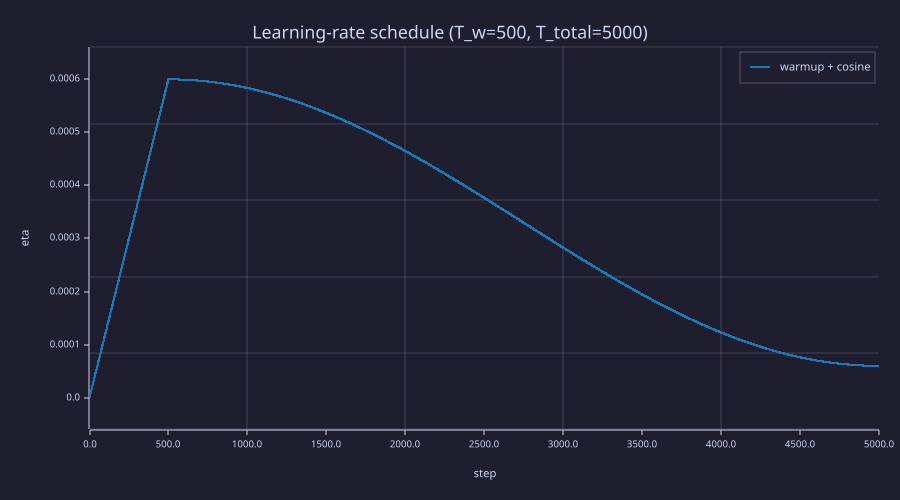
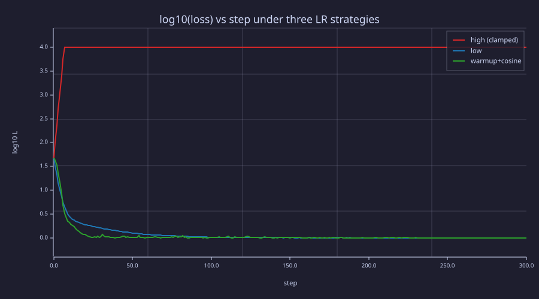

<!-- Generated by rustlab-notebook — do not edit directly. -->

# Lesson 17: Learning Rate Scheduling

[Lesson 16](16-adamw-optimizer.md) treated the learning rate $\eta$ as a single fixed number. Real LLM training never holds $\eta$ constant. Instead it follows a **schedule**: a small linear *warmup* at the start (so the model sees gentle gradients while $\hat{\mathbf{m}}$ and $\hat{\mathbf{v}}$ initialise), then a long *cosine decay* (so the optimiser slows as it nears a minimum). This lesson derives the warmup-then-cosine schedule used in nanoGPT, GPT-3, LLaMA, and most modern transformers — and shows why warmup prevents early-training divergence.

## Learning Objectives

- Define **linear warmup** and explain why a transformer needs to see small learning rates for the first few hundred steps.
- Define **cosine decay** with a minimum-LR floor and explain why it converges more smoothly than step decay or exponential decay.
- Combine the two into a single $\eta(t)$ function and plot it.
- Connect schedule choices to **Adam's bias correction**: the first ~$1/(1-\beta_2)$ steps are dominated by initialisation noise; warmup keeps the model out of trouble while the moment estimates stabilise.
- Recognise the hyperparameters that real LLM training papers report: `warmup_steps`, `lr_decay_steps`, `min_lr`, `max_lr`.

## Background

Adam and AdamW from [Lesson 16](16-adamw-optimizer.md). Bias correction $1 - \beta_2^t$ that takes ~$1/(1-\beta_2) \approx 1000$ steps to converge. Cross-entropy loss as the optimisation target from [Lesson 03](03-cross-entropy-loss.md).

## The Warmup Phase

### Theory

For the first few hundred steps Adam's $\hat{\mathbf{v}}$ is dominated by whatever the *initial* gradient magnitudes happen to be. A randomly-initialised transformer has fresh embeddings and fresh attention weights; gradients can be far from typical-training scale. If $\eta$ starts at its peak value, the first few updates can:

- Push parameters out of the well-conditioned basin chosen by the initialiser (Xavier/He scale).
- Saturate softmaxes and produce nearly-zero attention gradients.
- Make $\hat{\mathbf{v}}$ commit to a too-large or too-small estimate that then takes many steps to correct.

The fix: ramp $\eta$ linearly from 0 to $\eta_{\max}$ over the first $T_w$ steps:

$$\eta_{\text{warmup}}(t) \;=\; \eta_{\max} \cdot \frac{t}{T_w} \quad \text{for } t \in [0, T_w].$$

Typical $T_w$ in published papers: **GPT-3 warms up over its first 375 M tokens, LLaMA-1 and LLaMA-2 use 2000 steps, and small char-level runs use 100–500 steps**. A useful *heuristic* ties $T_w$ to Adam's second-moment horizon $1/(1-\beta_2) \approx 1000$ steps (for default $\beta_2 = 0.999$): warming up over roughly that many steps lets $\eta$ reach its peak just as $\hat{\mathbf{v}}$ becomes a reliable scale estimate. It is a motivation, not a bound — large-scale runs sit at or above this horizon, while small-scale runs routinely undercut it, because a tiny model's $\hat{\mathbf{v}}$ stabilises on far less data.

## The Cosine Decay Phase

### Theory

After warmup, decay $\eta$ smoothly from $\eta_{\max}$ down to a floor $\eta_{\min}$ over the remaining $T_d - T_w$ steps:

$$\eta_{\text{decay}}(t) \;=\; \eta_{\min} + \tfrac{1}{2}(\eta_{\max} - \eta_{\min})\left(1 + \cos\!\left(\pi \cdot \frac{t - T_w}{T_d - T_w}\right)\right)\quad \text{for } t \in (T_w, T_d].$$

At $t = T_w$ this evaluates to $\eta_{\max}$ (the cosine is $\cos 0 = 1$); at $t = T_d$ it evaluates to $\eta_{\min}$ (the cosine is $\cos \pi = -1$). The shape is **slow-fast-slow**: gentle decrease at the start of the decay (so we keep exploring near the still-high LR), aggressive drop in the middle, gentle approach to the floor near the end (so the final updates are small enough to settle into a flat region of the loss surface).

Why cosine and not exponential or step decay?

- **Step decay** (drop by 10× at fixed milestones) introduces sudden gradient-magnitude shocks that disrupt Adam's moment estimates.
- **Exponential decay** $\eta_t = \eta_0 \gamma^t$ is too aggressive early and too slow late.
- **Cosine** has zero derivative at both ends of the *decay segment* — it leaves the peak flat and approaches the floor flat, so the late-training LR settles gently instead of dropping in shocks the way step decay does. (The composite schedule does have one slope kink at $t = T_w$, where the warmup ramp of slope $\eta_{\max}/T_w$ meets the decay's zero slope. That single kink at the peak is harmless; step decay introduces a fresh one at every milestone.)

A typical schedule sets $\eta_{\min} = 0.1 \cdot \eta_{\max}$. The 10× cap on the LR range keeps the optimiser productive even at the end of training.

### Example — Build the full schedule and plot it

```rustlab
T_total  = 5000;
T_warmup = 500;
T_decay  = T_total;
eta_max  = 6e-4;
eta_min  = 6e-5;

eta_sched = zeros(T_total + 1);
for t = 0:T_total
  if t < T_warmup
    eta_sched(t + 1) = eta_max * (t / T_warmup);
  else
    progress = (t - T_warmup) / (T_decay - T_warmup);
    eta_sched(t + 1) = eta_min + 0.5 * (eta_max - eta_min) * (1 + cos(pi * progress));
  end
end
```

```rustlab
figure();
steps = 0:T_total;
plot(steps, eta_sched, "color", "blue", "label", "warmup + cosine")
title("Learning-rate schedule (T_w=500, T_total=5000)")
xlabel("step")
ylabel("eta")
```

<!-- rustlab:output-start -->


<!-- rustlab:output-end -->

Three regions are visible: a steep linear ramp to the peak in the first 500 steps, a gentle plateau near the peak, and a long cosine decay to the floor.

## Schedule and Loss Curve

### Theory

A simulated training run shows the schedule's *effect*. A constant LR above the stability limit **diverges**; a constant LR well below it converges but only **slowly**; the warmup+cosine schedule spends its peak-LR phase moving fast, then decays into the same low-noise floor the slow run eventually reaches — but in far fewer steps. The honest comparison is *not* "the schedule wins on final loss" (the patient constant-low run reaches an equally good floor if you wait); it is "the schedule reaches that floor sooner, and never risks the divergence the high-LR run suffers".

### Example — Simulated loss curves under three schedules

A noisy quadratic surrogate for cross-entropy, with curvature 10 in $\theta_1$ so the gradient-descent stability limit is $\eta < 2/10 = 0.2$. Three runs: a constant high LR of $0.25$ (above the limit — it diverges), a constant low LR of $0.02$ (safe but slow), and warmup+cosine (peak $0.18$, floor $0.02$). We measure each run's **steps-to-floor**: the first step at which the loss drops below $1.01$ (the noiseless bowl floors at $1.0$).

```rustlab
seed(17);

function L = surrogate_loss(theta)
  L = 0.5 * (10.0 * theta(1) ^ 2 + theta(2) ^ 2) + 1.0;   % +1 floor like real CE
end
function g = surrogate_grad(theta)
  g = [10.0 * theta(1), theta(2)];
end

n_train = 300;
sigma = 0.3;
init  = [-3.0, 2.0];

% Run 1: constant high LR = 0.25 (above the 0.2 stability limit -> diverges)
theta = init;
loss_high = zeros(n_train + 1);
loss_high(1) = surrogate_loss(theta);
for t = 1:n_train
  g = surrogate_grad(theta) + sigma * randn(2);
  theta = theta - 0.25 * g;
  loss_high(t + 1) = surrogate_loss(theta);
end

% Run 2: constant low LR = 0.02 (always safe, never fast)
theta = init;
loss_low = zeros(n_train + 1);
loss_low(1) = surrogate_loss(theta);
for t = 1:n_train
  g = surrogate_grad(theta) + sigma * randn(2);
  theta = theta - 0.02 * g;
  loss_low(t + 1) = surrogate_loss(theta);
end

% Run 3: warmup + cosine schedule
T_w  = 30;
T_d  = n_train;
eta_p = 0.18;
eta_f = 0.02;
theta = init;
loss_sched = zeros(n_train + 1);
loss_sched(1) = surrogate_loss(theta);
for t = 1:n_train
  if t <= T_w
    eta_t = eta_p * (t / T_w);
  else
    progress = (t - T_w) / (T_d - T_w);
    eta_t = eta_f + 0.5 * (eta_p - eta_f) * (1 + cos(pi * progress));
  end
  g = surrogate_grad(theta) + sigma * randn(2);
  theta = theta - eta_t * g;
  loss_sched(t + 1) = surrogate_loss(theta);
end

print("constant high LR (0.25) final loss:", loss_high(n_train + 1), " (diverged)");
print("constant low  LR (0.02) final loss:", loss_low(n_train + 1));
print("warmup+cosine           final loss:", loss_sched(n_train + 1));

% Steps to reach the floor neighbourhood: first step with loss < 1.01.
% (while idiom -- rustlab has no break/continue; stop at the first hit.)
thresh = 1.01;
N = n_train + 1;
i = 1;
while i < N && loss_low(i) >= thresh
  i = i + 1;
end
step_low = i - 1;                 % curve index k holds step k-1
i = 1;
while i < N && loss_sched(i) >= thresh
  i = i + 1;
end
step_sched = i - 1;
ratio = step_low / step_sched;
print("steps to loss < 1.01  (constant low) :", step_low);
print("steps to loss < 1.01  (warmup+cosine):", step_sched);
```

<!-- rustlab:output-start -->
```text
constant high LR (0.25) final loss: 196059472798838970000000000000000000000000000000000000000000000000000000000000000000000000000000000000000000  (diverged)
constant low  LR (0.02) final loss: 1.0006252375809246
warmup+cosine           final loss: 1.0018362245113204
steps to loss < 1.01  (constant low) : 127
steps to loss < 1.01  (warmup+cosine): 36
```

<!-- rustlab:output-end -->

```rustlab
figure();
steps = 0:n_train;
% high-LR loss diverges to ~1e105; clamp to 1e4 and plot log10 so the
% low/schedule descent stays legible next to the divergence.
plot(steps, log10(min(loss_high, 1.0e4)), "color", "red",   "label", "constant high LR (diverges)")
hold("on")
plot(steps, log10(loss_low),   "color", "blue",  "label", "constant low LR")
plot(steps, log10(loss_sched), "color", "green", "label", "warmup + cosine")
hold("off")
title("log10(loss) vs step under three LR strategies")
xlabel("step")
ylabel("log10 L")
legend("high (clamped)", "low", "warmup+cosine")
```

<!-- rustlab:output-start -->


<!-- rustlab:output-end -->

The high-LR curve climbs off the top of the axis: with $\eta = 0.25$ past the $0.2$ stability limit, each step in the steep $\theta_1$ direction is amplified by $\lvert 1 - 0.25\cdot 10\rvert = 1.5$, so the loss grows geometrically (we clamp it at $10^4$ and plot $\log_{10}$ so the other two stay legible). The low-LR run descends smoothly but only reaches the floor around step $127$; the schedule reaches the *same* floor around step $36$ — about 3.5× sooner — by spending its middle phase near the peak LR. Neither converged run "wins" on final loss (both land at ≈ 1.001); the schedule simply gets there faster while the high-LR run never gets there at all.

## Hyperparameter Cheat Sheet

### Theory

What real published transformers use:

| Model | $\eta_{\max}$ | $T_w$ | $T_d$ | $\eta_{\min} / \eta_{\max}$ |
|---|---|---|---|---|
| nanoGPT GPT-2 124M repro | $6 \times 10^{-4}$ | 2000 | 600000 | 0.1 |
| GPT-3 (175B) | $6 \times 10^{-5}$ | 375 M tokens | 260 B tokens | 0.1 |
| LLaMA-1 (7B) | $3 \times 10^{-4}$ | 2000 | 1 T tokens | 0.1 |
| LLaMA-2 (70B) | $1.5 \times 10^{-4}$ | 2000 | 2 T tokens | 0.1 |

Patterns to notice:

- **$\eta_{\max}$ decreases sublinearly with model size** — bigger models need smaller peak LRs because they have more parameters whose collective updates can destabilise the loss (a 1400× jump from 124 M to 175 B params drops $\eta_{\max}$ only 10×).
- **$T_w$ stays in the hundreds-to-thousands range** — only weakly dependent on model size, because it is anchored to Adam's second-moment horizon $1/(1-\beta_2)$ rather than to parameter count.
- **$\eta_{\min} / \eta_{\max} \approx 0.1$** is the universal default. Going lower wastes the tail of training; going higher leaves Adam too jittery to settle.

## Connection to Information Theory

### Theory

The schedule has a clean reading in terms of the bit budget from [Lesson 03](03-cross-entropy-loss.md):

- **Warmup:** the model has not yet committed to *any* hypothesis about the data distribution. Its initial cross-entropy is roughly $\log_2 |\mathcal{V}|$ bits per token (a uniform-prior baseline). Big steps would commit hard to whichever direction the first noisy gradients point — squandering bits to fit noise. Warmup keeps the model close to its uniform prior until enough minibatches have accumulated to give a robust gradient direction.
- **Cosine plateau:** once $\hat{\mathbf{v}}$ has stabilised, the model is in the regime where each gradient step transmits genuine signal (a low *Bayes risk* update). Big steps near the peak LR pay off: each update reduces real cross-entropy quickly.
- **Cosine decay tail:** late in training, the gradient is mostly minibatch noise plus a small genuine component. The signal-to-noise ratio of any single step is low. Smaller steps mean the optimiser averages over more noisy gradients per unit-of-distance moved, lowering the risk of overshooting the true minimum and locking in spurious bits.

Read this way, an LR schedule is not a heuristic — it is a *time-varying step size* that matches the optimiser's cautiousness to the current signal-to-noise ratio of the gradient.

## Key Takeaways

- **Warmup** ramps $\eta$ from 0 to $\eta_{\max}$ over the first hundreds-to-thousands of steps so Adam's moment estimates stabilise before any aggressive update happens.
- **Cosine decay** transitions $\eta$ from peak to floor over the remaining steps, with zero derivative at both ends of the decay segment — the only slope kink in the composite schedule is the harmless one at the warmup peak, far gentler than step decay's repeated jumps.
- The combination `linear warmup + cosine decay` is the de-facto LLM standard; the only knobs that change between papers are $\eta_{\max}$, $T_w$, $T_d$, and the floor ratio $\eta_{\min}/\eta_{\max}$.
- Warmup length is commonly chosen near Adam's second-moment horizon $1/(1-\beta_2) \approx 1000$ steps (a heuristic, not a bound — small runs use far fewer); a constant LR above the loss surface's stability limit diverges, and starting small is exactly what warmup buys.
- $\eta_{\min}/\eta_{\max} \approx 0.1$ is universal across published models.

## Standalone Scripts

| Script | What it computes |
|---|---|
| `lr_schedule.rlab` | the warmup + cosine schedule curve and its three phases (warmup, plateau, decay) |
| `schedule_vs_constant.rlab` | three simulated training runs (high-LR, low-LR, scheduled) on a noisy 2D bowl; loss curves overlaid |

Run all with `make lesson-17` (or `rustlab run lessons/17-learning-rate-scheduling/<name>.rlab`).

## Expected Numerical Outputs Summary

| Variable | Expected Value |
|---|---|
| `eta_sched(1)` | `0` (cold start) |
| `eta_sched(T_warmup + 1)` | $\eta_{\max} = 6 \times 10^{-4}$ |
| `eta_sched(T_total + 1)` | $\eta_{\min} = 6 \times 10^{-5}$ (the floor) |
| `loss_high(end)` (constant high LR = 0.25) | diverges (≈ $10^{105}$ — above the 0.2 stability limit) |
| `loss_low(end)` (constant low LR = 0.02) | ≈ `1.0006` (reaches the noise floor, slowly) |
| `loss_sched(end)` (warmup+cosine) | ≈ `1.0018` (same floor as the low-LR run) |
| `step_low` (constant-low steps to loss < 1.01) | `127` |
| `step_sched` (schedule steps to loss < 1.01) | `36` |

## Exercises

1. **Why a smooth ramp.** Replace the warmup ramp $\eta_{\text{warmup}}(t) = \eta_{\max} \cdot t / T_w$ with a step jump (LR = 0 for $t < T_w/2$, then $\eta_{\max}$). What goes wrong with Adam's first update after the jump?
2. **The cosine endpoints.** Verify algebraically that $\eta_{\text{decay}}(T_w) = \eta_{\max}$ and $\eta_{\text{decay}}(T_d) = \eta_{\min}$.
3. **Warmup length scales with $\beta_2$.** Adam's bias correction $1 - \beta_2^t$ reaches 0.99 at $t \approx \log(0.01) / \log(\beta_2)$. Compute this for $\beta_2 \in \{0.99, 0.999, 0.9999\}$. What does each tell you about the minimum sensible $T_w$?
4. **Re-run schedule_vs_constant.rlab** with $\sigma = 1.0$ instead of $0.3$. Which schedule (high-LR vs scheduled) is most robust to higher gradient noise? Why?
5. **What if you skip cosine.** Modify `lr_schedule.rlab` to keep $\eta = \eta_{\max}$ flat after warmup (no decay). Run on a real loss surface (e.g. copy the loss-surface setup from `optimizer_comparison.rlab` in Lesson 16). Does it ever converge? Why or why not?

## What's next

Lesson 18 stitches together everything in Phase 6: backprop (Lesson 15) computes the gradient, AdamW (Lesson 16) consumes it, and the schedule (this lesson) modulates the step size. The result is the full **training loop** — minibatch sample, forward pass, backward pass, optimiser step, log loss, repeat — with the diagnostic curves (train vs validation loss, gradient norm) that tell you whether the run is healthy.
