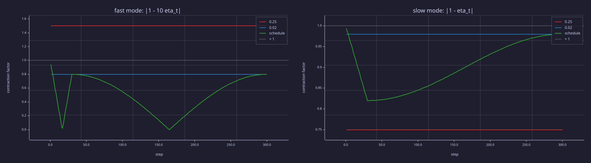
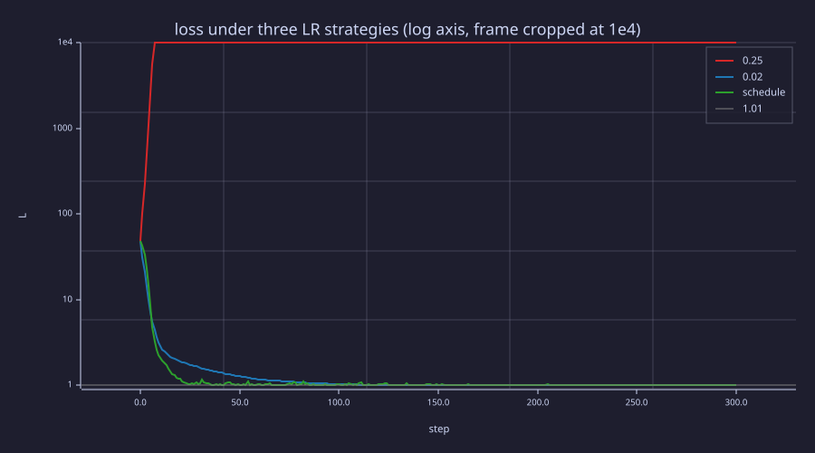
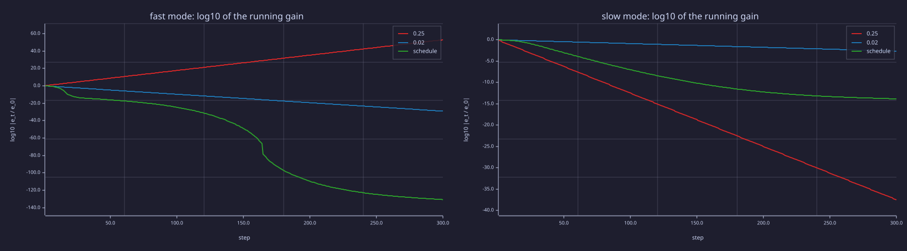
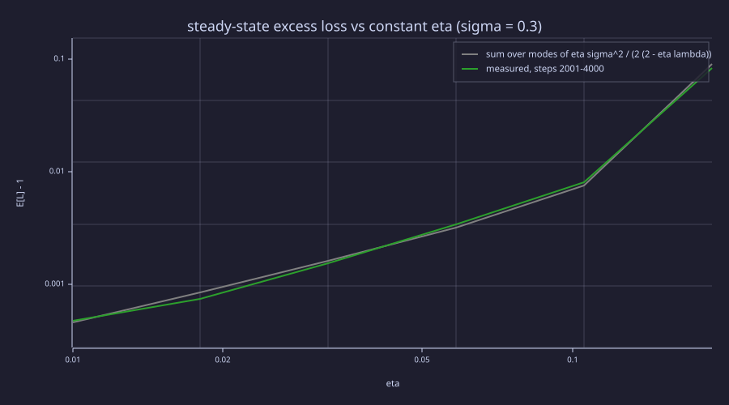
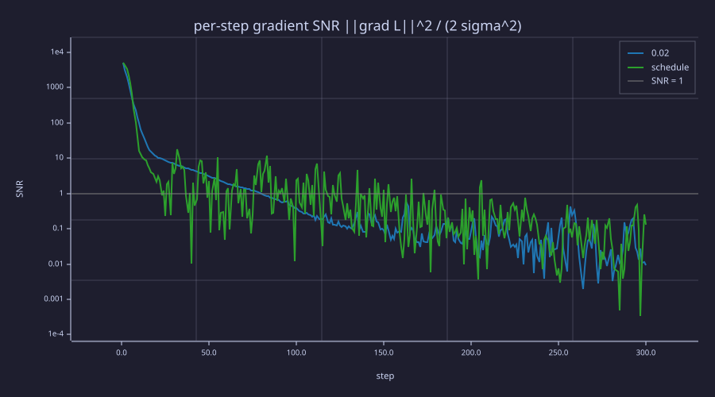

<!-- Generated by rustlab-notebook — do not edit directly. -->

# Lesson 17: Learning Rate Scheduling

[16-adamw-optimizer](16-adamw-optimizer.md) treated the learning rate $\eta$ as a single fixed number. Real LLM training never holds $\eta$ constant. Instead it follows a **schedule**: a short linear *warmup* at the start, then a long *cosine decay*. In control terms a schedule is **gain scheduling** — the loop gain of the training controller is moved along a planned trajectory during the run. This lesson derives the warmup-then-cosine schedule used in nanoGPT, GPT-3, LLaMA, and most modern transformers, shows what a time-varying gain does to each mode of the loss, and shows why the decay is what finally removes the optimiser's noise floor.

## Learning Objectives

- Define **linear warmup** and give the reasons a transformer needs a small learning rate at the start — Adam's sign-sized first step first among them.
- Define **cosine decay** with a minimum-LR floor and explain why it converges more smoothly than step decay or exponential decay.
- Combine the two into a single $\eta(t)$ function and plot it.
- Read a schedule as a **linear time-varying** system: the per-mode contraction factor $\lvert 1 - \eta_t\lambda_i \rvert$, its running product, and the noise floor $\propto \eta$.
- Recognise the hyperparameters that real LLM training papers report: `warmup_steps`, `lr_decay_steps`, `min_lr`, `max_lr`.

## Background

Adam and AdamW from [16-adamw-optimizer](16-adamw-optimizer.md), including the stability bound $\eta < 2/\lambda_{\max}$ (one mode there; the matrix version in [06-linear-layers-and-gradient-descent](06-linear-layers-and-gradient-descent.md)) and the one-pole-filter reading of the moments. Cross-entropy loss as the optimisation target from [03-cross-entropy-loss](03-cross-entropy-loss.md).

## The Warmup Phase

### Theory

Warmup ramps $\eta$ linearly from 0 to $\eta_{\max}$ over the first $T_w$ steps:

$$\eta_{\text{warmup}}(t) \;=\; \eta_{\max} \cdot \frac{t}{T_w} \quad \text{for } t \in [0, T_w].$$

The cleanest reason it is needed is two lines of arithmetic. At $t = 1$ Adam's bias-corrected moments are $\hat{\mathbf{m}}_1 = \mathbf{g}_1$ and $\hat{\mathbf{v}}_1 = \mathbf{g}_1^2$ exactly, so

$$\frac{\hat{\mathbf{m}}_1}{\sqrt{\hat{\mathbf{v}}_1}} = \frac{\mathbf{g}_1}{\lvert \mathbf{g}_1 \rvert} = \operatorname{sign}(\mathbf{g}_1).$$

The first update moves *every* parameter by exactly $\eta_1$, whatever the size of its gradient: a coordinate with gradient $10^{-3}$ and one with gradient $300$ take the same step. At $\eta_1 = \eta_{\max}$ that is a full-sized, effectively random-signed kick to all $N$ parameters at once — a displacement of $\eta_{\max}\sqrt{N}$ — before $\hat{\mathbf{v}}$ carries any information about scale. Warmup makes the first kick $\eta_{\max}/T_w$ instead, and for the next few dozen steps, while $\hat{\mathbf{v}}$ is still an average over only $t$ samples, keeps the steps small while the scale estimate settles.

That is one reason among several, which is why *how long* to warm up is set empirically rather than by a formula: the loss surface at initialisation is unusually sharp along a few directions (its $\lambda_{\max}$ is large, so the stable $\eta$ is small until the first steps flatten it); embedding rows of tokens not yet seen have $\hat v = 0$ and take full-sized steps the moment they first appear; and Post-LN transformer stacks are unstable without warmup (Xiong et al., 2020 — the reason [12-layer-norm-and-residuals](12-layer-norm-and-residuals.md) moved to Pre-LN). Published values: GPT-3 warms up over its first 375 M tokens, LLaMA-1 and LLaMA-2 use 2000 steps, small char-level runs use 100–500. Adam's second-moment horizon $1/(1-\beta_2)$ is *not* the anchor: LLM practice uses $\beta_2 = 0.95$ (a 20-step horizon, [16-adamw-optimizer](16-adamw-optimizer.md)) with warmups of thousands of steps.

### Example — Adam's first step is sign(g)

```rustlab
beta1 = 0.9;  beta2 = 0.999;
g1 = [0.001, -300.0, 4.0];                    % three coordinates, gradients 5 orders apart
m_hat1 = ((1 - beta1) * g1) / (1 - beta1);
v_hat1 = ((1 - beta2) * g1 .^ 2) / (1 - beta2);
kick = 6e-4 * sqrt(124e6);                    % GPT-2 124M at eta_max = 6e-4, no warmup
print("g_1                    :", g1);
print("m_hat_1 ./ sqrt(v_hat_1):", m_hat1 ./ sqrt(v_hat1));
print("un-warmed first step, GPT-2 124M: ||step|| = eta_max sqrt(N) =", kick, "  (init norm 0.02 sqrt(N) =", 0.02 * sqrt(124e6), ")");
```

<!-- rustlab:output-start -->
```text
g_1                    : [1×3]  0.001000  -300.000000  4.000000
m_hat_1 ./ sqrt(v_hat_1): [1×3]  1.000000  -1.000000  1.000000
un-warmed first step, GPT-2 124M: ||step|| = eta_max sqrt(N) = 6.681317235396026   (init norm 0.02 sqrt(N) = 222.7105745132009 )
```

<!-- rustlab:output-end -->

Every coordinate reports $\pm 1$: at step one Adam is sign descent, and $\eta_1$ alone sets the step size. For a 124 M-parameter GPT-2 at $\eta_{\max} = 6\times10^{-4}$ the un-warmed first step would move the whole parameter vector by $6.7$ in Euclidean norm — about 3 % of the initialisation's norm, in one step, in a direction chosen by a single minibatch.

## The Cosine Decay Phase

### Theory

After warmup, decay $\eta$ smoothly from $\eta_{\max}$ down to a floor $\eta_{\min}$ over the remaining $T_d - T_w$ steps:

$$\eta_{\text{decay}}(t) \;=\; \eta_{\min} + \tfrac{1}{2}(\eta_{\max} - \eta_{\min})\left(1 + \cos\!\left(\pi \cdot \frac{t - T_w}{T_d - T_w}\right)\right)\quad \text{for } t \in (T_w, T_d].$$

At $t = T_w$ this evaluates to $\eta_{\max}$ (the cosine is $\cos 0 = 1$); at $t = T_d$ it evaluates to $\eta_{\min}$ (the cosine is $\cos \pi = -1$). The shape is **slow-fast-slow**: gentle decrease at the start of the decay (so we keep exploring near the still-high LR), aggressive drop in the middle, gentle approach to the floor near the end (so the final updates are small enough to settle into a flat region of the loss surface).

Why cosine and not exponential or step decay?

- **Step decay** (drop by 10× at fixed milestones) introduces sudden gradient-magnitude shocks that disrupt Adam's moment estimates.
- **Exponential decay** $\eta_t = \eta_0 \gamma^t$ is too aggressive early and too slow late.
- **Cosine** has zero derivative at both ends of the *decay segment* — it leaves the peak flat and approaches the floor flat, so the late-training LR settles gently instead of dropping in shocks the way step decay does. (The composite schedule does have one slope kink at $t = T_w$, where the warmup ramp of slope $\eta_{\max}/T_w$ meets the decay's zero slope. That single kink at the peak is harmless; step decay introduces a fresh one at every milestone.)

A typical schedule sets $\eta_{\min} = 0.1 \cdot \eta_{\max}$. The 10× cap on the LR range keeps the optimiser productive even at the end of training. Two relatives you will meet in current papers: **warmup–stable–decay (WSD)** holds $\eta_{\max}$ flat for most of the run and decays only in a short final cooldown, so the total run length need not be fixed in advance; and the original Transformer's **inverse-square-root** schedule, $\eta_t \propto \min\!\big(t^{-1/2},\, t\,T_w^{-3/2}\big)$, decays forever without a floor.

### Example — Build the full schedule and plot it

```rustlab
T_total  = 5000;
T_warmup = 500;
T_decay  = T_total;
eta_max  = 6e-4;
eta_min  = 6e-5;

eta_sched = zeros(T_total + 1);
for t = 0:T_total
  if t < T_warmup
    eta_sched(t + 1) = eta_max * (t / T_warmup);
  else
    progress = (t - T_warmup) / (T_decay - T_warmup);
    eta_sched(t + 1) = eta_min + 0.5 * (eta_max - eta_min) * (1 + cos(pi * progress));
  end
end
```

```rustlab
figure();
steps = 0:T_total;
plot(steps, eta_sched, "color", "blue", "label", "warmup + cosine")
title("Learning-rate schedule (T_w=500, T_total=5000)")
xlabel("step")
ylabel("eta")
```

<!-- rustlab:output-start -->


<!-- rustlab:output-end -->

> [!TIP]
> Three regions: a steep linear ramp to the peak in the first 500 steps, a flat shoulder near the peak (zero slope where the cosine starts), and a long decay that flattens again into the floor at $6\times10^{-5}$.

## Schedule and Loss Curve

### Theory

On a quadratic, gradient descent with a *constant* $\eta$ is linear time-invariant: along each eigen-direction of the Hessian with curvature $\lambda_i$ the error obeys $e_{t+1} = (1 - \eta\lambda_i)\,e_t$ — the pole of [16-adamw-optimizer](16-adamw-optimizer.md) — and is stable iff $\lvert 1 - \eta\lambda_i \rvert < 1$. A schedule makes the same system **linear time-varying**: the pole moves every step, and

$$e_t = \Big(\prod_{s=1}^{t} (1 - \eta_s\lambda_i)\Big)\, e_0 .$$

What matters per mode is therefore the **contraction factor** $\lvert 1 - \eta_t\lambda_i \rvert$ at each step and its running product. A factor above 1 for a few steps is harmless; a factor above 1 *forever* is divergence; a factor of exactly 0 (at $\eta_t = 1/\lambda_i$) annihilates that mode's error in a single step. This is gain scheduling in the textbook sense: $\eta_t$ is planned so that the fast modes are never held above 1, most of the run is spent near the largest safe gain, and — once gradient noise is included — the noise floor, which scales with $\eta$, is lowered at the end. The honest comparison with a constant learning rate is then not "the schedule wins on final loss" (a patient constant-low run reaches the same floor) but "the schedule keeps every mode contracting while getting to the floor several times sooner, and never risks the divergence the high-gain run suffers".

### Example — Three runs through one helper

A noisy quadratic surrogate with curvature 10 in $\theta_1$ and 1 in $\theta_2$, so the fast mode's stability limit is $\eta < 2/10 = 0.2$. One helper, `run_sgd`, takes the schedule as a function of $t$ and returns the loss curve, the $\eta_t$ actually used, and the per-step gradient signal-to-noise ratio (used under the Information lens). Three calls: a constant $\eta = 0.25$ above the limit, a constant $\eta = 0.02$ well below it, and warmup + cosine (peak $0.18$, floor $0.02$). Seed, noise and step order are unchanged from the earlier version of this lesson, so the printed numbers are the same.

```rustlab
seed(17);
function L = surrogate_loss(theta)
  L = 0.5 * (10.0 * theta(1) ^ 2 + theta(2) ^ 2) + 1.0;   % +1 floor like real CE
end
function g = surrogate_grad(theta)
  g = [10.0 * theta(1), theta(2)];
end
function e = warmup_cosine(t, T_w, T_d, eta_p, eta_f)
  if t <= T_w
    e = eta_p * (t / T_w);
  else
    e = eta_f + 0.5 * (eta_p - eta_f) * (1 + cos(pi * (t - T_w) / (T_d - T_w)));
  end
end
% One noisy-SGD run under the schedule eta_of_t(t).  Returns the loss curve,
% the eta_t actually used, and the per-step SNR  ||grad L||^2 / (2 sigma^2).
function [L, etas, snr] = run_sgd(eta_of_t, n, sigma, init)
  theta = init;  L = zeros(n + 1);  etas = zeros(n);  snr = zeros(n);
  L(1) = surrogate_loss(theta);
  for t = 1:n
    etas(t) = eta_of_t(t);
    g_true = surrogate_grad(theta);
    snr(t) = sum(g_true .^ 2) / (2 * sigma ^ 2);
    theta = theta - etas(t) * (g_true + sigma * randn(2));
    L(t + 1) = surrogate_loss(theta);
  end
end

n_train = 300;  sigma = 0.3;  init = [-3.0, 2.0];
T_w = 30;  eta_p = 0.18;  eta_f = 0.02;
[loss_high,  eta_high, snr_high]  = run_sgd(@(t) 0.25, n_train, sigma, init);
[loss_low,   eta_low,  snr_low]   = run_sgd(@(t) 0.02, n_train, sigma, init);
[loss_sched, eta_run,  snr_sched] = run_sgd(@(t) warmup_cosine(t, T_w, n_train, eta_p, eta_f), n_train, sigma, init);
print("constant high LR (0.25) final loss:", loss_high(n_train + 1), " (diverged)");
print("constant low  LR (0.02) final loss:", loss_low(n_train + 1));
print("warmup+cosine           final loss:", loss_sched(n_train + 1));
```

<!-- rustlab:output-start -->
```text
constant high LR (0.25) final loss: 196059472798838970000000000000000000000000000000000000000000000000000000000000000000000000000000000000000000  (diverged)
constant low  LR (0.02) final loss: 1.0006252375809246
warmup+cosine           final loss: 1.0018362245113204
```

<!-- rustlab:output-end -->

```rustlab
thresh = 1.01;  N = n_train + 1;              % loss < 1.01 = "arrived at the floor"
i = 1;
while i < N && loss_low(i) >= thresh
  i = i + 1;
end
step_low = i - 1;                             % curve index k holds step k-1
i = 1;
while i < N && loss_sched(i) >= thresh
  i = i + 1;
end
step_sched = i - 1;
i = 1;
while i < N && loss_high(i) <= 1.0e4
  i = i + 1;
end
exit_step = i - 1;
print("steps to loss < 1.01  (constant low) :", step_low);
print("steps to loss < 1.01  (warmup+cosine):", step_sched, "   ratio", step_low / step_sched);
print("constant-high loss passes 1e4 at step:", exit_step);
```

<!-- rustlab:output-start -->
<details>
<summary>Steps to reach the floor, and where the diverging run leaves the plot</summary>

```text
steps to loss < 1.01  (constant low) : 127
steps to loss < 1.01  (warmup+cosine): 36    ratio 3.5277777777777777
constant-high loss passes 1e4 at step: 7
```

</details>

<!-- rustlab:output-end -->

### Example — The contraction factor of each mode

The central figure of this lesson: $\lvert 1 - \eta_t\lambda \rvert$ for the fast mode ($\lambda = 10$) and the slow mode ($\lambda = 1$) under the three schedules, against the line at 1.

```rustlab
t_ax = 1:n_train;
lam_fast = 10.0;  lam_slow = 1.0;
figure();
subplot(1, 2, 1)
plot(t_ax, abs(1 - eta_high * lam_fast), "color", "red",   "label", "constant 0.25")
hold("on")
plot(t_ax, abs(1 - eta_low * lam_fast),  "color", "blue",  "label", "constant 0.02")
plot(t_ax, abs(1 - eta_run * lam_fast),  "color", "green", "label", "warmup + cosine")
hline(1, "gray", "stability limit")
hold("off")
title("fast mode: |1 - 10 eta_t|")
xlabel("step")
ylabel("contraction factor")
legend("0.25", "0.02", "schedule", "= 1")
subplot(1, 2, 2)
plot(t_ax, abs(1 - eta_high * lam_slow), "color", "red",   "label", "constant 0.25")
hold("on")
plot(t_ax, abs(1 - eta_low * lam_slow),  "color", "blue",  "label", "constant 0.02")
plot(t_ax, abs(1 - eta_run * lam_slow),  "color", "green", "label", "warmup + cosine")
hline(1, "gray", "stability limit")
hold("off")
title("slow mode: |1 - eta_t|")
xlabel("step")
ylabel("contraction factor")
legend("0.25", "0.02", "schedule", "= 1")
```

<!-- rustlab:output-start -->


<!-- rustlab:output-end -->

> [!TIP]
> Left: the red run sits at $1.5$ — above the line — for every step: that *is* the divergence. The green run starts at $0.94$ ($\eta_1 = 0.006$), dips to $0.02$ at step 17 on the way up and to exactly $0$ at step 165 on the way down — both where $\eta_t \approx 1/\lambda = 0.1$, deadbeat for this mode — and never exceeds $0.8$. Right: for the slow mode every run is below 1 — even $\eta = 0.25$ would have been fine for this mode alone ($0.75$); the slow run's $0.98$ is why it takes 127 steps.

### Example — Loss curves on a log axis

```rustlab
figure();
steps = 0:n_train;
semilogy(steps, loss_high,  "color", "red",   "label", "constant 0.25")
hold("on")
semilogy(steps, loss_low,   "color", "blue",  "label", "constant 0.02")
semilogy(steps, loss_sched, "color", "green", "label", "warmup + cosine")
hline(1.01, "gray", "floor + 1 %")
hold("off")
ylim([0.9, 1.0e4])
title("loss under three LR strategies (log axis, frame cropped at 1e4)")
xlabel("step")
ylabel("L")
legend("0.25", "0.02", "schedule", "1.01")
```

<!-- rustlab:output-start -->


<!-- rustlab:output-end -->

> [!TIP]
> The red curve leaves the top of the frame at step 7: nothing is clamped, the axis is simply cropped at $10^4$. The green curve crosses the floor line at step 36 and the blue one at step 127.

With $\eta = 0.25$ the fast mode's factor is $1.5$ per step, so the loss (quadratic in the error) grows by $2.25\times$ per step and reaches $2.0e+107$ by step 300. The low-LR run descends smoothly but only reaches the floor around step $127$; the schedule reaches the *same* floor around step $36$ — about 3.5× sooner — by spending its middle phase near the peak gain. Neither converged run "wins" on final loss (both land at ≈ 1.001, and both end at $\eta = 0.02$, so they share the same noise floor — see the Signals lens); the schedule simply gets there faster while the high-LR run never gets there at all.

## Hyperparameter Cheat Sheet

### Theory

What real published transformers use:

| Model | $\eta_{\max}$ | $T_w$ | $T_d$ | $\eta_{\min} / \eta_{\max}$ |
|---|---|---|---|---|
| nanoGPT GPT-2 124M repro | $6 \times 10^{-4}$ | 2000 | 600000 | 0.1 |
| GPT-3 (175B) | $6 \times 10^{-5}$ | 375 M tokens | 260 B tokens | 0.1 |
| LLaMA-1 (7B) | $3 \times 10^{-4}$ | 2000 | 1 T tokens | 0.1 |
| LLaMA-2 (70B) | $1.5 \times 10^{-4}$ | 2000 | 2 T tokens | 0.1 |

Patterns to notice:

- **$\eta_{\max}$ decreases sublinearly with model size** — bigger models need smaller peak LRs because they have more parameters whose collective updates can destabilise the loss (a 1400× jump from 124 M to 175 B params drops $\eta_{\max}$ only 10×).
- **$T_w$ stays in the hundreds-to-thousands range** and is only weakly dependent on model size. It is an empirical setting — long enough for the early sharpness to relax and for every embedding row to have been touched — not a quantity derived from $\beta_2$.
- **$\eta_{\min} / \eta_{\max} \approx 0.1$** is the universal default. Going lower wastes the tail of training; going higher leaves Adam too jittery to settle.

## Engineering Lenses

### Systems

**Exact.** Per mode the state is the error $e_t$ along that eigen-direction, the update law is $e_{t+1} = (1 - \eta_t\lambda_i)\,e_t$, and the total gain after $t$ steps is the running product of the contraction factors plotted above. The product is what decides convergence, so plot its logarithm: the constant-high run's fast mode climbs by $\log_{10} 1.5$ per step, the constant-low run's slow mode falls by only $\log_{10} 0.98$, and the schedule's fast mode passes through the deadbeat zero (clipped at $10^{-12}$ per step so the log axis survives).

```rustlab
E3 = [eta_high; eta_low; eta_run];                       % 3 x n_train
P_fast = zeros(3, n_train);  P_slow = zeros(3, n_train);
for r = 1:3
  P_fast(r, :) = cumsum(log10(max(abs(1 - E3(r, :) * lam_fast), 1e-12)));
  P_slow(r, :) = cumsum(log10(abs(1 - E3(r, :) * lam_slow)));
end
figure();
subplot(1, 2, 1)
plot(t_ax, P_fast(1, :), "color", "red",   "label", "constant 0.25")
hold("on")
plot(t_ax, P_fast(2, :), "color", "blue",  "label", "constant 0.02")
plot(t_ax, P_fast(3, :), "color", "green", "label", "warmup + cosine")
hold("off")
title("fast mode: log10 of the running gain")
xlabel("step")
ylabel("log10 |e_t / e_0|")
legend("0.25", "0.02", "schedule")
subplot(1, 2, 2)
plot(t_ax, P_slow(1, :), "color", "red",   "label", "constant 0.25")
hold("on")
plot(t_ax, P_slow(2, :), "color", "blue",  "label", "constant 0.02")
plot(t_ax, P_slow(3, :), "color", "green", "label", "warmup + cosine")
hold("off")
title("slow mode: log10 of the running gain")
xlabel("step")
ylabel("log10 |e_t / e_0|")
legend("0.25", "0.02", "schedule")
print("log10 gain after 300 steps, fast mode (0.25 / 0.02 / schedule):", P_fast(1, n_train), P_fast(2, n_train), P_fast(3, n_train));
print("log10 gain after 300 steps, slow mode (0.25 / 0.02 / schedule):", P_slow(1, n_train), P_slow(2, n_train), P_slow(3, n_train));
```

<!-- rustlab:output-start -->
```text
log10 gain after 300 steps, fast mode (0.25 / 0.02 / schedule): 52.8273777167044 -29.073003902416875 -130.74047586714738
log10 gain after 300 steps, slow mode (0.25 / 0.02 / schedule): -37.48162098248998 -2.632177292251555 -13.841331073768968
```



<!-- rustlab:output-end -->

> [!TIP]
> Left: red rises by 53 decades — the noiseless fast mode of the $\eta = 0.25$ run would be $10^{53}$ times its starting error. Right: the slow mode is where the constant-low run loses — $0.98^{300}$ is only $2.6$ decades, while the schedule buys $14$.

**Analogy.** Warmup is often called a *soft start*, after the ramped supply that limits inrush current while a motor's state is still unknown. The picture is right about *why* (limit the first kick while the plant state — the loss surface's local curvature and $\hat{\mathbf{v}}$ — is unknown) but it is only a picture: there is no current, no flux, and no conserved quantity being protected. The exact content is the contraction factor above and the sign-descent first step at the top of the lesson.

### Signals

**Exact (for the quadratic model).** Gradient noise enters each mode's recursion as $e_{t+1} = (1 - \eta\lambda)\,e_t - \eta\,\xi_t$ with $\xi_t$ white of variance $\sigma^2$ — a one-pole filter driven by white noise. Its steady-state output variance is

$$\operatorname{Var}\,e = \frac{\eta^2\sigma^2}{1 - (1 - \eta\lambda)^2} = \frac{\eta\,\sigma^2}{\lambda\,(2 - \eta\lambda)}, \qquad \text{excess loss per mode } \tfrac{1}{2}\lambda\,\operatorname{Var}\,e = \frac{\eta\,\sigma^2}{2\,(2 - \eta\lambda)}.$$

The noise floor is **proportional to $\eta$** (until $\eta\lambda$ approaches 2, where the denominator collapses). That is what the decay buys: a run that ends at $\eta_{\min} = \eta_{\max}/10$ ends with a floor ten times lower than it had at the peak. Check it by sweeping a constant $\eta$ and measuring the mean excess loss over the second half of a long run:

```rustlab
seed(171);
etas_sw = logspace(-2, log10(0.19), 6);
meas = zeros(6);  pred = zeros(6);
for i = 1:6
  e = etas_sw(i);
  [Lc, ec, sc] = run_sgd(@(t) e, 4000, sigma, init);
  meas(i) = mean(Lc(2002:4001)) - 1.0;
  pred(i) = e * sigma ^ 2 / (2 * (2 - e * lam_fast)) + e * sigma ^ 2 / (2 * (2 - e * lam_slow));
end
figure();
loglog(etas_sw, pred, "color", "gray",  "label", "theory")
hold("on")
loglog(etas_sw, meas, "color", "green", "label", "measured")
hold("off")
title("steady-state excess loss vs constant eta (sigma = 0.3)")
xlabel("eta")
ylabel("E[L] - 1")
legend("sum over modes of eta sigma^2 / (2 (2 - eta lambda))", "measured, steps 2001-4000")
print("eta      :", etas_sw);
print("measured :", meas);
print("predicted:", pred);
```

<!-- rustlab:output-start -->
```text
eta      : [1×6]  0.010000  0.018020  0.032471  0.058513  0.105439  0.190000
measured : [1×6]  0.000477  0.000740  0.001554  0.003433  0.008106  0.083488
predicted: [1×6]  0.000463  0.000855  0.001615  0.003217  0.007522  0.090224
```



<!-- rustlab:output-end -->

> [!TIP]
> Slope $+1$ on log–log axes — the floor is linear in $\eta$ — with the upturn at the right end as $\eta$ approaches the fast mode's limit $0.2$. The measured points follow the formula with no fitted constant.

### Information

**Model.** The gradient is a noisy channel carrying the descent direction. Per step its signal-to-noise ratio is $\mathrm{SNR}_t = \lVert \nabla L(\theta_t) \rVert^2 / (2\sigma^2)$ — `run_sgd` records it — and by the Gaussian-channel bound a step can convey at most $\tfrac{1}{2}\log_2(1 + \mathrm{SNR}_t)$ bits about that direction. Early in the run the gradient is large and the channel is clean; near the floor the true gradient is a small fraction of the noise and each step carries a fraction of a bit. A schedule matches the step size to that budget: large steps while the gradient is informative, small ones when it is mostly noise (and, by the Signals lens, the small steps are also what keep the noise-driven wander small).

```rustlab
bits = @(s) 0.5 * log2(1 + s);
figure();
semilogy(t_ax, snr_low,   "color", "blue",  "label", "constant 0.02")
hold("on")
semilogy(t_ax, snr_sched, "color", "green", "label", "warmup + cosine")
hline(1, "gray", "SNR = 1")
hold("off")
title("per-step gradient SNR  ||grad L||^2 / (2 sigma^2)")
xlabel("step")
ylabel("SNR")
legend("0.02", "schedule", "SNR = 1")
snr_end_low = mean(snr_low(271:300));  snr_end_sched = mean(snr_sched(271:300));
print("SNR at step 1:", snr_sched(1), "  ->", bits(snr_sched(1)), "bits/step");
print("SNR, mean of steps 271-300:  low", snr_end_low, "  schedule", snr_end_sched);
print("bits/step at the end      :  low", bits(snr_end_low), "  schedule", bits(snr_end_sched));
```

<!-- rustlab:output-start -->
```text
SNR at step 1: 5022.222222222223   -> 6.147198692219589 bits/step
SNR, mean of steps 271-300:  low 0.04033768319248866   schedule 0.08986671853904973
bits/step at the end      :  low 0.028525944372010593   schedule 0.06207585820767956
```



<!-- rustlab:output-end -->

> [!TIP]
> Both runs start near $\mathrm{SNR} = 5022$ and end below the line; the schedule reaches the noise-dominated regime by step ≈ 40 and then, correctly, takes small steps for the remaining 260.

At step 1 the channel carries $6.1$ bits per step; over the last 30 steps the SNR averages $0.09$ for the scheduled run — $0.06$ bits per step — the regime where only small steps make sense. Read this way an LR schedule is not a heuristic: it is a time-varying step size matched to the information the gradient currently carries.

## Key Takeaways

- **Warmup** ramps $\eta$ from 0 to $\eta_{\max}$ over the first hundreds-to-thousands of steps. Adam's first step is exactly $\eta_1\,\operatorname{sign}(\mathbf{g}_1)$ — the same size for every parameter — so $\eta_1$ must be small; the warmup *length* is empirical (early sharpness, untouched embedding rows, Post-LN instability), not a function of $\beta_2$.
- **Cosine decay** transitions $\eta$ from peak to floor with zero derivative at both ends of the decay segment; the only slope kink in the composite schedule is the harmless one at the warmup peak.
- A schedule turns gradient descent into a **linear time-varying** system: per mode the error is multiplied by $\lvert 1 - \eta_t\lambda_i \rvert$ each step. Above 1 forever is divergence; exactly 0 is deadbeat; the running product is the total gain. This is gain scheduling.
- Under gradient noise the floor is $\propto \eta\sigma^2/(2 - \eta\lambda)$ per mode, so the decay to $\eta_{\min}$ lowers the final loss floor by the same factor. $\eta_{\min}/\eta_{\max} \approx 0.1$ is universal across published models.
- The combination `linear warmup + cosine decay` is the de-facto LLM standard; WSD and inverse-square-root are the two relatives worth recognising.

## Standalone Scripts

| Script | What it computes |
|---|---|
| `lr_schedule.rlab` | the warmup + cosine schedule curve and its three phases (warmup, plateau, decay) |
| `schedule_vs_constant.rlab` | three simulated runs (high-LR, low-LR, scheduled) on the noisy 2D bowl through one `run_sgd` helper; the per-mode contraction-factor figure and the log-axis loss curves |
| `noise_floor_vs_eta.rlab` | the steady-state excess loss $\sum_i \eta\sigma^2/(2(2 - \eta\lambda_i))$ measured against a constant-$\eta$ sweep, and the per-step gradient SNR of the scheduled run |

Run all with `make lesson-17` (or `rustlab run lessons/17-learning-rate-scheduling/<name>.rlab`).

## Expected Numerical Outputs Summary

| Variable | Expected Value |
|---|---|
| `m_hat1 ./ sqrt(v_hat1)` at $t = 1$ | `[1, -1, 1]` — $\operatorname{sign}(\mathbf{g}_1)$ regardless of gradient size |
| `eta_sched(1)`, `eta_sched(T_warmup + 1)`, `eta_sched(T_total + 1)` | `0`, $6 \times 10^{-4}$, $6 \times 10^{-5}$ |
| `loss_high(end)` (constant $\eta = 0.25$) | diverges (≈ $2 \times 10^{107}$ — fast-mode factor $1.5$ per step, $2.25\times$ in the loss) |
| `loss_low(end)`, `loss_sched(end)` | ≈ `1.0006`, ≈ `1.0018` (same noise floor: both end at $\eta = 0.02$) |
| `step_low`, `step_sched` (steps to loss < 1.01) | `127`, `36` (≈ 3.5× sooner) |
| `exit_step` (constant-high loss passes $10^4$) | `7` |
| fast-mode contraction factor $\lvert 1 - 10\eta_t \rvert$ | constant 0.25: `1.5`; constant 0.02: `0.8`; schedule: `0.94` → `0.02` (step 17) → `0.8` (peak) → `0` (step 165) → `0.8` |
| `P_fast(:, 300)`, `P_slow(:, 300)` (log10 running gain) | fast: `+52.8` / `-29.1` / `-131` (near-zero factors around the two deadbeat crossings; the exact zero clipped at $10^{-12}$); slow: `-37.5` / `-2.6` / `-13.8` |
| `meas` vs `pred` (excess loss) at $\eta = 0.01$ and $0.19$ | `4.8e-4` vs `4.6e-4`; `0.083` vs `0.090` — slope +1 in between |
| `snr_sched(1)`; mean SNR over steps 271–300 (low / schedule) | `5022` (`6.1` bits/step); `0.04` / `0.09` (`0.03` / `0.06` bits/step) |

## Exercises

1. **Why a smooth ramp.** Replace the warmup ramp $\eta_{\text{warmup}}(t) = \eta_{\max} \cdot t / T_w$ with a step jump (LR = 0 for $t < T_w/2$, then $\eta_{\max}$). Using the sign-descent result, how large is Adam's first real update after the jump, and why does a ramp of the same length avoid it?
2. **The cosine endpoints.** Verify algebraically that $\eta_{\text{decay}}(T_w) = \eta_{\max}$ and $\eta_{\text{decay}}(T_d) = \eta_{\min}$.
3. **Deadbeat.** The scheduled run's fast-mode factor is $0.02$ at step 17 and exactly $0$ at step 165. Show that $\eta_t = 1/\lambda_i$ annihilates mode $i$ in one step, then explain why the loss curve does not drop to the floor at step 17 anyway (two reasons: the other mode, and the noise).
4. **Re-run `schedule_vs_constant.rlab`** with $\sigma = 1.0$ instead of $0.3$. Using the Signals-lens formula, predict the new floor at $\eta = 0.02$ before you run it. Which schedule is most robust to higher gradient noise, and why?
5. **What if you skip cosine.** Modify `lr_schedule.rlab` to keep $\eta = \eta_{\max}$ flat after warmup (no decay). Run on a real loss surface (e.g. copy the loss-surface setup from `optimizer_comparison.rlab` in Lesson 16). Where does the loss settle relative to the decayed run, and which formula in this lesson predicts the gap?

## What's next

[18-training-loop](18-training-loop.md) closes the loop. Backprop ([15-backpropagation](15-backpropagation.md)) computes the gradient, AdamW ([16-adamw-optimizer](16-adamw-optimizer.md)) consumes it, the schedule (this lesson) sets the gain — and a real run adds the two things this lesson's clean quadratic lacked: a noisy minibatch sensor and a limiter on the gradient norm. The result is the full **training loop** with the diagnostic curves (train vs validation loss, gradient norm) that tell you whether the run is healthy, and the block diagram in which every lesson of this arc has a box.
