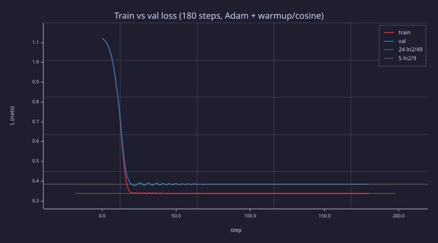
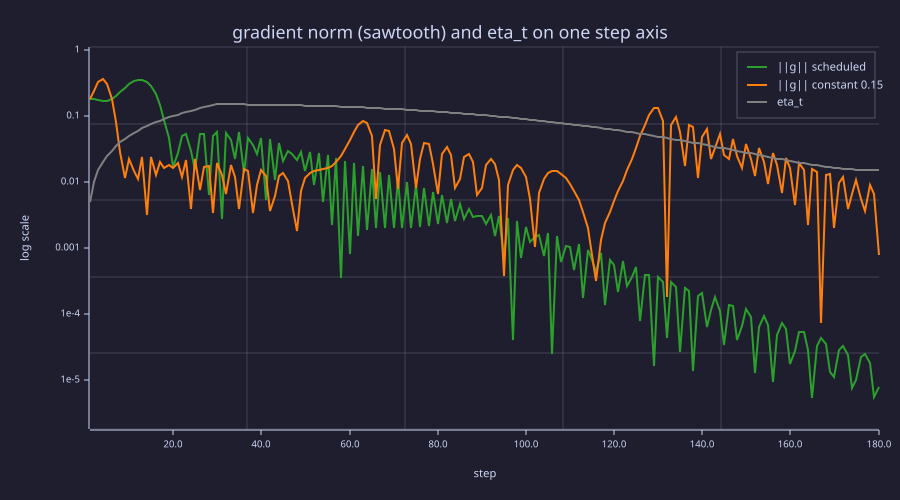
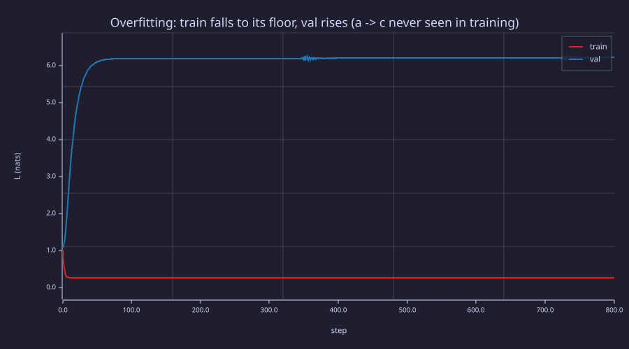
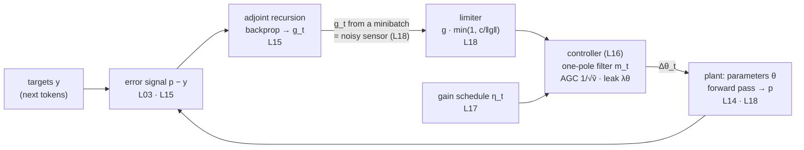
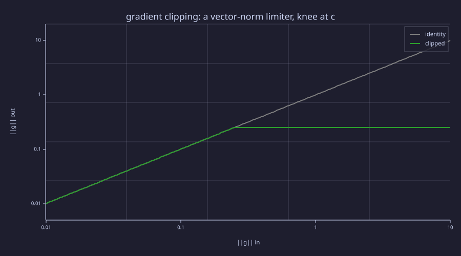
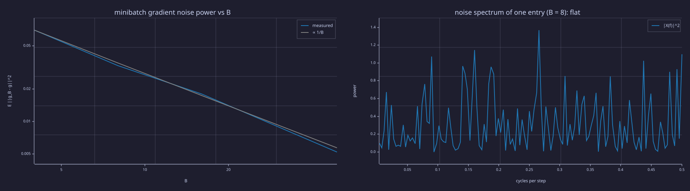

<!-- Generated by rustlab-notebook — do not edit directly. -->

# Lesson 18: The Training Loop

This lesson assembles every piece of the training arc into a real run and closes the loop that [15-backpropagation](15-backpropagation.md) opened. A tiny embedding-then-linear language model (24 trainable parameters) is trained on a 60-character corpus with **Adam** ([16-adamw-optimizer](16-adamw-optimizer.md)) under a **warmup + cosine learning-rate schedule** ([17-learning-rate-scheduling](17-learning-rate-scheduling.md)); gradients come from analytical **backpropagation** ([15-backpropagation](15-backpropagation.md)). The diagnostics — train loss, validation loss, gradient norm — are the same ones used to monitor multi-billion-parameter LLM runs, and the block diagram under the Systems lens is the one every lesson since 15 has been filling in.

## Learning Objectives

- Wire one **forward pass** of a tiny LM (embedding lookup → linear head → softmax → cross-entropy) and verify it numerically.
- Wire the **backward pass** by hand and confirm the parameter gradients via a finite-difference check.
- Implement an **AdamW step** as a helper and drive it from a loop with the warmup+cosine schedule and a gradient-norm limiter.
- Track three diagnostics during training: **train loss, validation loss, gradient norm** — and read the gradient norm's sawtooth as the optimiser ringing, quieted by the schedule.
- Recognise the visual signatures of **underfitting** (both losses high and flat), **healthy training** (both falling, val tracks train), and **overfitting** (train falls while val rises) — the last one run in this notebook.

## Background

Backprop and the linear-layer gradient triple from [15-backpropagation](15-backpropagation.md). AdamW from [16-adamw-optimizer](16-adamw-optimizer.md). Warmup+cosine schedule from [17-learning-rate-scheduling](17-learning-rate-scheduling.md). The bigram-language-model setup and CDF sampling from [05-bigram-language-model](05-bigram-language-model.md). Embeddings as $\mathbf{E} \in \mathbb{R}^{|\mathcal{V}| \times d}$ from [04-embeddings-and-similarity](04-embeddings-and-similarity.md).

## The Toy Model

### Theory

The smallest model with a real forward + backward pass: an embedding table followed by a linear head.

$$\mathbf{h}_t = \mathbf{E}_{x_t}, \qquad \boldsymbol{\ell}_t = \mathbf{h}_t \mathbf{W}, \qquad \mathbf{p}_t = \mathrm{softmax}(\boldsymbol{\ell}_t).$$

- $\mathbf{E} \in \mathbb{R}^{|\mathcal{V}| \times d}$ — embedding table; $\mathbf{E}_{x_t}$ is the row indexed by token $x_t$.
- $\mathbf{W} \in \mathbb{R}^{d \times |\mathcal{V}|}$ — language-model head.
- $\mathbf{p}_t \in \mathbb{R}^{|\mathcal{V}|}$ — predicted distribution over the next token.

For vocab $|\mathcal{V}| = 3$ and $d = 4$ the model has $3\cdot 4 + 4\cdot 3 = 24$ parameters. Loss for one $(x_t, x_{t+1})$ pair: $L_t = -\log p_t(x_{t+1})$, in nats. Loss over a sequence: average over all consecutive pairs.

### Example — Forward pass on one pair

Set up the model and run the forward pass on the bigram `(a, b)`.

```rustlab
seed(18);
vocab = 3;
d_emb = 4;

E = randn(vocab, d_emb) * 0.3;
W = randn(d_emb, vocab) * 0.3;

% Encode "abc...": a=1, b=2, c=3
function L = forward_one(x_curr, x_next, E, W)
  h = E(x_curr, :);                 % vector of length d_emb (row gather)
  pvec = softmax(h * W);            % vector of length vocab
  L = -log(pvec(x_next));
end

L_ab = forward_one(1, 2, E, W);
print("Loss on bigram (a, b) at init:", L_ab);
```

<!-- rustlab:output-start -->
```text
Loss on bigram (a, b) at init: 1.055663278860206
```

<!-- rustlab:output-end -->

At random init the loss is roughly $\log |\mathcal{V}| = \log 3 = 1.099$ nats — the uniform-prior baseline. The model has not learned anything yet.

## Backward Pass

### Theory

Backprop through the model, top to bottom:

1. **Softmax + CE.** $\bar{\boldsymbol{\ell}}_t = \mathbf{p}_t - \mathbf{1}_{x_{t+1}}$ — the error signal of [15-backpropagation](15-backpropagation.md).
2. **Linear head $\boldsymbol{\ell} = \mathbf{h}\mathbf{W}$.** $\bar{\mathbf{W}} = \mathbf{h}^\top \bar{\boldsymbol{\ell}}$, $\bar{\mathbf{h}} = \bar{\boldsymbol{\ell}} \mathbf{W}^\top$.
3. **Embedding lookup $\mathbf{h} = \mathbf{E}_{x_t}$.** Only row $x_t$ of $\mathbf{E}$ is touched: $\bar{\mathbf{E}}_{x_t} = \bar{\mathbf{h}}$, all other rows have zero gradient. (Across a batch the gradients accumulate at each row whose index appears.)

The total parameter gradient on a batch is the **sum** over all training pairs.

### Example — Backward pass + finite-difference check

```rustlab
function [dE, dW, L] = backward_one(x_curr, x_next, E, W, vocab, d_emb)
  h = E(x_curr, :);
  pvec = softmax(h * W);
  L = -log(pvec(x_next));

  e_y = zeros(vocab); e_y(x_next) = 1.0;
  dlogits = pvec - e_y;             % vector of length vocab
  dW = h' * dlogits;                % d_emb × vocab
  dh = dlogits * W';                % vector of length d_emb

  dE = zeros(vocab, d_emb);
  for k = 1:d_emb
    dE(x_curr, k) = dh(k);
  end
end

[dE_ab, dW_ab, L_ab] = backward_one(1, 2, E, W, vocab, d_emb);
print(sprintf("dL/dW shape: %dx%d (d_emb x vocab)", size(dW_ab, 1), size(dW_ab, 2)));
print(sprintf("dL/dE shape: %dx%d (vocab x d_emb)", size(dE_ab, 1), size(dE_ab, 2)));

% Finite-difference check on W(2, 3)
eps = 1e-5;
Wp = W; Wp(2, 3) = W(2, 3) + eps;
Wm = W; Wm(2, 3) = W(2, 3) - eps;
fd = (forward_one(1, 2, E, Wp) - forward_one(1, 2, E, Wm)) / (2 * eps);
print("FD vs analytic dL/dW(2,3):  fd =", fd, "  analytic =", dW_ab(2, 3), "  |diff| =", abs(fd - dW_ab(2, 3)));
```

<!-- rustlab:output-start -->
```text
dL/dW shape: 4x3 (d_emb x vocab)
dL/dE shape: 3x4 (vocab x d_emb)
FD vs analytic dL/dW(2,3):  fd = -0.04358153784522755   analytic = -0.043581537850663696   |diff| = 0.000000000005436144590031944
```

<!-- rustlab:output-end -->

Finite-difference and analytical gradients agree to $5.4e-12$ — rounding error, nothing more.

## The Training Loop

### Theory

One pass through the loop is the same five lines for any neural network:

```
1. Sample a minibatch of (x_t, x_{t+1}) pairs from the corpus.
2. Forward pass: compute the per-pair losses and the mean batch loss.
3. Backward pass: accumulate dE and dW over the batch, average by batch size.
4. Optimiser step: AdamW update with current scheduled LR.
5. Log: train loss; every K steps, validation loss and gradient norm.
```

For this lesson, the corpus is a 60-character periodic sequence over $\{a, b, c\}$. Training uses the 49 consecutive bigram pairs among the first 50 characters; validation uses the 9 pairs spanning characters 50–59 (the 60th character is unused). Repeating the same finite training data forever is the regime where a train/val gap becomes visible: train loss drops to a number reflecting the empirical bigram conditional entropy, while val loss bottoms out at the same number when train and val see the same transition statistics, or higher when their finite samples differ.

Two deliberate simplifications, stated up front. The whole training set is 49 pairs, so every step below uses the **full batch**: the gradient is then exact, which is what makes the optimiser's own dynamics visible in the gradient-norm diagnostic; minibatch noise — the "sample" of line 1 — is measured separately under the Signals lens. And weight decay is $\lambda = 0$ in the main run, so the optimiser is **Adam**; a $\lambda = 0.1$ AdamW run follows for comparison. A gradient-norm limiter (the sidebar below) is in the loop from the start, at the standard $c = 1$.

### Example — End-to-end training

Three helpers make one step readable: `batch_grad` (lines 1–3), `adamw_step` (line 4, one parameter tensor at a time), and the schedule from Lesson 17. The loop itself is `train_run`, written as a function so the same five lines can be re-run under other settings later in the lesson.

```rustlab
seed(18);
E0 = randn(vocab, d_emb) * 0.3;          % the same init as the forward-pass block
W0 = randn(d_emb, vocab) * 0.3;
pat = [1, 2, 3, 2];                       % a, b, c, b — period 4
corpus = zeros(60);
for i = 1:60
  corpus(i) = pat(mod(i - 1, 4) + 1);
end
n_tr = 49;  va_start = 50;  n_va = 9;     % train pairs among chars 1..50; val pairs among chars 50..59

function L = range_loss(start_idx, n_pairs, corpus, E, W)   % mean loss over consecutive pairs
  L = 0.0;
  for k = 0:(n_pairs - 1)
    L = L + forward_one(corpus(start_idx + k), corpus(start_idx + k + 1), E, W);
  end
  L = L / n_pairs;
end
function [dE, dW] = batch_grad(idx, corpus, E, W)             % mean gradient over the pairs starting at idx
  vocab = size(E, 1);  d_emb = size(E, 2);
  dE = zeros(vocab, d_emb);  dW = zeros(d_emb, vocab);
  for k = 1:length(idx)
    [dEk, dWk, Lk] = backward_one(corpus(idx(k)), corpus(idx(k) + 1), E, W, vocab, d_emb);
    dE = dE + dEk;  dW = dW + dWk;
  end
  dE = dE / length(idx);  dW = dW / length(idx);
end
function [P, m, v] = adamw_step(P, m, v, g, t, eta, lambda)   % one AdamW step on one parameter tensor (L16)
  b1 = 0.9;  b2 = 0.999;  eps_a = 1e-8;
  m = b1 * m + (1 - b1) * g;
  v = b2 * v + (1 - b2) * (g .^ 2);
  P = P - eta * ((m / (1 - b1 ^ t)) ./ (sqrt(v / (1 - b2 ^ t)) + eps_a) + lambda * P);
end
function eta = warmup_cosine(t, n, T_w, eta_max, eta_min)     % the schedule (L17)
  if t <= T_w
    eta = eta_max * (t / T_w);
  else
    eta = eta_min + 0.5 * (eta_max - eta_min) * (1 + cos(pi * (t - T_w) / (n - T_w)));
  end
end
```

```rustlab
% The five lines.  Returns the loss curves, the gradient norm and eta_t per step, the
% history of one gradient entry (dW(2,1), used to count sign changes), how often the
% limiter fired, and the trained parameters.
function [Ltr, Lva, gn, etas, g21, n_clip, E, W] = train_run(E, W, corpus, n_tr, va_start, n_va, n_steps, eta_of_t, lambda, c_clip)
  vocab = size(E, 1);  d_emb = size(E, 2);
  mE = zeros(vocab, d_emb);  vE = mE;  mW = zeros(d_emb, vocab);  vW = mW;
  Ltr = zeros(n_steps + 1);  Lva = zeros(n_steps + 1);
  gn = zeros(n_steps);  etas = zeros(n_steps);  g21 = zeros(n_steps);  n_clip = 0;
  Ltr(1) = range_loss(1, n_tr, corpus, E, W);  Lva(1) = range_loss(va_start, n_va, corpus, E, W);
  for t = 1:n_steps
    etas(t) = eta_of_t(t);                                        % gain from the schedule (L17)
    [dE, dW] = batch_grad(1:n_tr, corpus, E, W);                  % 1-3: batch, forward, backward (L15)
    gn(t) = sqrt(sum(sum(dE .^ 2)) + sum(sum(dW .^ 2)));  g21(t) = dW(2, 1);
    if gn(t) > c_clip                                             % limiter: rescale to norm c_clip
      dE = dE * (c_clip / gn(t));  dW = dW * (c_clip / gn(t));  n_clip = n_clip + 1;
    end
    [E, mE, vE] = adamw_step(E, mE, vE, dE, t, etas(t), lambda);  % 4: optimiser step (L16)
    [W, mW, vW] = adamw_step(W, mW, vW, dW, t, etas(t), lambda);
    Ltr(t + 1) = range_loss(1, n_tr, corpus, E, W);               % 5: log
    Lva(t + 1) = range_loss(va_start, n_va, corpus, E, W);
  end
end

n_steps = 180;  T_w = 30;  eta_max = 0.15;  eta_min = 0.015;
sched = @(t) warmup_cosine(t, n_steps, T_w, eta_max, eta_min);
[Ltr, Lva, gnc, eta_t, g21, n_clip, E, W] = train_run(E0, W0, corpus, n_tr, va_start, n_va, n_steps, sched, 0.0, 1.0);
floor_tr = 24 * log(2) / 49;  floor_va = 5 * log(2) / 9;
print("initial train loss:", Ltr(1), "  (log 3 =", log(3), ")");
print("final train loss  :", Ltr(n_steps + 1), "   empirical floor 24 ln2 / 49 =", floor_tr);
print("final val   loss  :", Lva(n_steps + 1), "   empirical floor  5 ln2 / 9  =", floor_va);
print("gradient norm: step 1", gnc(1), "  peak", max(gnc), "at step", argmax(gnc), "  final", gnc(n_steps));
print("limiter at c = 1.0 fired", n_clip, "of", n_steps, "steps");
```

<!-- rustlab:output-start -->
```text
initial train loss: 1.1200930454953792   (log 3 = 1.0986122886681098 )
final train loss  : 0.33950065992134676    empirical floor 24 ln2 / 49 = 0.3395006598660956
final val   loss  : 0.38508017927180976    empirical floor  5 ln2 / 9  = 0.3850817669777474
gradient norm: step 1 0.18374478526441965   peak 0.3533700050771836 at step 13   final 0.000007823812176590395
limiter at c = 1.0 fired 0 of 180 steps
```

<!-- rustlab:output-end -->

After 180 steps the train loss is $0.3395$ and the val loss $0.3851$ — each on its own empirical floor, $24\ln 2/49 = 0.3395$ and $5\ln 2/9 = 0.3851$. The gap between the two floors is finite-sample weighting, not overfitting: 5 of the 9 validation pairs start from the ambiguous state `b` (which costs $\ln 2$ each), versus 24 of the 49 training pairs. The gradient norm peaks at $0.353$ on step $13$ — during the steepest descent of the loss, *before* $\eta_t$ reaches its peak at step 30 — and ends at $7.8e-06$. The limiter at the standard $c = 1$ never fired: this toy's gradients never exceed $0.36$.

### Example — Weight decay on: the same loop as AdamW

```rustlab
[Ltr_w, Lva_w, gn_w, eta_w, g21_w, nc_w, E_w, W_w] = train_run(E0, W0, corpus, n_tr, va_start, n_va, n_steps, sched, 0.1, 1.0);
print("lambda = 0.1: final train", Ltr_w(n_steps + 1), " val", Lva_w(n_steps + 1), "  (+", Ltr_w(n_steps + 1) - Ltr(n_steps + 1), "nats vs lambda = 0)");
print("lambda = 0.1: final gradient norm", gn_w(n_steps), "  ||E||_F", sqrt(sum(sum(E_w .^ 2))), " vs", sqrt(sum(sum(E .^ 2))), "at lambda = 0");
```

<!-- rustlab:output-start -->
```text
lambda = 0.1: final train 0.34193843301811083  val 0.38740049166176505   (+ 0.002437773096764073 nats vs lambda = 0)
lambda = 0.1: final gradient norm 0.0074511901109659134   ||E||_F 3.00936537533113  vs 6.24512774550714 at lambda = 0
```

<!-- rustlab:output-end -->

The leak costs $0.0024$ nats of train loss and shrinks the embedding table's norm from $6.25$ to $3.01$: the deterministic transitions (`a → b`, `c → b`) want their logit gaps to grow without bound, and a leak toward zero refuses. Two consequences worth remembering. On this toy the cost is pure — there is nothing to regularise — whereas on a real LM the same $\lambda = 0.1$ buys generalisation. And with the leak on, the gradient norm no longer goes to zero: it settles at $7.5e-03$, where the data gradient balances the decay ($\hat{\mathbf{m}}/\sqrt{\hat{\mathbf{v}}} = -\lambda\theta$ at equilibrium), so "gradient norm → 0" stops being the convergence signal.

## Reading the Diagnostics

### Theory

Three curves, one step axis:

**1. Train loss vs validation loss.** What to look for:

| Pattern | Diagnosis |
|---|---|
| Both flat near $\log \lvert\mathcal{V}\rvert$ | underfitting — increase model size or LR |
| Both falling, val tracks train | healthy — keep training |
| Train falling, val rising | overfitting — add regularisation, more data, or stop earlier |
| Loss spikes mid-training | LR too high, exploding gradients, or numerical instability |

**2. Gradient norm** $\|\nabla L\|_2$, on a log axis. A healthy run declines several orders of magnitude — this one falls from $0.18$ at step 1 through its peak of $0.35$ at step 13 to $\approx 8\times10^{-6}$ at the end. It does **not** decay smoothly: after the peak it is a **sawtooth** with one-to-two-decade spikes. The spikes are the optimiser ringing. Adam's update is momentum-SGD with a per-coordinate gain $\eta_t/\sqrt{\hat v}$ (Lesson 16), and with $\beta_2 = 0.999$ the second moment still remembers the large early gradients ($\sqrt{\hat v} \approx 0.01$–$0.03$ at the end) while the gradient itself has fallen to $10^{-6}$ — so the step is not sign-sized, but per coordinate the loop is Lesson 16's second-order heavy-ball system with $\mu = \beta_1 = 0.9$, and it is underdamped. The coordinates that ring are the ones with an *interior* optimum: the ambiguous state `b` must keep its two logits equal, so the corresponding entries overshoot and reverse. Each swing through zero is a dip on the log plot and each turning point a spike — that is the sawtooth. The schedule is what quiets it: the gain falls with the cosine while $\sqrt{\hat v}$ only decays as $1/\sqrt{t}$ (the bias-corrected running mean of a gradient that has vanished), so the envelope of the sawtooth tracks $\eta_t$ down. A flat-and-large grad norm means the LR is too small to make progress; a flat-and-tiny grad norm at high loss means vanishing gradients (central in deep transformers — Lesson 15).

**3. The schedule $\eta_t$**, on the same step axis, so that any oddity in the other two curves can be placed in the schedule (divergence right at the warmup peak means $\eta_{\max}$ is too high). Plotting $\eta_t$ *with* the gradient norm shows the coupling just described.

### Example — In-notebook diagnostic run

```rustlab
figure();
steps = 0:n_steps;
plot(steps, Ltr, "color", "red",  "label", "train")
hold("on")
plot(steps, Lva, "color", "blue", "label", "val")
hline(floor_tr, "gray", "train floor 0.3395")
hline(floor_va, "gray", "val floor 0.3851")
hold("off")
title("Train vs val loss (180 steps, Adam + warmup/cosine)")
xlabel("step")
ylabel("L (nats)")
legend("train", "val", "24 ln2/49", "5 ln2/9")
```

<!-- rustlab:output-start -->


<!-- rustlab:output-end -->

> [!TIP]
> Both curves fall from the 1.1-nat uniform prior and sit on their dashed floors from step ≈ 60 on — the red curve continues underneath the dashes to step 180. The two floors differ by the fraction of pairs that start from `b`: $24/49$ vs $5/9$.

```rustlab
[Ltr_k, Lva_k, gn_k, eta_k, g21_k, nc_k, E_k, W_k] = train_run(E0, W0, corpus, n_tr, va_start, n_va, n_steps, @(t) eta_max, 0.0, 1.0);
flips = sum(sign(g21(31:n_steps)) != sign(g21(30:(n_steps - 1))));
x = log(eta_t(60:n_steps));  y = log(gnc(60:n_steps));
slope = sum((x - mean(x)) .* (y - mean(y))) / sum((x - mean(x)) .^ 2);
figure();
semilogy(1:n_steps, gnc,   "color", "green",  "label", "||g||, scheduled")
hold("on")
semilogy(1:n_steps, gn_k,  "color", "orange", "label", "||g||, constant eta = 0.15")
semilogy(1:n_steps, eta_t, "color", "gray",   "label", "eta_t")
hold("off")
title("gradient norm (sawtooth) and eta_t on one step axis")
xlabel("step")
ylabel("log scale")
legend("||g|| scheduled", "||g|| constant 0.15", "eta_t")
print("sign changes of dW(2,1) over steps 31-180:", flips, "  -> mean period", 2 * 150 / flips, "steps");
print("||g|| over the last 60 steps: scheduled", min(gnc(121:n_steps)), "to", max(gnc(121:n_steps)), ";  constant eta", min(gn_k(121:n_steps)), "to", max(gn_k(121:n_steps)));
print("slope of log||g|| vs log eta_t over steps 60-180:", slope);
print("constant-eta run final train loss:", Ltr_k(n_steps + 1));
```

<!-- rustlab:output-start -->
```text
sign changes of dW(2,1) over steps 31-180: 58   -> mean period 5.172413793103448 steps
||g|| over the last 60 steps: scheduled 0.000005405763359550225 to 0.0006426347189373581 ;  constant eta 0.000071978049483022 to 0.1311653678262021
slope of log||g|| vs log eta_t over steps 60-180: 2.6566754411212083
constant-eta run final train loss: 0.33950891571261177
```



<!-- rustlab:output-end -->

> [!TIP]
> Green: the sawtooth — spikes every few steps, envelope falling with the grey $\eta_t$ curve. Orange: the same model, same init, $\eta$ held at $0.15$ — it converges to the same loss but keeps ringing two to three decades higher to the last step. The decay of Lesson 17 is what turns the orange curve into the green one.

The gradient of one weight, $W_{2,1}$, changes sign $58$ times in the last 150 steps — a mean period of $5.2$ steps — which is the ringing. Over the decay phase $\log\|g\|$ falls against $\log\eta_t$ with slope $2.7$: the envelope drops faster than $\eta_t$ itself, because a smaller gain also damps the ring. With $\eta$ held constant the last 60 steps span $\|g\| \in [7.2e-05, 1.3e-01]$ against $[5.4e-06, 6.4e-04]$ for the scheduled run — same final loss ($0.3395$), but the parameters never stop moving.

### Example — The overfitting signature

The promised third pattern, run rather than described. The same model ($d = 16$ this time — width is a red herring, since any $d \ge \lvert\mathcal{V}\rvert$ can represent the whole bigram table) on a five-pair training set `a b c b a b`, whose validation set `c b a c` contains the transition `a → c` that training never shows. Constant $\eta = 0.05$, no decay, 800 steps: `overfit_demo.rlab` is the same run.

```rustlab
seed(180);
d_o = 16;
Eo = randn(vocab, d_o) * 0.3;  Wo = randn(d_o, vocab) * 0.3;
corpus_o = [1, 2, 3, 2, 1, 2, 3, 2, 1, 3];        % train pairs: chars 1-6 (5 pairs); val pairs: chars 7-10 (3 pairs)
n_o = 800;
[Lo_tr, Lo_va, gn_o, eta_o, g21_o, nc_o, Eo, Wo] = train_run(Eo, Wo, corpus_o, 5, 7, 3, n_o, @(t) 0.05, 0.0, 1.0);
p_from_a = softmax(Eo(1, :) * Wo);
print("overfit run: train", Lo_tr(n_o + 1), " (floor 2 ln2 / 5 =", 2 * log(2) / 5, ")   val", Lo_va(n_o + 1), "  val at step 0:", Lo_va(1));
print("P(. | a) after training:", p_from_a, "  ->  -log P(c | a) =", -log(p_from_a(3)), "nats");
figure();
plot(0:n_o, Lo_tr, "color", "red",  "label", "train")
hold("on")
plot(0:n_o, Lo_va, "color", "blue", "label", "val")
hold("off")
title("Overfitting: train falls to its floor, val rises (a -> c never seen in training)")
xlabel("step")
ylabel("L (nats)")
legend("train", "val")
```

<!-- rustlab:output-start -->
```text
overfit run: train 0.2772602445292135  (floor 2 ln2 / 5 = 0.2772588722239781 )   val 6.208098624038093   val at step 0: 1.0783604476361792
P(. | a) after training: [1×3]  0.000000  1.000000  0.000000   ->  -log P(c | a) = 17.93340563833419 nats
```



<!-- rustlab:output-end -->

> [!TIP]
> Train (red) falls to its floor $2\ln 2/5 = 0.277$ — states `a` and `c` are deterministic, only `b` costs $\ln 2$. Val (blue) rises from the very first step and never comes back: the model's growing confidence that `a → b` drives $P(c \mid a) \to 0$, and one unseen transition costs more than the two learnable ones save.

The held-out loss ends at $6.21$ nats, of which $17.9$ nats is the single pair `(a, c)`: the cost of an event with zero training support, the unseen-event term of [03-cross-entropy-loss](03-cross-entropy-loss.md). This gap is a train/val *distribution mismatch*, not a capacity effect — widening $d$ changes nothing (Exercise 5); what would fix it is data that shows the transition, or a prior that keeps $P(c \mid a)$ away from zero.

## Connection to Earlier Lessons

### Theory

Every component is a closer look at something already in the series:

- **The forward pass** is a stripped-down Lesson 14 with no attention and no residuals — pure embedding + LM head.
- **The cross-entropy loss** is the Lesson 03 derivation, evaluated per pair instead of per sample.
- **The gradient computation** is the Lesson 15 chain rule, applied to a 2-layer network.
- **The optimiser** is the Lesson 16 update: `adamw_step` with $\lambda = 0$ (plain Adam) in the main run, and $\lambda = 0.1$ (AdamW) in the comparison run.
- **The schedule** is the Lesson 17 warmup+cosine, no modifications — and the constant-$\eta$ run above is what happens without it.

A real GPT training run replaces the embedding+head with the full architecture from Lesson 14 — but the loop, the gradient flow, and the diagnostic recipes are identical. Scaling up changes which numbers fly past, not how the loop is structured.

## Sidebar: Gradient Clipping

### Theory

The AdamW update from [16-adamw-optimizer](16-adamw-optimizer.md) makes the *direction* of the step adaptive but not its *magnitude*. A single outlier batch (e.g. a sequence that hits a numerical edge case) can produce a gradient whose norm is 10–100× the typical step. That one step can move the parameters far enough off the loss basin that the next step diverges, and training collapses.

**Gradient clipping** caps the per-step gradient norm before the optimiser sees it. Let $g$ be the concatenated gradient over all parameters and $c$ the clip threshold (typically $c = 1.0$). The clipped gradient is

$$g \leftarrow g \cdot \min\!\left(1,\; \frac{c}{\lVert g \rVert_2}\right).$$

In words: if $\lVert g \rVert_2 \leq c$, do nothing; otherwise rescale $g$ to have norm exactly $c$. The *direction* of the step is preserved (every parameter's gradient scaled by the same factor), only the *magnitude* is bounded.

### Why it matters

The gradient-norm diagnostic plotted above already shows the problem: a healthy run has gradient norm in a stable band. Spikes — visible as occasional jumps of 10–100× — are the failures that clipping silences. Without clipping these spikes either (a) cause a divergent step that wrecks the run, or (b) force a much smaller learning rate to compensate, slowing every other step.

Clipping is **cheap** (one norm + one scalar multiply per step), **safe** (it cannot make a healthy run worse — typical gradients are below the threshold and pass through untouched), and **standard** — nanoGPT, every major LLM training stack, and most published transformer recipes use $c = 1.0$ unconditionally.

### Applying it

The limiter is already the `if gn(t) > c_clip` line of `train_run`; at $c = 1$ it never fired. Lower the threshold to $c = 0.25$, below this run's peak gradient norm, and it fires on the steps around that peak — with no effect on where the run ends:

```rustlab
[Ltr_c, Lva_c, gn_c, eta_c, g21_c, nc_c, E_c, W_c] = train_run(E0, W0, corpus, n_tr, va_start, n_va, n_steps, sched, 0.0, 0.25);
hit = find(gnc > 0.25);
print("c = 0.25: limiter fired", nc_c, "of", n_steps, "steps (steps", min(hit), "to", max(hit), ")");
print("final train / val with clipping:", Ltr_c(n_steps + 1), Lva_c(n_steps + 1), "   without:", Ltr(n_steps + 1), Lva(n_steps + 1));
```

<!-- rustlab:output-start -->
```text
c = 0.25: limiter fired 7 of 180 steps (steps 9 to 15 )
final train / val with clipping: 0.33950065990698514 0.3850831237783923    without: 0.33950065992134676 0.38508017927180976
```

<!-- rustlab:output-end -->

The $7$ clipped steps change the final losses in the fourth decimal or not at all: the limiter preserves the gradient's direction, and Adam's $1/\sqrt{\hat{\mathbf{v}}}$ normalisation is largely indifferent to its scale. Production code clips with $c = 1.0$ by default; on this toy the setting is inert, which is exactly the "cannot make a healthy run worse" property.

## Engineering Lenses

### Systems

**Model.** Training is a discrete-time feedback loop, and every box in it was built in one of the last four lessons. The framing is a model rather than an identity because the "plant" has no dynamics of its own (it is a static map from $\theta$ to $\mathbf{p}$; all the dynamics live in the controller), the "sensor" is the same computation as the loss, and the reference enters through the error signal rather than as a separate input. The arrows, however, are exact: the error signal $\mathbf{p} - \mathbf{y}$ (**Exact**, Lesson 15), the adjoint recursion (**Exact**, Lesson 15), the one-pole filter and the leak (**Exact**, Lesson 16), the per-coordinate AGC (**Model**, Lesson 16), the gain schedule (**Exact**, Lesson 17), and the limiter (**Exact**, below).



**Exact.** The limiter $g \mapsto g\,\min(1, c/\lVert g \rVert)$ is a vector-norm saturation: the identity below the knee at $c$, a constant output norm above it, direction untouched. Its input–output curve is the same one an audio limiter or a rate limiter has, drawn here on log axes with the knee at $c = 0.25$ and this run's recorded gradient norms marked against it.

```rustlab
c_clip = 0.25;
g_in = logspace(-2, 1, 200);
g_out = g_in .* min(1, c_clip ./ g_in);
figure();
loglog(g_in, g_in,  "color", "gray",  "label", "identity")
hold("on")
loglog(g_in, g_out, "color", "green", "label", "clipped, c = 0.25")
hold("off")
title("gradient clipping: a vector-norm limiter, knee at c")
xlabel("||g|| in")
ylabel("||g|| out")
legend("identity", "clipped")
print("recorded gradient norms above the knee:", length(hit), "of", n_steps, " (max ||g|| =", max(gnc), ")");
```

<!-- rustlab:output-start -->
```text
recorded gradient norms above the knee: 7 of 180  (max ||g|| = 0.3533700050771836 )
```



<!-- rustlab:output-end -->

> [!TIP]
> Slope 1 below the knee, slope 0 above it. Only the $7$ steps around the gradient peak lie to the right of $c = 0.25$; at the production value $c = 1$ nothing in this run does.

### Signals

**Model.** The gradient the controller sees is the full-batch gradient plus a zero-mean sampling error — a sensor with additive noise. Drawing a minibatch of $B$ pairs with replacement makes that noise white across steps (independent draws) with power $\propto 1/B$; it is a model of real training, which draws without replacement within an epoch (weakly anti-correlated) and whose noise scale changes with $\theta$. Measure both properties at the initial parameters:

```rustlab
seed(181);
Bs = [4, 8, 16, 49];
[gE_full, gW_full] = batch_grad(1:n_tr, corpus, E0, W0);          % exact gradient at the initial parameters
noise_pow = zeros(4);
for bi = 1:4
  acc = 0.0;
  for r = 1:200
    [gEb, gWb] = batch_grad(randi(n_tr, Bs(bi)), corpus, E0, W0); % B pair indices drawn with replacement
    acc = acc + sum(sum((gEb - gE_full) .^ 2)) + sum(sum((gWb - gW_full) .^ 2));
  end
  noise_pow(bi) = acc / 200;
end
seqn = zeros(256);                                                % one entry's noise, B = 8, 256 consecutive draws
for r = 1:256
  [gEb, gWb] = batch_grad(randi(n_tr, 8), corpus, E0, W0);
  seqn(r) = gWb(2, 1) - gW_full(2, 1);
end
Sx = abs(fft(seqn)) .^ 2;
print("batch size B              :", Bs);
print("noise power E||g_B - g||^2:", noise_pow);
print("  times B (flat if ∝ 1/B) :", noise_pow .* Bs, "   signal power ||g||^2 =", sum(sum(gE_full .^ 2)) + sum(sum(gW_full .^ 2)));
print("periodogram mean, lowest quarter vs highest quarter of the band:", mean(Sx(2:33)), mean(Sx(97:128)));
figure();
subplot(1, 2, 1)
loglog(Bs, noise_pow, "color", "blue", "label", "measured")
hold("on")
loglog(Bs, noise_pow(1) * Bs(1) ./ Bs, "color", "gray", "label", "1/B")
hold("off")
title("minibatch gradient noise power vs B")
xlabel("B")
ylabel("E ||g_B - g||^2")
legend("measured", "∝ 1/B")
subplot(1, 2, 2)
plot((1:128) / 256, Sx(2:129), "color", "blue", "label", "periodogram")
title("noise spectrum of one entry (B = 8): flat")
xlabel("cycles per step")
ylabel("power")
legend("|X(f)|^2")
```

<!-- rustlab:output-start -->
```text
batch size B              : [1×4]  4.000000  8.000000  16.000000  49.000000
noise power E||g_B - g||^2: [1×4]  0.069803  0.032976  0.017940  0.005242
  times B (flat if ∝ 1/B) : [1×4]  0.279211  0.263812  0.287038  0.256874    signal power ||g||^2 = 0.03376214611186769
periodogram mean, lowest quarter vs highest quarter of the band: 0.2514514737601742 0.2713041797275828
```



<!-- rustlab:output-end -->

> [!TIP]
> Left: the measured points follow the $1/B$ line — four times the batch, a quarter of the noise power. Right: no structure in frequency — the sampling noise is white, so the one-pole filter of Lesson 16 (corner $\approx 0.016$ cycles/step at $\beta_1 = 0.9$) removes most of it before it reaches the step.

At $B = 8$ the noise power is $0.033$ against a signal power of $0.034$ at initialisation — the sensor's noise is as large as its signal from the very first step, and at $B = 4$ twice as large. That is why the momentum filter exists, and why the full-batch runs above were needed to see the optimiser's own ringing at all.

### Information

**Exact.** Two reference points, computed. A randomly initialised softmax over $\lvert\mathcal{V}\rvert$ classes has expected cross-entropy $\log\lvert\mathcal{V}\rvert$; a trained bigram model on the period-4 corpus `abcbabcb…` cannot beat the conditional entropy $H(X_{t+1} \mid X_t) = P(b)\,H(\tfrac12, \tfrac12)$ of [05-bigram-language-model](05-bigram-language-model.md). The run's floors are the *empirical* versions of that bound, weighted by the fraction of pairs in each split that start from the ambiguous state.

```rustlab
H_cond_bits = 0.5 * entropy_bits([0.5, 0.5]) + 0.25 * entropy_bits([1.0]) + 0.25 * entropy_bits([1.0]);
print("population floor H(X_t+1 | X_t) =", H_cond_bits, "bits =", H_cond_bits * log(2), "nats   (perplexity", 2 ^ H_cond_bits, ")");
print("train floor 24 ln2 / 49 =", floor_tr, "nats =", floor_tr / log(2), "bits;   val floor 5 ln2 / 9 =", floor_va, "nats =", floor_va / log(2), "bits");
print("initial loss", Ltr(1), "nats vs log 3 =", log(3), ";  final train", Ltr(n_steps + 1), " final val", Lva(n_steps + 1));
print("overfit run: -log P(c | a) =", -log(p_from_a(3)), "nats =", -log2(p_from_a(3)), "bits for one transition with zero training support");
```

<!-- rustlab:output-start -->
```text
population floor H(X_t+1 | X_t) = 0.5 bits = 0.34657359027997264 nats   (perplexity 1.4142135623730951 )
train floor 24 ln2 / 49 = 0.3395006598660956 nats = 0.48979591836734687 bits;   val floor 5 ln2 / 9 = 0.3850817669777474 nats = 0.5555555555555556 bits
initial loss 1.1200930454953792 nats vs log 3 = 1.0986122886681098 ;  final train 0.33950065992134676  final val 0.38508017927180976
overfit run: -log P(c | a) = 17.93340563833419 nats = 25.872435380674908 bits for one transition with zero training support
```

<!-- rustlab:output-end -->

The population floor is exactly $0.5$ bits $= 0.3466$ nats (perplexity $\sqrt 2 = 1.414$): half the time the model is at `b` and must pay one bit, the other half it pays nothing. The training split has $24/49 = 0.490$ of its pairs at `b`, so its floor is $0.3395$ nats $= 0.490$ bits — matched by the run to four decimals; the validation split has $5/9 = 0.556$, so its floor is $0.3851$ nats $= 0.556$ bits — also matched. Comparing the terminal loss to this bound is the cleanest "is my training healthy?" test on a small corpus; the same finite-sample effect resurfaces in [20-perplexity-and-evaluation](20-perplexity-and-evaluation.md) as a train perplexity of $1.404$ just below the $1.4148$ population value. The overfit run shows the opposite pathology in the same units: one transition with zero training support costs $25.9$ bits — a code with no codeword for an event that occurs.

## Key Takeaways

- The training loop is **five steps, one line each**: sample, forward, backward, optimiser step, log. Memorise it — and see it as a closed loop: error signal → adjoint → limiter → filter/AGC/leak controller with a scheduled gain → parameters.
- A good run shows train and val loss falling together and bottoming out near the data's intrinsic entropy: here $0.3395$ and $0.3851$ nats, the empirical versions of the $0.5$-bit bigram floor.
- Overfitting is the gap **train ↘, val ↗**. It is visible in the diagnostic plot before any fancy metric — and on the toy it is caused by a transition the training set never shows, not by width.
- Gradient norm should *decrease* over training, but under Adam expect a **sawtooth**, not a smooth decay: the momentum-filtered coordinates ring around their optimum, and the schedule's decay is what damps the ring. Flat-and-large means the LR is too small; spikes of 10–100× mean instability; tiny-at-high-loss means vanishing gradients; with weight decay on, the norm settles at a non-zero equilibrium.
- Gradient clipping is a vector-norm limiter with its knee at $c$: direction preserved, magnitude capped, inert on a healthy run.

## Standalone Scripts

| Script | What it computes |
|---|---|
| `train_loop.rlab` | end-to-end 600-step training of the embedding+head bigram model on `"abcbabcba…"` — full batch, Adam ($\lambda = 0$) + warmup+cosine; saves `train_val_loss.svg`, `grad_norm.svg`, `lr_curve.svg` |
| `overfit_demo.rlab` | same model on a tiny corpus whose validation set contains a transition (1→3) never seen in training; train falls to $2\ln 2/5 = 0.277$, val rises from the first step |
| `grad_norm_ringing.rlab` | the 180-step notebook run against a constant-$\eta$ run: gradient norm and $\eta_t$ on one axis, sign changes of one gradient entry, and the limiter firing count at $c = 0.25$ vs $c = 1$ |
| `minibatch_noise.rlab` | minibatch gradient noise power vs batch size ($\propto 1/B$) and the periodogram of one entry's noise sequence (white) |

Run all with `make lesson-18` (or `rustlab run lessons/18-training-loop/<name>.rlab`).

## Expected Numerical Outputs Summary

| Variable | Expected Value |
|---|---|
| `abs(fd - dW_ab(2, 3))` | ≈ `5e-12` |
| Initial train loss | `1.1201` nats (≈ `log 3 = 1.0986` ± random-init noise) |
| Final train / val loss (180 steps, $\lambda = 0$) | `0.3395` / `0.3851` — the empirical floors $24\ln 2/49$ and $5\ln 2/9$ |
| Gradient norm: step 1, peak, final | `0.184`; `0.353` at step `13`; `7.8e-6` |
| Limiter fires at $c = 1$ / $c = 0.25$ | `0` / `7` (steps 9–15); final losses unchanged |
| $\lambda = 0.1$ run: final train / val; final $\lVert g \rVert$ | `0.3419` / `0.3874` (+`0.0024` nats); `7.5e-3` (leak–gradient equilibrium) |
| Sign changes of $\partial L/\partial W_{2,1}$, steps 31–180 | `58` (mean period ≈ `5.2` steps) |
| Constant $\eta = 0.15$: $\lVert g \rVert$ over the last 60 steps | `7e-5` to `0.13` (scheduled run: `5e-6` to `6e-4`) |
| `overfit` run: train / val at step 800; $-\log P(c \mid a)$ | `0.2773` / `6.21`; `17.9` nats = `25.9` bits |
| Noise power × B, B ∈ {4, 8, 16, 49} | ≈ constant (∝ 1/B); periodogram low-band ≈ high-band |
| Floors in bits | population `0.5` bits = `0.3466` nats; train `0.490` bits; val `0.556` bits |

## Exercises

1. **Sanity-check the initial loss.** Re-seed the model with `seed(N)` for several $N$. Does the initial training loss stay near $\log 3 \approx 1.099$? What does it mean if it doesn't?
2. **Effect of LR.** The notebook already runs a constant $\eta = \eta_{\max}$ (no warmup, no decay) alongside the scheduled run. Re-run it with $\eta = 0.5$ and with $\eta = 0.015$ (the floor value): which diagnostic curve changes in each case, and does either fail to converge?
3. **Effect of weight decay.** The $\lambda = 0.1$ run costs $0.0024$ nats and halves $\lVert \mathbf{E} \rVert_F$. Predict what $\lambda = 0.5$ does to the final loss and the equilibrium gradient norm before you run it. Which transitions of the corpus pay the price?
4. **Read the grad-norm plot.** The gradient norm peaks at step 13, not at the LR peak $T_w = 30$. Why does the peak sit at the steepest descent of the loss rather than at $\eta_{\max}$? Then read the sawtooth after it: count the spikes between steps 60 and 120 and compare with the printed sign-change period.
5. **Build the overfit case.** In `overfit_demo.rlab`, increase the embedding dimension to $d = 32$ and grow the training corpus to 12 characters. Re-run and inspect `overfit_demo.svg` — does widening $d$ change the val-loss curve at all? (It shouldn't — rank is capped at $\lvert\mathcal{V}\rvert$.) What *does* move the curve is which transitions the val set holds that the train set never shows.

## What's next

The training arc closes here: with backprop, AdamW, the schedule, and the loop in hand, the only things left to build a real LLM are the data pipeline and the inference path. [19-byte-pair-encoding](19-byte-pair-encoding.md) replaces the character-level vocabulary with **byte-pair encoding (BPE)**, the production-grade tokenizer; [20-perplexity-and-evaluation](20-perplexity-and-evaluation.md) introduces **perplexity** as the standard metric for comparing language models across corpora and architectures.
