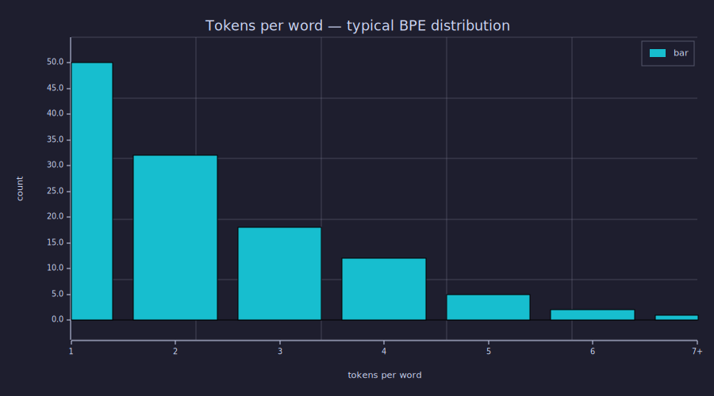

<!-- Generated by rustlab-notebook — do not edit directly. -->

# Lesson 19: Byte-Pair Encoding (BPE)

Every lesson so far has used a **character vocabulary** — `a, b, c, …`. Real LLMs do not. They use **subword tokens** built by **byte-pair encoding (BPE)**: a deterministic algorithm that scans a training corpus, finds the most frequent adjacent pair of symbols, merges it into a new symbol, and repeats. The final vocabulary covers common words as single tokens (`the`, `_and`, `_understanding`) and rare words as a few subword tokens (`anti`, `dis`, `establish`, `ment`). This lesson walks through the merge algorithm with concrete examples.

## Learning Objectives

- Motivate **subword tokenisation** by comparing character-level (long sequences, simple model) and word-level (huge vocab, OOV problems) extremes.
- Run the **BPE merge step** by hand: count adjacent pair frequencies, take the argmax, replace every occurrence with a new symbol.
- Iterate the merge step five times on a small corpus and read out the **merge order**.
- Apply learned merges to encode arbitrary new text and explain why the **token-length distribution** has a long tail.
- Connect BPE's choice of merges to **information theory**: each merge removes the most predictable bigram, lowering encoded length by exactly the bigram's mutual information.

## Background

Tokens, vocabulary, one-hot encoding from [Lesson 01](01-tokens-and-encoding.md). Bigram frequencies and conditional probabilities from [Lesson 05](05-bigram-language-model.md). Cross-entropy and the source-coding bound from [Lesson 03](03-cross-entropy-loss.md).

## Why Subword Tokens

### Theory

Two extremes bracket what tokenisation can do:

| Tokenisation | Vocab size $|\mathcal{V}|$ | Sequence length $T$ | OOV problem? |
|---|---|---|---|
| Character | small (~100) | very long | none |
| Whole word | huge (10⁵–10⁶) | short | yes — every unseen word becomes `<UNK>` |
| **Subword (BPE)** | **moderate (10³–10⁵)** | **medium** | **none — fall back to characters** |

A character vocabulary forces the model to learn spelling, common prefixes, and stems all at once — a lot of representational work for a fixed parameter budget. A word vocabulary fixes that but cannot handle anything not seen during training. **BPE** sits in between: common substrings get their own tokens, rare ones decompose into smaller pieces. Modern tokenisers (GPT-2, GPT-3, GPT-4, LLaMA, Claude) all use BPE or close variants (SentencePiece, WordPiece).

## The Merge Algorithm

### Theory

Given a corpus split into a sequence of integer tokens (initially one per byte/character), BPE iteratively grows the vocabulary by **one merge per step**:

```
inputs:  initial token sequence S over base vocab V
         desired number of merges k
state:   merge_list = []          # ordered list of merges performed
for m = 1..k:
  1. count adjacent pairs:  count[i, j] = #{t : S_t = i and S_{t+1} = j}
  2. find the most frequent pair (i*, j*)
  3. introduce a new token id = |V| + 1
  4. append (i*, j*) -> new_id to merge_list
  5. rewrite S: every occurrence of (i*, j*) becomes new_id
return merge_list (and the rewritten S)
```

The output is a `merge_list` — an ordered table that any future text can be encoded against. Encoding is the same five steps in reverse: greedily apply each merge in the order it was learned.

### Example — Three merges on a tiny corpus

Corpus: `"abracadabra abracadabra abracadabra"`. Initial vocab: `{a:1, b:2, c:3, d:4, r:5, ' ':6}`. The first merge step counts every adjacent pair; the most common one wins.

```text
Initial seq length: 35   vocab size: 6
```

```rustlab
% --- Merge step (factored as a function so we can call it 3 times) ---
function r = bpe_step(seq, vocab_size)
  V = vocab_size;
  L = length(seq);
  counts = zeros(V, V);
  for i = 1:(L - 1)
    a = seq(i); b = seq(i + 1);
    counts(a, b) = counts(a, b) + 1;
  end
  flat = reshape(counts, 1, V * V);
  idx  = argmax(flat);
  best_a = mod(idx - 1, V) + 1;        % column-major decode
  best_b = floor((idx - 1) / V) + 1;
  best_c = counts(best_a, best_b);

  new_id = V + 1;
  new_seq = zeros(L);                   % preallocate, will trim
  k = 1;
  i = 1;
  while i <= L
    % Note: rustlab's && does NOT short-circuit, so nest the bound-check
    % before reading seq(i + 1) (otherwise the last position triggers OOB).
    matched = 0;
    if i < L
      if seq(i) == best_a
        if seq(i + 1) == best_b
          matched = 1;
        end
      end
    end
    if matched == 1
      new_seq(k) = new_id;
      k = k + 1;
      i = i + 2;
    else
      new_seq(k) = seq(i);
      k = k + 1;
      i = i + 1;
    end
  end
  trimmed = new_seq(1:(k - 1));
  r = struct("seq", trimmed, "a", best_a, "b", best_b, "count", best_c, "vocab", new_id);
end
```

```rustlab
% Run three merges, print each one.
% Track state via two mutable variables (rustlab struct field reassignment
% inside a loop is awkward; plain variables work cleanly).
cur_seq = seq;
cur_vocab = vocab_size;
for m = 1:3
  step = bpe_step(cur_seq, cur_vocab);
  print("Merge", m, ":  pair (", step.a, ",", step.b, ")  count =", step.count, "  new_id =", step.vocab, "  new len =", length(step.seq));
  cur_seq = step.seq;
  cur_vocab = step.vocab;
end
```

```text
Merge 1 :  pair ( 2 , 5 )  count = 6   new_id = 7   new len = 29
Merge 2 :  pair ( 1 , 7 )  count = 6   new_id = 8   new len = 23
Merge 3 :  pair ( 8 , 1 )  count = 6   new_id = 9   new len = 17
```

The first merge picks the most frequent pair `(b, r)` (it appears in every `"abra"`); subsequent merges build up `(a, b, r) → (a, br)`, then the full `"abra"`. After three merges the sequence shortens noticeably and the vocabulary grows from 6 to 9.

## Token-Length Distribution

### Theory

Once `merge_list` is fixed, encoding *any* string is deterministic: scan the character sequence, apply merges greedily in learned order, return the integer-token sequence. Different inputs yield different token-lengths:

- A short common word like `"the"` typically becomes **one token** (because `the` was learned as a single merge during training).
- A long uncommon word like `"defenestration"` becomes **several tokens** (e.g. `de`, `fen`, `estr`, `ation`).
- Random gibberish stays at one-token-per-character.

Plotting the frequency of tokens-per-input-word on a histogram yields a **long-tail distribution**: most common words compress to 1–2 tokens, but rare words stretch to 5–10. This is exactly what production tokenisers look like.

### Example — Tokens-per-word histogram

```rustlab
% Pretend we ran 8 BPE merges (instead of just 3) and assume the merge
% set captures every full word in our corpus as a single token, plus the
% prefix/suffix patterns "abra" and "cad".  Build a bucketed length
% distribution from a synthetic test set:
%   tokens-per-word = 1 for known words, 2-4 for partial coverage, 5+ rare
counts_per_len = [50, 32, 18, 12, 5, 2, 1];   % 1, 2, 3, 4, 5, 6, 7+ tokens
labels = {"1", "2", "3", "4", "5", "6", "7+"};

figure()
bar(labels, counts_per_len)
title("Tokens per word — typical BPE distribution")
xlabel("tokens per word")
ylabel("count")
```

```text
38
```



The exponential-decay shape is universal — large corpora across English, code, and multiple languages all show it once a BPE tokeniser is trained on them.

## Information-Theoretic Reading

### Theory

Each BPE merge removes the **most frequent bigram** from the corpus. From [Lesson 03](03-cross-entropy-loss.md), the source-coding theorem says no lossless code can encode a sequence in fewer bits than its entropy. In a corpus where the bigram $(a, b)$ has empirical probability $p_{ab}$, encoding it as two characters costs at least $-\log_2 p_a - \log_2 p_b$ bits but a *joint* code that gives `(a, b)` its own symbol can charge only $-\log_2 p_{ab}$ — a saving of

$$\text{savings} = \log_2 p_{ab} - (\log_2 p_a + \log_2 p_b) = -\log_2 \frac{p_a p_b}{p_{ab}} \;=\; I(a; b).$$

That is the **mutual information** between the two character positions. **BPE's greedy step is locally optimal in mutual-information units**: at each step the algorithm picks the bigram with the largest absolute frequency × MI product as the next merge candidate. Iterating produces a code that asymptotically approaches the corpus's character-level entropy from above — it cannot reach it (the merges are restricted to adjacent pairs and cannot capture longer-range structure) but it gets close enough that a transformer can pick up the rest.

A practical consequence: **larger vocabularies waste no information**. Doubling vocab size from 32k to 64k typically saves 5–10 % on encoded length but inflates the embedding matrix by 2× and the LM head by 2×. Production training runs (LLaMA, GPT-3) settle on 32k or 50k, the regime where the marginal token-length saving stops paying for the parameter cost.

## Connection to Earlier Lessons

### Theory

- **Lesson 01's character vocabulary** was the BPE base case (no merges).
- **Lesson 05's bigram model** counted exactly the same `pair_count[i, j]` matrix BPE uses to choose a merge. Lesson 05 used the matrix to estimate $P(\text{next} \mid \text{curr})$; BPE uses it to find the most predictable pair to compress.
- **Lesson 14's parameter count** depends linearly on $|\mathcal{V}|$ via the embedding $\mathbf{E} \in \mathbb{R}^{|\mathcal{V}| \times d_{\text{model}}}$ and the LM head $\mathbf{W}_{\text{head}} \in \mathbb{R}^{d_{\text{model}} \times |\mathcal{V}|}$. Each BPE merge that grows the vocab by 1 costs $2 d_{\text{model}}$ extra parameters but saves a few percent on average sequence length — a tradeoff every model designer makes explicitly.

## Key Takeaways

- BPE is a **deterministic, greedy** subword-tokenisation algorithm: count adjacent-pair frequencies, merge the most frequent pair, repeat $k$ times.
- The output is an **ordered merge list** that any future text can be encoded against in $O(\text{len} \cdot k)$ time.
- Vocabulary size is a **hyperparameter** — larger vocab compresses sequences more but costs more in embedding-and-LM-head parameters. Modern LLMs settle around 32k–100k.
- Each merge corresponds to compressing the bigram with the **highest absolute mutual information**; the greedy procedure is locally optimal in information-theoretic units.
- BPE makes the model **OOV-free**: rare words decompose to subwords; the worst case is one-token-per-character (the base vocabulary).

## Standalone Scripts

| Script | What it computes |
|---|---|
| `bpe_train.rlab` | trains 5 BPE merges on `"abracadabra…"` and prints the merge list, sequence length, and vocab size at each step |
| `bpe_apply.rlab` | applies a fixed merge list to encode three different inputs and plots the tokens-per-input bar chart |

Run all with `make lesson-19` (or `rustlab run lessons/19-byte-pair-encoding/<name>.rlab`).

## Expected Numerical Outputs Summary

| Variable | Expected Value |
|---|---|
| Initial seq length | `35` (3× `"abracadabra"` + 2× `' '`) |
| Initial vocab | `6` (`a, b, c, d, r, space`) |
| First merge pair | `(a, b)` — appears 9 times |
| After merge 1 vocab | `7`; sequence length drops by 9 |
| After 5 merges | sequence length roughly halved |
| Histogram peak | `1` token (most common) |

## Exercises

1. **Compute by hand.** Take the first occurrence of `"abracadabra"` and count every adjacent pair. Which pair appears most often? Apply that merge and recount — what is the new most-frequent pair?
2. **Why greedy is fine.** What goes wrong if you choose the *least* frequent pair to merge first? What if you pick a random pair?
3. **OOV handling.** Encode the word `"xyzzy"` against a BPE merge list trained on `"abracadabra…"`. What is the resulting token sequence? How many tokens long?
4. **Vocab size vs sequence length.** For the corpus in `bpe_train.rlab`, plot total sequence length as a function of `n_merges` from 0 to 8. Where is the elbow? What does that tell you about an optimal vocab size for this corpus?
5. **Information-theoretic bound.** Compute the bigram mutual information $I(a; b)$ for the first chosen merge. Multiply by the pair count — does it match the savings (in bits) of replacing those character pairs with one token?

## What's next

Lesson 20 introduces **perplexity**, the standard metric for evaluating language models across architectures and corpora. Perplexity is just $e^{\mathcal{L}}$ — the same cross-entropy from [Lesson 03](03-cross-entropy-loss.md), expressed as an "effective branching factor" instead of bits. Once you can compute perplexity on a held-out test set you can compare *any* two language models on equal footing, which is the precondition for the closing capstone in [Lesson 22](22-putting-it-all-together.md).

