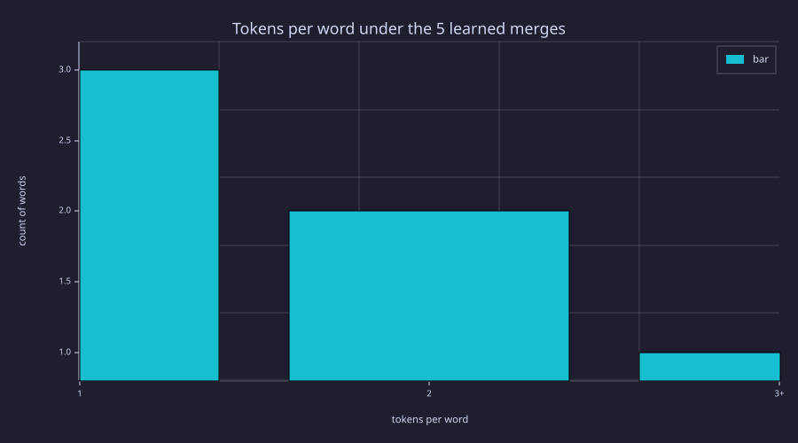

<!-- Generated by rustlab-notebook — do not edit directly. -->

# Lesson 19: Byte-Pair Encoding (BPE)

Every lesson so far has used a **character vocabulary** — `a, b, c, …`. Real LLMs do not. They use **subword tokens** built by **byte-pair encoding (BPE)**: a deterministic algorithm that scans a training corpus, finds the most frequent adjacent pair of symbols, merges it into a new symbol, and repeats. The final vocabulary covers common words as single tokens (`the`, `_and`, `_understanding`) and rare words as a few subword tokens (`anti`, `dis`, `establish`, `ment`). This lesson walks through the merge algorithm with concrete examples.

## Learning Objectives

- Motivate **subword tokenisation** by comparing character-level (long sequences, simple model) and word-level (huge vocab, OOV problems) extremes.
- Run the **BPE merge step** by hand: count adjacent pair frequencies, take the argmax, replace every occurrence with a new symbol.
- Iterate the merge step five times on a small corpus and read out the **merge order**.
- Apply learned merges to encode arbitrary new text and explain why the **token-length distribution** has a long tail.
- Connect BPE's choice of merges to **information theory**: BPE merges the most *frequent* adjacent pair ($\arg\max$ over raw count), and the bits saved by giving that pair its own token are approximately its count times its pointwise mutual information.

## Background

Tokens, vocabulary, one-hot encoding from [Lesson 01](01-tokens-and-encoding.md). Bigram frequencies and conditional probabilities from [Lesson 05](05-bigram-language-model.md). Cross-entropy and the source-coding bound from [Lesson 03](03-cross-entropy-loss.md).

## Why Subword Tokens

### Theory

Two extremes bracket what tokenisation can do:

| Tokenisation | Vocab size $\lvert\mathcal{V}\rvert$ | Sequence length $T$ | OOV problem? |
|---|---|---|---|
| Character | small (~100) | very long | none |
| Whole word | huge (10⁵–10⁶) | short | yes — every unseen word becomes `<UNK>` |
| **Subword (BPE)** | **moderate (10³–10⁵)** | **medium** | **none — fall back to characters** |

A character vocabulary forces the model to learn spelling, common prefixes, and stems all at once — a lot of representational work for a fixed parameter budget. A word vocabulary fixes that but cannot handle anything not seen during training. **BPE** sits in between: common substrings get their own tokens, rare ones decompose into smaller pieces. Modern tokenisers (GPT-2, GPT-3, GPT-4, LLaMA, Claude) all use BPE or close variants (SentencePiece, WordPiece).

## The Merge Algorithm

### Theory

Given a corpus split into a sequence of integer tokens (initially one per byte/character), BPE iteratively grows the vocabulary by **one merge per step**:

```
inputs:  initial token sequence S over base vocab V
         desired number of merges k
state:   merge_list = []          # ordered list of merges performed
for m = 1..k:
  1. count adjacent pairs:  count[i, j] = #{t : S_t = i and S_{t+1} = j}
  2. find the most frequent pair (i*, j*)
  3. introduce a new token id = |V| + 1
  4. append (i*, j*) -> new_id to merge_list
  5. rewrite S: every occurrence of (i*, j*) becomes new_id
return merge_list (and the rewritten S)
```

The output is a `merge_list` — an ordered table that any future text can be encoded against. Encoding applies each merge greedily in the order it was learned.

### Example — Three merges on a tiny corpus

Corpus: `"abracadabra abracadabra abracadabra"`. Initial vocab: `{a:1, b:2, c:3, d:4, r:5, ' ':6}`. The first merge step counts every adjacent pair; the most common one wins.

<!-- rustlab:output-start -->
```text
Initial seq length: 35   vocab size: 6
```

<!-- rustlab:output-end -->

```rustlab
% --- Merge step (factored as a function so we can call it 3 times) ---
function r = bpe_step(seq, vocab_size)
  V = vocab_size;
  L = length(seq);
  counts = zeros(V, V);
  for i = 1:(L - 1)
    a = seq(i); b = seq(i + 1);
    counts(a, b) = counts(a, b) + 1;
  end
  flat = reshape(counts, 1, V * V);
  idx  = argmax(flat);
  best_a = mod(idx - 1, V) + 1;        % column-major decode
  best_b = floor((idx - 1) / V) + 1;
  best_c = counts(best_a, best_b);

  new_id = V + 1;
  new_seq = zeros(L);                   % preallocate, will trim
  k = 1;
  i = 1;
  while i <= L
    if i < L && seq(i) == best_a && seq(i + 1) == best_b
      new_seq(k) = new_id;
      k = k + 1;
      i = i + 2;
    else
      new_seq(k) = seq(i);
      k = k + 1;
      i = i + 1;
    end
  end
  trimmed = new_seq(1:(k - 1));
  r = struct("seq", trimmed, "a", best_a, "b", best_b, "count", best_c, "vocab", new_id);
end
```

```rustlab
% Run three merges, print each one, threading the sequence and vocab size
% through two variables.  (bpe_train.rlab threads the same state as struct
% fields reassigned in the loop instead — either style works fine.)
cur_seq = seq;
cur_vocab = vocab_size;
for m = 1:3
  step = bpe_step(cur_seq, cur_vocab);
  print("Merge", m, ":  pair (", step.a, ",", step.b, ")  count =", step.count, "  new_id =", step.vocab, "  new len =", length(step.seq));
  cur_seq = step.seq;
  cur_vocab = step.vocab;
end
```

<!-- rustlab:output-start -->
```text
Merge 1 :  pair ( 5 , 1 )  count = 6   new_id = 7   new len = 29
Merge 2 :  pair ( 1 , 2 )  count = 6   new_id = 8   new len = 23
Merge 3 :  pair ( 8 , 7 )  count = 6   new_id = 9   new len = 17
```

<!-- rustlab:output-end -->

The first merge is actually a **three-way tie**: `(a, b)`, `(b, r)`, and `(r, a)` each occur 6 times (twice per `"abracadabra"`, three reps). `argmax` breaks the tie deterministically — scanning the flattened count matrix in column-major order it returns the *first* maximum, which here is `(r, a)` (id 7). Real BPE implementations fix a tie-break too (usually lexicographic) so the merge order is reproducible. The next two merges fuse `(a, b) → ab` (id 8) and then `(ab, ra) → abra` (id 9), building the full `"abra"`. After three merges the sequence shortens from 35 to 17 tokens and the vocabulary grows from 6 to 9.

## Token-Length Distribution

### Theory

Once `merge_list` is fixed, encoding *any* string is deterministic: scan the character sequence, apply merges greedily in learned order, return the integer-token sequence. Different inputs yield different token-lengths:

- A short common word like `"the"` typically becomes **one token** (because `the` was learned as a single merge during training).
- A long uncommon word like `"defenestration"` becomes **several tokens** (e.g. `de`, `fen`, `estr`, `ation`).
- Random gibberish stays at one-token-per-character.

Plotting the frequency of tokens-per-input-word on a histogram yields a **long-tail distribution**: most common words compress to 1–2 tokens, but rare words stretch to 5–10. This is exactly what production tokenisers look like.

### Example — Tokens-per-word from the real merges

Apply the five merges the trainer actually learned — `(r,a)→7`, `(a,b)→8`, `(ab,ra)→9`, `(c,a)→10`, `(ca,d)→11` — to a handful of word fragments over the base alphabet, and count how many tokens each compresses to.

```rustlab
% The five merges bpe_train.rlab learns, in order (see the standalone script).
ma  = [5, 1, 8, 3, 10];
mb  = [1, 2, 7, 1, 4];
mid = [7, 8, 9, 10, 11];

function out = apply_merge(seq, a, b, new_id)
  L = length(seq);
  buf = zeros(L);
  k = 1; i = 1;
  while i <= L
    if i < L && seq(i) == a && seq(i + 1) == b
      buf(k) = new_id; k = k + 1; i = i + 2;
    else
      buf(k) = seq(i); k = k + 1; i = i + 1;
    end
  end
  out = buf(1:(k - 1));
end
function out = encode(seq, ma, mb, mid)
  out = seq;
  for m = 1:length(ma)
    out = apply_merge(out, ma(m), mb(m), mid(m));
  end
end

% Word fragments (char ids: a=1 b=2 c=3 d=4 r=5).
w_abracadabra = encode([1, 2, 5, 1, 3, 1, 4, 1, 2, 5, 1], ma, mb, mid);
w_abra        = encode([1, 2, 5, 1], ma, mb, mid);
w_cad         = encode([3, 1, 4], ma, mb, mid);
w_bra         = encode([2, 5, 1], ma, mb, mid);
w_ac          = encode([1, 3], ma, mb, mid);
w_d           = encode([4], ma, mb, mid);

lens = [length(w_abracadabra), length(w_abra), length(w_cad), ...
        length(w_bra), length(w_ac), length(w_d)];
print("tokens per word:", lens);

% Bucket the real per-word token counts into 1 / 2 / 3+.
counts_per_len = [sum(lens == 1), sum(lens == 2), sum(lens >= 3)];
labels = {"1", "2", "3+"};
print("bucketed 1 / 2 / 3+:", counts_per_len);

figure();
bar(labels, counts_per_len)
title("Tokens per word under the 5 learned merges")
xlabel("tokens per word")
ylabel("count of words")
```

<!-- rustlab:output-start -->
```text
tokens per word: [1×6]  3.000000  1.000000  1.000000  2.000000  2.000000  1.000000
bucketed 1 / 2 / 3+: [1×3]  3.000000  2.000000  1.000000
```



<!-- rustlab:output-end -->

Even on this six-word sample the shape is right: the fully-covered fragments (`abra`, `cad`, `d`) collapse to a single token, partially-covered ones (`bra`, `ac`) take two, and the long `abracadabra` needs three (`abra`·`cad`·`abra`). On a real corpus of tens of thousands of words the same bias produces a genuinely **long-tailed** distribution — most words at 1–2 tokens, a thin tail stretching to 5–10 for rare or morphologically complex words.

## Information-Theoretic Reading

### Theory

Each BPE merge removes the **most frequent adjacent pair** from the corpus. From [Lesson 03](03-cross-entropy-loss.md), the source-coding theorem says no lossless code can encode a sequence in fewer bits than its entropy. In a corpus where the specific bigram $(a, b)$ has empirical probability $p_{ab}$, encoding its two symbols independently costs $-\log_2 p_a - \log_2 p_b$ bits, while a *joint* code that gives `(a, b)` its own symbol charges only $-\log_2 p_{ab}$ — a per-occurrence saving of

$$\text{PMI}(a; b) \;=\; \log_2 \frac{p_{ab}}{p_a\, p_b} \;=\; \bigl(-\log_2 p_a - \log_2 p_b\bigr) - \bigl(-\log_2 p_{ab}\bigr).$$

This is the **pointwise mutual information** of that *particular* pair — not the mutual information $I(A; B)$ between the two positions, which is the *average* of the PMI over all pairs. **BPE does not maximise this saving.** Its merge rule — including this lesson's `bpe_step` — is simply $\arg\max$ over the *raw pair count*; it never computes PMI. The two objectives are only loosely coupled: the total bits a merge saves is approximately $\text{count} \times \text{PMI}$, so a very frequent pair usually saves a lot even when its PMI is modest — but the approximation is loose, because every merge shifts the unigram statistics that the next merge's PMI depends on. Iterating the frequency-greedy rule still produces a code that approaches the corpus's character-level entropy from above — it cannot reach it (the merges are restricted to adjacent pairs and cannot capture longer-range structure) but it gets close enough that a transformer can pick up the rest.

A practical consequence: **the compression returns diminish while the parameter cost keeps growing**. Doubling vocab size from 32k to 64k typically saves only 5–10 % on encoded length but inflates both the embedding matrix and the LM head by 2×. Production training runs (LLaMA, GPT-3) settle on 32k or 50k, the regime where the marginal token-length saving stops paying for the added embedding-and-head parameters.

## Connection to Earlier Lessons

### Theory

- **Lesson 01's character vocabulary** was the BPE base case (no merges).
- **Lesson 05's bigram model** counted exactly the same `pair_count[i, j]` matrix BPE uses to choose a merge. Lesson 05 used the matrix to estimate $P(\text{next} \mid \text{curr})$; BPE uses it to find the most predictable pair to compress.
- **Lesson 14's parameter count** depends linearly on $|\mathcal{V}|$ via the embedding $\mathbf{E} \in \mathbb{R}^{|\mathcal{V}| \times d_{\text{model}}}$ and the LM head $\mathbf{W}_{\text{head}} \in \mathbb{R}^{d_{\text{model}} \times |\mathcal{V}|}$. Each BPE merge that grows the vocab by 1 costs $2 d_{\text{model}}$ extra parameters but saves a few percent on average sequence length — a tradeoff every model designer makes explicitly.

## Key Takeaways

- BPE is a **deterministic, greedy** subword-tokenisation algorithm: count adjacent-pair frequencies, merge the most frequent pair, repeat $k$ times.
- The output is an **ordered merge list** that any future text can be encoded against in $O(\text{len} \cdot k)$ time.
- Vocabulary size is a **hyperparameter** — larger vocab compresses sequences more but costs more in embedding-and-LM-head parameters. Modern LLMs settle around 32k–100k.
- Each merge compresses the **most frequent adjacent pair** (raw count, not MI); the bits it saves are roughly count × pointwise MI, so the frequency-greedy rule is only *approximately* information-optimal.
- BPE makes the model **OOV-free**: rare words decompose to subwords; the worst case is one-token-per-character (the base vocabulary).

## Standalone Scripts

| Script | What it computes |
|---|---|
| `bpe_train.rlab` | trains 5 BPE merges on `"abracadabra…"` and prints the merge list, sequence length, and vocab size at each step |
| `bpe_apply.rlab` | applies a fixed merge list to encode three different inputs and plots the tokens-per-input bar chart |

Run all with `make lesson-19` (or `rustlab run lessons/19-byte-pair-encoding/<name>.rlab`).

## Expected Numerical Outputs Summary

| Variable | Expected Value |
|---|---|
| Initial seq length | `35` (3× `"abracadabra"` + 2× `' '`) |
| Initial vocab | `6` (`a, b, c, d, r, space`) |
| First merge pair | `(r, a)` — appears 6 times (a 3-way tie with `(a,b)`, `(b,r)`; won on tie-break) |
| After merge 1 vocab | `7`; sequence length drops by 6 (35 → 29) |
| After 5 merges | sequence length `35 → 11` tokens (≈3.2× shorter; the first 3 merges alone already halve it to 17) |
| Histogram peak | `1` token (most common) |

## Exercises

1. **Compute by hand.** Take the first occurrence of `"abracadabra"` and count every adjacent pair. You will find a **three-way tie** — `ab`, `br`, and `ra` each appear twice. Our `bpe_step` breaks the tie by column-major `argmax` (it picks `(r, a)`); choose any of the three winners, apply that merge, then recount. Which pair leads now? Does the final vocabulary depend on which tie-winner you started with?
2. **Why greedy is fine.** What goes wrong if you choose the *least* frequent pair to merge first? What if you pick a random pair?
3. **OOV handling.** Encode the word `"xyzzy"` against a BPE merge list trained on `"abracadabra…"`. What is the resulting token sequence? How many tokens long?
4. **Vocab size vs sequence length.** For the corpus in `bpe_train.rlab`, plot total sequence length as a function of `n_merges` from 0 to 8. Where is the elbow? What does that tell you about an optimal vocab size for this corpus?
5. **Information-theoretic saving.** Compute the *pointwise* mutual information $\text{PMI}(r; a) = \log_2 \tfrac{p_{ra}}{p_r\,p_a}$ for the first chosen merge from the corpus's unigram and bigram counts. Multiply by the pair count (6). How close is that to the actual bits saved by the merge? Why is it only approximate (hint: what happens to $p_a$ and $p_r$ after the merge rewrites the sequence)?

## What's next

Lesson 20 introduces **perplexity**, the standard metric for evaluating language models across architectures and corpora. Perplexity is just $e^{\mathcal{L}}$ — the same cross-entropy from [Lesson 03](03-cross-entropy-loss.md), expressed as an "effective branching factor" instead of bits. Once you can compute perplexity on a held-out test set you can compare *any* two language models on equal footing, which is the precondition for the closing capstone in [Lesson 22](22-putting-it-all-together.md).
