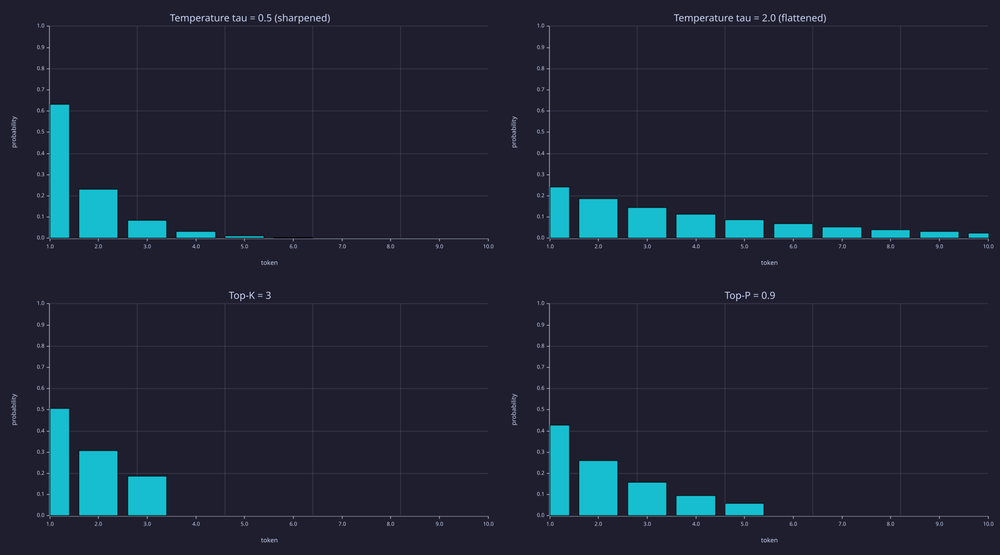
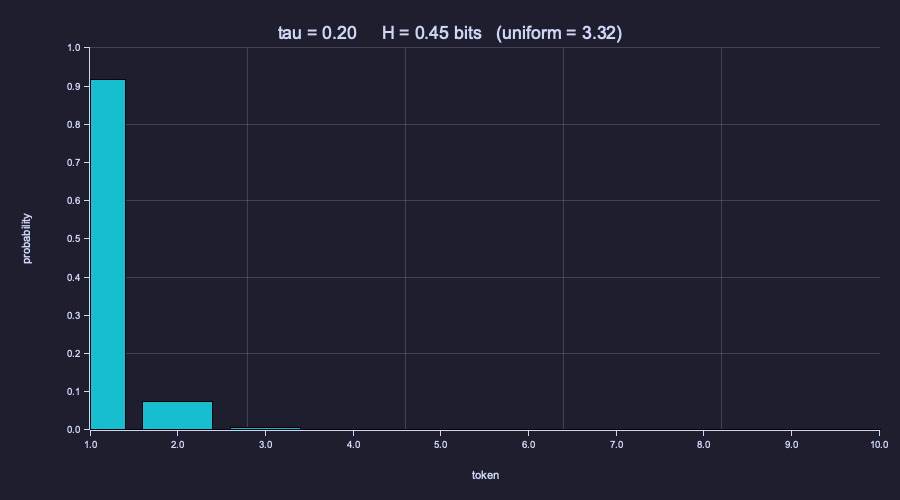
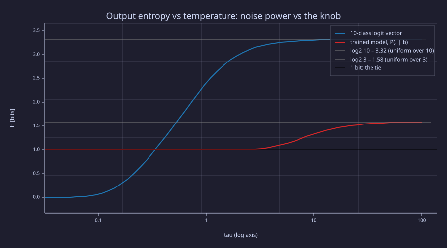
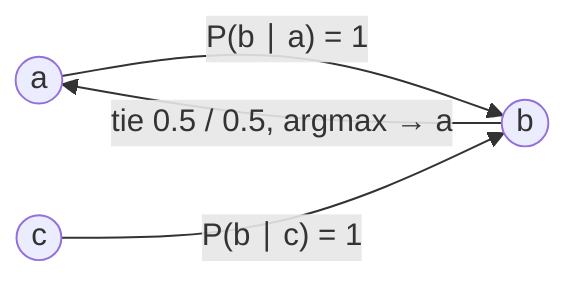
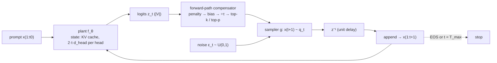

<!-- Generated by rustlab-notebook — do not edit directly. -->

# Lesson 21: Sampling and Generation

Phases 1–7 built a transformer and trained it. Now we use it. A trained language model is a function that produces a next-token distribution; turning that distribution into a *sequence* requires two choices — **how to sample** from it and **how to do that efficiently across many steps**. Both choices are decisions about a feedback loop: the model's own output is fed back as its next input, so generation is a discrete-time closed loop with a unit delay, the decoding controls are a compensator in its forward path, and the KV cache is its state. This lesson builds the loop, the controls, and the state, and reads each one under the three lenses.

## Learning Objectives

- Implement the **autoregressive generation loop**, write it as a closed loop $x_{t+1} = g(f_\theta(x_{1:t}), \varepsilon_t)$, and recognise where it stops.
- Compare four decoding strategies — **greedy**, **temperature** $\tau$, **top-K**, **top-P (nucleus)** — plus **beam search**, and explain the diversity/quality tradeoff between them.
- Apply **logit-level controls** (repetition penalty, banned tokens, bias, stop conditions) and understand where they compose with the sampling step.
- Derive the **KV cache**, verify live that it produces identical outputs to naive generation, and quantify the $O(T^3) \to O(T^2)$ FLOP saving.
- Run a small trained model under every strategy, compute the entropy of its output distribution under each control, and explain why greedy decoding of a bigram *must* cycle.

## Background

- Softmax and temperature scaling from [02-probability-and-softmax](02-probability-and-softmax.md) — $\tau$ is the temperature throughout; $T$ is the sequence length.
- Bigram CDF sampling and the stationary distribution from [05-bigram-language-model](05-bigram-language-model.md).
- Causal masked attention from [08-scaled-dot-product-attention](08-scaled-dot-product-attention.md) and [09-multi-head-attention](09-multi-head-attention.md).
- The trained 24-parameter LM from [18-training-loop](18-training-loop.md); the end-of-sequence token `EOS` from the special tokens of [19-byte-pair-encoding](19-byte-pair-encoding.md).

## The Autoregressive Generation Loop

### Theory

A language model is a function $f_\theta$ that maps an input sequence $x_1, \dots, x_t$ to a distribution over the next token: $p_t = f_\theta(x_{1:t}) \in \Delta^{|\mathcal{V}|}$. **Generation** is the procedure of using $f_\theta$ to extend a starting prompt one token at a time:

$$\text{repeat:}\quad p_t = f_\theta(x_{1:t}),\quad x_{t+1} \sim p_t,\quad t \leftarrow t + 1\quad\text{until stop.}$$

Written as a system, the loop is $x_{t+1} = g\bigl(f_\theta(x_{1:t}),\, \varepsilon_t\bigr)$: a deterministic map $f_\theta$ from the whole history to a distribution, a sampler $g$ driven by an independent noise source $\varepsilon_t \sim U(0,1)$ (the inverse-CDF draw of Lesson 05), and a unit delay that appends the output to the history. Three pieces deserve explicit attention:

1. **The draw.** $x_{t+1} \sim p_t$ is a single Categorical draw. The interesting design space is in transforming $p_t$ first (next section).
2. **The append.** The new token becomes part of the input for the next step. This is what makes generation **autoregressive** — the model conditions on its own past outputs. It is the feedback path.
3. **The stop.** The loop must terminate. Common conditions: (a) emit the designated end-of-sequence token `EOS` ([19-byte-pair-encoding](19-byte-pair-encoding.md)), (b) hit a hard length cap, (c) an external scorer signals enough. Without a stop condition the loop runs forever.

For a transformer the per-step cost is dominated by the forward pass. We return to this in [The KV Cache](#the-kv-cache) — the per-step recomputation can be reduced dramatically — and draw the whole loop as a block diagram in the Systems lens.

### Example — Greedy decoding from the Lesson 18 model

The bigram-style model from [18-training-loop](18-training-loop.md) has $|\mathcal{V}| = 3$ tokens and learns $P(b\mid a) = P(b\mid c) = 1$, $P(a\mid b) = P(c\mid b) = 0.5$ on the period-4 corpus `"abcb abcb abcb…"`. We retrain it (the Lesson 18 training loop is packaged in `lib/bigram_lm.rlab`) and run greedy decoding:

```rustlab
% --- Retrain the Lesson 18 model (24 params, 600 steps) ---
seed(18);
vocab = 3;
d_emb = 4;

pat = [1, 2, 3, 2];
corpus = zeros(60);
for i = 1:60
  corpus(i) = pat(mod(i - 1, 4) + 1);
end
% AdamW + warmup-cosine on the first 50 tokens (49 pairs): the same loop as
% Lesson 18, shared via lib/bigram_lm.rlab.  seed(18) above fixes the init.
[E, W] = train_bigram_lm(corpus(1:50), vocab, d_emb, 600, 0.15, 0.015, 60);
print("P(. | a) =", softmax(E(1, :) * W));
print("P(. | b) =", softmax(E(2, :) * W));
print("P(. | c) =", softmax(E(3, :) * W));
```

<!-- rustlab:output-start -->
```text
P(. | a) = [1×3]  0.000000  1.000000  0.000000
P(. | b) = [1×3]  0.500000  0.000000  0.500000
P(. | c) = [1×3]  0.000000  1.000000  0.000000
```

<!-- rustlab:output-end -->

After training, the bigram structure is exact: `P(b|a) ≈ P(b|c) ≈ 1` and `P(a|b) ≈ P(c|b) ≈ 0.5`. Now generate 12 tokens with greedy:

```rustlab
function seq = greedy_generate(x0, n_new, E, W)
  seq = zeros(n_new + 1);
  seq(1) = x0;
  for t = 1:n_new
    p = softmax(E(seq(t), :) * W);
    seq(t + 1) = argmax(p);
  end
end

names = {"a", "b", "c"};
function s = seq_to_str(seq, names)
  s = "";
  for i = 1:length(seq)
    s = s + names(seq(i));
  end
end

print("greedy from 'a':", seq_to_str(greedy_generate(1, 12, E, W), names));
print("greedy from 'b':", seq_to_str(greedy_generate(2, 12, E, W), names));
```

<!-- rustlab:output-start -->
```text
greedy from 'a': ababababababa
greedy from 'b': babababababab
```

<!-- rustlab:output-end -->

Greedy from `a` produces `ababababababa` — the model is correct that `b` follows `a` with probability 1, but **after `b` it has to pick between two equally-likely options and greedy always picks the same one** (`argmax` breaks the tie toward the first index, `a`). The true corpus is `abcb abcb`, but greedy collapses to `abab…`. This is usually described as the failure mode of greedy decoding — it cannot recover any structure that requires visiting more than one mode of the distribution. The Systems lens below sharpens that: for a model whose state is one token, it is not a failure mode but a theorem.

> [!IMPORTANT]
> Greedy is deterministic given the prompt — useful for reproducibility and tasks with a single correct answer (translation, factual QA), but a poor fit for open-ended generation, where it produces repetitive, low-diversity text.

## Sampling Strategies

### Theory

All four strategies are deterministic *transformations* of the model's distribution $p$, followed by one Categorical draw. The differences are in **how much of the tail they keep**.

**Greedy** ($x_{t+1} = \arg\max_i p_i$) keeps a single point mass on the most likely token:

$$q^{\text{greedy}}_i = \begin{cases} 1 & i = \arg\max_j p_j \\ 0 & \text{otherwise} \end{cases}$$

**Temperature** rescales the logits by $1/\tau$ before softmax:

$$q^{\tau}_i = \frac{\exp(z_i / \tau)}{\sum_j \exp(z_j / \tau)}.$$

- $\tau \to 0^+$: distribution collapses to a delta at the argmax (greedy).
- $\tau = 1$: the model's native distribution.
- $\tau \to \infty$: distribution becomes uniform.

Temperature is the simplest knob and is **always defined** — it works on the full vocabulary with no thresholding decisions. It acts on *differences* between logits: two tokens with equal logits stay equal at every $\tau$.

**Top-K** keeps only the $K$ most likely tokens and renormalises:

$$q^{K}_i = \begin{cases} p_i / Z_K & i \in \mathrm{top}_K(p) \\ 0 & \text{otherwise} \end{cases},\quad Z_K = \sum_{j \in \mathrm{top}_K(p)} p_j.$$

It bounds the worst case ("never emit anything below the top K"), but $K$ is a fixed number — when the model is **confident** (top-1 has 99% mass) top-K with $K=50$ still allows 49 nearly-zero-probability tokens; when the model is **diffuse** (uniform-ish), top-K can truncate genuine candidates.

**Top-P (nucleus)** keeps the smallest set of tokens whose cumulative probability reaches $P$, then renormalises. Concretely:

1. Sort $p$ descending: $p_{(1)} \geq p_{(2)} \geq \dots$
2. Find the smallest $n$ such that $\sum_{j=1}^n p_{(j)} \geq P$.
3. Keep tokens $(1), \dots, (n)$; renormalise.

The truncation set shrinks when the model is confident and grows when it is uncertain — **the threshold is a probability mass, not a count.** Empirically this is the most-used strategy in modern open-ended generation.

**Beam search** is the deterministic alternative to greedy for tasks with one right answer. Instead of a single prefix it keeps the $B$ highest-scoring prefixes (the *beam*), extends each by every token, and keeps the best $B$ of the $B\,|\mathcal{V}|$ candidates by total log-probability $\sum_t \ln q(x_{t+1} \mid x_{\le t})$. It is the workhorse of machine translation and speech recognition, where outputs are short and the score is meaningful. On open-ended text it **degenerates**: the highest-probability continuation of a long prompt is typically bland and repetitive (Holtzman et al. 2020 measured beam outputs at far lower per-token entropy than human text), and because every added token multiplies in a probability below 1, the raw score favours short outputs — hence the usual **length normalisation** $\frac{1}{T^{\alpha}} \sum_t \ln q$ with $\alpha \approx 0.6$–$1$. Nucleus sampling was introduced precisely as the open-ended replacement.

### Example — The base distribution

A handcrafted 10-class logit vector with one near-mode, three plausible alternatives, and a long tail — chosen so that the four transforms look visibly different on the same bar chart:

```rustlab
logits = [3.0, 2.5, 2.0, 1.5, 1.0, 0.5, 0.0, -0.5, -1.0, -1.5];
p_base = softmax(logits);
print("p_base:", p_base);
print("argmax:", argmax(logits), "  p_max:", p_base(argmax(logits)), "  H =", entropy_bits(p_base), "bits");
```

<!-- rustlab:output-start -->
```text
p_base: [1×10]  0.396139  0.240270  0.145731  0.088390  0.053612  0.032517  0.019723  0.011962  ... (10 total)
argmax: 1   p_max: 0.39613850050808724   H = 2.398942379757357 bits
```

<!-- rustlab:output-end -->

The base distribution has $p_{\max} \approx 0.40$ on token 1, $p \approx 0.24$ on token 2, and an entropy of $2.40$ bits against $\log_2 10 = 3.32$ for uniform.

### Example — Temperature

```rustlab
function q = temperature_dist(z, tau)
  q = softmax(z / tau);
end
q_t05 = temperature_dist(logits, 0.5);
q_t20 = temperature_dist(logits, 2.0);
print("tau = 0.5: p_max =", max(q_t05), "  H =", entropy_bits(q_t05), "bits");
print("tau = 1.0: p_max =", max(p_base), "  H =", entropy_bits(p_base), "bits");
print("tau = 2.0: p_max =", max(q_t20), "  H =", entropy_bits(q_t20), "bits");
```

<!-- rustlab:output-start -->
```text
tau = 0.5: p_max = 0.6321492583604867   H = 1.5006227545290947 bits
tau = 1.0: p_max = 0.39613850050808724   H = 2.398942379757357 bits
tau = 2.0: p_max = 0.24098006525329924   H = 3.000344393648524 bits
```

<!-- rustlab:output-end -->

Halving $\tau$ doubles every logit gap: the mode's share rises from 0.40 to $0.63$. Doubling $\tau$ halves the gaps and the distribution spreads toward uniform.

### Example — Top-K

`topk_mass(p, K)` from `lib/sampling.rlab` keeps the $K$ largest entries of $p$ and renormalises:

```rustlab
q_k3 = topk_mass(p_base, 3);
print("top-K=3:", q_k3);
print("mass kept before renormalising:", sum(sort(p_base)(8:10)), "  support:", sum(q_k3 > 0));
```

<!-- rustlab:output-start -->
```text
top-K=3: [1×10]  0.506480  0.307196  0.186324  0.000000  0.000000  0.000000  0.000000  0.000000  ... (10 total)
mass kept before renormalising: 0.7821398567522391   support: 3
```

<!-- rustlab:output-end -->

### Example — Top-P

`topp_mass(p, P)` keeps the smallest top set whose cumulative mass reaches $P$. The sorted cumulative mass shows where the cut falls:

```rustlab
q_p09 = topp_mass(p_base, 0.9);
c_sorted = cumsum(sort(p_base)(10:-1:1));
print("cumulative mass of the sorted p:", c_sorted);
print("top-P=0.9 support:", sum(q_p09 > 0), "  (4 tokens carry", c_sorted(4), "< 0.9; 5 carry", c_sorted(5), ")");
```

<!-- rustlab:output-start -->
```text
cumulative mass of the sorted p: [1×10]  0.396139  0.636409  0.782140  0.870530  0.924142  0.956659  0.976381  0.988344  ... (10 total)
top-P=0.9 support: 5   (4 tokens carry 0.8705303038115675 < 0.9; 5 carry 0.9241418199787566 )
```

<!-- rustlab:output-end -->

### Example — Four strategies side by side

```rustlab
figure();
subplot(2, 2, 1)
bar(1:10, q_t05)
title("Temperature tau = 0.5 (sharpened)")
xlabel("token"); ylabel("probability"); ylim([0, 1])
subplot(2, 2, 2)
bar(1:10, q_t20)
title("Temperature tau = 2.0 (flattened)")
xlabel("token"); ylabel("probability"); ylim([0, 1])
subplot(2, 2, 3)
bar(1:10, q_k3)
title("Top-K = 3")
xlabel("token"); ylabel("probability"); ylim([0, 1])
subplot(2, 2, 4)
bar(1:10, q_p09)
title("Top-P = 0.9")
xlabel("token"); ylabel("probability"); ylim([0, 1])
```

<!-- rustlab:output-start -->


<!-- rustlab:output-end -->

> [!TIP]
> Temperature changes the *shape* of every bar; top-K and top-P change the *support* and leave the surviving bars in their original proportions. Top-K = 3 and top-P = 0.9 keep 3 and 5 tokens respectively here, but on a more confident distribution top-P would keep fewer while top-K would still keep 3.

A useful summary number is the **entropy** of each transformed distribution: higher entropy = more diverse draws, lower = more deterministic. Computed in nats (the course's code convention) and bits:

```rustlab
function q = greedy_dist(z)
  q = zeros(length(z));
  q(argmax(z)) = 1.0;
end
print("H greedy   :", entropy_nats(greedy_dist(logits)), "nats  ", entropy_bits(greedy_dist(logits)), "bits");
print("H tau=0.5  :", entropy_nats(q_t05), "nats  ", entropy_bits(q_t05), "bits");
print("H tau=1.0  :", entropy_nats(p_base), "nats  ", entropy_bits(p_base), "bits");
print("H tau=2.0  :", entropy_nats(q_t20), "nats  ", entropy_bits(q_t20), "bits");
print("H top-K=3  :", entropy_nats(q_k3), "nats  ", entropy_bits(q_k3), "bits");
print("H top-P=0.9:", entropy_nats(q_p09), "nats  ", entropy_bits(q_p09), "bits");
```

<!-- rustlab:output-start -->
```text
H greedy   : 0 nats   0 bits
H tau=0.5  : 1.040152431385941 nats   1.5006227545290947 bits
H tau=1.0  : 1.6628201468545776 nats   2.398942379757357 bits
H tau=2.0  : 2.079680257166313 nats   3.000344393648524 bits
H top-K=3  : 1.0201913367268314 nats   1.4718249822536822 bits
H top-P=0.9: 1.3942849625089193 nats   2.0115280009976724 bits
```

<!-- rustlab:output-end -->

The ordering is intuitive: greedy ($H=0$) → top-K=3 → $\tau=0.5$ → top-P=0.9 → $\tau=1.0$ → $\tau=2.0$. **Temperature, top-K, and top-P are not mutually exclusive** — production systems usually combine them: `softmax(z / tau)` then top-P=0.9 then sample.

### Example — Temperature sweep as an animation

Sweep $\tau$ from 0.2 to 5 on the same logit vector and watch the distribution move from a near point mass to near uniform, with its entropy in the title:

```rustlab
figure();
taus = logspace(log10(0.2), log10(5), 30);
for k = 1:30
  q = softmax(logits / taus(k));
  bar(1:10, q)
  ylim([0, 1])
  xlabel("token"); ylabel("probability")
  title(sprintf("tau = %.2f     H = %.2f bits   (uniform = 3.32)", taus(k), entropy_bits(q)))
  frame()
end
saveanim("temperature_sweep.gif", 8)
```

<!-- rustlab:output-start -->


<!-- rustlab:output-end -->

> [!TIP]
> The bars never change *order* — temperature is monotone in the logits — only their contrast. Watch the entropy: it climbs fastest around $\tau \approx 1$, where the logit gaps are comparable to $\tau$, and saturates at both ends.

### Example — The diversity/quality tradeoff

Run the trained Lesson 18 model under three temperatures and observe what changes:

```rustlab
% sample_categorical(p) is the inverse-CDF draw from lib/sampling.rlab: walk
% the cumulative distribution until it crosses r ~ U[0, 1).
function seq = temperature_generate(x0, n_new, E, W, tau)
  seq = zeros(n_new + 1);
  seq(1) = x0;
  for t = 1:n_new
    p = softmax(E(seq(t), :) * W / tau);
    seq(t + 1) = sample_categorical(p);
  end
end

seed(42);
print("tau=0.5:", seq_to_str(temperature_generate(1, 12, E, W, 0.5), names));
print("tau=1.0:", seq_to_str(temperature_generate(1, 12, E, W, 1.0), names));
print("tau=2.0:", seq_to_str(temperature_generate(1, 12, E, W, 2.0), names));

logits_b = E(2, :) * W;
print("logits at 'b':", logits_b);
for tau = [0.5, 1.0, 2.0, 5.0]
  q = softmax(logits_b / tau);
  print("tau =", tau, "  P(. | b) =", q, "  H =", entropy_bits(q), "bits");
end
```

<!-- rustlab:output-start -->
```text
tau=0.5: abcbababcbabc
tau=1.0: abababcbcbaba
tau=2.0: abababcbcbcba
logits at 'b': [1×3]  8.391505  -8.841305  8.391505
tau = 0.5   P(. | b) = [1×3]  0.500000  0.000000  0.500000   H = 1.0000000000000275 bits
tau = 1   P(. | b) = [1×3]  0.500000  0.000000  0.500000   H = 1.000000431403955 bits
tau = 2   P(. | b) = [1×3]  0.499955  0.000091  0.499955   H = 1.001256212153058 bits
tau = 5   P(. | b) = [1×3]  0.492161  0.015678  0.492161   H = 1.1007526326437544 bits
```

<!-- rustlab:output-end -->

All three sequences look like the corpus — `a` and `c` are always followed by `b`, and `b` is followed by either — and they *should*: this model has exactly one uncertain row, $P(\cdot \mid b)$, and its two live logits are **tied** at $8.39$. A tie is invariant under any temperature, so $\tau$ cannot sharpen or flatten it; the only thing $\tau$ moves is the leak into the third token `b`, whose logit sits $17.2$ below the pair — negligible at $\tau = 2$ and still under 2 % at $\tau = 5$. The entropy of $P(\cdot \mid b)$ stays within a hundredth of 1 bit up to $\tau = 2$ and within a tenth at $\tau = 5$. Temperature reshapes a distribution only where the logits *differ*, which is why the visible demonstration above had to use the 10-class vector. (A bigram model also cannot track the phase of `abcb abcb…`; what it captures is the local transition statistics, which is enough for the sampled text to *look* like the corpus.)

> [!TIP]
> A common practitioner rule: **temperature controls confidence, top-P controls truncation**. Tune temperature first; use top-P to suppress the long tail of pathological tokens once you've picked a temperature. Both act on logit *gaps* — neither can break a tie.

## Logit-Level Controls

### Theory

Sampling strategies operate on the distribution. **Logit-level controls** operate on the logits *before* the strategy and let you express constraints that don't fit naturally into a probability transform:

- **Repetition penalty $\rho > 1$.** For each token $i$ emitted in the last $w$ steps, push its logit away from the top: $z_i \to z_i / \rho$ if $z_i > 0$, else $z_i \to z_i \cdot \rho$.
  - *Why the sign split.* Dividing a *negative* logit by $\rho$ would move it closer to zero and make the token **more** likely — the opposite of the intent; multiplying it instead guarantees every penalised token becomes less likely. This is exactly HuggingFace's `RepetitionPenaltyLogitsProcessor`.
  - *Per occurrence or per token.* Most implementations penalise each *unique* recent token once; the demo below divides once per occurrence, so a token seen twice in the window is penalised twice.
  - *Effect on this model.* Greedy without penalty cycles `abab…`; with $\rho = 2$ over a window of 4, suppressing recent `a`s lets `c` win whenever `a` was just emitted, and the output recovers the corpus.
- **Banned tokens / hard masking.** Set $z_i = -\infty$ for any forbidden token. After softmax, $q_i = 0$. Use for: filtering profanity, enforcing JSON schema constraints, removing tokens that are never valid (e.g. `EOS` during forced continuation).
- **Logit bias.** Add a constant $b_i$ to $z_i$. Positive bias upweights, negative downweights. The OpenAI API exposes this directly.
- **Stop conditions.** The loop terminates on (a) max length, (b) emitting `EOS`, (c) emitting a stop string, or (d) some external signal. Without one of these the loop runs forever.

These compose **before** the sampling strategy: penalty → bias → temperature → top-K/P → draw.

### Example — Repetition penalty in action

```rustlab
function z_out = apply_repetition_penalty(z, recent, penalty)
  z_out = z;
  for i = 1:length(recent)
    tok = recent(i);
    % Sign-aware: divide positive logits, multiply negative ones — both
    % move the token toward less-likely (HF RepetitionPenaltyLogitsProcessor).
    if z_out(tok) > 0
      z_out(tok) = z_out(tok) / penalty;
    else
      z_out(tok) = z_out(tok) * penalty;
    end
  end
end

% Show the effect on P(. | b), where the model otherwise splits evenly
% between 'a' and 'c'.
p_raw  = softmax(logits_b);
p_pen  = softmax(apply_repetition_penalty(logits_b, [1, 1], 2.0));
print("raw P(. | b)            :", p_raw);
print("penalty=2 on 'a' (x2)   :", p_pen);
```

<!-- rustlab:output-start -->
```text
raw P(. | b)            : [1×3]  0.500000  0.000000  0.500000
penalty=2 on 'a' (x2)   : [1×3]  0.001845  0.000000  0.998155
```

<!-- rustlab:output-end -->

Two recent emissions of `a` cause `a`'s logit to be divided twice. Because the trained logits are large and positive (≈8.4 for both `a` and `c`), halving `a`'s logit twice — down to ≈2.1 — leaves `c` towering over it, so the softmax nearly *inverts* rather than gently nudging: the mass swings from the even split (0.5, 0, 0.5) to almost entirely on `c`, $(0.0018, 0, 0.9982)$. A repetition penalty applied to a confident, near-saturated logit is not a subtle bias — it is enough to make greedy pick `c` instead of `a`, which is exactly what breaks the `abab…` cycle. Unlike temperature, it *can* break a tie, because it acts on one logit and not on their difference.

## The KV Cache

### Theory

Naive autoregressive generation runs **the full forward pass at every step**. For a single attention head of width $d_{\text{head}}$ over a prefix of length $t$:

$$Q = X_{1:t} W_Q,\quad K = X_{1:t} W_K,\quad V = X_{1:t} W_V \quad\text{(each } t \times d_{\text{head}}\text{)}$$
$$A = \mathrm{softmax}\bigl(Q K^\top / \sqrt{d_{\text{head}}} + \mathrm{mask}\bigr),\quad \mathrm{Out} = A V.$$

The attention cost grows as $O(t^2 d_{\text{head}})$ per step. Over a full generation of length $T$, the cumulative cost is $\sum_{t=1}^T O(t^2 d_{\text{head}}) = O(T^3 d_{\text{head}})$ — cubic in the sequence length.

**The key observation:** at step $t+1$, the matrices $K_{1:t}$ and $V_{1:t}$ are *identical* to what they were at step $t$. They are functions only of the past tokens. **The only thing that genuinely changes is $Q$ at the current position** — and even then, you only need the **last row** of the attention output to predict the next token.

So cache $K$ and $V$ across steps. At step $t$:

1. Compute $q_t = x_t W_Q$, $k_t = x_t W_K$, $v_t = x_t W_V$ — three projections, each on a single row.
2. Append $k_t, v_t$ to the cache (now of shape $t \times d_{\text{head}}$).
3. Compute $a_t = \mathrm{softmax}(q_t K^\top_{1:t} / \sqrt{d_{\text{head}}})$ — a $1 \times t$ vector (no mask: we only compute the current row).
4. Compute $\mathrm{out}_t = a_t V_{1:t}$ — a $1 \times d_{\text{head}}$ row.

The cached step costs $O(t\, d_{\text{head}} + d_{\text{head}}^2)$. Cumulative cost over $T$ steps: $\sum_{t=1}^T O(t\, d_{\text{head}}) = O(T^2 d_{\text{head}})$ — quadratic, not cubic. **One order of magnitude in $T$ disappears**.

> [!IMPORTANT]
> The KV cache is **not an approximation**. The cached output and the naive output are mathematically equal — within floating-point round-off. It is a pure compute optimisation that exploits causality.

### Example — Naive vs cached equivalence and FLOP comparison

Build a tiny single-head attention block ($d_{\text{head}} = 4$, $T = 8$, random weights) and run generation both ways over the same 8-token sequence, comparing the last output row at every step. This mirrors `kv_cache.rlab`:

```rustlab
seed(21);
vocab_kv = 6;  d_head = 4;  T = 8;
E_tok = randn(vocab_kv, d_head) * 0.3;  E_pos = randn(T, d_head) * 0.3;
Wq = randn(d_head, d_head) * 0.3;  Wk = randn(d_head, d_head) * 0.3;  Wv = randn(d_head, d_head) * 0.3;
tokens = [1, 4, 2, 5, 3, 6, 2, 1];               % pretend the sampler already chose these
X = E_tok(tokens, :) + E_pos;                     % T x d_head: token + position (Lesson 10)

K_cache = zeros(0, d_head);  V_cache = zeros(0, d_head);
max_diff = 0.0;  naive_flops = zeros(T);  cached_flops = zeros(T);
for t = 1:T
  % naive: recompute Q, K, V for the whole prefix, mask, take the last row
  Xt = X(1:t, :);
  Q = Xt * Wq;  K = Xt * Wk;  V = Xt * Wv;
  S = Q * K' / sqrt(d_head);
  for i = 1:t                                     % causal mask (Lesson 08)
    for j = (i + 1):t
      S(i, j) = -1e9;
    end
  end
  Out = softmax(S) * V;
  out_naive = Out(t, :);
  % cached: project only x_t, append its k and v, attend over the cache
  q = X(t, :) * Wq;
  K_cache = [K_cache; X(t, :) * Wk];  V_cache = [V_cache; X(t, :) * Wv];
  out_cached = softmax(q * K_cache' / sqrt(d_head)) * V_cache;
  max_diff = max(max_diff, max(abs(out_naive - out_cached)));
  naive_flops(t)  = 3 * t * d_head ^ 2 + 2 * t ^ 2 * d_head + t ^ 2;   % QKV for t rows, QK', AV, softmax
  cached_flops(t) = 3 * d_head ^ 2 + 2 * t * d_head + t;             % QKV for 1 row, qK', aV, softmax
end
print("max | naive_out - cached_out | over", T, "steps =", max_diff, "  (round-off: same arithmetic, different order)");
print("per-step FLOP ratio naive / cached:", naive_flops ./ cached_flops);
print("cumulative FLOPs at T=8 — naive:", sum(naive_flops), "  cached:", sum(cached_flops), "  ratio:", sum(naive_flops) / sum(cached_flops));
print("cache at t = 8: K and V each", size(K_cache)(1), "x", d_head, " ->", 2 * numel(K_cache), "numbers of state");
```

<!-- rustlab:output-start -->
```text
max | naive_out - cached_out | over 8 steps = 0.000000000000000027755575615628914   (round-off: same arithmetic, different order)
per-step FLOP ratio naive / cached: [1×8]  1.000000  2.000000  3.000000  4.000000  5.000000  6.000000  7.000000  8.000000
cumulative FLOPs at T=8 — naive: 3564   cached: 708   ratio: 5.033898305084746
cache at t = 8: K and V each 8 x 4  -> 64 numbers of state
```

<!-- rustlab:output-end -->

Two diagnostics matter:

1. **Equivalence.** The maximum elementwise difference between naive and cached outputs over all eight steps is $2.8e-17$ — floating-point round-off. Not a numerical approximation, a different ordering of the same arithmetic.
2. **Speedup ratio at step $t$.** The per-step FLOP ratio is exactly $t$ for this configuration — at step 8 the cached version does 8× less work; at step 1024 it would do 1024× less. The cumulative ratio at $T$ is roughly $2T/3$ (at $T=8$ it is $5.03$; the projections dominate at small $t$, the attention quadratic at large $t$).

### Connection to real systems

Production transformer inference uses one KV cache **per layer per head**, and its size is the dominant memory cost at long contexts — not the model weights, not the activations:

```rustlab
L_layers = 32;  H_heads = 32;  d_head_prod = 128;  T_ctx = 8192;
n_cache = 2 * L_layers * H_heads * T_ctx * d_head_prod;
print("KV cache for one request:", n_cache, "numbers =", n_cache * 2 / 1e9, "GB at 2 bytes (fp16)");
```

<!-- rustlab:output-start -->
```text
KV cache for one request: 2147483648 numbers = 4.294967296 GB at 2 bytes (fp16)
```

<!-- rustlab:output-end -->

A 32-layer, 32-head model with $d_{\text{head}} = 128$ at context length 8192 holds $2 \cdot L \cdot H \cdot T \cdot d_{\text{head}} \approx 2.1 \times 10^9$ elements — about 4.3 GB per request. Optimisations like grouped-query attention (GQA, shared K/V across multiple query heads — [24-modern-architectural-variants](24-modern-architectural-variants.md)) target the cache directly.

## Putting It All Together

### Example — Generation gallery

The `controls_and_gallery.rlab` script runs the trained Lesson 18 model under every strategy from a single `a` prompt:

```text
greedy          : ababababababa
temp tau=1.0    : abababababcba
temp tau=0.5    : ababcbabcbaba
temp tau=2.0    : abcbcbabcbabc
top-K=2 tau=1.0 : ababcbabcbcbc
top-P=0.9 tau=1 : ababababcbcba
```

Three things to read from this:

- **Greedy** collapses to the 2-cycle `ab`.
- **Sampling** (any temperature) recovers tokens consistent with the period-4 corpus — and, as shown above, the three temperatures are statistically the same process on this model.
- **Top-K=2** behaves like temperature here because the vocabulary only has 3 tokens — top-2 keeps everything but the zero-probability third.

And with repetition penalty layered on top of greedy:

```text
greedy (no penalty) : ababababababababa
greedy (penalty=2)  : abcbababcbababcba
```

The penalty over a 4-token window suppresses recent emissions enough that `c` becomes greedy-preferred when `a` has just been emitted twice. Greedy + penalty recovers the period-4 corpus where pure greedy could not.

## Engineering Lenses

### Signals

**Exact.** Softmax with temperature is the Boltzmann–Gibbs distribution $q_i(\tau) = e^{z_i/\tau} / Z(\tau)$ of [02-probability-and-softmax](02-probability-and-softmax.md) with energies $-z_i$, and $\tau$ is literally its temperature. Its entropy is monotone in $\tau$, from 0 (the ground state, greedy) to $\log_2|\mathcal{V}|$, and the slope of the entropy-versus-$\ln\tau$ curve is the *power* of the logit signal under the tilted distribution: $\mathrm{d}H_{\text{nats}} / \mathrm{d}\ln\tau = \mathrm{Var}_{q_\tau}(z) / \tau^2$. Entropy against the knob is a noise-power curve, and where the logits carry no variance — a tie — the knob does nothing.

```rustlab
n_tau = 60;
taus_s = logspace(-1.5, 2, n_tau);
H_10 = zeros(n_tau);  H_b = zeros(n_tau);
for k = 1:n_tau
  H_10(k) = entropy_bits(softmax(logits / taus_s(k)));
  H_b(k)  = entropy_bits(softmax(logits_b / taus_s(k)));
end
% Slope check at tau = 1 on the 10-class vector: finite difference vs Var_q(z).
function H = H_nats_at(z, tau)
  H = entropy_nats(softmax(z / tau));
end
slope_fd = (H_nats_at(logits, 1.001) - H_nats_at(logits, 0.999)) / (log(1.001) - log(0.999));
var_z = sum(p_base .* (logits - sum(p_base .* logits)) .^ 2);
print("dH/dln(tau) at tau=1:", slope_fd, "nats   Var_q(z) =", var_z);

figure();
semilogx(taus_s, H_10, "color", "blue", "label", "10-class logit vector")
hold("on")
semilogx(taus_s, H_b, "color", "red", "label", "trained model, P(. | b)")
yline(log2(10), "gray", "log2 10 = 3.32 (uniform over 10)")
yline(log2(3), "gray", "log2 3 = 1.58 (uniform over 3)")
yline(1.0, "black", "1 bit: the tie")
hold("off")
title("Output entropy vs temperature: noise power vs the knob")
xlabel("tau (log axis)")
ylabel("H [bits]")
```

<!-- rustlab:output-start -->
```text
dH/dln(tau) at tau=1: 0.808682795298878 nats   Var_q(z) = 0.8086827002533895
```



<!-- rustlab:output-end -->

> [!TIP]
> The blue curve is the S-shape of a Boltzmann ensemble: flat near the ground state, steepest where $\tau$ matches the logit spacing, saturating at $\log_2 10$. The red curve sits at exactly 1 bit for two decades of $\tau$ — the tie at `b` has no variance for the knob to act on — and only lifts toward $\log_2 3$ once $\tau$ is large enough to pull the third token's logit, 17 below, into play.

**Analogy.** The repetition penalty is *negative feedback from a finite window of past outputs*: an FIR-like count over the last $w$ tokens is fed back to subtract from the logit of whatever was just emitted, which is why it can break the tie that temperature cannot. It is an analogy, not an identity — the penalty divides a logit rather than subtracting a linear combination, and the window is over symbols, not samples.

### Systems

**Exact.** Greedy decoding of a Markov-$k$ model is an autonomous map on a finite state space: the state is the last $k$ tokens, there are $|\mathcal{V}|^k$ of them, and $x_{t+1} = \arg\max_i P(i \mid \text{state})$ is a deterministic function of the state. Every orbit of a deterministic map on a finite set is eventually periodic, with transient plus period at most $|\mathcal{V}|^k$. For the bigram ($k = 1$, three states) the argmax map is



so `abab…` is not a failure mode of greedy on this model; it is the only possible long-run behaviour, from every start:

```rustlab
function nxt = argmax_step(x, E, W)
  nxt = argmax(softmax(E(x, :) * W));
end
for s = 1:3
  orbit = zeros(9);  orbit(1) = s;
  for t = 1:8
    orbit(t + 1) = argmax_step(orbit(t), E, W);
  end
  j = 8;                                        % previous visit of the final state
  while j >= 1 && orbit(j) != orbit(9)
    j = j - 1;
  end
  print("argmax map", names(s), "->", names(argmax_step(s, E, W)), "   orbit from", names(s), ":", seq_to_str(orbit, names), "  period", 9 - j);
end
```

<!-- rustlab:output-start -->
```text
argmax map a -> b    orbit from a : ababababa   period 2
argmax map b -> a    orbit from b : babababab   period 2
argmax map c -> b    orbit from c : cbabababa   period 2
```

<!-- rustlab:output-end -->

A transformer with a context window of $T_{\text{ctx}}$ tokens is a Markov-$T_{\text{ctx}}$ model, so the same theorem applies with $|\mathcal{V}|^{T_{\text{ctx}}}$ states — astronomically many, which is why greedy transformers do not cycle *immediately*, and finite, which is why they eventually do (the familiar repetition of long greedy outputs). Sampling replaces the deterministic map with a Markov chain whose transition matrix is the $\tau$-tilted $P$; its stationary distribution and period-2 pole are computed in the Information lens.

**Exact.** The generation loop is a closed loop with a unit delay, $x_{t+1} = g(f_\theta(x_{1:t}), \varepsilon_t)$, and the KV cache is the plant's **state**: at step $t$ it holds $2\,t\,d_{\text{head}}$ numbers per head per layer ($64$ at $t = 8$ in the demo above, $2.15$ billion at production scale), so the state dimension grows linearly with $t$ — the memory problem that GQA, sliding windows and state-space models each attack by bounding it. The logit controls sit in the forward path between plant and sampler, a compensator that shapes $z_t$ before the nonlinearity:



### Information

**Exact.** Top-P keeps the smallest set of tokens whose mass reaches $P$ — the minimum-cardinality high-probability set, which is the one-symbol version of the typical set in the asymptotic equipartition property (the smallest set of sequences carrying probability $1 - \epsilon$). On the 10-class vector the four most likely tokens carry 0.871 < 0.9$ and five carry 0.924$, so the nucleus has exactly five members and no set of four will do.

**Exact.** The entropy of the output distribution under each control, computed on the trained model at its one uncertain state `b`, and the entropy rate of the sampled stream:

```rustlab
p_b = softmax(logits_b);
print("H(P(.|b)) in bits under each control:");
print("  greedy", entropy_bits(greedy_dist(logits_b)), "  tau=0.5", entropy_bits(softmax(logits_b / 0.5)), "  tau=1", entropy_bits(p_b), "  tau=2", entropy_bits(softmax(logits_b / 2)));
print("  top-K=2", entropy_bits(topk_mass(p_b, 2)), "  top-P=0.9", entropy_bits(topp_mass(p_b, 0.9)), "  penalty rho=2 on 'a' x2", entropy_bits(p_pen));
% Sampling at tau = 1 is a Markov chain with transition matrix P_hat (Lesson 05):
P_hat = zeros(3, 3);
for s = 1:3
  P_hat(s, :) = softmax(E(s, :) * W);
end
[Vec, D] = eig(P_hat');
lam = diag(D);
v1 = abs(Vec(:, argmin(abs(lam - 1))));
pi_stat = reshape(v1 / sum(v1), 1, 3);
print("eigenvalues of P_hat':", lam, "  stationary pi =", pi_stat);
print("entropy rate of the sampled stream = sum_i pi_i H(row i) =", dot(pi_stat, row_entropies_bits(P_hat)), "bits/token  (corpus: 0.5)");
```

<!-- rustlab:output-start -->
```text
H(P(.|b)) in bits under each control:
  greedy 0   tau=0.5 1.0000000000000275   tau=1 1.000000431403955   tau=2 1.001256212153058
  top-K=2 1   top-P=0.9 1   penalty rho=2 on 'a' x2 0.019413435029058908
eigenvalues of P_hat': [1×3]  -1.000000  1.000000  -0.000000   stationary pi = [1×3]  0.250000  0.500000  0.250000
entropy rate of the sampled stream = sum_i pi_i H(row i) = 0.5000004951647452 bits/token  (corpus: 0.5)
```

<!-- rustlab:output-end -->

Every control except the penalty leaves the output entropy at 1 bit: temperature and top-P cannot move a tie, and top-K = 2 keeps exactly the two tied tokens. The penalty collapses it to $0.019$ bits, which is the information-theoretic statement of "it breaks the cycle". Sampling at $\tau = 1$ reproduces the corpus's entropy rate of $\tfrac12$ bit per token exactly — the generated stream carries the same information rate as the text the model was trained on — and the eigenvalue $-1$ of $\hat{P}^\top$ is the period-2 pole of [05-bigram-language-model](05-bigram-language-model.md): `b` on every second position is a property of the *sampled* chain as much as of the greedy orbit.

## Key Takeaways

- A trained LM gives a distribution; **generation is a closed loop with unit delay**: sample → append → repeat → stop. The KV cache is its state, and that state grows linearly with $t$.
- **Greedy** is deterministic and, on any finite-state model, eventually periodic; **temperature** $\tau$ controls confidence by scaling logit *gaps*; **top-K** truncates by count; **top-P** truncates by mass; **beam search** is greedy over $B$ prefixes and degenerates on open-ended text.
- The sampling transforms **compose** with logit-level controls (repetition penalty, banned tokens, bias). Order matters: penalty → bias → $\tau$ → top-K/P → draw. Only a control that acts on a *single* logit can break a tie.
- The **KV cache** turns $O(T^3)$ naive generation into $O(T^2)$, exactly — verified live to round-off. Cache size is the dominant memory cost at long contexts.
- The entropy of the output distribution is the one number that summarises every control; on the toy model only the penalty moves it, and sampling reproduces the corpus's $\tfrac12$ bit per token.

## Standalone Scripts

| Script | What it computes |
|---|---|
| `generation_loop.rlab` | Trains the Lesson 18 model and runs greedy + temperature generation; plots $P(\cdot \mid b)$ at three temperatures (the tie that $\tau$ cannot move) |
| `sampling_strategies.rlab` | Greedy / temperature / top-K / top-P on a single 10-class logit vector with entropy diagnostics in nats and bits |
| `temperature_sweep.rlab` | Entropy-vs-$\tau$ curves for the 10-class vector and the trained model, the $\mathrm{Var}_q(z)$ slope check, and the `temperature_sweep.gif` animation |
| `kv_cache.rlab` | Naive vs cached single-head attention forward; equivalence check + per-step + cumulative FLOPs |
| `controls_and_gallery.rlab` | Generation gallery under all strategies + repetition penalty + logit-bias plot |
| `greedy_orbits.rlab` | The argmax map of the trained bigram, its orbit and period from every start, and the KV-cache state dimension vs $t$ |
| `output_entropy.rlab` | Output entropy under each control at state `b`, the nucleus minimality check, and the stationary distribution / entropy rate of the sampled chain |

Run all with `make lesson-21` (or `rustlab run lessons/21-sampling-and-generation/<name>.rlab`).

## Expected Numerical Outputs Summary

| Variable | Expected Value |
|---|---|
| `P(. \| a)` after training | $\approx (0.0, 1.0, 0.0)$ |
| `P(. \| b)` after training | $\approx (0.5, 0.0, 0.5)$; logits $\approx (8.39, -8.84, 8.39)$ |
| Greedy from `a` | `ababababababa` (the period-2 orbit) |
| `H` greedy / $\tau$=1.0 / $\tau$=2.0 (10-class logits) | $0$ / $\approx 1.66$ / $\approx 2.08$ nats ($0$ / $2.40$ / $3.00$ bits) |
| Top-P=0.9 support size (10-class logits) | $5$ (top-4 mass $0.871 < 0.9$, top-5 mass $0.924$) |
| $H(P(\cdot \mid b))$ at $\tau = 0.5 / 1 / 2 / 5$ | $1.000 / 1.000 / 1.001 / 1.101$ bits (the tie is $\tau$-invariant) |
| `dH/dln(tau)` at $\tau = 1$ vs `Var_q(z)` (10-class) | $\approx 0.8087$ nats, both |
| `max \| naive_out - cached_out \|` (live, 8 steps) | $\approx 3 \times 10^{-17}$ (round-off) |
| Cumulative FLOPs at $T=8$ | $3564$ naive / $708$ cached / ratio $\approx 5.03$ |
| Per-step FLOPs ratio at step $t$ | exactly $t$ (1, 2, …, 8) |
| KV cache state at $t = 8$ / production config | $64$ numbers / $2.15 \times 10^9$ numbers $\approx 4.3$ GB fp16 |
| Argmax orbits from `a`, `b`, `c` | `ababababa`, `babababab`, `cbabababa` — period 2 from every start |
| $H(P(\cdot \mid b))$ under greedy / top-K=2 / top-P=0.9 / penalty | $0$ / $1$ / $1$ / $\approx 0.019$ bits |
| Stationary $\pi$ and entropy rate of the sampled chain | $(0.25, 0.5, 0.25)$, $0.500$ bits/token; eigenvalues $\{1, 0, -1\}$ |
| Greedy + repetition penalty $\rho=2$, window 4 | `abcbababcbababcba` (no longer cycling) |

## Exercises

1. **Greedy on a more interesting model.** Run greedy decoding on the lesson-13 transformer block (single layer, random weights, no training) with a context window of 4 tokens. By the Systems lens it must eventually cycle — after at most how many steps? Does it in practice, and why might the transient be long?
2. **Temperature endpoint sanity.** Show analytically that $\lim_{\tau \to 0^+} \mathrm{softmax}(z/\tau) = e_{\arg\max z}$ (a one-hot at the max, or uniform over the tied maxima) and $\lim_{\tau \to \infty} \mathrm{softmax}(z/\tau) = \mathbf{1}/|\mathcal{V}|$. What goes wrong numerically at very small $\tau$? Suggest a guard.
3. **Top-K vs top-P on a peaked distribution.** Take a distribution with top-1 probability $0.95$ and 999 tail tokens each with probability $\approx 5 \times 10^{-5}$. What does top-K=50 select? What does top-P=0.9 select? Which strategy better matches "follow the model's confidence"?
4. **KV cache FLOP curve.** Modify `kv_cache.rlab` to run with $T_{\max} = 64$ instead of 8. Plot naive and cached cumulative FLOPs on log-log axes. What slope do you expect (the FLOP exponent in $T$)? Verify.
5. **Repetition-penalty window.** Generate 50 tokens from the period-4 model under greedy + repetition penalty $\rho = 2$ at windows $w \in \{1, 2, 4, 8\}$. Compute the empirical 4-gram frequency `abcb` for each $w$. Which window best recovers the corpus structure?
6. **Beam search on the bigram.** Implement beam search with $B = 2$ on the trained model from prompt `a` for 8 tokens. Which two sequences survive, what are their total log-probabilities, and why does length normalisation change nothing here?

## What's next

[22-full-backprop-through-the-block](22-full-backprop-through-the-block.md) derives the full backward pass through the block, and [23-putting-it-all-together](23-putting-it-all-together.md) is the **capstone**: a single end-to-end script that trains a small GPT (combining tokenisation from [19-byte-pair-encoding](19-byte-pair-encoding.md), training from [18-training-loop](18-training-loop.md), the architecture from [14-full-gpt-architecture](14-full-gpt-architecture.md)) and generates sample text at every checkpoint with the sampling strategies from this lesson. The capstone recomputes the full forward pass on the growing prefix at each step — it does not use the KV cache, which is a production optimisation whose correctness this lesson has already verified. After Lesson 23 you have built every component of a GPT-style language model from scratch.
