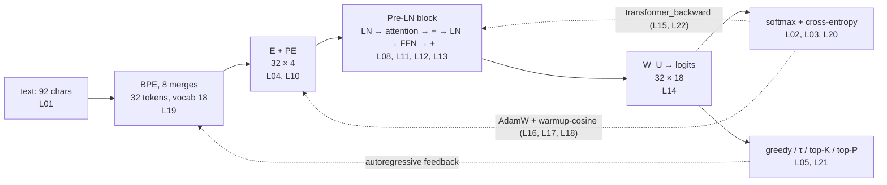
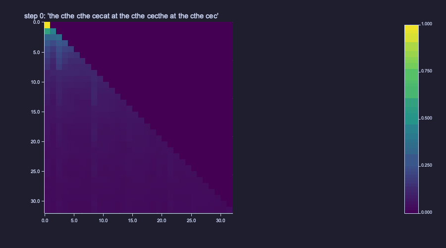
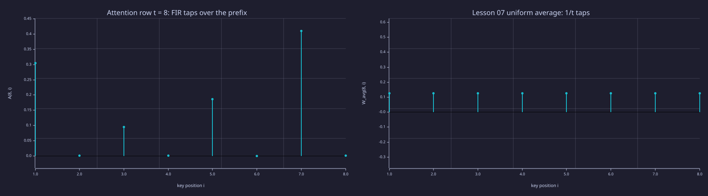
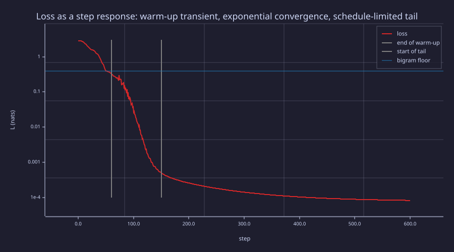

<!-- Generated by rustlab-notebook — do not edit directly. -->

# Lesson 23: Putting It All Together

This is the capstone. Every prior lesson built one piece — characters, softmax, embeddings, attention, the transformer block, backpropagation, AdamW, BPE, perplexity, sampling, the KV cache, and the full backward pass. This lesson runs them all in one place and watches a tiny single-block transformer **learn**.

The corpus is the periodic phrase `"the cat sat on the mat "` repeated four times. After BPE tokenisation, training the full architecture end-to-end with the analytical backward pass from [22-full-backprop-through-the-block](22-full-backprop-through-the-block.md), and sampling, the model reproduces the corpus exactly — and it does so by resolving an ambiguity that no bigram model can: after the token `"at "` the next token is `"s"`, `"o"`, or `"the c"` depending on whether this is `"cat"`, `"sat"`, or `"mat"`, which requires looking one token back.

## Learning Objectives

- See **every component from Lessons 01–22 composed in one notebook** — tokens, BPE, transformer block forward + backward, AdamW with warmup+cosine, perplexity, all four sampling strategies.
- Watch a single-block transformer **learn to reproduce a periodic corpus** that a bigram model cannot solve.
- Verify the **context-beats-bigram** claim quantitatively: the full transformer reaches $\mathrm{PPL} \approx 1.00008$, versus the optimal-bigram floor of $\approx 1.47$ on the same corpus and the same BPE tokenisation — and settle *how* by ablation (attention off, positional code off, both off).
- Recognise the **mode-collapse → resolution** pattern: bigram greedy collapses to a 2-cycle ([21-sampling-and-generation](21-sampling-and-generation.md) demo); context resolves it (this lesson).
- Read the run through the three lenses: the attention row as a **time-varying FIR filter**, the loss curve as a **closed-loop step response**, and PPL 1.00008 as a **code length** — the honest meaning of "memorised".

## Background

You have built and seen run:

| Lesson | What it contributed |
|---|---|
| [01-tokens-and-encoding](01-tokens-and-encoding.md) | character → integer-id mapping |
| [02-probability-and-softmax](02-probability-and-softmax.md) | softmax to convert logits to a next-token distribution |
| [03-cross-entropy-loss](03-cross-entropy-loss.md) | $\mathcal{L} = -\log P_\theta(x_{t+1} \mid x_{\le t})$ as training objective |
| [04-embeddings-and-similarity](04-embeddings-and-similarity.md) | the trainable embedding matrix $\mathbf{E}$ |
| [05-bigram-language-model](05-bigram-language-model.md) | the bigram baseline and CDF sampling |
| [06-linear-layers-and-gradient-descent](06-linear-layers-and-gradient-descent.md) | linear layer + gradient descent |
| [07-context-and-naive-averaging](07-context-and-naive-averaging.md) | why a context-1 model fails and the causal mixing matrix |
| [08-scaled-dot-product-attention](08-scaled-dot-product-attention.md) | self-attention with causal mask |
| [09-multi-head-attention](09-multi-head-attention.md) | parallel heads, concatenate, project |
| [10-positional-encoding](10-positional-encoding.md) | sinusoidal positional embeddings |
| [11-feed-forward-block](11-feed-forward-block.md) | position-wise FFN with GELU |
| [12-layer-norm-and-residuals](12-layer-norm-and-residuals.md) | LayerNorm + residual stream |
| [13-transformer-block](13-transformer-block.md) | block = MHA + FFN with Pre-LN + residuals |
| [14-full-gpt-architecture](14-full-gpt-architecture.md) | full GPT wiring + parameter count |
| [15-backpropagation](15-backpropagation.md) | chain rule through every layer |
| [16-adamw-optimizer](16-adamw-optimizer.md) | AdamW with decoupled weight decay |
| [17-learning-rate-scheduling](17-learning-rate-scheduling.md) | warmup + cosine decay |
| [18-training-loop](18-training-loop.md) | forward / backward / optimiser / log |
| [19-byte-pair-encoding](19-byte-pair-encoding.md) | the BPE merge algorithm |
| [20-perplexity-and-evaluation](20-perplexity-and-evaluation.md) | PPL as evaluation metric |
| [21-sampling-and-generation](21-sampling-and-generation.md) | autoregressive loop + sampling strategies + KV cache |
| [22-full-backprop-through-the-block](22-full-backprop-through-the-block.md) | analytical backward through one block — what makes this end-to-end |

The forward/backward library (`lib/transformer.rlab`), the sampling helpers (`lib/sampling.rlab`) and the entropy helpers (`lib/info.rlab`) are the shared code from Lessons 02, 21 and 22; this notebook and `capstone.rlab` pull them in with `run`.

## What This Lesson Trains End-to-End

The capstone trains the **full single-block transformer** end-to-end with analytical gradients — 300 parameters total: token embedding $\mathbf{E}$ ($18 \times 4 = 72$), Pre-LN scales and biases ($4 \times 4 = 16$), Q/K/V/O projections ($4 \times 16 = 64$), FFN $\mathbf{W}_1, \mathbf{b}_1, \mathbf{W}_2, \mathbf{b}_2$ ($32 + 8 + 32 + 4 = 76$), and LM head $\mathbf{W}_U$ ($4 \times 18 = 72$). Sinusoidal positional embeddings are fixed (not trainable). The model is deliberately tiny so that every number can be checked by hand; the recipe scales transparently to LLaMA dimensions.



> [!TIP]
> The same picture as [00-the-llm-as-a-system](00-the-llm-as-a-system.md), now with every box a thing you have built. Solid arrows are the forward signal; the two dashed loops are what make this lesson a training run and a generator rather than a function.

**Design budget.** The numbers are chosen, not inherited. *Width:* $d = 4$ is the smallest width at which a single head can carry both a token identity and a position ($\mathbf{PE}$ has two sin/cos pairs at $d = 4$) and still leave the FFN a hidden layer of $d_{\text{ff}} = 2d = 8$; it gives the 300 parameters above. *Data:* 8 merges turn 92 characters into 32 tokens, hence 31 prediction pairs — about **0.1 tokens per parameter**, where a compute-optimal LLM trains on roughly 20 tokens per parameter ([14-full-gpt-architecture](14-full-gpt-architecture.md)); this model is over-parameterised by two orders of magnitude on purpose, because the goal is to reach the floor, not to generalise (the Information lens returns to what that costs). Eight merges is also where exactly one token, `"at "`, is left ambiguous (§1); more merges eventually absorb it and make the corpus bigram-trivial (Exercise 4). *Optimisation:* a full-batch step on 31 pairs is exact, so a large peak rate $\eta_{\max} = 0.05$ is safe — for Adam that moves each weight by about $0.05$ per step against an initial scale of $0.3$ — and 600 steps with a 60-step warm-up is roughly four times what the loss needs to reach its schedule-limited tail (§5). At $d = 16$ the same recipe has 2,736 parameters (printed in §2) and about 0.011 tokens per parameter; it still runs in about a second and reaches the same floor (Exercise 7) — nothing in the reading changes, only the budget.

> [!IMPORTANT]
> "Mini-GPT" here means **the full GPT recipe applied to a small model**. Every component — char tokens, BPE, embeddings, attention, FFN, LN, residuals, AdamW, warmup+cosine, PPL, sampling, full backprop — is from the curriculum, with no black boxes. Every choice scales transparently to a real LLM. Only the numbers change.

## Walkthrough

### 1. Tokenise the corpus

### Theory

The phrase `"the cat sat on the mat "` (23 chars, trailing space) is repeated 4 times, then tokenised character-by-character into the 10-symbol base vocabulary `{ , a, c, e, h, m, n, o, s, t}` — [01-tokens-and-encoding](01-tokens-and-encoding.md) exactly, 92 character ids. Then BPE ([19-byte-pair-encoding](19-byte-pair-encoding.md)) is applied for 8 merges; each merge replaces the most frequent adjacent pair with a new id.

### Example — Character ids and eight BPE merges

```rustlab
char_names = {" ", "a", "c", "e", "h", "m", "n", "o", "s", "t"};
n_base_chars = 10;
phrase = "the cat sat on the mat ";
n_reps = 4;
L_total = length(phrase) * n_reps;
char_seq = zeros(L_total);
k = 1;
for r = 1:n_reps
  for i = 1:length(phrase)
    char_seq(k) = char_id(phrase(i));
    k = k + 1;
  end
end
print("phrase:", phrase, " repeated", n_reps, "times -> total chars =", L_total);

n_merges = 8;
cur_seq = char_seq;
cur_vocab = n_base_chars;
for m = 1:n_merges
  step = bpe_step(cur_seq, cur_vocab);
  print("Merge", m, " pair (", step.a, ",", step.b, ") count =", step.count, "  new_id =", step.vocab, " seq len =", length(step.seq));
  cur_seq = step.seq;
  cur_vocab = step.vocab;
end
tokens = cur_seq;
vocab = cur_vocab;
T = length(tokens);
[lp, rp] = compute_merge_table(char_seq, n_base_chars, n_merges);
print("After", n_merges, "merges: vocab =", vocab, "  seq length =", T);
print("tokens:", tokens);
```

<!-- rustlab:output-start -->
```text
phrase: the cat sat on the mat   repeated 4 times -> total chars = 92
Merge 1  pair ( 10 , 1 ) count = 12   new_id = 11  seq len = 80
Merge 2  pair ( 2 , 11 ) count = 12   new_id = 12  seq len = 68
Merge 3  pair ( 4 , 1 ) count = 8   new_id = 13  seq len = 60
Merge 4  pair ( 10 , 5 ) count = 8   new_id = 14  seq len = 52
Merge 5  pair ( 14 , 13 ) count = 8   new_id = 15  seq len = 44
Merge 6  pair ( 7 , 1 ) count = 4   new_id = 16  seq len = 40
Merge 7  pair ( 15 , 3 ) count = 4   new_id = 17  seq len = 36
Merge 8  pair ( 15 , 6 ) count = 4   new_id = 18  seq len = 32
After 8 merges: vocab = 18   seq length = 32
tokens: [1×32]  17.000000  12.000000  9.000000  12.000000  8.000000  16.000000  18.000000  12.000000  ... (32 total)
```

<!-- rustlab:output-end -->

After 8 merges the sequence is 32 tokens long (down from 92 chars) and the vocabulary has 18 entries, including word-fragment tokens such as `"the c"` (id 17) and `"the m"` (id 18) — the model now operates at a subword level. The merge ids follow the table above: `11 = "t "`, `12 = "at "`, `13 = "e "`, `14 = "th"`, `15 = "the "`, `16 = "n "`, `17 = "the c"`, `18 = "the m"`.

### Example — The bigram floor these tokens impose

Before training anything, compute the best score any *context-1* (bigram) model could achieve on this exact token sequence. That number is the bar the full transformer has to clear.

```rustlab
counts = zeros(vocab, vocab);
for t = 1:(T - 1)
  counts(tokens(t), tokens(t + 1)) = counts(tokens(t), tokens(t + 1)) + 1;
end

% Optimal bigram assigns P(next | curr) = count(curr, next) / row-sum.
% Its cross-entropy is -mean log P(next | curr) over all T-1 transitions.
ce_floor = 0.0;
for t = 1:(T - 1)
  curr = tokens(t); nxt = tokens(t + 1);
  p_bigram = counts(curr, nxt) / sum(counts(curr, :));
  ce_floor = ce_floor - log(p_bigram);
end
ce_floor = ce_floor / (T - 1);
ppl_floor = exp(ce_floor);
print("optimal-bigram CE (nats):", ce_floor);
print("optimal-bigram PPL floor:", ppl_floor);
```

<!-- rustlab:output-start -->
```text
optimal-bigram CE (nats): 0.38679536276834264
optimal-bigram PPL floor: 1.4722551822198788
```

<!-- rustlab:output-end -->

Every current token predicts its successor deterministically **except token 12 (`"at "`)**, which is followed by three different tokens across the corpus: `"s"` (in `"sat"`, 4 times), `"o"` (in `"on"`, 4 times), and `"the c"` (wrapping into the next phrase, 3 times). A bigram conditions only on the current token, so it cannot see *which* `"at "` it is looking at; the best it can do is hedge with $P = (4/11,\, 4/11,\, 3/11)$. Those 11 ambiguous transitions cost $H(4/11, 4/11, 3/11) \approx 1.09$ nats each; the other 20 are free, so the mean cross-entropy is $\tfrac{11}{31} \cdot 1.09 = 0.3868$ nats, giving $\mathrm{PPL}_{\text{floor}} = 1.4723$. **That is the number attention has to beat.**

### 2. Train

### Theory

600 AdamW steps with the warmup+cosine schedule ([17-learning-rate-scheduling](17-learning-rate-scheduling.md)) on the **full transformer forward pass** from [14-full-gpt-architecture](14-full-gpt-architecture.md) and the **analytical backward pass** from [22-full-backprop-through-the-block](22-full-backprop-through-the-block.md). Every parameter receives a gradient: token embedding $\mathbf{E}$, both LayerNorm scales/biases, the four attention projections $\mathbf{W}_Q, \mathbf{W}_K, \mathbf{W}_V, \mathbf{W}_O$, FFN weights and biases, and the LM head $\mathbf{W}_U$. Parameters are snapshotted at steps 0, 100, 300, and 600 for the generation gallery.

There is no train/val split in this capstone — the corpus is periodic with period 8 tokens, and once positional embeddings are involved, any held-out positions are PE-out-of-distribution, not a useful overfitting signal. [18-training-loop](18-training-loop.md) and [20-perplexity-and-evaluation](20-perplexity-and-evaluation.md) demonstrate the train/val pattern at appropriate scale; here we train on every prediction position.

### Example — Initialise the model and train with checkpoints

```rustlab
seed(22);
d_model = 4;
d_ff = 8;
T_max = T + 16;     % PE table large enough for any generation prefix

E = randn(vocab, d_model) * 0.3;
PE = sinusoidal_pe(T_max, d_model);
gamma1 = ones(d_model);   beta1 = zeros(d_model);
gamma2 = ones(d_model);   beta2 = zeros(d_model);
Wq = randn(d_model, d_model) * 0.3;
Wk = randn(d_model, d_model) * 0.3;
Wv = randn(d_model, d_model) * 0.3;
Wo = randn(d_model, d_model) * 0.3;
W1 = randn(d_model, d_ff) * 0.3;  b1f = zeros(d_ff);
W2 = randn(d_ff, d_model) * 0.3;  b2f = zeros(d_model);
W_U = randn(d_model, vocab) * 0.3;
P = struct("E", E, "PE", PE, "gamma1", gamma1, "beta1", beta1, "gamma2", gamma2, "beta2", beta2, ...
           "Wq", Wq, "Wk", Wk, "Wv", Wv, "Wo", Wo, "W1", W1, "b1f", b1f, "W2", W2, "b2f", b2f, "W_U", W_U);
n_params = vocab * d_model + 4 * d_model + 4 * d_model * d_model + 2 * d_model * d_ff + d_ff + d_model + d_model * vocab;
print("vocab:", vocab, "  d_model:", d_model, "  d_ff:", d_ff, "  params:", n_params);

n_pairs = T - 1;
n_params_16 = vocab * 16 + 4 * 16 + 4 * 16 * 16 + 2 * 16 * 32 + 32 + 16 + 16 * vocab;
print("prediction pairs:", n_pairs, "  tokens per parameter:", n_pairs / n_params, "  (params at d = 16:", n_params_16, ")");
mask_train = ones(T - 1);
n_train = 600;  T_w = 60;  eta_max = 0.05;  eta_min = 0.005;
bet1 = 0.9;  bet2 = 0.999;  eps_a = 1e-8;
[M, V] = adamw_init(P);

loss_curve = zeros(n_train + 1);
ppl_curve  = zeros(n_train + 1);
gnorm      = zeros(n_train + 1);
lr_curve   = zeros(n_train + 1);
loss_curve(1) = mean_loss(1, n_pairs, tokens, P);
ppl_curve(1) = exp(loss_curve(1));
P_ck0 = P;
for step = 1:n_train
  eta_t = warmup_cosine(step, n_train, T_w, eta_max, eta_min);
  lr_curve(step + 1) = eta_t;
  [lo, L, cache] = transformer_forward(tokens, mask_train, P);
  dl = ce_dlogits(tokens, mask_train, lo, cache.total);
  G = transformer_backward(tokens, dl, cache, P);
  gnorm(step + 1) = grad_norm(G);
  [P, M, V] = adamw_step(P, G, M, V, eta_t, step, bet1, bet2, eps_a, 0.0);
  loss_curve(step + 1) = mean_loss(1, n_pairs, tokens, P);
  ppl_curve(step + 1) = exp(loss_curve(step + 1));
  if step == 100
    P_ck1 = P;
  elseif step == 300
    P_ck2 = P;
  elseif step == 600
    P_ck3 = P;
  end
end
print("Initial L =", loss_curve(1), "  PPL =", ppl_curve(1), "  (log(vocab) =", log(vocab), "is the uniform baseline)");
print("Final   L =", loss_curve(n_train + 1), "  PPL =", ppl_curve(n_train + 1));
```

<!-- rustlab:output-start -->
```text
vocab: 18   d_model: 4   d_ff: 8   params: 300
prediction pairs: 31   tokens per parameter: 0.10333333333333333   (params at d = 16: 2736 )
Initial L = 2.8724045210395035   PPL = 17.67947780822632   (log(vocab) = 2.8903717578961645 is the uniform baseline)
Final   L = 0.00008169636170878258   PPL = 1.0000816996989474
```

<!-- rustlab:output-end -->

Loss drops from $2.872$ (≈ $\log |\mathcal{V}| = 2.890$, the uniform-random baseline) to $8.17e-05$, equivalently $\mathrm{PPL} = 1.00008$. The model assigns probability $\approx 1$ to the correct next token at every position — perfect except for floating-point noise — and the bigram floor of $1.4723$ is decisively beaten.

### 3. Generate at checkpoints

### Theory

Four snapshots — at steps 0, 100, 300, 600 — capture how the model's output evolves. The prompt is token 17 (`"the c"`), the natural start of every phrase in the corpus. Generation recomputes the full forward pass on the growing prefix at each step (no KV cache here; the cached version is `kv_cache.rlab` in [21-sampling-and-generation](21-sampling-and-generation.md)).

### Example — Checkpoint gallery

```rustlab
prompt_id = 17;
n_gen = 16;
s_ck0 = decode_seq(greedy_gen(prompt_id, n_gen, P_ck0), lp, rp, char_names);
s_ck1 = decode_seq(greedy_gen(prompt_id, n_gen, P_ck1), lp, rp, char_names);
s_ck2 = decode_seq(greedy_gen(prompt_id, n_gen, P_ck2), lp, rp, char_names);
s_ck3 = decode_seq(greedy_gen(prompt_id, n_gen, P_ck3), lp, rp, char_names);
print("step   0 greedy : '", s_ck0, "'");
print("step 100 greedy : '", s_ck1, "'");
print("step 300 greedy : '", s_ck2, "'");
print("step 600 greedy : '", s_ck3, "'");
seed(101);
print("step 600 T=0.7  : '", decode_seq(temp_gen(prompt_id, n_gen, 0.7, P_ck3), lp, rp, char_names), "'");
print("step 600 T=1.0  : '", decode_seq(temp_gen(prompt_id, n_gen, 1.0, P_ck3), lp, rp, char_names), "'");
print("step 600 K=3    : '", decode_seq(topk_gen(prompt_id, n_gen, 3, 1.0, P_ck3), lp, rp, char_names), "'");
print("step 600 P=0.9  : '", decode_seq(topp_gen(prompt_id, n_gen, 0.9, 1.0, P_ck3), lp, rp, char_names), "'");
```

<!-- rustlab:output-start -->
```text
step   0 greedy : ' the cthe cthe cecat at the cthe cecthe at the cthe cec '
step 100 greedy : ' the cat sat on the mat the cat sat on the mat the c '
step 300 greedy : ' the cat sat on the mat the cat sat on the mat the c '
step 600 greedy : ' the cat sat on the mat the cat sat on the mat the c '
step 600 T=0.7  : ' the cat sat on the mat the cat sat on the mat the c '
step 600 T=1.0  : ' the cat sat on the mat the cat sat on the mat the c '
step 600 K=3    : ' the cat sat on the mat the cat sat on the mat the c '
step 600 P=0.9  : ' the cat sat on the mat the cat sat on the mat the c '
```

<!-- rustlab:output-end -->

Three things to read from the gallery. First, **by step 100 the model has already learned the full corpus structure**: greedy decoding reproduces the corpus exactly, with no mode collapse, because the model resolves the `"at "` ambiguity from context (it reads the token immediately before each `"at "`). This is the headline contrast with the bigram of [21-sampling-and-generation](21-sampling-and-generation.md): same corpus, same BPE, same training loop, attention added — and `"sat on the mat"` now appears under *greedy* decoding, not only under sampling. Second, **every sampling strategy converges to the same output at step 600** — once the model is this confident, the next-token distribution at every position is essentially one-hot, so temperature rescaling and top-K/top-P truncation are no-ops. Third, the step-0 output is gibberish heavy with `"the c"` because the random LM head happens to favour that token after most prefixes.

### 4. Read the attention pattern

### Theory

Row $t$ of the attention matrix $\mathbf{A}$ is the distribution over key positions $i \le t$ that the query at position $t$ uses ([08-scaled-dot-product-attention](08-scaled-dot-product-attention.md)). If attention *alone* were doing the disambiguation, the rows belonging to `"at "` positions would put their weight on the position immediately before them — the token that tells `"cat"`, `"sat"`, and `"mat"` apart. The trained matrix is more interesting than that, and the animation across checkpoints shows how it got there.

### Example — Trained attention matrix

```rustlab
[logits_final, L_final, cache_final] = transformer_forward(tokens, mask_train, P_ck3);
A_trained = cache_final.A;
figure();
imagesc(A_trained, "viridis")
title("Trained attention A (rows = query position, cols = key position)")
xlabel("key position i")
ylabel("query position t")
print("A(6,5) =", A_trained(6, 5), "  A(7,6) =", A_trained(7, 6), "  A(8,7) =", A_trained(8, 7), "  (first period: previous token)");
print("A(10,5) =", A_trained(10, 5), "  A(16,13) =", A_trained(16, 13), "  A(24,21) =", A_trained(24, 21), "  (later 'at ' rows: an 'o' column)");
```

<!-- rustlab:output-start -->
```text
A(6,5) = 0.9798972921054377   A(7,6) = 0.8336696829349758   A(8,7) = 0.4099164748366176   (first period: previous token)
A(10,5) = 0.9998303683483063   A(16,13) = 0.9999120643848796   A(24,21) = 0.9988899602393031   (later 'at ' rows: an 'o' column)
```


<!-- rustlab:output-end -->

> [!TIP]
> Lower-triangular (causal mask), rows summing to 1. Look for the short sub-diagonal in the first eight rows and then the three bright **columns** at $i = 5, 13, 21$.

In the first period the head is a **previous-token head** — rows 6 and 7 put $0.98$ and $0.83$ of their weight on column $t - 1$, the pattern [09-multi-head-attention](09-multi-head-attention.md) named, and row 8 (the third `"at "`) still puts its largest tap there ($0.41$). From the second period on, most rows — including every later `"at "` row — put their weight on one of the `"o"` positions 5, 13, 21 instead ($A(10,5) = 1.000$, $A(16,13) = 1.000$, $A(24,21) = 0.999$). Which `"o"` a query selects, and with what weight, is set by the query's positional code, so what the head reads out is as much *where am I* as *what came before*. A picture cannot say whether the head is *necessary*; §6 measures that.

### Example — Attention map across checkpoints

The same matrix at the four checkpoints, one frame per second, each titled with the step and its greedy sample:

```rustlab
function H_mean = attn_frame(P_ck, label, tokens, mask_train)
  [lo, L, ca] = transformer_forward(tokens, mask_train, P_ck);
  imagesc(ca.A, "viridis")
  title(label)
  frame()
  H_mean = mean(row_entropies_bits(ca.A));    % how spread out the rows are, in bits
end
figure();
H_ck = zeros(4);
H_ck(1) = attn_frame(P_ck0, "step 0: '" + s_ck0 + "'", tokens, mask_train);
H_ck(2) = attn_frame(P_ck1, "step 100: '" + s_ck1 + "'", tokens, mask_train);
H_ck(3) = attn_frame(P_ck2, "step 300: '" + s_ck2 + "'", tokens, mask_train);
H_ck(4) = attn_frame(P_ck3, "step 600: '" + s_ck3 + "'", tokens, mask_train);
saveanim("capstone_attention.gif", 1)
H_unif = mean(log2(1:T));                     % a uniform average over each prefix
print("mean attention-row entropy at steps 0/100/300/600 (bits):", H_ck, "  uniform prefix average:", H_unif);
```

<!-- rustlab:output-start -->
```text
mean attention-row entropy at steps 0/100/300/600 (bits): [1×4]  3.668621  1.314890  1.215535  1.203905   uniform prefix average: 3.6769769891362594
```



<!-- rustlab:output-end -->

> [!TIP]
> At step 0 every row is close to a uniform average over its prefix (the [07-context-and-naive-averaging](07-context-and-naive-averaging.md) filter); by step 100 the rows have collapsed onto a few positions and the greedy sample is already the corpus; steps 300 and 600 only sharpen the same pattern.

The mean row entropy says the same in numbers: $3.67$ bits at step 0 against $3.68$ for a uniform prefix average, then $1.31$ bits at step 100 and $1.20$ at step 600 — the head is built in the first hundred steps and only trimmed afterwards.

### 5. Read the diagnostics

### Example — Loss, perplexity, gradient norm, learning rate

```rustlab
steps_axis = 0:n_train;
figure();
subplot(2, 2, 1)
semilogy(steps_axis, loss_curve, "color", "red")
title("Loss vs step (nats, log scale)")
xlabel("step"); ylabel("L")
subplot(2, 2, 2)
plot(steps_axis, ppl_curve, "color", "blue")
title("PPL vs step (PPL = 1 is perfect)")
xlabel("step"); ylabel("PPL")
subplot(2, 2, 3)
semilogy(steps_axis, gnorm + 1e-12, "color", "green")
title("|| grad || over training (log scale)")
xlabel("step"); ylabel("||grad||")
subplot(2, 2, 4)
plot(steps_axis, lr_curve, "color", "purple")
title("Learning-rate schedule (warmup + cosine)")
xlabel("step"); ylabel("eta")
```

<!-- rustlab:output-start -->


<!-- rustlab:output-end -->

> [!TIP]
> Read the loss and gradient-norm panels on their log axes: the shoulder during warm-up, the straight exponential section, and the bend into the slow tail as the learning rate decays.

- **Loss** — drops from ~2.9 at step 0 to ~$10^{-4}$ by step 600; on the log axis the warm-up transient, the exponential convergence, and the slow tail are all visible (the Systems lens names and measures them).
- **PPL** — same shape on the natural y-scale; ends at 1.00008. The "effective branching factor" interpretation says the model has reduced the choice from 18 possibilities to ~1.
- **Gradient norm** — drops from $\sim 10^{-1}$ to $\sim 10^{-4}$ over training. Healthy "decrease over time" from [18-training-loop](18-training-loop.md).
- **Learning rate** — warmup + cosine envelope from [17-learning-rate-scheduling](17-learning-rate-scheduling.md).

These are the four plots a production training run would also show. Reading them is the same — only the y-axis scale changes.

### 6. Ablate: what actually beats the floor

### Theory

Two mechanisms could carry the one-token-back information that resolves `"at "`: the attention head, and the fixed positional code (every one of the 32 positions is distinct, so the FFN can memorise a position→next-token table). The loss curve cannot tell them apart. Train four variants from the same step-0 snapshot `P_ck0` with the same seed, schedule and 600 steps. *Attention off* clamps $\mathbf{W}_O = \mathbf{0}$ after every update — then $\mathbf{H}_{\text{mid}} = \mathbf{H}_{\text{in}}$ exactly and the chain rule sends zero gradient into $\mathbf{Q}, \mathbf{K}, \mathbf{V}$ ([22-full-backprop-through-the-block](22-full-backprop-through-the-block.md), piece 6), so the library trains the attention-free model without a second implementation. *PE off* zeroes the positional table. Each run takes well under a second.

### Example — Four runs, one table

```rustlab
function L_final = train_variant(P_start, ids, mask, n_steps, attn_on, T_w, eta_max, eta_min)
  Pv = P_start;
  d = size(Pv.E)(2);
  if attn_on == 0
    Pv.Wo = zeros(d, d);
  end
  [Mv, Vv] = adamw_init(Pv);
  for step = 1:n_steps
    eta_t = warmup_cosine(step, n_steps, T_w, eta_max, eta_min);
    [lo, L, ca] = transformer_forward(ids, mask, Pv);
    dlv = ce_dlogits(ids, mask, lo, ca.total);
    Gv = transformer_backward(ids, dlv, ca, Pv);
    [Pv, Mv, Vv] = adamw_step(Pv, Gv, Mv, Vv, eta_t, step, 0.9, 0.999, 1e-8, 0.0);
    if attn_on == 0
      Pv.Wo = zeros(d, d);
    end
  end
  [lo, L_final, ca] = transformer_forward(ids, mask, Pv);
end

P_nope = P_ck0;  P_nope.PE = zeros(T_max, d_model);
ppl_abl = zeros(4);
ppl_abl(1) = exp(train_variant(P_ck0, tokens, mask_train, n_train, 1, T_w, eta_max, eta_min));
ppl_abl(2) = exp(train_variant(P_ck0, tokens, mask_train, n_train, 0, T_w, eta_max, eta_min));
ppl_abl(3) = exp(train_variant(P_nope, tokens, mask_train, n_train, 1, T_w, eta_max, eta_min));
ppl_abl(4) = exp(train_variant(P_nope, tokens, mask_train, n_train, 0, T_w, eta_max, eta_min));
print("full model               PPL =", ppl_abl(1));
print("attention off            PPL =", ppl_abl(2));
print("PE off                   PPL =", ppl_abl(3));
print("attention off and PE off PPL =", ppl_abl(4), "  (bigram floor", ppl_floor, ")");
```

<!-- rustlab:output-start -->
```text
full model               PPL = 1.0000816996989474
attention off            PPL = 1.0031483814068165
PE off                   PPL = 1.0008450741508512
attention off and PE off PPL = 1.4722596713107259   (bigram floor 1.4722551822198788 )
```

<!-- rustlab:output-end -->

| Variant | Final PPL | Beats the bigram floor $1.4723$? |
|---|---|---|
| full model | 1.00008 | yes |
| attention off ($\mathbf{W}_O = 0$) | 1.0031 | yes — position + FFN suffice |
| PE off | 1.0008 | yes — attention alone suffices |
| attention off and PE off | 1.4723 | no — the bigram floor, to four decimals |

The first row reproduces the training run. **Either channel alone reaches PPL ≈ 1**, and only removing both lands on $1.4723$ — the number §1 derived for the best context-1 model. So the honest headline is *context beats the bigram*: on a fixed periodic corpus the model has two independent routes to the previous token, the attention head and the positional code, and the loss curve alone cannot say which it used. (On the 12-token `abb` corpus of [22-full-backprop-through-the-block](22-full-backprop-through-the-block.md) the same table came out differently — there attention without positions stayed on the floor — which is the point: the mechanism is a property of the run, and only an ablation reveals it.)

## What Production Adds

The capstone covers every component of an LLM **end-to-end with analytical gradients**. A production trainer adds infrastructure on top:

- **Mini-batching.** The capstone uses one full-batch gradient per step on a 32-token corpus. Real training samples millions of tokens per batch and uses gradient accumulation across micro-batches.
- **Mixed precision** (fp16 / bf16). Forward in low precision, accumulate in fp32. Cuts memory and time by ~2×.
- **Gradient clipping.** A `max_norm = 1.0` clip step ([18-training-loop](18-training-loop.md) sidebar) prevents single-step divergence on outlier batches.
- **Dropout.** Stochastic activation zeroing during training ([13-transformer-block](13-transformer-block.md) sidebar) — small effect on small models, important at scale.
- **Distributed training.** Data-parallel and tensor-parallel splits across many GPUs; the only architectural addition is the inter-GPU all-reduce on gradients.
- **Real corpora.** Wikipedia + Common Crawl + code, hundreds of billions of tokens, tokenised once and held in a memory-mapped file.
- **Multi-layer stacks and multi-head attention.** The capstone runs one block with one head. LLaMA-2-7B runs 32 blocks with 32 heads. The forward/backward library generalises by adding outer loops; the math is identical.
- **KV cache for inference.** Generation here recomputes the full forward pass on the growing prefix every step — $O(T^3)$ total. With the KV cache from [21-sampling-and-generation](21-sampling-and-generation.md) this becomes $O(T^2)$.
- **Modern variants.** RoPE / RMSNorm / SwiGLU / GQA from [24-modern-architectural-variants](24-modern-architectural-variants.md) — each a local swap against the baseline used here.

Every one of those is an engineering or substitution layer over the math the capstone already builds. **The reverse — a production trainer that wires up infrastructure but gets the math wrong — fails silently and is far harder to debug.** The understanding compounds the way the model's loss does.

## Engineering Lenses

### Signals

**Exact.** Row $t$ of $\mathbf{A}$ is the tap vector of a **causal, time-varying FIR filter** along the token axis: the attention output at $t$ is $\sum_{i \le t} A_{ti}\,\mathbf{V}(i,:)$, a weighted sum of the prefix with non-negative taps that sum to one — the same operation as the uniform average of [07-context-and-naive-averaging](07-context-and-naive-averaging.md), with taps computed from the signal instead of fixed at $1/t$ ([08-scaled-dot-product-attention](08-scaled-dot-product-attention.md)). Take the third `"at "` position, $t = 8$:

```rustlab
t_q = 8;
taps = A_trained(t_q, 1:t_q);
figure();
subplot(1, 2, 1)
stem(1:t_q, taps)
title("Attention row t = 8: FIR taps over the prefix")
xlabel("key position i"); ylabel("A(8, i)")
subplot(1, 2, 2)
stem(1:t_q, ones(t_q) / t_q)
title("Lesson 07 uniform average: 1/t taps")
xlabel("key position i"); ylabel("W_avg(8, i)")
H_row = entropy_bits(taps);
V_final = cache_final.V;  attn_final = cache_final.attn_out;
print("taps at the odd positions (the c, s, o, the m):", taps(1), taps(3), taps(5), taps(7));
print("row entropy =", H_row, "bits  -> effective taps 2^H =", 2 ^ H_row, "  (uniform: 3 bits, 8 taps)");
print("max |attn_out(8,:) - taps * V(1:8,:)| =", max(abs(attn_final(8, :) - taps * V_final(1:8, :))));
```

<!-- rustlab:output-start -->
```text
taps at the odd positions (the c, s, o, the m): 0.30437623338571773 0.09544201725566862 0.18701674985444552 0.4099164748366176
row entropy = 1.8582075883327531 bits  -> effective taps 2^H = 3.625569396063929   (uniform: 3 bits, 8 taps)
max |attn_out(8,:) - taps * V(1:8,:)| = 0.00000000000000005551115123125783
```



<!-- rustlab:output-end -->

> [!TIP]
> The left stem is the filter the model learned for this query: nearly all of its weight on the odd positions — the content tokens `"the c"`, `"s"`, `"o"`, `"the m"` — and almost none on the `"at "` tokens between them. The right stem is the filter Lesson 07 used for every query.

The row has $1.86$ bits of entropy, an effective length of $3.6$ taps out of 8, against 3 bits (8 taps) for the uniform average; and the impulse-response identity holds to $6e-17$. A different query gets a different tap vector — that is what "time-varying" means here, and it is the whole difference between Lesson 07 and Lesson 08.

### Systems

**Model.** The training run is the **step response of a closed loop** — plant = model, sensor = loss, controller = AdamW with a scheduled gain ([18-training-loop](18-training-loop.md)) — and the `semilogy` loss shows its three phases. The label is *Model*, not *Exact*: the loop is nonlinear and the phase boundaries are read off the curve, not derived.

```rustlab
k_cross = 1;
while k_cross <= n_train && loss_curve(k_cross + 1) > ce_floor
  k_cross = k_cross + 1;
end
rate_exp = (log(loss_curve(151)) - log(loss_curve(61))) / 90;        % nats of log-loss per step, steps 60-150
slope_a = (log10(loss_curve(301)) - log10(loss_curve(201))) / 100;   % decades per step, steps 200-300
slope_b = (log10(loss_curve(601)) - log10(loss_curve(501))) / 100;   % decades per step, steps 500-600
eta_a = mean(lr_curve(202:301));  eta_b = mean(lr_curve(502:601));
print("bigram floor crossed at step", k_cross);
print("exponential phase (steps 60-150): e-folding time =", -1 / rate_exp, "steps");
print("tail: log-slope ratio (200-300 vs 500-600) =", slope_a / slope_b, "   eta ratio =", eta_a / eta_b);
figure();
semilogy(steps_axis, loss_curve, "color", "red", "label", "loss")
hold("on")
semilogy([T_w, T_w], [1e-4, 3], "color", "gray", "label", "end of warm-up")
semilogy([150, 150], [1e-4, 3], "color", "gray", "label", "start of tail")
hline(ce_floor, "blue", "bigram floor")
hold("off")
title("Loss as a step response: warm-up transient, exponential convergence, schedule-limited tail")
xlabel("step"); ylabel("L (nats)")
legend("loss", "end of warm-up", "start of tail", "bigram floor")
```

<!-- rustlab:output-start -->
```text
bigram floor crossed at step 53
exponential phase (steps 60-150): e-folding time = 13.875578341845374 steps
tail: log-slope ratio (200-300 vs 500-600) = 8.037978735593212    eta ratio = 6.003463198762087
```



<!-- rustlab:output-end -->

> [!TIP]
> Left of the first grey line the gain is still ramping; between the lines the curve is straight on the log axis; right of the second line it bends over as the cosine schedule takes $\eta$ down.

Three phases. **Warm-up transient** (steps 0–60): $\eta$ ramps from 0 and the loss falls slowly, crossing the bigram floor at step $53$. **Exponential convergence** (60–150): a straight line on the log axis with an e-folding time of $13.9$ steps — three decades in ninety steps. **Schedule-limited tail** (150–600): the log-slope falls by a factor of $8.0$ between the windows 200–300 and 500–600 while $\eta$ falls by a factor of $6.0$; the convergence rate tracks the scheduled gain. This tail is *not* a round-off floor: a position's loss reaches exactly 0 only when its logit margin exceeds $\approx 37$ nats and $p$ rounds to 1, and the mean loss here is still four orders of magnitude above that.

### Information

**Exact.** The bigram floor of §1 is the corpus's own **conditional entropy** $H(\text{next} \mid \text{cur})$, and the trigram floor is $H(\text{next} \mid \text{cur}, \text{prev})$; their difference $I(\text{next}; \text{prev} \mid \text{cur})$ is the information that only a channel to the previous token can recover — which is what §6 ablated. PPL 1.00008 then has an exact reading as a **code length**:

```rustlab
H_cur      = cond_entropy_nats(tokens, 1, vocab);
H_cur_prev = cond_entropy_nats(tokens, 2, vocab);
print("H(next | cur)        =", H_cur, "nats  (= optimal-bigram CE", ce_floor, ")");
print("H(next | cur, prev)  =", H_cur_prev, "nats");
print("I(next ; prev | cur) =", H_cur - H_cur_prev, "nats =", (H_cur - H_cur_prev) / log(2), "bits per pair");
bits_corpus = T * log2(vocab);                                 % 32 symbols from an 18-letter alphabet, fixed-length code
bits_params = n_params * 64;                                   % the model itself, stored as float64
bits_data_given_model = n_pairs * loss_curve(n_train + 1) / log(2);   % what the trained model charges for the corpus
print("corpus, fixed-length code:", bits_corpus, "bits   model parameters:", bits_params, "bits   corpus under the model:", bits_data_given_model, "bits");
```

<!-- rustlab:output-start -->
```text
H(next | cur)        = 0.38679536276834264 nats  (= optimal-bigram CE 0.38679536276834264 )
H(next | cur, prev)  = 0 nats
I(next ; prev | cur) = 0.38679536276834264 nats = 0.5580277517047355 bits per pair
corpus, fixed-length code: 133.437600046154 bits   model parameters: 19200 bits   corpus under the model: 0.0036537510127738803 bits
```

<!-- rustlab:output-end -->

$H(\text{next} \mid \text{cur}) = 0.3868$ nats is the floor of §1 to every digit, $H(\text{next} \mid \text{cur}, \text{prev}) = 0$, so one token of extra context is worth $0.558$ bits per pair and the model recovered all of it. Now the **MDL reading**. A two-part code sends the model, then the data given the model: $19200$ bits of parameters plus $0.0037$ bits for the whole corpus — against $133.4$ bits to send the 32 tokens with no model at all. The trained transformer is a *lossless* code for its training set (the $0.0037$ bits are the residual of PPL 1.00008 over 31 pairs) and a grossly over-parameterised one: it spends $144$ times the corpus's own length to describe it. That is the precise content of "the model memorised the corpus", and it is why the only number that measures learning rather than storage is the loss on tokens the model never saw — the held-out evaluation of [18-training-loop](18-training-loop.md) and [20-perplexity-and-evaluation](20-perplexity-and-evaluation.md), which this fixed periodic corpus cannot provide (§2).

## Key Takeaways

- The capstone composes **Lessons 01–22** into a single run that trains a single-block transformer end-to-end with analytical gradients.
- Loss drops from $\approx 2.87$ (uniform over 18 tokens) to $\approx 8 \times 10^{-5}$ — **PPL = 1.00008**, essentially the lower bound.
- **Context beats a bigram on this corpus**: the optimal-bigram floor is PPL $\approx 1.47$ (CE $= 0.3868$ nats $= H(\text{next} \mid \text{cur})$) because `"at "` is followed by three different tokens (`"s"`, `"o"`, `"the c"`) and a bigram cannot tell them apart. The ablation shows *two* independent routes to the previous token on a fixed corpus — the attention head and the positional code — either of which suffices; only removing both recovers the floor.
- **Greedy decoding reproduces the corpus** — no mode collapse — because the model's distribution is essentially one-hot at every position. All sampling strategies (temperature, top-K, top-P) converge to the same output for the same reason.
- The four diagnostic plots (loss, PPL, gradient norm, LR) are exactly what a production run reports; the loss is a closed-loop step response with a warm-up transient, an exponential phase, and a schedule-limited tail.
- PPL 1.00008 is a code length: 19,200 bits of parameters to save 133 bits of corpus — a lossless, over-parameterised code, which is what "memorised" means and why held-out loss is the number that measures learning.
- Scaling to a real LLM swaps the model size, the corpus, the precision, and the training scale — not the underlying math.

## Standalone Scripts

| Script | What it computes |
|---|---|
| `capstone.rlab` | Full end-to-end on the periodic `"the cat sat on the mat "` corpus: char-tokenise → BPE merge (Lesson 19) → full transformer forward + analytical backward (Lessons 13, 14, 15, 22) → AdamW + warmup-cosine training (Lessons 16, 17, 18) → checkpoint sampling gallery (Lesson 21) → diagnostic plots (Lessons 17, 18, 20) → attention-map GIF across the checkpoints. Pulls the shared library in with `run "../../lib/transformer.rlab"` and `run "../../lib/sampling.rlab"`. |
| `ablation.rlab` | The §6 table on the same 32-token sequence and step-0 initialisation (full / attention off / PE off / both off → final PPL), plus $H(\text{next} \mid \text{cur})$, $H(\text{next} \mid \text{cur}, \text{prev})$ and the MDL bit counts from `lib/info.rlab`. |

Run with `make lesson-23` (or `rustlab run lessons/23-putting-it-all-together/<script>.rlab`).

## Expected Numerical Outputs Summary

| Variable | Expected Value |
|---|---|
| Char vocab size | $10$ |
| `L_total` (initial char sequence length) | $92$ ($23 \times 4$) |
| `n_merges` | $8$ |
| `vocab` (final vocab size) | $18$ |
| `T` (final token sequence length) | $32$ |
| `n_params` | $300$ (full single-block transformer at $d_{\text{model}} = 4, d_{\text{ff}} = 8$) |
| `loss_curve(1)` (initial loss) | $\approx 2.87$ (≈ $\log 18 = 2.89$ uniform baseline) |
| `loss_curve(601)` (final loss) | $\approx 8.2 \times 10^{-5}$ |
| `ppl_curve(601)` (final PPL) | $\approx 1.00008$ |
| `ppl_floor` (optimal-bigram floor on the 32-token BPE sequence) | $1.4723$ (CE $= 0.3868$ nats) |
| step-100 greedy from `"the c"` | `"the cat sat on the mat the cat sat on the mat the c"` (corpus reproduced) |
| step-600 greedy / T=0.7 / T=1.0 / K=3 / P=0.9 | all identical — corpus reproduced exactly |
| `ppl_abl` (full / attention off / PE off / both off) | $1.00008$ / $\approx 1.0031$ / $\approx 1.0008$ / $1.4723$ |
| `A_trained(6,5)`, `A_trained(8,7)`, `A_trained(10,5)`, `A_trained(24,21)` | $\approx 0.98$, $0.41$, $1.00$, $1.00$ |
| `H_ck` (mean attention-row entropy at steps 0/100/300/600) | $\approx 3.67$ / $1.31$ / $1.22$ / $1.20$ bits (uniform prefix: $3.68$) |
| `H_row` (entropy of attention row 8) | $\approx 1.86$ bits ($\approx 3.6$ effective taps) |
| `k_cross` (step at which the loss crosses the bigram floor) | $53$ |
| e-folding time of the exponential phase | $\approx 14$ steps |
| `H_cur`, `H_cur_prev` | $0.3868$ nats, $0$ nats |
| `bits_params`, `bits_corpus`, `bits_data_given_model` | $19200$, $\approx 133.4$, $\approx 0.0037$ bits |

## Exercises

1. **Why no mode collapse?** Examine the trained attention pattern `A_trained` at a position whose current token is `"at "` (id 12) — the only token with an ambiguous successor. Which earlier position carries the disambiguating information, and is it attended to with high weight? Hint: it is the token *immediately before* `"at "` (one position back) — `"the c"`, `"s"`, or `"the m"` — which uniquely determines the continuation.
2. **Bigram floor analytically.** Using the transition counts from §1, show by hand that a context-1 model must assign $P(\cdot \mid \text{"at "}) = (4/11, 4/11, 3/11)$ over $(\text{"s"}, \text{"o"}, \text{"the c"})$, that every other current token has a deterministic successor, and that the mean cross-entropy over all 31 transitions is therefore $\tfrac{11}{31}\,H(4/11, 4/11, 3/11) = 0.3868$ nats — i.e. $\mathrm{PPL}_{\text{floor}} = 1.4723$. Confirm against the printed value.
3. **Which channel did the model use?** §6 showed that either attention or the positional code suffices on this corpus. Re-run the ablation with $n_{\text{reps}} = 2$ (a 16-token sequence, 15 pairs). Does "PE off" still reach PPL ≈ 1 when the head has only two periods to compare, or does it fall back to the floor as it did on the `abb` corpus of [22-full-backprop-through-the-block](22-full-backprop-through-the-block.md)?
4. **More merges.** Re-run with $n_{\text{merges}} = 20$ instead of 8. The vocabulary grows; what happens to the sequence length and the final PPL? Past how many merges does PPL stop improving?
5. **Longer corpus.** Change `n_reps` from 4 to 10. Does the loss curve shape change? With more training pairs but the same parameter count, does the model still memorise perfectly?
6. **Different prompt.** Generate from prompt = 12 (= `"at "`), which appears 12 times in the corpus. Does greedy produce a coherent continuation? Hint: position-in-corpus matters — the model uses positional embeddings, so the same input token at different positions may continue differently.
7. **Budget.** Set $d_{\text{model}} = 16$, $d_{\text{ff}} = 32$ and re-run (2,736 parameters, 0.011 tokens per parameter). You should find the run still takes about a second and lands at PPL $\approx 1.00004$. Then compute the MDL two-part code length for this model and compare it with the 300-parameter one: which is the *shorter* description of the corpus, and does either compress it?

## What's next

You have built every component of a GPT-style language model from first principles and trained one end to end. Two lessons remain:

- **Modern architectural variants** ([24-modern-architectural-variants](24-modern-architectural-variants.md)) — RoPE, RMSNorm, SwiGLU, GQA. Drop-in swaps against the baseline used here.
- **Fine-tuning and preference optimisation** ([25-fine-tuning-sft-and-dpo](25-fine-tuning-sft-and-dpo.md)) — SFT with prompt masking and DPO with a frozen reference policy. Uses the same forward/backward library as this capstone.

Then **scale up** — move to a real corpus (TinyShakespeare, Wikipedia, code); increase $d_{\text{model}}$, $N$, and $|\mathcal{V}|$; the infrastructure layer is in [What Production Adds](#what-production-adds) — and **read [nanoGPT](https://github.com/karpathy/nanoGPT)**: the 300 lines of Python in `nanoGPT/model.py` are exactly the architecture in [14-full-gpt-architecture](14-full-gpt-architecture.md), written in PyTorch. You now know what every line means.
