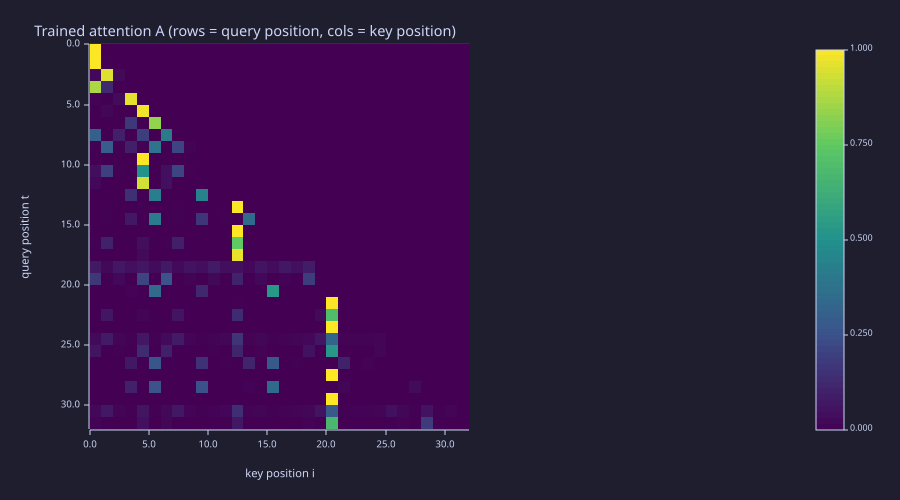
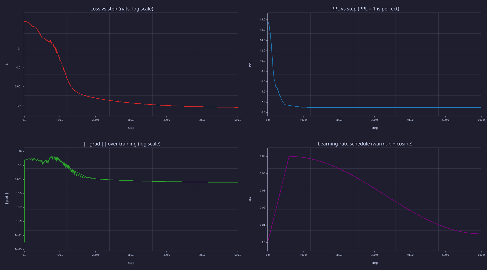

<!-- Generated by rustlab-notebook — do not edit directly. -->

# Lesson 23: Putting It All Together

This is the capstone. Every prior lesson built one piece — characters, softmax, embeddings, attention, the transformer block, backpropagation, AdamW, BPE, perplexity, sampling, the KV cache, and the full backward pass. This lesson runs them all in one place and watches a tiny single-block transformer **learn**.

The corpus is the periodic phrase `"the cat sat on the mat "` repeated four times. After BPE tokenisation, training the full architecture end-to-end with the analytical backward pass from [22-full-backprop-through-the-block](22-full-backprop-through-the-block.md), and sampling, the model reproduces the corpus exactly — and it does so by resolving an ambiguity that no bigram model can: after the token `"at "` the next token is `"s"`, `"o"`, or `"the c"` depending on whether this is `"cat"`, `"sat"`, or `"mat"`, which requires looking one token back.

## Learning Objectives

- See **every component from Lessons 01–22 composed in one notebook** — tokens, BPE, transformer block forward + backward, AdamW with warmup+cosine, perplexity, all four sampling strategies.
- Watch a single-block transformer **learn to reproduce a periodic corpus** that a bigram model cannot solve.
- Verify the **context-beats-bigram** claim quantitatively: the full transformer reaches $\mathrm{PPL} \approx 1.00008$, versus the optimal-bigram floor of $\approx 1.47$ on the same corpus and the same BPE tokenisation.
- Recognise the **mode-collapse → resolution** pattern: bigram greedy collapses to a 2-cycle ([21-sampling-and-generation](21-sampling-and-generation.md) demo); attention resolves it (this lesson).

## Background

You have built and seen run:

| Lesson | What it contributed |
|---|---|
| [01-tokens-and-encoding](01-tokens-and-encoding.md) | character → integer-id mapping |
| [02-probability-and-softmax](02-probability-and-softmax.md) | softmax to convert logits to a next-token distribution |
| [03-cross-entropy-loss](03-cross-entropy-loss.md) | $\mathcal{L} = -\log P_\theta(x_{t+1} \mid x_{\le t})$ as training objective |
| [04-embeddings-and-similarity](04-embeddings-and-similarity.md) | the trainable embedding matrix $\mathbf{E}$ |
| [05-bigram-language-model](05-bigram-language-model.md) | the bigram baseline and CDF sampling |
| [06-linear-layers-and-gradient-descent](06-linear-layers-and-gradient-descent.md) | linear layer + gradient descent |
| [07-context-and-naive-averaging](07-context-and-naive-averaging.md) | why a context-1 model fails and the causal mixing matrix |
| [08-scaled-dot-product-attention](08-scaled-dot-product-attention.md) | self-attention with causal mask |
| [09-multi-head-attention](09-multi-head-attention.md) | parallel heads, concatenate, project |
| [10-positional-encoding](10-positional-encoding.md) | sinusoidal positional embeddings |
| [11-feed-forward-block](11-feed-forward-block.md) | position-wise FFN with GELU |
| [12-layer-norm-and-residuals](12-layer-norm-and-residuals.md) | LayerNorm + residual stream |
| [13-transformer-block](13-transformer-block.md) | block = MHA + FFN with Pre-LN + residuals |
| [14-full-gpt-architecture](14-full-gpt-architecture.md) | full GPT wiring + parameter count |
| [15-backpropagation](15-backpropagation.md) | chain rule through every layer |
| [16-adamw-optimizer](16-adamw-optimizer.md) | AdamW with decoupled weight decay |
| [17-learning-rate-scheduling](17-learning-rate-scheduling.md) | warmup + cosine decay |
| [18-training-loop](18-training-loop.md) | forward / backward / optimiser / log |
| [19-byte-pair-encoding](19-byte-pair-encoding.md) | the BPE merge algorithm |
| [20-perplexity-and-evaluation](20-perplexity-and-evaluation.md) | PPL as evaluation metric |
| [21-sampling-and-generation](21-sampling-and-generation.md) | autoregressive loop + sampling strategies + KV cache |
| [22-full-backprop-through-the-block](22-full-backprop-through-the-block.md) | analytical backward through one block — what makes this end-to-end |

The forward/backward library (`lib/transformer.rlab`) and the sampling helpers (`lib/sampling.rlab`) are the shared code from Lessons 21 and 22; this notebook and `capstone.rlab` pull them in with `run`.

## What This Lesson Trains End-to-End

The capstone trains the **full single-block transformer** end-to-end with analytical gradients — 300 parameters total: token embedding $\mathbf{E}$ ($18 \times 4 = 72$), Pre-LN scales and biases ($4 \times 4 = 16$), Q/K/V/O projections ($4 \times 16 = 64$), FFN $\mathbf{W}_1, \mathbf{b}_1, \mathbf{W}_2, \mathbf{b}_2$ ($32 + 8 + 32 + 4 = 76$), and LM head $\mathbf{W}_U$ ($4 \times 18 = 72$). Sinusoidal positional embeddings are fixed (not trainable). The model is deliberately tiny so that every number can be checked by hand; the recipe scales transparently to LLaMA dimensions.

> [!IMPORTANT]
> "Mini-GPT" here means **the full GPT recipe applied to a small model**. Every component — char tokens, BPE, embeddings, attention, FFN, LN, residuals, AdamW, warmup+cosine, PPL, sampling, full backprop — is from the curriculum, with no black boxes. Every choice scales transparently to a real LLM. Only the numbers change.

## Walkthrough

### 1. Tokenise the corpus

### Theory

The phrase `"the cat sat on the mat "` (23 chars, trailing space) is repeated 4 times, then tokenised character-by-character into the 10-symbol base vocabulary `{ , a, c, e, h, m, n, o, s, t}` — [01-tokens-and-encoding](01-tokens-and-encoding.md) exactly, 92 character ids. Then BPE ([19-byte-pair-encoding](19-byte-pair-encoding.md)) is applied for 8 merges; each merge replaces the most frequent adjacent pair with a new id.

### Example — Character ids and eight BPE merges

```rustlab
char_names = {" ", "a", "c", "e", "h", "m", "n", "o", "s", "t"};
n_base_chars = 10;
phrase = "the cat sat on the mat ";
n_reps = 4;
L_total = length(phrase) * n_reps;
char_seq = zeros(L_total);
k = 1;
for r = 1:n_reps
  for i = 1:length(phrase)
    char_seq(k) = char_id(phrase(i));
    k = k + 1;
  end
end
print("phrase:", phrase, " repeated", n_reps, "times -> total chars =", L_total);

n_merges = 8;
cur_seq = char_seq;
cur_vocab = n_base_chars;
for m = 1:n_merges
  step = bpe_step(cur_seq, cur_vocab);
  print("Merge", m, " pair (", step.a, ",", step.b, ") count =", step.count, "  new_id =", step.vocab, " seq len =", length(step.seq));
  cur_seq = step.seq;
  cur_vocab = step.vocab;
end
tokens = cur_seq;
vocab = cur_vocab;
T = length(tokens);
[lp, rp] = compute_merge_table(char_seq, n_base_chars, n_merges);
print("After", n_merges, "merges: vocab =", vocab, "  seq length =", T);
print("tokens:", tokens);
```

<!-- rustlab:output-start -->
```text
phrase: the cat sat on the mat   repeated 4 times -> total chars = 92
Merge 1  pair ( 10 , 1 ) count = 12   new_id = 11  seq len = 80
Merge 2  pair ( 2 , 11 ) count = 12   new_id = 12  seq len = 68
Merge 3  pair ( 4 , 1 ) count = 8   new_id = 13  seq len = 60
Merge 4  pair ( 10 , 5 ) count = 8   new_id = 14  seq len = 52
Merge 5  pair ( 14 , 13 ) count = 8   new_id = 15  seq len = 44
Merge 6  pair ( 7 , 1 ) count = 4   new_id = 16  seq len = 40
Merge 7  pair ( 15 , 3 ) count = 4   new_id = 17  seq len = 36
Merge 8  pair ( 15 , 6 ) count = 4   new_id = 18  seq len = 32
After 8 merges: vocab = 18   seq length = 32
tokens: [1×32]  17.000000  12.000000  9.000000  12.000000  8.000000  16.000000  18.000000  12.000000  ... (32 total)
```

<!-- rustlab:output-end -->

After 8 merges the sequence is 32 tokens long (down from 92 chars) and the vocabulary has 18 entries, including word-fragment tokens such as `"the c"` (id 17) and `"the m"` (id 18) — the model now operates at a subword level. The merge ids follow the table above: `11 = "t "`, `12 = "at "`, `13 = "e "`, `14 = "th"`, `15 = "the "`, `16 = "n "`, `17 = "the c"`, `18 = "the m"`.

### Example — The bigram floor these tokens impose

Before training anything, compute the best score any *context-1* (bigram) model could achieve on this exact token sequence. That number is the bar the full transformer has to clear.

```rustlab
counts = zeros(vocab, vocab);
for t = 1:(T - 1)
  counts(tokens(t), tokens(t + 1)) = counts(tokens(t), tokens(t + 1)) + 1;
end

% Optimal bigram assigns P(next | curr) = count(curr, next) / row-sum.
% Its cross-entropy is -mean log P(next | curr) over all T-1 transitions.
ce_floor = 0.0;
for t = 1:(T - 1)
  curr = tokens(t); nxt = tokens(t + 1);
  p_bigram = counts(curr, nxt) / sum(counts(curr, :));
  ce_floor = ce_floor - log(p_bigram);
end
ce_floor = ce_floor / (T - 1);
ppl_floor = exp(ce_floor);
print("optimal-bigram CE (nats):", ce_floor);
print("optimal-bigram PPL floor:", ppl_floor);
```

<!-- rustlab:output-start -->
```text
optimal-bigram CE (nats): 0.38679536276834264
optimal-bigram PPL floor: 1.4722551822198788
```

<!-- rustlab:output-end -->

Every current token predicts its successor deterministically **except token 12 (`"at "`)**, which is followed by three different tokens across the corpus: `"s"` (in `"sat"`, 4 times), `"o"` (in `"on"`, 4 times), and `"the c"` (wrapping into the next phrase, 3 times). A bigram conditions only on the current token, so it cannot see *which* `"at "` it is looking at; the best it can do is hedge with $P = (4/11,\, 4/11,\, 3/11)$. Those 11 ambiguous transitions cost $H(4/11, 4/11, 3/11) \approx 1.09$ nats each; the other 20 are free, so the mean cross-entropy is $\tfrac{11}{31} \cdot 1.09 = 0.3868$ nats, giving $\mathrm{PPL}_{\text{floor}} = 1.4723$. **That is the number attention has to beat.**

### 2. Train

### Theory

600 AdamW steps with the warmup+cosine schedule ([17-learning-rate-scheduling](17-learning-rate-scheduling.md)) on the **full transformer forward pass** from [14-full-gpt-architecture](14-full-gpt-architecture.md) and the **analytical backward pass** from [22-full-backprop-through-the-block](22-full-backprop-through-the-block.md). Every parameter receives a gradient: token embedding $\mathbf{E}$, both LayerNorm scales/biases, the four attention projections $\mathbf{W}_Q, \mathbf{W}_K, \mathbf{W}_V, \mathbf{W}_O$, FFN weights and biases, and the LM head $\mathbf{W}_U$. Parameters are snapshotted at steps 0, 100, 300, and 600 for the generation gallery.

There is no train/val split in this capstone — the corpus is periodic with period 8 tokens, and once positional embeddings are involved, any held-out positions are PE-out-of-distribution, not a useful overfitting signal. [18-training-loop](18-training-loop.md) and [20-perplexity-and-evaluation](20-perplexity-and-evaluation.md) demonstrate the train/val pattern at appropriate scale; here we train on every prediction position.

### Example — Initialise the model and train with checkpoints

```rustlab
seed(22);
d_model = 4;
d_ff = 8;
T_max = T + 16;     % PE table large enough for any generation prefix

E = randn(vocab, d_model) * 0.3;
PE = sinusoidal_pe(T_max, d_model);
gamma1 = ones(d_model);   beta1 = zeros(d_model);
gamma2 = ones(d_model);   beta2 = zeros(d_model);
Wq = randn(d_model, d_model) * 0.3;
Wk = randn(d_model, d_model) * 0.3;
Wv = randn(d_model, d_model) * 0.3;
Wo = randn(d_model, d_model) * 0.3;
W1 = randn(d_model, d_ff) * 0.3;  b1f = zeros(d_ff);
W2 = randn(d_ff, d_model) * 0.3;  b2f = zeros(d_model);
W_U = randn(d_model, vocab) * 0.3;
P = struct("E", E, "PE", PE, "gamma1", gamma1, "beta1", beta1, "gamma2", gamma2, "beta2", beta2, ...
           "Wq", Wq, "Wk", Wk, "Wv", Wv, "Wo", Wo, "W1", W1, "b1f", b1f, "W2", W2, "b2f", b2f, "W_U", W_U);
n_params = vocab * d_model + 4 * d_model + 4 * d_model * d_model + 2 * d_model * d_ff + d_ff + d_model + d_model * vocab;
print("vocab:", vocab, "  d_model:", d_model, "  d_ff:", d_ff, "  params:", n_params);

n_pairs = T - 1;
mask_train = ones(T - 1);
n_train = 600;  T_w = 60;  eta_max = 0.05;  eta_min = 0.005;
bet1 = 0.9;  bet2 = 0.999;  eps_a = 1e-8;
[M, V] = adamw_init(P);

loss_curve = zeros(n_train + 1);
ppl_curve  = zeros(n_train + 1);
gnorm      = zeros(n_train + 1);
lr_curve   = zeros(n_train + 1);
loss_curve(1) = mean_loss(1, n_pairs, tokens, P);
ppl_curve(1) = exp(loss_curve(1));
P_ck0 = P;
for step = 1:n_train
  eta_t = warmup_cosine(step, n_train, T_w, eta_max, eta_min);
  lr_curve(step + 1) = eta_t;
  [lo, L, cache] = transformer_forward(tokens, mask_train, P);
  dl = ce_dlogits(tokens, mask_train, lo, cache.total);
  G = transformer_backward(tokens, dl, cache, P);
  gnorm(step + 1) = grad_norm(G);
  [P, M, V] = adamw_step(P, G, M, V, eta_t, step, bet1, bet2, eps_a, 0.0);
  loss_curve(step + 1) = mean_loss(1, n_pairs, tokens, P);
  ppl_curve(step + 1) = exp(loss_curve(step + 1));
  if step == 100
    P_ck1 = P;
  elseif step == 300
    P_ck2 = P;
  elseif step == 600
    P_ck3 = P;
  end
end
print("Initial L =", loss_curve(1), "  PPL =", ppl_curve(1), "  (log(vocab) =", log(vocab), "is the uniform baseline)");
print("Final   L =", loss_curve(n_train + 1), "  PPL =", ppl_curve(n_train + 1));
```

<!-- rustlab:output-start -->
```text
vocab: 18   d_model: 4   d_ff: 8   params: 300
Initial L = 2.8724045210395035   PPL = 17.67947780822632   (log(vocab) = 2.8903717578961645 is the uniform baseline)
Final   L = 0.00008169636170878258   PPL = 1.0000816996989474
```

<!-- rustlab:output-end -->

Loss drops from $2.872$ (≈ $\log |\mathcal{V}| = 2.890$, the uniform-random baseline) to $8.17e-05$, equivalently $\mathrm{PPL} = 1.00008$. The model assigns probability $\approx 1$ to the correct next token at every position — perfect except for floating-point noise — and the bigram floor of $1.4723$ is decisively beaten.

### 3. Generate at checkpoints

### Theory

Four snapshots — at steps 0, 100, 300, 600 — capture how the model's output evolves. The prompt is token 17 (`"the c"`), the natural start of every phrase in the corpus. Generation recomputes the full forward pass on the growing prefix at each step (no KV cache here; the cached version is `kv_cache.rlab` in [21-sampling-and-generation](21-sampling-and-generation.md)).

### Example — Checkpoint gallery

```rustlab
prompt_id = 17;
n_gen = 16;
print("step   0 greedy : '", decode_seq(greedy_gen(prompt_id, n_gen, P_ck0), lp, rp, char_names), "'");
print("step 100 greedy : '", decode_seq(greedy_gen(prompt_id, n_gen, P_ck1), lp, rp, char_names), "'");
print("step 300 greedy : '", decode_seq(greedy_gen(prompt_id, n_gen, P_ck2), lp, rp, char_names), "'");
print("step 600 greedy : '", decode_seq(greedy_gen(prompt_id, n_gen, P_ck3), lp, rp, char_names), "'");
seed(101);
print("step 600 T=0.7  : '", decode_seq(temp_gen(prompt_id, n_gen, 0.7, P_ck3), lp, rp, char_names), "'");
print("step 600 T=1.0  : '", decode_seq(temp_gen(prompt_id, n_gen, 1.0, P_ck3), lp, rp, char_names), "'");
print("step 600 K=3    : '", decode_seq(topk_gen(prompt_id, n_gen, 3, 1.0, P_ck3), lp, rp, char_names), "'");
print("step 600 P=0.9  : '", decode_seq(topp_gen(prompt_id, n_gen, 0.9, 1.0, P_ck3), lp, rp, char_names), "'");
```

<!-- rustlab:output-start -->
```text
step   0 greedy : ' the cthe cthe cecat at the cthe cecthe at the cthe cec '
step 100 greedy : ' the cat sat on the mat the cat sat on the mat the c '
step 300 greedy : ' the cat sat on the mat the cat sat on the mat the c '
step 600 greedy : ' the cat sat on the mat the cat sat on the mat the c '
step 600 T=0.7  : ' the cat sat on the mat the cat sat on the mat the c '
step 600 T=1.0  : ' the cat sat on the mat the cat sat on the mat the c '
step 600 K=3    : ' the cat sat on the mat the cat sat on the mat the c '
step 600 P=0.9  : ' the cat sat on the mat the cat sat on the mat the c '
```

<!-- rustlab:output-end -->

Three things to read from the gallery. First, **by step 100 the model has already learned the full corpus structure**: greedy decoding reproduces the corpus exactly, with no mode collapse, because the model resolves the `"at "` ambiguity from context (it reads the token immediately before each `"at "`). This is the headline contrast with the bigram of [21-sampling-and-generation](21-sampling-and-generation.md): same corpus, same BPE, same training loop, attention added — and `"sat on the mat"` now appears under *greedy* decoding, not only under sampling. Second, **every sampling strategy converges to the same output at step 600** — once the model is this confident, the next-token distribution at every position is essentially one-hot, so temperature rescaling and top-K/top-P truncation are no-ops. Third, the step-0 output is gibberish heavy with `"the c"` because the random LM head happens to favour that token after most prefixes.

### 4. Read the attention pattern

### Theory

Row $t$ of the attention matrix $\mathbf{A}$ is the distribution over key positions $i \le t$ that the query at position $t$ uses ([08-scaled-dot-product-attention](08-scaled-dot-product-attention.md)). If attention is doing the disambiguation, the rows belonging to `"at "` positions should put their weight on the position immediately before them — the token that tells `"cat"`, `"sat"`, and `"mat"` apart.

### Example — Trained attention matrix

```rustlab
[logits_final, L_final, cache_final] = transformer_forward(tokens, mask_train, P_ck3);
A_trained = cache_final.A;
figure();
imagesc(A_trained, "viridis")
title("Trained attention A (rows = query position, cols = key position)")
xlabel("key position i")
ylabel("query position t")
```

<!-- rustlab:output-start -->


<!-- rustlab:output-end -->

Lower-triangular as always (causal mask), with rows summing to 1. The bright sub-diagonal band shows the head attending to the previous token — the pattern Lesson 09 called a "previous-token head", and exactly the information needed to resolve `"at "`. (Exercise 3 asks whether attention is the *only* route to that information on this fixed corpus.)

### 5. Read the diagnostics

### Example — Loss, perplexity, gradient norm, learning rate

```rustlab
steps_axis = 0:n_train;
figure();
subplot(2, 2, 1)
semilogy(steps_axis, loss_curve, "color", "red")
title("Loss vs step (nats, log scale)")
xlabel("step"); ylabel("L")
subplot(2, 2, 2)
plot(steps_axis, ppl_curve, "color", "blue")
title("PPL vs step (PPL = 1 is perfect)")
xlabel("step"); ylabel("PPL")
subplot(2, 2, 3)
semilogy(steps_axis, gnorm + 1e-12, "color", "green")
title("|| grad || over training (log scale)")
xlabel("step"); ylabel("||grad||")
subplot(2, 2, 4)
plot(steps_axis, lr_curve, "color", "purple")
title("Learning-rate schedule (warmup + cosine)")
xlabel("step"); ylabel("eta")
```

<!-- rustlab:output-start -->


<!-- rustlab:output-end -->

- **Loss** — drops from ~2.9 at step 0 to ~$10^{-4}$ by step 600; on the log axis the warm-up transient, the long exponential decline, and the round-off floor are all visible.
- **PPL** — same shape on the natural y-scale; ends at 1.00008. The "effective branching factor" interpretation says the model has reduced the choice from 18 possibilities to ~1.
- **Gradient norm** — drops from $\sim 10^{-1}$ to $\sim 10^{-4}$ over training. Healthy "decrease over time" from [18-training-loop](18-training-loop.md).
- **Learning rate** — warmup + cosine envelope from [17-learning-rate-scheduling](17-learning-rate-scheduling.md).

These are the four plots a production training run would also show. Reading them is the same — only the y-axis scale changes.

## What Production Adds

The capstone covers every component of an LLM **end-to-end with analytical gradients**. A production trainer adds infrastructure on top:

- **Mini-batching.** The capstone uses one full-batch gradient per step on a 32-token corpus. Real training samples millions of tokens per batch and uses gradient accumulation across micro-batches.
- **Mixed precision** (fp16 / bf16). Forward in low precision, accumulate in fp32. Cuts memory and time by ~2×.
- **Gradient clipping.** A `max_norm = 1.0` clip step ([18-training-loop](18-training-loop.md) sidebar) prevents single-step divergence on outlier batches.
- **Dropout.** Stochastic activation zeroing during training ([13-transformer-block](13-transformer-block.md) sidebar) — small effect on small models, important at scale.
- **Distributed training.** Data-parallel and tensor-parallel splits across many GPUs; the only architectural addition is the inter-GPU all-reduce on gradients.
- **Real corpora.** Wikipedia + Common Crawl + code, hundreds of billions of tokens, tokenised once and held in a memory-mapped file.
- **Multi-layer stacks and multi-head attention.** The capstone runs one block with one head. LLaMA-2-7B runs 32 blocks with 32 heads. The forward/backward library generalises by adding outer loops; the math is identical.
- **KV cache for inference.** Generation here recomputes the full forward pass on the growing prefix every step — $O(T^3)$ total. With the KV cache from [21-sampling-and-generation](21-sampling-and-generation.md) this becomes $O(T^2)$.
- **Modern variants.** RoPE / RMSNorm / SwiGLU / GQA from [24-modern-architectural-variants](24-modern-architectural-variants.md) — each a local swap against the baseline used here.

Every one of those is an engineering or substitution layer over the math the capstone already builds. **The reverse — a production trainer that wires up infrastructure but gets the math wrong — fails silently and is far harder to debug.** The understanding compounds the way the model's loss does.

## Key Takeaways

- The capstone composes **Lessons 01–22** into a single run that trains a single-block transformer end-to-end with analytical gradients.
- Loss drops from $\approx 2.87$ (uniform over 18 tokens) to $\approx 8 \times 10^{-5}$ — **PPL = 1.00008**, essentially the lower bound.
- **Context beats a bigram on this corpus**: the optimal-bigram floor is PPL $\approx 1.47$ (CE $= 0.3868$ nats) because `"at "` is followed by three different tokens (`"s"`, `"o"`, `"the c"`) and a bigram cannot tell them apart; the transformer resolves it by looking one token back. On a *fixed* corpus the positional embedding provides a second, independent route to the same disambiguation — see Exercise 3.
- **Greedy decoding reproduces the corpus** — no mode collapse — because the model's distribution is essentially one-hot at every position. All sampling strategies (temperature, top-K, top-P) converge to the same output for the same reason.
- The four diagnostic plots (loss, PPL, gradient norm, LR) are exactly what a production run reports.
- Scaling to a real LLM swaps the model size, the corpus, the precision, and the training scale — not the underlying math.

## Standalone Scripts

| Script | What it computes |
|---|---|
| `capstone.rlab` | Full end-to-end on the periodic `"the cat sat on the mat "` corpus: char-tokenise → BPE merge (Lesson 19) → full transformer forward + analytical backward (Lessons 13, 14, 15, 22) → AdamW + warmup-cosine training (Lessons 16, 17, 18) → checkpoint sampling gallery (Lesson 21) → diagnostic plots (Lessons 17, 18, 20). Pulls the shared library in with `run "../../lib/transformer.rlab"` and `run "../../lib/sampling.rlab"`. |

Run with `make lesson-23` (or `rustlab run lessons/23-putting-it-all-together/capstone.rlab`).

## Expected Numerical Outputs Summary

| Variable | Expected Value |
|---|---|
| Char vocab size | $10$ |
| `L_total` (initial char sequence length) | $92$ ($23 \times 4$) |
| `n_merges` | $8$ |
| `vocab` (final vocab size) | $18$ |
| `T` (final token sequence length) | $32$ |
| `n_params` | $300$ (full single-block transformer at $d_{\text{model}} = 4, d_{\text{ff}} = 8$) |
| `loss_curve(1)` (initial loss) | $\approx 2.87$ (≈ $\log 18 = 2.89$ uniform baseline) |
| `loss_curve(601)` (final loss) | $\approx 8.2 \times 10^{-5}$ |
| `ppl_curve(601)` (final PPL) | $\approx 1.00008$ |
| `ppl_floor` (optimal-bigram floor on the 32-token BPE sequence) | $1.4723$ (CE $= 0.3868$ nats) |
| step-100 greedy from `"the c"` | `"the cat sat on the mat the cat sat on the mat the c"` (corpus reproduced) |
| step-600 greedy / T=0.7 / T=1.0 / K=3 / P=0.9 | all identical — corpus reproduced exactly |

## Exercises

1. **Why no mode collapse?** Examine the trained attention pattern `A_trained` at a position whose current token is `"at "` (id 12) — the only token with an ambiguous successor. Which earlier position carries the disambiguating information, and is it attended to with high weight? Hint: it is the token *immediately before* `"at "` (one position back) — `"the c"`, `"s"`, or `"the m"` — which uniquely determines the continuation.
2. **Bigram floor analytically.** Using the transition counts from §1, show by hand that a context-1 model must assign $P(\cdot \mid \text{"at "}) = (4/11, 4/11, 3/11)$ over $(\text{"s"}, \text{"o"}, \text{"the c"})$, that every other current token has a deterministic successor, and that the mean cross-entropy over all 31 transitions is therefore $\tfrac{11}{31}\,H(4/11, 4/11, 3/11) = 0.3868$ nats — i.e. $\mathrm{PPL}_{\text{floor}} = 1.4723$. Confirm against the printed value.
3. **What actually forces the bigram floor?** Disabling attention alone — replace `H_mid = H_in + proj` with `H_mid = H_in` in a copy of `transformer_forward` and re-train — does *not* recover the bigram floor: the model still drives to PPL $\approx 1.0$. The reason is the fixed sinusoidal positional embedding, which makes all 32 positions distinct, so the FFN can memorise a position→next-token map on this fixed corpus — a route that has nothing to do with attention. To genuinely reduce the model to context-1, ablate **both** attention and the positional embedding (also set `P.PE = zeros(T_max, d_model)`). Now the model sees only the current token embedding, is architecturally bigram-limited, and should floor near PPL $\approx 1.47$. Extension: ablate attention *only* and watch PPL still fall toward 1 — direct evidence that on a fixed corpus positional encoding is a second, independent route to the answer.
4. **More merges.** Re-run with $n_{\text{merges}} = 20$ instead of 8. The vocabulary grows; what happens to the sequence length and the final PPL? Past how many merges does PPL stop improving?
5. **Longer corpus.** Change `n_reps` from 4 to 10. Does the loss curve shape change? With more training pairs but the same parameter count, does the model still memorise perfectly?
6. **Different prompt.** Generate from prompt = 12 (= `"at "`), which appears 12 times in the corpus. Does greedy produce a coherent continuation? Hint: position-in-corpus matters — the model uses positional embeddings, so the same input token at different positions may continue differently.

## What's next

You have built every component of a GPT-style language model from first principles and trained one end to end. Two lessons remain:

- **Modern architectural variants** ([24-modern-architectural-variants](24-modern-architectural-variants.md)) — RoPE, RMSNorm, SwiGLU, GQA. Drop-in swaps against the baseline used here.
- **Fine-tuning and preference optimisation** ([25-fine-tuning-sft-and-dpo](25-fine-tuning-sft-and-dpo.md)) — SFT with prompt masking and DPO with a frozen reference policy. Uses the same forward/backward library as this capstone.

Then **scale up** — move to a real corpus (TinyShakespeare, Wikipedia, code); increase $d_{\text{model}}$, $N$, and $|\mathcal{V}|$; the infrastructure layer is in [What Production Adds](#what-production-adds) — and **read [nanoGPT](https://github.com/karpathy/nanoGPT)**: the 300 lines of Python in `nanoGPT/model.py` are exactly the architecture in [14-full-gpt-architecture](14-full-gpt-architecture.md), written in PyTorch. You now know what every line means.
