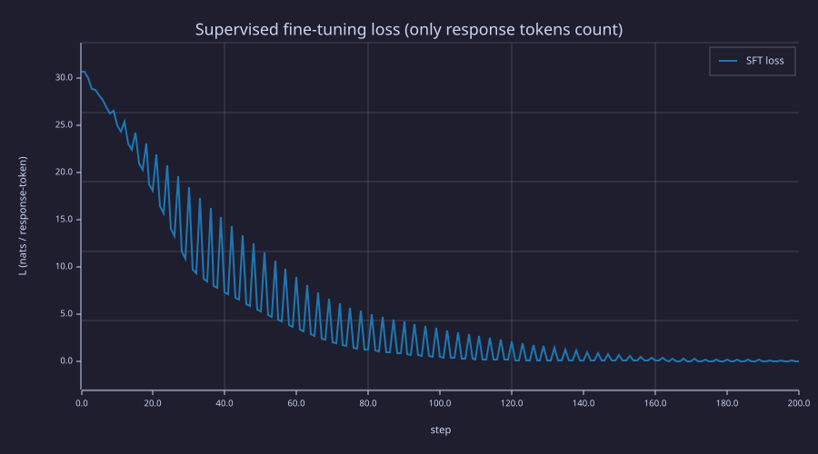
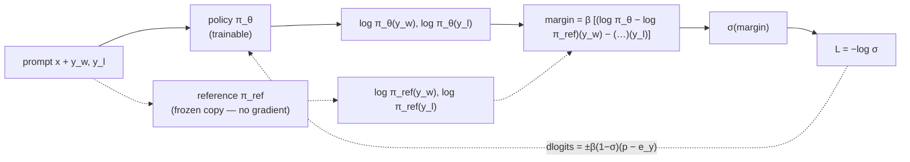
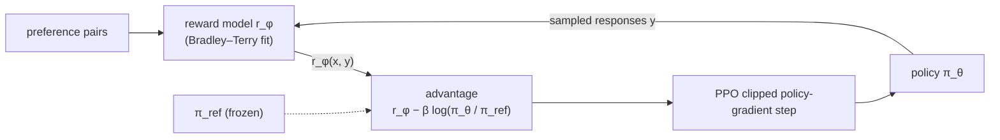
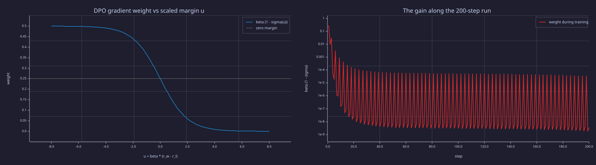
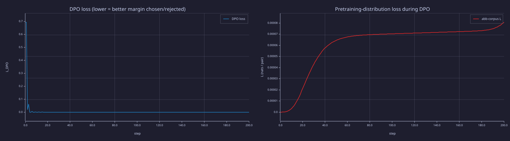
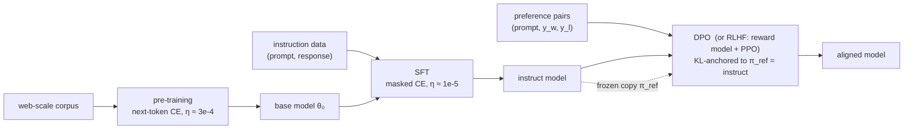

<!-- Generated by rustlab-notebook — do not edit directly. -->

# Lesson 25: Fine-Tuning — SFT and DPO

[22-full-backprop-through-the-block](22-full-backprop-through-the-block.md) built and verified the full backward pass through one transformer block, and [23-putting-it-all-together](23-putting-it-all-together.md) used it to pre-train a model from scratch. This lesson uses the same machinery — `lib/transformer.rlab`, unchanged — to demonstrate the two fine-tuning paradigms that turn a pre-trained model into a useful one:

1. **Supervised fine-tuning (SFT)**: continue training on instruction-formatted data with loss-masked prompts — and watch it erase the pre-training task (**catastrophic forgetting**), measured as the angle between two gradients.
2. **Direct preference optimization (DPO)**: derive the loss in six lines from a KL-regularised objective, then contrast a trainable policy against a frozen reference on preference pairs — and watch the reference term hold the pre-training task in place.

## Learning Objectives

- Implement **supervised fine-tuning** with prompt-token loss masking, recognise the **catastrophic forgetting** it produces, and measure it as **gradient interference** — the cosine between the fine-tuning and pre-training gradients.
- Derive **DPO** from the KL-regularised reward objective (Gibbs tilt of the reference, reward inverted out, Bradley–Terry cancelling the partition function); read $\beta$ as an inverse temperature and the frozen reference as the KL anchor.
- Implement DPO with a frozen reference policy, see why the reference term curbs forgetting, and recognise likelihood displacement in the numbers.
- Place pre-training, SFT, DPO and RLHF in the standard training stack, and read LoRA and replay as restrictions of the update subspace.

## Background

- The shared forward/backward library and the `abb` corpus from [22-full-backprop-through-the-block](22-full-backprop-through-the-block.md).
- AdamW + warmup-cosine training from [16-adamw-optimizer](16-adamw-optimizer.md) (in particular that the first Adam step is $\eta \cdot \text{sign}(g)$ per coordinate), [17-learning-rate-scheduling](17-learning-rate-scheduling.md), and [18-training-loop](18-training-loop.md).
- Cross-entropy and KL divergence from [03-cross-entropy-loss](03-cross-entropy-loss.md); softmax as a Gibbs distribution with temperature from [02-probability-and-softmax](02-probability-and-softmax.md).

## Shared Setup: Initialise and Pre-train

### Theory

Both fine-tuning demos start from the same place: a single-block transformer pre-trained on the period-3 `abb` corpus of [22-full-backprop-through-the-block](22-full-backprop-through-the-block.md), with a vocabulary of three tokens (`a`, `b`, and a separator `sep` that never appears in pre-training data). Two helpers keep the code below short: `init_params` draws the parameters in the same order as the standalone scripts, and `pretrain_abb` runs the AdamW warmup-cosine loop from Lesson 22.

### Example — Helpers

```rustlab
function P = init_params(vocab, d_model, d_ff, T_max)
  E = randn(vocab, d_model) * 0.3;
  PE = sinusoidal_pe(T_max, d_model);
  gamma1 = ones(d_model);   beta1 = zeros(d_model);
  gamma2 = ones(d_model);   beta2 = zeros(d_model);
  Wq = randn(d_model, d_model) * 0.3;
  Wk = randn(d_model, d_model) * 0.3;
  Wv = randn(d_model, d_model) * 0.3;
  Wo = randn(d_model, d_model) * 0.3;
  W1 = randn(d_model, d_ff) * 0.3;  b1f = zeros(d_ff);
  W2 = randn(d_ff, d_model) * 0.3;  b2f = zeros(d_model);
  W_U = randn(d_model, vocab) * 0.3;
  P = struct("E", E, "PE", PE, "gamma1", gamma1, "beta1", beta1, "gamma2", gamma2, "beta2", beta2, ...
             "Wq", Wq, "Wk", Wk, "Wv", Wv, "Wo", Wo, "W1", W1, "b1f", b1f, "W2", W2, "b2f", b2f, "W_U", W_U);
end

function P = pretrain_abb(P, ids_pre, mask_pre, n_steps, T_w)
  [M, V] = adamw_init(P);
  for step = 1:n_steps
    eta_t = warmup_cosine(step, n_steps, T_w, 0.05, 0.005);
    [lo, L, cache] = transformer_forward(ids_pre, mask_pre, P);
    dl = ce_dlogits(ids_pre, mask_pre, lo, cache.total);
    G = transformer_backward(ids_pre, dl, cache, P);
    [P, M, V] = adamw_step(P, G, M, V, eta_t, step, 0.9, 0.999, 1e-8, 0.0);
  end
end

vocab = 3;             % a=1, b=2, sep=3
d_model = 4;  d_ff = 8;  T_max = 16;
pat = [1, 2, 2];
T_pre = 12;
ids_pre = zeros(T_pre);
for i = 1:T_pre
  ids_pre(i) = pat(mod(i - 1, 3) + 1);
end
mask_pre = ones(T_pre - 1);
```

## Supervised Fine-Tuning (SFT)

### Theory

SFT is **same architecture, same loss, different data**. The pre-trained checkpoint becomes the initialisation for a new training run on **prompt-response** sequences:

$$\mathcal{L}_{\text{SFT}} = -\frac{1}{|R|} \sum_{t \in R} \log P_\theta(x_{t+1} \mid x_{\le t})$$

where $R$ is the set of positions inside the **response** (not the prompt). Prompt positions contribute zero to the loss — they exist only as context for the response predictions. The mechanism is a **loss mask**: a binary vector that gates which positions appear in the loss and, through `ce_dlogits`, in the upstream gradient.

The justification: at inference time the user provides the prompt; the model only needs to generate the response. We do not want to train the model to *predict the prompt*, only to *respond to it*.

**Why a smaller learning rate.** With AdamW the first step moves *every* coordinate by $\eta \cdot \text{sign}(g)$ whatever the gradient's size ([16-adamw-optimizer](16-adamw-optimizer.md): $\hat{m}/\sqrt{\hat{v}} = \text{sign}(g)$ at $t = 1$), and later steps stay near $\pm\eta$ per coordinate — so $\eta$ is the per-step drift in parameter space and $n\eta$ bounds the total. Pre-training used $\eta_{\max} = 0.05$; fine-tuning uses $\eta = 0.001$, fifty times smaller, so 200 steps can move each weight by at most about $0.2$. That slows the drift away from the pre-trained solution; it does not stop it, as the probe shows.

### Catastrophic Forgetting

A subtlety: even with loss masking, every parameter still receives a gradient. The response-position predictions depend (via attention) on every prefix token, so the gradient back through attention touches $\mathbf{W}_Q, \mathbf{W}_K, \mathbf{W}_V$, the embedding $\mathbf{E}$, the LayerNorm scales — everything. Those changes alter the model's behaviour on **other** distributions too. The probe below measures exactly that: the `abb`-corpus loss before and after SFT.

### Example — Pre-train, then SFT with loss masking

Three formatted sequences, each `[tok1, tok2, sep, response, response]` with response `aa`; the mask `[0, 0, 1, 1]` scores only the two response predictions.

```rustlab
seed(241);
P = init_params(vocab, d_model, d_ff, T_max);
P = pretrain_abb(P, ids_pre, mask_pre, 600, 60);
[lo, L_eval_pre, cache] = transformer_forward(ids_pre, mask_pre, P);
print("Pre-SFT abb-corpus L:", L_eval_pre);
P_pre_sft = P;             % keep the pre-trained point for the probes below

sft_data = [1, 2, 3, 1, 1;
            2, 2, 3, 1, 1;
            2, 1, 3, 1, 1];
sft_mask = [0, 0, 1, 1];
n_sft_seq = size(sft_data)(1);

n_sft = 200;
eta_sft = 0.001;           % lower than pre-training — standard practice
sft_loss_curve = zeros(n_sft + 1);
[lo, L_sft0, cache] = transformer_forward(sft_data(1, :), sft_mask, P);
sft_loss_curve(1) = L_sft0;
[M, V] = adamw_init(P);    % fresh optimiser state for the fine-tuning phase
for step = 1:n_sft
  seq = sft_data(mod(step - 1, n_sft_seq) + 1, :);      % round-robin
  [lo, L, cache] = transformer_forward(seq, sft_mask, P);
  sft_loss_curve(step + 1) = L;
  dl = ce_dlogits(seq, sft_mask, lo, cache.total);
  G = transformer_backward(seq, dl, cache, P);
  [P, M, V] = adamw_step(P, G, M, V, eta_sft, step, 0.9, 0.999, 1e-8, 0.0);
end
print("Final SFT L:", sft_loss_curve(n_sft + 1));

% (a) Does the model produce response "a" after every prompt + sep?
for s = 1:n_sft_seq
  p = next_token_dist(sft_data(s, 1:3), P);
  print("  prompt =", sft_data(s, 1:3), " -> P(. | prompt) =", p, " argmax =", argmax(p));
end

% (b) Catastrophic-forgetting probe on the pre-training distribution.
[lo, L_eval_post, cache] = transformer_forward(ids_pre, mask_pre, P);
print("abb-corpus L: pre-SFT =", L_eval_pre, "  post-SFT =", L_eval_post, "  delta =", L_eval_post - L_eval_pre);
P_sft = P;                 % the fine-tuned policy, kept for the Information lens
```

<!-- rustlab:output-start -->
```text
Pre-SFT abb-corpus L: 0.000020026465395637668
Final SFT L: 0.01807754856437737
  prompt = [1×3]  1.000000  2.000000  3.000000  -> P(. | prompt) = [1×3]  0.996978  0.003017  0.000006  argmax = 1
  prompt = [1×3]  2.000000  2.000000  3.000000  -> P(. | prompt) = [1×3]  0.996971  0.003024  0.000006  argmax = 1
  prompt = [1×3]  2.000000  1.000000  3.000000  -> P(. | prompt) = [1×3]  0.999490  0.000460  0.000051  argmax = 1
abb-corpus L: pre-SFT = 0.000020026465395637668   post-SFT = 2.8374723631557957   delta = 2.8374523366904
```

<!-- rustlab:output-end -->

The SFT objective is solved: every prompt is answered with `a` at confidence $> 0.99$ and the SFT loss falls to $0.018$. The price is paid on the pre-training distribution: the `abb`-corpus loss rises from $2.0e-05$ to $2.84$ nats. The model has effectively *forgotten* the pretraining task. This is **catastrophic forgetting** — the most-cited problem with vanilla SFT — and it motivates the techniques typically applied alongside it: LoRA, KL regularisation to the pretrained policy, replay of pretraining data during fine-tuning, and the DPO formulation in the next section. Before reaching for any of them, measure the mechanism.

### Example — Forgetting as gradient interference

At the pre-trained point $\theta_0$ a step $-\eta\,\mathbf{d}$ changes the `abb` loss to first order by $-\eta\,\nabla\mathcal{L}_{\text{abb}} \cdot \mathbf{d}$. With $\mathbf{d} = \nabla\mathcal{L}_{\text{SFT}}$ (plain gradient descent) or $\mathbf{d} = \text{sign}(\nabla\mathcal{L}_{\text{SFT}})$ (AdamW's first step), the sign of that change is the sign of $-\cos\angle(\nabla\mathcal{L}_{\text{abb}}, \mathbf{d})$: a negative cosine means the SFT step *climbs* the pre-training loss from its very first move. Flatten both gradient structs field by field and measure the angle — overall and per parameter block.

```rustlab
function g = flat_grad(G)
  g = [reshape(G.E, 1, numel(G.E)), G.gamma1, G.beta1, G.gamma2, G.beta2, ...
       reshape(G.Wq, 1, numel(G.Wq)), reshape(G.Wk, 1, numel(G.Wk)), ...
       reshape(G.Wv, 1, numel(G.Wv)), reshape(G.Wo, 1, numel(G.Wo)), ...
       reshape(G.W1, 1, numel(G.W1)), G.b1f, reshape(G.W2, 1, numel(G.W2)), G.b2f, ...
       reshape(G.W_U, 1, numel(G.W_U))];
end
function c = cos_angle(a, b)
  c = sum(a .* b) / (norm(a) * norm(b));
end
function G = grad_at(ids, mask, P)
  [lo, L, cache] = transformer_forward(ids, mask, P);
  G = transformer_backward(ids, ce_dlogits(ids, mask, lo, cache.total), cache, P);
end

g_abb = flat_grad(grad_at(ids_pre, mask_pre, P_pre_sft));
g_sft = zeros(length(g_abb));
for s = 1:n_sft_seq
  g_sft = g_sft + flat_grad(grad_at(sft_data(s, :), sft_mask, P_pre_sft)) / n_sft_seq;
end
cos_all  = cos_angle(g_abb, g_sft);
cos_adam = cos_angle(g_abb, sign(g_sft));
print("parameters:", length(g_abb), "   |grad_abb| =", norm(g_abb), "   |grad_SFT| =", norm(g_sft));
print("cos(grad_abb, grad_SFT) =", cos_all, "    cos(grad_abb, sign(grad_SFT)) [first AdamW step] =", cos_adam);

% Per weight matrix, in flat_grad's field order.
sz = [numel(P.E), 4 * d_model, numel(P.Wq), numel(P.Wk), numel(P.Wv), numel(P.Wo), numel(P.W1), d_ff, numel(P.W2), d_model, numel(P.W_U)];
hi = cumsum(sz);  lo_i = hi - sz + 1;
mat_idx = [1, 3, 4, 5, 6, 7, 9, 11];
cos_blk = zeros(8);
for i = 1:8
  cos_blk(i) = cos_angle(g_abb(lo_i(mat_idx(i)):hi(mat_idx(i))), g_sft(lo_i(mat_idx(i)):hi(mat_idx(i))));
end
print("per block [E, Wq, Wk, Wv, Wo, W1, W2, W_U]:", cos_blk);
```

<!-- rustlab:output-start -->
```text
parameters: 180    |grad_abb| = 0.0002471573388364403    |grad_SFT| = 65.31234338552362
cos(grad_abb, grad_SFT) = -0.13691347798606623     cos(grad_abb, sign(grad_SFT)) [first AdamW step] = -0.15099583395729266
per block [E, Wq, Wk, Wv, Wo, W1, W2, W_U]: [1×8]  0.450362  -0.521261  -0.686479  -0.233080  -0.515673  -0.094494  -0.149262  -0.363562
```

<!-- rustlab:output-end -->

The cosine is $-0.137$ overall and $-0.151$ against the sign direction AdamW actually takes on step 1: the first SFT step already increases the pre-training loss, and 200 of them compound to the $2.84$ nats above. Per block, every weight matrix is negative — most strongly $\mathbf{W}_K$ at $-0.69$ — and only the embedding block is positive ($0.45$: the `a`/`b` rows move in a direction the old task likes, which does not cancel the rest). This is the picture behind the standard remedies. **Replay** mixes $\nabla\mathcal{L}_{\text{abb}}$ back into the step, rotating it into the half-space where the cosine is non-negative. **LoRA** and adapters restrict the update to a subspace — which helps exactly to the extent that the subspace is orthogonal to $\nabla\mathcal{L}_{\text{abb}}$, something the rank alone does not guarantee. The next example tests that.

### Example — Rank-1 LoRA on the LM head

LoRA freezes a weight matrix and trains a low-rank correction $\mathbf{W} + \mathbf{b}\mathbf{a}$. Rank 1 on $\mathbf{W}_U$ means $\mathbf{b} \in \mathbb{R}^{d_{\text{model}}}$, $\mathbf{a} \in \mathbb{R}^{1 \times \lvert\mathcal{V}\rvert}$ — seven trainable numbers out of $180$. The chain rule through the outer product gives $\partial\mathcal{L}/\partial\mathbf{a} = \mathbf{b}^\top\, \partial\mathcal{L}/\partial\mathbf{W}_U$ and $\partial\mathcal{L}/\partial\mathbf{b} = (\partial\mathcal{L}/\partial\mathbf{W}_U)\,\mathbf{a}^\top$, so the full backward pass is reused and only the last step changes. Start from $\mathbf{a} = 0$ (the model is initially unchanged); $\eta = 0.003$ puts the final SFT loss in the same range as full SFT's, measured the same way (mean over the three prompts).

```rustlab
P_lora = P_pre_sft;
W_U0 = P_pre_sft.W_U;
b_l = ones(d_model, 1) * 0.1;   a_l = zeros(1, vocab);       % W_U = W_U0 + b_l * a_l
ma = zeros(1, vocab);  va = ma;  mb = zeros(d_model, 1);  vb = mb;
eta_lora = 0.003;
for step = 1:n_sft
  seq = sft_data(mod(step - 1, n_sft_seq) + 1, :);
  P_lora.W_U = W_U0 + b_l * a_l;
  G = grad_at(seq, sft_mask, P_lora);
  dW = G.W_U;
  ga = b_l' * dW;   gb = dW * a_l';
  [a_l, ma, va] = adamw_update(a_l, ga, ma, va, eta_lora, step, 0.9, 0.999, 1e-8, 0.0);
  [b_l, mb, vb] = adamw_update(b_l, gb, mb, vb, eta_lora, step, 0.9, 0.999, 1e-8, 0.0);
end
P_lora.W_U = W_U0 + b_l * a_l;
L_sft_lora = 0.0;  L_sft_full = 0.0;
for s = 1:n_sft_seq
  [lo, L, cache] = transformer_forward(sft_data(s, :), sft_mask, P_lora);
  L_sft_lora = L_sft_lora + L / n_sft_seq;
  [lo, L, cache] = transformer_forward(sft_data(s, :), sft_mask, P_sft);
  L_sft_full = L_sft_full + L / n_sft_seq;
end
[lo, L_abb_lora, cache] = transformer_forward(ids_pre, mask_pre, P_lora);
print("full SFT:          ", length(g_abb), "params   mean SFT L =", L_sft_full, "   abb-corpus L =", L_eval_post);
print("rank-1 LoRA on W_U:", d_model + vocab, "params   mean SFT L =", L_sft_lora, "   abb-corpus L =", L_abb_lora);
```

<!-- rustlab:output-start -->
```text
full SFT:           180 params   mean SFT L = 0.04702859471942593    abb-corpus L = 2.8374723631557957
rank-1 LoRA on W_U: 7 params   mean SFT L = 0.011355710411406887    abb-corpus L = 2.7627089811282346
```

<!-- rustlab:output-end -->

Seven parameters solve the SFT task (mean loss $0.011$ against full SFT's $0.047$) — and the `abb` loss lands at $2.76$ nats, the same forgetting as full SFT's $2.84$. Restricting the *rank* did not restrict the *interference*: a rank-1 change to the LM head shifts the logits of every context by $(\mathbf{h}\cdot\mathbf{b})\,\mathbf{a}$, and $\mathbf{h}\cdot\mathbf{b}$ has the same sign on the `abb` contexts as on the prompts. What protects the old task is not fewer parameters but an update subspace whose cosine with $\nabla\mathcal{L}_{\text{abb}}$ is near zero — Exercise 4 builds one by hand (the `sep` embedding row, which the `abb` corpus never touches), and DPO's reference term below gets there differently, by charging for the drift itself.

### Example — SFT loss curve

```rustlab
figure();
plot(0:n_sft, sft_loss_curve, "color", "blue", "label", "SFT loss")
title("Supervised fine-tuning loss (only response tokens count)")
xlabel("step")
ylabel("L (nats / response-token)")
```

<!-- rustlab:output-start -->


<!-- rustlab:output-end -->

> [!TIP]
> The curve is the loss of the sequence trained on at each step, round-robin over three prompts, so it is a period-3 saw-tooth: one prompt lags the other two. The envelope decays from ≈ 30 nats to below 1 nat around step 120 and to ≈ 0 by the end. Nothing in this curve shows the `abb` loss climbing at the same time — the forgetting probe has to be run separately.

## Direct Preference Optimization (DPO)

### Theory

DPO (Rafailov et al., 2023) replaces SFT's "maximise the response's log-prob" with "raise the policy's preference margin between a chosen response and a rejected response, **relative to a frozen reference**". It is not an ad-hoc loss; it falls out of the alignment objective in six lines.

**Six-line derivation.** Let $x$ be a prompt, $y$ a response, $r(x, y)$ a reward, $\pi_{\text{ref}}$ the frozen pre-trained policy.

1. *The objective* (RLHF's, with the KL written explicitly): $\displaystyle \max_\pi\; \mathbb{E}_{y \sim \pi(\cdot \mid x)}[r(x, y)] - \beta\, \text{KL}\bigl(\pi(\cdot \mid x)\,\|\,\pi_{\text{ref}}(\cdot \mid x)\bigr)$ — earn reward, pay $\beta$ nats of objective per nat of divergence from the reference.
2. *Complete the logarithm*: $\displaystyle = -\beta\, \mathbb{E}_\pi\!\left[\log \frac{\pi(y \mid x)}{\pi_{\text{ref}}(y \mid x)\, e^{r(x, y)/\beta}}\right] = -\beta\, \text{KL}\bigl(\pi \,\|\, \pi^*\bigr) + \beta \log Z(x)$, where $\pi^*(y \mid x) = \pi_{\text{ref}}(y \mid x)\, e^{r(x, y)/\beta} / Z(x)$ and $Z(x) = \sum_y \pi_{\text{ref}}(y \mid x)\, e^{r(x, y)/\beta}$.
3. *Read off the optimum*: $\text{KL} \ge 0$ with equality iff $\pi = \pi^*$. The optimal policy is a **Gibbs tilt** of the reference — [02-probability-and-softmax](02-probability-and-softmax.md)'s softmax with the reward as negative energy and $\beta$ as the temperature $\tau$, i.e. $\pi^* = \text{softmax}(\log \pi_{\text{ref}} + r/\beta)$. Among all distributions with a given expected reward it is the one closest to the prior in relative entropy (Kullback's minimum discrimination information, Jaynes' maximum entropy with a prior).
4. *Invert for the reward*: $\displaystyle r(x, y) = \beta \log \frac{\pi^*(y \mid x)}{\pi_{\text{ref}}(y \mid x)} + \beta \log Z(x)$.
5. *Bradley–Terry*: preference labels are generated by $P(y_w \succ y_l \mid x) = \sigma\bigl(r(x, y_w) - r(x, y_l)\bigr)$. In the difference the prompt-only term $\beta \log Z(x)$ **cancels** — the one quantity that would have been intractable never has to be computed.
6. *Substitute the trainable policy* $\pi_\theta$ for $\pi^*$ and maximise the likelihood of the observed preferences:

$$r_\theta(x, y) = \beta \log\frac{\pi_\theta(y \mid x)}{\pi_{\text{ref}}(y \mid x)}, \qquad \mathcal{L}_{\text{DPO}}(\theta) = -\log \sigma\bigl(r_\theta(x, y_w) - r_\theta(x, y_l)\bigr).$$

Three things to read off the derivation:

- **$\beta$ is an inverse temperature.** Small $\beta$ lets the reward dominate the tilt; large $\beta$ pins $\pi^*$ to $\pi_{\text{ref}}$. It sets the *strength* of the KL penalty; no explicit bound on the KL distance is imposed.
- **The reference is frozen because it is the anchor.** Line 1 defines the objective relative to $\pi_{\text{ref}}$; if the reference moved with the policy the penalty would be zero at every step and line 3 would have no optimum.
- **No reward model, no RL.** Line 4 makes the reward implicit in the policy (the contrast with RLHF/PPO); line 6 is an ordinary supervised loss. Versus SFT the difference is the *data*: a chosen and a rejected response per prompt instead of a labelled response.

### Gradient

The gradient of $\mathcal{L}_{\text{DPO}}$ with respect to $\log \pi_\theta(y_w \mid x)$ is $-\beta (1 - \sigma)$; with respect to $\log \pi_\theta(y_l \mid x)$ it is $+\beta (1 - \sigma)$. These then chain through standard cross-entropy gradients into the policy's parameters. The backward path is **the same as supervised cross-entropy** with a sign flip and a scalar weight — *not* a new mathematical construct, just a different upstream gradient `dlogits` handed to `transformer_backward`.

**A numeric anchor at initialisation.** DPO starts with the policy as a verbatim copy of the reference, so every preference margin $r_\theta(x, y_w) - r_\theta(x, y_l)$ is exactly $0$, $\sigma(0) = \tfrac{1}{2}$, and the loss is $-\log \tfrac{1}{2} = \ln 2 \approx 0.6931$ — precisely the initial DPO loss printed below. At that same point the per-example gradient weight $\beta(1 - \sigma) = \beta/2$ (with $\beta = 0.5$, that is $0.25$) is at its maximum; as the policy learns to prefer chosen over rejected, $\sigma \to 1$ and the weight decays toward $0$, so DPO automatically eases off once the margin is comfortably positive.

### Wiring: DPO beside RLHF



RLHF with PPO reaches the same objective (line 1) the long way round: fit a reward model $r_\phi$ to the preference pairs under Bradley–Terry, then run a policy-gradient loop in which the policy samples responses, the reward model scores them, and a $-\beta \log(\pi_\theta / \pi_{\text{ref}})$ term is subtracted from the reward to stand in for the KL penalty. DPO is the observation that steps 3–5 let you skip both the reward model and the sampling loop.



### Example — DPO on toy preference pairs

Pre-train the same model for 400 steps, freeze the result as the reference (a struct copy), then run 200 DPO steps with $\beta = 0.5$ on three preference triples: chosen response `aa`, rejected response `bb`. The `abb`-corpus loss is tracked at every step as the forgetting probe.

```rustlab
function lp = response_logprob(ids, response_start, response_end, logits)
  lp = 0.0;
  for t = (response_start - 1):(response_end - 1)
    p = softmax(logits(t, :));
    lp = lp + log(p(ids(t + 1)));
  end
end

function dl = dpo_dlogits(ids, resp_start, resp_end, logits, vocab, sign, weight)
  T = size(logits)(1);
  dl = zeros(T, vocab);
  for t = (resp_start - 1):(resp_end - 1)
    p = softmax(logits(t, :));
    e_y = zeros(vocab); e_y(ids(t + 1)) = 1.0;
    dl(t, :) = sign * weight * (p - e_y);
  end
end

seed(242);
P = init_params(vocab, d_model, d_ff, T_max);
P = pretrain_abb(P, ids_pre, mask_pre, 400, 40);
P_ref = P;                 % frozen reference policy pi_ref

chosen   = [1, 2, 3, 1, 1;  2, 2, 3, 1, 1;  2, 1, 3, 1, 1];
rejected = [1, 2, 3, 2, 2;  2, 2, 3, 2, 2;  2, 1, 3, 2, 2];
n_prefs = size(chosen)(1);
resp_start = 4;  resp_end = 5;
zero_mask = zeros(size(chosen)(2) - 1);   % logits only
beta_dpo = 0.5;

n_dpo = 200;  eta_dpo = 0.005;
dpo_loss_curve = zeros(n_dpo + 1);
abb_loss_curve = zeros(n_dpo + 1);
L0_dpo = 0.0;
for s = 1:n_prefs
  [lo_w, l1, c1] = transformer_forward(chosen(s, :), zero_mask, P);
  [lo_l, l2, c2] = transformer_forward(rejected(s, :), zero_mask, P);
  [lo_w_ref, l3, c3] = transformer_forward(chosen(s, :), zero_mask, P_ref);
  [lo_l_ref, l4, c4] = transformer_forward(rejected(s, :), zero_mask, P_ref);
  margin = beta_dpo * (response_logprob(chosen(s, :), resp_start, resp_end, lo_w) ...
                       - response_logprob(chosen(s, :), resp_start, resp_end, lo_w_ref) ...
                       - response_logprob(rejected(s, :), resp_start, resp_end, lo_l) ...
                       + response_logprob(rejected(s, :), resp_start, resp_end, lo_l_ref));
  L0_dpo = L0_dpo - log(1.0 / (1.0 + exp(-margin)));
end
dpo_loss_curve(1) = L0_dpo / n_prefs;
[lo, L_abb_pre, cache] = transformer_forward(ids_pre, mask_pre, P);
abb_loss_curve(1) = L_abb_pre;
print("Initial DPO L:", dpo_loss_curve(1), "  (ln 2 =", log(2), ")   abb-corpus L:", L_abb_pre);

[M, V] = adamw_init(P);
for step = 1:n_dpo
  s = mod(step - 1, n_prefs) + 1;
  ids_w = chosen(s, :);  ids_l = rejected(s, :);
  [lo_w, l1, ca_w] = transformer_forward(ids_w, zero_mask, P);
  [lo_l, l2, ca_l] = transformer_forward(ids_l, zero_mask, P);
  [lo_w_ref, l3, c3] = transformer_forward(ids_w, zero_mask, P_ref);
  [lo_l_ref, l4, c4] = transformer_forward(ids_l, zero_mask, P_ref);
  margin = beta_dpo * (response_logprob(ids_w, resp_start, resp_end, lo_w) ...
                       - response_logprob(ids_w, resp_start, resp_end, lo_w_ref) ...
                       - response_logprob(ids_l, resp_start, resp_end, lo_l) ...
                       + response_logprob(ids_l, resp_start, resp_end, lo_l_ref));
  sig = 1.0 / (1.0 + exp(-margin));
  dpo_loss_curve(step + 1) = -log(sig + 1e-12);
  w_grad = beta_dpo * (1.0 - sig);

  % Chosen response: ordinary cross-entropy direction (+1); rejected: opposite sign (-1).
  G_w = transformer_backward(ids_w, dpo_dlogits(ids_w, resp_start, resp_end, lo_w, vocab, +1.0, w_grad), ca_w, P);
  G_l = transformer_backward(ids_l, dpo_dlogits(ids_l, resp_start, resp_end, lo_l, vocab, -1.0, w_grad), ca_l, P);
  G = struct("E", G_w.E + G_l.E, "gamma1", G_w.gamma1 + G_l.gamma1, "beta1", G_w.beta1 + G_l.beta1, ...
             "gamma2", G_w.gamma2 + G_l.gamma2, "beta2", G_w.beta2 + G_l.beta2, ...
             "Wq", G_w.Wq + G_l.Wq, "Wk", G_w.Wk + G_l.Wk, "Wv", G_w.Wv + G_l.Wv, "Wo", G_w.Wo + G_l.Wo, ...
             "W1", G_w.W1 + G_l.W1, "b1f", G_w.b1f + G_l.b1f, "W2", G_w.W2 + G_l.W2, "b2f", G_w.b2f + G_l.b2f, ...
             "W_U", G_w.W_U + G_l.W_U);
  [P, M, V] = adamw_step(P, G, M, V, eta_dpo, step, 0.9, 0.999, 1e-8, 0.0);

  [lo, L_abb, cache] = transformer_forward(ids_pre, mask_pre, P);
  abb_loss_curve(step + 1) = L_abb;
end
print("Final DPO L:", dpo_loss_curve(n_dpo + 1), "   final abb-corpus L:", abb_loss_curve(n_dpo + 1));

% Per-prompt log-probs after DPO.
for s = 1:n_prefs
  [lo_w, l1, c1] = transformer_forward(chosen(s, :), zero_mask, P);
  [lo_l, l2, c2] = transformer_forward(rejected(s, :), zero_mask, P);
  lp_w = response_logprob(chosen(s, :), resp_start, resp_end, lo_w);
  lp_l = response_logprob(rejected(s, :), resp_start, resp_end, lo_l);
  print("  prompt", s, ":  lp(chosen) =", lp_w, "  lp(rejected) =", lp_l, "  margin =", lp_w - lp_l);
end
```

<!-- rustlab:output-start -->
```text
Initial DPO L: 0.6931471805599453   (ln 2 = 0.6931471805599453 )   abb-corpus L: 0.000000007095549161999251
Final DPO L: 0.000000007179710962662864    final abb-corpus L: 0.00008068526975126658
  prompt 1 :  lp(chosen) = -19.209017482661952   lp(rejected) = -48.61663160628629   margin = 29.407614123624338
  prompt 2 :  lp(chosen) = -16.361831397058182   lp(rejected) = -48.61526363941557   margin = 32.25343224235739
  prompt 3 :  lp(chosen) = -0.271393783970224   lp(rejected) = -47.49437850432325   margin = 47.222984720353026
```

<!-- rustlab:output-end -->

Two things to read off. First, the **margins** $\log \pi_\theta(y_w \mid x) - \log \pi_\theta(y_l \mid x)$ are strongly positive for every prompt — the policy prefers chosen over rejected by tens of nats. Second, the **forgetting probe**: the `abb`-corpus loss goes from $7.1e-09$ before DPO to $8.1e-05$ after it — both essentially zero, against SFT's rise to $2.84$ on the same corpus. The reference term does what vanilla SFT cannot: shape the policy on preference signals without catastrophically forgetting prior knowledge.

> [!NOTE]
> Look at the absolute values, not only the margins: on two of the three prompts the log-probability of the *chosen* response is itself very negative (around $-19$ and $-16$ nats). DPO only constrains the *difference* between chosen and rejected; it can — and here does — lower both while widening the gap. This is the documented **likelihood-displacement** behaviour of DPO (Pal et al. 2024; Razin et al. 2024) and one reason production pipelines add an SFT term or monitor the chosen log-probability directly.

### Example — The DPO weight is an error-driven gain

The scalar $\beta(1 - \sigma(u))$ that multiplies every logit gradient is a gain driven by the *error* — how far the scaled margin $u$ is from "confidently right". It is $\beta/2$ at $u = 0$, saturates to $\beta$ when the policy has the preference backwards, and dies to zero once the margin is a few units positive. The right panel recovers the gain along the actual run from the loss curve ($\sigma = e^{-\mathcal{L}}$).

```rustlab
u = linspace(-8, 8, 321);
w_u = beta_dpo * (1.0 - 1.0 ./ (1.0 + exp(-u)));
w_step = max(beta_dpo * (1.0 - exp(-dpo_loss_curve)), 1e-12);
print("gain at step 0:", w_step(1), "   at step 10:", w_step(11), "   at step 200:", w_step(n_dpo + 1));
figure();
subplot(1, 2, 1)
plot(u, w_u, "color", "blue", "label", "beta (1 - sigma(u))")
hold("on")
hline(beta_dpo / 2, "gray", "zero margin")
hold("off")
title("DPO gradient weight vs scaled margin u")
xlabel("u = beta * (r_w - r_l)"); ylabel("weight")
subplot(1, 2, 2)
semilogy(0:n_dpo, w_step, "color", "red", "label", "weight during training")
title("The gain along the 200-step run")
xlabel("step"); ylabel("beta (1 - sigma)")
```

<!-- rustlab:output-start -->
```text
gain at step 0: 0.25    at step 10: 0.00000016009303127617613    at step 200: 0.0000000035898554684443695
```



<!-- rustlab:output-end -->

> [!TIP]
> Left: a soft dead band — full gain when the preference is wrong, half gain at indifference, effectively zero beyond $u \approx 5$. Right: the run starts at $0.25$ and the gain falls by three orders of magnitude within ten steps; the period-3 saw-tooth is the round-robin over the three prompts, one of which keeps a smaller margin and so a larger gain. After the first dozen steps DPO is barely moving the parameters — a second reason, besides the reference term, that the `abb` loss stays put.

### Example — DPO loss and forgetting probe side by side

```rustlab
figure();
subplot(1, 2, 1)
plot(0:n_dpo, dpo_loss_curve, "color", "blue", "label", "DPO loss")
title("DPO loss (lower = better margin chosen/rejected)")
xlabel("step")
ylabel("L_DPO")
subplot(1, 2, 2)
plot(0:n_dpo, abb_loss_curve, "color", "red", "label", "abb-corpus L")
title("Pretraining-distribution loss during DPO")
xlabel("step")
ylabel("L (nats / pair)")
```

<!-- rustlab:output-start -->


<!-- rustlab:output-end -->

> [!TIP]
> Left: from $\ln 2$ to $\approx 0$ in a few dozen steps. Right: the `abb` loss is on a $10^{-4}$ scale for the whole run — the small bump is the early phase where the gain is still large; compare with SFT, where the same probe reaches $2.8$ nats.

## Connecting the Three Paradigms

A typical modern LLM training stack is:

1. **Pre-training** on a giant generic corpus (next-token cross-entropy). This curriculum: [18-training-loop](18-training-loop.md), [22-full-backprop-through-the-block](22-full-backprop-through-the-block.md), and [23-putting-it-all-together](23-putting-it-all-together.md).
2. **SFT** on a smaller instruction-formatted dataset to produce a *base instruct* model. Loss-masked cross-entropy. Here: `sft.rlab`.
3. **Preference optimisation** (DPO or PPO-with-reward-model) on preference pairs collected from human annotators or AI feedback. Here: `dpo.rlab` (DPO specifically).



This lesson runs the entire pipeline at toy scale, with every gradient hand-derived from [15-backpropagation](15-backpropagation.md) and [22-full-backprop-through-the-block](22-full-backprop-through-the-block.md) and no library calls beyond our own. The mechanics generalise verbatim to LLaMA-scale models — only the dimensions and dataset size change.

## Engineering Lenses

No signals reading adds to this lesson: fine-tuning changes the parameters, not the signal path, so the *Signals* lens of [24-modern-architectural-variants](24-modern-architectural-variants.md) applies unchanged.

### Systems

**Exact.** The optimum of the KL-regularised objective is a Gibbs tilt of the reference — the reference is the set point and $\beta$ the inverse temperature of the tilt. Check line 3 of the derivation on the reference policy's own next-token law after the prompt `a b sep`, with a reward that likes `b`: the tilted distribution is `softmax(log pi_ref + r/beta)` to round-off, and inverting it (line 4) returns the reward up to the prompt-only constant.

```rustlab
p_ref = next_token_dist([1, 2, 3], P_ref);
r_tok = [0.0, 1.0, 0.0];                                  % one nat of reward for "b"
print("pi_ref(. | a b sep) =", p_ref);
for b = [0.05, 0.1, 0.5]
  p_star = p_ref .* exp(r_tok / b);  p_star = p_star / sum(p_star);
  p_soft = softmax(log(p_ref) + r_tok / b);
  r_back = b * log(p_star ./ p_ref);
  print("beta =", b, ":  pi* =", p_star, "  max |pi* - softmax| =", max(abs(p_star - p_soft)), "  recovered r - const =", r_back - r_back(1));
end
```

<!-- rustlab:output-start -->
```text
pi_ref(. | a b sep) = [1×3]  0.999992  0.000008  0.000000
beta = 0.05 :  pi* = [1×3]  0.000262  0.999738  0.000000   max |pi* - softmax| = 0.00000000000000011102230246251565   recovered r - const = [1×3]  0.000000  1.000000  0.000000
beta = 0.1 :  pi* = [1×3]  0.852266  0.147734  0.000000   max |pi* - softmax| = 0.00000000000000011102230246251565   recovered r - const = [1×3]  0.000000  1.000000  -0.000000
beta = 0.5 :  pi* = [1×3]  0.999942  0.000058  0.000000   max |pi* - softmax| = 0.00000000000000033306690738754696   recovered r - const = [1×3]  0.000000  1.000000  0.000000
```

<!-- rustlab:output-end -->

At $\beta = 0.05$ one nat of reward is worth $e^{20}$ and the tilt hands `b` the mass; at $\beta = 0.5$ the same reward barely moves the reference — the temperature sets how much the set point may be left.

**Model.** The DPO gradient weight is an error-driven gain with a dead band (figure above; it fell from $0.25$ to $3.6e-09$ over the run): full correction while the preference is wrong, switched off as the margin saturates. It is a static gain, not a dynamic controller — there is no integrator, and nothing pulls the policy *back* toward the reference once the margin is large, which is exactly the gap likelihood displacement lives in.

### Information

**Exact.** The objective charges $\beta$ per nat of KL from the reference; measure the divergence each method actually spent, position by position, in bits. On the `abb` corpus the pre-trained model was one-hot on the truth, so the KL from the old to the new policy equals the loss increase.

```rustlab
function D = mean_kl_bits(ids, P_a, P_b)
  T = length(ids);  zm = zeros(T - 1);
  [la, L1, c1] = transformer_forward(ids, zm, P_a);
  [lb, L2, c2] = transformer_forward(ids, zm, P_b);
  D = 0.0;
  for t = 1:(T - 1)
    D = D + kl_bits(softmax(la(t, :)), softmax(lb(t, :))) / (T - 1);
  end
end
kl_sft = mean_kl_bits(ids_pre, P_pre_sft, P_sft);
kl_dpo = mean_kl_bits(ids_pre, P_ref, P);
kl_prompt = 0.0;
for s = 1:n_prefs
  kl_prompt = kl_prompt + mean_kl_bits(chosen(s, :), P_ref, P) / n_prefs;
end
print("mean KL(old || new) per position on the abb corpus:  SFT", kl_sft, "bits (=", kl_sft * log(2), "nats)   DPO", kl_dpo, "bits");
print("mean KL(pi_ref || pi_theta) per position on the preference prompts after DPO:", kl_prompt, "bits");
```

<!-- rustlab:output-start -->
```text
mean KL(old || new) per position on the abb corpus:  SFT 4.093312563406274 bits (= 2.837268062475661 nats)   DPO 0.00011633906169243902 bits
mean KL(pi_ref || pi_theta) per position on the preference prompts after DPO: 0.8732909157601907 bits
```

<!-- rustlab:output-end -->

SFT moved the policy $4.09$ bits per position away from where it started on the `abb` corpus — $2.837$ nats, the loss increase to the third decimal. DPO moved it $1.2e-04$ bits there and $0.9$ bits per position on the preference prompts: the KL budget was spent where the preference data is and nowhere else, which is what line 1 of the derivation buys. The gradient-interference cosine is the first-order version of the same statement — $-\lVert\nabla\mathcal{L}_{\text{abb}}\rVert \cos\angle$ per unit step along the SFT direction is positive, and integrating it for 200 steps is the $2.84$ nats.

## Key Takeaways

- **SFT** is "same loss, response-token-masked, different data, smaller LR." It trades pre-training-distribution loss for SFT loss — **catastrophic forgetting** — and the mechanism is measurable: $\cos\angle(\nabla\mathcal{L}_{\text{abb}}, \nabla\mathcal{L}_{\text{SFT}}) < 0$ at the pre-trained point, in every weight matrix. **LoRA** restricts the rank of the update, not its interference: rank-1 on the LM head solved the task with 7 parameters and forgot as much as full SFT.
- **DPO** is the six-line consequence of "maximise reward minus $\beta\,$KL to the reference": a Gibbs tilt, inverted for the reward, under Bradley–Terry. No separately-trained reward model, no RL. $\beta$ is an inverse temperature; the frozen reference is the anchor; the gradient weight $\beta(1 - \sigma)$ is an error-driven gain that switches itself off.
- DPO constrains margins, not absolute likelihoods: chosen responses can lose probability mass while still winning the comparison (likelihood displacement).
- Both paradigms are ordinary backpropagation with a different upstream gradient at the logits — the library from Lesson 22 is reused unchanged.

## Standalone Scripts

| Script | What it computes |
|---|---|
| `sft.rlab` | 600-step pretraining + 200-step SFT with prompt-token loss masking; explicit catastrophic-forgetting probe on the pretraining distribution |
| `interference_and_lora.rlab` | At the same pre-trained point: $\cos\angle(\nabla\mathcal{L}_{\text{abb}}, \nabla\mathcal{L}_{\text{SFT}})$ overall and per weight matrix; rank-1 LoRA on $\mathbf{W}_U$ vs full SFT (parameter count, SFT loss, forgetting probe) |
| `dpo.rlab` | 400-step pretraining + 200-step DPO with frozen reference policy; per-prompt log-prob margins; pretraining-distribution loss tracked through DPO; the gain $\beta(1-\sigma)$ along the run |

Run all with `make lesson-25` (or `rustlab run lessons/25-fine-tuning-sft-and-dpo/<name>.rlab`). All three pull the forward/backward library in with `run "../../lib/transformer.rlab"`.

## Expected Numerical Outputs Summary

| Variable | Expected Value |
|---|---|
| `L_eval_pre` (abb-corpus loss after 600-step pretraining) | $\approx 2 \times 10^{-5}$ |
| `sft_loss_curve(201)` (final SFT loss, response-only) | $\approx 0.018$ |
| `L_eval_post` (abb-corpus loss after SFT) | $\approx 2.8$ (catastrophic forgetting) |
| `cos_all`, `cos_adam` (gradient interference at the pre-trained point) | $-0.137$, $-0.151$ |
| `cos_blk` per block $[\mathbf{E}, \mathbf{W}_Q, \mathbf{W}_K, \mathbf{W}_V, \mathbf{W}_O, \mathbf{W}_1, \mathbf{W}_2, \mathbf{W}_U]$ | $[+0.45, -0.52, -0.69, -0.23, -0.52, -0.09, -0.15, -0.36]$ |
| Rank-1 LoRA on $\mathbf{W}_U$ vs full SFT: params; mean SFT L; abb L | $7$ vs $180$; $0.011$ vs $0.047$; $2.76$ vs $2.84$ |
| `dpo_loss_curve(1)` | $\ln 2 \approx 0.6931$ |
| Per-prompt margin $\log \pi_\theta(y_w) - \log \pi_\theta(y_l)$ after DPO | $\approx +29$, $+32$, $+47$ nats |
| `abb_loss_curve(201)` (abb-corpus loss after DPO) | $\approx 8 \times 10^{-5}$ — within $10^{-4}$ of its pre-DPO value |
| DPO gain $\beta(1 - \sigma)$: step 0 / step 10 / step 200 | $0.25$ / $1.6 \times 10^{-7}$ / $3.6 \times 10^{-9}$ |
| Gibbs tilt check at $\beta = 0.1$ | $\pi^* = [0.852, 0.148, 0]$; $\max \lvert \pi^* - \text{softmax} \rvert \approx 10^{-16}$; recovered $r = [0, 1, 0]$ |
| Mean KL per position: abb corpus (SFT / DPO); preference prompts (DPO) | $4.09$ bits $= 2.837$ nats / $1.2 \times 10^{-4}$ bits; $0.87$ bits |

## Exercises

1. **Effect of $\beta$ in DPO.** Re-run the DPO block with $\beta \in \{0.1, 0.5, 2.0\}$. Plot the final preference margin vs the post-DPO abb-corpus loss. Where is the sweet spot, and how does it depend on $\beta$?
2. **SFT without prompt masking.** Set `sft_mask = [1, 1, 1, 1]` so every position contributes to the SFT loss. How does the catastrophic-forgetting probe change? Why?
3. **Replay buffer.** Add a "replay" of the pretraining sequence to the SFT loop — every other SFT step trains on `ids_pre` instead. Does this reduce catastrophic forgetting? Does it slow down SFT convergence? Recompute the cosine of the *combined* step against $\nabla\mathcal{L}_{\text{abb}}$.
4. **An orthogonal update subspace.** Fine-tune only the `sep` row of $\mathbf{E}$ (4 parameters) on the SFT data. Predict the abb-corpus loss before running anything, then check.

<details><summary>Solution</summary>

The token `sep` never occurs in the `abb` corpus, so $\mathbf{E}(\text{sep}, :)$ is never read in the forward pass on `ids_pre` and $\partial\mathcal{L}_{\text{abb}} / \partial\mathbf{E}(\text{sep}, :) = 0$ identically (the scatter-add in `transformer_backward` only touches rows of tokens that appear). Any update confined to that row therefore leaves $\mathcal{L}_{\text{abb}}$ *exactly* unchanged — the cosine with $\nabla\mathcal{L}_{\text{abb}}$ is $0$ by construction, not approximately. Whether four numbers can also solve the SFT task depends on how much the two response predictions can be steered through attention to the `sep` key; run it to see how far a soft prompt gets.

</details>

5. **DPO derivation.** Verify analytically that $\partial \mathcal{L}_{\text{DPO}} / \partial \log \pi_\theta(y_w \mid x) = -\beta (1 - \sigma(\cdot))$ (hint: $\frac{d}{du} \log \sigma(u) = 1 - \sigma(u)$), and that the term $\beta \log Z(x)$ in line 2 of the derivation does not depend on $\pi$.
6. **Likelihood displacement.** Print $\log \pi_\theta(y_w \mid x)$ every 20 DPO steps. At which step does it start falling on prompts 1 and 2, and what happens to the rejected log-prob at the same time?

## What's next

The training signal is now complete: pre-training, SFT, and preference optimisation, every gradient hand-derived, with forgetting measured rather than asserted. [26-quantization-and-fixed-point-inference](26-quantization-and-fixed-point-inference.md) turns to inference: it takes the weights and the KV cache whose byte budget [24-modern-architectural-variants](24-modern-architectural-variants.md) computed and asks how few bits per value the model can survive — fixed-point arithmetic, quantisation noise at 6 dB per bit, and the rate–distortion curve that decides.
