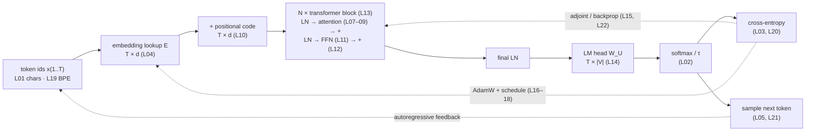

# Lesson 00: The LLM as a System

A large language model is a discrete-time system that reads a stream of symbols, keeps a state, and emits a probability distribution over the next symbol. Built that way — as a signal-processing chain, as a dynamical system with feedback, and as a device that moves bits — every component of a GPT is something an electrical engineer, a control engineer, or an information theorist already knows how to reason about. This course derives the whole model from those three toolkits and implements every step in [rustlab](https://github.com/kreegerresearch/rustlab), so nothing is a black box.

This lesson is the map: what the system looks like, which three questions every lesson asks of each component, the notation the whole course uses, and where each tool you already own will be used.

## Learning Objectives

- Read the full GPT pipeline as one signal-flow graph and name which lesson builds each box.
- State the three lenses — **Signals**, **Systems**, **Information** — as the fixed questions asked of every component, and the three honesty labels (*Exact*, *Model*, *Analogy*) attached to every answer.
- Adopt the course notation: tokens are rows (time), features are columns, temperature is $\tau$, losses are nats in code and bits in prose.
- Locate, for each tool in your existing kit (FIR/IIR filters, eigenvalue stability, adjoint equations, entropy and coding), the lesson where it does the work.

## Background

Linear algebra (matrix products, transposes, eigen- and singular values), signals and systems (LTI and time-varying filters, impulse and frequency response, sampling, correlation), state-space and discrete-time stability, and Shannon's entropy, cross-entropy, KL divergence and source coding. No deep-learning background is assumed, and no deep-learning vocabulary is used before it is derived.

## The System in One Picture

### Theory

A decoder-only transformer maps a token sequence $x_{1..T}$ to a distribution over $x_{T+1}$. Read left to right it is a **chain of operators on a $T \times d$ signal**; read top to bottom it is a **closed loop** — the training loop feeds the loss back into the parameters, and the generation loop feeds the sampled token back into the input.



> [!TIP]
> Solid arrows are the forward signal path; dashed arrows are the two feedback loops. Every box is a lesson; the two loops are the reason this is a *systems* course and not only a *signals* course.

The residual stream — the $T \times d$ matrix threading through the blocks — is the system's **state along depth**; the key/value cache ([[21-sampling-and-generation]]) is its **state along time**. Attention is the only operator that mixes information along the time axis (rows); everything else acts on each row independently along the feature axis (columns). Holding that picture is most of what it takes to read any transformer variant.

## Three Lenses

### Theory

Every lesson ends with an `## Engineering Lenses` section that asks three fixed questions of the component just built:

| Lens | The question | Typical answers in this course |
|---|---|---|
| **Signals** | What is the signal — its axis, units, scale — and what operation acts on it: filter, transform, modulation, normalisation? What does it look like in the frequency domain? | attention as a causal time-varying FIR filter whose taps are computed from the signal; positional codes as a bank of phasors; LayerNorm as instantaneous gain control; momentum as a one-pole low-pass on the gradient |
| **Systems** | What is the state, what is the update law, is it stable, what sets its time constant or damping, and where is the feedback? | gradient descent as $e_{k+1} = (I - \eta H) e_k$; the residual stream as forward-Euler integration of a flow; backprop as the adjoint (costate) recursion; generation as a closed loop with unit delay |
| **Information** | What bits are created, moved, or destroyed here? What is the floor, bound, or budget — and can we compute it on the lesson's own data? | conditional-entropy floors that each model class must beat; row entropies of attention; cross-entropy as code length; BPE as source coding; perplexity as effective alphabet size |

Every answer carries one of three labels, written in bold at the start of the sentence:

- **Exact.** A formal equivalence: the two objects are the same mathematics under a change of names. (Backprop *is* the discrete adjoint recursion.)
- **Model.** A faithful simplification whose assumptions are stated. (LayerNorm as automatic gain control — instantaneous, not a loop.)
- **Analogy.** Intuition only, not an identity; useful for orientation, dangerous if pushed. (Warmup as a soft start.)

The labels are a promise: an *Exact* statement can be checked by algebra, and every lesson checks at least one numerically.

## Notation

### Theory

The whole course uses one convention so that mathematics and code read the same way.

| Symbol | Meaning |
|---|---|
| $T$ | sequence length; tokens index discrete time $t = 1, \dots, T$ and are the **rows** of every token matrix |
| $d$, $d_{\text{model}}$, $d_k$, $d_{\text{ff}}$ | feature widths; features are the **columns** (channels) |
| $\mathbf{X}, \mathbf{H} \in \mathbb{R}^{T \times d}$ | token / residual-stream matrix; row $t$ is token $t$; a layer acts by right-multiplication $\mathbf{X}\mathbf{W}$ with $\mathbf{W} \in \mathbb{R}^{d_{\text{in}} \times d_{\text{out}}}$ |
| $\mathbf{E}$, $\mathbf{W}_Q, \mathbf{W}_K, \mathbf{W}_V, \mathbf{W}_O$, $\mathbf{W}_1, \mathbf{W}_2$, $\mathbf{W}_U$ | embedding, attention projections, FFN weights, LM head |
| $\mathbf{A}$ | the attention (mixing) matrix: rows are query times $t$, columns are key times $i \le t$; Lesson 07's uniform average is the special case $\mathbf{A} = \mathbf{W}_{\text{avg}}$ |
| $\tau$ | softmax temperature — never $T$ |
| $\mathbf{P}$ | a bigram transition matrix (row-stochastic); $\boldsymbol{\Pi}$ a permutation matrix |
| $\mathcal{L}$ | loss, computed in **nats** in code; prose reports **bits** ($\div \ln 2$) when it says so; perplexity $= e^{\mathcal{L}_{\text{nats}}} = 2^{\mathcal{L}_{\text{bits}}}$ |
| $\bar{\mathbf{x}} = \partial \mathcal{L} / \partial \mathbf{x}$ | the adjoint of $\mathbf{x}$ — the costate $\boldsymbol{\lambda}$ of optimal control under another name |
| $\eta$, $\beta_1$, $\beta_2$, $\mu$ | learning rate, Adam moment decays, heavy-ball momentum |
| indices | 1-based everywhere (rustlab convention); categorical plot axes carry 1-based labels |

### Example — Bits, nats, and perplexity

The one conversion that recurs in every lesson: rustlab's `log` is natural, so losses come out in nats; dividing by $\ln 2$ gives bits, and exponentiating either gives the same perplexity. The helpers in `lib/info.rlab` are used from Lesson 03 onward.

<!-- hide -->
```rustlab
run "../lib/info.rlab"
```

```rustlab
p = [0.5, 0.25, 0.125, 0.125];       % a four-symbol source
H_bits = entropy_bits(p);
H_nats = entropy_nats(p);
print("H =", H_bits, "bits =", H_nats, "nats");
print("perplexity 2^H_bits =", 2 ^ H_bits, "   e^H_nats =", exp(H_nats));
print("uniform bound log2(4) =", log2(4), "bits");
```

The source has ${H_bits:%.2f}$ bits of entropy — a perplexity of ${2 ^ H_bits:%.2f}$, i.e. it behaves like a fair choice among ${2 ^ H_bits:%.2f}$ symbols even though the alphabet has 4. Every model in this course is scored the same way: cross-entropy in nats, reported in bits, read as an effective alphabet size.

## Your Toolkit, Mapped

### Theory

Where each tool you already own does the work:

| You already know | It appears as | Lesson |
|---|---|---|
| Alphabet, discrete source, source-coding bound | tokens; $\log_2 \lvert\mathcal{V}\rvert$ and unigram entropy as the first two floors | [[01-tokens-and-encoding]] |
| Boltzmann / Gibbs distribution, log-likelihood ratio, max-entropy | softmax with temperature $\tau$; logits as log-odds | [[02-probability-and-softmax]] |
| Code length, KL divergence, Gaussian likelihood ⇒ least squares | cross-entropy; $\mathbf{p} - \mathbf{y}$ as a bounded error signal; why MSE is a special case | [[03-cross-entropy-loss]] |
| Correlation, matched filter, codebook | embeddings; dot product as a correlator; one-hot × $\mathbf{E}$ as codebook lookup | [[04-embeddings-and-similarity]] |
| Markov chain, stochastic matrix, stationary distribution, entropy rate | the bigram model and its spectral structure | [[05-bigram-language-model]] |
| Discrete-time LTI stability, poles inside the unit circle, condition number | gradient descent as $e_{k+1} = (I - \eta H) e_k$ | [[06-linear-layers-and-gradient-descent]] |
| Causal FIR and IIR filters, impulse response | prefix averaging and the EMA as time-varying filters along the token axis | [[07-context-and-naive-averaging]] |
| Correlation receiver, kernel smoother, content-addressable memory | scaled dot-product attention; row entropy of the attention matrix | [[08-scaled-dot-product-attention]] |
| Filter bank, rank of a bilinear form | multi-head attention as a sum of rank-limited filters | [[09-multi-head-attention]] |
| Phasors, oscillator banks, aliasing and unambiguous range | sinusoidal positional codes; why the base is 10000 | [[10-positional-encoding]] |
| Static nonlinearity, Wiener–Hammerstein cascade, small-signal gain | the feed-forward block; GELU's gain curve | [[11-feed-forward-block]] |
| Gain control, forward Euler, Jacobian products | LayerNorm and the residual stream as a discrete-time flow | [[12-layer-norm-and-residuals]] |
| One step of a nonlinear discrete-time system | the transformer block; the two mixing axes | [[13-transformer-block]] |
| A causal finite-memory system; compute and parameter budgets | the full GPT | [[14-full-gpt-architecture]] |
| Adjoint / costate equations, reverse-mode differentiation | backpropagation | [[15-backpropagation]], [[22-full-backprop-through-the-block]] |
| One-pole low-pass, second-order damping, normalised LMS, leak | momentum, Adam, weight decay | [[16-adamw-optimizer]] |
| Gain scheduling, linear time-varying contraction | learning-rate warmup and decay | [[17-learning-rate-scheduling]] |
| Closed loop with a noisy sensor and a limiter | the training loop; gradient clipping | [[18-training-loop]] |
| Source coding: Huffman, LZ, MDL | byte-pair encoding as compression | [[19-byte-pair-encoding]] |
| Arithmetic coding, bits per character, self-information | perplexity and evaluation | [[20-perplexity-and-evaluation]] |
| Closed loop with unit delay, state, attractors | autoregressive generation; the KV cache | [[21-sampling-and-generation]] |
| Complex modulation, heterodyning; bandwidth-bound throughput | RoPE, RMSNorm, SwiGLU, GQA | [[24-modern-architectural-variants]] |
| Gibbs tilt of a prior, error-driven gain, gradient interference | SFT, DPO, catastrophic forgetting | [[25-fine-tuning-sft-and-dpo]] |
| Fixed-point arithmetic, quantisation noise, 6 dB per bit, rate–distortion | int8 weights and activations | [[26-quantization-and-fixed-point-inference]] |

## How to Read a Lesson

### Theory

Each lesson is one executable notebook: prose and equations, then `rustlab` blocks whose printed output and figures are captured into the rendered book. Every concept H2 splits into `### Theory` and `### Example — …`; the `## Engineering Lenses` H2 follows the last concept; then Key Takeaways, the table of parallel standalone scripts (`lessons/<slug>/*.rlab`, runnable from a shell with `rustlab run` or `make lesson-NN`), an Expected Numerical Outputs table you can check by hand, exercises, and a forward link. Shared code that more than one lesson needs — the transformer forward/backward pass, the optimiser, sampling, information helpers — lives in `lib/` and is pulled in with `run`.

Read in order. Each lesson assumes only the ones before it.

## Key Takeaways

- A GPT is a chain of operators on a $T \times d$ signal inside two feedback loops (training and generation).
- Three questions are asked of every component — Signals, Systems, Information — and every answer is labelled *Exact*, *Model*, or *Analogy*.
- One notation: tokens are rows, features are columns, temperature is $\tau$, losses are nats in code and bits in prose.
- The tools of EE, control, and information theory are not analogies bolted on afterwards; in most lessons they are the mathematics itself.

## Standalone Scripts

None — this lesson is the map. The first runnable scripts are in [[01-tokens-and-encoding]].

## Expected Numerical Outputs Summary

| Variable | Expected Value |
|---|---|
| `H_bits` | `1.75` bits |
| `H_nats` | `1.213` nats |
| `2 ^ H_bits` = `exp(H_nats)` | `3.364` |

## Exercises

1. **Trace a token.** Follow one token id through the diagram and write down the shape of the signal after every box for $T = 8$, $d = 64$, $\lvert\mathcal{V}\rvert = 50$.
2. **Name the loops.** Which arrows in the diagram carry gradients, which carry sampled tokens, and which carry activations? What is the "plant", the "sensor", and the "controller" in the training loop?
3. **Label practice.** For each of these statements decide *Exact*, *Model*, or *Analogy* before you reach the lesson that settles it: "softmax is a Boltzmann distribution"; "LayerNorm is automatic gain control"; "attention is a matched filter"; "backprop is the adjoint method".

## What's next

[[01-tokens-and-encoding]] starts at the alphabet: text becomes integers, integers become one-hot basis vectors, and the first information-theoretic floor — the entropy of the unigram source — is computed.
