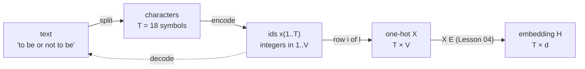

# Lesson 01: Tokens & Text Encoding

A language model never sees letters — it sees integers. This lesson builds the bridge from raw text to the numerical representations every later lesson depends on: a vocabulary, an executed encode/decode round trip, one-hot vectors, and the first two information-theoretic floors that every model in this course will be measured against. One corpus — `"to be or not to be"` — runs through the whole lesson.

## Learning Objectives

- Explain what a **token** is and why text must be converted to numbers before a model can process it.
- Build a **character-level vocabulary**, then **encode** a string to integer ids and **decode** it back, in executed code.
- Construct a **one-hot vector** for a given token, interpret it as a standard basis vector, and stack a sequence into the matrix $\mathbf{X} \in \{0,1\}^{T \times |\mathcal{V}|}$.
- Read a **character PMF bar chart** and a **one-hot matrix heatmap** and explain what each cell means.
- Compute the first two floors on the entropy staircase — $\log_2 |\mathcal{V}|$ and the unigram entropy $H(f)$ — and say what later lessons must do to go lower.

## Background

Vectors (a list of numbers) and matrices (a 2-D grid of numbers). The concept of a function as a deterministic input-to-output mapping. Base-2 logarithms. No neural network, probability, or deep learning knowledge is required yet — those arrive in later lessons.

## What is a Token?

### Theory

A **token** is the basic unit of text a language model operates on. At the character level every character becomes one token. The pipeline this lesson builds — and the one box it borrows from [[04-embeddings-and-similarity]] — is:



**Step 1 — Collect the vocabulary.** Given a corpus, collect every unique character and sort them. This ordered set is the vocabulary $\mathcal{V}$, with size $|\mathcal{V}|$ (written $V$ on diagram edges).

**Step 2 — Assign integer indices.** Create a deterministic mapping and its inverse

$$\text{encode} : \mathcal{V} \to \{1, 2, \ldots, |\mathcal{V}|\}, \qquad \text{decode} = \text{encode}^{-1}.$$

For the corpus `"to be or not to be"` the sorted vocabulary is:

| Character | Index |
|-----------|-------|
| `␣` (space) | 1 |
| `b` | 2 |
| `e` | 3 |
| `n` | 4 |
| `o` | 5 |
| `r` | 6 |
| `t` | 7 |

Encoding is *lossless*: $T$ characters become $T$ integers $x(1), \ldots, x(T)$ in $1..|\mathcal{V}|$, and decoding recovers the text exactly. The index $t = 1, \ldots, T$ is **discrete time** — the axis every later lesson calls the sequence.

### Example — Encode and decode round trip

Rustlab strings index by character (`s(t)`), so the encoder is a search for each character's position in the vocabulary; the decoder is a string concatenation of `chars(ids(t))`:

```rustlab
corpus = "to be or not to be";
chars  = {" ", "b", "e", "n", "o", "r", "t"};        % sorted vocabulary
vocab_size = length(chars);
T = length(corpus);

% encode: ids(t) = position of corpus(t) in the vocabulary
ids = zeros(T);
for t = 1:T
  j = 1;
  while j < vocab_size && corpus(t) != chars(j)
    j = j + 1;
  end
  ids(t) = j;
end

% decode: concatenate the vocabulary entry for each id
decoded = "";
id_str  = "";
for t = 1:T
  decoded = decoded + chars(ids(t));
  id_str  = id_str + sprintf("%d ", ids(t));
end

print("T =", T, " |V| =", vocab_size);
print("ids:      ", id_str);
print("decoded:  '" + decoded + "'");
print("round trip exact:", decoded == corpus);
```

The corpus has $T = ${T}$ characters over a vocabulary of $|\mathcal{V}| = ${vocab_size}$; `t` is id 7 and `o` is id 5, so the text opens `7 5 1 ...`. Every later lesson consumes a sequence like `ids` — [[05-bigram-language-model]] counts transitions in it, [[18-training-loop]] trains on it.

## Character Frequencies

### Theory

Before building a model it helps to understand the **frequency distribution** of tokens. If $c_i$ is the count of character $i$ in the corpus, the relative frequency is

$$f_i = \frac{c_i}{\sum_{j=1}^{|\mathcal{V}|} c_j}.$$

This is a discrete probability distribution — a PMF — over the vocabulary: every $f_i \in [0, 1]$ and $\sum_i f_i = 1$. It is the **first-order marginal** of the corpus: the probability of a character with no knowledge of its neighbours.

### Example — Counting from the id sequence and the PMF bar chart

The counts come from the encoded ids, not from a hand-typed table:

```rustlab
counts = zeros(vocab_size);
for t = 1:T
  counts(ids(t)) = counts(ids(t)) + 1;
end
total = sum(counts);
freqs = counts / total;
print("Character counts (␣, b, e, n, o, r, t):", counts);
print("Relative frequencies:", freqs);
print("Sum of frequencies (should be 1.0):", sum(freqs));

labels = {"␣", "b", "e", "n", "o", "r", "t"};
figure();
bar(labels, freqs, "Character PMF f_i: 'to be or not to be'")
ylim([0, 0.3])
```

> [!TIP]
> The first bar is the space character `␣` — the most frequent symbol at ${max(freqs):%.3f} $= 5/18$. The bar heights sum to 1.0; this PMF is the "unigram source" whose entropy is computed under Engineering Lenses below.

## One-Hot Encoding

### Theory

An integer index like $4$ carries no useful geometric meaning — a model might infer that character 4 is "greater than" character 3, which is meaningless. Instead, each token is represented as a **one-hot vector**: a vector of length $|\mathcal{V}|$ that is 0 everywhere except at position $i$:

$$(\mathbf{e}_i)_j = \begin{cases} 1 & \text{if } j = i \\ 0 & \text{otherwise.} \end{cases}$$

$\mathbf{e}_i$ is row $i$ of the identity matrix $\mathbf{I}_{|\mathcal{V}|}$ — the $i$-th **standard basis vector**. All one-hot vectors are therefore mutually orthogonal:

$$\mathbf{e}_i \cdot \mathbf{e}_j = \delta_{ij}.$$

No two tokens share any geometric similarity — a clean slate before the model learns its own representations ([[04-embeddings-and-similarity]]).

To encode a sequence of $T$ tokens, stack their one-hot vectors as rows of a matrix $\mathbf{X} \in \{0, 1\}^{T \times |\mathcal{V}|}$ — tokens are rows (time), vocabulary slots are columns:

$$\mathbf{X} = \begin{bmatrix} \mathbf{e}_{x(1)} \\ \mathbf{e}_{x(2)} \\ \vdots \\ \mathbf{e}_{x(T)} \end{bmatrix}.$$

### Example — Stacking one-hots into a matrix X

Because $\mathbf{e}_i$ is row $i$ of the identity, the whole matrix is one row gather; the same block checks orthogonality and the fact Lesson 04 builds on — $\mathbf{X}$ times a matrix **selects rows** of it:

```rustlab
I = eye(vocab_size);
X = I(ids, :);                          % row t of X is e_{ids(t)}

print("X is", size(X, 1), "x", size(X, 2), " (T tokens x |V| slots)");
print("First five rows of X  ('to be'):");
print(X(1:5, :));
print("Fraction of non-zero entries:", sum(sum(X)) / (T * vocab_size), " = 1/|V| =", 1 / vocab_size);

e_t = I(7, :);  e_o = I(5, :);
dot_t_o = sum(e_t .* e_o);
dot_t_t = sum(e_t .* e_t);
lookup_diff = max(max(abs(X * eye(vocab_size) - X)));
print("Dot product t . o:", dot_t_o, "   t . t:", dot_t_t);
print("max|X * eye(|V|) - X| :", lookup_diff);
```

The matrix is ${size(X, 1)} $\times$ ${size(X, 2)}$ — one row per token, one column per vocabulary slot. Each row has exactly one non-zero entry, so only $1/|\mathcal{V}| = ${1 / vocab_size:%.3f}$ of the matrix is non-zero; at a realistic $|\mathcal{V}| = 50{,}000$ that density is $0.002\,\%$, which is why real implementations never materialise $\mathbf{X}$. Orthogonality is confirmed — $\mathbf{e}_t \cdot \mathbf{e}_o = ${dot_t_o}$, $\mathbf{e}_t \cdot \mathbf{e}_t = ${dot_t_t}$, exactly $\delta_{ij}$ — and $\mathbf{X}\,\mathbf{I} = \mathbf{X}$ to the last bit: row $t$ of $\mathbf{X}\mathbf{M}$ is row $x(t)$ of $\mathbf{M}$ for *any* matrix $\mathbf{M}$ with $|\mathcal{V}|$ rows. Replace $\mathbf{I}$ by a $|\mathcal{V}| \times d$ matrix $\mathbf{E}$ and you have the embedding lookup of [[04-embeddings-and-similarity]].

### Example — One-hot matrix heatmap

```rustlab
seq_labels = labels(ids);                % the character at each position

figure();
heatmap(labels, seq_labels, X, "One-Hot Matrix X: 'to be or not to be' (18 tokens x 7 slots)", "viridis")
```

> [!TIP]
> Read each row left to right: the single bright cell sits under the column for that row's character, so the picture *is* the encoding. The five `␣` rows all light the first column — identical tokens have identical rows.

## Engineering Lenses

No systems reading adds to this lesson: tokenisation has no state and no update law. The first state variable of the course is the Markov chain of [[05-bigram-language-model]].

### Signals

**Exact.** The signal is the symbol stream $x(t)$, $t = 1, \dots, T$, on the discrete-time axis; its values live on a second discrete axis, the alphabet index $i = 1, \dots, |\mathcal{V}|$. On that alphabet axis a one-hot vector is the **unit impulse** $\mathbf{e}_i[n] = \delta[n - i]$ — the same object as the standard basis vector — and the PMF $f$ is a finite sequence over the same axis. $\mathbf{X}$ is then $T$ impulses, one per row.

```rustlab
figure();
subplot(1, 2, 1)
stem(1:vocab_size, freqs)
title("PMF f[i] over the alphabet index i (1 = ␣)")
ylim([0, 0.3])
subplot(1, 2, 2)
stem(1:vocab_size, X(1, :))
title("one-hot of x(1) = 't':  delta[n - 7]")
ylim([0, 1.1])
```

> [!TIP]
> Same axis, two sequences: the left stem plot is a distribution over the alphabet, the right one is a single impulse at $n = 7$. Every row of $\mathbf{X}$ is an impulse like the right panel; Lesson 04 replaces the impulse by a dense $d$-vector.

### Information

**Exact.** The corpus is a realisation of a **discrete source** $X_t$ over the alphabet $\mathcal{V}$, and $f$ is its empirical first-order marginal. Shannon's source-coding theorem says the minimum average number of bits to losslessly encode symbols drawn independently from $f$ is the entropy

$$H(f) = -\sum_{i=1}^{|\mathcal{V}|} f_i \log_2 f_i \quad [\text{bits/symbol}].$$

Every $f_i > 0$ here, so the sum needs no special case (the $0 \log 0 = 0$ convention is stated in [[02-probability-and-softmax]], which formalises entropy; later lessons call `lib/info.rlab`):

```rustlab
H_f   = -sum(freqs .* log2(freqs));      % unigram (memoryless) entropy, bits/symbol
H_max = log2(vocab_size);                % uniform-alphabet bound

print("log2|V|      =", H_max, "bits/symbol");
print("H(f) unigram =", H_f, "bits/symbol");
print("gap          =", H_max - H_f, "bits/symbol");
```

Two reference points, both in bits per symbol: if every character were equally likely each token would carry $\log_2 7 = ${H_max:%.3f}$ bits; with the actual frequencies the bound is $H(f) = ${H_f:%.3f}$ bits — ${H_max - H_f:%.3f}$ bits less per token. A variable-length code (Huffman, arithmetic) can approach $H(f)$; a fixed-width binary code cannot split a bit and rounds up to $\lceil \log_2 7 \rceil = 3$.

**Exact.** $H(f)$ is the **memoryless** floor: it assumes each character is drawn independently of its neighbours. Conditioning on the previous character can only lower it, $H(X_{t+1} \mid X_t) \le H(X_{t+1})$, and conditioning on the whole past lowers it further. This course is a staircase of such floors, each model class beating the last. The third step — the bigram conditional entropy — is derived in [[05-bigram-language-model]]; it is computed here ahead of its derivation, from the transition counts of this corpus, so the staircase can be drawn:

```rustlab
C = zeros(vocab_size, vocab_size);       % C(i, j): count of (x(t) = i, x(t+1) = j)
for t = 1:T - 1
  C(ids(t), ids(t + 1)) = C(ids(t), ids(t + 1)) + 1;
end
H_cond = 0;                              % -sum_ij p(i,j) log2 p(j|i)
for i = 1:vocab_size
  for j = 1:vocab_size
    if C(i, j) > 0
      H_cond = H_cond - (C(i, j) / (T - 1)) * log2(C(i, j) / sum(C(i, :)));
    end
  end
end
print("H(X_{t+1} | X_t) bigram preview =", H_cond, "bits/symbol");

figure();
bar({"uniform log2|V|", "unigram H(f)  (L01)", "bigram"}, [H_max, H_f, H_cond], "The staircase of floors (bits/token)")
ylim([0, 3])
```

> [!TIP]
> Left to right: uniform alphabet ${H_max:%.3f}$ → unigram ${H_f:%.3f}$ → bigram $H(X_{t+1} \mid X_t) = ${H_cond:%.3f}$ bits per token (the third bar is Lesson 05's floor). The fourth step, the trained transformer of [23-putting-it-all-together](23-putting-it-all-together.md), is measured on a different corpus and so is not drawn here; its cross-entropy in bits is the same kind of number and sits below the bigram floor of *its* corpus.

**Exact.** One-hot encoding is a **unary code**: it spends $|\mathcal{V}|$ binary digits to carry at most $\log_2 |\mathcal{V}|$ bits — like writing the number 5 as `0000100` instead of `101` — with redundancy $1 - \log_2|\mathcal{V}| / |\mathcal{V}|$. And tokenisation changes the **symbol rate**, not the message: the same 18-character message is 6 word-level symbols, and what a tokeniser trades is symbols per message against bits per symbol:

```rustlab
redundancy = 1 - H_max / vocab_size;
print("one-hot redundancy 1 - log2|V|/|V| =", redundancy);

% word level: to, be, or, not, to, be  ->  vocabulary {be, not, or, to}
f_words = [2, 1, 1, 2] / 6;
H_words = -sum(f_words .* log2(f_words));
bits_chars = T * H_f;
bits_words = 6 * H_words;
print("chars: 18 symbols x", H_f, "bits =", bits_chars, "bits/message");
print("words:  6 symbols x", H_words, "bits =", bits_words, "bits/message");
```

The redundancy is ${redundancy:%.3f}$ at $|\mathcal{V}| = 7$ and $0.9997$ at $50{,}000$; we accept it because one-hot vectors plug directly into matrix algebra, and the embedding of Lesson 04 is the dense code that trades it away. The two memoryless products disagree — ${bits_chars:%.1f}$ versus ${bits_words:%.1f}$ bits for the same message — and the gap is exactly the information the character-level memoryless source cannot see: that `t` is followed by `o`, that `b` is followed by `e`. A model that captured every dependency would give the same bits per message under either tokenisation, because the information in a message does not depend on how it is chopped up. Bigger symbols push bits into the symbol table, smaller symbols push them into the sequence model — the trade [[19-byte-pair-encoding]] makes explicit; [[03-cross-entropy-loss]] measures the bits per token a model wastes against the floor, and [[20-perplexity-and-evaluation]] reads $2^{H}$ as an effective alphabet size.

## Key Takeaways

- **Tokenisation** converts symbols to integers to matrices — the bridge from text to linear algebra — and it is lossless: `decode(encode(s)) == s`.
- A character-level vocabulary is tiny (~100 in English) but forces the model to learn spelling from scratch. Larger vocabularies reduce sequence length but increase memory.
- One-hot vectors are the standard basis of $\mathbb{R}^{|\mathcal{V}|}$; $\mathbf{X}\mathbf{M}$ selects rows of $\mathbf{M}$. One-hot encoding does *not* imply characters are independent — it is only the starting point. The embedding layer ([[04-embeddings-and-similarity]]) projects these orthogonal vectors into a dense space where learned relationships emerge.
- The staircase of floors starts here: $\log_2|\mathcal{V}| = 2.807 \to H(f) = 2.594 \to H(X_{t+1}\mid X_t) = 1.080$ bits per token on this corpus. Every later model is judged by how far down it gets.

## Standalone Scripts

| Script | What it computes |
|---|---|
| `encode_decode.rlab` | the vocabulary, the encode/decode round trip, and counts/frequencies from the id sequence |
| `char_frequencies.rlab` | character counts and relative frequencies for `"to be or not to be"`; labelled PMF bar chart |
| `one_hot_encoding.rlab` | the 18×7 one-hot matrix from the ids; density, orthogonality, the `X * eye` lookup; heatmap |
| `entropy_floors.rlab` | $\log_2\lvert\mathcal{V}\rvert$, $H(f)$, the bigram preview, unary redundancy, the symbol-rate comparison; staircase bar chart |

Run all with `make lesson-01` from the repo root (or `rustlab run lessons/01-tokens-and-encoding/<name>.rlab` for one). Each writes SVGs next to the script (gitignored).

## Expected Numerical Outputs Summary

| Variable | Expected Value |
|---|---|
| `T`, `vocab_size` | `18`, `7` |
| `ids` (first five) | `7 5 1 2 3` (`"to be"`); `decoded == corpus` is `true` |
| `freqs` (max — space), `sum(freqs)` | ≈ `0.278` (= 5/18), `1.0` |
| `size(X)`, non-zero fraction | `[18, 7]`, `0.143` (= 1/7) |
| `dot_t_o`, `dot_t_t`, `lookup_diff` | `0`, `1`, `0` |
| `H_max`, `H_f`, `H_cond` | `2.807`, `2.594`, `1.080` bits/symbol |
| `redundancy` | `0.599` |
| `bits_chars`, `bits_words` | `46.7`, `11.5` bits/message |

## Exercises

1. **Vocabulary extension.** Modify `encode_decode.rlab` to use the corpus `"the cat sat on the mat"`. What is the new vocabulary size? Which character has the highest frequency, and what is $H(f)$?
2. **Decode a sequence.** Using this lesson's vocabulary, decode `[4, 5, 7, 1, 7, 5]` by hand, then check with the `decoded` loop.
3. **One-hot orthogonality.** Compute the dot product between row 1 (`t`) and row 4 (`b`) of $\mathbf{X}$ by hand, and the dot product between rows 1 and 14 (both `t`). Confirm both against $\delta_{ij}$.
4. **Vocabulary size trade-off.** The one-hot matrix for $T$ tokens over $N$ symbols has $T \times N$ entries, of which $T$ are non-zero. Write the density and the unary-code redundancy as formulas in $N$; evaluate both at $N = 7$, $256$, $50{,}000$.
5. **Beyond characters.** Tokenise `"to be or not to be"` at the word level. What are $T$ and $|\mathcal{V}|$ now, what is the shape of $\mathbf{X}$, and does $T \cdot H(f)$ go up or down? Reconcile your answer with the symbol-rate block above.

## What's next

[[02-probability-and-softmax]] turns scores into a probability distribution over the vocabulary with the **softmax** function — derived as the maximum-entropy distribution, not merely constructed — and introduces the **temperature** $\tau$ that controls how sharp or diffuse the distribution is. The entropy computed here reappears there as a function of $\tau$.
