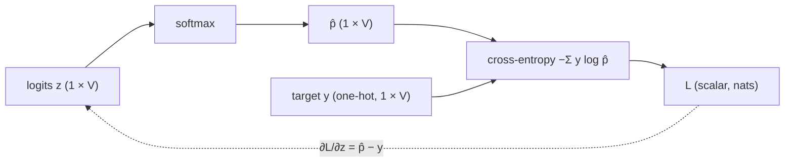

# Lesson 03: Cross-Entropy Loss

The model outputs a probability distribution. The ground truth is the actual next token. We need a scalar that measures how wrong the prediction is — this scalar is the **cross-entropy loss**, and minimising it is the entire goal of training. Its gradient with respect to the logits, $\hat{\mathbf{p}} - \mathbf{y}$, is the **error signal** that every later lesson feeds back into the parameters.

## Learning Objectives

- Define **cross-entropy** between a true distribution and a predicted distribution, in nats and in bits.
- Derive the simplified cross-entropy loss used in language model training and its **maximum-likelihood** origin step by step.
- Derive the gradient with respect to the logits, $\partial \mathcal{L} / \partial \mathbf{z} = \hat{\mathbf{p}} - \mathbf{y}$, and explain why it is **bounded** even when the prediction is catastrophically wrong.
- Read the loss surface in logit space: the asymptotic floor, the linear wall, and its **convexity**.
- Compute cross-entropy, a KL divergence, and the Gaussian-likelihood form of MSE by hand and verify against the simulation output.

## Background

Probability distributions, softmax, entropy, and the log-sum-exp from [[02-probability-and-softmax]]; one-hot vectors from [[01-tokens-and-encoding]]; the notation of [[00-the-llm-as-a-system]] (losses in nats in code, bits in prose). Natural logarithm $\ln(x) = \log_e(x)$. The concept of a loss function: a scalar that measures how wrong a model's prediction is.

## The Setup

At each position in a sequence the model outputs $\hat{\mathbf{p}} \in \mathbb{R}^{|\mathcal{V}|}$ (a probability distribution from softmax, [[02-probability-and-softmax]]). The ground truth is the actual next token — a one-hot vector $\mathbf{y}$ ([[01-tokens-and-encoding]]).

## Cross-Entropy

### Theory

The **cross-entropy** between the true distribution $\mathbf{y}$ and predicted distribution $\hat{\mathbf{p}}$ is

$$H(\mathbf{y}, \hat{\mathbf{p}}) = -\sum_{i=1}^{|\mathcal{V}|} y_i \log \hat{p}_i.$$

Because $\mathbf{y}$ is one-hot, only the term for the correct token $c$ survives:

$$\mathcal{L} = -\log \hat{p}_c.$$

This is the **negative log-probability of the correct token** — the standard loss for language model training. With the natural logarithm the unit is the **nat**; dividing by $\ln 2$ gives **bits** (the course convention: nats in code, bits in prose). Reference values:

| $\hat{p}_c$ | $\mathcal{L}$ (nats) | $\mathcal{L}$ (bits) | Meaning |
|------|------|------|---------|
| 1.0  | 0    | 0 | Perfect prediction |
| 0.5  | 0.693 | 1 | A fair coin's worth of doubt |
| 0.25 | 1.386 | 2 | Uniform over four tokens |
| 0.01 | 4.605 | 6.64 | Nearly zero probability on the right answer |
| $\to 0$ | $\to \infty$ | $\to \infty$ | Catastrophically wrong |

As a function of $\hat{p}_c$ the loss is convex and decreasing; the unbounded tail as $\hat{p}_c \to 0$ is why a single confidently wrong token can dominate a batch.

### Example — Loss curve and reference points

```rustlab
% Sample p_hat across (0.01, 1.0] and compute L = -log(p_hat_c) in nats
p_hat = linspace(0.01, 1.0, 200);
loss  = -log(p_hat);
```

```rustlab
L_50k   = -log(1.0 / 50000.0);
L_4     = -log(0.25);
L_half  = -log(0.5);
L_high  = -log(0.9);
L_vhigh = -log(0.99);
print("bits:", L_50k / log(2), L_4 / log(2), L_half / log(2), L_high / log(2), L_vhigh / log(2));
```

Reference points in nats: $p{=}1/50000 \Rightarrow L = ${L_50k:%.3f}$ (the uniform-over-50k-tokens baseline, ${L_50k / log(2):%.2f}$ bits), $p{=}0.25 \Rightarrow L = ${L_4:%.3f}$ ($= \log 4$, exactly 2 bits), $p{=}0.5 \Rightarrow L = ${L_half:%.3f}$ (1 bit), $p{=}0.9 \Rightarrow L = ${L_high:%.3f}$, $p{=}0.99 \Rightarrow L = ${L_vhigh:%.4f}$.

```rustlab
figure();
hold("on")
plot(p_hat, loss, "color", "blue", "label", "L = -log(p)")
hline(L_4, "gray", "baseline = log(4)")
title("Cross-Entropy Loss vs. Predicted Probability of Correct Token")
xlabel("Predicted probability of correct token (p_c)")
ylabel("Loss L = -log(p_c)  [nats]")
ylim([0, 6])
legend()
hold("off")
```

> [!TIP]
> The curve crosses the grey baseline at $\hat{p}_c = 0.25$: any prediction to the left of that point is *worse than guessing* on a four-token vocabulary. The steepening toward $\hat{p}_c \to 0$ is the unbounded penalty for confident errors.

At $\hat{p}_c = 1/|\mathcal{V}|$ (uniform prediction — the model knows nothing), the loss equals $\log |\mathcal{V}|$. This is the **baseline loss** at the start of training.

## Connection to Maximum Likelihood

### Theory

A language model assigns a probability to a whole training sequence $x_1, \dots, x_T$ by the chain rule of probability, one factor per position:

$$P_\theta(x_1, \dots, x_T) = \prod_{t=1}^{T} \hat{p}^{(t)}_{x_t}, \qquad \hat{p}^{(t)} = \text{the model's distribution at position } t \text{ given } x_{<t}.$$

**Maximum likelihood** chooses the parameters $\theta$ that make the observed corpus most probable. Four steps turn that into the loss above:

1. **Product → log.** The logarithm is monotone, so maximising $P_\theta$ and maximising $\log P_\theta$ pick the same $\theta$, and the product becomes a sum: $\log P_\theta = \sum_{t=1}^{T} \log \hat{p}^{(t)}_{x_t}$.
2. **Maximise → minimise.** Negate: minimising $-\log P_\theta = \sum_t \bigl(-\log \hat{p}^{(t)}_{x_t}\bigr)$ — each term is one token's cross-entropy $\mathcal{L}_t$.
3. **Sum → mean.** Divide by $T$ so the number does not grow with corpus length:
   $$\mathcal{L}_{\text{avg}} = -\frac{1}{T} \sum_{t=1}^{T} \log \hat{p}^{(t)}_{x_t}.$$
4. **Read the units.** $\mathcal{L}_{\text{avg}}$ is the average negative log-likelihood per token — nats per token, or bits per token after $\div \ln 2$.

Minimising cross-entropy **is** maximum likelihood estimation; nothing was added or dropped along the way. For probabilities $[0.7, 0.4, 0.9]$ on three correct tokens the product is ${prod([0.7, 0.4, 0.9]):%.3f}$ and $-\ln(\cdot)/3$ gives the mean loss ${-sum(log([0.7, 0.4, 0.9])) / 3:%.4f}$ nats — the same information, on a per-token scale.

## Gradient of the Loss

### Theory

Real models never touch $\hat{p}_c$ directly: they produce **logits** $\mathbf{z}$ and softmax turns them into $\hat{\mathbf{p}}$ ([[02-probability-and-softmax]]). The derivative the optimiser actually sees is therefore $\partial \mathcal{L} / \partial \mathbf{z}$, and it is best derived from the loss written in terms of logits. Using $\hat{p}_c = e^{z_c} / \sum_j e^{z_j}$,

$$\mathcal{L} = -\log \hat{p}_c = -z_c + \log \sum_{j} e^{z_j} = -z_c + \mathrm{LSE}(\mathbf{z}),$$

where $\mathrm{LSE}$ is the log-sum-exp — the log of the partition function $Z$ from Lesson 02. Its gradient is the softmax itself: $\partial\, \mathrm{LSE} / \partial z_j = e^{z_j} / \sum_k e^{z_k} = \hat{p}_j$. Differentiating both terms,

$$\frac{\partial \mathcal{L}}{\partial z_j} = -\mathbf{1}[j = c] + \hat{p}_j, \qquad\text{i.e.}\qquad \boxed{\frac{\partial \mathcal{L}}{\partial \mathbf{z}} = \hat{\mathbf{p}} - \mathbf{y}.}$$

Three facts follow, and the third is the one to remember:

- **It is the prediction error.** Each component is (predicted mass) − (target mass): negative on the correct class (push $z_c$ up), positive on every other class (push it down).
- **It sums to zero**, because both $\hat{\mathbf{p}}$ and $\mathbf{y}$ sum to one. Adding a constant to all logits cannot change the loss, so the gradient has no component along the all-ones direction.
- **It is bounded.** Every component lies in $[-1, 1]$ and $\lVert \hat{\mathbf{p}} - \mathbf{y} \rVert_1 \le 2$, no matter how wrong the model is. Contrast $d\mathcal{L}/d\hat{p}_c = -1/\hat{p}_c$, which is $-100$ at $\hat{p}_c = 0.01$: that quantity exists, but the optimiser never sees it, because the softmax Jacobian multiplies it by $\hat{p}_c(1 - \hat{p}_c)$ on the way back to the logits. A confidently wrong prediction produces a large *loss*, not a large *gradient* — the signal saturates at $\pm 1$.

The loss is also **convex in $\mathbf{z}$**: $-z_c$ is linear, and $\mathrm{LSE}$ has Hessian $\mathrm{diag}(\hat{\mathbf{p}}) - \hat{\mathbf{p}}^\top \hat{\mathbf{p}}$, which is positive semi-definite (it is the covariance matrix of a one-hot draw from $\hat{\mathbf{p}}$). Every non-convexity in language-model training is introduced by the *network* that produces $\mathbf{z}$ ([[06-linear-layers-and-gradient-descent]] onward), never by the loss.

### Example — The error signal for a three-class prediction

```rustlab
z3 = [1.0, 2.0, 0.0];             % logits: the distractor (class 2) currently wins
c3 = 1;                           % correct class
p3 = softmax(z3);
y3 = zeros(3); y3(c3) = 1.0;
g3 = p3 - y3;                     % dL/dz
L3 = -z3(c3) + log(sum(exp(z3))); % the LSE form of the loss
print("p_hat      =", p3);
print("dL/dz      =", g3);
print("sum(dL/dz) =", sum(g3), "   max|dL/dz| =", max(abs(g3)));
print("L via LSE  =", L3, "   -log p_c =", -log(p3(c3)));
```

With $\hat{p}_c = ${p3(c3):%.3f}$ the loss is ${L3:%.3f}$ nats, yet the largest gradient component is only ${max(abs(g3)):%.3f}$ — and it would stay below 1 even at $\hat{p}_c = 10^{-6}$. The optimiser's signal is the error vector, not the loss's slope in $\hat{p}$.

## The Loss Surface in Logit Space

### Theory

For a 3-class problem with logits $\mathbf{z} = (z_1, z_2, z_3{=}0)$ and the correct class $c = 1$:

$$\hat{p}_1 = \frac{e^{z_1}}{e^{z_1} + e^{z_2} + 1}, \qquad \mathcal{L}(z_1, z_2) = -z_1 + \log\!\left(e^{z_1} + e^{z_2} + 1\right).$$

That is a 2-parameter surface — the canonical "loss bowl" gradient descent actually sees, and (by the Hessian argument above) a convex one.

### Example — 2-D loss surface over $(z_1, z_2)$

```rustlab
n = 60;
z1_grid = linspace(-3.0, 5.0, n);
z2_grid = linspace(-3.0, 5.0, n);
[Z1, Z2] = meshgrid(z1_grid, z2_grid);

L_surface = -Z1 + log(exp(Z1) + exp(Z2) + 1.0);
```

<!-- hide -->
```rustlab
L_flat = reshape(L_surface, 1, n * n);
L_min = min(L_flat);
L_max = max(L_flat);
```

Range on the grid: loss spans $[${L_min:%.3f}, ${L_max:%.3f}]$ nats — near-zero when $z_1$ dominates, linearly large when the distractor $z_2$ wins.

```rustlab
figure();
contourf(Z1, Z2, L_surface, 20)
title("CE loss over logit space (z3 = 0, correct = class 1)")
xlabel("z1 (correct)")
ylabel("z2 (distractor)")
```

> [!TIP]
> Toward the upper-left (distractor winning) the filled bands are evenly spaced parallel stripes: the loss climbs *linearly* with $z_2 - z_1$. Toward the lower-right the bands stop — the loss flattens onto its floor near zero without ever reaching it.

Three features of this surface make the training dynamics legible:

- **Asymptotic floor.** Push $z_1$ to infinity and the loss approaches 0 — but never reaches it. There is no finite minimiser, which is why LM training never converges to "zero loss" on a finite dataset without overfitting.
- **Linear wall in the distractor direction.** When $z_2 \gg z_1$ the loss grows like $z_2 - z_1$ — a linear ramp, not an exponential cliff. Its slope is the bounded gradient of the previous section: $\partial \mathcal{L}/\partial z_2 = \hat{p}_2 \to 1$.
- **Convex, no local minima.** Every contour is a convex curve, so from any starting logits the negative gradient points into the same basin.

## Sidebar: Label Smoothing

### Theory

The cross-entropy target so far is a **hard one-hot** vector: $y_i = 1$ for the correct class, 0 elsewhere. **Label smoothing** softens that target by reserving a small mass $\varepsilon$ (typically 0.1) for the rest of the vocabulary:

$$y^{\text{smooth}}_i = (1 - \varepsilon)\,\mathbf{1}_{i = c} + \frac{\varepsilon}{|\mathcal{V}|}.$$

The loss against the smoothed target is

$$\mathcal{L}_{\text{smooth}} = -\sum_i y^{\text{smooth}}_i \log \hat p_i = (1 - \varepsilon)\bigl(-\log \hat p_c\bigr) + \varepsilon \, H(\mathbf{u}, \hat{\mathbf{p}}), \qquad H(\mathbf{u}, \hat{\mathbf{p}}) = -\frac{1}{|\mathcal{V}|}\sum_i \log \hat p_i,$$

where the second term is the cross-entropy of $\hat{\mathbf{p}}$ against the uniform distribution $\mathbf{u}$. The net effect: the optimum at $\hat p_c = 1$ becomes $\hat p_c = 1 - \varepsilon + \varepsilon/|\mathcal{V}|$ — the model is **forbidden from putting all its mass on the correct class**.

### Why it helps

- **Calibration.** Without smoothing, well-trained models become overconfident — they assign 0.999+ to whichever token they pick, even on inputs where they should be uncertain. Smoothing keeps probabilities calibrated.
- **Generalisation.** The smoothed target acts as a mild regulariser; it discourages extreme logits and reduces overfitting on small datasets.
- **Beam search compatibility.** The original *Attention Is All You Need* paper trained with $\varepsilon = 0.1$ and reported only that it *hurt* perplexity while *improving* accuracy and BLEU. A common interpretation is that smoothing helps beam search explore — an overconfident model whose top token sits at 0.999-vs-0.001 lets a single hypothesis dominate the beam score — but the paper does not state this as its reason.

Modern GPT-style models (including [nanoGPT](https://github.com/karpathy/nanoGPT)) **do not use label smoothing** — open-ended text generation cares about ranking, not calibration, and large-scale training has its own regularisation effects (data scale, dropout, weight decay). It is still standard in machine translation and any task where calibrated probabilities matter.

## Engineering Lenses

The loss is where the information view and the systems view of training first meet: it is a code length, and its gradient is an error signal. No signals-and-filters reading adds to this lesson (log-sum-exp is a smooth maximum, and that is the whole of it), so that lens is omitted.

### Systems

**Exact.** $\partial \mathcal{L} / \partial \mathbf{z} = \hat{\mathbf{p}} - \mathbf{y}$ is the *only* quantity the loss hands to the rest of the training machinery. Every gradient in the network ([[15-backpropagation]]) is this vector multiplied by Jacobians, and every parameter update ([[06-linear-layers-and-gradient-descent]], [[16-adamw-optimizer]]) is a filtered, scaled version of it.

**Model.** Read as a control loop, $\mathbf{y}$ is the set point, $\hat{\mathbf{p}}$ the measured output, and $\hat{\mathbf{p}} - \mathbf{y}$ the error — a *bounded* error, because softmax + cross-entropy act as a soft-decision detector whose error saturates at $\pm 1$. The forward path and the backward path form the pair drawn below; Lessons 06 and 15–18 close the loop around it.



The saturation is easiest to see in the two-alternative case. Hold the distractor logits fixed at $m = \mathrm{LSE}(\mathbf{z}_{\ne c})$ and sweep $z_c$: then $\hat{p}_c = \sigma(z_c - m)$, the logistic sigmoid of the **logit margin**, and $\partial \mathcal{L}/\partial z_c = \hat{p}_c - 1$.

```rustlab
margin = linspace(-6.0, 6.0, 121);        % z_c - LSE(other logits)
p_c    = 1.0 ./ (1.0 + exp(-margin));      % forward: p_hat_c as a function of the margin
g_c    = p_c - 1.0;                        % backward: dL/dz_c
L_c    = -log(p_c);                        % the loss itself, for contrast

figure();
hold("on")
plot(margin, p_c, "color", "blue", "label", "p_c  (forward)")
plot(margin, g_c, "color", "red", "label", "dL/dz_c = p_c - 1  (backward)")
hline(-1.0, "gray", "saturation at -1")
title("Forward probability and backward error signal vs. logit margin")
xlabel("logit margin  z_c - LSE(others)")
ylabel("value")
legend()
hold("off")
```

> [!TIP]
> The red error signal is a shifted sigmoid that flattens onto the grey rail at $-1$ for large negative margins, while (previous figure) the loss over the same margins keeps climbing linearly. Being very wrong costs loss without buying a larger gradient.

At a margin of $-6$ the loss is ${L_c(1):%.2f}$ nats but the gradient is ${g_c(1):%.4f}$ — already at the rail.

### Information

<!-- hide -->
```rustlab
run "../lib/info.rlab"
```

**Exact.** Cross-entropy decomposes as

$$H(\mathbf{p}, \hat{\mathbf{p}}) = H(\mathbf{p}) + D_{\text{KL}}(\mathbf{p} \,\|\, \hat{\mathbf{p}}),$$

where $H(\mathbf{p})$ is the entropy of the true distribution and $D_{\text{KL}} \ge 0$ is the Kullback–Leibler divergence. For a one-hot $\mathbf{y}$, $H(\mathbf{y}) = 0$, so the per-token loss *is* the KL divergence from the target. In coding terms ([[02-probability-and-softmax]]): the optimal code for symbol $i$ under $\mathbf{p}$ has length $-\log_2 p_i$ bits; if the source is $\mathbf{p}$ but the code is built from the model's $\hat{\mathbf{p}}$, the expected length is $\mathbb{E}_{i \sim \mathbf{p}}[-\log_2 \hat p_i] = H(\mathbf{p}, \hat{\mathbf{p}})$, and the KL term is exactly the **excess bits** the mismatch costs. Computed on Lesson 02's logits, with the $\tau = 1$ softmax as the source and the flatter $\tau = 2$ softmax as the model:

```rustlab
z02   = [2.0, 1.0, 0.5, -0.5];       % Lesson 02's logits
p_src = softmax(z02 / 1.0);           % "true" source: tau = 1
p_mdl = softmax(z02 / 2.0);           % the model's code: tau = 2
H_src  = entropy_bits(p_src);
H_x    = cross_entropy_bits(p_src, p_mdl);
KL_sm  = kl_bits(p_src, p_mdl);
KL_rev = kl_bits(p_mdl, p_src);
print("H(p)         =", H_src, "bits");
print("H(p, p_hat)  =", H_x, "bits");
print("KL(p||p_hat) =", KL_sm, "bits   (excess bits per symbol)");
print("KL(p_hat||p) =", KL_rev, "bits   (not symmetric)");
```

Coding this source with the $\tau = 2$ code costs ${H_x:%.3f}$ bits per symbol instead of the ${H_src:%.3f}$-bit optimum — an overhead of ${KL_sm:%.3f}$ bits, ${100 * KL_sm / H_src:%.1f}$ %. Reversing the roles gives ${KL_rev:%.3f}$ bits: KL is a divergence, not a distance.

**Exact.** *Mean squared error is cross-entropy under a Gaussian noise model.* If a regression model predicts $\hat y$ and the observation is $y = \hat y + \text{noise}$ with $\mathcal{N}(0, \sigma^2)$ noise, then

$$-\log \mathcal{N}(y;\, \hat y, \sigma^2) = \frac{(y - \hat y)^2}{2\sigma^2} + \tfrac{1}{2}\log(2\pi\sigma^2),$$

the squared error plus a constant. The MSE that [[06-linear-layers-and-gradient-descent]] minimises is therefore the *same* objective as this lesson's — maximum likelihood — under a different noise model: Gaussian on a real value instead of categorical on a token.

```rustlab
y_obs = 2.0;  y_pred = [0.0, 1.0, 2.0, 3.0, 4.0];  sigma = 1.0;
nll_gauss = 0.5 * log(2 * pi * sigma^2) + (y_obs - y_pred) .^ 2 / (2 * sigma^2);
half_sq   = (y_obs - y_pred) .^ 2 / 2;
print("Gaussian NLL      :", nll_gauss);
print("NLL - (y-y_hat)^2/2:", nll_gauss - half_sq);
```

The difference is the constant $\tfrac{1}{2}\log 2\pi = ${0.5 * log(2 * pi):%.4f}$ at every prediction — it shifts the loss but not its gradient, so minimising Gaussian NLL and minimising squared error select the same parameters.

**Exact.** *Maximum likelihood is minimum description length.* Minimising $-\sum_t \log_2 \hat p_{x_t}$ minimises the number of bits needed to transmit the corpus under the model, so a better language model is a better compressor of its training distribution; the mechanism (arithmetic coding) and the bits-per-character bookkeeping are in [[20-perplexity-and-evaluation]]. Modern reporting uses **bits per byte** or **bits per character**; Shannon's own experiments put English at roughly 0.6–1.3 bits per character,[^shannon] and the best current models sit near the low end of that range. [[05-bigram-language-model]] introduces **perplexity** $= e^{\mathcal{L}_{\text{nats}}} = 2^{\mathcal{L}_{\text{bits}}}$ — the same bound read as an effective alphabet size.

[^shannon]: C. E. Shannon, "Prediction and Entropy of Printed English", *Bell System Technical Journal* 30(1), 1951.

## Key Takeaways

- Cross-entropy loss $\mathcal{L} = -\log \hat{p}_c$ is the standard training objective for language models: nats in code, bits ($\div \ln 2$) in prose.
- Its gradient with respect to the logits is $\hat{\mathbf{p}} - \mathbf{y}$: a **bounded, zero-sum error signal**. The loss is unbounded as $\hat{p}_c \to 0$; the gradient is not.
- Cross-entropy $\neq$ accuracy. A model that assigns $\hat{p}_c = 0.51$ to the correct token at *every* position wins the $\arg\max$ every time — 100% accuracy — yet still carries a loss of $-\ln 0.51 \approx 0.67$ nats. Loss measures *confidence* in the correct token; accuracy measures only whether it tops the $\arg\max$.
- Training a language model *is* maximum likelihood estimation; MSE is the same principle under Gaussian noise. The loss is convex in the logits — non-convexity enters with the network.

## Standalone Scripts

| Script | What it computes |
|---|---|
| `cross_entropy_surface.rlab` | $\mathcal{L}(\hat{p}_c) = -\log\hat{p}_c$ as a 1-D curve; the logit gradient $\hat{\mathbf{p}} - \mathbf{y}$ for the 3-class example; the 2-D loss surface over $(z_1, z_2)$ as filled contours |
| `ce_gradient_and_kl.rlab` | the saturating error signal vs. logit margin; the KL divergence between Lesson 02's $\tau = 1$ and $\tau = 2$ softmaxes; the Gaussian-NLL ⇔ MSE identity |

Run with `make lesson-03` (or `rustlab run lessons/03-cross-entropy-loss/<name>.rlab`).

## Expected Numerical Outputs Summary

| Variable | Expected Value |
|---|---|
| `L_50k` ($-\log(1/50000)$) | ≈ `10.820` nats (`15.61` bits) |
| `L_4` ($-\log 0.25$) | ≈ `1.386` nats (`2` bits) |
| `L_half` ($-\log 0.5$) | ≈ `0.693` nats (`1` bit) |
| `L_high` ($-\log 0.9$) | ≈ `0.105` nats |
| `L_vhigh` ($-\log 0.99$) | ≈ `0.0101` nats |
| `p3` for $\mathbf{z} = (1, 2, 0)$ | ≈ `[0.245, 0.665, 0.090]` |
| `g3` $= \hat{\mathbf{p}} - \mathbf{y}$ | ≈ `[-0.755, 0.665, 0.090]`; sums to `0` |
| `L_surface` minimum | ≈ `0.007` nats (corner where $z_1$ dominates) |
| `L_surface` maximum | ≈ `8.007` nats (corner where $z_2$ dominates) |
| `H_src`, `H_x` | ≈ `1.525`, `1.633` bits |
| `KL_sm`, `KL_rev` | ≈ `0.108`, `0.120` bits |
| `nll_gauss - half_sq` | `0.9189` (= $\tfrac{1}{2}\log 2\pi$) everywhere |

## Exercises

1. **Baseline loss.** At the start of training, a model outputs a uniform distribution over a vocabulary of size 50,000. What is the cross-entropy loss? Express this as $\ln(|\mathcal{V}|)$ and compute the numerical value in nats and in bits.
2. **Loss ceiling.** If a model assigns probability $10^{-6}$ to the correct token, what is the cross-entropy loss? Is this worse or better than a uniform prediction over a 50-token vocabulary? What is the *gradient* $\partial \mathcal{L}/\partial z_c$ in that case?
3. **Sequence loss.** A model processes a 3-token sequence and assigns probabilities $[0.8, 0.3, 0.6]$ to the correct tokens. Compute the mean cross-entropy loss $\mathcal{L}_{\text{avg}}$.
4. **Where the $1/\hat{p}_c$ goes.** Starting from $d\mathcal{L}/d\hat{p}_c = -1/\hat{p}_c$ and the softmax Jacobian $\partial \hat{p}_c / \partial z_j = \hat{p}_c(\mathbf{1}[j = c] - \hat{p}_j)$, apply the chain rule and show that $\partial \mathcal{L}/\partial z_j = \hat{p}_j - \mathbf{1}[j = c]$. At which step does the unbounded factor cancel?

<details><summary>Solution</summary>

$\partial \mathcal{L}/\partial z_j = (d\mathcal{L}/d\hat{p}_c)(\partial \hat{p}_c/\partial z_j) = -\tfrac{1}{\hat{p}_c}\cdot \hat{p}_c(\mathbf{1}[j = c] - \hat{p}_j) = \hat{p}_j - \mathbf{1}[j = c]$. The $\hat{p}_c$ in the Jacobian cancels the $1/\hat{p}_c$ from the log immediately — the unbounded factor never survives to the logits.

</details>

5. **Loss curve units.** Modify `cross_entropy_surface.rlab` to plot $-\log_2(\hat{p}_c)$ instead of natural log. How does the shape change? What is the unit of the resulting loss? At what probability does the loss equal 1 bit?

## What's next

[[04-embeddings-and-similarity]] replaces the orthogonal one-hot vectors of Lesson 01 with **dense embedding vectors** that carry geometric meaning. The loss function from this lesson stays — the only change is *what* the model sees as input. The error signal $\hat{\mathbf{p}} - \mathbf{y}$ returns in [[06-linear-layers-and-gradient-descent]] (as the gradient of the bigram model written as a linear layer) and in [[15-backpropagation]] (as the start of every backward pass).
