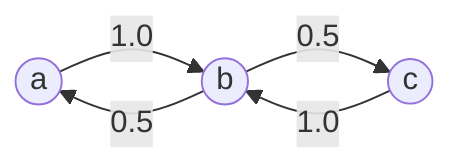

# Lesson 05: The Bigram Language Model

A language model assigns a probability to every possible next token. The **bigram model** makes the simplest possible assumption: the next token depends only on the current one. Despite its simplicity, it introduces the full train-then-sample loop that every neural language model follows — and it is the first component of the course that is *exactly* a dynamical system, a Markov chain, so the Systems lens at the end of this lesson is an identity rather than an analogy.

## Learning Objectives

- Define a **bigram language model** and derive its count-based estimator as the maximum-likelihood solution.
- Construct a **bigram count matrix** from a corpus and normalise it into a **row-stochastic** probability matrix in one line.
- Trace **inverse-transform sampling** step by step, generate a sequence, and decode it back to text.
- Relate the **row entropies** of $\mathbf{P}$ to the corpus cross-entropy through $H(X_{t+1} \mid X_t) = \sum_i \pi_i H(\mathbf{P}_{i,:})$.
- Read $\mathbf{P}$ as a discrete-time linear system: stationary distribution, eigenvalues on the unit circle, and why smoothing makes the chain mix.

## Background

Tokens and vocabulary from [[01-tokens-and-encoding]]. Probability distributions, entropy, and the max-entropy Lagrangian from [[02-probability-and-softmax]]. Cross-entropy loss from [[03-cross-entropy-loss]] (used to define the training objective; not strictly required to follow the count-based estimator).

## The Language Modelling Problem

The goal is to estimate

$$P(x_{t+1} \mid x_1, x_2, \ldots, x_t).$$

The full history can be arbitrarily long. The bigram model makes the **Markov assumption**:

$$P(x_{t+1} \mid x_1, \ldots, x_t) \approx P(x_{t+1} \mid x_t).$$

This reduces the problem to estimating $|\mathcal{V}|^2$ conditional probabilities — one for every ordered pair of tokens — arranged as a matrix $\mathbf{P}$ with $P_{ij} = P(x_{t+1} = j \mid x_t = i)$. Because every row is a probability distribution, $\mathbf{P}$ is **row-stochastic**: $P_{ij} \ge 0$ and $\sum_j P_{ij} = 1$ for every $i$. This is exactly the first-order Markov source of Shannon's 1948 paper (*A Mathematical Theory of Communication*, §3), where "artificial English" is generated by drawing each letter from the distribution conditioned on the previous one.

## Building the Bigram Matrix

### Theory

**Step 1 — Count.** Scan the corpus and tally every consecutive pair $(x_t, x_{t+1})$ into the count matrix $\mathbf{C} \in \mathbb{Z}_{\geq 0}^{|\mathcal{V}| \times |\mathcal{V}|}$:

$$C_{ij} = \text{number of times token } j \text{ follows token } i.$$

**Step 2 — Normalise.** Divide each row by its sum:

$$P_{ij} = \frac{C_{ij}}{\sum_{k=1}^{|\mathcal{V}|} C_{ik}}.$$

In code that is one line — `P = C ./ sum(C, 2)` — the column vector of row sums broadcasts across the columns. We work the corpus `"abcbabcba"` end-to-end below.

### Example — Counting bigrams in "abcbabcba"

```rustlab
% Corpus: "abcbabcba" — vocabulary a=1, b=2, c=3
vocab_size = 3;
seq    = [1, 2, 3, 2, 1, 2, 3, 2, 1];
tokens = {"a", "b", "c"};
n_tokens  = len(seq);
n_bigrams = n_tokens - 1;

% Build the count matrix
C = zeros(vocab_size, vocab_size);
for t = 1:n_bigrams
  C(seq(t), seq(t + 1)) = C(seq(t), seq(t + 1)) + 1;
end

print("Bigram count matrix C  (row=current, col=next):");
print(C);
```

The corpus has ${n_tokens} tokens, producing ${n_bigrams} bigrams. Total counts sum to ${sum(sum(C))} — matches $n_{\text{bigrams}}$.

### Example — Row-normalising counts to probabilities

```rustlab
P = C ./ sum(C, 2);            % one line: each row divided by its own sum
print("Row-stochastic probability matrix P:");
print(P);
print("Row sums (each should be 1):", sum(P, 2)');
```

Token `a` always goes to `b`. Token `c` always goes to `b`. Token `b` goes to either `a` or `c` with equal probability. Drawn as a state graph, $\mathbf{P}$ is a signal-flow diagram whose edge weights are the transition probabilities:



Every path through the graph alternates between $\{a, c\}$ and $\{b\}$ — keep that in mind for the Systems lens.

## Laplace Smoothing

### Theory

If a pair never appeared, $P_{ij} = 0$ and the cross-entropy loss is infinite on that bigram. **Add-one smoothing** ensures every pair has non-zero probability:

$$P_{ij}^{\text{smooth}} = \frac{C_{ij} + 1}{\sum_k (C_{ik} + 1)} = \frac{C_{ij} + 1}{\sum_k C_{ik} + |\mathcal{V}|}.$$

(Add-$k$ smoothing replaces the 1 by any $k > 0$; $k \to 0$ recovers the raw estimate, $k \to \infty$ the uniform row.)

### Example — Smoothed probability matrix

```rustlab
P_smooth = (C + 1) ./ sum(C + 1, 2);
print("Laplace-smoothed probability matrix P_smooth:");
print(P_smooth);
min_smooth = min(reshape(P_smooth, 1, vocab_size * vocab_size));
```

Every entry in $\mathbf{P}^{\text{smooth}}$ is now $\geq ${min_smooth:%.3f}$ — no more zero-probability bigrams. The price is paid on the training corpus: the Training Loss section below shows that smoothing *raises* the training cross-entropy.

## Row Entropy

### Theory

The entropy of each row of $\mathbf{P}$ tells us how predictable the next token is. A deterministic row (all mass on one column) has $H = 0$; an equally-spread 2-option row has $H = 1$ bit; a uniform $|\mathcal{V}|$-option row has $H = \log_2 |\mathcal{V}|$.

The rows are tied together by the **conditional entropy** of the next token given the current one:

$$H(X_{t+1} \mid X_t) \;=\; \sum_{i} \pi_i \, H(\mathbf{P}_{i,:}), \qquad \pi_i = P(X_t = i),$$

a weighted average of the row entropies in which $\pi$ is the marginal distribution of the *current* token. Under the count estimator, $\pi_i = \sum_j C_{ij} / (T - 1)$ — the fraction of bigrams whose left member is token $i$. The Training Loss section shows that the corpus cross-entropy in bits equals this number exactly.

<!-- hide -->
```rustlab
run "../lib/info.rlab"
```

### Example — Per-row entropies for the abc corpus

```rustlab
H_rows = row_entropies_bits(P);              % bits, one entry per row
pi_emp = sum(C, 2)' / sum(sum(C));           % marginal of the current token
H_cond = sum(pi_emp .* H_rows);
print("Row entropies H(P_i,:) [bits]:", H_rows);
print("pi (current-token marginal)  :", pi_emp);
print("H(X_{t+1} | X_t) = sum_i pi_i H_i =", H_cond, "bits");
```

Row entropies: $H(a) = ${H_rows(1):%.3f}$ bits (deterministic → `b`), $H(b) = ${H_rows(2):%.3f}$ bits (max for 2 equal options), $H(c) = ${H_rows(3):%.3f}$ bits (deterministic → `b`). Weighted by $\pi = [\tfrac14, \tfrac12, \tfrac14]$ they give $H(X_{t+1} \mid X_t) = ${H_cond:%.3f}$ bits: half the time the model is at `b` and faces one fair bit; the other half it is certain.

### Example — Count and probability heatmaps

Both axes of the bigram matrix are vocabulary tokens — current token on the rows, next token on the columns. `heatmap(xlabels, ylabels, M, ...)` puts those labels directly on the axes so the cells can be read as $C_{ij}$ or $P_{ij}$ without translating indices back to characters.

```rustlab
figure();
subplot(1, 3, 1)
heatmap(tokens, tokens, C, "Counts C", "viridis")
subplot(1, 3, 2)
heatmap(tokens, tokens, P, "P = C ./ sum(C, 2)", "viridis")
subplot(1, 3, 3)
heatmap(tokens, tokens, P_smooth, "P_smooth (add-one)", "viridis")
```

> [!TIP]
> Rows are the current token, columns the next. The middle panel has two rows that are a single bright cell (deterministic) and one row split 0.5/0.5; the right panel is the same picture with every dark cell lifted off zero — the mass that smoothing takes from the observed transitions.

## Sampling from the Model

### Theory

To generate text, repeatedly draw the next token by **inverse-transform sampling** (the CDF method) — the same primitive every sampler in [[21-sampling-and-generation]] is built on:

1. Look up the row $\mathbf{P}_{i,:}$ for the current token $i$.
2. Compute the cumulative distribution: $\text{CDF}_j = \sum_{k=1}^{j} P_{ik}$.
3. Draw $u \sim \text{Uniform}(0, 1)$.
4. The sampled token is $x_{t+1} = \min\{j : \text{CDF}_j \geq u\}$.

Step 4 inverts the CDF: it maps the uniform $u$ through $\text{CDF}^{-1}$, which is why a single uniform draw produces a sample from any discrete distribution.

### Example — CDF lookup for two uniform draws

```rustlab
print("Sampling mechanism demonstration:");
p_b = P(2, :);
cdf_b = cumsum(p_b);
print("  P(b)   =", p_b);
print("  CDF(b) =", cdf_b);
print("  u=0.3 -> sum(CDF < 0.3) + 1 =", sum(cdf_b < 0.3) + 1, "  (expect 1 = a)");
print("  u=0.7 -> sum(CDF < 0.7) + 1 =", sum(cdf_b < 0.7) + 1, "  (expect 3 = c)");
```

### Example — Generating a 12-token sequence

```rustlab
n_generate = 12;
generated = zeros(n_generate);
generated(1) = 1;   % start with token a

seed(7);                          % deterministic for the gallery render
draws = rand(n_generate - 1);

for t = 1:(n_generate - 1)
  curr = generated(t);
  cdf = cumsum(P(curr, :));
  generated(t + 1) = sum(cdf < draws(t)) + 1;
end

% Decode the integer ids back to text
gen_text = "";
for t = 1:n_generate
  gen_text = gen_text + tokens(generated(t));
end
print("Generated ids :", generated);
print("Generated text:", gen_text);
```

The sample reads `${gen_text}`. Notice the structure: `b` appears at every even position, because both `a` and `c` transition deterministically to `b` — the state graph above has no edge that stays inside $\{a, c\}$. The Systems lens shows that this is an eigenvalue of $\mathbf{P}$ sitting on the unit circle.

## Training Loss and Perplexity

### Theory

Why divide counts by row sums? Because that is the **maximum-likelihood estimator**. The log-likelihood of the corpus under a candidate $\mathbf{P}$ is $\ell(\mathbf{P}) = \sum_{ij} C_{ij} \log P_{ij}$, to be maximised subject to each row summing to one. The Lagrangian

$$\mathcal{J} = \sum_{ij} C_{ij} \log P_{ij} - \sum_i \mu_i \Bigl(\sum_j P_{ij} - 1\Bigr), \qquad \frac{\partial \mathcal{J}}{\partial P_{ij}} = \frac{C_{ij}}{P_{ij}} - \mu_i = 0 \;\Rightarrow\; P_{ij} = \frac{C_{ij}}{\mu_i},$$

and the constraint fixes $\mu_i = \sum_j C_{ij}$. It is the same Lagrangian shape as the max-entropy derivation of softmax in [[02-probability-and-softmax]], with objective and constraint swapping roles. Maximising likelihood is minimising the mean cross-entropy

$$\mathcal{L} = -\frac{1}{T-1} \sum_{t=1}^{T-1} \log P_{x_t, x_{t+1}} \quad [\text{nats}],$$

and the **perplexity** $e^{\mathcal{L}}$ is the model's effective branching factor at each step. (This lesson computes $\mathcal{L}$ in nats; divide by $\ln 2$ for bits, and $2^{\mathcal{L}_{\text{bits}}} = e^{\mathcal{L}_{\text{nats}}}$ is the same perplexity.)

### Example — Mean cross-entropy and perplexity on the corpus

```rustlab
function L = corpus_ce_nats(P, seq)
  % mean -log P(x_{t+1} | x_t) over every bigram of seq
  L = 0.0;
  for t = 1:(length(seq) - 1)
    L = L - log(P(seq(t), seq(t + 1)));
  end
  L = L / (length(seq) - 1);
end

mean_ce        = corpus_ce_nats(P, seq);
ppl            = exp(mean_ce);
mean_ce_smooth = corpus_ce_nats(P_smooth, seq);
print("Training CE, raw P     :", mean_ce, "nats =", mean_ce / log(2), "bits   ppl =", ppl);
print("Training CE, P_smooth  :", mean_ce_smooth, "nats =", mean_ce_smooth / log(2), "bits   ppl =", exp(mean_ce_smooth));
```

Mean cross-entropy on the training corpus: ${mean_ce:%.4f}$ nats $= ${mean_ce / log(2):%.3f}$ bits — exactly the conditional entropy $H(X_{t+1} \mid X_t)$ computed from the row entropies — corresponding to perplexity ${ppl:%.3f}$. Smoothing raises the training loss to ${mean_ce_smooth:%.3f}$ nats (perplexity ${exp(mean_ce_smooth):%.2f}$): it moves probability from transitions the corpus contains to ones it does not. That is the bias/variance trade in one number — the raw estimator fits the training data perfectly but assigns $-\log 0 = \infty$ to any unseen bigram; the smoothed one is biased on the training set and finite everywhere.

### Example — Per-row probability bars

```rustlab
figure();
subplot(3, 1, 1)
bar(tokens, P(1, :), "P(next | a) — deterministic: always b")
ylabel("Probability")
ylim([0, 1])

subplot(3, 1, 2)
bar(tokens, P(2, :), "P(next | b) — equal: a or c")
ylabel("Probability")
ylim([0, 1])

subplot(3, 1, 3)
bar(tokens, P(3, :), "P(next | c) — deterministic: always b")
xlabel("Next token")
ylabel("Probability")
ylim([0, 1])
```

> [!TIP]
> Each panel is one row of $\mathbf{P}$ — the distribution the model samples from when it sits at that token. The two single-bar panels have zero entropy; the middle one carries the model's only bit of uncertainty.

## Engineering Lenses

No signals reading adds to this lesson: the count matrix is a two-dimensional histogram of transitions, and that is all a signals view would say. The systems and information readings are both exact.

### Systems

**Exact.** Let $\boldsymbol{\pi}_t \in \mathbb{R}^{1 \times |\mathcal{V}|}$ be the distribution of the token at time $t$. The bigram model's update law is

$$\boldsymbol{\pi}_{t+1} = \boldsymbol{\pi}_t \mathbf{P},$$

a discrete-time **linear time-invariant system** whose state lives on the probability simplex. Row-stochasticity fixes its spectrum: $\mathbf{P}\mathbf{1} = \mathbf{1}$, so $\lambda = 1$ is an eigenvalue, and no eigenvalue can exceed 1 in modulus (Gershgorin: every row sums to 1). The spectral radius is exactly 1 — marginal stability by construction — and the left eigenvector for $\lambda = 1$, $\boldsymbol{\pi}\mathbf{P} = \boldsymbol{\pi}$, is the **stationary distribution**, the system's fixed point. The remaining eigenvalues decide whether $\boldsymbol{\pi}_t$ *converges* to it. `eig(P')` returns the left eigenvectors of $\mathbf{P}$:

```rustlab
[V, D] = eig(P');                       % columns of V: left eigenvectors of P
lam = real(diag(D));                    % eig returns vectors — no transpose needed
k1 = argmax(lam);                       % the lambda = 1 mode
pi_st = real(V(:, k1));
pi_st = pi_st / sum(pi_st);             % normalise to a distribution
print("eigenvalues of P      :", lam);
print("stationary pi         :", pi_st);
print("pi * P                :", pi_st * P);
print("empirical unigram     :", [sum(seq == 1), sum(seq == 2), sum(seq == 3)] / n_tokens);

lam_s = eig(P_smooth');
[Vs, Ds] = eig(P_smooth');
ks = argmax(real(diag(Ds)));
pi_sm = real(Vs(:, ks));
pi_sm = pi_sm / sum(pi_sm);
abs_s = reshape(sort(abs(lam_s), "descend"), 1, vocab_size);
print("|eigenvalues| P_smooth:", abs_s);
print("stationary pi (smooth):", pi_sm);
print("mixing |lambda_2|^8    =", abs_s(2) ^ 8);
```

The spectrum is $\{1, 0, -1\}$. The eigenvalue at $-1$ is a pole *on* the unit circle: a marginally stable **period-2 mode**. Starting from $\mathbf{e}_a$, one step gives $\mathbf{e}_b$, the next $[\tfrac12, 0, \tfrac12]$, then $\mathbf{e}_b$ again — the distribution itself alternates forever and never settles to $\boldsymbol{\pi} = [\tfrac14, \tfrac12, \tfrac14]$. That is *why* `b` occupies every even position of the sample, and why the empirical unigram $[3, 4, 2]/9$ of the corpus is not $\boldsymbol{\pi}$: a periodic chain has a stationary distribution but no limiting one; only its time average converges. Add-one smoothing puts an edge on every pair of states, the pole at $-1$ moves inside the circle to $|\lambda_2| = ${abs_s(2):%.3f}$, and the chain becomes **ergodic**: it mixes at rate $|\lambda_2|^t$ (time constant $-1/\ln|\lambda_2| \approx ${-1 / log(abs_s(2)):%.2f}$ steps), so after eight steps the transient has decayed to ${abs_s(2) ^ 8:%.4f}$ of its size and $\boldsymbol{\pi}_t$ sits on $\boldsymbol{\pi}^{\text{smooth}} = [5, 7, 5]/17$.

```rustlab
% pi_t = e_a P^t for t = 0..8.  (P^k is element-wise in rustlab — iterate instead.)
n_steps = 8;
traj   = zeros(n_steps + 1, vocab_size);
traj_s = zeros(n_steps + 1, vocab_size);
row = [1, 0, 0];  row_s = [1, 0, 0];
for t = 0:n_steps
  traj(t + 1, :)   = row;
  traj_s(t + 1, :) = row_s;
  row   = row * P;
  row_s = row_s * P_smooth;
end
steps = 0:n_steps;

figure();
subplot(1, 2, 1)
hold("on")
plot(steps, traj(:, 1)', "color", "blue",  "label", "P(a)")
plot(steps, traj(:, 2)', "color", "red",   "label", "P(b)")
plot(steps, traj(:, 3)', "color", "green", "label", "P(c)")
yline(pi_st(2), "gray", "pi(b) = 0.5")
legend("P(a)", "P(b)", "P(c)")
title("pi_t under P: pole at -1, period 2")
xlabel("t"); ylabel("probability")
hold("off")
subplot(1, 2, 2)
hold("on")
plot(steps, traj_s(:, 1)', "color", "blue",  "label", "P(a)")
plot(steps, traj_s(:, 2)', "color", "red",   "label", "P(b)")
plot(steps, traj_s(:, 3)', "color", "green", "label", "P(c)")
yline(pi_sm(2), "gray", "pi(b) = 7/17")
legend("P(a)", "P(b)", "P(c)")
title("pi_t under P_smooth: |lambda_2| = 0.457")
xlabel("t"); ylabel("probability")
hold("off")
```

> [!TIP]
> Left: $P(b)$ flips between 0 and 1 on every step and never approaches the dashed stationary value — the $-1$ pole. Right: the same start under $\mathbf{P}^{\text{smooth}}$ decays onto the dashed line in about three steps, alternating in sign as a negative real pole should.

### Information

**Exact.** The **entropy rate** of the stationary chain is the row entropies averaged under $\boldsymbol{\pi}$, and the maximum-likelihood $\mathbf{P}$ makes the training cross-entropy equal to it — MLE *is* minimum cross-entropy:

```rustlab
H_rate  = sum(pi_st .* H_rows);
ce_bits = mean_ce / log(2);
H_uni   = entropy_bits([sum(seq == 1), sum(seq == 2), sum(seq == 3)] / n_tokens);
print("entropy rate sum_i pi_i H_i =", H_rate, "bits");
print("training CE (bits), raw P  =", ce_bits, "   P_smooth =", mean_ce_smooth / log(2));
print("floors: log2|V| =", log2(vocab_size), "  H(unigram) =", H_uni, "  H(next|cur) =", H_rate);

figure();
bar({"log2|V| blind", "H(X) unigram", "H(next|cur) bigram"}, [log2(vocab_size), H_uni, H_rate])
title("Staircase of floors for 'abcbabcba' (bits per token)")
ylabel("bits")
ylim([0, 1.8])
```

> [!TIP]
> Each step down is information a stronger model class recovers: $\log_2 3 = 1.585$ bits for a blind guess, ${H_uni:%.3f}$ bits knowing only letter frequencies, ${H_rate:%.3f}$ bits knowing the previous letter. [23-putting-it-all-together](23-putting-it-all-together.md) adds the trained transformer's cross-entropy as the next step.

The staircase is the chain rule of entropy made visible. Because conditioning cannot increase entropy, $H(X_{t+1} \mid X_t) \ge H(X_{t+1} \mid X_1, \ldots, X_t)$: the bigram's ${H_rate:%.1f}$ bits is a **ceiling** for any longer-context model of this corpus and a **floor** for any model that sees only the current token — Shannon's source-coding theorem says no such code can beat it. Every later lesson — attention, the transformer, the capstone — is a method to recover the entropy that the Markov assumption leaves on the table. Perplexity is the same number in a different base: $2^{0.5} = e^{0.3466} = 1.414$ effective choices per step. And the equivalence with compression is literal: feed these conditional distributions to an arithmetic coder and the corpus compresses to ${H_rate:%.1f}$ bits per token plus a constant; the smoothed model would spend ${mean_ce_smooth / log(2):%.2f}$.

## Key Takeaways

- The bigram model encodes corpus statistics in a single row-stochastic matrix — reading a row tells you exactly what the model "thinks" will follow a given token; dividing counts by row sums is the maximum-likelihood estimate.
- Inverse-transform sampling from a row of $\mathbf{P}$ is the primitive every sampling strategy in Lesson 21 (temperature, top-K, nucleus) is built on.
- The training cross-entropy of the MLE equals the conditional entropy $\sum_i \pi_i H(\mathbf{P}_{i,:})$ — here $0.5$ bits, perplexity $1.414$; smoothing trades training fit ($0.98$ bits) for finite loss on unseen bigrams.
- $\boldsymbol{\pi}_{t+1} = \boldsymbol{\pi}_t \mathbf{P}$ is a linear system with spectral radius 1: the $\lambda = 1$ left eigenvector is the stationary distribution, and any other eigenvalue on the unit circle (here $-1$) is a mode that never dies out. Smoothing pulls it inside and the chain mixes.
- Its weakness: context is limited to one token. The bigram's entropy rate is a floor for Markov-1 models and a ceiling for everything that follows.

## Standalone Scripts

| Script | What it computes |
|---|---|
| `bigram_counts.rlab` | the 3×3 bigram count, one-line row-normalised, and smoothed probability matrices for `"abcbabcba"`; row entropies and $H(X_{t+1}\mid X_t)$; heatmaps |
| `bigram_sampling.rlab` | inverse-transform sampling trace, a 12-token generated sequence decoded to text, training CE under $\mathbf{P}$ and $\mathbf{P}^{\text{smooth}}$ |
| `bigram_stationary.rlab` | `eig(P')` → stationary distribution and the $\{1, 0, -1\}$ spectrum; $\boldsymbol{\pi}_t$ under $\mathbf{P}$ vs $\mathbf{P}^{\text{smooth}}$; entropy rate and the staircase of floors |

Run all with `make lesson-05` (or `rustlab run lessons/05-bigram-language-model/<name>.rlab`).

## Expected Numerical Outputs Summary

| Variable | Expected Value |
|---|---|
| `n_tokens`, `n_bigrams` | `9`, `8` |
| `sum(sum(C))` | `8` (= `n_bigrams`) |
| `P(1, 2)`, `P(2, 1)`, `P(2, 3)` | `1.0`, `0.5`, `0.5` |
| `min_smooth` | ≈ `0.143` (= 1/7, the `b → b` cell) |
| `H_rows` | `[0, 1, 0]` bits |
| `pi_emp` | `[0.25, 0.5, 0.25]` |
| `H_cond` | `0.5` bits |
| `gen_text` (seed 7) | `ababcbcbabcb` |
| `mean_ce`, `ppl` | `0.3466` nats (= `0.5` bits), `1.414` |
| `mean_ce_smooth` | `0.679` nats (= `0.980` bits), ppl `1.972` |
| `eig(P')` | `{1, 0, -1}` |
| `pi_st` | `[0.25, 0.5, 0.25]` |
| `abs(eig(P_smooth'))` (sorted) | `{1, 0.457, 0}`; `0.457^8` ≈ `0.0019` |
| `pi_sm` | `[0.294, 0.412, 0.294]` (= `[5, 7, 5]/17`) |
| `H_rate` | `0.5` bits (= `ce_bits`) |
| `log2(3)`, `H_uni` | `1.585`, `1.530` bits |

## Exercises

1. **Entropy of rows.** The notebook prints $H(a), H(b), H(c)$ for `"abcbabcba"`. Which token is most predictable? Which is least? Repeat for the corpus `"aabbcc"` — the one-line normalisation works unchanged for any $|\mathcal{V}|$.
2. **Laplace smoothing effect.** For `"abcbabcba"` with $|\mathcal{V}| = 3$, compute the Laplace-smoothed probability for the bigram (a → a), which never appeared. What is $P^{\text{smooth}}_{11}$, and what happens to the training cross-entropy under add-$k$ smoothing as $k \to \infty$?
3. **Longer corpus.** Extend the corpus to `"abcbabcbabc"` and recompute the bigram matrix. Do the probabilities change significantly? What happens as the corpus grows?
4. **Perplexity interpretation.** What does a perplexity of 1 mean? What about perplexity of $|\mathcal{V}|$? Check that $2^{\mathcal{L}_{\text{bits}}}$ and $e^{\mathcal{L}_{\text{nats}}}$ agree on this corpus.
5. **Beyond bigrams.** A trigram model conditions on the last two tokens: $P(x_{t+1} \mid x_{t-1}, x_t)$. How many parameters does a trigram model have for vocabulary size $|\mathcal{V}|$? How does this scale compared to the bigram model?
6. **Spectral gap.** Replace add-one by add-$k$ for $k \in \{0.01, 0.1, 1, 10\}$ and print $|\lambda_2|$ of $\mathbf{P}^{\text{smooth}}$ each time. Which way does the pole move as $k \to 0$, and what does that say about how quickly a *lightly* smoothed chain forgets its starting token?

<details><summary>Solution to 6 (sketch)</summary>

As $k \to 0$ the smoothed matrix approaches $\mathbf{P}$ and $|\lambda_2| \to 1$: the pole returns to the unit circle and the mixing time $-1/\ln|\lambda_2|$ diverges. As $k \to \infty$ every row tends to the uniform distribution, $\mathbf{P}^{\text{smooth}} \to \tfrac13 \mathbf{1}\mathbf{1}^\top$, whose non-unit eigenvalues are all zero — the chain forgets its start in a single step.

</details>

## What's next

[[06-linear-layers-and-gradient-descent]] replaces the count table with a **learned linear layer** $y = Wx + b$ and shows how **gradient descent** drives the parameters toward the same optimum the count-based estimator finds analytically. The transition from "look up" to "learn" is the conceptual jump from a classical n-gram model to a neural one — every subsequent lesson uses gradient descent.
