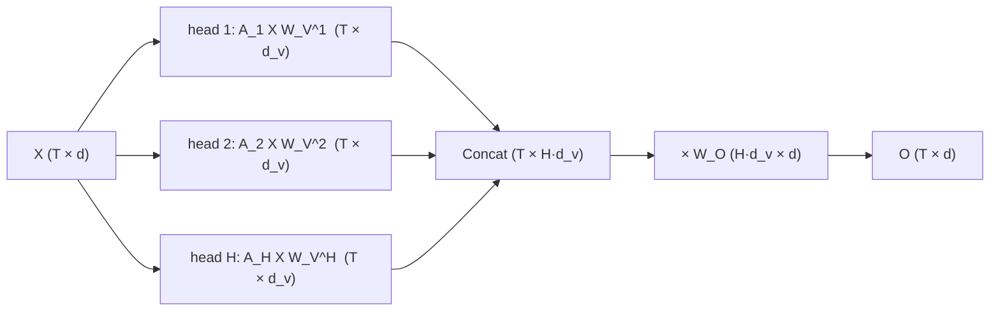

# Lesson 09: Multi-Head Attention

A single attention head ([[08-scaled-dot-product-attention]]) produces *one* row-stochastic mixing matrix $\mathbf{A}$. Language has many kinds of relationships — syntactic, positional, coreferential — and one head can express only one of them per position. **Multi-head attention** runs $H$ heads in parallel, concatenates their outputs, and projects them back to model width. In signal-processing terms it is a **filter bank**: $H$ causal time-varying filters, each applied to its own low-rank slice of the signal, summed through a synthesis matrix $\mathbf{W}_O$.

## Learning Objectives

- Explain why a **single** attention head is limited (one softmax gives one convex combination per position, and its score matrix has rank at most $d_k$) and what **multi-head attention** (MHA) buys at the same cost.
- Compute $H$ parallel attention heads $\mathbf{A}_1, \dots, \mathbf{A}_H$, each with its own $\mathbf{W}_Q^h, \mathbf{W}_K^h, \mathbf{W}_V^h$, on the same input $\mathbf{X}$.
- Write the **concatenation** of per-head outputs as a horizontal stack along the feature axis, apply the **output projection** $\mathbf{W}_O$, and verify the filter-bank identity $\mathrm{Concat}\cdot\mathbf{W}_O = \sum_h \mathbf{A}_h \mathbf{X} \mathbf{W}_V^h \mathbf{W}_O^{(h)}$ numerically.
- Derive the total parameter count of an MHA block as $4 d_{\text{model}}^2$ when $d_k = d_v = d_{\text{model}}/H$.
- Read a grid of head-attention heatmaps as four causal filters (first-sample hold, unit delay, identity, growing box) and measure each head's selectivity in bits.

## Background

Scaled dot-product attention, the causal mask, and the $\mathbf{Q}, \mathbf{K}, \mathbf{V}$ formulation from [[08-scaled-dot-product-attention]]. Linear layers and matrix multiplication from [[06-linear-layers-and-gradient-descent]]. Block-wise horizontal concatenation of matrices. Row entropy of a stochastic matrix in bits (`lib/info.rlab`, applied to attention in Lesson 08).

<!-- hide -->
```rustlab
run "../lib/info.rlab"
run "../lib/transformer.rlab"
```

## Why More Than One Head

### Theory

A single attention head can compute *one* way of relating tokens — for example, "each token attends to the previous one". But language has many relationships: syntactic (subject–verb agreement), coreference (*it* → *mat*), long-range dependencies (quotes), positional (first token, last token). Two structural limits make one head insufficient:

1. **One softmax, one convex combination.** Row $t$ of $\mathbf{A}$ is a single probability vector over the past, so the output at $t$ is one weighted average of the values. A head cannot fetch "the previous token" *and* "the first token" as separate quantities; it can only blend them.
2. **Rank at most $d_k$.** The score matrix $\mathbf{Q}_h\mathbf{K}_h^\top$ is a product of two $T \times d_k$ factors, so its rank is at most $d_k$: a narrow head chooses its pattern from a $d_k$-dimensional family (verified in the Signals lens below).

**Multi-head attention** runs $H$ independent attention computations in parallel, each with its own projection matrices, and combines the results. $H$ heads of width $d_k = d_{\text{model}}/H$ cost the same multiply–adds as one head of width $d_{\text{model}}$ (the score FLOPs are $2T^2 d_{\text{model}}$ either way) but perform $H$ simultaneous retrievals per position instead of one.

## Per-Head Projections

### Theory

For each head $h = 1, \dots, H$, project the input $\mathbf{X}$ through its own weight matrices:

$$\mathbf{Q}_h = \mathbf{X}\mathbf{W}_Q^h, \quad \mathbf{K}_h = \mathbf{X}\mathbf{W}_K^h, \quad \mathbf{V}_h = \mathbf{X}\mathbf{W}_V^h.$$

A common choice is $d_k = d_v = d_{\text{model}}/H$: each head works on an $H$-th of the feature width but sees the *full* input. Per-head attention follows Lesson 08 unchanged:

$$\mathbf{A}_h = \mathrm{softmax}\!\left(\frac{\mathbf{Q}_h \mathbf{K}_h^\top}{\sqrt{d_k}} + \mathbf{M}\right), \qquad \mathbf{O}_h = \mathbf{A}_h \mathbf{V}_h \in \mathbb{R}^{T \times d_v}.$$

The causal mask $\mathbf{M}$ is shared across heads — every head must respect the same "no peeking at the future" rule.

## Four Heads, Four Patterns

### Theory

Four heads with hand-set $(\mathbf{Q}_h, \mathbf{K}_h)$ designed to reveal distinct attention patterns: first-token, previous-token, self, uniform. Each pattern is one that trained models are observed to contain; here we hand-set the projections so the patterns are deterministic and visible. Heads 2 and 3 **hand-write position into $\mathbf{Q}$ and $\mathbf{K}$** (a unit-circle code of the index $t$) — attention itself has no notion of position, and [[10-positional-encoding]] shows where a real model gets that signal. Head 1 keys on a *content* feature instead: head 1 is a content head, heads 2–3 are positional heads.

### Example — Shared causal mask and helper

The additive mask `causal_mask(T)` from `lib/transformer.rlab` is $0$ on and below the diagonal and $-10^9$ above it; every head adds the same mask before its softmax.

```rustlab
T = 6;
H = 4;
d_k = 2;
scale = 1.0 / sqrt(d_k);
M = causal_mask(T);

function A = causal_attention_weights(Q, K, scale, M)
  S = Q * K' * scale;
  A = softmax(S + M);      % row-wise softmax of the masked scores
end
```

### Example — Head 1: "look at the first token"

$\mathbf{K}_1$ has a strong feature only in row 1; every query asks for that feature.

```rustlab
K1 = zeros(T, d_k);
K1(1, 1) = 3.0;
Q1 = zeros(T, d_k);
Q1(:, 1) = ones(T, 1);
A1 = causal_attention_weights(Q1, K1, scale, M);
```

### Example — Head 2: "previous token"

Position $i$ is written onto the unit circle, $\mathbf{K}_i = 3\,[\cos(2\pi i/T), \sin(2\pi i/T)]$, and query $t$ asks for the point one step behind, so $\mathbf{Q}_t \cdot \mathbf{K}_i$ peaks at $i = t-1$.

```rustlab
K2 = zeros(T, d_k);
Q2 = zeros(T, d_k);
for i = 1:T
  K2(i, 1) = 3.0 * cos(2.0 * pi * i / T);
  K2(i, 2) = 3.0 * sin(2.0 * pi * i / T);
end
for t = 1:T
  Q2(t, 1) = 3.0 * cos(2.0 * pi * (t - 1) / T);
  Q2(t, 2) = 3.0 * sin(2.0 * pi * (t - 1) / T);
end
A2 = causal_attention_weights(Q2, K2, scale, M);
```

### Example — Head 3: "self"

Same encoding as Head 2, but $\mathbf{Q}_t = \mathbf{K}_t$.

```rustlab
A3 = causal_attention_weights(K2, K2, scale, M);
```

### Example — Head 4: "uniform over past"

All scores zero → softmax produces uniform weights over the available past.

```rustlab
Q4 = zeros(T, d_k);
K4 = zeros(T, d_k);
A4 = causal_attention_weights(Q4, K4, scale, M);
A4_row4 = A4(4, :);
print("Head 4 row 4:", A4_row4);
```

Head 4 row 4 is $[0.25, 0.25, 0.25, 0.25, 0, 0]$ — the uniform case is exactly the Lesson 07 averaging matrix. Computed: ${A4_row4(1):%.3f}, ${A4_row4(2):%.3f}, ${A4_row4(3):%.3f}, ${A4_row4(4):%.3f}, ${A4_row4(5):%.3f}, ${A4_row4(6):%.3f}.

### Example — Four head-attention heatmaps

Both axes are token positions $t_1..t_T$; rows are queries, columns are keys.

```rustlab
positions = {"t1", "t2", "t3", "t4", "t5", "t6"};

figure();
subplot(2, 2, 1)
heatmap(positions, positions, A1, "Head 1 — first token", "viridis")
subplot(2, 2, 2)
heatmap(positions, positions, A2, "Head 2 — previous token", "viridis")
subplot(2, 2, 3)
heatmap(positions, positions, A3, "Head 3 — self", "viridis")
subplot(2, 2, 4)
heatmap(positions, positions, A4, "Head 4 — uniform", "viridis")
```

> [!TIP]
> Head 1 lights up column $t_1$, head 2 the sub-diagonal, head 3 the diagonal, head 4 fills each row's causal triangle evenly. Row 1 of every head is $[1, 0, \dots]$ — with only itself visible, even a "previous-token" head has nowhere else to look. In head 3, row 6 leaks ${A3(6,1):%.3f} onto $t_1$ as well as $t_5$: the unit-circle code wraps at $T = 6$, so position 1 sits next to position 6 — a first taste of the aliasing that [Lesson 10](10-positional-encoding.md) designs around.

All four are lower-triangular (same causal mask) with rows summing to 1 (softmax), yet they compute completely different mixings. Head 4 recovers exactly the uniform prefix average from [[07-context-and-naive-averaging]] — attention is a strict generalisation.

## Concatenation and Output Projection

### Theory

Per-head outputs $\mathbf{O}_h \in \mathbb{R}^{T \times d_v}$ are stacked along the feature axis and projected back to $d_{\text{model}}$:

$$\mathrm{Concat} = [\mathbf{O}_1, \mathbf{O}_2, \dots, \mathbf{O}_H] \in \mathbb{R}^{T \times H d_v}, \qquad \mathbf{O} = \mathrm{Concat} \cdot \mathbf{W}_O.$$

When $d_v = d_{\text{model}}/H$ the concatenation already has the right shape, but $\mathbf{W}_O$ is essential: it mixes features *across* heads so later layers can combine what each head discovered. Without it, slices of $\mathbf{O}$ come from unrelated heads and the $H$ parallel computations never interact.



> [!TIP]
> Fan-out on the left (one $\mathbf{X}$, $H$ sets of projections), fan-in on the right ($\mathbf{W}_O$ sums the heads' contributions into one $d$-wide stream). The Signals lens below writes this picture as a single equation.

### Example — Two-head pipeline with explicit values

The full pipeline in compact form ($T=4$, $H=2$, $d_k=d_v=2$, $d_{\text{model}}=4$). With a one-hot $\mathbf{X} = \mathbf{I}$ the value projections are column slices of $\mathbf{X}$ — head 1 reads features $x_3, x_4$ and head 2 reads $x_1, x_2$, so that both heads have something non-zero to say in the same row — and $\mathbf{W}_O$ is hand-set to **mix** the heads: output channel $d_1$ receives $h_{1.1} + h_{2.1}$ and channel $d_3$ receives $-h_{2.1}$.

```rustlab
T2 = 4;
d_model = 4;
d_k2 = 2;
d_v = 2;
scale2 = 1.0 / sqrt(d_k2);
X = eye(T2);                                % one-hot tokens
M2 = causal_mask(T2);

% Head 1: self-attention on a cyclic position code (as head 3 above)
K1b = zeros(T2, d_k2);
for t = 1:T2
  K1b(t, 1) = 3.0 * cos(2.0 * pi * t / T2);
  K1b(t, 2) = 3.0 * sin(2.0 * pi * t / T2);
end
V1 = X(:, 3:4);                             % W_V^1 selects features x3, x4

% Head 2: uniform over past
Q2b = zeros(T2, d_k2);
K2b = zeros(T2, d_k2);
V2 = X(:, 1:2);                             % W_V^2 selects features x1, x2

A1b = causal_attention_weights(K1b, K1b, scale2, M2);
A2b = causal_attention_weights(Q2b, K2b, scale2, M2);
O1 = A1b * V1;
O2 = A2b * V2;
O_concat = [O1, O2];                        % T × H*d_v

% Output projection: rows = concat columns (h1.1, h1.2, h2.1, h2.2), cols = d1..d4
W_O = [ 1.0, 0.0,  0.0, 0.0;
        0.0, 1.0,  0.0, 0.0;
        1.0, 0.0, -1.0, 0.0;
        0.0, 0.0,  0.0, 1.0 ];
O = O_concat * W_O;

print("Concat = [O_1, O_2]:", O_concat);
print("O = Concat * W_O:", O);
```

<!-- hide -->
```rustlab
concat_shape = size(O_concat);
out_shape    = size(O);
n_qkv = 3 * d_model * d_model;
n_wo  = d_model * d_model;
n_tot = n_qkv + n_wo;
```

Shapes: $\mathrm{Concat} \in \mathbb{R}^{${concat_shape(1)} \times ${concat_shape(2)}}$, $\mathbf{O} \in \mathbb{R}^{${out_shape(1)} \times ${out_shape(2)}}$. Read row 3. `Concat` holds $[${O_concat(3,1):%.3f}, ${O_concat(3,2):%.3f}, ${O_concat(3,3):%.3f}, ${O_concat(3,4):%.3f}]$ — head 1 put almost all its weight on token 3 itself (feature $x_3$), head 2 averaged tokens 1–3 ($x_1$ and $x_2$ at $1/3$ each). In `O`, channel $d_1 = h_{1.1} + h_{2.1} = ${O_concat(3,1):%.3f} + ${O_concat(3,3):%.3f} = ${O(3,1):%.3f}$: one output channel now carries information from **both** heads, which no column of `Concat` did. Channel $d_3 = -h_{2.1} = ${O(3,3):%.3f}$ is negative, so the heatmap below needs a signed colour scale. A learned $\mathbf{W}_O$ does the same with dense trained weights instead of hand-set $\pm 1$.

### Example — W_O, Concat and final output heatmaps

Rows of `Concat` and `O` are token positions; columns are feature dimensions ($h_{1.*}$ from head 1, $h_{2.*}$ from head 2, then $d_1..d_4$). $\mathbf{W}_O$ is drawn with its rows labelled by the concat column it reads and its columns by the output channel it writes.

```rustlab
positions2  = {"t1", "t2", "t3", "t4"};
concat_cols = {"h1.1", "h1.2", "h2.1", "h2.2"};
out_cols    = {"d1", "d2", "d3", "d4"};

figure();
subplot(1, 3, 1)
heatmap(out_cols, concat_cols, W_O, "W_O  (H*d_v × d_model)", "viridis")
subplot(1, 3, 2)
heatmap(concat_cols, positions2, O_concat, "Concat = [O_1, O_2]  (T × H*d_v)", "viridis")
subplot(1, 3, 3)
heatmap(out_cols, positions2, O, "O = Concat * W_O  (T × d_model)", "viridis")
```

> [!TIP]
> In $\mathbf{W}_O$ (left), column $d_1$ has two non-zero rows, $h_{1.1}$ and $h_{2.1}$: that is the mixing. Follow it to the right panel — column $d_1$ of `O` is the sum of columns $h_{1.1}$ and $h_{2.1}$ of `Concat` — and note the negative column $d_3$.

## Parameter Count

### Theory

Pack the per-head projections into three combined $d_{\text{model}} \times d_{\text{model}}$ matrices; head $h$ uses columns $(h-1)d_k + 1, \dots, h d_k$. The total is

$$\underbrace{3 d_{\text{model}}^2}_{\mathbf{W}_Q, \mathbf{W}_K, \mathbf{W}_V} + \underbrace{d_{\text{model}}^2}_{\mathbf{W}_O} \;=\; 4 d_{\text{model}}^2.$$

For the toy $d_{\text{model}} = 4$ that is $3 \cdot 16 + 16 = ${n_tot}$ parameters. This counts weight matrices only; a GPT-2-style block also carries $4 d_{\text{model}}$ bias parameters (one bias per $\mathbf{Q}, \mathbf{K}, \mathbf{V}, \mathbf{O}$ projection), ignored here as in [[11-feed-forward-block]].

**$H$ does not appear.** More heads at fixed $d_{\text{model}}$ means narrower heads ($d_k = d_{\text{model}}/H$), not more parameters. Head *count* is an architectural choice; head *width* is what determines capacity.

### Example — The packed W_Q with its head slices

With $\mathbf{X} = \mathbf{I}$ the projections *are* the per-head query matrices ($\mathbf{Q}_h = \mathbf{X}\mathbf{W}_Q^h = \mathbf{W}_Q^h$), so the packed $\mathbf{W}_Q$ of the two-head pipeline is simply $[\mathbf{W}_Q^1, \mathbf{W}_Q^2]$: rows are input features, columns are the $H \cdot d_k = d_{\text{model}}$ query dimensions.

```rustlab
W_Q_packed = [K1b, Q2b];                    % head 1 used Q = K1b; head 2 used Q = 0
Q_all = X * W_Q_packed;                     % one matmul computes every head's Q
slice_err = max(max(abs(Q_all(:, 1:2) - K1b)));
print("max |Q_all(:, 1:2) - Q_1| =", slice_err);

figure();
heatmap({"h1.q1", "h1.q2", "h2.q1", "h2.q2"}, {"x1", "x2", "x3", "x4"}, W_Q_packed, "Packed W_Q (d_model × H*d_k): columns 1–2 = head 1, 3–4 = head 2", "viridis")
```

> [!TIP]
> Head 1's slice (columns $h_{1.q1}, h_{1.q2}$) is the $\pm 3$ unit-circle code; head 2's slice is all zeros because the uniform head asks no question. The matrix is $d_{\text{model}} \times d_{\text{model}}$ however many vertical slices it is cut into — that is why $H$ drops out of $4d_{\text{model}}^2$.

## Why Does This Work?

### Theory

Each head sees the full input $\mathbf{X}$ but projects it down to a $d_k$-dimensional subspace before computing attention. Different projections emphasise different features of $\mathbf{X}$, so each head sees a different "view" of the sequence. With enough heads and sufficient training, the heads *tend* to specialise — some learn positional patterns (our heads 2–3), some content patterns (our head 1), some long-range structure. Specialisation is not engineered: because all heads share the same input and loss, training *tends* to find projections that cover somewhat complementary patterns. The tendency is only partial — head-pruning studies on trained models (e.g. Michel et al., 2019, "Are Sixteen Heads Really Better than One?") remove a large fraction of heads with little loss in quality, so real models carry substantial head redundancy.

**Preview — induction heads.** The most studied learned pattern combines two of our four heads across two layers. A previous-token head (head 2) in layer 1 writes "the token before me was $a$" into each position's residual stream; a head in layer 2 then attends from the current token $a$ to every earlier position whose *predecessor* was $a$ and copies what followed it. The pair implements "the last time I saw $a$ it was followed by $b$, so predict $b$" — in-context copying, which no single head can express because it needs one head's output as the next head's key. [[13-transformer-block]] stacks the layers that make this possible.

## Engineering Lenses

No systems reading adds to this lesson: multi-head attention is a memoryless map from $\mathbf{X}$ to $\mathbf{O}$ (its state along time, the key/value cache, appears in [[21-sampling-and-generation]]).

### Signals

**Exact.** *Filter bank.* Split $\mathbf{W}_O$ into row blocks $\mathbf{W}_O^{(h)} \in \mathbb{R}^{d_v \times d_{\text{model}}}$ (rows $(h-1)d_v+1, \dots, h d_v$). Block matrix multiplication then gives

$$\mathrm{Concat} \cdot \mathbf{W}_O \;=\; \sum_{h=1}^{H} \mathbf{O}_h \mathbf{W}_O^{(h)} \;=\; \sum_{h=1}^{H} \mathbf{A}_h \,\mathbf{X}\, \mathbf{W}_V^h \mathbf{W}_O^{(h)}.$$

Each term is a causal time-varying filter $\mathbf{A}_h$ along the token axis (Lesson 07's reading of a mixing matrix) composed with a channel map $\mathbf{W}_V^h \mathbf{W}_O^{(h)}$ of rank at most $d_v$: $\mathbf{A}_h$ is the analysis filter, $\mathbf{W}_O^{(h)}$ the synthesis filter, and MHA is the **sum** of $H$ rank-limited filters. This answers both questions at once — $\mathbf{W}_O$ is there so each head's output lands in the shared $d_{\text{model}}$-dimensional stream, and heads "add up" literally.

```rustlab
W_V1 = eye(d_model)(:, 3:4);                % head 1's value projection (selects x3, x4)
W_V2 = eye(d_model)(:, 1:2);                % head 2's value projection (selects x1, x2)
W_O1 = W_O(1:2, :);                         % synthesis block of head 1
W_O2 = W_O(3:4, :);                         % synthesis block of head 2
O_sum = A1b * X * W_V1 * W_O1 + A2b * X * W_V2 * W_O2;
bank_err = max(max(abs(O - O_sum)));
print("max |Concat*W_O - sum_h A_h X W_V^h W_O^(h)| =", bank_err);
```

The identity holds exactly (maximum deviation ${bank_err}).

**Exact.** *Impulse responses.* Row $t$ of $\mathbf{A}_h$ is the impulse response seen at output time $t$. The four heads are four textbook causal filters: head 1 holds the first sample (a DC hold), head 2 is the unit delay $z^{-1}$, head 3 is the identity, head 4 is Lesson 07's growing box. Attention can realise any causal filter with non-negative taps summing to one — and, unlike a fixed filter, choose the taps per input.

```rustlab
figure();
subplot(1, 4, 1)
stem(1:T, A1(4, :), "color", "blue")
title("head 1: first-sample hold")
xlabel("key position i")
subplot(1, 4, 2)
stem(1:T, A2(4, :), "color", "blue")
title("head 2: unit delay z^-1")
xlabel("key position i")
subplot(1, 4, 3)
stem(1:T, A3(4, :), "color", "blue")
title("head 3: identity")
xlabel("key position i")
subplot(1, 4, 4)
stem(1:T, A4(4, :), "color", "blue")
title("head 4: growing box")
xlabel("key position i")
```

> [!TIP]
> Each panel is row 4 of one head — the taps applied to keys $1..6$ when the query sits at $t = 4$. Taps at $i > 4$ are exactly zero (causal); the non-zero taps sum to one (softmax).

**Exact.** *Rank.* $\mathbf{Q}_h\mathbf{K}_h^\top$ is $T \times T$ but factors through $d_k = 2$ columns, so its rank is at most 2. Head 1's score matrix has rank 1 (a single key feature), head 4's has rank 0 (all scores zero); heads 2–3 use the full budget. $H$ narrow heads therefore give $H$ independent rank-$d_k$ score matrices where one wide head gives a single rank-$d_{\text{model}}$ one — at identical cost:

```rustlab
print("rank(Q_h K_h') for heads 1..4:", rank(Q1 * K1'), rank(Q2 * K2'), rank(K2 * K2'), rank(Q4 * K4'));
T_big = 1024;
d_big = 512;
H_big = 8;
flops_wide   = 2 * T_big^2 * d_big;                    % one head of width d
flops_narrow = H_big * 2 * T_big^2 * (d_big / H_big);  % H heads of width d/H
print("score FLOPs, one wide head vs H narrow heads:", flops_wide, flops_narrow);
```

### Information

**Exact.** *Selectivity in bits.* The row entropy $H(\mathbf{A}_h[t,:])$ (Lesson 08) measures how many past positions a head effectively blends at query $t$; the ceiling is $\log_2 t$ bits (uniform). Computed on the four heads above:

```rustlab
Hs = [row_entropies_bits(A1)', row_entropies_bits(A2)', row_entropies_bits(A3)', row_entropies_bits(A4)'];
Htab = [(1:T)', log2(1:T)', Hs];
print("columns: t, log2 t, head 1, head 2, head 3, head 4  (bits)");
print(Htab);
```

| $t$ | $\log_2 t$ | head 1 (first) | head 2 (previous) | head 3 (self) | head 4 (uniform) |
|---|---|---|---|---|---|
| 2 | 1.00 | ${Hs(2,1):%.2f} | ${Hs(2,2):%.2f} | ${Hs(2,3):%.2f} | ${Hs(2,4):%.2f} |
| 4 | 2.00 | ${Hs(4,1):%.2f} | ${Hs(4,2):%.2f} | ${Hs(4,3):%.2f} | ${Hs(4,4):%.2f} |
| 6 | 2.58 | ${Hs(6,1):%.2f} | ${Hs(6,2):%.2f} | ${Hs(6,3):%.2f} | ${Hs(6,4):%.2f} |

Head 4 sits exactly on the ceiling — it selects nothing. Heads 2 and 3 spend ${Hs(4,2):%.2f} and ${Hs(4,3):%.2f} bits at $t = 4$, i.e. $2^{H}$ ≈ ${2 ^ Hs(4,2):%.2f} and ${2 ^ Hs(4,3):%.2f} effective positions — nearly one-hot. Head 1 is the softest: its score margin of $3/\sqrt{2}$ leaves ${Hs(6,1):%.2f} bits at $t = 6$ (about ${2 ^ Hs(6,1):%.1f} effective positions), so a sharper "first token" head needs a larger key magnitude (Exercise 6).

**Model.** *Joint versus per-head information.* Each head extracts a fragment of the mutual information $I(X_{t+1}; X_{1..t})$ that Lesson 08 identified as attention's prediction signal. Two heads that recover the *same* fragment are redundant — $I(X_{t+1}; \mathbf{o}_t^{(h_1)}, \mathbf{o}_t^{(h_2)})$ equals either head's individual contribution — while heads recovering *different* fragments add. Cross-entropy training therefore rewards complementary heads, but only weakly: the pruning results above show trained models keep many near-redundant heads. Heads 2 and 3 here are an example — both are pure position and, past $t = 2$, carry the same information about *where* to look. $\mathbf{W}_O$ then re-mixes the surviving fragments into one dense representation for the next layer.

## Key Takeaways

- **Why multiple heads:** one softmax gives one convex combination per position and a rank-$\le d_k$ score matrix; $H$ heads give $H$ simultaneous retrievals at the FLOPs of one wide head.
- **Per-head:** run Lesson-08 attention with its own $\mathbf{W}_Q^h, \mathbf{W}_K^h, \mathbf{W}_V^h$.
- **Concat + project:** stack head outputs along the feature axis, then project with $\mathbf{W}_O$ to mix them; equivalently, $\mathrm{Concat}\cdot\mathbf{W}_O = \sum_h \mathbf{A}_h\mathbf{X}\mathbf{W}_V^h\mathbf{W}_O^{(h)}$ — a filter bank whose synthesis filters are the row blocks of $\mathbf{W}_O$.
- **Four heads, four filters:** first-sample hold, unit delay $z^{-1}$, identity, growing box; their row entropies (≈ 0.5, ≈ 0.25 and $\log_2 t$ bits) measure how selective each is.
- **Parameter count:** $4 d_{\text{model}}^2$ — independent of the number of heads when $d_k = d_{\text{model}}/H$.
- **Uniform averaging (Lesson 07) is a special case:** a degenerate head with zero $\mathbf{Q}$ and $\mathbf{K}$ produces exactly the prefix-average matrix.

## Standalone Scripts

| Script | What it computes |
|---|---|
| `multi_head_weights.rlab` | four hand-crafted heads (first-token, previous-token, self, uniform) as one 2×2 heatmap grid; ranks of the score matrices; per-row entropies in bits; the row-4 impulse responses |
| `head_concatenation.rlab` | full $T=4, H=2$ pipeline: per-head $\mathbf{O}_h$ via column slices, concat, the mixing $\mathbf{W}_O$ (signed heatmaps); the packed $\mathbf{W}_Q$; parameter count |
| `filter_bank_identity.rlab` | verifies $\mathrm{Concat}\cdot\mathbf{W}_O = \sum_h \mathbf{A}_h\mathbf{X}\mathbf{W}_V^h\mathbf{W}_O^{(h)}$ for the mixing, identity and permutation $\mathbf{W}_O$; one-wide-head vs $H$-narrow-head FLOPs |

Run all with `make lesson-09` (or `rustlab run lessons/09-multi-head-attention/<name>.rlab`).

## Expected Numerical Outputs Summary

| Variable | Expected Value |
|---|---|
| `A4_row4` | `[0.25, 0.25, 0.25, 0.25, 0, 0]` (uniform over past) |
| Each row of `A1`, `A2`, `A3`, `A4` | sums to `1.0` |
| `O_concat(3, :)` | `[0.998, 0, 0.333, 0.333]` |
| `O(3, :)` | `[1.332, 0, -0.333, 0.333]` ($d_1 = h_{1.1} + h_{2.1}$, $d_3 = -h_{2.1}$) |
| `concat_shape`, `out_shape` | `[4, 4]` (`T × H*d_v` and `T × d_model`) |
| `slice_err` | `0` (the packed $\mathbf{W}_Q$ slice reproduces $\mathbf{Q}_1$) |
| `n_qkv`, `n_wo`, `n_tot` | `48`, `16`, `64` (= $4 d_{\text{model}}^2$) |
| `bank_err` | `0` (filter-bank identity) |
| `rank(Q_h K_h')` for heads 1–4 | `1, 2, 2, 0` (all $\le d_k = 2$) |
| `flops_wide`, `flops_narrow` | both `1073741824` |
| `Hs(4, :)` (row-4 entropies, bits) | `[1.25, 0.47, 0.24, 2.00]` |
| `Hs(6, :)` | `[1.82, 0.47, 0.47, 2.58]` |

## Exercises

1. **Role of $\mathbf{W}_O$.** In `head_concatenation.rlab` replace the mixing $\mathbf{W}_O$ first with $\mathbf{I}$ and then with the permutation that swaps the two head blocks. In which case does *any* output channel depend on more than one head? Argue why a learned $\mathbf{W}_O$ is important even though the concatenation already has the correct shape.
2. **Varying $H$ at fixed $d_{\text{model}}$.** For $d_{\text{model}} = 384$, compute $d_k$ and the total parameter count for $H \in \{1, 2, 4, 6, 8, 12\}$. Confirm the parameter count is independent of $H$. What trades off as $H$ grows?
3. **More heads, same roles.** Extend `multi_head_weights.rlab` to 8 heads, with heads 5–8 replicating heads 1–4. Do the outputs still differ (they see the same $\mathbf{V}$)? What does this suggest about initialisation and training?
4. **Attending to two things at once.** Design a pair of $(\mathbf{Q}_h, \mathbf{K}_h)$ values so that attention row 4 concentrates roughly evenly on positions 1 *and* 3 but not 2 or 4. What property of softmax makes this possible, and what does it cost in row entropy compared with a one-hot head?
5. **Head count vs. dimension budget.** A model with $d_{\text{model}} = 512$ and $H = 8$ has $d_k = 64$. If you kept $d_k$ fixed at 64 but grew $H$ to 16, how would the parameter count change? Why do practitioners typically fix $d_k$ (not $H$) when scaling model width?
6. **A sharper first-token head.** Scale `K1(1, 1)` from 3 to 6 and to 9 and recompute `row_entropies_bits(A1)`. How many bits does head 1 spend at $t = 6$ in each case, and what key magnitude brings its effective position count $2^{H}$ below 1.1?

## What's next

This completes the **attention mechanism**. Phase 4 (Lessons 10–12) builds the three supporting pieces that surround attention in a transformer block: [[10-positional-encoding]] (so the model knows where each token sits — attention itself is order-blind, as heads 2–3 above had to be told by hand), the **MLP feed-forward sublayer** (per-position non-linearity), and **LayerNorm with residual connections** (the stabilisers that let many blocks stack deep without exploding or vanishing).
