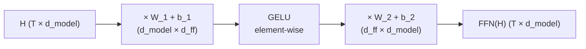

# Lesson 11: Feed-Forward Block (MLP)

Attention ([[08-scaled-dot-product-attention|Lessons 08–09]]) mixes information *across* positions — it is the only stage that filters along the token axis. The **feed-forward network** (FFN, sometimes "position-wise MLP") mixes information *within* each position: a small two-layer network applied independently to every token vector, i.e. a **static nonlinearity** along the channel axis. Together, attention + FFN form one transformer block; the model alternates them, depth after depth.

## Learning Objectives

- Write the equation for the position-wise feed-forward network in the course's row convention and identify each weight, bias, and activation.
- Explain why a single linear layer cannot replace the FFN (and what the activation buys you).
- Compute and plot **GELU** alongside **ReLU** together with their derivatives, and read the derivative as a small-signal gain.
- Read pre- and post-activation distributions and explain how the activation reshapes them.
- Justify the standard hidden-dimension choice $d_{\text{ff}} = 4 d_{\text{model}}$ and state what share of a block's parameters it implies.

## Background

Linear layers and biases from [[06-linear-layers-and-gradient-descent]]. Softmax-normalised attention output as a $T \times d_{\text{model}}$ matrix from [[08-scaled-dot-product-attention]] and [[09-multi-head-attention]]. Histograms as visualisation of an empirical distribution. The row convention of [[00-the-llm-as-a-system]]: tokens are rows, a layer acts by right-multiplication $\mathbf{X}\mathbf{W}$.

## The Position-Wise Feed-Forward Network

### Theory

For one token, written as a row vector $\mathbf{x} \in \mathbb{R}^{1 \times d_{\text{model}}}$, the FFN sublayer is

$$\mathrm{FFN}(\mathbf{x}) \;=\; \sigma\!\left(\mathbf{x} \mathbf{W}_1 + \mathbf{b}_1\right) \mathbf{W}_2 \;+\; \mathbf{b}_2,$$

with

- $\mathbf{W}_1 \in \mathbb{R}^{d_{\text{model}} \times d_{\text{ff}}}$, $\mathbf{b}_1 \in \mathbb{R}^{1 \times d_{\text{ff}}}$ — first projection (typically widening).
- $\mathbf{W}_2 \in \mathbb{R}^{d_{\text{ff}} \times d_{\text{model}}}$, $\mathbf{b}_2 \in \mathbb{R}^{1 \times d_{\text{model}}}$ — second projection (back to model width).
- $\sigma$ — a non-linear activation applied element-wise, in modern transformers GELU.

This is the row convention the code uses: `W1 = randn(d_model, d_ff)` and `H * W1`, exactly as written. (Papers that write column vectors put the transpose on the weights instead — same map, different bookkeeping.)

"**Position-wise**" means the *same* $\mathbf{W}_1, \mathbf{W}_2, \mathbf{b}_1, \mathbf{b}_2$ are applied to every row of the input matrix $\mathbf{H} \in \mathbb{R}^{T \times d_{\text{model}}}$ — there is no cross-token mixing inside the FFN. (That's attention's job.) Concretely,

$$\mathbf{H}_{\text{ff}} \;=\; \sigma\!\left(\mathbf{H} \mathbf{W}_1 + \mathbf{1}_T \mathbf{b}_1\right) \mathbf{W}_2 + \mathbf{1}_T \mathbf{b}_2,$$

where $\mathbf{1}_T \mathbf{b}$ is the outer product that copies the bias row into every position. As a signal-flow graph the sublayer is a linear map, a static nonlinearity, and a linear map:



If $\sigma$ were the identity, the whole block would collapse to a single linear map $\mathbf{H} (\mathbf{W}_1 \mathbf{W}_2) + \text{bias}$ — no benefit from having two layers. The non-linearity is what makes the FFN expressive. With it, the FFN can approximate any continuous per-position function (universal approximation), letting each transformer layer rewrite token features in highly non-linear ways before the next attention layer mixes them across positions again.

### Example — A small FFN forward pass

Build $\mathrm{FFN}$ with $d_{\text{model}} = 4$, $d_{\text{ff}} = 16$ (the canonical $4\times$ widening), and run a $T = 5$ sequence through it.

```rustlab
seed(11);
T = 5;
d_model = 4;
d_ff = 4 * d_model;

H = randn(T, d_model);

W1 = randn(d_model, d_ff) * sqrt(2.0 / d_model);   % He init for the GELU layer
b1 = zeros(d_ff);
W2 = randn(d_ff, d_model) * sqrt(2.0 / d_ff);
b2 = zeros(d_model);

% Forward pass — broadcast biases by adding row vectors via outer with ones
ones_T = ones(T);
hidden_pre  = H * W1 + outer(ones_T, b1);
hidden_post = gelu(hidden_pre);
out         = hidden_post * W2 + outer(ones_T, b2);

print("input H shape:        ", size(H));
print("hidden pre  (T, d_ff):", size(hidden_pre));
print("hidden post (T, d_ff):", size(hidden_post));
print("output      (T, d):   ", size(out));

% Per-position independence: rows do not mix.
% Gather rows in a different order and verify FFN(H_perm) == FFN(H) reordered.
perm = [3, 1, 2, 5, 4];
H_perm = H(perm, :);
out_perm = gelu(H_perm * W1 + outer(ones_T, b1)) * W2 + outer(ones_T, b2);
shuffle_err = max(reshape(abs(out_perm - out(perm, :)), 1, T * d_model));
print("max | FFN(P*H) - P*FFN(H) | =", shuffle_err);
```

Reshuffling the rows of $\mathbf{H}$ via row gather and re-applying FFN produces exactly the same rows in the same shuffled order — confirmed numerically with $\max\Delta = ${shuffle_err:%.2e}$. FFN is row-independent; only attention mixes across positions.

## ReLU vs GELU

### Theory

The two activations share a "small inputs cause small outputs, large positive inputs pass through" character but disagree near zero.

- **ReLU**: $\mathrm{ReLU}(x) = \max(0, x)$ — a half-wave rectifier. Hard cutoff at zero. Gradient is $1$ for $x > 0$ and $0$ for $x < 0$ — discontinuous at the kink. A neuron that drifts negative gets zero gradient and is effectively "dead" until a future update kicks it back.
- **GELU** (Gaussian Error Linear Unit): $\mathrm{GELU}(x) = x \cdot \Phi(x)$, where $\Phi$ is the standard normal CDF. Smooth everywhere, with a non-zero gradient on both sides of zero. Slightly negative inputs produce slightly negative outputs (the minimum is $\approx -0.17$ at $x \approx -0.75$); large negatives still vanish. rustlab's `gelu`, like GPT-2, uses the tanh approximation $\tfrac{1}{2} x \left(1 + \tanh\!\left[\sqrt{2/\pi}\,(x + 0.044715\,x^3)\right]\right)$, which matches $x\,\Phi(x)$ to about $10^{-3}$.

GELU is the default in GPT-2/3, BERT, and most recent decoder transformers. The justification is empirical — slightly faster training and slightly better final loss — and the usual mechanistic story is the smoother derivative near zero, which keeps more units contributing gradient signal. The derivative is what training sees, so the next example computes it.

### Example — Derivatives near zero, plotted beside the activations

Estimate each derivative with a central finite difference on a grid, then plot activations and derivatives side by side:

```rustlab
h_step = 1e-4;
xs_grad = -3:0.05:3;
n_grad = length(xs_grad);

dRelu = zeros(n_grad);
dGelu = zeros(n_grad);
for i = 1:n_grad
  x = xs_grad(i);
  dRelu(i) = (relu(x + h_step) - relu(x - h_step)) / (2.0 * h_step);
  dGelu(i) = (gelu(x + h_step) - gelu(x - h_step)) / (2.0 * h_step);
end

% Sample at x = -0.5 (a slightly-negative neuron) and at x = 0
i_neg  = round((-0.5 - xs_grad(1)) / 0.05) + 1;
i_zero = round((0.0 - xs_grad(1)) / 0.05) + 1;
print("d/dx ReLU(x=-0.5) =", dRelu(i_neg));
print("d/dx GELU(x=-0.5) =", dGelu(i_neg));
print("d/dx GELU(x= 0.0) =", dGelu(i_zero));

xs = linspace(-3.0, 3.0, 200);
figure();
subplot(1, 2, 1)
hold("on")
plot(xs, relu(xs), "color", "blue", "label", "ReLU(x)")
plot(xs, gelu(xs), "color", "red",  "label", "GELU(x)")
hline(0.0, "gray", "y=0")
title("ReLU vs GELU")
xlabel("x")
ylabel("activation")
legend()
hold("off")

subplot(1, 2, 2)
hold("on")
plot(xs_grad, dRelu, "color", "blue", "label", "ReLU'(x)")
plot(xs_grad, dGelu, "color", "red",  "label", "GELU'(x)")
yline(0.5, "gray", "1/2")
title("Derivatives (small-signal gain)")
xlabel("x")
ylabel("dy/dx")
legend()
hold("off")
```

> [!TIP]
> Left: for $x \gg 0$ both curves merge into $y = x$; for $x \ll 0$ both vanish; the action is in the strip $[-2, 2]$ where GELU bows below zero while ReLU has its kink. Right: ReLU′ is a step; GELU′ is a smooth ramp through exactly $\tfrac{1}{2}$ at $x = 0$, overshoots to $\approx 1.13$ near $x \approx 1.4$, and is slightly *negative* on $[-3, -0.75]$ — GELU is not monotone.

At $x = -0.5$, ReLU's derivative is exactly $0$ — a neuron stuck there receives **no learning signal**. GELU's derivative is ${dGelu(i_neg):%.4f}$ — small but non-zero (the exact form gives $\Phi(-0.5) + (-0.5)\,\phi(-0.5) \approx 0.309 - 0.176 = 0.133$), enough for gradient descent to correct the neuron's bias. At $x = 0$ the derivative is exactly ${dGelu(i_zero):%.2f}$ — a number that matters in [[12-layer-norm-and-residuals]].

## Pre- vs Post-Activation Distributions

### Theory

A useful diagnostic: histogram the values of the hidden vector before and after the activation. Because the pre-activation is a linear projection of the input, it tends to look roughly Gaussian (sum of many weighted inputs). The activation then warps that distribution — ReLU clips the negative half to exactly zero, while GELU squeezes it into the thin band $[-0.17, 0)$.

### Example — Histogram pre- and post-activation

The $T = 5$ example gives only $80$ hidden values, too few for a histogram. Feed $256$ random token vectors through the same $\mathbf{W}_1$ so each panel has $256 \times 16 = 4096$ draws:

```rustlab
seed(1);
T_big = 256;
pre_big  = reshape(randn(T_big, d_model) * W1, 1, T_big * d_ff);
post_big = gelu(pre_big);

print("fraction pre  < 0:        ", mean(pre_big < 0));
print("min post:                 ", min(post_big));
print("fraction |pre|  < 0.05:   ", mean(abs(pre_big) < 0.05));
print("fraction |post| < 0.05:   ", mean(abs(post_big) < 0.05));

figure();
subplot(1, 2, 1)
histogram(pre_big, 40);
title("Pre-activation (4096 values)")
xlabel("hidden_pre value")
ylabel("count")

subplot(1, 2, 2)
histogram(post_big, 40);
title("Post-activation, GELU (same 4096 values)")
xlabel("hidden_post value")
ylabel("count")
```

> [!TIP]
> Left: symmetric about zero — the He-initialised projection sends signed inputs into both half-spaces (${mean(pre_big < 0) * 100:%.1f}$ % negative). Right: the entire negative half has been folded into a spike just left of zero (nothing below ${min(post_big):%.3f}$), while the positive tail is unchanged. The fraction of values within $\pm 0.05$ of zero rises from ${mean(abs(pre_big) < 0.05) * 100:%.1f}$ % to ${mean(abs(post_big) < 0.05) * 100:%.1f}$ % — that pile-up is the "sparse gate" of the Engineering Lenses below.

## Why $d_{\text{ff}} = 4 \cdot d_{\text{model}}$?

### Theory

The empirical convention since the original transformer is to widen by $4\times$ in the FFN's hidden layer: $d_{\text{ff}} = 4 d_{\text{model}}$. Two pressures justify this:

1. **Capacity.** The FFN is where most of a transformer's parameters live. With $d_{\text{ff}} = 4 d_{\text{model}}$, the FFN holds $2 \cdot d_{\text{model}} \cdot d_{\text{ff}} = 8 d_{\text{model}}^2$ parameters per block — twice the $4 d_{\text{model}}^2$ of multi-head attention ([[09-multi-head-attention]]), i.e. **about two thirds of every block's parameters**. A wider hidden layer means more "feature detectors" (memory slots, below) the model can learn.
2. **Expand-then-contract.** The FFN projects up to $4 d_{\text{model}}$, applies the non-linearity in that wider space, then projects back. The wide hidden layer is where the non-linear function shaping happens; collapsing back to $d_{\text{model}}$ keeps the residual stream ([[12-layer-norm-and-residuals]]) at fixed width.

### Example — Parameter count for a typical config

```rustlab
d_model_typ = 384;
d_ff_typ = 4 * d_model_typ;

n_attn = 4 * d_model_typ * d_model_typ;            % from Lesson 09
n_ffn  = 2 * d_model_typ * d_ff_typ;               % W1 + W2, biases ignored
ffn_share = n_ffn / (n_attn + n_ffn);

print("d_model:             ", d_model_typ);
print("d_ff = 4 * d_model:  ", d_ff_typ);
print("Attention params:    ", n_attn);
print("FFN params:          ", n_ffn);
print("FFN / Attention:     ", n_ffn / n_attn);
print("FFN share of block:  ", ffn_share);
```

For $d_{\text{model}} = 384$ the FFN is $2\times$ the attention block — ${ffn_share * 100:%.1f}$ % of the block's weights live in the feed-forward sublayer (LayerNorm's $2 d_{\text{model}}$ parameters are negligible). Recent variants (Mistral, LLaMA) use $d_{\text{ff}} \approx 8/3 \cdot d_{\text{model}}$ to hold the parameter count of "gated" FFN variants (SwiGLU, [[24-modern-architectural-variants]]) at the same budget.

## Engineering Lenses

<!-- hide -->
```rustlab
run "../lib/transformer.rlab"
run "../lib/info.rlab"
```

### Signals

**Model.** The FFN is a **linear → static nonlinearity → linear** cascade (the mermaid graph above): the two linear maps are memoryless matrices on the channel axis, and GELU acts sample by sample. A transformer block is therefore the classic block-oriented alternation of a *dynamic* stage — attention, the time-varying filter along $t$ of [[08-scaled-dot-product-attention]] — with a *static* nonlinearity sandwiched between linear maps. Control engineers call the linear–nonlinear–linear sandwich a Wiener–Hammerstein model; the simplification is that in the textbook version the outer blocks are LTI filters in time, whereas here they act across channels and the time dynamics sit in the neighbouring attention stage.

**Exact.** For a static nonlinearity the quantity that matters is its **small-signal gain** $\sigma'(x)$: a perturbation $\delta x$ at the operating point $x$ comes out as $\sigma'(x)\,\delta x$. From the tanh form, with $u = \sqrt{2/\pi}\,(x + 0.044715\,x^3)$,

$$\mathrm{GELU}'(x) = \tfrac{1}{2}\left(1 + \tanh u\right) + \tfrac{1}{2}\,x\,\left(1 - \tanh^2 u\right)\,\sqrt{2/\pi}\,\left(1 + 3 \cdot 0.044715\,x^2\right),$$

which is `gelu_grad` in `lib/transformer.rlab` (the backward pass of [[22-full-backprop-through-the-block]] uses the same function). Its three limits are the whole story: gain $\tfrac{1}{2}$ at the origin, $1$ for $x \gg 0$ (a wire), $0$ for $x \ll 0$ (an open switch).

```rustlab
xs_gain = linspace(-4.0, 4.0, 801);
g_gain  = gelu_grad(xs_gain);

print("max |analytic - finite difference| on the grid:", max(abs(gelu_grad(xs_grad) - dGelu)));
print("gain at x = 0:      ", gelu_grad(0.0));
print("gain at x = -3, +3: ", gelu_grad(-3.0), gelu_grad(3.0));
print("peak gain:          ", max(g_gain), " at x =", xs_gain(argmax(g_gain)));
```

The closed form agrees with the finite difference to ${max(abs(gelu_grad(xs_grad) - dGelu)):%.1e}$. The right panel of the activation figure *is* this gain curve. For a zero-mean Gaussian pre-activation the gain averages *exactly* $\tfrac{1}{2}$ (the odd term $x\,\phi(x)$ integrates to zero); [[12-layer-norm-and-residuals]] shows that a stack of such stages without residual connections decays by a factor $\approx \tfrac{1}{2}$ per layer.

**Exact.** Written slot by slot, the FFN is a **keyed memory**. Let $\mathbf{k}_m$ be column $m$ of $\mathbf{W}_1$ (a key in $\mathbb{R}^{d_{\text{model}}}$) and $\mathbf{v}_m$ row $m$ of $\mathbf{W}_2$ (a value); then

$$\mathrm{FFN}(\mathbf{x}) \;=\; \sum_{m=1}^{d_{\text{ff}}} \sigma\!\left(\mathbf{x}\cdot\mathbf{k}_m + b_{1,m}\right)\,\mathbf{v}_m \;+\; \mathbf{b}_2 .$$

Each of the $d_{\text{ff}}$ slots correlates the token with its key (the same dot-product correlator as attention's $\mathbf{q}\cdot\mathbf{k}$, but against *learned constants* rather than other tokens), gates the match through GELU, and adds its value to the output. Attention reads the *context*; the FFN reads a *fixed table*.

```rustlab
% Slot-sum identity for token 2: sum_m hidden_post(2, m) * W2(m, :) == out(2, :)
acc = zeros(d_model);
for m = 1:d_ff
  acc = acc + hidden_post(2, m) * W2(m, :);
end
print("max | slot sum - out(2,:) | =", max(abs(acc - out(2, :))));
n_open = sum(reshape(hidden_post > 0.1, 1, T * d_ff));
print("slots with output > 0.1:", n_open, "of", T * d_ff);

figure();
heatmap({"1","2","3","4","5","6","7","8","9","10","11","12","13","14","15","16"}, {"t=1","t=2","t=3","t=4","t=5"}, hidden_post, "hidden_post (T x d_ff): which slots fire per token")
```

> [!TIP]
> Each row is one token, each column one memory slot. Bright cells are open gates: slot 1 fires hard for token 2 only, slot 3 for tokens 1 and 5, while slot 9 is lit for every token (a slot that always fires acts as a bias). The dark majority sit in GELU's $[-0.17, 0]$ band; ${n_open}$ of the $80$ gates pass more than $0.1$ — the read-out is *sparse*, which is why the slot picture is used to interpret trained models.

### Systems

**Exact.** Along the token axis the FFN has **no state**: the output at time $t$ depends on the input at time $t$ only, so it contributes nothing to the block's time dynamics (attention does). Along *depth*, the FFN is the vector field $f$ of the residual update $\mathbf{x}_{l+1} = \mathbf{x}_l + f(\mathbf{x}_l)$ that [[12-layer-norm-and-residuals]] studies, and what that study multiplies from layer to layer is the FFN's Jacobian at the operating point,

$$\mathbf{J}_{\text{FFN}}(\mathbf{x}) \;=\; \mathbf{W}_1\,\mathrm{diag}\!\left(\sigma'(\mathbf{x}\mathbf{W}_1 + \mathbf{b}_1)\right)\,\mathbf{W}_2 ,$$

a $d_{\text{model}} \times d_{\text{model}}$ matrix whose gain depends on *which gates are open* for that token.

```rustlab
for t = 1:T
  g_t = gelu_grad(hidden_pre(t, :));
  s_t = svd(W1 * diag(g_t) * W2);
  print("token", t, " open gates (gain > 1/2):", sum(g_t > 0.5), " J singular values:", s_t);
end
```

Across five tokens the largest gain of the same sublayer varies by a factor $\approx 1.7$ and the smallest by nearly two orders of magnitude — the FFN is a *time-varying* gain along the sequence even though its parameters are fixed, because the operating point (the set of open gates) changes per token.

### Information

**Exact.** The FFN is a deterministic map of each row, so by the data-processing inequality $I\!\left(X_{t+1};\, \mathrm{FFN}(\mathbf{h}_t)\right) \le I\!\left(X_{t+1};\, \mathbf{h}_t\right)$: it can re-arrange, or destroy, the bits about the next token that attention delivered, but it cannot create any. On continuous activations the mutual information itself is not a usable number — it is infinite wherever the map is locally injective — so the statement is checked on a discrete toy. Four input symbols carry $I(Y; X)$ bits about a binary outcome $Y$; an injective map (a permutation) keeps every bit, and a map that merges two symbols — what a ReLU does to two inputs it clips to zero — loses some.

```rustlab
% Joint p(x, y): rows x = 1..4 (uniform), columns y = 1..2
P_xy = [0.9, 0.1; 0.7, 0.3; 0.3, 0.7; 0.1, 0.9] / 4;
I_xy = entropy_bits(sum(P_xy, 2)') + entropy_bits(sum(P_xy)) - entropy_bits(reshape(P_xy, 1, 8));
P_perm  = P_xy([4, 2, 1, 3], :);                              % injective f
P_merge = [P_xy(1, :); P_xy(2, :) + P_xy(3, :); P_xy(4, :)];  % f merges x2 and x3
I_perm  = entropy_bits(sum(P_perm, 2)')  + entropy_bits(sum(P_perm))  - entropy_bits(reshape(P_perm, 1, 8));
I_merge = entropy_bits(sum(P_merge, 2)') + entropy_bits(sum(P_merge)) - entropy_bits(reshape(P_merge, 1, 6));
print("I(Y; X)        =", I_xy, "bits");
print("I(Y; f(X)) injective =", I_perm, "bits");
print("I(Y; f(X)) merging   =", I_merge, "bits");
```

The permutation preserves all ${I_xy:%.3f}$ bits; merging two symbols drops the information to ${I_merge:%.3f}$ bits, and no deterministic map can raise it. What the FFN *does* change is the geometry — the per-direction gain in $\mathbf{J}_{\text{FFN}}$ computed above — and "GELU keeps the gradient alive where ReLU does not" is a statement about $\sigma'$, not about bits.

## Key Takeaways

- The FFN is a per-position 2-layer MLP: linear → static non-linearity → linear, $\sigma(\mathbf{x}\mathbf{W}_1 + \mathbf{b}_1)\mathbf{W}_2 + \mathbf{b}_2$ in the row convention; same parameters at every token, no cross-position mixing, and without the non-linearity the two layers collapse to one.
- GELU's derivative is its small-signal gain: $\tfrac{1}{2}$ at the origin, $1$ for large positive inputs, $0$ for large negative ones; unlike ReLU it is non-zero on both sides of zero. Its advantage over ReLU in transformers is empirical.
- Slot by slot, $\mathrm{FFN}(\mathbf{x}) = \sum_m \sigma(\mathbf{x}\cdot\mathbf{k}_m + b_m)\,\mathbf{v}_m$: a keyed memory with $d_{\text{ff}}$ sparse-gated slots.
- Standard widening $d_{\text{ff}} = 4 d_{\text{model}}$ puts about two thirds of each block's parameters in the FFN.
- The FFN cannot create information about the next token (data processing); it re-shapes what attention extracted.

## Standalone Scripts

| Script | What it computes |
|---|---|
| `ffn_forward.rlab` | small $T = 5$, $d_{\text{model}} = 4$, $d_{\text{ff}} = 16$ FFN forward pass; per-position independence check; slot heatmap of `hidden_post` |
| `gelu_vs_relu.rlab` | activations and finite-difference derivatives on $[-3, 3]$ side by side; GELU′ limits $\tfrac{1}{2}$ / $1$ / $0$ |
| `activation_histograms.rlab` | pre- and post-GELU histograms over $4096$ draws; fractions near zero |
| `ffn_keyed_memory.rlab` | slot-sum identity, per-token Jacobian singular values, and the discrete data-processing check |

Run all with `make lesson-11` (or `rustlab run lessons/11-feed-forward-block/<name>.rlab`).

## Expected Numerical Outputs Summary

| Variable | Expected Value |
|---|---|
| `size(hidden_pre)` | `[5, 16]` |
| `size(out)` | `[5, 4]` |
| `shuffle_err` (per-position independence) | `0` (machine epsilon) |
| `dRelu(x = -0.5)` | `0.0` exactly |
| `dGelu(x = -0.5)` | ≈ `0.133` (small but non-zero) |
| `dGelu(x = 0)` | `0.5` |
| `n_attn` ($4 d_{\text{model}}^2$, $d_{\text{model}} = 384$) | `589824` |
| `n_ffn` ($8 d_{\text{model}}^2$) | `1179648` |
| `n_ffn / n_attn`, `ffn_share` | `2`, `0.667` |
| `gelu_grad(0)`, peak gain | `0.5`, ≈ `1.129` at $x \approx 1.42$ |
| `I_xy`, `I_perm`, `I_merge` | ≈ `0.325`, `0.325`, `0.266` bits |

## Exercises

1. **Collapse without activation.** Replace `gelu` with the identity in `ffn_forward.rlab`. Show numerically that the result equals `H * (W1 * W2) + b'` for a single combined bias. Why is this a problem for an N-layer transformer?
2. **Dead-neuron experiment.** Build a small ReLU-FFN and feed it 1000 random inputs. Count the fraction of hidden neurons that are negative across *all* inputs (effectively dead). Repeat with GELU, counting units whose gain `gelu_grad` is below $0.01$ everywhere. Comment on the gap.
3. **Per-position symmetry.** Argue why `FFN(P @ H) = P @ FFN(H)` for any row-permutation matrix `P`. Why is this *not* true for attention?
4. **Rank of the local gain.** In `ffn_keyed_memory.rlab`, replace token 1 by a row that drives at least $14$ of the $16$ pre-activations below $-3$ (search over `randn` rows, or scale one). How many singular values of $\mathbf{J}_{\text{FFN}}$ survive above $10^{-3}$? Repeat with ReLU in place of GELU and explain the difference in one sentence about $\sigma'$.
5. **SiLU's gain curve.** SiLU is $x\,\mathrm{sigmoid}(x)$. Derive its derivative, plot it against `gelu_grad`, and read off its gain at $0$, its peak, and where it goes negative.

## What's next

[[12-layer-norm-and-residuals]] introduces the wiring around every sublayer: **LayerNorm**, which puts each token vector back at unit scale before it enters attention or the FFN, and the **residual connection**, which adds the sublayer's output to its input instead of replacing it. Read as a discrete-time system along depth, the residual stream is a forward-Euler integrator whose step is small enough that the $\tfrac{1}{2}$ small-signal gain measured here cannot collapse the signal.
