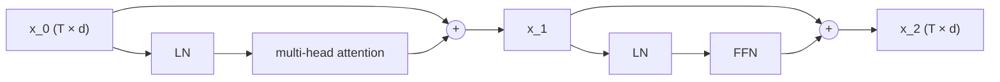

# Lesson 12: LayerNorm & Residual Connections

Attention ([[09-multi-head-attention]]) and the FFN ([[11-feed-forward-block]]) are the two "compute" sublayers of a transformer block. **LayerNorm** and **residual connections** are the two "wiring" pieces that surround each sublayer. Together they are what allows transformers to be stacked dozens of layers deep without the activation magnitudes collapsing or exploding — and, read as a discrete-time system along depth, they are the reason the stack is *stable*.

## Learning Objectives

- Write the **LayerNorm** equation, read it as a DC block plus an RMS normaliser, and say why batch-axis normalisation does not fit an autoregressive language model.
- Compute LayerNorm by hand on a small vector and verify mean = 0, variance ≈ 1.
- Read pre- and post-LN activation distributions and explain how LayerNorm reshapes them.
- Write the **residual connection** $\mathbf{y} = \mathbf{x} + f(\mathbf{x})$, read it as one forward-Euler step, and explain — with the small-signal gain $\tfrac{1}{2}$ from Lesson 11 — why a stack without it collapses.
- Distinguish **Pre-LN** from **Post-LN** blocks, state which is standard, and state the cost Pre-LN pays (a growing residual stream).

## Background

Linear layers and activations from [[06-linear-layers-and-gradient-descent]] and [[11-feed-forward-block]]; in particular GELU's small-signal gain $\mathrm{GELU}'(0) = \tfrac{1}{2}$. The MLP / attention sublayers from [[09-multi-head-attention]] and [[11-feed-forward-block]], and the $1/\sqrt{d_k}$ variance argument of [[08-scaled-dot-product-attention]]. Mean and variance of a finite-length vector; singular values of a matrix product. The row convention of [[00-the-llm-as-a-system]]: a token is a row vector $\mathbf{x}$ and a layer acts as $\mathbf{x}\mathbf{W}$.

## LayerNorm

### Theory

For a single token vector $\mathbf{x} \in \mathbb{R}^{d}$, **LayerNorm** is

$$\mathrm{LN}(\mathbf{x}) \;=\; \boldsymbol{\gamma} \odot \frac{\mathbf{x} - \mu}{\sqrt{\sigma^2 + \epsilon}} + \boldsymbol{\beta}, \qquad \mu = \tfrac{1}{d}\sum_i x_i, \quad \sigma^2 = \tfrac{1}{d}\sum_i (x_i - \mu)^2.$$

- **Standardisation** $(\mathbf{x} - \mu)/\sqrt{\sigma^2 + \epsilon}$: every token vector is rescaled to mean 0 and (population) variance 1. The small $\epsilon \approx 10^{-5}$ guards against divide-by-zero.
- **Affine recovery** $\boldsymbol{\gamma}, \boldsymbol{\beta} \in \mathbb{R}^d$: learned scale and shift, applied per dimension. Initialising $\boldsymbol{\gamma} = \mathbf{1}, \boldsymbol{\beta} = \mathbf{0}$ makes LN reduce to pure standardisation at training start.

LayerNorm normalises **across the feature dimension of one token** at a time. It does *not* mix information across positions (so it composes cleanly with attention's causal mask) and its statistics come from the token itself, so the same code runs identically in training and at inference. **BatchNorm** instead estimates $\mu$ and $\sigma^2$ per feature across the examples of a mini-batch (and keeps running averages for inference). That is a poor fit for sequence models for three reasons: sequences have different lengths, so padded positions pollute the per-feature statistics; each token's activation then depends on the *other* sequences in the batch, coupling examples that should be independent; and the running-average statistics used at inference differ from the batch statistics used in training, a train/inference mismatch that is worst exactly when the model generates one token at a time. LayerNorm has none of these problems because it never looks outside the row.

### Example — LN of a synthetic vector by hand

```rustlab
v = [1.0, 2.0, 3.0, 4.0, 5.0];
mu_v    = mean(v);
sigma_v = sqrt(mean((v - mu_v) .^ 2));        % population std

ln_v_manual = (v - mu_v) / sqrt(sigma_v ^ 2 + 1e-5);   % same eps-in-sqrt form as the builtin
ln_v_call   = layernorm(v);

print("v:                 ", v);
print("mean(v):           ", mu_v);
print("std(v) (pop):      ", sigma_v);
print("layernorm manual:  ", ln_v_manual);
print("layernorm builtin: ", ln_v_call);
print("max diff:          ", max(abs(ln_v_manual - ln_v_call)));
```

With the manual code using the same $\sqrt{\sigma^2 + \epsilon}$ denominator as the builtin, the two agree to ${max(abs(ln_v_manual - ln_v_call)):%.2e}$ — machine precision. The output mean is exactly 0; the (population) std is 1 up to the $\epsilon$ term (here $\approx 1 - 2.5\times10^{-6}$, since $\epsilon = 10^{-5}$ sits under the square root).

### Example — Per-row LN on a token batch

In a transformer the input is a $T \times d_{\text{model}}$ matrix and LN runs once per row. The `layernorm(M)` matrix overload standardises each row independently, so a single call handles the whole batch.

```rustlab
seed(12);
T_demo = 4;
d_demo = 6;
H_pre = randn(T_demo, d_demo) * 3.0 + 1.5;       % deliberately mean ≠ 0, var ≠ 1

H_ln = layernorm(H_pre);                          % per-row standardisation

means_pre  = reshape(mean(H_pre, 2), 1, T_demo);   % dim 2 = along features, one value per row
means_post = reshape(mean(H_ln,  2), 1, T_demo);
stds_pre   = reshape(sqrt(mean((H_pre - repmat(mean(H_pre, 2), 1, d_demo)) .^ 2, 2)), 1, T_demo);   % population std per row
stds_post  = reshape(sqrt(mean((H_ln  - repmat(mean(H_ln,  2), 1, d_demo)) .^ 2, 2)), 1, T_demo);

print("Per-row mean before LN:", means_pre);
print("Per-row mean after  LN:", means_post);
print("Per-row std  before LN:", stds_pre);
print("Per-row std  after  LN:", stds_post);
```

Every post-LN row has mean ≈ 0 and (population) std ≈ 1 — independently of how the pre-LN row was distributed. **LN is a normalisation that acts per token**, not per batch.

### Example — Activation histograms before and after LN

```rustlab
pre_flat  = reshape(H_pre, 1, T_demo * d_demo);
post_flat = reshape(H_ln,  1, T_demo * d_demo);

figure();
subplot(2, 1, 1)
histogram(pre_flat);
title("Pre-LN activation distribution (mean ≈ 1.5, std ≈ 3)")
ylabel("count")

subplot(2, 1, 2)
histogram(post_flat);
title("Post-LN activation distribution (mean ≈ 0, std ≈ 1)")
xlabel("activation value")
ylabel("count")
```

> [!TIP]
> Top: wide and shifted right of zero. Bottom: centred and tight — whatever scale the previous sublayer left, LN pulls each row back into a known range before the next sublayer sees it.

## Residual Connections

### Theory

A residual connection wraps a sublayer $f$ as

$$\mathbf{y} \;=\; \mathbf{x} + f(\mathbf{x}).$$

In a transformer block the same **residual stream** $\mathbf{x}$ runs past both sublayers; each one reads the stream (through LN) and *adds* its result back. The picture is a bus with two taps:



Two consequences:

1. **Identity initialisation.** If $f$ is initialised so its output is small, then early in training $\mathbf{y} \approx \mathbf{x}$ and the network behaves like the identity. Training only has to learn the *correction* $f(\mathbf{x})$ — usually easier than learning $\mathbf{y}$ from scratch. GPT-2 and nanoGPT make the output small by scaling the two projections that write to the bus ($\mathbf{W}_O$ and $\mathbf{W}_2$) by $1/\sqrt{2N}$ for an $N$-block model ([[14-full-gpt-architecture]]); in the demo below that scale appears as a single step size $h$.
2. **Gradient highway.** $\partial \mathbf{y}/\partial \mathbf{x} = \mathbf{I} + \partial f/\partial \mathbf{x}$. The identity term means the backward pass carries an unmodified copy of the gradient past every sublayer, so gradients cannot vanish across a residual block. This is why transformers can be 12, 48, or 96 layers deep.

To see what the identity term buys, stack random GELU sublayers with and without it. Each sublayer is $f(\mathbf{x}) = \mathrm{GELU}(\mathbf{x}\mathbf{W}_l)$ with $\mathbf{W}_l = \mathrm{randn}(d, d)/\sqrt{d}$, which is norm-preserving *on average* (its top singular value is $\approx 2$, its typical gain $\approx 1$). Without the residual the update is $\mathbf{x}_{l+1} = f(\mathbf{x}_l)$; with it, $\mathbf{x}_{l+1} = \mathbf{x}_l + h\,f(\mathbf{x}_l)$.

### Example — Forward signal magnitude with and without residuals

```rustlab
seed(13);
d_res = 32;
n_layers = 24;
h_step = 0.1;                                   % cf. 1/sqrt(2N) = 0.20 for N = 12 blocks

W_stack = zeros(n_layers * d_res, d_res);
for L = 1:n_layers
  W_stack((L - 1) * d_res + 1:L * d_res, :) = randn(d_res, d_res) * (1.0 / sqrt(d_res));
end

x0 = randn(d_res);
mag_no_res = zeros(n_layers + 1);   % x <- f(x)
mag_res    = zeros(n_layers + 1);   % x <- x + 0.1 f(x)
mag_res1   = zeros(n_layers + 1);   % x <- x + 1.0 f(x)
ratio      = zeros(n_layers);       % per-layer |x_{l+1}| / |x_l| without residual
mag_no_res(1) = norm(x0);
mag_res(1)    = norm(x0);
mag_res1(1)   = norm(x0);

x_plain = x0;
x_resi  = x0;
x_res1  = x0;
for L = 1:n_layers
  W_L = W_stack((L - 1) * d_res + 1:L * d_res, :);   % read this layer's block back

  x_plain = gelu(x_plain * W_L);                      % x * W: row convention, x stays a vector
  mag_no_res(L + 1) = norm(x_plain);
  ratio(L) = mag_no_res(L + 1) / mag_no_res(L);

  x_resi = x_resi + h_step * gelu(x_resi * W_L);      % small step, identity-dominant
  mag_res(L + 1) = norm(x_resi);

  x_res1 = x_res1 + 1.0 * gelu(x_res1 * W_L);         % full step
  mag_res1(L + 1) = norm(x_res1);
end
gm_ratio = exp(mean(log(ratio)));

print("layer 0 magnitude (all):", mag_no_res(1));
print("layer 24 magnitude: no-res", mag_no_res(n_layers + 1), " h = 0.1", mag_res(n_layers + 1), " h = 1", mag_res1(n_layers + 1));
print("no-res per-layer ratio: min", min(ratio), " max", max(ratio), " geometric mean", gm_ratio);
print("log2(total no-res ratio):     ", log2(mag_no_res(n_layers + 1) / mag_no_res(1)));
```

Without residuals the magnitude falls by $2^{${log2(mag_no_res(n_layers + 1) / mag_no_res(1)):%.1f}}$ over 24 layers — a per-layer geometric-mean ratio of ${gm_ratio:%.3f}$. The mechanism is not "GELU clips half the signal": the projection is norm-preserving on average, and once the signal is small every pre-activation sits near the origin, where GELU is linear with gain $\mathrm{GELU}'(0) = \tfrac{1}{2}$ ([[11-feed-forward-block]]). The stack is a cascade of stages with small-signal gain $\tfrac{1}{2}$, so it decays as $(\tfrac{1}{2})^{L}$ — the measured ${gm_ratio:%.3f}$ per layer. With $h = 0.1$ each step adds a small correction to a preserved state and the magnitude stays $O(1)$ (${mag_res(n_layers + 1):%.2f}$ from ${mag_res(1):%.2f}$). With $h = 1$ the identity path still prevents collapse, but the corrections now dominate and the state grows to ${mag_res1(n_layers + 1):%.0f}$: a residual connection removes the vanishing mode, and the *scale* of what is written to the bus decides whether the explosion mode appears — which is what the $1/\sqrt{2N}$ initialisation controls.

### Example — Plot magnitude vs. depth

```rustlab
figure();
hold("on")
semilogy(0:n_layers, mag_no_res, "color", "red",   "label", "no residual: x <- f(x)")
semilogy(0:n_layers, mag_res,    "color", "blue",  "label", "x <- x + 0.1 f(x)")
semilogy(0:n_layers, mag_res1,   "color", "green", "label", "x <- x + 1.0 f(x)")
title("Activation magnitude vs. depth (24 random GELU sublayers, d = 32)")
xlabel("layer index l")
ylabel("|x_l| (log scale)")
legend()
hold("off")
```

> [!TIP]
> On the log axis the no-residual curve is a straight line of slope $\log_{10}\tfrac{1}{2}$ per layer — exponential decay with a fixed per-stage gain. The $h = 0.1$ curve is flat; the $h = 1$ curve is a straight line *upward*. Same sublayers, three step sizes. Forward preservation stands in for backward preservation because the gradient passes through the transposes of the same per-layer Jacobians — the Systems lens computes that product directly.

## Pre-LN vs Post-LN

### Theory

The original 2017 transformer placed LN *after* the residual addition (**Post-LN**):

$$\mathbf{y} \;=\; \mathrm{LN}\!\left(\mathbf{x} + f(\mathbf{x})\right).$$

Practical experience (and a 2020 analysis by Xiong et al.) showed that this configuration needs careful learning-rate warmup — without it, training is unstable on deep stacks, because the LN derivative sits on the main path and the gradient reaching early layers depends on depth. Modern decoder-only transformers (GPT-2 onward) use **Pre-LN** instead:

$$\mathbf{y} \;=\; \mathbf{x} + f\!\left(\mathrm{LN}(\mathbf{x})\right).$$

Pre-LN keeps the residual stream $\mathbf{x}$ *unnormalised*: LN runs only on the copy that the sublayer $f$ reads, and the bus itself is touched only by additions. That is what makes the identity path in $\partial\mathbf{y}/\partial\mathbf{x} = \mathbf{I} + \partial f/\partial \mathbf{x}$ exact and warmup optional. It has a cost: nothing renormalises the bus, so its magnitude **grows with depth**. Each added $f$ is a unit-scale vector, and the sum of $l$ of them grows at least like $\sqrt{l}$; the later blocks therefore write proportionally smaller corrections onto an ever-larger stream. Two standard fixes are consequences of this growth, not separate conventions: the $1/\sqrt{2N}$ output scaling of the sublayers that write to the bus, and the **final LayerNorm** applied to the stream just before the language-model head, without which the logits' scale would depend on depth. Almost every recent open-source LLM (GPT-2/3, LLaMA, Mistral) is Pre-LN with both fixes.

### Example — Residual-stream magnitude under Pre-LN vs Post-LN

Stack $N$ random GELU sublayers under each rule and record the running magnitude curve, plus — for Pre-LN — the split of the stream into its per-token mean (the "DC" component, $\lvert\mu\rvert\sqrt{d}$) and the remainder (the "AC" component, $\lVert\mathbf{x} - \mu\mathbf{1}\rVert$):

```rustlab
seed(21);
d_pp = 32;
N_pp = 24;

x_pre  = randn(d_pp);          % Pre-LN  residual stream
x_post = x_pre;                % Post-LN residual stream (same start)
mag_pre  = zeros(N_pp + 1);
mag_post = zeros(N_pp + 1);
dc_pre   = zeros(N_pp + 1);
ac_pre   = zeros(N_pp + 1);
f_dc     = zeros(N_pp);        % per-layer mean of the written vector f
f_ac2    = zeros(N_pp);        % per-layer |f - mean(f)|^2
mag_pre(1)  = norm(x_pre);
mag_post(1) = norm(x_post);
dc_pre(1)   = abs(mean(x_pre)) * sqrt(d_pp);
ac_pre(1)   = norm(x_pre - mean(x_pre));

for L = 1:N_pp
  W_L = randn(d_pp, d_pp) * (1.0 / sqrt(d_pp));
  f_L = gelu(layernorm(x_pre) * W_L);
  f_dc(L)  = mean(f_L);
  f_ac2(L) = norm(f_L - mean(f_L)) ^ 2;
  x_pre  = x_pre + f_L;                                 % Pre-LN:  x <- x + f(LN(x))
  x_post = layernorm(x_post + gelu(x_post * W_L));      % Post-LN: x <- LN(x + f(x))
  mag_pre(L + 1)  = norm(x_pre);
  mag_post(L + 1) = norm(x_post);
  dc_pre(L + 1)   = abs(mean(x_pre)) * sqrt(d_pp);
  ac_pre(L + 1)   = norm(x_pre - mean(x_pre));
end
pred_dc = dc_pre(1) + (0:N_pp) * mean(f_dc) * sqrt(d_pp);     % coherent sum: linear in l
pred_ac = sqrt(ac_pre(1) ^ 2 + (0:N_pp) * mean(f_ac2));       % random walk: sqrt(l)

print("Pre-LN  |x_l| at l = 0, 6, 12, 24:", mag_pre(1), mag_pre(7), mag_pre(13), mag_pre(N_pp + 1));
print("Post-LN |x_l| at l = 0, 6, 12, 24:", mag_post(1), mag_post(7), mag_post(13), mag_post(N_pp + 1));
print("sqrt(d) reference:                 ", sqrt(d_pp));
print("mean per-layer DC of f:            ", mean(f_dc), " (E[GELU(z)] for z ~ N(0,1) is 0.282)");
print("Pre-LN DC part at l = 24: measured ", dc_pre(N_pp + 1), " predicted", pred_dc(N_pp + 1));
print("Pre-LN AC part at l = 24: measured ", ac_pre(N_pp + 1), " predicted", pred_ac(N_pp + 1));

figure();
subplot(1, 2, 1)
hold("on")
plot(0:N_pp, mag_pre,  "color", "blue", "label", "Pre-LN |x_l|")
plot(0:N_pp, mag_post, "color", "red",  "label", "Post-LN |x_l|")
yline(sqrt(d_pp), "gray", "sqrt(d)")
title("Residual-stream magnitude vs. depth")
xlabel("layer index l")
ylabel("|x_l|")
legend()
hold("off")

subplot(1, 2, 2)
hold("on")
plot(0:N_pp, dc_pre,  "color", "orange", "label", "DC part (measured)")
plot(0:N_pp, pred_dc, "color", "orange", "label", "coherent: linear in l", "style", "dashed")
plot(0:N_pp, ac_pre,  "color", "blue",   "label", "AC part (measured)")
plot(0:N_pp, pred_ac, "color", "blue",   "label", "random walk: sqrt(l)", "style", "dashed")
title("Pre-LN stream split into DC and AC parts")
xlabel("layer index l")
legend()
hold("off")
```

> [!TIP]
> Left: Post-LN is pinned to $\sqrt{d} = 5.66$ (every row leaves LN with unit variance); Pre-LN climbs to ${mag_pre(N_pp + 1):%.1f}$, a factor ${mag_pre(N_pp + 1) / mag_pre(1):%.1f}$ over its start, with no sign of levelling off. Right: the growth has two parts. GELU's output has a positive mean ($\approx 0.28$ for a unit-variance input), and that per-token DC adds *coherently*, linearly in $l$; the zero-mean remainder adds *incoherently*, as a random walk, $\propto \sqrt{l}$. Both dashed predictions sit on the measurements.

Post-LN renormalises the *entire* stream every layer, so the running state keeps no memory of its own scale. Pre-LN normalises only what the sublayer reads; the bus is an **integrator** with no leak, accumulating every contribution — coherently for the DC component that each LN then removes again from its own input, incoherently for the rest. This is the price of the clean identity path, and the reason the final LN exists.

## Engineering Lenses

<!-- hide -->
```rustlab
run "../lib/transformer.rlab"
run "../lib/info.rlab"
```

### Signals

**Model.** LayerNorm is a **DC block followed by an RMS normaliser**, with a programmable gain and offset ($\boldsymbol{\gamma}, \boldsymbol{\beta}$) after it: subtracting $\mu$ removes the per-token mean, dividing by $\sigma$ sets the per-token power to one. It is *memoryless* — the statistics come from the current row only, with no averaging over time and no feedback — so calling it "automatic gain control" is only right in the instantaneous sense; it is not a control loop. RMSNorm ([[24-modern-architectural-variants]]) is the same device without the DC block — identical to LN on zero-mean rows, cheaper, and the default in LLaMA-class models.

**Exact.** The reason to normalise at all: the $1/\sqrt{d_k}$ scaling of [[08-scaled-dot-product-attention]] keeps the score variance at $1$ *only if the attention input has unit variance*. On a Pre-LN bus whose magnitude grows with depth, the raw scores would grow as the fourth power of the stream's scale ($\mathbf{q}$ and $\mathbf{k}$ each scale linearly, their product quadratically per term, summed over $d_k$ and divided by $\sqrt{d_k}$), the softmax would saturate, and the row entropy would collapse to zero bits. LN in front of the projections restores the assumption at every depth.

```rustlab
seed(8);
T_s = 16;
d_s = 32;
W_Q = randn(d_s, d_s) / sqrt(d_s);
W_K = randn(d_s, d_s) / sqrt(d_s);
M_mask = causal_mask(T_s);
scales = [1, 4, 16];
for i = 1:3
  H_s   = randn(T_s, d_s) * scales(i);                       % a residual stream at scale s
  S_raw = (H_s * W_Q) * (H_s * W_K)' / sqrt(d_s);
  S_ln  = (layernorm(H_s) * W_Q) * (layernorm(H_s) * W_K)' / sqrt(d_s);
  v_raw = mean(reshape(S_raw .^ 2, 1, T_s * T_s));
  v_ln  = mean(reshape(S_ln  .^ 2, 1, T_s * T_s));
  Hrow_raw = mean(row_entropies_bits(softmax(S_raw + M_mask)));
  Hrow_ln  = mean(row_entropies_bits(softmax(S_ln  + M_mask)));
  print("stream scale", scales(i), "  var(S) raw:", v_raw, " with LN:", v_ln, "  mean row entropy raw:", Hrow_raw, " with LN:", Hrow_ln, "bits");
end
```

Without LN the score variance follows $s^4$ ($1 \to 256 \to 65536$ in theory) and the attention rows collapse to a fraction of a bit — every token attends to one position, the "argmax detector" of Lesson 08's saturation demo. With LN the variance stays $\approx 1$ and the rows keep $\approx 2.2$ bits of the $2.8$ available, at every scale.

### Systems

**Exact.** The residual update $\mathbf{x}_{l+1} = \mathbf{x}_l + h\,f(\mathbf{x}_l)$ is one **forward-Euler step** of the flow $\dot{\mathbf{x}} = f(\mathbf{x})$ with step $h$: depth is time, the residual stream is the state, and the three curves of the magnitude figure are the same vector field integrated with $h = 0$ (the autonomous map $\mathbf{x} \mapsto f(\mathbf{x})$, whose origin is attracting with linearised gain $\tfrac{1}{2}$), $h = 0.1$, and $h = 1$.

**Exact.** Stability of the stack is the stability of the **product of Jacobians**. With $\mathbf{J}_l = \mathbf{W}_l\,\mathrm{diag}\!\left(\mathrm{GELU}'(\mathbf{x}_l\mathbf{W}_l)\right)$ in the row convention, a perturbation propagates as $\delta\mathbf{x}_L = \delta\mathbf{x}_0 \prod_l \mathbf{J}_l$ without residuals and $\delta\mathbf{x}_0 \prod_l (\mathbf{I} + h\mathbf{J}_l)$ with them. The backward pass ([[15-backpropagation]]) multiplies the *transposes* of the same factors in reverse order, so it has the same singular values: whatever the product does to a forward perturbation it does to the gradient.

```rustlab
P_plain = eye(d_res);   P_res = eye(d_res);
smax_plain = zeros(n_layers);                   % sigma_max bounds every singular value of prod J_l
smin_res   = zeros(n_layers);  smax_res = zeros(n_layers);
x_plain = x0;  x_resi = x0;
for L = 1:n_layers
  W_L = W_stack((L - 1) * d_res + 1:L * d_res, :);
  J_plain = W_L * diag(gelu_grad(x_plain * W_L));   x_plain = gelu(x_plain * W_L);
  J_res   = W_L * diag(gelu_grad(x_resi  * W_L));   x_resi  = x_resi + h_step * gelu(x_resi * W_L);
  P_plain = P_plain * J_plain;                         % prod J_l
  P_res   = P_res * (eye(d_res) + h_step * J_res);     % prod (I + h J_l)
  smax_plain(L) = svd(P_plain)(1);
  s = svd(P_res);  smin_res(L) = s(end);  smax_res(L) = s(1);
end
print("after 24 layers: no residual sigma_max =", smax_plain(n_layers), "   h = 0.1 [sigma_min, sigma_max] =", smin_res(n_layers), smax_res(n_layers));

figure();
hold("on")
semilogy(1:n_layers, smax_plain, "color", "red",   "label", "no residual: sigma_max")
semilogy(1:n_layers, smax_res,   "color", "blue",  "label", "h = 0.1: sigma_max", "style", "dashed")
semilogy(1:n_layers, smin_res,   "color", "blue",  "label", "h = 0.1: sigma_min")
yline(1.0, "gray", "1")
title("Cumulative Jacobian product: extreme singular values vs. depth")
xlabel("layer index l")
ylabel("singular value (log scale)")
legend()
hold("off")
```

> [!TIP]
> Without residuals the *largest* singular value of the product — an upper bound on all the others — decays as $2^{-l}$ to $\approx 4 \times 10^{-7}$: no direction of the input, and no direction of the gradient, survives 24 layers. (The smallest is not plotted for that case: it falls below the $\approx 10^{-8}$ absolute floor of rustlab's `svd` within a few layers.) With $h = 0.1$ the product stays inside $[0.6, 2.2]$ for all 24 layers — well conditioned in both directions. (With $h = 1$, exercise 3, the largest singular value climbs past $10^{4}$ while the smallest underflows to $0$: the full-step stack explodes in some directions and is blind in others.)

### Information

**Exact.** LayerNorm is a lossy projection, not an invertible warp: for any $a > 0$ and $b$, $\mathrm{LN}(\mathbf{x}) = \mathrm{LN}(a\mathbf{x} + b\mathbf{1})$, so each token's mean and scale — 2 of its $d$ degrees of freedom — are discarded and $d - 2$ pass through. The Jacobian says the same thing: $\partial\,\mathrm{LN}/\partial\mathbf{x} = \tfrac{1}{\sigma}\left(\mathbf{I} - \tfrac{1}{d}\mathbf{1}\mathbf{1}^\top - \tfrac{1}{d}\hat{\mathbf{x}}^\top\hat{\mathbf{x}}\right)$ has exactly two zero singular values (the $\epsilon$ leaves one of them at $\sim 10^{-6}$ instead of $0$).

```rustlab
d_ln = 6;
x_ln = randn(d_ln) * 2 + 1;
J_ln = zeros(d_ln, d_ln);
for j = 1:d_ln
  e_j = zeros(d_ln);  e_j(j) = 1e-6;
  J_ln(j, :) = (layernorm(x_ln + e_j) - layernorm(x_ln - e_j)) / 2e-6;   % row j: d LN / d x_j
end
s_ln = svd(J_ln);
print("LN(x) vs LN(3x + 2):          ", max(abs(layernorm(x_ln) - layernorm(3 * x_ln + 2))));
print("LN Jacobian singular values:  ", s_ln);
print("degrees of freedom discarded: ", sum(s_ln < 1e-3), "of", d_ln);
```

**Exact.** The residual sum $\mathbf{y} = \mathbf{x} + h f(\mathbf{x})$ is invertible whenever $h f$ is a contraction ($h\,\mathrm{Lip}(f) < 1$): the fixed-point iteration $\mathbf{x} \leftarrow \mathbf{y} - h f(\mathbf{x})$ then converges to the unique pre-image (the Banach argument behind invertible ResNets), so nothing written to the bus destroys what was already on it. A bound on the contraction constant is $h\,\sigma_{\max}(\mathbf{W})\,\max_x \mathrm{GELU}'(x)$.

```rustlab
seed(5);
W_inv  = randn(d_res, d_res) / sqrt(d_res);
x_true = randn(d_res);
lip_f  = svd(W_inv)(1) * max(gelu_grad(linspace(-5, 5, 2001)));
y_obs  = x_true + h_step * gelu(x_true * W_inv);
x_hat  = y_obs;
for k = 1:60
  x_hat = y_obs - h_step * gelu(x_hat * W_inv);       % fixed-point inversion
end
print("h * Lip(f) <= ", h_step * lip_f, " (h = 0.1)   vs", lip_f, " (h = 1)");
print("recovery error |x_hat - x|:", norm(x_hat - x_true));
```

With $h = 0.1$ the contraction constant is ${h_step * lip_f:%.2f}$ and the input is recovered to machine precision: the bus is a **lossless backbone** with lossy side computations attached. With $h = 1$ the bound is ${lip_f:%.2f}$, above $1$, and the guarantee is gone — one more reason the sublayers that write to the bus are initialised small. Neither LN nor the residual adds bits; the residual protects them, and LN spends two per token to buy the conditioning the Signals lens measured.

## Key Takeaways

- **LayerNorm** standardises each token vector to mean 0, std 1 across its features — a DC block plus an RMS normaliser, memoryless, per token, never looking outside the row (which is why it, and not BatchNorm, fits padded, variable-length, one-token-at-a-time sequences).
- LN's job is conditioning: it makes the unit-variance assumption behind attention's $1/\sqrt{d_k}$ true at every depth, keeping the score variance $\approx 1$ and the attention rows informative.
- **Residual connections** $\mathbf{y} = \mathbf{x} + h f(\mathbf{x})$ are forward-Euler steps along depth. Without them a GELU stack is a cascade with small-signal gain $\tfrac{1}{2}$ per stage and decays as $2^{-L}$; with a small $h$ the product of Jacobians stays well conditioned in both directions; with $h = 1$ it explodes. The $1/\sqrt{2N}$ output init is the real model's $h$.
- **Pre-LN** is the modern convention: LN on the sublayer input, bus untouched. Its cost is a residual stream that grows with depth (coherently in its DC, as $\sqrt{l}$ otherwise) — hence the small output init and the final LN before the LM head.
- Information-theoretically, LN discards 2 of $d$ degrees of freedom per token and the residual sum is invertible while $h\,\mathrm{Lip}(f) < 1$; neither adds bits.

## Standalone Scripts

| Script | What it computes |
|---|---|
| `layernorm_distribution.rlab` | per-row LN on a 4×6 random batch; pre/post histograms |
| `residual_signal.rlab` | magnitude of activation across 24 random GELU sublayers for $h = 0$, $0.1$, $1$; per-layer ratio and its geometric mean |
| `jacobian_product.rlab` | extreme singular values of the cumulative Jacobian product $\prod \mathbf{J}_l$ vs $\prod(\mathbf{I} + h\mathbf{J}_l)$ per layer |
| `pre_vs_post_ln.rlab` | Pre-LN vs Post-LN magnitude curves with the $\sqrt{d}$ reference; DC/AC split of the Pre-LN stream |
| `ln_attention_scores.rlab` | attention-score variance and row entropy with and without LN at stream scales 1, 4, 16 |

Run all with `make lesson-12` (or `rustlab run lessons/12-layer-norm-and-residuals/<name>.rlab`).

## Expected Numerical Outputs Summary

| Variable | Expected Value |
|---|---|
| `mean(layernorm(v))` | `0` (machine epsilon) |
| `std(layernorm(v))` (population) | ≈ `1` (`1 − 2.5e-6`, from the ε under the sqrt) |
| `means_post`, `stds_post` (per row, after LN) | all ≈ `0`, all ≈ `1` |
| `mag_no_res(end)` / `mag_no_res(1)` | ≈ `2^-24.2` (≈ `5e-8`) |
| `gm_ratio` (no-residual per-layer geometric mean) | ≈ `0.497` (`GELU'(0) = 0.5`) |
| `mag_res(end)` ($h = 0.1$) | ≈ `8.3` (start `6.0`) |
| `mag_post(end)` | ≈ `5.657` $= \sqrt{32}$ |
| `mag_pre(end)` | ≈ `43.6` (DC part ≈ `40.4`, AC part ≈ `16.6`) |
| `var(S)` without / with LN at stream scale 16 | ≈ `6.9e4` / ≈ `1.0` |
| Jacobian product after 24 layers | no residual $\sigma_{\max}$ ≈ `4e-7`; $h = 0.1$ $[\sigma_{\min}, \sigma_{\max}]$ ≈ `[0.64, 2.2]` |
| LN Jacobian singular values ≈ 0 | `2` of `6` |
| `h_step * lip_f` | ≈ `0.22` (recovery error ≈ `1e-16`) |

## Exercises

1. **Affine identity.** Show that initialising $\boldsymbol{\gamma} = \mathbf{1}$, $\boldsymbol{\beta} = \mathbf{0}$ makes LN reduce to pure standardisation. What happens at $\boldsymbol{\gamma} = \boldsymbol{0}$?
2. **BatchNorm on padded sequences.** Build a batch of two sequences of lengths 3 and 8, zero-padded to 8, and normalise each feature across the batch. Show that the padded positions shift the statistics of the short sequence's real tokens, and that token 2 of sequence 1 changes when sequence 2 is replaced. Neither happens with `layernorm`.
3. **Find the critical step.** Add $h = 1$ to `jacobian_product.rlab` (expect $\sigma_{\max} \approx 10^{4}$ and $\sigma_{\min} = 0$ after 24 layers), then sweep $h$ from $0.05$ to $1$ and plot $\sigma_{\max}$ of the 24-layer product against $h$. Where does it cross $10$? Compare that $h$ with $1/\sqrt{2N}$ for $N = 12$ and $N = 48$.
4. **Post-LN gradient path.** In Post-LN the LN Jacobian (rank $d - 2$, gain $1/\sigma$) sits on the main path. Multiply it into the product of Jacobians for the Post-LN stack and compare the singular-value range with the Pre-LN product. Which stack's gradient scale depends on depth?
5. **Zero-mean sublayers.** Replace `gelu` by `gelu(z) - 0.28` in the Pre-LN demo so the written vectors have (almost) no DC. Re-plot the DC/AC split: does the stream still grow, and at what rate? Why does the final LN remain necessary?

## What's next

You now have all four sublayers a transformer needs: token embedding ([[04-embeddings-and-similarity]]), positional encoding ([[10-positional-encoding]]), self-attention ([[08-scaled-dot-product-attention]]) / multi-head ([[09-multi-head-attention]]), feed-forward ([[11-feed-forward-block]]), LayerNorm and residuals (this lesson). [[13-transformer-block]] assembles a single transformer block — Pre-LN → MHA → residual → Pre-LN → FFN → residual, the bus diagram above realised in code — and traces the data dimensions all the way through. [[14-full-gpt-architecture]] stacks $N$ blocks plus an embedding layer and an LM head into the full GPT architecture and counts every parameter.
