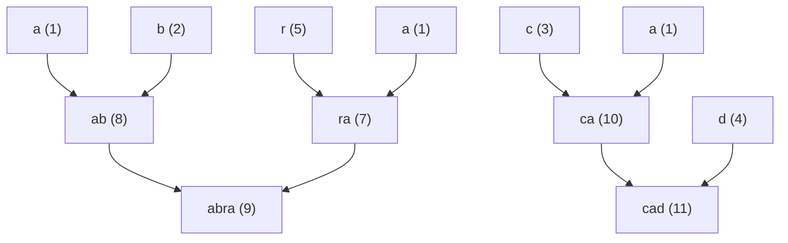

# Lesson 19: Byte-Pair Encoding (BPE)

Every lesson so far has used a **character vocabulary** — `a, b, c, …`. Real LLMs do not. They use **subword tokens** built by **byte-pair encoding (BPE)**, and BPE is, first of all, **a compression algorithm**. Philip Gage published it in 1994 (*A New Algorithm for Data Compression*) as a way to shrink files: find the most frequent adjacent pair of bytes, replace every occurrence with an unused byte, repeat. It is the same procedure as Re-Pair grammar compression (Larsson & Moffat 1999), and Sennrich, Haddow & Birch (2016) repurposed it to build vocabularies for neural machine translation. Among codes you already know, it sits in a definite place: Huffman coding is optimal for a memoryless (order-0) source but never exploits repeated substrings; LZ78 builds a dictionary adaptively while it reads the stream; BPE builds a **static dictionary offline, greedily**, and encodes against it afterwards. The final vocabulary covers common words as single tokens (`the`, `_and`, `_understanding`) and rare words as a few subword tokens (`anti`, `dis`, `establish`, `ment`). This lesson walks through the merge algorithm on a small corpus and then measures, in bits, what the merges buy.

## Learning Objectives

- Motivate **subword tokenisation** by comparing character-level (long sequences, simple model) and word-level (huge vocab, OOV problems) extremes.
- Run the **BPE merge step** by hand — count adjacent pairs, take the argmax, rewrite — iterate it on a small corpus, read out the **merge order**, and say why the greedy rule is used.
- Apply learned merges to encode new text; measure the **compression ratio** and the corpus's **token-length distribution**.
- Describe the three production details every real tokeniser adds: **byte-level** base vocabularies, **special tokens** (BOS/EOS/pad), and **pre-tokenisation**.
- Compute the corpus's coding cost under ASCII, a fixed-width code, the order-0 entropy bound, and BPE with $k$ merges, and locate the **MDL-optimal vocabulary size** where the dictionary stops paying for itself.

## Background

Tokens, vocabulary, one-hot encoding from [[01-tokens-and-encoding]]. Bigram counts and conditional probabilities from [[05-bigram-language-model]]. Entropy, cross-entropy, and the source-coding bound from [[03-cross-entropy-loss]].

## Why Subword Tokens

### Theory

Two extremes bracket what tokenisation can do:

| Tokenisation | Vocab size $\lvert\mathcal{V}\rvert$ | Sequence length $T$ | OOV problem? |
|---|---|---|---|
| Character | small (~100) | very long | none |
| Whole word | huge (10⁵–10⁶) | short | yes — every unseen word becomes `<UNK>` |
| **Subword (BPE)** | **moderate (10³–10⁵)** | **medium** | **none — fall back to characters** |

A character vocabulary forces the model to learn spelling, common prefixes, and stems all at once — a lot of representational work for a fixed parameter budget. A word vocabulary fixes that but cannot handle anything not seen during training. **BPE** sits in between: common substrings get their own tokens, rare ones decompose into smaller pieces. Modern tokenisers (GPT-2, GPT-3, GPT-4, LLaMA, Claude) all use BPE or close variants (SentencePiece, WordPiece).

## The Merge Algorithm

### Theory

Given a corpus split into a sequence of integer tokens (initially one per byte/character), BPE iteratively grows the vocabulary by **one merge per step**:

```
inputs:  initial token sequence S over base vocab V
         desired number of merges k
state:   merge_list = []          # ordered list of merges performed
for m = 1..k:
  1. count adjacent pairs:  count[i, j] = #{t : S_t = i and S_{t+1} = j}
  2. find the most frequent pair (i*, j*)
  3. introduce a new token id = |V| + 1
  4. append (i*, j*) -> new_id to merge_list
  5. rewrite S: every occurrence of (i*, j*) becomes new_id
return merge_list (and the rewritten S)
```

The output is a `merge_list` — an ordered table that any future text can be encoded against. Encoding applies each merge greedily in the order it was learned.

**Why greedy?** Choosing the dictionary that minimises the encoded length of a corpus is a smallest-grammar problem, which is NP-hard (Charikar et al. 2005). Merging the single most frequent pair, one step at a time, is the tractable approximation that Re-Pair and BPE share — and it is close enough to optimal in practice that no production tokeniser does anything else.

### Example — Three merges on a tiny corpus

Corpus: `"abracadabra abracadabra abracadabra"`. Initial vocab: `{a:1, b:2, c:3, d:4, r:5, ' ':6}`. Step 5 of the pseudocode — the rewrite — is factored into its own function because encoding new text later needs exactly the same loop.

```rustlab
% Encode the corpus once as integer tokens:  a=1 b=2 c=3 d=4 r=5 (space)=6
seq = [1, 2, 5, 1, 3, 1, 4, 1, 2, 5, 1, ...
       6, ...
       1, 2, 5, 1, 3, 1, 4, 1, 2, 5, 1, ...
       6, ...
       1, 2, 5, 1, 3, 1, 4, 1, 2, 5, 1];
vocab_size = 6;
names = {"a", "b", "c", "d", "r", "_"};   % "_" stands for the space
print("Initial seq length:", length(seq), "  vocab size:", vocab_size);
```

```rustlab
% --- Rewrite: replace every adjacent (a, b) by new_id, scanning left to right ---
function out = apply_merge(seq, a, b, new_id)
  L = length(seq);
  buf = zeros(L);                       % preallocate, trim at the end
  k = 1;  i = 1;
  while i <= L
    if i < L && seq(i) == a && seq(i + 1) == b
      buf(k) = new_id;  k = k + 1;  i = i + 2;
    else
      buf(k) = seq(i);  k = k + 1;  i = i + 1;
    end
  end
  out = buf(1:(k - 1));
end

% --- One merge step: count pairs, take the argmax, rewrite ---
function r = bpe_step(seq, vocab_size)
  V = vocab_size;
  counts = zeros(V, V);
  for i = 1:(length(seq) - 1)
    counts(seq(i), seq(i + 1)) = counts(seq(i), seq(i + 1)) + 1;
  end
  idx    = argmax(reshape(counts, 1, V * V));
  best_a = mod(idx - 1, V) + 1;         % undo the column-major flattening
  best_b = floor((idx - 1) / V) + 1;
  new_id = V + 1;
  r = struct("seq", apply_merge(seq, best_a, best_b, new_id), ...
             "a", best_a, "b", best_b, "count", counts(best_a, best_b), "vocab", new_id);
end
```

Rather than run the step three times by hand, run the whole schedule once — ten merges collapse this corpus to a single token — recording the sequence length $N_k$ and the parent pair of every new id; the rest of the lesson reads from that record. A small recursive decoder turns ids back into strings.

```rustlab
function s = tok_str(id, left, right, names)
  % Expand a token id to its string through the merge tree.
  if left(id) == 0
    s = names(id);
  else
    s = tok_str(left(id), left, right, names) + tok_str(right(id), left, right, names);
  end
end

K = 10;                                   % enough merges to collapse the corpus to one token
N_k     = zeros(K + 1);  N_k(1) = length(seq);
left    = zeros(vocab_size + K);          % parents of each id (0 = base character)
right   = zeros(vocab_size + K);
tok_len = ones(vocab_size + K);           % characters per token id
m_count = zeros(K);
cur_seq = seq;  cur_vocab = vocab_size;
for k = 1:K
  step = bpe_step(cur_seq, cur_vocab);
  left(step.vocab)    = step.a;
  right(step.vocab)   = step.b;
  tok_len(step.vocab) = tok_len(step.a) + tok_len(step.b);
  m_count(k) = step.count;
  N_k(k + 1) = length(step.seq);
  if k == 5
    seq_5 = step.seq;                     % the corpus under the five-merge vocabulary
  end
  cur_seq = step.seq;  cur_vocab = step.vocab;
end
for k = 1:3
  id = vocab_size + k;
  print("merge", k, ": '" + tok_str(left(id), left, right, names) + "' + '" + tok_str(right(id), left, right, names) + "' -> '" + tok_str(id, left, right, names) + "'  (id", id, ", count", m_count(k), ", N =", N_k(k + 1), ")");
end
```

The first merge is a **three-way tie**: `(a, b)`, `(b, r)`, and `(r, a)` each occur 6 times (twice per `"abracadabra"`, three repetitions); `argmax` returns the first maximum it meets, `(r, a)` → id 7 (which tied pair wins is an implementation detail — here the column-major order of the flattened count matrix; real implementations fix a tie-break, usually lexicographic, so training is reproducible). The next two merges fuse `(a, b) → ab` (id 8) and then `(ab, ra) → abra` (id 9), building the full `"abra"`. After three merges the sequence shortens from 35 to 17 tokens and the vocabulary grows from 6 to 9.

### Example — The full merge schedule

The remaining merges pick up the `cad` fragment and then swallow the spaces:

```rustlab
for k = 4:5
  id = vocab_size + k;
  print("merge", k, ": '" + tok_str(left(id), left, right, names) + "' + '" + tok_str(right(id), left, right, names) + "' -> '" + tok_str(id, left, right, names) + "'  (id", id, ", count", m_count(k), ", N =", N_k(k + 1), ")");
end
print("Sequence length N_k for k = 0..10 merges:", N_k);
```

The five merges form a tree — each new symbol is built from two earlier ones:



## Token-Length Distribution

### Theory

Once `merge_list` is fixed, encoding *any* string is deterministic: apply the merges greedily in learned order. Two distributions describe the result. The **characters-per-token** distribution over an encoded corpus is the tokeniser's granularity; its mean is $N_{\text{char}} / N_{\text{tok}}$, the **compression ratio**, and its reciprocal, tokens per character, is what a context window is spent on. The **tokens-per-word** distribution is what users see: a short common word like `"the"` becomes one token, `"defenestration"` several (`de`, `fen`, `estr`, `ation`), and gibberish stays at one token per character. On a real corpus of tens of thousands of words the tokens-per-word histogram is **long-tailed** — most words at 1–2 tokens, a thin tail out to 5–10 for rare or morphologically complex words. Our corpus contains one word three times, so it cannot show that tail; the right-hand panel below encodes six hand-picked fragments as an illustration, not a distribution.

### Example — Characters per token over the corpus, tokens per word on six fragments

```rustlab
% Characters per token of every token in the encoded corpus (five merges)
lens_corpus = tok_len(seq_5);
N_tok = length(seq_5);
cpt_hist = zeros(4);
for L = 1:4
  cpt_hist(L) = sum(lens_corpus == L);
end
ratio = length(seq) / N_tok;
print("tokens in corpus after 5 merges:", N_tok, "  chars/token histogram (1..4):", cpt_hist);
print("compression ratio N_char/N_tok =", ratio, "  tokens per character =", 1 / ratio, "  mean chars/token =", mean(lens_corpus));

% Tokens per word for six fragments, encoded with the same five merges
function out = encode(seq, ma, mb, mid)
  out = seq;
  for m = 1:length(ma)
    out = apply_merge(out, ma(m), mb(m), mid(m));
  end
end
mid = (vocab_size + 1):(vocab_size + 5);
ma  = left(mid);
mb  = right(mid);
words = {"abracadabra", "abra", "cad", "bra", "ac", "d"};
tpw = zeros(6);
tpw(1) = length(encode([1, 2, 5, 1, 3, 1, 4, 1, 2, 5, 1], ma, mb, mid));
tpw(2) = length(encode([1, 2, 5, 1], ma, mb, mid));
tpw(3) = length(encode([3, 1, 4], ma, mb, mid));
tpw(4) = length(encode([2, 5, 1], ma, mb, mid));
tpw(5) = length(encode([1, 3], ma, mb, mid));
tpw(6) = length(encode([4], ma, mb, mid));
print("tokens per word:", tpw);

figure();
subplot(1, 2, 1)
bar({"1", "2", "3", "4"}, cpt_hist)
title("Characters per token (11 corpus tokens)")
xlabel("characters in token"); ylabel("count of tokens")
subplot(1, 2, 2)
bar(words, tpw)
title("Tokens per word (six fragments)")
xlabel("word"); ylabel("tokens")
```

> [!TIP]
> Left: the corpus after five merges is six `abra` tokens (4 chars), three `cad` (3 chars) and two spaces (1 char) — a real distribution whose mean, ${mean(lens_corpus):%.2f}$ characters per token, *is* the compression ratio. Right: fragments fully covered by a merge collapse to one token, partially covered ones take two, and `abracadabra` takes three (`abra` · `cad` · `abra`).

## Production Details: Bytes, Special Tokens, Pre-tokenisation

Three things separate the algorithm above from a tokeniser you can ship.

**Byte-level BPE.** Starting from characters leaves an OOV hole — any character absent from training has no id. GPT-2 starts from the **256 byte values** instead: every UTF-8 string is a byte sequence, so every string is encodable and the fall-back is one token per byte. Because many bytes are unprintable, GPT-2 maps each byte value to a printable Unicode character so the merge table can be stored and inspected as text (the `Ġ` that appears in GPT-2 tokens is the mapped leading space). Its vocabulary is $256 + 50{,}000 \text{ merges} + 1 = 50{,}257$.

**Special tokens.** A few ids are reserved and never produced by a merge. **EOS (end-of-sequence)** marks where a document ends; it is trained on like any other token, so a model learns to *predict* it, and the generation loop of [[21-sampling-and-generation]] stops when it is sampled. GPT-2's `<|endoftext|>` plays this role (and separates documents in the training stream). **BOS** marks a beginning; **pad** fills a batch of unequal sequences to a common $T$ and is masked out of attention and loss. Chat models add role markers the same way.

**Pre-tokenisation.** Before any merge is counted, the text is split by a regular expression into chunks — roughly words, numbers, and punctuation, each carrying its leading space — and merges are learned and applied *within chunks only*. No token ever spans a whitespace boundary. That is why the space in our corpus never entered a merge until the word itself was one token, why `abracadabra abracadabra` encodes as two identical runs, and why real vocabularies are not cluttered with cross-word fragments such as `e th`.

## Connection to Earlier Lessons

### Theory

- **Lesson 01's character vocabulary** was the BPE base case (no merges).
- **Lesson 05's bigram model** counted exactly the same `count[i, j]` matrix BPE uses to choose a merge. Lesson 05 normalised it into $P(\text{next} \mid \text{curr})$; BPE takes its argmax to find the pair worth compressing.
- **Lesson 14's parameter count** depends linearly on $|\mathcal{V}|$ via the embedding $\mathbf{E} \in \mathbb{R}^{|\mathcal{V}| \times d_{\text{model}}}$ and the LM head $\mathbf{W}_U \in \mathbb{R}^{d_{\text{model}} \times |\mathcal{V}|}$. Each merge costs $2 d_{\text{model}}$ parameters and saves a few percent of sequence length — the trade-off the next section prices in bits.

## Engineering Lenses

No signals or systems reading adds to this lesson: BPE is a static dictionary built offline — nothing filters a signal, and once the merge table is fixed nothing has state. The information reading is exact, and it is the point of the lesson.

### Information

**Exact.** A tokeniser plus a fixed-width id is a code, so its cost can be counted. For the 35-character corpus: plain 8-bit ASCII; a fixed $\lceil \log_2 6 \rceil = 3$-bit code over the six characters; the order-0 **entropy bound** $N_{\text{char}} H(\text{chars})$, which no memoryless symbol code can beat; a Huffman code (run by hand on the counts $a{:}15, b{:}6, r{:}6, c{:}3, d{:}3, \_{:}2$, giving lengths 1, 3, 3, 3, 4, 4 — one valid tree; ties may swap `c` and `d`); and BPE after $k$ merges, charged at the **minimum description length** — data plus dictionary — as $N_k \lceil \log_2 |\mathcal{V}_k| \rceil$ bits for the tokens and $2k \lceil \log_2 |\mathcal{V}_k| \rceil$ bits for the merge table (two ids per merge, at the final id width).

<!-- hide -->
```rustlab
run "../lib/info.rlab"
```

```rustlab
N_char = length(seq);
c_char = zeros(vocab_size);
for i = 1:vocab_size
  c_char(i) = sum(seq == i);
end
p_char = c_char / N_char;
H_char = entropy_bits(p_char);
bits_ascii  = 8 * N_char;
bits_fixed  = ceil(log2(vocab_size)) * N_char;
bits_order0 = N_char * H_char;
huff_len    = [1, 3, 3, 4, 3, 4];              % a b c d r _
bits_huff   = sum(c_char .* huff_len);

kk         = 0:K;
V_k        = vocab_size + kk;
w_k        = ceil(log2(V_k));                  % id width after k merges
bits_data  = N_k .* w_k;
bits_table = 2 * kk .* w_k;
bits_total = bits_data + bits_table;
[bits_min, k_min] = min(bits_total);
k_star = k_min - 1;

print("char counts a b c d r _ :", c_char, "  H(chars) =", H_char, "bits/char");
print("ASCII:", bits_ascii, "bits   fixed 3-bit:", bits_fixed, "bits   order-0 bound:", bits_order0, "bits   Huffman:", bits_huff, "bits");
print("BPE data + table (k = 0..10):", bits_total);
print("minimum", bits_min, "bits at k* =", k_star, "merges (|V| =", vocab_size + k_star, ")");

figure();
subplot(1, 2, 1)
plot(V_k, N_k, "color", "blue", "label", "N_k")
title("Sequence length vs vocabulary size")
xlabel("|V_k| = 6 + k"); ylabel("tokens in corpus")
subplot(1, 2, 2)
hold("on")
plot(kk, bits_total, "color", "blue", "label", "data + merge table")
plot(kk, bits_data, "color", "green", "label", "data only")
yline(bits_order0, "gray", "order-0 bound")
legend("data + merge table", "data only")
title("Total bits vs number of merges")
xlabel("merges k"); ylabel("bits")
hold("off")
```

> [!TIP]
> Left: every merge shortens the sequence, but the first three (count 6 each) do most of the work and the last ones remove a token or two — diminishing returns as a curve, not a claim. Right: the total falls, jumps where the id width grows (at $|\mathcal{V}| = 9$ and $17$), bottoms out at $k^\ast = ${k_star}$ merges with ${bits_min}$ bits, and then rises as the dictionary outweighs the data it describes. That minimum is the MDL-optimal vocabulary for this corpus.

The BPE minimum sits *below* the dashed order-0 bound of ${bits_order0:%.1f}$ bits. That is not a violation: the bound applies to codes that treat characters as independent, and a dictionary code wins precisely by exploiting the repetition that an order-0 code cannot see. The floor a dictionary cannot beat is the corpus's entropy rate — close to zero for one word repeated three times.

**Exact.** Tokenisation changes the number of symbols but not the information in the text: for one model $q$ of the text, the code length $-\log_2 q(\text{text})$ is the same whether the text is read as characters or as tokens, so

$$N_{\text{tok}} \cdot \mathcal{L}_{\text{tok}} \;=\; N_{\text{char}} \cdot \text{BPC},$$

and **bits per character** is the tokeniser-invariant quantity — the reason [[20-perplexity-and-evaluation]] normalises per-token losses to BPC before comparing models. The identity is about *one* model; two order-0 estimators over two alphabets are two different models, and the computation shows how different:

```rustlab
p_tok = zeros(vocab_size + 5);
for i = 1:(vocab_size + 5)
  p_tok(i) = sum(seq_5 == i) / N_tok;
end
H_tok = entropy_bits(p_tok);
print("characters: N =", N_char, "  H =", H_char, "bits/sym   N*H =", N_char * H_char, "bits   bits/char =", H_char);
print("BPE tokens: N =", N_tok, "  H =", H_tok, "bits/sym   N*H =", N_tok * H_tok, "bits   bits/char =", N_tok * H_tok / N_char);
```

The order-0 code over BPE tokens spends ${N_tok * H_tok:%.1f}$ bits where the order-0 code over characters spends ${N_char * H_char:%.1f}$: the missing ${N_char * H_char - N_tok * H_tok:%.0f}$ bits are the between-character structure that the five merges moved out of the data stream and into the merge table — which is why the MDL accounting above charges the dictionary's ${bits_table(6)}$ bits alongside the data. Read per character, ${H_tok * N_tok / N_char:%.2f}$ versus ${H_char:%.2f}$ bits/char says that a unigram over BPE tokens is a far stronger model of the *characters* than a unigram over characters — each token carries context with it. This is the trade every LLM makes: a larger vocabulary buys a shorter sequence and a per-token loss that is not comparable across tokenisers, which is why bits per character, not perplexity, is the honest cross-tokeniser metric.

**Model.** What does one merge save? Let $p_{ab} = \text{count}(a, b) / (N - 1)$ be the frequency of the adjacent pair among the $N - 1$ positions, and $p_a, p_b$ the character frequencies. Coding the two symbols independently costs $-\log_2 p_a - \log_2 p_b$ bits per occurrence; a joint symbol costs $-\log_2 p_{ab}$; the difference is the pair's **pointwise mutual information** $\text{PMI}(a; b) = \log_2 \frac{p_{ab}}{p_a p_b}$, and the merge saves roughly $\text{count} \times \text{PMI}$ bits:

```rustlab
p_ra   = m_count(1) / (N_char - 1);           % count of (r, a) recorded at merge 1
pmi_ra = log2(p_ra / (p_char(5) * p_char(1)));
print("p_ra =", p_ra, "  PMI(r; a) =", pmi_ra, "bits   x count", m_count(1), "=", m_count(1) * pmi_ra, "bits");
print("actual saving of merge 1 under the fixed-width model:", bits_total(1) - bits_total(2), "bits");
```

BPE never computes this: its rule is $\arg\max$ over the raw count, which favours frequent pairs even when their PMI is modest. The estimate is only approximate because every merge changes the unigram statistics the next PMI depends on — Exercise 5 follows the thread.

## Key Takeaways

- BPE is a **greedy static-dictionary compressor** (Gage 1994, Re-Pair) repurposed as a tokeniser: count adjacent-pair frequencies, merge the most frequent pair, repeat $k$ times. Greedy is used because the optimal dictionary problem is NP-hard.
- The output is an **ordered merge list** that encodes any future text deterministically; production tokenisers add a byte-level base, special tokens (EOS is the one the generation loop stops on), and pre-tokenisation so that merges never cross whitespace.
- Vocabulary size is a **hyperparameter** with a computable optimum: total bits (data + dictionary) fall, then rise; on this corpus the minimum is at $k^\ast = 7$ merges. Modern LLMs settle around 32k–100k for the same reason at scale.
- **Bits per character is tokeniser-invariant** for a fixed model; per-token losses are not. Order-0 entropies of characters and of tokens differ by exactly the structure the merges absorbed.
- BPE makes the model **OOV-free**: rare words decompose to subwords; the worst case is one token per character (or per byte).

## Standalone Scripts

| Script | What it computes |
|---|---|
| `bpe_train.rlab` | trains 5 BPE merges on `"abracadabra…"` with `apply_merge` factored out of `bpe_step`; prints the merge list, sequence length, vocab size and compression ratio |
| `bpe_apply.rlab` | applies a fixed merge list to encode three different inputs and plots the tokens-per-input bar chart |
| `bpe_coding_cost.rlab` | runs the full 10-merge schedule and prices the corpus in bits under ASCII, fixed-width, the order-0 bound, Huffman, and BPE with $k$ merges; plots sequence length vs $\lvert\mathcal{V}\rvert$ and total bits vs $k$ |

Run all with `make lesson-19` (or `rustlab run lessons/19-byte-pair-encoding/<name>.rlab`).

## Expected Numerical Outputs Summary

| Variable | Expected Value |
|---|---|
| Initial seq length, vocab | `35` (3× `"abracadabra"` + 2× `' '`), `6` |
| First merge pair | `(r, a)` → id 7, count 6 (a 3-way tie with `(a,b)`, `(b,r)`) |
| Five merges | `ra`(7), `ab`(8), `abra`(9), `ca`(10), `cad`(11) with counts `6, 6, 6, 3, 3` |
| `N_k`, k = 0..10 | `35, 29, 23, 17, 14, 11, 8, 5, 3, 2, 1` |
| `cpt_hist` (chars per token, 1..4); `ratio` | `[2, 0, 3, 6]`; `3.18` (tokens per character `0.314`) |
| `tpw` (tokens per word) | `[3, 1, 1, 2, 2, 1]` |
| `H_char` | `2.240` bits/char |
| `bits_ascii`, `bits_fixed`, `bits_order0`, `bits_huff` | `280`, `105`, `78.4`, `80` |
| `bits_total`, k = 0..10 | `105, 93, 81, 92, 88, 84, 80, 76, 76, 80, 105` |
| `k_star`, `bits_min` | `7`, `76` |
| `H_tok`, `N_tok * H_tok` | `1.435` bits/token, `15.8` bits (vs `78.4` for characters) |
| `pmi_ra`, `m_count(1) * pmi_ra` | `1.264` bits, `7.6` bits (actual saving of merge 1: `12`) |

## Exercises

1. **Compute by hand.** Take the first occurrence of `"abracadabra"` and count every adjacent pair. You will find a **three-way tie** — `ab`, `br`, and `ra` each appear twice. Choose any of the three winners, apply that merge, then recount. Which pair leads now? Does the final vocabulary depend on which tie-winner you started with?
2. **Why greedy is fine.** What goes wrong if you choose the *least* frequent pair to merge first? What if you pick a random pair? Relate your answer to the bits-vs-$k$ curve.
3. **OOV handling.** Encode the word `"xyzzy"` against a BPE merge list trained on `"abracadabra…"`. What is the resulting token sequence under a character base vocabulary, and what would a byte-level base vocabulary do instead?
4. **Dictionary cost model.** The notebook charges every merge's two ids at the *final* width $\lceil \log_2 |\mathcal{V}_k| \rceil$. Re-price the table charging each merge at the width current *when it was learned*. Does $k^\ast$ move? Now double the corpus (six repetitions): which way does $k^\ast$ move, and why?
5. **Information-theoretic saving.** The notebook computed $\text{PMI}(r; a) \approx 1.26$ bits and $6 \times \text{PMI} \approx 7.6$ bits against an actual saving of 12 bits for the first merge. Recompute the PMI of the *second* merge `(a, b)` from the rewritten sequence's statistics. Why has $p_a$ changed, and what does that say about the accuracy of count × PMI as a running estimate?

## What's next

[[20-perplexity-and-evaluation]] introduces **perplexity**, the standard metric for evaluating language models across architectures and corpora. Perplexity is just $e^{\mathcal{L}}$ — the same cross-entropy from [[03-cross-entropy-loss]], expressed as an "effective branching factor" — and this lesson's bits-per-character invariant is what makes it comparable across tokenisers. Once you can compute perplexity on a held-out test set you can compare *any* two language models on equal footing, which is the precondition for the capstone in [[23-putting-it-all-together]].
