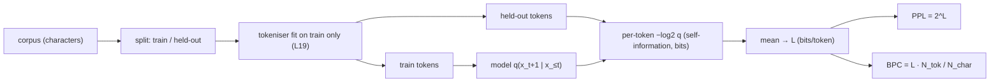

# Lesson 20: Perplexity and Evaluation

[[03-cross-entropy-loss]] introduced cross-entropy as the model's training objective and information-theoretic floor; [[18-training-loop]] used it as the per-step diagnostic. **Perplexity** is the same number expressed in a more interpretable unit — an "effective branching factor" — and is the universal currency for comparing language models across architectures and corpora. Underneath the unit sits one exact fact that this lesson is built on: the cross-entropy of a model on a text is the length, in bits per token, of the file an arithmetic coder driven by that model would write, and perplexity is its antilog. This lesson separates the two definitions of perplexity that are usually conflated, demonstrates the code-length identity on the course's toy corpus, converts to bits per character, tracks perplexity through a real training run, and reads the per-token loss histogram as a statistic with a confidence interval.

## Learning Objectives

- State the two definitions and keep them apart: the perplexity of a **distribution** $q$ is $2^{H(q)}$; the perplexity of a **model on data** is $2^{H(p,q)}$, and only the second is what papers report.
- Derive $\mathrm{PPL} = e^{\mathcal{L}}$ from average cross-entropy $\mathcal{L}$ in nats ($2^{\mathcal{L}}$ for $\mathcal{L}$ in bits) and read it as the **effective number of equally-likely choices** per token.
- Verify on the toy corpus that $\sum_t -\log_2 q(x_t)$ is the length of the arithmetic-coded file, and convert between bits per token, bits per character (BPC), and perplexity.
- Name the reference points once: the **uniform reference** $|\mathcal{V}|$ (a model that knows only the alphabet), the **perfect** value 1, and the corpus's own **conditional-entropy floor** between them.
- Track perplexity through a training run under the held-out protocol, and read the per-token loss histogram as the distribution of self-information whose spread sets the confidence interval of a PPL estimate.

## Background

Cross-entropy and the source-coding bound from [[03-cross-entropy-loss]]. The bigram model, its stationary distribution, and its entropy rate of $\tfrac12$ bit per token — perplexity $2^{0.5} = \sqrt2 \approx 1.414$ — from [[05-bigram-language-model]]. Training-loop diagnostics and the 49-pair / 9-pair train / validation split from [[18-training-loop]]. Bits per character as the tokeniser-invariant unit from [[19-byte-pair-encoding]].

<!-- hide -->
```rustlab
run "../lib/info.rlab"
run "../lib/bigram_lm.rlab"
```

## Defining Perplexity

### Theory

Two different objects are both called perplexity. Keeping them apart is the whole difficulty of this lesson.

**Perplexity of a distribution.** A distribution $q$ over $\mathcal{V}$ with entropy $H(q) = -\sum_i q_i \log_2 q_i$ bits has

$$\mathrm{PPL}(q) \;=\; 2^{H(q)} \;=\; e^{H_{\text{nats}}(q)}.$$

It is the size of the uniform alphabet with the same entropy: $q$ is as uncertain as a fair choice among $2^{H(q)}$ symbols. It lies between 1 (a point mass) and $|\mathcal{V}|$ (uniform) and says nothing about any data.

**Perplexity of a model on data.** Given a sequence $x_1, \dots, x_T$ and a model that assigns $q(x_{t+1} \mid x_{\le t})$, the average cross-entropy in nats is

$$\mathcal{L} \;=\; -\frac{1}{T-1} \sum_{t=1}^{T-1} \ln q(x_{t+1} \mid x_{\le t}),$$

and

$$\boxed{\mathrm{PPL} \;=\; e^{\mathcal{L}} \;=\; 2^{\mathcal{L}/\ln 2} \;=\; \Bigl(\prod_{t=1}^{T-1} q(x_{t+1} \mid x_{\le t})\Bigr)^{-1/(T-1)}}$$

— the geometric mean of the inverse probabilities the model assigned to what actually happened. This is $2^{H(p,q)}$ with $p$ the empirical distribution of the data, and since $H(p,q) = H(p) + D_{\mathrm{KL}}(p \,\|\, q) \ge H(p)$, a model's perplexity on data is bounded below by the *data's* entropy rate, never by the model's own confidence. The two definitions coincide only when the data is drawn from $q$ itself — a calibrated model scored on its own samples. A confident model on the wrong data has a tiny $2^{H(q)}$ and an enormous $2^{H(p,q)}$.

Three reference points, one name each, used throughout: the **uniform reference** $q = 1/|\mathcal{V}|$ gives $\mathcal{L} = \ln|\mathcal{V}|$ and $\mathrm{PPL} = |\mathcal{V}|$ (knows only the alphabet; a miscalibrated model can score *worse*); the **perfect** model gives $\mathrm{PPL} = 1$; and the **corpus floor** $2^{H(X_{t+1} \mid X_{\le t})}$ is what no model can beat in expectation — with one token of context on the period-4 corpus it is the **optimal-bigram floor** $\sqrt2$. Between the last two, perplexity is the effective branching factor.

The evaluation pipeline that produces the number:



### Example — PPL of three reference distributions

Definition 1 — the perplexity of a distribution, with no data in sight:

```rustlab
p_uniform = [0.25, 0.25, 0.25, 0.25];
p_peaked  = [0.7,  0.1,  0.1,  0.1];
p_sharp   = [0.97, 0.01, 0.01, 0.01];

% Definition 1: PPL of a distribution = 2^H(q), H in bits (lib/info.rlab).
function ppl = entropy_to_ppl(p)
  ppl = 2 ^ entropy_bits(p);
end

print("PPL uniform =", entropy_to_ppl(p_uniform), "  (should equal 4)");
print("PPL peaked  =", entropy_to_ppl(p_peaked));
print("PPL sharp   =", entropy_to_ppl(p_sharp));
```

A uniform distribution over 4 classes has entropy $\log_2 4 = 2$ bits and $\mathrm{PPL} = 4$. Peaked distributions have $\mathrm{PPL}$ between 1 and 4, with $\mathrm{PPL} \to 1$ as the distribution concentrates on a single class.

### Example — PPL vs confidence in the correct class

Sweep the probability $p$ the model puts on one class from chance ($1/K$) up to near-certainty, spreading the rest uniformly over the other $K-1$ classes. Three curves come out of the same $q$: its own perplexity $2^{H(q)}$ (definition 1), and the model's perplexity on data (definition 2) in the two extreme cases — the true token is always the favoured class ($\mathrm{PPL} = 1/p$) or always one of the others ($\mathrm{PPL} = (K-1)/(1-p)$).

```rustlab
K = 4;
ps = linspace(1.0 / K, 0.999, 50);
ppl_dist = zeros(50);  ppl_hit = zeros(50);  ppl_miss = zeros(50);
for k = 1:50
  p = ps(k);  rest = (1 - p) / (K - 1);
  ppl_dist(k) = entropy_to_ppl([p, rest, rest, rest]);   % 2^H(q)
  ppl_hit(k)  = 1 / p;      ppl_miss(k) = 1 / rest;      % 2^H(p,q): truth = favoured / tail class
end

figure();
semilogy(ps, ppl_dist, "color", "blue", "label", "2^H(q): the distribution's own PPL")
hold("on")
semilogy(ps, ppl_hit, "color", "green", "label", "model on data, truth = favoured class (1/p)")
semilogy(ps, ppl_miss, "color", "red", "label", "model on data, truth = tail class")
hold("off")
title("One distribution, three perplexities")
xlabel("probability on the favoured class")
ylabel("PPL (log axis)")
```

> [!TIP]
> All three curves meet at $p = 1/K$, where the model is uniform and every definition gives $K = 4$. As $p \to 1$ the blue and green curves fall to 1 but the red one climbs past 1000: the same confident $q$ is a superb model of one text and a disastrous model of another. $2^{H(q)}$ is the model's opinion of itself; only the green and red curves are measurements.

## Why Perplexity, Not Cross-Entropy?

### Theory

Cross-entropy and perplexity carry the same information, but perplexity has two advantages for human reading:

1. **Geometric-mean units.** $\mathrm{PPL}$ is the geometric mean of $1 / q(x_{t+1} \mid x_{\le t})$: a perplexity of 25 means the model's typical probability on the token that actually came was $1/25$. A drop from 50 to 25 removes exactly one bit per token from the code length (next section); the same change in cross-entropy is $3.91 \to 3.22$ nats — correct but opaque.
2. **Direct comparison to the uniform reference.** "Is $\mathrm{PPL} = 30$ good?" depends on $|\mathcal{V}|$. If $|\mathcal{V}| = 50000$ (GPT-3 scale), 30 is excellent — roughly one part in 1700 of the uniform reference. If $|\mathcal{V}| = 256$ (byte-level LM), 30 is mediocre.

The conversion is one line: $\mathrm{PPL} = e^{\mathcal{L}}$ for $\mathcal{L}$ in nats, $2^{\mathcal{L}}$ for $\mathcal{L}$ in bits. Always check which logarithm a paper is using; this course computes in nats and reports in bits.

## Training Curves in Perplexity Units

### Theory

Take any training run and plot $\mathrm{PPL}$ instead of $\mathcal{L}$ on the y-axis. The shape is the same — both are monotone functions of the loss — but PPL has two visually useful properties:

- A uniform-init run **starts near the uniform reference $|\mathcal{V}|$** and **cannot end below the perfect value 1**. Only 1 is a hard bound; a badly miscalibrated model can briefly sit above $|\mathcal{V}|$.
- On a **log axis**, a constant-factor improvement per step is a straight line, and the two floors are horizontal lines the curve must respect. `semilogy` is the right plot for a perplexity curve.

The block below reruns the [[18-training-loop]] loop with the loss logged at every step; `perplexity_curve.rlab` is the standalone copy.

### Example — PPL endpoint sanity for the bigram corpus

```rustlab
% Lesson 05: entropy rate 1/2 bit per token given one token of context (the coin flip after 'b').
H_bigram = 0.5 * log(2);                    % nats
PPL_bigram = exp(H_bigram);
print("Optimal-bigram floor on 'abcbabcb...': exp(", H_bigram, ") =", PPL_bigram, "= sqrt(2);  uniform reference = 3");
```

A trained bigram on the period-4 corpus reaches $\mathrm{PPL} = \sqrt2 \approx 1.414$ — the optimal-bigram floor (Lesson 05 quotes it as $e^{0.347} \approx 1.415$ from a rounded entropy). A model that did *better* would have to use more than one token of context: the trigram `(prev2, prev)` would push PPL all the way to 1, since the corpus is fully deterministic given two tokens.

### Example — Train and held-out PPL through a training run

The 24-parameter embedding + head model of Lesson 18, trained full-batch with AdamW under the warmup-cosine schedule. The gradient is the $\mathbf{p} - \mathbf{y}$ error signal of [[15-backpropagation]]; the update is the Adam step of [[16-adamw-optimizer]]. Loss is logged on both splits at every step.

```rustlab
% Period-4 corpus: tokens 1-50 train (49 pairs), tokens 50-59 held out (9 pairs).
pat = [1, 2, 3, 2];
corpus = zeros(60);
for i = 1:60
  corpus(i) = pat(mod(i - 1, 4) + 1);
end
train_ids = corpus(1:50);  val_ids = corpus(50:59);  vocab = 3;  d_emb = 4;

function L = mean_loss(ids, E, W)            % mean -ln q(x_{t+1} | x_t), nats
  L = 0.0;
  for k = 1:(length(ids) - 1)
    p = softmax(E(ids(k), :) * W);
    L = L - log(p(ids(k + 1)));
  end
  L = L / (length(ids) - 1);
end

function [dE, dW] = batch_grad(ids, E, W)    % full-batch gradient of mean_loss
  vocab = size(E)(1);  d_emb = size(E)(2);  n = length(ids) - 1;
  dE = zeros(vocab, d_emb);  dW = zeros(d_emb, vocab);
  for k = 1:n
    curr = ids(k);  nxt = ids(k + 1);
    h = E(curr, :);
    g = softmax(h * W);  g(nxt) = g(nxt) - 1;       % dL/dlogits = p - y
    dW = dW + h' * g;
    dh = g * W';
    for j = 1:d_emb
      dE(curr, j) = dE(curr, j) + dh(j);
    end
  end
  dE = dE / n;  dW = dW / n;
end

seed(20);
E = randn(vocab, d_emb) * 0.3;  W = randn(d_emb, vocab) * 0.3;
n_steps = 600;  eta_max = 0.15;  eta_min = 0.015;  T_w = 60;  b1 = 0.9;  b2 = 0.999;  eps_a = 1e-8;
mE = zeros(vocab, d_emb);  vE = mE;  mW = zeros(d_emb, vocab);  vW = mW;
L_tr = zeros(n_steps + 1);  L_va = zeros(n_steps + 1);
L_tr(1) = mean_loss(train_ids, E, W);  L_va(1) = mean_loss(val_ids, E, W);
for s = 1:n_steps
  if s <= T_w                                         % warmup-cosine (Lesson 17)
    eta = eta_max * (s / T_w);
  else
    progress = (s - T_w) / (n_steps - T_w);
    eta = eta_min + 0.5 * (eta_max - eta_min) * (1 + cos(pi * progress));
  end
  [dE, dW] = batch_grad(train_ids, E, W);
  mE = b1 * mE + (1 - b1) * dE;  vE = b2 * vE + (1 - b2) * (dE .^ 2);   % Adam moments
  mW = b1 * mW + (1 - b1) * dW;  vW = b2 * vW + (1 - b2) * (dW .^ 2);
  E = E - eta * ((mE / (1 - b1 ^ s)) ./ (sqrt(vE / (1 - b2 ^ s)) + eps_a));
  W = W - eta * ((mW / (1 - b1 ^ s)) ./ (sqrt(vW / (1 - b2 ^ s)) + eps_a));
  L_tr(s + 1) = mean_loss(train_ids, E, W);  L_va(s + 1) = mean_loss(val_ids, E, W);
end
PPL_tr = exp(L_tr);  PPL_va = exp(L_va);
% The same 600 steps are packaged as train_bigram_lm (lib/bigram_lm.rlab): re-seed and compare.
seed(20);
[E_lib, W_lib] = train_bigram_lm(train_ids, vocab, d_emb, n_steps, eta_max, eta_min, T_w);
print("initial train PPL:", PPL_tr(1), "  held-out:", PPL_va(1), "  (uniform reference 3)");
print("final   train PPL:", PPL_tr(end), "  held-out:", PPL_va(end));
print("max |E - E_lib| =", max(max(abs(E - E_lib))), "  (the loop above is train_bigram_lm with logging)");
```

```rustlab
figure();
steps = 0:n_steps;
semilogy(steps, PPL_tr, "color", "red", "label", "train")
hold("on")
semilogy(steps, PPL_va, "color", "blue", "label", "held-out")
yline(3.0, "gray", "uniform reference = 3")
yline(sqrt(2), "black", "optimal-bigram floor = 1.414")
hold("off")
title("Train / held-out perplexity over training (log axis)")
xlabel("step")
ylabel("PPL")
```

> [!TIP]
> Both curves leave the uniform reference and reach their floors inside the 60-step warmup; the small ripple on the held-out curve around steps 40–100 is Adam's limit cycle from [18-training-loop](18-training-loop.md) dying out as the learning rate decays. The held-out curve settles slightly *above* the floor line and the train curve slightly *below* it — the next section explains both offsets as finite-sample effects, not learning.

## Comparing Models

### Theory

When comparing two language models on the same test set the rule is simple:

$$\text{Model A is better than Model B}\iff \mathrm{PPL}_A < \mathrm{PPL}_B.$$

Practical caveats:

- **Same tokeniser, or convert.** Perplexity is *per token*, so a model with a different vocabulary is scored on a different number of events. The tokeniser-invariant quantity is the total code length of the text, normalised per character:

$$\mathrm{BPC} \;=\; \frac{N_{\text{tok}}}{N_{\text{char}}} \cdot \frac{\mathcal{L}_{\text{nats}}}{\ln 2}\quad\text{bits per character},$$

  and likewise bits per byte. A BPE model at $\mathcal{L} = 3.0$ nats/token on English with 4.4 characters per token has $\mathrm{BPC} = 3.0 / (4.4 \ln 2) = 0.98$ — comparable to a byte-level model, whose PPL over 256 symbols it is not.
- **Held-out protocol.** The test set must be unseen by *everything*: the tokeniser is fit on the training split only (a BPE merge table learned on the test text leaks its statistics), the test text is deduplicated against the training text (a memorised paragraph scores PPL $\approx 1$ and says nothing), and the split is by document, not by line, so shared context cannot leak across the boundary.
- **Same test set.** PPL on Wikipedia is incomparable to PPL on Python source; they are different distributions. A reported "PPL on PTB" is a contract: the test corpus is fixed.
- **Length normalisation.** PPL averages over sequence length. A model that does well on short sequences but poorly on long ones can tie with a model of the opposite profile — break the average down by position when the end task cares.

### Example — PPL after one round of training

The run above pushes both train and held-out PPL from the uniform reference $3$ down to about $1.4$ — the effective branching factor almost halves. Read the exact numbers:

```rustlab
PPL_train_floor = exp(24 * log(2) / 49);     % empirical floor of the 49 training pairs
print("final train PPL   :", PPL_tr(end), "   empirical train floor exp(24 ln2 / 49) =", PPL_train_floor);
print("final held-out PPL:", PPL_va(end), "   empirical held-out floor exp(5 ln2 / 9)  =", exp(5 * log(2) / 9));
print("optimal-bigram floor (population): sqrt(2) =", sqrt(2));
BPC_train = L_tr(end) / log(2);  BPC_val = L_va(end) / log(2);   % 1 token per character here
print("bits per character: train", BPC_train, "  held-out", BPC_val, "  (uniform reference log2 3 =", log2(3), ")");
print("BPE example: L = 3.0 nats/token at 4.4 char/token -> BPC =", 3.0 / (4.4 * log(2)));
```

The final *train* PPL is ${PPL_tr(end):%.4f}$, a hair **below** the optimal-bigram floor $\sqrt2 = 1.4142$. That is not a bug. The floor is the *population* value, while the train PPL is measured on the 49 training pairs, whose empirical entropy is $24 \ln 2 / 49 = 0.3395$ nats — an **empirical train floor** of $e^{0.3395} = 1.4042$. The finite sample under-represents the uncertain `b` transition (24 of 49 pairs start from `b`, below the true $\tfrac12$), so its floor sits just under the population one. The held-out split over-represents it (5 of 9 pairs), so its floor is $e^{5 \ln 2 / 9} = 1.470$, and the model lands on that number exactly. Neither gap is overfitting: the model has learned the one distribution both splits share, and each split scores it with its own finite-sample weights.

### Example — The toy model on Shannon's bits-per-character axis

Because every token here is one character, BPC equals bits per token, and the toy model can be placed on the same axis as real text: Shannon's 1951 estimate of English at about 1 bit per character, and a modern LLM near 0.8 bits per byte.

```rustlab
figure();
labels = {"8-bit ASCII", "uniform over 3", "unigram (1/4,1/2,1/4)", "trained (held-out)", "optimal bigram", "Shannon English", "LLM on English"};
bpc_axis = [8, log2(3), entropy_bits([0.25, 0.5, 0.25]), BPC_val, 0.5, 1.0, 0.8];
bar(labels, bpc_axis)
title("Bits per character: the toy corpus and English on one axis")
ylabel("bits/char")
```

> [!TIP]
> The three toy-corpus bars step down $\log_2 3 = 1.585 \to 1.5 \to 0.5$ as the model learns first the alphabet, then the letter frequencies, then the one-token context; the trained model sits on the held-out floor. English is *harder* than this corpus at every context length — the axis is shared, the texts are not — and a model within 0.2 bit of Shannon's estimate is a model near the floor of its language.

## Connection to Compression

### Theory

An arithmetic coder driven by the model's $q(x_{t+1} \mid x_{\le t})$ writes the whole sequence with

$$\text{file length} \;=\; \sum_{t} -\log_2 q(x_{t+1} \mid x_{\le t}) \;+\; \text{(less than 2 bits of overhead)},$$

so cross-entropy in bits per token **is** the compression rate, and

$$\mathrm{PPL} \;=\; 2^{\text{bits per token}}$$

is its antilog. Everything else in this lesson follows from that identity:

- A model with $\mathrm{PPL} = 2^{2.3} = 4.92$ on a corpus compresses it to $2.3$ bits per token.
- Halving the perplexity removes exactly 1 bit per token — half the file only if you started at 2 bits per token.
- The floor for any next-token model is the corpus's conditional entropy $H(X_{t+1} \mid X_{\le t})$, the rate below which no lossless code exists.

"Better language model" and "better text compressor" are not analogies — they are the same number under arithmetic coding ([[05-bigram-language-model]] named the coder; [[19-byte-pair-encoding]] used the same accounting for the tokeniser).

### Example — Code length of the 20-token corpus

Total the self-information the trained model assigns to the first 20 tokens of the corpus and compare it with a code that knows only the alphabet:

```rustlab
ids = corpus(1:20);                          % "abcb abcb abcb abcb abcb"
bits_model = 0.0;
for t = 1:19
  q = softmax(E(ids(t), :) * W);
  bits_model = bits_model + (-log2(q(ids(t + 1))));
end
bits_first = log2(3);                        % the first token has no context: uniform
print("model code   : first token", bits_first, "+ 19 predicted tokens", bits_model, "=", bits_first + bits_model, "bits");
print("uniform code : 20 * log2(3) =", 20 * log2(3), "bits");
print("2^(bits per predicted token) =", 2 ^ (bits_model / 19), "  = PPL on these 20 tokens", exp(mean_loss(ids, E, W)));
```

The 20 tokens cost ${bits_first + bits_model:%.2f}$ bits under the model against ${20 * log2(3):%.2f}$ bits under the uniform code — nine of the model's bits are the nine coin flips after `b`, and the ten transitions out of `a` and `c` are free. The antilog of the per-token rate is the perplexity to the last digit: the two are one computation, not two.

## Per-Token Perplexity Distribution

### Theory

Mean PPL is one summary number. The quantity being averaged, $\ell_t = -\log_2 q(x_{t+1} \mid x_{\le t})$, is the **self-information** of each token under the model, and its histogram over a test set is the cheapest diagnostic that a model is working as intended:

- **Bimodal** — many tokens near 0 bits (the model knows them) and a cluster far to the right. The model has learned the easy patterns and fails on a specific class of inputs.
- **Heavy-tailed** — a few tokens costing 15–20 bits dominate the mean. Usually rare vocabulary or genuinely ambiguous context.
- **Tight unimodal** — the model is uniformly imperfect, with no specific failure pattern.

Two moments matter: the **mean** is the cross-entropy, and the **standard deviation** is the square root of the *varentropy* — the spread of code lengths — which sets how many tokens a held-out set needs before the PPL estimate is trustworthy.

### Example — Self-information histogram on a held-out stream

Score the trained model on a fresh 200-token stretch of the same source (the source is periodic, so this is unseen text with the same statistics) and plot the per-token bits:

```rustlab
held = zeros(200);
for i = 1:200
  held(i) = pat(mod(i - 1, 4) + 1);
end
N = 199;
losses = zeros(N);                           % self-information, bits
for t = 1:N
  q = softmax(E(held(t), :) * W);
  losses(t) = -log2(q(held(t + 1)));
end
print("mean(losses) =", mean(losses), "bits = cross-entropy;  PPL = 2^mean =", 2 ^ mean(losses));
print("std(losses)  =", std(losses), "bits = sqrt(varentropy);   median =", median(losses));

figure();
histogram(losses, 20);
title("Per-token self-information under the trained model (199 held-out tokens)")
xlabel("-log2 q(x_{t+1} | x_t)  [bits]")
ylabel("count")
```

> [!TIP]
> Two spikes and nothing between them: the transitions out of `a` and `c` cost 0 bits and the coin flip after `b` costs exactly 1 bit. The mean, $0.50$ bit, sits where no token lives — the textbook bimodal case — and the median is $\approx 0$: half the tokens are free, so the median falls inside the left spike while the mean is dragged to the middle by the other half.

## Sidebar: Parallel Evaluation with `parmap`

### Theory

Every per-token loss $\ell_t$ depends only on the past context, never on another position's loss, so computing the mean cross-entropy over a held-out set is embarrassingly parallel: map $\ell_t$ over positions, then reduce. Rustlab's `parmap` expresses exactly that, and returns a result bit-identical to the serial loop — it is a control-flow rewrite, not a numerical approximation. Generation ([[21-sampling-and-generation]]) is the one place the pattern cannot help: token $x_{t+1}$ can only be sampled after $x_t$ exists, so evaluation has $T$ independent forward passes and generation has $T$ dependent ones.

<!-- details: Parallel evaluation with parmap -->
```rustlab
function l = pair_loss(k, ids, E, W)
  p = softmax(E(ids(k), :) * W);
  l = -log(p(ids(k + 1)));
end
loss_par = mean(parmap(@(k) pair_loss(k, held, E, W), 1:N));
loss_ser = 0.0;
for k = 1:N
  loss_ser = loss_ser + pair_loss(k, held, E, W);
end
loss_ser = loss_ser / N;
print("parmap mean loss:", loss_par, "nats   serial:", loss_ser, "   diff:", abs(loss_par - loss_ser));
```

## Connection to Earlier Lessons

### Theory

- **Lesson 03** introduced cross-entropy as $-\sum p \log q$ for distributions and as the average $-\log q(x_{t+1} \mid x_{\le t})$ for a sequence; PPL is $e^{\mathcal{L}}$ on the same average (definition 2). **Lesson 05** computed the bigram entropy rate, $\tfrac12$ bit per token — the optimal-bigram floor. **Lesson 18** plotted $\mathcal{L}$ over training; this lesson plots $e^{\mathcal{L}}$ of the same data on a log axis.

## Engineering Lenses

No signals or systems reading adds to this lesson: perplexity is a scalar summary of a code length, and everything about it lives under the information lens.

### Information

**Exact.** $\mathrm{PPL} = 2^{H(p,q)}$ is the antilog of the arithmetic-coding length per token — demonstrated above, where the same 20 tokens cost ${bits_first + bits_model:%.2f}$ bits under the model and ${20 * log2(3):%.2f}$ bits under the uniform code, and $2^{\text{bits/token}}$ reproduced the perplexity to the last digit.

**Exact.** The file length is invariant under re-tokenisation; the perplexity is not. Score the same 199-token held-out stream once per character and once as if the tokeniser had merged each pair (`ab`, `cb`): the bits written to disk do not change, BPC does not change, and the perplexity doubles because the same bits are spread over half as many events.

```rustlab
bits_file = sum(losses);  N_char = N;
print("file length      :", bits_file, "bits for", N_char, "characters  ->  BPC =", bits_file / N_char);
print("PPL per character:", 2 ^ (bits_file / N_char), "   PPL per 2-char token:", 2 ^ (bits_file / (N_char / 2)), "   BPC unchanged");
```

**Exact.** The per-token losses are samples of the self-information $-\log_2 q(X_{t+1} \mid X_{\le t})$; their mean estimates the cross-entropy and their standard deviation is the square root of the varentropy. A held-out set of $N$ tokens therefore pins the cross-entropy to $\pm 1.96\,\sigma / \sqrt N$ bits, and — since $\delta\mathrm{PPL}/\mathrm{PPL} = \delta\mathcal{L}_{\text{nats}}$ — the perplexity to a relative error of $1.96\,\sigma_{\text{nats}} / \sqrt N$. This is why published evaluations use held-out sets of $10^5$–$10^6$ tokens.

```rustlab
se_bits = std(losses) / sqrt(N);
print("CE =", mean(losses), "+/-", 1.96 * se_bits, "bits (95%)  ->  PPL in [", 2 ^ (mean(losses) - 1.96 * se_bits), ",", 2 ^ (mean(losses) + 1.96 * se_bits), "]");
sigma_nats = std(losses) * log(2);
print("tokens for +/-1% PPL: this model", ceil((1.96 * sigma_nats / 0.01) ^ 2), "   a real LM with sigma = 2.5 nats:", ceil((1.96 * 2.5 / 0.01) ^ 2));
```

**Model.** Reading the train / held-out gap as a description-length budget (model bits + data bits) is the honest way to say "memorised": this model spends $24 \times 64 = 1536$ bits of parameters to save the ${(log2(3) - BPC_train) * 49:%.0f}$ bits that its predictions remove from the 49 training pairs' uniform code, so by that budget it is a grossly over-parameterised code for its corpus — the capstone ([[23-putting-it-all-together]]) makes the same accounting for a 300-parameter transformer.

## Key Takeaways

- Two definitions: $2^{H(q)}$ is the perplexity of a distribution; $2^{H(p,q)} = e^{\mathcal{L}}$ is the perplexity of a model on data, and only the second is a measurement. Always check the log base.
- Cross-entropy in bits per token is **exactly** the arithmetic-coding rate; perplexity is its antilog, the effective branching factor $2^{\text{bits/token}}$. Halving PPL removes one bit per token.
- Reference points, one name each: uniform reference $|\mathcal{V}|$, perfect 1, and the corpus's conditional-entropy floor (optimal-bigram floor $\sqrt2$ here).
- Lower PPL = better model — on the same test set, with the tokeniser fit on train only, or after converting to bits per character.
- The per-token loss histogram is the distribution of self-information: mean = cross-entropy, std = $\sqrt{\text{varentropy}}$, which sets the confidence interval of the PPL estimate and the length a held-out set needs.

## Standalone Scripts

| Script | What it computes |
|---|---|
| `perplexity_basics.rlab` | PPL of three reference distributions and the one-distribution / three-perplexities sweep ($2^{H(q)}$, $1/p$, tail case) |
| `perplexity_curve.rlab` | re-runs the Lesson 18 24-parameter LM training loop and plots train / held-out PPL per step on a log axis with both floors, alongside the loss curve |
| `code_length.rlab` | trains the model via `lib/bigram_lm.rlab`, totals the arithmetic-coding length of the 20-token corpus against the uniform code, prints BPC and the BPE conversion, and draws the bits-per-character axis |
| `loss_histogram.rlab` | per-token self-information histogram on a 200-token held-out stream; mean, std (varentropy), confidence interval and the tokens-for-1 % estimate |

Run all with `make lesson-20` (or `rustlab run lessons/20-perplexity-and-evaluation/<name>.rlab`).

## Expected Numerical Outputs Summary

| Variable | Expected Value |
|---|---|
| `entropy_to_ppl(p_uniform)` over 4 classes | `4.0` |
| `entropy_to_ppl(p_peaked)` (0.7/0.1/0.1/0.1) | ≈ `2.5611` |
| `entropy_to_ppl(p_sharp)` (0.97/0.01/0.01/0.01) | ≈ `1.1826` |
| Optimal-bigram floor $e^{0.5 \ln 2} = \sqrt2$ | ≈ `1.4142` |
| Initial train / held-out PPL (step 0) | ≈ `2.995` / `2.984` (uniform reference 3) |
| Final train PPL | ≈ `1.4042` (= empirical train floor $e^{24 \ln 2 / 49}$) |
| Final held-out PPL | ≈ `1.4697` (= empirical held-out floor $e^{5 \ln 2 / 9}$) |
| `max \|E - E_lib\|` (loop vs `train_bigram_lm`) | `0` |
| BPC train / held-out | ≈ `0.490` / `0.556` bits/char |
| Code length of the 20-token corpus: model / uniform | ≈ `10.58` / `31.70` bits |
| `2^(bits per predicted token)` = PPL on those 20 tokens | ≈ `1.3887` |
| `mean(losses)` / `std(losses)` on 199 held-out tokens | ≈ `0.497` / `0.501` bits |
| 95 % interval on PPL from 199 tokens | ≈ `[1.345, 1.482]` |
| Tokens for ±1 % PPL: this model / $\sigma = 2.5$ nats | `4638` / `240100` |
| `parmap` vs serial mean loss | identical (`diff = 0`) |

## Exercises

1. **Endpoint sanity.** What perplexity does a random-init model produce on a $|\mathcal{V}| = 256$ byte-level vocabulary? On $|\mathcal{V}| = 50000$ BPE tokens? Are these the right baselines to compare a trained LM against?
2. **Bits per byte.** Published evaluations put GPT-3-175B around 0.8 bits per byte on typical English text. Convert this to perplexity over the byte vocabulary, $\mathrm{PPL} = 2^{0.8}$, and to bits per BPE token at 4.4 bytes per token using the BPC formula. What fraction of the uniform reference ($256 = 2^8$) is the byte-level perplexity?
3. **Cross-vocab comparison.** Two models — one with $|\mathcal{V}| = 100$ at 1.2 characters per token and another with $|\mathcal{V}| = 1000$ at 2.5 characters per token — both report PPL = 30 on the same English text. Compute bits per character for each. Which is the better compressor?
4. **Tail of the distribution.** For a real LM on a real test set the median per-token loss is far below the mean. Why does that not happen in the histogram above? What does the gap say about which tokens dominate a real model's average?
5. **Floor for the period-4 corpus.** A trigram model conditions on the previous *two* tokens. Compute its theoretical PPL on `"abcbabcb…"`. Is it equal to 1, greater than 1, or undefined?

## What's next

Phase 7 closes here. With BPE in hand for tokenisation and PPL as the evaluation metric, every measurement an LLM publication uses is now derivable from first principles. [[21-sampling-and-generation]] turns the trained model around and *uses* it — greedy, temperature, top-K and top-P decoding as a closed loop with the model's own output fed back, and the KV cache as that loop's state. [[22-full-backprop-through-the-block]] then derives the complete backward pass, and [[23-putting-it-all-together]] trains the full architecture end to end.
