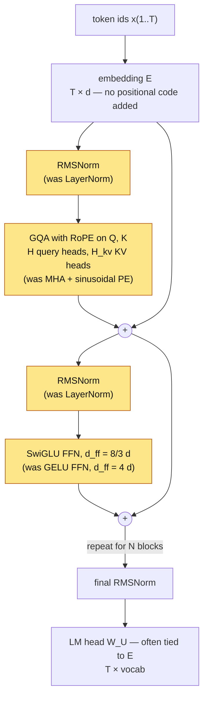

# Lesson 24: Modern Architectural Variants

The architecture you built in Lessons 08–14 is the **2017 Vaswani / 2019 GPT-2** transformer. Most major open LLMs trained since 2022 — LLaMA, Mistral, Qwen, Falcon — swap out several of those components for variants that improve quality, speed, or memory while preserving the overall shape of the stack. There are four common swaps, and a given model adopts a subset: the LLaMA family uses all four, while GPT-NeoX-20B, for example, took only rotary embeddings and kept LayerNorm + GELU. This lesson covers all four, plus the one further change (sliding-window attention) that is a three-line edit to the mask:

| Component | Lesson built | Modern variant | Used in |
|---|---|---|---|
| Sinusoidal / learned positional encoding | [[10-positional-encoding]] | **RoPE** (rotary) | LLaMA, Mistral, Qwen, Falcon, GPT-NeoX |
| LayerNorm | [[12-layer-norm-and-residuals]] | **RMSNorm** | LLaMA, Mistral, T5, Qwen |
| GELU + 2-matrix FFN | [[11-feed-forward-block]] | **SwiGLU** | LLaMA, Mistral, PaLM, Qwen |
| Multi-head attention | [[09-multi-head-attention]] | **GQA / MQA** | LLaMA 2/3, Mistral, Qwen |

Each is a surgical swap against the baseline — no other layers change. Read this lesson as four self-contained deltas, each with an engineering reading: RoPE is complex modulation, RMSNorm is gain control without the DC block, SwiGLU is a multiplier, and GQA exists because decoding is bandwidth-bound.

## Learning Objectives

- Derive **RoPE** in its phasor form — each dimension pair is a complex number multiplied by a carrier $e^{jm\theta_k}$ — and prove that the attention score depends only on the phase difference $(m - n)\theta_k$, i.e. on *relative* position.
- Read **RMSNorm** as LayerNorm without the DC block: identical on zero-mean rows, different on shifted rows, one reduction instead of two.
- Implement the **SwiGLU** FFN as a multiplier between two linear projections; pick $d_{\text{ff}}$ to match the standard FFN's parameter count.
- Implement **GQA** by sharing K and V across groups of query heads, quantify the KV-cache reduction, and derive its operational reason: decode throughput is bounded by memory bandwidth over cache bytes.
- Add **sliding-window attention** as a banded mask, and place ALiBi, MoE, FlashAttention, attention sinks, speculative decoding and quantisation on the map.

## Background

- Complex phasors and the geometric frequency ladder of sinusoidal PE from [[10-positional-encoding]].
- LayerNorm as instantaneous gain control from [[12-layer-norm-and-residuals]].
- FFN with GELU from [[11-feed-forward-block]].
- Multi-head attention from [[09-multi-head-attention]] and causal masking from [[08-scaled-dot-product-attention]].
- The KV cache derivation from [[21-sampling-and-generation]] — the GQA and sliding-window sections extend it directly.

## RoPE — Rotary Positional Embedding

### Theory

Sinusoidal PE in [[10-positional-encoding]] **adds** a position-dependent vector to the embedding before the first attention block: $h_t^{(0)} = e_t + p_t$. Once added, the position is part of every downstream activation; the model has to disentangle "what the token is" from "where it is" at every layer.

RoPE leaves the embeddings alone and **rotates Q and K inside attention** by an angle proportional to position. Group the $d$ coordinates of a query vector $\mathbf{q}$ into $d/2$ pairs and read each pair as one complex number:

$$z_k = q_{2k-1} + j\,q_{2k}, \qquad k = 1, \dots, d/2.$$

RoPE at position $m$ multiplies pair $k$ by a unit-magnitude carrier at that pair's own frequency:

$$\text{RoPE}(\mathbf{q}, m)_k = z_k\, e^{j m \theta_k}, \qquad \theta_k = \text{base}^{-2(k-1)/d}, \qquad \text{base} = 10000.$$

That is complex modulation: the magnitude $\lvert z_k \rvert$ is untouched and the phase advances by $m\theta_k$ per pair. The frequency ladder is the same geometric one Lesson 10 used for its oscillator bank — from $\theta_1 = 1$ rad/token down to $\theta_{d/2} \approx 1/\text{base}$.

The payoff is one line. With $w_k$ the phasors of a key at position $n$, the real dot product of the two rotated vectors is the real part of the complex inner product:

$$\bigl\langle \text{RoPE}(\mathbf{q}, m), \text{RoPE}(\mathbf{k}, n) \bigr\rangle = \Re \sum_k z_k e^{jm\theta_k}\; \overline{w_k e^{jn\theta_k}} = \Re \sum_k z_k \bar{w}_k\, e^{j(m - n)\theta_k}.$$

The absolute positions $m$ and $n$ survive only as the **phase difference** $(m - n)\theta_k$ of two carriers at the same frequency — the heterodyne identity of a mixer: modulate a signal onto a carrier, correlate it against a second signal on the same carrier, and only the difference phase remains. **Attention scores under RoPE depend only on relative position.**

**Real (storage) form.** No production kernel stores complex numbers; it keeps the pair as two reals and applies the equivalent $2 \times 2$ rotation

$$\begin{pmatrix} q'_{2k-1} \\ q'_{2k} \end{pmatrix} = \begin{pmatrix} \cos m\theta_k & -\sin m\theta_k \\ \sin m\theta_k & \cos m\theta_k \end{pmatrix} \begin{pmatrix} q_{2k-1} \\ q_{2k} \end{pmatrix},$$

i.e. $\mathbf{q}' = \mathbf{R}(m)\,\mathbf{q}$ with $\mathbf{R}(m)$ block-diagonal in $2 \times 2$ rotations. The matrix form of the identity is $\mathbf{R}(m)^\top \mathbf{R}(n) = \mathbf{R}(n - m)$, and the one step a linear-algebra reader needs is *why* that holds: each block is a planar rotation, planar rotations commute and compose by adding angles ($\mathbf{R}_2(\alpha)^\top \mathbf{R}_2(\beta) = \mathbf{R}_2(\beta - \alpha)$), and the block-diagonal structure keeps the pairs from mixing. In the complex form this is automatic: $\overline{e^{jm\theta}}\, e^{jn\theta} = e^{j(n - m)\theta}$.

### Example — Apply RoPE to a Q/K pair: two forms of the rotation

```rustlab
seed(23);
T = 4;
d_head = 4;
base = 10000.0;

Q = randn(T, d_head);
K = randn(T, d_head);

n_pairs = d_head / 2;
theta = zeros(n_pairs);
for k = 0:(n_pairs - 1)
  theta(k + 1) = base ^ (-2 * k / d_head);
end
print("theta_k :", theta);
print("wavelength 2 pi / theta_k (tokens):", 2 * pi ./ theta);
% d_head = 4: theta_1 = 1 rad/token (wavelength 6.3 tokens), theta_2 = 0.01 (628 tokens).
```

The phasor form is three lines: pack the odd/even columns into a complex matrix, build the carrier matrix $e^{j m \theta_k}$ for every position $m$ and pair $k$, and multiply element-wise. The real form is the $2 \times 2$ rotation written out on interleaved pairs; both are applied to the same Q and K and compared.

```rustlab
% Phasor form: pairs as complex numbers, one carrier per (position, pair).
pos = (0:(T - 1))';                                % positions m = 0..T-1 as a column
carrier = exp(1i * pos * theta);                    % (T, d/2): e^{j m theta_k}
Qz = Q(:, 1:2:end) + 1i * Q(:, 2:2:end);            % z_k = q_{2k-1} + j q_{2k}
Kz = K(:, 1:2:end) + 1i * K(:, 2:2:end);
Qz_rot = Qz .* carrier;
Kz_rot = Kz .* carrier;
S_phasor = real(Qz_rot * Kz_rot');                  % ' conjugates: Re sum_k z_k conj(w_k) e^{j(m-n)theta_k}

% Real (storage) form: the 2x2 rotation on interleaved pairs, one vector at a time.
function x_rot = rope_apply(x, m, theta)
  d = length(x);
  n_pairs = d / 2;
  x_rot = zeros(d);
  for k = 1:n_pairs
    phi = m * theta(k);
    cos_p = cos(phi);
    sin_p = sin(phi);
    x_2k  = x(2 * k - 1);
    x_2k1 = x(2 * k);
    x_rot(2 * k - 1) = x_2k * cos_p - x_2k1 * sin_p;
    x_rot(2 * k)     = x_2k * sin_p + x_2k1 * cos_p;
  end
end

Q_rot = zeros(T, d_head);
K_rot = zeros(T, d_head);
for m = 0:(T - 1)
  Q_rot(m + 1, :) = rope_apply(Q(m + 1, :), m, theta);
  K_rot(m + 1, :) = rope_apply(K(m + 1, :), m, theta);
end
S_real = Q_rot * K_rot';
diff_rot = max(max(abs(real(Qz_rot) - Q_rot(:, 1:2:end)))) + max(max(abs(imag(Qz_rot) - Q_rot(:, 2:2:end))));
diff_S = max(max(abs(S_phasor - S_real)));
print("max |phasor - real| over the rotated Q:", diff_rot);
print("max |S_phasor - S_real| over all T x T scores:", diff_S);
```

The two forms agree to the last bit (the differences print as ${diff_rot}$ and ${diff_S}$): the phasor form is the *definition*, the $2 \times 2$ rotation is how it is stored.

### Example — Verify relative-position invariance

Take a fixed $\mathbf{q}$ and $\mathbf{k}$. Apply RoPE at positions $(m, n) = (2, 5)$ (relative offset 3) and at $(m, n) = (4, 7)$ (same offset 3). The two dot products must be equal, and both must equal the heterodyne form $\Re \sum_k z_k \bar{w}_k e^{j(m - n)\theta_k}$ evaluated once at the offset:

```rustlab
T_long = 8;
Q_long = randn(T_long, d_head);
K_long = randn(T_long, d_head);

q2 = rope_apply(Q_long(3, :), 2, theta);
k5 = rope_apply(K_long(3, :), 5, theta);
q4 = rope_apply(Q_long(3, :), 4, theta);
k7 = rope_apply(K_long(3, :), 7, theta);
print("<RoPE(q, 2), RoPE(k, 5)> =", q2 * k5');
print("<RoPE(q, 4), RoPE(k, 7)> =", q4 * k7');

qz = Q_long(3, 1:2:end) + 1i * Q_long(3, 2:2:end);
kz = K_long(3, 1:2:end) + 1i * K_long(3, 2:2:end);
s_het = real(sum(qz .* conj(kz) .* exp(1i * (2 - 5) * theta)));
print("Re sum_k z_k conj(w_k) e^{j(m-n)theta_k} at m - n = -3 :", s_het);
```

Both rotations give ${q2 * k5':%.10f}$, and the heterodyne form — which never rotates anything, it only evaluates the phase difference — gives the same number. The relative-position property is algebra, and floating-point round-off is the only thing that could separate the three.

### Example — Constant diagonals and the phasor spirals

Fix one $\mathbf{q}$ and one $\mathbf{k}$ and sweep both positions over $0 \dots 7$. Because the score depends only on $m - n$, the $8 \times 8$ score matrix is constant along every diagonal. The other two panels show *why*: pair 1 ($\theta_1 = 1$ rad/token) sweeps more than a full turn in seven steps while pair 2 ($\theta_2 = 0.01$) barely moves — the fast carrier resolves nearby offsets, the slow carrier keeps far-apart positions distinguishable.

```rustlab
q_fixed = [1.0, 0.5, 0.2, -0.3];
k_fixed = [0.8, -0.4, 0.6, 0.1];
qz = q_fixed(1:2:end) + 1i * q_fixed(2:2:end);
kz = k_fixed(1:2:end) + 1i * k_fixed(2:2:end);
pos8 = (0:(T_long - 1))';
Qf = repmat(qz, T_long, 1) .* exp(1i * pos8 * theta);      % row m+1 = RoPE(q, m)
Kf = repmat(kz, T_long, 1) .* exp(1i * pos8 * theta);
M = real(Qf * Kf');                                        % M(m+1, n+1) = <RoPE(q,m), RoPE(k,n)>
print("M(1, 4) =", M(1, 4), "  M(4, 7) =", M(4, 7), "  (both offset n - m = 3)");

m_fine = linspace(0, 7, 141);
figure();
subplot(1, 3, 1)
imagesc(M, "viridis")
title("<RoPE(q,m), RoPE(k,n)>: constant along diagonals")
xlabel("key position n"); ylabel("query position m")
subplot(1, 3, 2)
polar(angle(qz(1)) + m_fine * theta(1), abs(qz(1)) * ones(141))
hold("on")
scatter(abs(qz(1)) * cos(angle(qz(1)) + pos8' * theta(1)), abs(qz(1)) * sin(angle(qz(1)) + pos8' * theta(1)))
hold("off")
title("pair 1: z_1 e^{j m theta_1}, theta_1 = 1 rad/token, m = 0..7")
subplot(1, 3, 3)
polar(angle(qz(2)) + m_fine * theta(2), abs(qz(2)) * ones(141))
hold("on")
scatter(abs(qz(2)) * cos(angle(qz(2)) + pos8' * theta(2)), abs(qz(2)) * sin(angle(qz(2)) + pos8' * theta(2)))
hold("off")
title("pair 2: theta_2 = 0.01 rad/token — 0.07 rad in 7 tokens")
```

> [!TIP]
> Left: read along any diagonal — the colour is constant, so the score is a function of $n - m$ alone (the printed pair of equal-offset entries agrees exactly). Middle: seven tokens carry the fast pair 7 rad ≈ 1.1 turns around its circle at constant radius $\lvert z_1 \rvert$. Right: the slow pair moves through 4° — over any context short compared with its 628-token wavelength it is nearly a constant, which is the property the extrapolation discussion below turns on.

### Example — Which offsets were seen in training?

The relative-position property is algebraic, not learned, and it is easy to over-read. What the model learns is a function of the offset $m - n$ **for the offsets it saw**. Count the carrier cycles for LLaMA's $d_{\text{head}} = 128$ over its $T_{\max} = 4096$ training context:

```rustlab
d_llama = 128;  T_train = 4096;
lam = 2 * pi ./ (base .^ (-(0:2:(d_llama - 2)) / d_llama));   % wavelength of every pair, in tokens
print("fastest pair: wavelength", lam(1), "tokens ->", T_train / lam(1), "cycles inside T_train");
print("slowest pair: wavelength", lam(end), "tokens ->", T_train / lam(end), "cycles inside T_train");
print("pairs that never complete one cycle in training:", sum(lam > T_train), "of", d_llama / 2);
```

> [!IMPORTANT]
> Within the trained range an offset of 10 between positions 8990 and 9000 is *exactly* the offset of 10 between 90 and 100, so a longer prompt reuses trained behaviour for every query–key pair whose offset stays below $T_{\max}$. Offsets beyond $T_{\max}$ are new inputs: the fast pairs have wrapped hundreds of times and say nothing about them, and the ${sum(lam > T_train)}$ slowest pairs never completed a single cycle during training (the slowest has a wavelength of ${lam(end):%.0f} \approx 2\pi \cdot 10^4$ tokens $\gg 4096$), so an offset of 6000 puts them at a phase the model has never seen. That is why vanilla RoPE does not extrapolate zero-shot and why context extension **rescales the carriers** — position interpolation, NTK-aware scaling, YaRN — rather than hoping.

## RMSNorm

### Theory

LayerNorm from [[12-layer-norm-and-residuals]] does two things to each row:

$$\text{LayerNorm}(x) = \gamma \cdot \frac{x - \mu}{\sqrt{\sigma^2 + \varepsilon}} + \beta, \qquad \mu = \frac{1}{d} \sum x_i, \quad \sigma^2 = \frac{1}{d} \sum (x_i - \mu)^2.$$

**RMSNorm** drops the mean-centering step and the bias $\beta$:

$$\text{RMSNorm}(x) = \gamma \cdot \frac{x}{\sqrt{\frac{1}{d}\sum x_i^2 + \varepsilon}} = \gamma \cdot \frac{x}{\text{RMS}(x)}.$$

In the language of Lesson 12, LayerNorm is a **DC block followed by an automatic gain control**: subtract the row's mean, then divide by its power. RMSNorm is the **AGC alone**. Two things change:

- **Mean centering is gone.** A DC offset on the row passes through — attenuated, because it also raises the power estimate in the denominator, but not removed. Empirically, transformers do not need the centering; the model has plenty of capacity to learn whatever offset compensation is useful.
- **The bias $\beta$ is gone.** One fewer parameter per feature, one fewer add per element.

When the input row is already zero-mean, RMSNorm and LayerNorm are **identical** (up to where $\varepsilon$ sits under the square root).

### Why it's used

- **One reduction, no subtraction, no bias.** LayerNorm reads the row once for the mean, once more for the variance, and writes once; RMSNorm reads once and writes once. The FLOP saving is modest — normalisation is memory-bound, so the removed pass over the row is what matters — and the measured wall-clock gain on the layer is around 1.4×, well short of the 2× an operation count would suggest. (Zhang & Sennrich 2019 report 7–64 % end-to-end speed-ups depending on the model and framework.)
- **Same numerical stability.** $\sqrt{\text{mean}(x^2) + \varepsilon}$ never goes near zero on a non-trivial signal; the $\varepsilon$ floor is sufficient.
- **No measurable quality loss.** T5 and the LLaMA-1 ablations report no perplexity difference between LayerNorm and RMSNorm at the same parameter count.

### Example — A DC-offset test

Adding the same constant to every element of a row is a DC offset. LayerNorm's output cannot see it; RMSNorm's output shifts and its gain drops. The zero-mean comparison first, then the shifted one:

```rustlab
seed(23);
T = 5;
d_model = 8;
H = randn(T, d_model);
gamma = ones(d_model);
beta = zeros(d_model);
eps = 1e-5;

function H_out = rmsnorm_naive(H, gamma, eps)
  T = size(H)(1);
  d = size(H)(2);
  H_out = zeros(T, d);
  for t = 1:T
    x = H(t, :);
    rms = sqrt(mean(x .^ 2) + eps);
    H_out(t) = (x / rms) .* gamma;
  end
end

function H_out = layernorm_naive(H, gamma, beta, eps)
  T = size(H)(1);
  d = size(H)(2);
  H_out = zeros(T, d);
  for t = 1:T
    x = H(t, :);
    mu = mean(x);
    sd = sqrt(mean((x - mu) .^ 2) + eps);
    H_out(t) = ((x - mu) / sd) .* gamma + beta;
  end
end

% Zero-mean inputs: RMSNorm == LayerNorm.
H_centred = zeros(T, d_model);
for t = 1:T
  row = H(t, :);
  H_centred(t) = row - mean(row);
end
diff = max(max(abs(rmsnorm_naive(H_centred, gamma, eps) - layernorm_naive(H_centred, gamma, beta, eps))));
print("zero-mean inputs: max | RMSNorm - LayerNorm | =", diff);

% DC-shifted inputs: LayerNorm removes the DC, RMSNorm passes it through at reduced gain.
H_shifted = H + 2.0;
ln_s  = layernorm_naive(H_shifted, gamma, beta, eps)(1, :);
rms_s = rmsnorm_naive(H_shifted, gamma, eps)(1, :);
print("shifted row 1 LayerNorm:", ln_s, "  mean =", mean(ln_s));
print("shifted row 1 RMSNorm: ", rms_s, "  mean =", mean(rms_s));
print("AGC gain 1/RMS on row 1:  unshifted", 1 / sqrt(mean(H(1, :) .^ 2)), "  shifted", 1 / sqrt(mean(H_shifted(1, :) .^ 2)));
```

The first comparison gives ${diff:%.1e}$ — floating-point round-off. On the shifted row LayerNorm's output has mean ${mean(ln_s):%.1e}$ (the DC is blocked) while RMSNorm's has mean ${mean(rms_s):%.2f}$: the offset came through, scaled by a gain that fell from ${1 / sqrt(mean(H(1, :) .^ 2)):%.2f}$ to ${1 / sqrt(mean(H_shifted(1, :) .^ 2)):%.2f}$ because the DC also counts as power.

```rustlab
figure();
subplot(1, 2, 1)
stem(1:d_model, layernorm_naive(H, gamma, beta, eps)(1, :))
hold("on")
stem(1:d_model, ln_s)
hold("off")
legend("LayerNorm(x)", "LayerNorm(x + 2)")
title("LayerNorm = DC block + AGC: the shift is removed")
xlabel("feature"); ylabel("output")
subplot(1, 2, 2)
stem(1:d_model, rmsnorm_naive(H, gamma, eps)(1, :))
hold("on")
stem(1:d_model, rms_s)
hold("off")
legend("RMSNorm(x)", "RMSNorm(x + 2)")
title("RMSNorm = AGC only: the shift passes, the gain drops")
xlabel("feature"); ylabel("output")
```

> [!TIP]
> Left: the two stem sets coincide — LayerNorm's output is invariant to the offset. Right: every RMSNorm stem moves up by the same amount and the pattern is compressed toward it — a DC term with lower AC gain, exactly what an AGC without a DC block does.

## SwiGLU FFN

### Theory

The FFN from [[11-feed-forward-block]] is

$$\text{FFN}(x) = W_2\, \text{GELU}(W_1 x + b_1) + b_2.$$

Two matrices, one nonlinearity. **SwiGLU** replaces it with a **gated linear unit** form using *three* matrices:

$$\text{SwiGLU}(x) = W_3\, \bigl(\text{SiLU}(W_1 x) \odot (W_2 x)\bigr), \qquad \text{SiLU}(z) = z \cdot \sigma(z) = \frac{z}{1 + e^{-z}}.$$

The element-wise product $\odot$ is a **multiplier**: every hidden unit multiplies two different linear projections of the same input, one of them passed through SiLU first.

### Parameter parity

Three matrices instead of two would naively use 50% more parameters. LLaMA fixes this by choosing $d_{\text{ff}}$ smaller for SwiGLU:

- Standard FFN: $2 \cdot d_{\text{model}} \cdot d_{\text{ff}}$, with $d_{\text{ff}} = 4 d_{\text{model}}$, totals $8 d_{\text{model}}^2$.
- SwiGLU: $3 \cdot d_{\text{model}} \cdot d_{\text{ff}}$. To match $8 d_{\text{model}}^2$, set $d_{\text{ff}} = \frac{8}{3} d_{\text{model}}$.

LLaMA-2 7B picks $d_{\text{ff}} = 11008$ for $d_{\text{model}} = 4096$ — $\frac{8}{3} \cdot 4096$ rounded up to a multiple of 256.

### Why it helps

Shazeer (2020) offers no explanation for the gain and says so. The mechanical content is this. A GELU FFN is *linear → static nonlinearity → linear*, so any interaction between two input directions has to come from the curvature of the activation. A SwiGLU hidden unit is $\text{SiLU}(\mathbf{x}\mathbf{w}_1)\,(\mathbf{x}\mathbf{w}_2)$ — a product of two projections. For small signals $\text{SiLU}(u) \approx u/2$, so the unit is $\tfrac{1}{2}(\mathbf{x}\mathbf{w}_1)(\mathbf{x}\mathbf{w}_2)$: an explicit bilinear, second-order term in the input, with the $\sigma(u)$ factor letting a strongly negative gate path suppress the product. The FFN gets a cheap quadratic feature per hidden unit — a multiplier is the cheapest nonlinearity that mixes two directions. Empirically this is worth ~1–2 % perplexity at the same parameter count: small, but consistent enough that essentially every open LLM trained after PaLM uses it.

### Example — Forward pass + parameter parity

```rustlab
seed(23);
T = 3;
d_model = 8;
d_ff_std  = 4 * d_model;                  % 32
d_ff_swig = floor(8 * d_model / 3);        % 21
H = randn(T, d_model);

% Standard FFN (Lesson 11).
W1s = randn(d_model, d_ff_std) * 0.3;
b1s = randn(d_ff_std) * 0.1;
W2s = randn(d_ff_std, d_model) * 0.3;
b2s = randn(d_model) * 0.1;
H_std = (gelu(H * W1s + repmat(b1s, T, 1))) * W2s + repmat(b2s, T, 1);

% SwiGLU FFN.
W1g = randn(d_model, d_ff_swig) * 0.3;
W2g = randn(d_model, d_ff_swig) * 0.3;
W3g = randn(d_ff_swig, d_model) * 0.3;
gate = H * W1g;
linr = H * W2g;
silu_gate = gate ./ (1.0 + exp(-gate));
H_swig = (silu_gate .* linr) * W3g;

n_std  = d_model * d_ff_std  + d_ff_std  + d_ff_std  * d_model + d_model;
n_swig = d_model * d_ff_swig + d_model * d_ff_swig + d_ff_swig * d_model;
print("standard FFN params:", n_std);
print("SwiGLU   FFN params:", n_swig, "  ratio", n_swig / n_std);
print("output shapes:", size(H_std), "vs", size(H_swig));
ratio_llama = (3 * 4096 * 11008) / (2 * 4096 * 4 * 4096);
print("LLaMA-2 7B: SwiGLU / standard FFN parameter ratio =", ratio_llama);
```

Both shapes are $(T \times d_{\text{model}})$ — SwiGLU is a drop-in replacement. On the $d = 8$ toy the floor in $d_{\text{ff}} = \lfloor 8 \cdot 8 / 3 \rfloor = 21$ leaves the ratio at ${n_swig / n_std:%.3f}$; at LLaMA scale, rounding $d_{\text{ff}}$ up to a multiple of 256 gives ${ratio_llama:%.3f}$.

### Example — The hidden unit is a multiplier

One hidden unit, one input direction: the gate path sees $u = 5a$, the linear path $v = a$. The unit computes $\text{SiLU}(5a)\cdot a = 5a^2\,\sigma(5a)$ — quadratic in the input amplitude, $\approx 2.5a^2$ for small $a$, $\approx 5a^2$ once the gate saturates, switched off for negative $a$. A second-order feature, produced by multiplication rather than by curvature; the spectrum of the same multiplier is in *Signals* below.

```rustlab
for a = [0.1, 0.5, 1.0, -1.0]
  u = 5 * a;  v = a;
  y_unit = (u / (1.0 + exp(-u))) * v;
  print("a =", a, "   SiLU(5a) * a =", y_unit, "   2.5 a^2 =", 2.5 * a ^ 2, "   5 a^2 =", 5 * a ^ 2);
end
```

## GQA — Grouped-Query Attention

### Theory

Multi-head attention from [[09-multi-head-attention]] has $H$ query heads, each with its own $W_Q^h, W_K^h, W_V^h$ matrices. The KV cache from [[21-sampling-and-generation]] stores $K$ and $V$ for *every* head at every past position. For a model with $H$ heads, $d_{\text{head}}$ width, $L$ layers, and context $T$, the cache holds

$$\text{cache size} = 2 \cdot L \cdot H \cdot T \cdot d_{\text{head}} \quad \text{elements} \;=\; 2 \cdot L \cdot H \cdot T \cdot d_{\text{head}} \cdot \tfrac{b}{8} \text{ bytes at } b \text{ bits per element}.$$

For LLaMA-2-70B-shaped numbers ($L = 80$, $H = 64$, $d_{\text{head}} = 128$, $T = 8192$, fp16), that is about **20 GiB per request** — bigger than a 7B model's weights, and it grows with every concurrent request.

**Grouped-query attention** notes that the $H$ Q heads do not need $H$ distinct K and V heads. Pick a smaller number $H_{\text{kv}} < H$, split the query heads into $H_{\text{kv}}$ groups, and let each group share one $(K, V)$ pair. With $H = 32$ and $H_{\text{kv}} = 8$ (Mistral-7B's config), each KV head serves 4 query heads and the cache shrinks by $H / H_{\text{kv}} = 4$. LLaMA-2-70B uses $H = 64$, $H_{\text{kv}} = 8$, an $8\times$ reduction.

The two extreme points have names: $H_{\text{kv}} = H$ is standard MHA; $H_{\text{kv}} = 1$ is **multi-query attention** (MQA). GQA spans the middle.

The math per head is **unchanged** — query head $h$ computes $\text{softmax}(Q_h K_{g(h)}^\top / \sqrt{d}) V_{g(h)}$, where $g(h) = \lceil h \cdot H_{\text{kv}} / H \rceil$ assigns each query head to its KV group. Only *which* matrices each head reads is different.

### Why it matters at scale

Every decode step must read the whole cache once — the new query attends to every stored key and value — and it must read the weights once too. Decoding therefore runs at the speed of memory, not of arithmetic. With HBM bandwidth $BW$ and $N$ bytes touched per step,

$$\text{tokens/s} \;\le\; \frac{BW}{N}, \qquad N = N_{\text{weights}} + B \cdot N_{\text{cache}}$$

for $B$ concurrent sequences. This is an upper bound and nothing more: no kernel can finish a step before its bytes have arrived. The cache term grows with the batch and with the context; the weight term does not. At serving batch sizes the cache is what HBM is streaming, and shrinking it by $H / H_{\text{kv}}$ raises the ceiling by nearly that factor. Quality cost: GQA at $H_{\text{kv}} = H/4$ to $H/8$ loses 0–0.5 % perplexity against MHA on the same training budget; MQA at $H_{\text{kv}} = 1$ loses ~1 % — too much for production, which is why GQA is the modern default.

### Example — GQA forward: group map + one head

A compact 4-query-head, 2-KV-head forward pass mirroring `gqa.rlab`'s core. There is one $W_Q$ per query head but only $H_{\text{kv}} = 2$ $(K, V)$ projections; the group map $g(h) = \lceil h \cdot H_{\text{kv}} / H \rceil$ sends query heads 1–2 to KV group 1 and heads 3–4 to KV group 2.

```rustlab
seed(23);
T = 4; d_model = 8; n_heads = 4; n_kv = 2;
d_head = d_model / n_heads;                 % = 2
X = randn(T, d_model);

% One Q projection per query head; one K/V projection per KV group.
W_Q = randn(d_model, n_heads * d_head) * 0.3;
W_K = randn(d_model, n_kv * d_head) * 0.3;
W_V = randn(d_model, n_kv * d_head) * 0.3;
Q_all = X * W_Q;
K_all = X * W_K;
V_all = X * W_V;

% Group map: query head h shares KV group ceil(h * n_kv / n_heads).
print("=== GQA group map (n_heads = 4, n_kv = 2) ===");
for h = 1:n_heads
  g = ceil(h * n_kv / n_heads);
  print("  query head", h, "-> KV group", g);
end

% Forward query head 1 (KV group 1) with a causal mask.
scale = 1.0 / sqrt(d_head);
Q1 = Q_all(:, 1:d_head);
K1 = K_all(:, 1:d_head);
V1 = V_all(:, 1:d_head);
S = (Q1 * K1') * scale;
for i = 1:T
  for j = (i + 1):T
    S(i, j) = -1e9;
  end
end
A = softmax(S);
head1 = A * V1;
print("head 1 (group 1) attention output, last row:", head1(T, :));
```

Heads 1 and 2 read from the same cached $(K, V)$, as do heads 3 and 4 — so the KV cache stores 2 heads' worth of keys/values instead of 4, the $H / H_{\text{kv}} = 2\times$ saving. The per-head attention math is exactly the standard causal softmax attention from [[09-multi-head-attention]]; only *which* K/V a head reads changes.

### Example — 4-head model with three $H_{\text{kv}}$ configurations

The KV-parameter count and the per-layer cache both scale with $H_{\text{kv}}$, the Q parameters do not:

```rustlab
n_kv_list = [4, 2, 1];
labels = {"MHA (n_kv = 4)", "GQA (n_kv = 2)", "MQA (n_kv = 1)"};
cache_mha = 2 * T * n_heads * d_head;
for i = 1:3
  kv_params = 2 * d_model * n_kv_list(i) * d_head;
  cache_el  = 2 * T * n_kv_list(i) * d_head;
  print(labels(i), ": Q params =", d_model * n_heads * d_head, "  KV params =", kv_params, ...
        "  KV cache elements =", cache_el, "  reduction vs MHA =", cache_mha / cache_el, "x");
end
```

The 2× and 4× reductions on the toy scale linearly: at $H = 64$, going from MHA to $H_{\text{kv}} = 8$ gives the $8\times$ factor LLaMA-2 70B's published config produces.

### Example — LLaMA-2-70B cache and the cache-vs-$H_{\text{kv}}$ curve

```rustlab
L_l = 80;  H_l = 64;  d_h = 128;  T_l = 8192;  bytes_fp16 = 2;
cache_gib = @(n_kv) 2 * L_l * n_kv * d_h * T_l * bytes_fp16 / 2 ^ 30;
print("KV cache per request at T = 8192, fp16:  MHA", cache_gib(64), "GiB   GQA n_kv = 8:", cache_gib(8), "GiB   MQA:", cache_gib(1), "GiB");
BW = 3.35e12;                                          % H100 SXM HBM3, bytes/s
print("time to stream the cache once at 3.35 TB/s:  MHA", cache_gib(64) * 2 ^ 30 / BW * 1e3, "ms   GQA", cache_gib(8) * 2 ^ 30 / BW * 1e3, "ms per token");

n_kv_sweep = [1, 2, 4, 8, 16, 32, 64];
figure();
semilogy(n_kv_sweep, arrayfun(cache_gib, n_kv_sweep), "color", "blue", "label", "KV cache (GiB)")
hold("on")
hline(cache_gib(8), "red", "LLaMA-2 70B: n_kv = 8")
hold("off")
title("LLaMA-2-70B-shaped KV cache vs H_kv (T = 8192, fp16)")
xlabel("H_kv"); ylabel("GiB per request")
```

> [!TIP]
> The curve is a straight line on the log axis because the cache is exactly proportional to $H_{\text{kv}}$; the red line is the published configuration. At MHA the cache alone takes ${cache_gib(64) * 2 ^ 30 / BW * 1e3:%.1f} ms per decode step on an H100 — before the weights are read — so no MHA-shaped 70B model could decode faster than ${BW / (cache_gib(64) * 2 ^ 30):%.0f} tokens/s per sequence even with free arithmetic.

## Sliding-Window Attention

### Theory

Mistral 7B adds one more device: each query attends only to the most recent $W$ keys ($W = 4096$). In the mask this is a band — entry $(i, j)$ is allowed iff $i - W < j \le i$ — and the change to the code is the one extra condition below. Two things follow. The per-layer KV cache is bounded by $W$ rows instead of $T$, a rolling buffer, so memory stops growing with the prompt. And information still travels further than $W$: a token at layer $\ell$ sees $W$ back, whose keys already summarise their own previous $W$, so after $N$ layers the receptive field is $N \cdot W$ — cascaded FIR filters lengthen the impulse response ([[07-context-and-naive-averaging]]). The cost is that inside one layer nothing older than $W$ is directly addressable, which is why long-context models pair the window with a few full-attention layers or with attention sinks (next section).

### Example — A banded mask

```rustlab
seed(23);
T_sw = 12;  W = 4;
M_causal = zeros(T_sw, T_sw);
M_band   = zeros(T_sw, T_sw);
for i = 1:T_sw
  for j = 1:T_sw
    if j > i
      M_causal(i, j) = -1e9;                 % the future (Lesson 08)
    end
    if j > i || j <= i - W
      M_band(i, j) = -1e9;                   % the future OR older than the window
    end
  end
end
S_rand = randn(T_sw, T_sw);
A_full = softmax(S_rand + M_causal);
A_band = softmax(S_rand + M_band);
print("non-zero taps in row 12:  causal", sum(A_full(T_sw, :) > 0), "  banded", sum(A_band(T_sw, :) > 0));
print("cache rows a layer must keep:  causal T =", T_sw, "  banded W =", W);

figure();
subplot(1, 2, 1)
imagesc(A_full, "viridis")
title("causal attention A (T = 12)")
xlabel("key position"); ylabel("query position")
subplot(1, 2, 2)
imagesc(A_band, "viridis")
title("sliding-window attention A (W = 4)")
xlabel("key position"); ylabel("query position")
```

> [!TIP]
> Left: the familiar lower triangle — row $t$ has $t$ taps. Right: the same scores under the band — every row has at most $W = 4$ taps, the diagonal stripe is the entire attention pattern, and everything older than four tokens is exactly zero, which is what lets the cache be a ring buffer of $W$ rows.

## What Else Is Out There

The four swaps plus the window cover most of the architecture of an open 2023–24 model. The remaining names you will meet are extensions of things already derived here:

- **ALiBi** (Press et al. 2022) — no rotation: add a per-head linear penalty $-m_h\,(t - i)$ to the scores. Relative position by construction, extrapolates a little further than vanilla RoPE, less expressive; BLOOM, MPT.
- **Mixture of Experts** (Mixtral, DeepSeek) — $E$ SwiGLU FFNs and a router that sends each token to the top-$k$: parameters grow $E\times$, per-token FLOPs $k\times$, the KV cache not at all.
- **FlashAttention** (Dao 2022) — not a new operator: the same softmax attention computed in tiles that never write the $T \times T$ matrix to HBM — the bandwidth argument of GQA applied to the kernel itself.
- **Attention sinks** (Xiao et al. 2023) — under a sliding window the first tokens, on which queries learn to park excess attention mass, fall out of the window and quality collapses; pin them in the cache and it recovers.
- **Speculative decoding** — a small draft model proposes $k$ tokens and the large model verifies them in one bandwidth-bound step that costs about as much as generating one; throughput rises by the expected number of accepted drafts.
- **Quantisation** — store weights and the KV cache at 8 or 4 bits. The rate–distortion trade-off and the fixed-point arithmetic behind it are the subject of [[26-quantization-and-fixed-point-inference]]; the cache budget is computed under *Information* below.

## Composing the Variants

A LLaMA-style model stacks the four swaps against the Lesson 14 baseline; the highlighted boxes are the only changes.



Every change is local. The training loop ([[18-training-loop]]) is unchanged. The KV cache derivation ([[21-sampling-and-generation]]) is unchanged in shape — only its size is smaller because of GQA, and bounded because of the window. The sampling strategies are unchanged. The capstone framework ([[23-putting-it-all-together]]) would run the same way with the new components.

<!-- hide -->
```rustlab
run "../lib/info.rlab"
```

## Engineering Lenses

### Signals

**Exact.** RoPE is complex modulation, and the attention score is a *demodulated* signal in the offset variable. With $z_k \bar{w}_k = \lvert z_k \rvert \lvert w_k \rvert e^{j\phi_k}$, the score at offset $\delta = m - n$ is $s(\delta) = \sum_k \lvert z_k \rvert \lvert w_k \rvert \cos(\delta\theta_k + \phi_k)$: a sum of $d/2$ tones, one per carrier frequency. Computed from the phase difference alone, it reproduces the rotated dot product at every offset.

```rustlab
delta = -40:40;
tones = real((ones(81, 1) * (qz .* conj(kz))) .* exp(1i * delta' * theta));   % (81, 2): one tone per pair
s_het = sum(tones, 2)';
s_rot = zeros(81);
for i = 1:81
  s_rot(i) = rope_apply(q_fixed, delta(i), theta) * rope_apply(k_fixed, 0, theta)';
end
print("max |heterodyne s(delta) - rotated dot product| over 81 offsets:", max(abs(s_het - s_rot)));
figure();
plot(delta, s_het, "color", "blue", "label", "s(delta) = sum of tones")
hold("on")
plot(delta, tones(:, 1)', "color", "red", "label", "pair 1 tone, theta = 1", "style", "dashed")
plot(delta, tones(:, 2)', "color", "green", "label", "pair 2 tone, theta = 0.01", "style", "dashed")
hold("off")
legend("score s(delta)", "tone 1 (theta = 1)", "tone 2 (theta = 0.01)")
title("RoPE score vs relative offset: a two-tone signal")
xlabel("offset delta = m - n (tokens)"); ylabel("score")
```

> [!TIP]
> The score is the fast tone riding on the slow one. Over ±40 tokens the slow tone is nearly a constant — the same fact as the 0.07-rad arc above: every pair contributes a cosine at its own carrier frequency, and which offsets are distinguishable is set by which carriers have turned.

**Model.** RMSNorm is a power-only AGC — instantaneous (one row, no loop, no time constant) — and the DC-offset test above is its characterisation: on row 1 the gain $1/\text{RMS}$ fell from ${1 / sqrt(mean((H_shifted(1, :) - 2) .^ 2)):%.2f}$ to ${1 / sqrt(mean(H_shifted(1, :) .^ 2)):%.2f}$ when a DC component added power, and the DC itself came through with mean ${mean(rms_s):%.2f}$. LayerNorm is the same AGC preceded by a DC block, so its gain $1/\sigma$ does not move. Neither is a control *loop*: there is no state carried from one token to the next.

**Exact.** SwiGLU's $\odot$ is a mixer. A multiplier fed two tones produces the sum and difference frequencies — the heterodyne identity $\cos A \cos B = \tfrac{1}{2}[\cos(A - B) + \cos(A + B)]$ — and that is what a hidden unit does to two projections of its input. Along the token axis, feed the gate path a 20-cycle tone and the linear path a 5-cycle tone:

```rustlab
n_s = 256;  t = 0:(n_s - 1);
u_t = cos(2 * pi * 20 / n_s * t);                 % gate path
v_t = cos(2 * pi * 5 / n_s * t);                  % linear path
Y_mult = abs(fft(u_t .* v_t)) / (n_s / 2);         % pure multiplier
Y_swi  = abs(fft((u_t ./ (1.0 + exp(-u_t))) .* v_t)) / (n_s / 2);   % SiLU(u) .* v
print("pure product  — amplitude at bins 5, 15, 25, 35, 45:", Y_mult(6), Y_mult(16), Y_mult(26), Y_mult(36), Y_mult(46));
print("SiLU(u) .* v  — amplitude at bins 5, 15, 25, 35, 45:", Y_swi(6), Y_swi(16), Y_swi(26), Y_swi(36), Y_swi(46));
figure();
subplot(1, 2, 1)
stem(0:60, Y_mult(1:61))
title("|FFT| of u .* v: lines at 20 - 5 and 20 + 5")
xlabel("frequency bin (cycles per 256 tokens)"); ylabel("amplitude")
subplot(1, 2, 2)
stem(0:60, Y_swi(1:61))
title("|FFT| of SiLU(u) .* v: mixer products plus SiLU's even-order terms")
xlabel("frequency bin"); ylabel("amplitude")
```

> [!TIP]
> Left: neither input frequency (5 or 20) appears at the output — only 15 and 25, the difference and sum: the definition of a mixer. Right: SiLU's small-signal $u/2$ halves the two mixer lines, and its even-order terms ($u^2/4$ contributes a DC and a 40-cycle component to the gate) add lines at 5 and at $40 \pm 5$. Every line is a product of input directions, which is the sense in which SwiGLU gives the FFN second-order terms for free.

### Systems

**Exact (as an upper bound).** The KV cache is the generator's state along time ([[21-sampling-and-generation]]), and the decode loop must read the whole state once per step. The state read, not the arithmetic, is the throughput constraint: tokens/s per sequence $\le BW / (N_{\text{weights}} + B \cdot N_{\text{cache}})$. For the LLaMA-2-70B shape (weights $70 \times 10^9 \times 2$ bytes) on one H100-class memory system:

```rustlab
W_bytes = 70e9 * 2;
B_list = [1, 2, 4, 8, 16, 32, 64, 128];
cache_bytes = @(n_kv) cache_gib(n_kv) * 2 ^ 30;
tps_mha = BW ./ (W_bytes + B_list * cache_bytes(64));
tps_gqa = BW ./ (W_bytes + B_list * cache_bytes(8));
tps_mqa = BW ./ (W_bytes + B_list * cache_bytes(1));
print("per-sequence tok/s bound at B = 1:   MHA", tps_mha(1), "  GQA", tps_gqa(1), "  MQA", tps_mqa(1));
print("per-sequence tok/s bound at B = 32:  MHA", tps_mha(6), "  GQA", tps_gqa(6), "  MQA", tps_mqa(6));
print("batch at which the MHA cache equals the weights:", W_bytes / cache_bytes(64), "  GQA:", W_bytes / cache_bytes(8));
figure();
loglog(B_list, tps_mha, "color", "red", "label", "MHA (H_kv = 64)")
hold("on")
loglog(B_list, tps_gqa, "color", "blue", "label", "GQA (H_kv = 8)")
loglog(B_list, tps_mqa, "color", "green", "label", "MQA (H_kv = 1)")
hold("off")
legend("MHA", "GQA", "MQA")
title("Decode ceiling per sequence vs batch (70B fp16, T = 8192, 3.35 TB/s)")
xlabel("concurrent sequences B"); ylabel("tokens / s per sequence (upper bound)")
```

> [!TIP]
> At $B = 1$ the weights dominate and the three curves nearly coincide. The knee of each curve is where $B \cdot N_{\text{cache}}$ overtakes the weights — at $B \approx ${W_bytes / cache_bytes(64):%.1f}$ for MHA, $B \approx ${W_bytes / cache_bytes(8):%.0f}$ for GQA — and beyond it the ceiling falls as $1/B$. GQA moves the knee out by $H / H_{\text{kv}} = 8$: at $B = 32$ it is worth ${tps_gqa(6) / tps_mha(6):%.1f}\times$ in per-sequence throughput, which is the operational reason it exists. Sliding-window attention caps $N_{\text{cache}}$ at $W$ rows so that the knee stops moving with the prompt length.

### Information

**Exact.** The cache is a memory budget, and the budget is bytes. Per token per layer a KV pair costs $2 \cdot H_{\text{kv}} \cdot d_{\text{head}} \cdot b / 8$ bytes at $b$ bits per element; at 16, 8 and 4 bits for the LLaMA-2-70B shape:

```rustlab
bits = [16, 8, 4];
for i = 1:3
  b = bits(i);
  per_tok_mha = 2 * L_l * H_l * d_h * b / 8;         % bytes per cached token, all layers
  per_tok_gqa = 2 * L_l * 8 * d_h * b / 8;
  print("bits =", b, ":  bytes/token  MHA", per_tok_mha, "  GQA", per_tok_gqa, ...
        "   at T = 8192:  MHA", per_tok_mha * T_l / 2 ^ 30, "GiB   GQA", per_tok_gqa * T_l / 2 ^ 30, "GiB");
end
print("bits stored per cached token (GQA, 16-bit):", 2 * L_l * 8 * d_h * 16, "  vs the token id's own log2(32000) =", log2(32000), "bits");
```

The cache holds about $10^5$ times more bits per token than the token id it summarises — a hugely redundant representation of the context, which is why halving or quartering its precision costs little; how little, measured as a rate–distortion curve, is [[26-quantization-and-fixed-point-inference]].

**Exact.** A banded mask caps the information a row can mix: a row with at most $W$ non-zero taps has entropy at most $\log_2 W$ bits, whatever the scores. On the sliding-window example:

```rustlab
H_full = row_entropies_bits(A_full);
H_band = row_entropies_bits(A_band);
print("row entropies (bits), causal:", H_full);
print("row entropies (bits), W = 4:  ", H_band);
print("max row entropy under the window:", max(H_band), "bits  <=  log2(W) =", log2(W), "  (causal rows reach", max(H_full), ")");
```

The full-causal rows grow toward $\log_2 t$; the windowed rows never exceed ${log2(W):%.0f}$ bits — the cache bound and the entropy bound are the same bound, once in bytes and once in bits.

## Key Takeaways

- **RoPE** multiplies each dimension pair of Q and K by a carrier $e^{jm\theta_k}$; the score depends only on the phase difference $(m - n)\theta_k$ — relative position by algebra. Offsets beyond the trained range are new inputs; extension rescales the carriers.
- **RMSNorm** is LayerNorm's AGC without the DC block: one reduction, no bias, identical on zero-mean rows, ≈ 1.4× faster on the layer, no measurable quality loss.
- **SwiGLU** replaces GELU + 2-matrix FFN with a 3-matrix form whose hidden unit multiplies two projections — cheap second-order terms. $d_{\text{ff}} = \frac{8}{3} d_{\text{model}}$ keeps parameters constant.
- **GQA** shares K and V across query-head groups and cuts the KV cache by $H / H_{\text{kv}}$. Decode is bandwidth-bound — tokens/s $\le BW / N_{\text{bytes}}$ — so the cache size is the serving ceiling.
- **Sliding-window attention** is one extra condition in the mask; it bounds the cache at $W$ rows and each row's entropy at $\log_2 W$ bits. All of these are local swaps against the Lesson 14 architecture; most open models since 2022 use some subset — recognise each on sight.

## Standalone Scripts

| Script | What it computes |
|---|---|
| `rope.rlab` | RoPE on a $(T=4, d_{\text{head}}=4)$ Q/K pair in real and phasor form (bit-identical); relative-position invariance; signed $8 \times 8$ constant-diagonal heatmap; fast/slow-pair phasor arcs |
| `rmsnorm.rlab` | RMSNorm and LayerNorm on a $(T=5, d_{\text{model}}=8)$ hidden state; equivalence on zero-mean; the DC-offset test with `stem` rows; reduction count |
| `swiglu.rlab` | SwiGLU vs GELU FFN forward; parameter parity at $d_{\text{ff}} = \frac{8}{3} d_{\text{model}}$; one hidden unit as a multiplier (numbers and figure) |
| `gqa.rlab` | $H = 4$ attention with $H_{\text{kv}} \in \{4, 2, 1\}$; output shapes; KV cache scaling to LLaMA-2-70B numbers and the cache-vs-$H_{\text{kv}}$ curve |
| `sliding_window.rlab` | Causal vs banded ($W = 4$) masks on $T = 12$; attention heatmaps; row entropies against the $\log_2 W$ bound |
| `decode_bandwidth.rlab` | The bandwidth bound tokens/s $\le BW / (N_{\text{weights}} + B N_{\text{cache}})$ for MHA / GQA / MQA vs batch; KV bytes per token at 16 / 8 / 4 bits |

Run all with `make lesson-24` (or `rustlab run lessons/24-modern-architectural-variants/<name>.rlab`). `sliding_window.rlab` pulls in `lib/info.rlab` with `run "../../lib/info.rlab"`.

## Expected Numerical Outputs Summary

| Variable | Expected Value |
|---|---|
| `theta` for $d_{\text{head}} = 4$, base = 10000; wavelengths | $[1.0, 0.01]$; $[6.28, 628.3]$ tokens |
| `diff_rot`, `diff_S` (phasor form vs $2 \times 2$ rotation) | $0$, $0$ — bit-identical |
| `<RoPE(q,2), RoPE(k,5)>` = `<RoPE(q,4), RoPE(k,7)>` = heterodyne form | $1.0441401801$ |
| `M(1, 4)` = `M(4, 7)` (offset 3) | $-0.39714$ |
| LLaMA $d_{\text{head}} = 128$: slowest wavelength; cycles in 4096; incomplete pairs | $54410$ tokens; $0.075$; $18$ of $64$ |
| RMSNorm vs LayerNorm, zero-mean input | max diff $1.1 \times 10^{-16}$ |
| Shifted row 1: mean of LayerNorm / RMSNorm output; AGC gain | $\approx 0$ / $0.892$; $1.077 \to 0.500$ |
| Standard vs SwiGLU FFN params ($d = 8$ toy); LLaMA-2 7B ratio | $552$ vs $504$ (ratio $0.913$); $1.008$ |
| SwiGLU unit at $a = 0.1, 0.5, 1, -1$ | $0.031, 1.155, 4.967, 0.033$ |
| GQA at $H = 4$: KV cache elements for $H_{\text{kv}} = 4, 2, 1$ | $64, 32, 16$ — reductions $2\times$, $4\times$ |
| LLaMA-2-70B-shaped cache ($T = 8192$, fp16); stream time at 3.35 TB/s | $20 / 2.5 / 0.31$ GiB; $6.4 / 0.80$ ms (MHA / GQA) |
| Per-sequence tok/s bound at $B = 1$ and $B = 32$ | $20.7 / 23.5 / 23.9$ and $4.0 / 14.8 / 22.2$ (MHA / GQA / MQA) |
| Batch at which the cache equals the weights | $6.5$ (MHA), $52$ (GQA) |
| Sliding window $W = 4$: taps in row 12; max row entropy | $4$; $1.90 \le 2$ bits (causal reaches $3.11$) |
| Two-tone check; mixer lines (pure product) | max diff $4 \times 10^{-16}$; amplitude $0.5$ at bins 15 and 25 only |
| 16 / 8 / 4-bit GQA cache at $T = 8192$ | $2.5$ / $1.25$ / $0.625$ GiB |

## Exercises

1. **RoPE at a larger base.** LLaMA-3 uses base $= 500\,000$ with $d_{\text{head}} = 128$ and trains at $T_{\max} = 8192$. Recompute the wavelength table: how many pairs complete no cycle in training, and what does that do to the number of *useful* carriers at short offsets?
2. **RoPE backward.** Derive $\partial \mathcal{L} / \partial \mathbf{q}$ given $\bar{\mathbf{q}}' = \partial \mathcal{L} / \partial \text{RoPE}(\mathbf{q}, m)$. Why is the backward rotation the forward rotation with the opposite sign?

<details><summary>Solution</summary>

$\text{RoPE}(\mathbf{q}, m) = \mathbf{R}(m)\,\mathbf{q}$ is linear in $\mathbf{q}$, so the adjoint is the transpose: $\bar{\mathbf{q}} = \mathbf{R}(m)^\top \bar{\mathbf{q}}'$. Each $2 \times 2$ block is a rotation, and a rotation's transpose is its inverse, $\mathbf{R}_2(\phi)^\top = \mathbf{R}_2(-\phi)$; hence $\bar{\mathbf{q}} = \mathbf{R}(-m)\,\bar{\mathbf{q}}'$ — the upstream gradient rotated *backwards* by the same angles. In phasor form: multiply each pair of the gradient by $e^{-jm\theta_k}$. Magnitudes are preserved, so RoPE neither amplifies nor attenuates gradients.

</details>

3. **Why RMSNorm without bias.** Test the claim that the bias $\beta$ in LayerNorm is unused at scale: train a Lesson 18-style model with and without the bias on the same corpus. What changes?
4. **SwiGLU vs GELU at fixed params.** Modify `swiglu.rlab` to set $d_{\text{ff}}$ exactly so the parameter counts match within 1 unit. What does that pick give for $d_{\text{model}} = 8$? For $d_{\text{model}} = 4096$?
5. **The knee for a smaller model.** Repeat the *Systems* curve for a LLaMA-3-8B shape ($L = 32$, $H = 32$, $H_{\text{kv}} = 8$, $d_{\text{head}} = 128$, 16 GB of fp16 weights) at $T \in \{8192, 32768, 131072\}$. At which batch does the cache overtake the weights in each case, and what does an 8-bit cache do to that batch?
6. **All four at once.** Build a modified Lesson 14 forward pass that uses RoPE + RMSNorm + SwiGLU + GQA at $H_{\text{kv}} = H / 4$. How does the parameter count change vs the original? Output shape?

## What's next

With Lesson 24 you have the **deltas needed to read any open LLM source** — LLaMA, Mistral, Qwen and their forks — as the Lesson 14 architecture plus a handful of local swaps. [[25-fine-tuning-sft-and-dpo]] leaves the architecture alone and changes the *training signal*: supervised fine-tuning on instruction data, and direct preference optimisation derived from a KL-regularised objective, both running through the backward pass of [[22-full-backprop-through-the-block]]. After that, [[26-quantization-and-fixed-point-inference]] takes the memory budget computed above and asks how few bits per weight and per cached key the model can survive.
