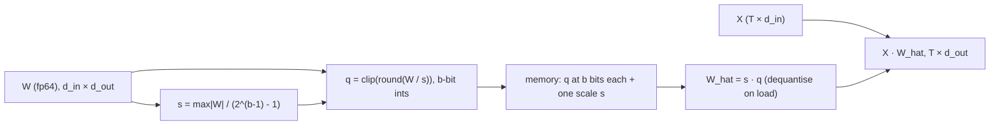

# Lesson 26: Quantization and Fixed-Point Inference

Every parameter of the model you trained in [[23-putting-it-all-together]] is a 64-bit float. A 70-billion-parameter model stored the same way at fp16 occupies 140 GB, and during generation every one of those bytes is read from memory once per emitted token — so the number of **bits per weight** is a throughput and memory knob as real as $d_{\text{model}}$. This lesson re-trains the capstone model, quantises its weights to $b \in \{2, \dots, 8\}$ bits with rustlab's integer and fixed-point types, and measures what each bit costs: in signal-to-noise ratio per tensor, in perplexity, and in the KL divergence of the next-token distribution. Read together, those measurements are the **rate–distortion curve** of a language model — the last row of the toolkit table in [[00-the-llm-as-a-system]].

## Learning Objectives

- Implement symmetric uniform quantisation of a weight tensor — scale, round, clip, dequantise — with per-tensor and per-row scales, and read it as a Q-format whose step is tuned to the data.
- Predict the SNR of a quantised tensor from the **additive uniform-noise model** ($\Delta^2/12$, 6.02 dB per bit, minus a crest-factor penalty) and measure where the model holds and where it breaks.
- Measure the **rate–distortion curve** of the capstone model: perplexity and $\mathrm{KL}(p \,\|\, p_q)$ versus bits per weight, and locate its knee.
- Explain why activations are harder to quantise than weights, why saturation beats wraparound, and how a quantisation-aware training loop differs from post-training quantisation.
- Compute the KV-cache memory and the bandwidth-bound decode rate of a 70B model at 16, 8 and 4 bits.

## Background

The trained model, its 32-token BPE corpus and its 300 parameters from [[23-putting-it-all-together]]; perplexity and cross-entropy in nats and bits from [[20-perplexity-and-evaluation]]; KL divergence from [[03-cross-entropy-loss]]; the KV cache from [[21-sampling-and-generation]] and GQA from [[24-modern-architectural-variants]]. From engineering: the uniform quantiser of an ADC, two's-complement integers, and Q-format fixed-point notation. Loss is computed in nats and reported in bits ($\div \ln 2$) where labelled.

<!-- hide -->
```rustlab
run "../lib/transformer.rlab"
run "../lib/info.rlab"

% Lesson 23's BPE output: "the cat sat on the mat " x 4 -> 8 tokens per phrase, vocab 18.
tokens = repmat([17, 12, 9, 12, 8, 16, 18, 12], 1, 4);
vocab = 18;
T = length(tokens);

% The capstone recipe, verbatim: seed 22, 600 AdamW steps, warmup + cosine.
seed(22);
d_model = 4;
d_ff = 8;
T_max = T + 16;
E = randn(vocab, d_model) * 0.3;
PE = sinusoidal_pe(T_max, d_model);
gamma1 = ones(d_model);   beta1 = zeros(d_model);
gamma2 = ones(d_model);   beta2 = zeros(d_model);
Wq = randn(d_model, d_model) * 0.3;
Wk = randn(d_model, d_model) * 0.3;
Wv = randn(d_model, d_model) * 0.3;
Wo = randn(d_model, d_model) * 0.3;
W1 = randn(d_model, d_ff) * 0.3;  b1f = zeros(d_ff);
W2 = randn(d_ff, d_model) * 0.3;  b2f = zeros(d_model);
W_U = randn(d_model, vocab) * 0.3;
P = struct("E", E, "PE", PE, "gamma1", gamma1, "beta1", beta1, "gamma2", gamma2, "beta2", beta2, ...
           "Wq", Wq, "Wk", Wk, "Wv", Wv, "Wo", Wo, "W1", W1, "b1f", b1f, "W2", W2, "b2f", b2f, "W_U", W_U);
n_params = vocab * d_model + 4 * d_model + 4 * d_model * d_model + 2 * d_model * d_ff + d_ff + d_model + d_model * vocab;
mask_train = ones(T - 1);
n_train = 600;  T_w = 60;  eta_max = 0.05;  eta_min = 0.005;
bet1 = 0.9;  bet2 = 0.999;  eps_a = 1e-8;
[M, V] = adamw_init(P);
for step = 1:n_train
  eta_t = warmup_cosine(step, n_train, T_w, eta_max, eta_min);
  [lo, L, cache] = transformer_forward(tokens, mask_train, P);
  dl = ce_dlogits(tokens, mask_train, lo, cache.total);
  G = transformer_backward(tokens, dl, cache, P);
  [P, M, V] = adamw_step(P, G, M, V, eta_t, step, bet1, bet2, eps_a, 0.0);
end

% The k-th of the eight weight matrices, in a fixed order (rustlab has no struct-field indexing).
function W = mat_k(P, k)
  if k == 1;      W = P.E;   elseif k == 2;  W = P.Wq;  elseif k == 3;  W = P.Wk;  elseif k == 4;  W = P.Wv;
  elseif k == 5;  W = P.Wo;  elseif k == 6;  W = P.W1;  elseif k == 7;  W = P.W2;  else;           W = P.W_U;  end
end
```

## The Model Under Test

### Theory

The capstone's single-block transformer has 300 parameters: 272 of them sit in eight weight matrices — $\mathbf{E}$ ($18 \times 4$), $\mathbf{W}_Q, \mathbf{W}_K, \mathbf{W}_V, \mathbf{W}_O$ ($4 \times 4$), $\mathbf{W}_1$ ($4 \times 8$), $\mathbf{W}_2$ ($8 \times 4$), $\mathbf{W}_U$ ($4 \times 18$) — and the remaining 28 are LayerNorm affines and FFN biases. Those eight matrices are what gets quantised in this lesson; the 28 vectors stay in full precision, as they do in every production quantiser (in a real model they are well under 0.1 % of the parameters). The hidden setup block above reproduces the capstone's training run exactly — same seed, same 600 AdamW steps — so the weights below are the weights Lesson 23 ended with.

### Example — Reproduce the capstone

```rustlab
[lo_fp, L_fp, cache_fp] = transformer_forward(tokens, mask_train, P);
print("re-trained capstone: params =", n_params, "  L =", L_fp, "  PPL =", exp(L_fp));
n_q = 0;
ranges = zeros(8);
for k = 1:8
  W = mat_k(P, k);
  n_q = n_q + numel(W);
  ranges(k) = max(max(abs(W)));
end
print("quantised parameters:", n_q, "  max|W| per matrix:", ranges);
```

$\mathcal{L} = ${L_fp * 1e5:%.2f} \times 10^{-5}$ nats and $\mathrm{PPL} = ${exp(L_fp):%.5f}$ — the capstone's numbers. The weights started at $\mathcal{N}(0, 0.3^2)$ and training stretched them to ranges between ${min(ranges):%.2f}$ and ${max(ranges):%.2f}$; that spread is the first thing a quantiser has to cope with.

## Why Quantise

### Theory

Two costs scale with bits per weight. **Memory:** a model of $N$ parameters at $b$ bits occupies $N b / 8$ bytes — 140 GB for $N = 7 \times 10^{10}$ at fp16, more than most single accelerators hold. **Bandwidth:** autoregressive decode does one matrix–vector product per layer per token, so every weight is read from memory exactly once per generated token and almost no arithmetic is done on it. The token rate is therefore bounded by

$$\text{tok/s} \;\le\; \frac{\text{memory bandwidth}}{\text{bytes read per token}} = \frac{B}{N b / 8 + \text{KV-cache bytes}},$$

an **Exact** upper bound (arithmetic is assumed free). [[24-modern-architectural-variants]] applies the same bound to the KV cache to motivate GQA; here the weight term dominates. Halving $b$ doubles the bound — which is why bits per weight is a design parameter, not an implementation detail.

### Example — The byte budget of a 70B model

```rustlab
N_llm = 70e9;                    % parameters
BW = 3.35e12;                    % bytes/s — one H100 SXM (HBM3)
w_bits = [16, 8, 4];
w_GB = N_llm * w_bits / 8 / 1e9;
tok_bound = BW ./ (w_GB * 1e9);
print("bits per weight:", w_bits);
print("weights (GB):   ", w_GB);
print("tok/s bound:    ", tok_bound);
```

At fp16 the weights alone cap decode at ${tok_bound(1):%.1f}$ tokens per second on one device; int4 lifts the same bound to ${tok_bound(3):%.1f}$. Whether the quality survives the trip from 16 bits to 4 is the question the rest of the lesson measures.

## Uniform Quantisation of a Tensor

### Theory

A **symmetric uniform quantiser** with $b$ bits maps a real tensor $\mathbf{W}$ to integers $\mathbf{q}$ in $[-q_{\max}, q_{\max}]$, $q_{\max} = 2^{b-1} - 1$, through one real scale $s$:

$$s = \frac{\max \lvert \mathbf{W} \rvert}{q_{\max}}, \qquad \mathbf{q} = \operatorname{clip}\!\left(\operatorname{round}(\mathbf{W} / s),\, -q_{\max},\, q_{\max}\right), \qquad \hat{\mathbf{W}} = s\,\mathbf{q}.$$

The step $\Delta = s$ is the resolution; $\hat{\mathbf{W}}$ is the **dequantised** tensor that the forward pass actually multiplies with. Memory holds $\mathbf{q}$ at $b$ bits per entry plus the scale; the matmul reads $\mathbf{q}$, multiplies by $s$, and proceeds as before — nothing else in the model changes.



Choosing $s$ from $\max\lvert\mathbf{W}\rvert$ guarantees nothing saturates, at the price that one outlier sets the step for the whole tensor. The remedy is **finer scale granularity**: a scale per row of $\mathbf{W}$ (for $\mathbf{E}$ a row is one token's embedding; for a projection it is one input channel) so that a small-range row keeps a small step. The cost is one extra float per row.

Fixed-point arithmetic is the special case $s = 2^{-f}$: a Q-format with $f$ fractional bits. rustlab's `qfmt(word, frac)` and `quantize` implement exactly that grid, `int8(x)` rounds half away from zero and **saturates** by default, and `snr(x, x_q)` returns $10 \log_{10}$ of signal power over error power in dB.

### Example — int8 and the Q-format view of the LM head

```rustlab
W = P.W_U;
n_WU = numel(W);
s = max(max(abs(W))) / 127;
q = int8(W / s);                                    % rounds half away from zero, saturates at +-127
W_hat = double(q) * s;
print("max|W_U| =", max(max(abs(W))), "  step s =", s, "  class(q) =", class(q));
print("W_U(1, 1:6) =", W(1, 1:6));
print("q(1, 1:6)   =", q(1, 1:6));
print("entries at +-127:", sum(sum(abs(double(q)) == 127)), "   int8 SNR (dB):", snr(reshape(W, 1, n_WU), reshape(W_hat, 1, n_WU)));
fmt_07 = qfmt(8, 7, "round", "saturate");           % eight bits, seven fractional: range [-1, 1)
fmt_16 = qfmt(8, 6, "round", "saturate");           % one integer bit: range [-2, 2), step 2^-6
snr_07 = snr(reshape(W, 1, n_WU), reshape(quantize(W, fmt_07), 1, n_WU));
snr_16 = snr(reshape(W, 1, n_WU), reshape(quantize(W, fmt_16), 1, n_WU));
print(fmt_07, " saturated entries:", sum(sum(abs(W) >= 1)), "  SNR", snr_07, "dB");
print(fmt_16, " saturated entries:", sum(sum(abs(W) >= 2)), "  SNR", snr_16, "dB   (step", 2 ^ -6, ")");
```

The step is $s = ${s:%.4f}$; the entry $W_U(1,1) = ${W(1,1):%.4f}$ becomes the integer ${double(q(1,1)):%.0f}$ and dequantises to ${double(q(1,1)) * s:%.4f}$ — an error of ${abs(W(1,1) - double(q(1,1)) * s):%.5f}$, less than half a step. Exactly one entry (the maximum) sits at the rail. The fixed-point view makes the trade-off explicit. `qfmt(8, 7)` — rustlab prints it Q0.7; texts that count the sign bit call it Q1.7 — cannot represent ${ranges(8):%.2f}$, so ${sum(sum(abs(W) >= 1))}$ entries saturate and the SNR collapses to ${snr_07:%.1f}$ dB. Giving up one fractional bit (Q1.6) fits the range and recovers ${snr_16:%.1f}$ dB. The per-tensor scale above does better still (step ${s:%.4f}$ instead of $2^{-6} = 0.0156$) because it uses all 127 codes for the actual range rather than the next power of two — a per-tensor scale *is* a Q-format whose step is tuned to the data, which is the entire difference between classical fixed-point DSP and "integer quantisation" in machine learning.

### Example — Per-tensor versus per-row scales

The general quantiser for any $b$, and its per-row variant. `snr_mat` flattens a matrix because `snr` takes vectors.

```rustlab
function [Wq, s] = quant_tensor(W, b)
  q_max = 2 ^ (b - 1) - 1;
  s = max(max(abs(W))) / q_max;
  q = min(max(round(W / s), -q_max), q_max);
  Wq = q * s;
end
function [Wq, s] = quant_rows(W, b)
  q_max = 2 ^ (b - 1) - 1;
  s = max(abs(W), [], 2) / q_max;                % one scale per row (a column vector)
  q = min(max(round(W ./ s), -q_max), q_max);
  Wq = q .* s;
end
function d = snr_mat(W, Wq)
  n = numel(W);
  d = snr(reshape(W, 1, n), reshape(Wq, 1, n));
end

b_demo = 4;
snr_t4 = zeros(8);  snr_r4 = zeros(8);
for k = 1:8
  W = mat_k(P, k);
  [Wt, st] = quant_tensor(W, b_demo);  snr_t4(k) = snr_mat(W, Wt);
  [Wr, sr] = quant_rows(W, b_demo);    snr_r4(k) = snr_mat(W, Wr);
end
row_max_E = max(abs(P.E), [], 2);
print("4-bit SNR per-tensor (dB):", snr_t4);
print("4-bit SNR per-row    (dB):", snr_r4);
figure();
subplot(1, 2, 1)
bar(1:vocab, row_max_E')
title("Row ranges of E: max |E(i, :)| per token")
xlabel("token id i"); ylabel("max |E(i, :)|")
subplot(1, 2, 2)
bar(1:8, [snr_t4', snr_r4'])
legend("per-tensor", "per-row")
ylim([0, 30])
title("4-bit SNR per weight matrix (1 = E, 2-5 = Wq Wk Wv Wo, 6-7 = W1 W2, 8 = W_U)")
xlabel("matrix index"); ylabel("SNR (dB)")
```

> [!TIP]
> Left: the rows of $\mathbf{E}$ span ranges from ${min(row_max_E):%.2f}$ to ${max(row_max_E):%.2f}$, so a single step sized for the largest row wastes most of its codes on the small ones. Right: per-row scales lift every matrix, most for $\mathbf{E}$ (${snr_t4(1):%.1f}$ → ${snr_r4(1):%.1f}$ dB, more than one bit's worth) and least for $\mathbf{W}_1$, whose four rows already share a range (mean gain over the eight matrices ${mean(snr_r4 - snr_t4):%.1f}$ dB).

## Quantisation Noise

### Theory

Write the quantised tensor as signal plus error, $\hat{\mathbf{W}} = \mathbf{W} + \mathbf{e}$. When the step $\Delta$ is small compared with the spread of the data, the rounding error is well modelled as **independent of the signal and uniform on $[-\Delta/2, \Delta/2]$**, with zero mean and variance

$$\sigma_e^2 = \frac{1}{\Delta}\int_{-\Delta/2}^{\Delta/2} e^2 \, de = \frac{\Delta^2}{12}.$$

With $\Delta = \max\lvert\mathbf{W}\rvert / (2^{b-1} - 1) \approx 2^{1-b} \max\lvert\mathbf{W}\rvert$ and signal power $P_W = \operatorname{mean}(W_{ij}^2)$,

$$\mathrm{SNR}_{\text{dB}} = 10\log_{10}\frac{P_W}{\Delta^2 / 12} \approx 6.02\,b + 4.77 - 20\log_{10} c, \qquad c = \frac{\max\lvert\mathbf{W}\rvert}{\sqrt{P_W}},$$

where $c$ is the **crest factor**. Every extra bit halves $\Delta$ and buys 6.02 dB — the ADC rule, **Exact** under the uniform-noise model — and a heavy-tailed tensor (large $c$) pays a fixed penalty at every $b$: the outlier sets the step, the bulk of the entries sit far below full scale. The model breaks at small $b$, where the error is no longer independent of the signal (at $b = 2$ the three codes $\{-1, 0, 1\}$ carry almost none of the data), and it slightly under-predicts the slope because $2^{b-1} - 1$ shrinks the step a little faster than $2\times$ per bit at low $b$.

### Example — SNR versus bits for every weight matrix

```rustlab
bits = 2:8;
n_b = length(bits);
SNR_t = zeros(n_b, 8);
SNR_r = zeros(n_b, 8);
for i = 1:n_b
  for k = 1:8
    W = mat_k(P, k);
    [Wt, st] = quant_tensor(W, bits(i));  SNR_t(i, k) = snr_mat(W, Wt);
    [Wr, sr] = quant_rows(W, bits(i));    SNR_r(i, k) = snr_mat(W, Wr);
  end
end
crest_E = max(max(abs(P.E))) / sqrt(mean(mean(P.E .^ 2)));
model_E = 6.02 * bits + 4.77 - 20 * log10(crest_E);
b_fine = linspace(2, 8, 61);                                   % fine grid so the dashed model line draws cleanly
gain_per_bit = SNR_t(2:n_b, :) - SNR_t(1:(n_b - 1), :);        % dB gained by each added bit
mean_gain = zeros(n_b - 1);
for i = 1:(n_b - 1)
  mean_gain(i) = mean(gain_per_bit(i, :));
end
print("crest factor of E:", crest_E, "  model intercept (dB):", 4.77 - 20 * log10(crest_E));
print("E: measured SNR", reshape(SNR_t(:, 1), 1, n_b), "  model", model_E);
print("mean dB per added bit (3..8):", mean_gain);
figure();
subplot(1, 2, 1)
hold("on")
for k = 1:8
  plot(bits, SNR_t(:, k)', "color", "gray")
end
plot(bits, SNR_t(:, 1)', "color", "blue", "label", "E measured")
plot(b_fine, 6.02 * b_fine + 4.77 - 20 * log10(crest_E), "color", "red", "style", "dashed", "label", "E model: 6.02 b + 4.77 - 20 log10(c)")
hold("off")
title("Per-tensor SNR vs bits (gray: the other seven matrices)")
xlabel("bits per weight b"); ylabel("SNR (dB)")
subplot(1, 2, 2)
plot(bits(2:n_b), mean_gain, "color", "purple", "label", "mean over 8 matrices")
hold("on")
yline(6.02, "red", "6.02 dB per bit")
hold("off")
title("dB gained by the b-th bit")
xlabel("bits per weight b"); ylabel("SNR(b) - SNR(b-1)  (dB)")
```

> [!TIP]
> Left: from 4 bits up, every matrix runs parallel to the dashed line; at 2–3 bits the measured curves fall below it — the uniform-noise model has broken. Right: the increment per bit settles near 6.02 dB — slightly above on average (${mean(mean_gain(3:6)):%.2f}$ dB over bits 5–8, the $2^{b-1}-1$ effect), with the scatter you expect from 16–72 samples per matrix.

## Rate–Distortion for a Language Model

### Theory

SNR measures distortion in the weights; what matters is distortion in the **output**. Run the quantised model — dequantised $\hat{\mathbf{W}}$ in the unchanged `transformer_forward` — on the corpus and measure two things against the fp64 model: the loss (or perplexity), and the KL divergence between the two next-token distributions averaged over positions,

$$D(b) = \frac{1}{T}\sum_{t=1}^{T} \mathrm{KL}\!\left(p_t \,\|\, p^{(b)}_t\right) \quad \text{bits}, \qquad p_t = \operatorname{softmax}(\mathbf{z}_t), \; p^{(b)}_t = \operatorname{softmax}(\hat{\mathbf{z}}_t).$$

KL is the right distortion for a language model because it compares the quantised model with the *model*, not with the data — on a real corpus a quantised model can match the fp perplexity to three digits while assigning visibly different probabilities. (On this memorised corpus $p_t$ is essentially one-hot, so $D(b)$ nearly equals the quantised loss in bits; the two diverge on any corpus with real entropy.) The **rate** is bits per weight; the total is $272\,b$ bits for the eight matrices plus the scales. Plotting distortion against rate gives the rate–distortion curve, and its **knee** — the smallest $b$ beyond which distortion stops falling meaningfully — is the operating point a deployment picks.

### Example — Perplexity and KL versus bits per weight

`quant_params` applies one quantiser to all eight matrices (a hidden helper — one assignment per matrix, because rustlab cannot loop over struct fields), and `mean_kl` averages `kl_bits` over positions.

<!-- hide -->
```rustlab
function Wq = quant_any(W, b, per_row)
  if per_row > 0
    [Wq, s] = quant_rows(W, b);
  else
    [Wq, s] = quant_tensor(W, b);
  end
end
function Pq = quant_params(P, b, per_row)
  Pq = P;
  Pq.E   = quant_any(P.E, b, per_row);
  Pq.Wq  = quant_any(P.Wq, b, per_row);
  Pq.Wk  = quant_any(P.Wk, b, per_row);
  Pq.Wv  = quant_any(P.Wv, b, per_row);
  Pq.Wo  = quant_any(P.Wo, b, per_row);
  Pq.W1  = quant_any(P.W1, b, per_row);
  Pq.W2  = quant_any(P.W2, b, per_row);
  Pq.W_U = quant_any(P.W_U, b, per_row);
end
function D = mean_kl(lo_ref, lo_q, T)
  D = 0.0;
  for t = 1:T
    D = D + kl_bits(softmax(lo_ref(t, :)), softmax(lo_q(t, :)));
  end
  D = D / T;
end
```

```rustlab
L_t = zeros(n_b);  L_r = zeros(n_b);  KL_t = zeros(n_b);  KL_r = zeros(n_b);
for i = 1:n_b
  Pq = quant_params(P, bits(i), 0);
  [lo_q, L_q, c] = transformer_forward(tokens, mask_train, Pq);
  L_t(i) = L_q;  KL_t(i) = mean_kl(lo_fp, lo_q, T);
  Pq = quant_params(P, bits(i), 1);
  [lo_q, L_q, c] = transformer_forward(tokens, mask_train, Pq);
  L_r(i) = L_q;  KL_r(i) = mean_kl(lo_fp, lo_q, T);
  print(sprintf("%d bits  PPL per-tensor %11.5f  per-row %9.5f   KL(bits) per-tensor %9.2e  per-row %9.2e", bits(i), exp(L_t(i)), exp(L_r(i)), KL_t(i), KL_r(i)));
end
PPL_t = exp(L_t);  PPL_r = exp(L_r);
figure();
subplot(1, 2, 1)
semilogy(bits, PPL_t, "color", "blue", "label", "per-tensor")
hold("on")
semilogy(bits, PPL_r, "color", "red", "label", "per-row")
yline(exp(L_fp), "gray", "fp64 model")
hold("off")
title("Perplexity vs bits per weight")
xlabel("bits per weight b"); ylabel("PPL (log scale)")
subplot(1, 2, 2)
semilogy(bits, KL_t, "color", "blue", "label", "per-tensor")
hold("on")
semilogy(bits, KL_r, "color", "red", "label", "per-row")
hold("off")
title("Mean KL(p || p_q) vs bits per weight")
xlabel("bits per weight b"); ylabel("KL (bits, log scale)")
```

> [!TIP]
> Both panels fall steeply through the knee — KL by one to two orders of magnitude per bit between 4 and 6 bits — and then flatten onto the fp64 floor. Per-row scales shift the whole curve about one bit to the left.

The knee is sharp. With per-tensor scales the model is unusable at 4 bits ($\mathrm{PPL} = ${PPL_t(3):%.2f}$, $D = ${KL_t(3):%.2f}$ bits per token), marginal at 5 ($\mathrm{PPL} = ${PPL_t(4):%.3f}$), and indistinguishable from fp64 at 6 ($\mathrm{PPL} = ${PPL_t(5):%.5f}$, $D = ${KL_t(5) * 1e4:%.1f} \times 10^{-4}$ bits). Per-row scales buy that bit back: 4 bits already give $\mathrm{PPL} = ${PPL_r(3):%.3f}$ and 5 bits $\mathrm{PPL} = ${PPL_r(4):%.4f}$. In rate terms, the eight matrices cost $272 b$ bits — ${272 * 5}$ bits at the per-tensor knee ($b = 5$), ${272 * 4}$ at the per-row knee ($b = 4$) — against the ${T * log2(vocab):%.0f}$ bits ($32 \times \log_2 18$) it takes to write the corpus down verbatim. The model does not pay for itself on 32 tokens at any bit width; the *Information* lens below turns that into a two-part code length.

## Weights vs Activations

### Theory

Weights are quantised once, offline, with a scale chosen from the whole tensor. Activations are produced at run time, token by token, and their statistics are worse in two ways. First, **outlier channels**: a few feature columns of the residual stream carry values many times larger than the rest, so a per-tensor scale sized for the outlier crushes the resolution of every other channel. Second, **range varies per token**, so a static scale is either too coarse for quiet tokens or saturates loud ones. The fixes mirror the weight case — a scale per token (per row of $\mathbf{H}$) chosen dynamically, or per channel with the outlier channels scaled into the weights (the SmoothQuant idea) — and the distortion that matters is again the KL of the softmax, now with the **logits** themselves on a $b$-bit grid.

### Example — Quantising the residual stream and the logits

```rustlab
H = cache_fp.H_out;                      % residual stream entering the LM head, T x d_model
ch_max = zeros(d_model);
for j = 1:d_model
  ch_max(j) = max(abs(H(:, j)));
end
tok_max = max(abs(H), [], 2);
print("channel max|h|:", ch_max, "   per-token max|h| from", min(tok_max), "to", max(tok_max));
SNR_H = zeros(n_b, 2);
for i = 1:n_b
  [Hq, sq] = quant_tensor(H, bits(i));   SNR_H(i, 1) = snr_mat(H, Hq);
  [Hr, sr] = quant_rows(H, bits(i));     SNR_H(i, 2) = snr_mat(H, Hr);
end
print("H_out SNR at 8 bits: per-tensor", SNR_H(7, 1), " per-token", SNR_H(7, 2), "   at 4 bits:", SNR_H(3, 1), SNR_H(3, 2));
[lq4, s4] = quant_tensor(lo_fp, 4);                     % 4-bit logits
KL_logits4 = mean_kl(lo_fp, lq4, T);
Pq = P;  Pq.W_U = quant_any(P.W_U, 4, 0);               % 4-bit W_U, everything else fp64
[lo_q, L_q, c] = transformer_forward(tokens, mask_train, Pq);
KL_WU4 = mean_kl(lo_fp, lo_q, T);
print("KL at 4 bits — W_U only:", KL_WU4, "bits   logits:", KL_logits4, "bits   max|logit| =", max(max(abs(lo_fp))));
figure();
subplot(1, 2, 1)
bar(1:d_model, ch_max)
ylim([0, 1.1 * max(ch_max)])
title("Residual-stream channel ranges (H_out)")
xlabel("channel j"); ylabel("max |H(:, j)|")
subplot(1, 2, 2)
plot(bits, SNR_H(:, 1)', "color", "blue", "label", "per-tensor scale")
hold("on")
plot(bits, SNR_H(:, 2)', "color", "red", "label", "per-token scale")
hold("off")
title("SNR of the quantised residual stream")
xlabel("bits per activation"); ylabel("SNR (dB)")
```

> [!TIP]
> Left: channel 1 peaks at ${ch_max(1):%.1f}$ against ${ch_max(2):%.1f}$–${ch_max(3):%.1f}$ for the others — one outlier channel sets the step for all four. Right: per-token scaling recovers about ${SNR_H(3, 2) - SNR_H(3, 1):%.0f}$ dB at 4 bits.

The KL line is the point. Quantising the $4 \times 18$ LM head to 4 bits costs $\mathrm{KL} = ${KL_WU4 * 1e4:%.1f} \times 10^{-4}$ bits per token; quantising the logits it produces to the same 4 bits costs ${KL_logits4:%.2f}$ bits — a few hundred times more — because the logits span $\pm ${max(max(abs(lo_fp))):%.0f}$ with a handful of extreme entries, and a 4-bit step of that range is coarser than the gaps that decide the softmax. This is why "W4A16" (4-bit weights, 16-bit activations) is a common deployment point and "W4A4" is a research topic.

## Saturate vs Wrap

### Theory

An integer cast has to do *something* with a value outside its range. **Saturation** clips to the nearest rail; **wraparound** (two's-complement overflow) keeps the low bits and discards the carry, so 128 becomes $-128$ and 200 becomes $-56$. For a weight, saturation produces the closest representable value and a bounded error; wraparound flips the sign of the largest weights — precisely the ones that matter most — and the error is unbounded. Hardware wraps because it is free; a quantiser must saturate, and the demonstration below is the reason. The scenario is a stale calibration: a scale chosen when $\lvert \mathbf{W}_U \rvert \le 0.3$ (the initialisation), applied after training stretched the range to ${ranges(8):%.2f}$.

### Example — A stale scale under both overflow rules

```rustlab
W = P.W_U;
s_stale = 0.3 / 127;                                    % calibrated for |W| <= 0.3
q_sat  = int8(W / s_stale);                             % default: saturate
q_wrap = int8(W / s_stale, "wrap");                     % two's-complement overflow
print("overflowing entries:", sum(sum(abs(W / s_stale) > 127)), "of", numel(W));
print("W_U(1,1) =", W(1, 1), " -> W/s =", W(1, 1) / s_stale, "  saturate ->", q_sat(1, 1), "  wrap ->", q_wrap(1, 1));
snr_sat  = snr_mat(W, double(q_sat) * s_stale);
snr_wrap = snr_mat(W, double(q_wrap) * s_stale);
Pq = P;  Pq.W_U = double(q_sat) * s_stale;
[lo_q, L_sat, c] = transformer_forward(tokens, mask_train, Pq);
Pq = P;  Pq.W_U = double(q_wrap) * s_stale;
[lo_q, L_wrap, c] = transformer_forward(tokens, mask_train, Pq);
print("saturate: SNR", snr_sat, "dB  PPL", exp(L_sat), "     wrap: SNR", snr_wrap, "dB  PPL", exp(L_wrap));
```

${sum(sum(abs(W / s_stale) > 127))}$ of the 72 entries overflow. Saturating them costs a lot — SNR ${snr_sat:%.1f}$ dB, $\mathrm{PPL} = ${exp(L_sat):%.2f}$ — but the model still ranks tokens sensibly. Wrapping turns $W_U(1,1) = ${W(1,1):%.3f}$ into the integer ${double(q_wrap(1,1)):%.0f}$, a sign flip; the SNR goes *negative* (${snr_wrap:%.1f}$ dB: the error is larger than the signal) and perplexity explodes to $\mathrm{PPL} \approx ${exp(L_wrap) / 1e8:%.1f} \times 10^{8}$. Overflow should never be silent.

## KV-Cache Memory

### Theory

During generation the KV cache ([[21-sampling-and-generation]]) stores one key and one value vector per layer, per KV head, per past token. With $N_{\text{layers}}$ layers, $H_{\text{kv}}$ key/value heads of width $d_{\text{head}}$, and $b$ bits per element,

$$\text{bytes per token} = 2 \cdot N_{\text{layers}} \cdot H_{\text{kv}} \cdot d_{\text{head}} \cdot \frac{b}{8}, \qquad \text{cache} = T \times \text{bytes per token}.$$

GQA ([[24-modern-architectural-variants]]) shrinks $H_{\text{kv}}$; quantisation shrinks $b$; the two multiply. The cache is also read once per decoded token, so it joins the weights in the denominator of the bandwidth bound — **Exact** as an upper bound on tokens per second.

### Example — LLaMA-2-70B at 16, 8 and 4 bits

```rustlab
N_layers = 80;  H_kv = 8;  d_head = 128;                % LLaMA-2-70B (GQA)
T_ctx = 8192;
kv_bits = [16, 8, 4];
bytes_tok = 2 * N_layers * H_kv * d_head * kv_bits / 8;
cache_GB = bytes_tok * T_ctx / 1e9;
tok_both = BW ./ ((w_GB + cache_GB) * 1e9);             % weights and cache at the same width
print("bits:                 ", kv_bits);
print("KiB per token:        ", bytes_tok / 1024);
print("cache at T = 8192 (GB):", cache_GB);
print("weights (GB):         ", w_GB);
print("tok/s bound (both):   ", tok_both);
T_sweep = (1:32) * 4096;
figure();
subplot(1, 2, 1)
hold("on")
plot(T_sweep / 1024, bytes_tok(1) * T_sweep / 1e9, "color", "blue", "label", "16-bit cache")
plot(T_sweep / 1024, bytes_tok(2) * T_sweep / 1e9, "color", "red", "label", "8-bit cache")
plot(T_sweep / 1024, bytes_tok(3) * T_sweep / 1e9, "color", "green", "label", "4-bit cache")
yline(80, "gray", "one 80 GB device")
hold("off")
title("LLaMA-2-70B KV cache vs context length")
xlabel("context length (k tokens)"); ylabel("GB")
subplot(1, 2, 2)
bar({"16-bit", "8-bit", "4-bit"}, tok_both)
legend("tok/s upper bound")
ylim([0, 100])
title("Bandwidth-bound decode rate (weights + cache)")
xlabel("bits per weight and per cache element"); ylabel("tok/s upper bound")
```

> [!TIP]
> Left: at 8k tokens the cache is ${cache_GB(1):%.2f}$ GB at fp16 (the 2.5 GiB of [24-modern-architectural-variants](24-modern-architectural-variants.md)) — small next to 140 GB of weights — but it grows linearly and reaches ${bytes_tok(1) * 131072 / 1e9:%.0f}$ GB at 128k tokens. Right: because both terms halve together, each halving of $b$ doubles the decode bound: ${tok_both(1):%.0f}$ → ${tok_both(2):%.0f}$ → ${tok_both(3):%.0f}$ tok/s.

## Engineering Lenses

### Signals

**Exact.** Quantisation is an additive noise source: $\hat{\mathbf{W}} = \mathbf{W} + \mathbf{e}$ with $\mathbf{e}$ uniform on $\pm\Delta/2$, variance $\Delta^2/12$, and 6.02 dB of SNR per bit — the same statement, with the same derivation, as the quantisation noise of an ADC; the weight tensor plays the role of the sampled waveform and $\max\lvert\mathbf{W}\rvert$ that of the full-scale range. The pooled errors of all 272 quantised weights, normalised by their steps, test the model directly. The second computation is the rounding-mode corollary: `qfmt`'s default mode is `floor` (truncation), whose error is uniform on $[0, \Delta)$ with mean square $\Delta^2/3$ — exactly 6.02 dB worse than rounding to nearest. It uses $\mathcal{N}(0, 0.3^2)$ samples in Q1.6, the format that holds their range; in Q0.7 the few samples beyond $\pm 1$ clip, and clipping error — outside the uniform-noise model — then dominates the SNR (which is why quoted Q0.7 figures for this signal vary by several dB with the seed).

```rustlab
b_sig = 4;
e_pool = [];
for k = 1:8
  W = mat_k(P, k);
  [Wt, st] = quant_tensor(W, b_sig);
  e_pool = [e_pool, reshape(W - Wt, 1, numel(W)) / st];     % error in units of the step
end
print("4-bit errors e/Delta over", length(e_pool), "weights: mean", mean(e_pool), "  12 var", 12 * mean(e_pool .^ 2), "  max|e|/Delta", max(abs(e_pool)));
seed(26);
x = randn(10000) * 0.3;                                   % Gaussian "weights", max |x| ~ 1.4 < 2
snr_round = snr(x, quantize(x, qfmt(8, 6, "round", "saturate")));
snr_floor = snr(x, quantize(x, qfmt(8, 6)));              % default: floor rounding
snr_model = 10 * log10(0.09 / ((2 ^ -6) ^ 2 / 12));
print("N(0, 0.3^2) in Q1.6:  round-to-nearest", snr_round, "dB (model", snr_model, ")   truncate", snr_floor, "dB   difference", snr_round - snr_floor, "dB");
figure();
histogram(e_pool, 12);
title("Normalised quantisation error e / Delta of the 272 weights at 4 bits")
xlabel("e / Delta"); ylabel("count")
```

> [!TIP]
> Flat between $-0.5$ and $0.5$ with $12\,\sigma^2 = ${12 * mean(e_pool .^ 2):%.2f}$ — the uniform-noise model holds already at 4 bits. The truncation penalty is ${snr_round - snr_floor:%.2f}$ dB, the predicted $10\log_{10} 4$.

### Systems

**Model.** Post-training quantisation, as done above, is open-loop: the quantiser is applied after the training loop closed. **Quantisation-aware training** puts the quantiser *inside* the loop — the forward pass sees $\hat{\mathbf{W}} = s\,\operatorname{round}(\mathbf{W}/s)$, the backward pass treats the rounding as the identity (the **straight-through estimator**, since $\partial \operatorname{round}/\partial W$ is zero almost everywhere), and the optimiser updates a full-precision master copy of $\mathbf{W}$. The loop then steers the master weights toward values whose rounded versions fit the corpus, instead of hoping the rounded versions of the fp optimum do. A few lines turn the capstone trainer into that loop; it starts from the 3-bit per-tensor model, whose post-training perplexity was ${PPL_t(2):%.1f}$.

```rustlab
b_qat = 3;
Pm = P;                                                  % full-precision master copy
[Mq, Vq] = adamw_init(Pm);
Pq = quant_params(Pm, b_qat, 0);
[lo_q, L_before, c] = transformer_forward(tokens, mask_train, Pq);
for k = 1:100
  Pq = quant_params(Pm, b_qat, 0);                       % quantiser inside the forward pass
  [lo_q, L_q, cache_q] = transformer_forward(tokens, mask_train, Pq);
  dl = ce_dlogits(tokens, mask_train, lo_q, cache_q.total);
  G = transformer_backward(tokens, dl, cache_q, Pq);     % gradient at the quantised weights ...
  [Pm, Mq, Vq] = adamw_step(Pm, G, Mq, Vq, 0.002, k, bet1, bet2, eps_a, 0.0);   % ... applied to the master (STE)
end
Pq = quant_params(Pm, b_qat, 0);
[lo_q, L_after, c] = transformer_forward(tokens, mask_train, Pq);
print("3-bit per-tensor:  post-training PPL", exp(L_before), "  ->  after 100 QAT steps", exp(L_after), "   KL", mean_kl(lo_fp, lo_q, T), "bits");
```

The 3-bit model goes from $\mathrm{PPL} = ${exp(L_before):%.1f}$ to ${exp(L_after):%.3f}$ without changing the bit width — the rate stayed at $272 \times 3$ bits and the loop found a better codebook entry. The label is *Model* rather than *Exact* because the straight-through estimator is not the gradient of the quantised loss (that gradient is zero); it is a surrogate that works in practice.

### Information

**Exact.** A quantised model is a **code** for the corpus in the two-part sense of MDL ([[23-putting-it-all-together]]): first transmit the weights ($272\,b$ bits), then the corpus under the model ($T \cdot \mathcal{L}_q / \ln 2$ bits). The rate–distortion curve measured above is the trade between the two parts, and their sum is the description length to minimise.

```rustlab
bits_corpus_raw = T * log2(vocab);
code_model = n_q * bits;
code_corpus = T * L_t / log(2);
two_part = code_model + code_corpus;
for i = 1:n_b
  print(sprintf("%d bits/weight:  weights %5d + corpus %8.2f = %8.1f bits", bits(i), code_model(i), code_corpus(i), two_part(i)));
end
[best_len, best_i] = min(two_part);
print("raw corpus:", bits_corpus_raw, "bits   fp64 model:", n_q * 64, "bits   best two-part code:", best_len, "bits at b =", bits(best_i));
```

The description length is minimised at $b = ${bits(best_i)}$ (${best_len:%.0f}$ bits) — below the perplexity knee, because once the corpus term is small the weight term dominates — and every choice of $b$ exceeds the ${bits_corpus_raw:%.0f}$ bits of writing the 32 tokens down raw. That is the honest information-theoretic reading of the capstone: 300 parameters memorised 133 bits of corpus. A real language model earns its bits because the corpus term is $10^{13}$ tokens long and the weight term is not; the shape of the trade — a knee in the corpus term, a linear weight term — is the same.

## Key Takeaways

- Symmetric uniform quantisation is $s = \max\lvert\mathbf{W}\rvert / (2^{b-1}-1)$, $\mathbf{q} = \operatorname{clip}(\operatorname{round}(\mathbf{W}/s))$, $\hat{\mathbf{W}} = s\mathbf{q}$; a per-tensor scale is a Q-format whose step is tuned to the data, and per-row scales buy up to one bit (8 dB on $\mathbf{E}$, 3.5 dB averaged over the eight matrices).
- Quantisation error is additive uniform noise with variance $\Delta^2/12$: 6.02 dB per bit minus a crest-factor penalty, measured here at ${mean(mean_gain(3:6)):%.2f}$ dB per bit from 5 to 8 bits, and breaking down below 4 bits.
- The rate–distortion curve of the capstone model has its knee at 5–6 bits per weight with per-tensor scales and 4–5 with per-row scales; KL of the next-token distribution is the distortion to report.
- Activations are harder than weights: outlier channels and per-token range make 4-bit logits cost hundreds of times the KL of 4-bit weights.
- Saturate, never wrap: a stale scale under wraparound turns the largest weights into their negatives and destroys the model.
- KV-cache bytes per token are $2 N_{\text{layers}} H_{\text{kv}} d_{\text{head}}\, b / 8$; decode rate is bounded by bandwidth over bytes read per token, and halving $b$ for weights and cache together doubles it.

## Standalone Scripts

| Script | What it computes |
|---|---|
| `weight_quantization.rlab` | Re-trains the capstone model (`run "../../lib/transformer.rlab"`), int8 per-tensor quantisation of $\mathbf{W}_U$ with `int8`, the Q-format view with `qfmt`/`quantize`, per-tensor vs per-row SNR for all eight matrices at 4 and 8 bits, and the saturate-vs-wrap demonstration; figure `weight_quantization.svg`. |
| `ppl_vs_bits.rlab` | Re-trains the capstone model, sweeps $b = 2, \dots, 8$ with per-tensor and per-row scales, and reports SNR vs bits, PPL and KL vs bits, and the two-part code length; figure `ppl_vs_bits.svg`. |
| `kv_cache_memory.rlab` | LLaMA-2-70B KV-cache bytes per token and total at 16/8/4 bits, the weight budget, and the bandwidth-bound decode rate; figure `kv_cache_memory.svg`. |

Run with `make lesson-26` or `rustlab run lessons/26-quantization-and-fixed-point-inference/<script>.rlab`.

## Expected Numerical Outputs Summary

| Variable | Expected Value |
|---|---|
| `L_fp`, `exp(L_fp)` | $8.17 \times 10^{-5}$ nats, $\mathrm{PPL} = 1.00008$ (the capstone) |
| `n_q` | $272$ quantised parameters in eight matrices |
| `tok_bound` (weights only, 70B, 3.35 TB/s) | $23.9$, $47.9$, $95.7$ tok/s at 16/8/4 bits |
| `s` (int8 scale of $\mathbf{W}_U$), int8 SNR | $0.01243$; $45.9$ dB |
| `snr_07`, `snr_16` (Q0.7 with 7 saturated entries; Q1.6) | $18.6$ dB; $43.3$ dB |
| 4-bit SNR of $\mathbf{E}$, per-tensor / per-row | $18.0$ / $25.9$ dB |
| `crest_E`, mean dB per added bit (bits 5–8) | $2.88$; $6.31$ dB |
| `PPL_t` at 4 / 5 / 6 bits | $3.03$ / $1.068$ / $1.0002$ |
| `PPL_r` at 4 / 5 / 6 bits | $1.114$ / $1.0027$ / $1.00009$ |
| `KL_t` at 4 / 6 bits | $1.55$ / $2.1 \times 10^{-4}$ bits per token |
| `ch_max` (residual-stream channel ranges) | $67.9$, $26.3$, $33.2$, $24.3$ |
| `KL_WU4`, `KL_logits4` | $8.8 \times 10^{-4}$ bits; $0.237$ bits |
| `snr_sat`, `snr_wrap`; PPL under each | $4.0$ dB, $-0.7$ dB; $4.59$, $\approx 10^{9}$ |
| `bytes_tok / 1024`; `cache_GB` at $T = 8192$; `tok_both` | $320 / 160 / 80$ KiB per token; $2.68 / 1.34 / 0.67$ GB; $23.5 / 47.0 / 93.9$ tok/s |
| `12 * mean(e_pool .^ 2)` at 4 bits | $\approx 0.97$ |
| `snr_round`, `snr_floor` (Q1.6 on $\mathcal{N}(0, 0.3^2)$; model 36.5) | $36.4$ dB, $30.4$ dB — a $6.0$ dB gap |
| QAT at 3 bits, PPL before → after | $14.7 \to \approx 1.01$ |
| best two-part code | $940$ bits at $b = 3$ (raw corpus: $133$ bits) |

## Exercises

1. **Per-column scales.** `quant_rows` puts one scale per *input* channel of a projection. Write `quant_cols` with one scale per *output* column and show algebraically that $\mathbf{X}\hat{\mathbf{W}} = (\mathbf{X}\mathbf{q}) \operatorname{diag}(\mathbf{s})$ — the scales factor out of the integer accumulation, which is why deployed kernels prefer that axis. Compare SNR and PPL at 4 bits against the per-row and per-tensor curves.
2. **Derive $\Delta^2/12$ and the 6.02 dB.** Starting from an error uniformly distributed on $[-\Delta/2, \Delta/2]$, derive its variance, then show that adding one bit changes the SNR by $20\log_{10} 2$ dB. Where does the $+4.77$ dB in the SNR formula come from, and why does a Gaussian tensor with $\max\lvert W\rvert = 4\sigma$ land at $6.02\,b - 7.3$ dB?

<details><summary>Solution</summary>

For $e \sim \mathcal{U}[-\Delta/2, \Delta/2]$ the mean is zero by symmetry and the variance is $\sigma_e^2 = \frac{1}{\Delta}\int_{-\Delta/2}^{\Delta/2} e^2\,de = \frac{1}{\Delta}\left[\frac{e^3}{3}\right]_{-\Delta/2}^{\Delta/2} = \frac{1}{\Delta}\cdot\frac{2}{3}\cdot\frac{\Delta^3}{8} = \frac{\Delta^2}{12}$. With full-scale range $R = \max\lvert W\rvert$ and $2^{b-1}$ codes per side, $\Delta \approx R\,2^{1-b}$, so $\sigma_e^2 = R^2\,2^{2-2b}/12 = R^2\,2^{-2b}/3$. Adding a bit multiplies $\sigma_e^2$ by $1/4$: $10\log_{10}4 = 20\log_{10}2 = 6.02$ dB. The SNR is $10\log_{10}\!\big(P_W \cdot 3 \cdot 2^{2b}/R^2\big) = 6.02\,b + 10\log_{10}3 - 20\log_{10}(R/\sqrt{P_W}) = 6.02\,b + 4.77 - 20\log_{10}c$; the $4.77$ is the $\tfrac{1}{3}$ in $\sigma_e^2$. For a Gaussian tensor clipped at $R = 4\sigma$, $c = 4$ and $20\log_{10}4 = 12.04$, giving $6.02\,b - 7.3$ dB. (The textbook ADC figure $6.02\,b + 1.76$ dB is the same formula for a full-scale sine, whose crest factor is $\sqrt{2}$: $4.77 - 3.01 = 1.76$.)

</details>

3. **Mixed precision.** Quantise $\mathbf{E}$ and $\mathbf{W}_U$ at 8 bits and the six inner matrices at 4 bits (or the reverse) and measure PPL and KL. Which matrices are most sensitive, and does the answer agree with their crest factors? The "only $\mathbf{E}$" and "only $\mathbf{W}_U$" sweeps are two-line changes to `quant_params`.
4. **Smooth the outlier channel.** Divide column 1 of `H` by $\alpha = $ `ch_max(1) / ch_max(2)` and multiply row 1 of $\mathbf{W}_U$ by the same $\alpha$ — the product $\mathbf{H}\mathbf{W}_U$ is unchanged. Re-measure the 4-bit SNR of the smoothed $\mathbf{H}$ and the KL of the 4-bit logits. This is the SmoothQuant transformation.
5. **Where the cache overtakes the weights.** From `bytes_tok`, solve for the context length at which the KV cache equals the weight bytes, at fp16 for both and at 4 bits for both. Then redo the decode bound at 128k tokens: which term dominates, and what does GQA with $H_{\text{kv}} = 8$ versus MHA with $H_{\text{kv}} = 64$ do to it?

## What's next

This is the last lesson. The course began in [[00-the-llm-as-a-system]] with a picture — a chain of operators on a $T \times d$ signal inside two feedback loops — and three questions to ask of every box; you have now asked them of every box, from the alphabet to the bit width of the deployed weights. The real systems are within reach: [nanoGPT](https://github.com/karpathy/nanoGPT)'s `model.py` is [[14-full-gpt-architecture]] in PyTorch; [llama.cpp](https://github.com/ggerganov/llama.cpp)'s *k-quants* are the per-block scales of this lesson with 2–6 bits and a second-level scale for the scales; **GPTQ** and **AWQ** are post-training quantisers that choose the rounding and the per-channel scales to minimise the output error rather than the weight error — the KL panel of this lesson turned into an objective. Every one of them is built from the pieces in this course.
