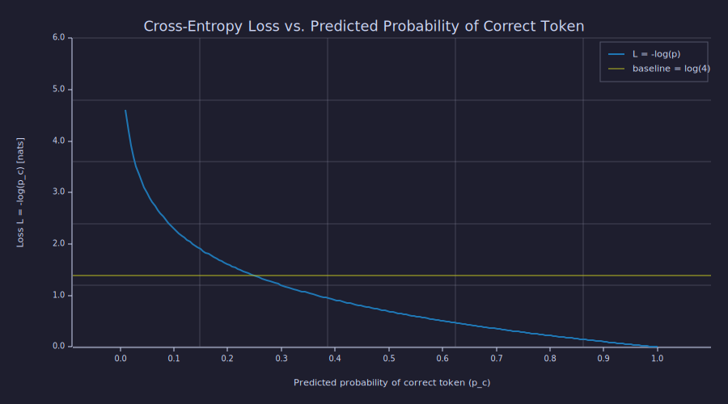
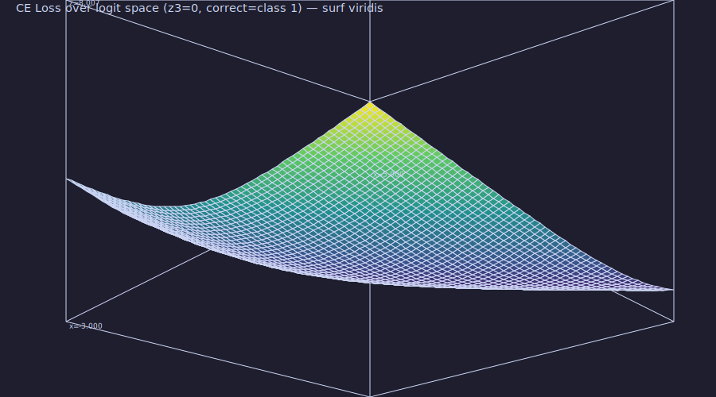

<!-- Generated by rustlab-notebook — do not edit directly. -->

# Lesson 03: Cross-Entropy Loss

The model outputs a probability distribution. The ground truth is the actual next token. We need a scalar that measures how wrong the prediction is — this scalar is the **cross-entropy loss**, and minimising it is the entire goal of training.

## Learning Objectives

- Define **cross-entropy** between a true distribution and a predicted distribution.
- Derive the simplified cross-entropy loss used in language model training.
- Explain the connection between minimising cross-entropy and **maximum likelihood estimation** (MLE).
- Interpret the shape of the cross-entropy loss curve and identify what "good" vs. "bad" predictions look like.
- Compute cross-entropy by hand for simple examples and verify against the simulation output.

## Background

Probability distributions and softmax from [Lesson 02](02-probability-and-softmax.md). Natural logarithm $\ln(x) = \log_e(x)$. The concept of a loss function: a scalar that measures how wrong a model's prediction is.

## The Setup

At each position in a sequence the model outputs $\hat{\mathbf{p}} \in \mathbb{R}^{|\mathcal{V}|}$ (a probability distribution from softmax, [Lesson 02](02-probability-and-softmax.md)). The ground truth is the actual next token — a one-hot vector $\mathbf{y}$ ([Lesson 01](01-tokens-and-encoding.md)). This section is pure reference; every later H2 pairs `### Theory` with `### Example — <descriptor>`.

## Cross-Entropy

### Theory

The **cross-entropy** between the true distribution $\mathbf{y}$ and predicted distribution $\hat{\mathbf{p}}$ is

$$H(\mathbf{y}, \hat{\mathbf{p}}) = -\sum_{i=1}^{|\mathcal{V}|} y_i \log \hat{p}_i.$$

Because $\mathbf{y}$ is one-hot, only the term for the correct token $c$ survives:

$$\mathcal{L} = -\log \hat{p}_c.$$

This is the **negative log-probability of the correct token** — the standard loss for language model training. Reference values:

| $\hat{p}_c$ | $\mathcal{L} = -\log(\hat{p}_c)$ | Meaning |
|------|------|---------|
| 1.0  | 0    | Perfect prediction |
| 0.5  | 0.693 | Moderate uncertainty |
| 0.01 | 4.605 | Nearly zero probability on the right answer |
| $\to 0$ | $\to \infty$ | Catastrophically wrong |

The loss is a **convex, decreasing function** of $\hat{p}_c$.

### Example — Loss curve and reference points

```rustlab
% Sample p_hat across (0.01, 1.0] and compute L = -log(p_hat_c) in nats
p_hat = linspace(0.01, 1.0, 200);
loss  = -log(p_hat);
```

Reference points in nats: $p{=}1/50000 \Rightarrow L = 10.820$ (the uniform-over-50k-tokens baseline), $p{=}0.25 \Rightarrow L = 1.386$ ($= \log 4$), $p{=}0.5 \Rightarrow L = 0.693$, $p{=}0.9 \Rightarrow L = 0.105$, $p{=}0.99 \Rightarrow L = 0.0101$.

```rustlab
figure()
hold("on")
plot(p_hat, loss, "color", "blue", "label", "L = -log(p)")
hline(L_4, "gray", "baseline = log(4)")
title("Cross-Entropy Loss vs. Predicted Probability of Correct Token")
xlabel("Predicted probability of correct token (p_c)")
ylabel("Loss L = -log(p_c)  [nats]")
ylim([0, 6])
legend()
hold("off")
```

```text
6
```



At $\hat{p}_c = 1/|\mathcal{V}|$ (uniform prediction — the model knows nothing), the loss equals $\log |\mathcal{V}|$. This is the **baseline loss** at the start of training.

## Connection to Maximum Likelihood

### Theory

For a training sequence of $T$ tokens, the average loss is

$$\mathcal{L}_{\text{avg}} = -\frac{1}{T} \sum_{t=1}^{T} \log \hat{p}_{x_t}^{(t)}.$$

This is exactly the negative log-likelihood divided by $T$. Minimising cross-entropy **is** maximum likelihood estimation.

## Gradient of the Loss

### Theory

The gradient $\frac{d\mathcal{L}}{d\hat{p}_c} = -\frac{1}{\hat{p}_c}$ is large when $\hat{p}_c$ is small — the model gets a strong training signal when it is very wrong.

### Example — Gradient magnitude at low vs. high probability

```rustlab
grad_at_low  = 1.0 / 0.01;
grad_at_high = 1.0 / 0.99;
```

At $p{=}0.01$, $|dL/dp_c| = 100.00$; at $p{=}0.99$, $|dL/dp_c| = 1.0101$ — roughly a 99$× difference in gradient magnitude between confident-wrong and confident-right predictions. This steep penalty forces the model to avoid confidently wrong predictions.

## The Loss Surface in Logit Space

### Theory

Real language models don't optimise probabilities directly — they optimise **logits** $\mathbf{z}$, with softmax producing $\hat{\mathbf{p}}$ on the fly. For a 3-class problem with logits $\mathbf{z} = (z_1, z_2, z_3{=}0)$ and the correct class $c = 1$:

$$\hat{p}_1 = \frac{e^{z_1}}{e^{z_1} + e^{z_2} + 1}, \qquad \mathcal{L}(z_1, z_2) = -z_1 + \log\!\left(e^{z_1} + e^{z_2} + 1\right).$$

That is a 2-parameter surface — the canonical "loss bowl" gradient descent actually sees.

### Example — 2-D loss surface over $(z_1, z_2)$

```rustlab
n = 60;
z1_grid = linspace(-3.0, 5.0, n);
z2_grid = linspace(-3.0, 5.0, n);
[Z1, Z2] = meshgrid(z1_grid, z2_grid);

L_surface = -Z1 + log(exp(Z1) + exp(Z2) + 1.0);
```

Range on the grid: loss spans $[0.007, 8.007]$ nats — near-zero when $z_1$ dominates, linearly large when the distractor $z_2$ wins.

```rustlab
figure()
surf(Z1, Z2, L_surface, "viridis")
title("CE Loss over logit space (z3=0, correct=class 1)")
xlabel("z1 (correct)")
ylabel("z2 (distractor)")
```

```text
7
```



Two features of this surface make the training dynamics legible:

- **Asymptotic floor.** Push $z_1$ to infinity and the loss approaches 0 — but never reaches it. There is no finite minimiser, which is why LM training never converges to "zero loss" on a finite dataset without overfitting.
- **Linear wall in the distractor direction.** When $z_2 \gg z_1$ the loss grows like $z_2 - z_1$ — a linear ramp, not an exponential cliff. That linearity is why the gradient through softmax is well-behaved even when the model is catastrophically wrong.

## Relationship to Entropy and KL Divergence

### Theory

Cross-entropy decomposes as

$$H(\mathbf{y}, \hat{\mathbf{p}}) = H(\mathbf{y}) + D_{\text{KL}}(\mathbf{y} \,\|\, \hat{\mathbf{p}}),$$

where $H(\mathbf{y})$ is the (constant) entropy of the true distribution and $D_{\text{KL}}$ is the Kullback-Leibler divergence — a non-negative measure of how different $\hat{\mathbf{p}}$ is from $\mathbf{y}$. For a one-hot $\mathbf{y}$, $H(\mathbf{y}) = 0$, so minimising cross-entropy directly minimises the KL divergence — pushing the model's distribution toward the true data distribution.

## Key Takeaways

- Cross-entropy loss $\mathcal{L} = -\log \hat{p}_c$ is the standard training objective for language models.
- The loss is convex and unbounded as $\hat{p}_c \to 0$ — the model is penalised exponentially for near-zero probability on the correct token.
- Cross-entropy $\neq$ accuracy. A model can be 51% accurate while having high loss if the remaining 49% concentrates on one wrong token.
- Training a language model *is* maximum likelihood estimation.

## Standalone Scripts

| Script | What it computes |
|---|---|
| `cross_entropy_surface.r` | $\mathcal{L}(\hat{p}_c) = -\log\hat{p}_c$ as a 1-D curve, plus the 2-D loss surface over logits $(z_1, z_2)$ |

Run with `make lesson-03` (or `rustlab run lessons/03-cross-entropy-loss/cross_entropy_surface.r`).

## Expected Numerical Outputs Summary

| Variable | Expected Value |
|---|---|
| `L_50k` ($-\log(1/50000)$) | ≈ `10.820` nats |
| `L_4` ($-\log 0.25$) | ≈ `1.386` nats |
| `L_half` ($-\log 0.5$) | ≈ `0.693` nats |
| `L_high` ($-\log 0.9$) | ≈ `0.105` nats |
| `L_vhigh` ($-\log 0.99$) | ≈ `0.0101` nats |
| `grad_at_low` ($1/0.01$) | `100` |
| `grad_at_high` ($1/0.99$) | ≈ `1.0101` |
| `L_surface` minimum | ≈ `0.041` nats (corner where $z_1$ dominates) |
| `L_surface` maximum | ≈ `8.0` nats (corner where $z_2$ dominates) |

## Exercises

1. **Baseline loss.** At the start of training, a model outputs a uniform distribution over a vocabulary of size 50,000. What is the cross-entropy loss? Express this as $\ln(|\mathcal{V}|)$ and compute the numerical value.
2. **Loss ceiling.** If a model assigns probability $10^{-6}$ to the correct token, what is the cross-entropy loss? Is this worse or better than a uniform prediction over a 50-token vocabulary?
3. **Sequence loss.** A model processes a 3-token sequence and assigns probabilities $[0.8, 0.3, 0.6]$ to the correct tokens. Compute the mean cross-entropy loss $\mathcal{L}_{\text{avg}}$.
4. **KL divergence.** Show that for a one-hot true distribution $\mathbf{y}$, the KL divergence $D_{\text{KL}}(\mathbf{y} \| \hat{\mathbf{p}})$ simplifies to the cross-entropy formula. (Hint: $H(\mathbf{y}) = 0$ for a one-hot vector.)
5. **Loss curve units.** Modify `cross_entropy_surface.r` to plot $-\log_2(\hat{p}_c)$ instead of natural log. How does the shape change? What is the unit of the resulting loss? At what probability does the loss equal 1 bit?

## What's next

Lesson 04 replaces the orthogonal one-hot vectors of Lesson 01 with **dense embedding vectors** that carry geometric meaning. The loss function from this lesson stays — the only change is *what* the model sees as input. Cosine similarity becomes the natural way to ask "how close are two tokens?" and the answer drives every later lesson on attention.

