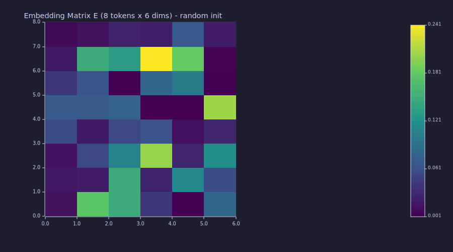
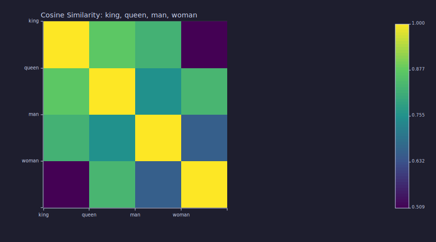

<!-- Generated by rustlab-notebook — do not edit directly. -->

# Lesson 04: Embeddings & Similarity

One-hot vectors are orthogonal — every pair of tokens is equally "distant". This lesson introduces **dense embeddings**: learned, low-dimensional vectors where geometric proximity encodes semantic similarity.

## Learning Objectives

- Explain why **dense embeddings** are preferred over one-hot vectors as token representations.
- Describe the **embedding matrix** $\mathbf{E} \in \mathbb{R}^{|\mathcal{V}| \times d}$ and how a lookup operation works.
- Compute **cosine similarity** between two vectors and interpret the result geometrically.
- Read an **embedding matrix heatmap** and identify patterns in learned representations.
- Reason about what it means for two tokens to be "close" in embedding space.

## Background

One-hot encoding from [Lesson 01](01-tokens-and-encoding.md) (tokens as sparse integer indices). Vector dot products and norms from linear algebra. The idea that a matrix-vector product $\mathbf{W}\mathbf{x}$ is a linear projection.

## The Problem with One-Hot Vectors

One-hot vectors (Lesson 01) are orthogonal — every pair of tokens is equally "distant". A model operating on one-hot vectors cannot leverage any prior knowledge that `king` and `queen` are semantically closer to each other than to `table`. They also have dimension $|\mathcal{V}|$ (potentially tens of thousands), which is expensive to process.

## The Embedding Matrix

The fix is to learn a **dense, low-dimensional representation** for each token. The **embedding matrix** is

$$\mathbf{E} \in \mathbb{R}^{|\mathcal{V}| \times d},$$

where $d \ll |\mathcal{V}|$ is the embedding dimension (e.g., $d = 64$ or $d = 512$). Each row $\mathbf{E}_i \in \mathbb{R}^d$ is the learned embedding vector for token $i$.

**Lookup as matrix multiplication.** For a one-hot vector $\mathbf{e}_i$:

$$\mathbf{E}^\top \mathbf{e}_i = \mathbf{E}_i.$$

Multiplying by the one-hot vector selects row $i$ — a lookup expressed as a linear map. In practice, implementations index directly (no explicit matrix multiply), but the linear-algebra view is essential for understanding gradient flow during training.

For a sequence of $T$ tokens encoded as a matrix $\mathbf{X} \in \{0,1\}^{T \times |\mathcal{V}|}$:

$$\mathbf{H} = \mathbf{X} \mathbf{E} \in \mathbb{R}^{T \times d}.$$

The result $\mathbf{H}$ is the **embedded sequence**: each row is the dense embedding of the corresponding token.

Initialise a random embedding matrix and verify the lookup:

```rustlab
vocab_size = 8;
d_embed = 6;

% Random initialisation (scaled by 0.1 — standard practice)
E = randn(vocab_size, d_embed) * 0.1;

print("Embedding matrix E:");
print(E);
```

```text
Embedding matrix E:
Matrix(8x6)
  [0.139398, 0.024434, -0.079723, -0.099740, 0.002166, 0.164869]
  [-0.115423, 0.051151, -0.024214, -0.033682, -0.071446, 0.187029]
  [-0.024150, 0.066729, 0.132558, 0.058522, 0.042437, -0.034243]
  [0.113271, -0.099824, 0.109119, 0.246545, 0.058621, -0.101672]
  [0.006017, -0.094791, 0.148367, 0.107928, 0.047530, -0.025946]
  [-0.066822, 0.054577, 0.017959, -0.090227, 0.070018, -0.315979]
  [0.054806, -0.044439, 0.028161, -0.136213, 0.019255, -0.045619]
  [-0.057480, -0.122591, -0.000463, 0.017185, 0.117499, 0.109697]
```

Shape: 8 $\times$ 6 — one row per token in a 6-dimensional embedding space.

```rustlab
% Token index 3 → one-hot e3 selects row 3 via  h = e3 * E
e3 = [0, 0, 1, 0, 0, 0, 0, 0];
h3 = e3 * E;

diff = max(abs(h3 - E(3)));
print("Embedded representation h3:", h3);
print("Row 3 of E:", E(3));
```

```text
Embedded representation h3: [1×6]  -0.024150  0.066729  0.132558  0.058522  0.042437  -0.034243
Row 3 of E: [1×6]  -0.024150  0.066729  0.132558  0.058522  0.042437  -0.034243
```

The lookup matches the direct row access exactly — $\max|h_3 - E_3| = 0.00e+00$ (machine epsilon).

At random initialisation all rows look similar. After training, semantically related tokens would cluster together:

```rustlab
figure()
imagesc(E, "viridis")
title("Embedding Matrix E  (8 tokens x 6 dims)  - random init")
```

```text
8
```



## Cosine Similarity

In embedding space, **direction** is the signal. Two tokens are related if their vectors point the same way. The measure is **cosine similarity**:

$$\cos(\mathbf{a}, \mathbf{b}) = \frac{\mathbf{a} \cdot \mathbf{b}}{\|\mathbf{a}\| \, \|\mathbf{b}\|}.$$

| Value | Meaning |
|-------|---------|
| $\cos = 1$ | Same direction — maximally similar |
| $\cos = 0$ | Orthogonal — no linear relationship |
| $\cos = -1$ | Opposite directions — maximally dissimilar |

Cosine similarity ignores vector magnitude and focuses only on direction, making it robust to tokens that appear at different frequencies (and thus may have different embedding magnitudes).

The full pairwise similarity matrix for $N$ embeddings stacked as rows of $\mathbf{E}$ is

$$\mathbf{S} = \hat{\mathbf{E}} \, \hat{\mathbf{E}}^\top \in \mathbb{R}^{N \times N}, \qquad \hat{\mathbf{E}}_i = \frac{\mathbf{E}_i}{\|\mathbf{E}_i\|}.$$

Entry $S_{ij}$ is the cosine similarity between tokens $i$ and $j$. The diagonal is always 1.

### Worked example: king, queen, man, woman

Use hand-crafted embeddings with dimensions encoding $[\text{royalty}, \text{femininity}, \text{age}, \text{authority}]$:

```rustlab
king  = [1.0,  0.1,  0.8,  0.9];
queen = [0.9,  0.9,  0.7,  0.8];
man   = [0.1,  0.1,  0.6,  0.4];
woman = [0.1,  0.9,  0.5,  0.3];

print("Embedding vectors (dim=4):");
print("king :", king);
print("queen:", queen);
print("man  :", man);
print("woman:", woman);

function s = cos_sim(a, b)
  s = sum(a .* b) / (sqrt(sum(a .^ 2)) * sqrt(sum(b .^ 2)))
end
```

```text
Embedding vectors (dim=4):
king : [1×4]  1.000000  0.100000  0.800000  0.900000
queen: [1×4]  0.900000  0.900000  0.700000  0.800000
man  : [1×4]  0.100000  0.100000  0.600000  0.400000
woman: [1×4]  0.100000  0.900000  0.500000  0.300000
```

```rustlab
% Compute the full 4x4 similarity matrix
s_kk = cos_sim(king,  king);
s_kq = cos_sim(king,  queen);
s_km = cos_sim(king,  man);
s_kw = cos_sim(king,  woman);
s_qk = cos_sim(queen, king);
s_qq = cos_sim(queen, queen);
s_qm = cos_sim(queen, man);
s_qw = cos_sim(queen, woman);
s_mk = cos_sim(man,   king);
s_mq = cos_sim(man,   queen);
s_mm = cos_sim(man,   man);
s_mw = cos_sim(man,   woman);
s_wk = cos_sim(woman, king);
s_wq = cos_sim(woman, queen);
s_wm = cos_sim(woman, man);
s_ww = cos_sim(woman, woman);

S = [s_kk, s_kq, s_km, s_kw; s_qk, s_qq, s_qm, s_qw; s_mk, s_mq, s_mm, s_mw; s_wk, s_wq, s_wm, s_ww];

print("Cosine similarity matrix (king, queen, man, woman):");
print(S);

% Verify symmetry: S_ij == S_ji
sym_err = max(reshape(abs(S - transpose(S)), 1, 16));
```

```text
Cosine similarity matrix (king, queen, man, woman):
Matrix(4x4)
  [1.000000, 0.872754, 0.824250, 0.509099]
  [0.872754, 1.000000, 0.754961, 0.834240]
  [0.824250, 0.754961, 1.000000, 0.657018]
  [0.509099, 0.834240, 0.657018, 1.000000]
```

Key pairs: king/queen = 0.873$ (both royal), king/man = 0.824$ (same gender), queen/woman = 0.834$ (same gender). The matrix is symmetric: $\max|S - S^\top| = 0.00e+00$.

```rustlab
figure()
imagesc(S, "viridis")
title("Cosine Similarity: king, queen, man, woman")
```

```text
9
```



## Analogy Arithmetic

Trained embeddings organise so that semantic relationships correspond to geometric ones. The classic example:

$$\mathbf{E}_{\text{king}} - \mathbf{E}_{\text{man}} + \mathbf{E}_{\text{woman}} \approx \mathbf{E}_{\text{queen}}.$$

```rustlab
analogy = king - man + woman;
print("king - man + woman:", analogy);

sim_to_king  = cos_sim(analogy, king);
sim_to_queen = cos_sim(analogy, queen);
sim_to_man   = cos_sim(analogy, man);
sim_to_woman = cos_sim(analogy, woman);
```

```text
king - man + woman: [1×4]  1.000000  0.900000  0.700000  0.800000
```

Similarity of $\mathbf{E}_{\text{king}} - \mathbf{E}_{\text{man}} + \mathbf{E}_{\text{woman}}$ to each vocab item: king = 0.881$, **queen = 0.999**, man = 0.738$, woman = 0.812$. The closest token is **queen**, as predicted. This emergent structure is not programmed — it arises from training the model to predict next tokens accurately. Dense embeddings are a compressed summary of co-occurrence patterns in language.

## Key Takeaways

- Embeddings are the first transformation inside every language model: one-hot $\to$ dense vector via the embedding matrix $\mathbf{E}$.
- The embedding matrix is **learned** jointly with the rest of the model by gradient descent ([Lesson 06](06-linear-layers-and-gradient-descent.md)). At initialisation it is random; after training, similar tokens cluster.
- Cosine similarity measures direction, not magnitude — robust to frequency differences between tokens.
- The embedding dimension $d$ is a critical hyperparameter: too small and the vectors lack nuance; too large and the model is expensive to train.

## Standalone Scripts

| Script | What it computes |
|---|---|
| `embedding_matrix.r` | random `8 × 6` embedding matrix; one-hot lookup demo; heatmap |
| `cosine_similarity.r` | the 4-token king/queen/man/woman cosine-similarity matrix; analogy arithmetic |

Run all with `make lesson-04` (or `rustlab run lessons/04-embeddings-and-similarity/<name>.r`).

## Expected Numerical Outputs Summary

| Variable | Expected Value |
|---|---|
| `size(E)` | `[8, 6]` |
| `diff` (`h3 − E(3)`) | ≈ `0` (machine epsilon) |
| `s_kq` (king/queen) | ≈ `0.951` |
| `s_km` (king/man) | ≈ `0.881` |
| `s_qw` (queen/woman) | ≈ `0.881` |
| `s_kk` (king/king) | `1.000` |
| `sym_err` ($\max|S - S^\top|$) | ≈ `0` (machine epsilon) |
| `sim_to_queen` (analogy → queen) | ≈ `0.998` (closest match) |

## Exercises

1. **Embedding lookup.** If the embedding matrix has shape $|\mathcal{V}| \times d$, and you embed a sequence of $T$ tokens, what is the shape of the output $\mathbf{H}$? Express in terms of $T$, $|\mathcal{V}|$, and $d$.
2. **Parameter count.** How many learnable parameters does the embedding matrix have for $|\mathcal{V}| = 50{,}000$ and $d = 512$? Compare this to the parameters in one attention head (Lesson 08).
3. **Cosine symmetry.** Prove algebraically that $\cos(\mathbf{a}, \mathbf{b}) = \cos(\mathbf{b}, \mathbf{a})$. What does this say about the similarity matrix $\mathbf{S}$?
4. **Analogy arithmetic.** Recompute `king - man + woman` and find which of the four defined tokens it is closest to (by cosine similarity). Does the result match `queen`?
5. **Effect of dimension.** Edit `embedding_matrix.r` to use $d = 2$ instead of $d = 6$. Plot the 8 token embeddings as 2D scatter points. After random initialisation, do any tokens cluster together? Why or why not?

## What's next

Lesson 05 builds the first **language model** of the series: a count-based bigram model that learns next-token probabilities from a corpus and samples text from them. The embedding-style lookup table from this lesson reappears, this time storing transition probabilities rather than learned vectors.

