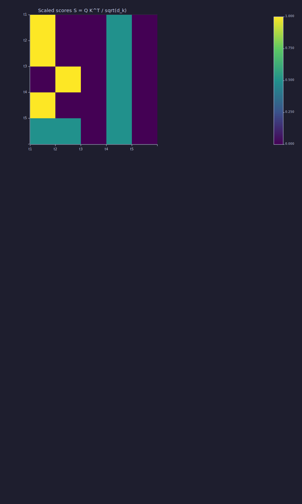
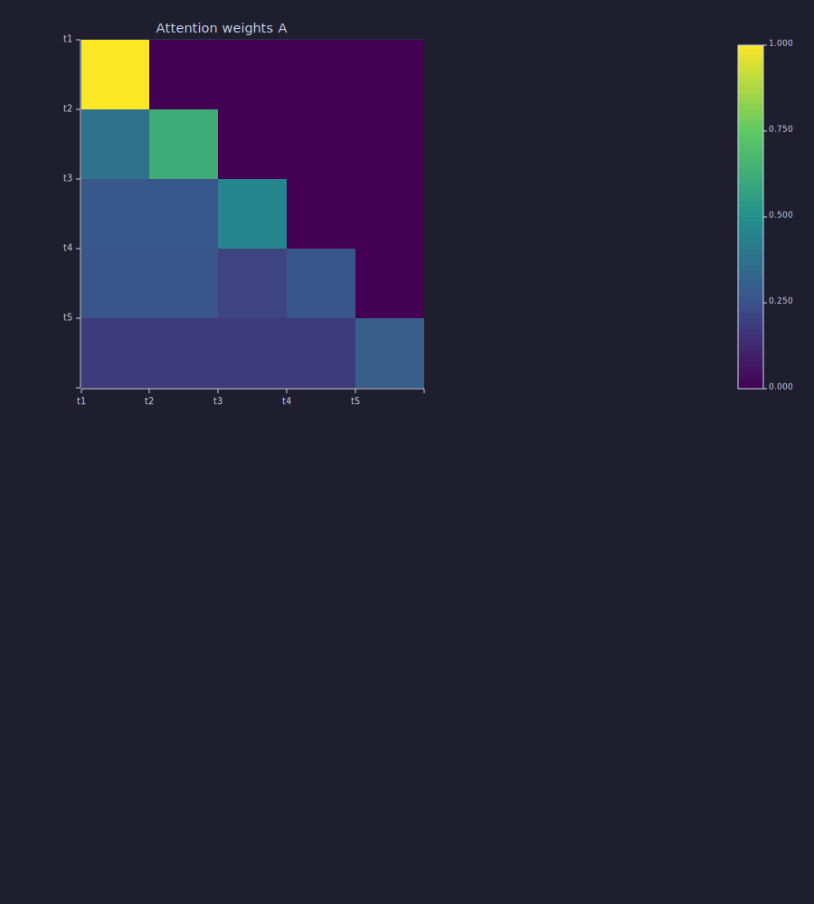

<!-- Generated by rustlab-notebook — do not edit directly. -->

# Lesson 08: Scaled Dot-Product Attention

[Lesson 07](07-context-and-naive-averaging.md) rewrote causal prefix averaging as a matrix multiply $\bar{\mathbf{X}} = \mathbf{W}\mathbf{X}$ where $\mathbf{W}$ was lower-triangular with fixed $1/t$ weights. Attention keeps the same skeleton but makes the weights **learned** and **data-dependent**. This lesson derives the full operation:

$$\mathrm{Attn}(\mathbf{Q},\mathbf{K},\mathbf{V}) \;=\; \mathrm{softmax}\!\left(\frac{\mathbf{Q}\mathbf{K}^\top}{\sqrt{d_k}} + \mathbf{M}\right)\mathbf{V}.$$

## Learning Objectives

- Define the **query**, **key**, and **value** matrices $\mathbf{Q}, \mathbf{K}, \mathbf{V}$ derived from a sequence of embeddings via three learned linear projections.
- Write and explain the scaled dot-product attention equation $\mathrm{Attn}(\mathbf{Q},\mathbf{K},\mathbf{V}) = \mathrm{softmax}\!\left(\tfrac{\mathbf{Q}\mathbf{K}^\top}{\sqrt{d_k}}\right)\mathbf{V}$ one piece at a time.
- Motivate the $1/\sqrt{d_k}$ scale from the variance of a dot product of independent vectors.
- Apply a **causal mask** so position $t$ cannot see tokens at positions $> t$ and verify the resulting attention matrix is lower-triangular.
- Relate attention back to the uniform averaging matrix from Lesson 07 — same shape, now with data-dependent weights.

## Background

Embeddings as dense row vectors from [Lesson 04](04-embeddings-and-similarity.md). Softmax, cross-entropy, and probability row-normalisation from [Lessons 02–03](02-probability-and-softmax.md). Linear layers as $\mathbf{y} = \mathbf{x}\mathbf{W}$ from [Lesson 06](06-linear-layers-and-gradient-descent.md). Causal prefix averaging as $\bar{\mathbf{X}} = \mathbf{W}\mathbf{X}$ from [Lesson 07](07-context-and-naive-averaging.md).

## Queries, Keys, Values

Given an input $\mathbf{X} \in \mathbb{R}^{T \times d_{\text{model}}}$ (row $t$ is the embedding of token $t$), three learned linear projections produce three matrices:

$$\mathbf{Q} = \mathbf{X}\mathbf{W}_Q \in \mathbb{R}^{T \times d_k}, \quad \mathbf{K} = \mathbf{X}\mathbf{W}_K \in \mathbb{R}^{T \times d_k}, \quad \mathbf{V} = \mathbf{X}\mathbf{W}_V \in \mathbb{R}^{T \times d_v}.$$

- $\mathbf{W}_Q, \mathbf{W}_K \in \mathbb{R}^{d_{\text{model}} \times d_k}$ — project each embedding into a **query** and **key** vector.
- $\mathbf{W}_V \in \mathbb{R}^{d_{\text{model}} \times d_v}$ — project into a **value** vector.

Each token emits three vectors: a **query** (what it's looking for), a **key** (what it advertises), a **value** (what it contributes if selected). The parameters $\mathbf{W}_Q, \mathbf{W}_K, \mathbf{W}_V$ are learned by gradient descent ([Lesson 06](06-linear-layers-and-gradient-descent.md)); once trained, they encode which features matter for prediction.

```rustlab
T = 5;
d_k = 4;
scale = 1.0 / sqrt(d_k);

% Hand-crafted Q, K designed so the attention pattern is interpretable.
% K row 1 is a "keyword" feature; Q rows 2 and 4 both want it.
K = [ 2.0, 0.0, 0.0, 0.0;
      0.0, 2.0, 0.0, 0.0;
      0.0, 0.0, 2.0, 0.0;
      1.0, 1.0, 0.0, 0.0;
      0.0, 0.0, 1.0, 1.0 ];

Q = [ 1.0, 0.0, 0.0, 0.0;
      1.0, 0.0, 0.0, 0.0;
      0.0, 1.0, 0.0, 0.0;
      1.0, 0.0, 0.0, 0.0;
      0.5, 0.5, 0.0, 0.0 ];
```

## The Score Matrix

Entry $(t, i)$ of $\mathbf{S} = \mathbf{Q}\mathbf{K}^\top$ is the dot product $\mathbf{q}_t \cdot \mathbf{k}_i$ — a raw similarity between query $t$ and key $i$.

### Why divide by $\sqrt{d_k}$?

If $\mathbf{q}$ and $\mathbf{k}$ each have $d_k$ i.i.d. components with mean 0 and variance 1, then $\mathbf{q}\cdot\mathbf{k} = \sum_{j=1}^{d_k} q_j k_j$ has variance $d_k$ (sum of $d_k$ independent products) and so standard deviation $\sqrt{d_k}$. As $d_k$ grows, raw dot products grow too, softmax becomes razor-sharp (one entry approaches 1, others approach 0), and gradients vanish. Scaling by $1/\sqrt{d_k}$ keeps the input to softmax at roughly unit variance regardless of dimension:

$$\mathbf{S}_{\text{scaled}} = \frac{\mathbf{Q}\mathbf{K}^\top}{\sqrt{d_k}}.$$

```rustlab
S = Q * K' * scale;
```

## The Causal Mask

For a language model, token $t$ must not see tokens at positions $i > t$. Add a mask $\mathbf{M}$ with entries $-\infty$ above the diagonal and 0 elsewhere:

$$M_{t, i} = \begin{cases} 0 & i \le t \\ -\infty & i > t. \end{cases}$$

In practice we use a large negative value (e.g. $-10^9$) to avoid `NaN` from $\exp(-\infty)$.

```rustlab
NEG_INF = -1.0e9;
M = zeros(T, T);
for i = 1:T
  for j = (i + 1):T
    M(i, j) = NEG_INF;
  end
end
S_masked = S + M;
```

## Row-wise Softmax → Attention Weights

Applying softmax to each row turns the scores into a probability distribution. The $-10^9$ entries become exactly 0:

$$A_{t, i} = \frac{\exp(\tilde S_{t, i})}{\sum_{j=1}^{T} \exp(\tilde S_{t, j})}.$$

```rustlab
A = zeros(T, T);
for t = 1:T
  row = softmax(S_masked(t));
  for j = 1:T
    A(t, j) = row(j);
  end
end
```

Token 1 can only attend to itself, so $A_{1,1} = 1.0000$. Every row sums to 1. The maximum attention weight in the upper triangle is 0.00e+00$ — effectively zero, as required for causality.

### The three-stage pipeline

```rustlab
figure()
subplot(3, 1, 1)
imagesc(S, "viridis")
title("Scaled scores S = Q K^T / sqrt(d_k)")

subplot(3, 1, 2)
imagesc(S_masked, "viridis")
title("After causal mask (upper triangle → -∞)")

subplot(3, 1, 3)
imagesc(A, "viridis")
title("Attention weights A = softmax_row(S_masked)")
```

```text
20
```



The final attention matrix is **lower-triangular** (causality) with **rows summing to 1** (softmax) — exactly the same shape as the Lesson 07 averaging matrix, but now the weights depend on the content of $\mathbf{Q}$ and $\mathbf{K}$.

## Full Pipeline: X → Q, K, V → Output

Wire it all together. Add a value matrix $\mathbf{V}$ and produce $\mathbf{O} = \mathbf{A}\mathbf{V}$.

```rustlab
d_model = 6;
d_v = 4;

% Input sequence (T × d_model)
X = [ 1.0, 0.0, 0.0, 0.0, 0.0, 0.0;
      0.0, 1.0, 0.0, 0.0, 0.0, 0.0;
      0.0, 0.0, 1.0, 0.0, 0.0, 0.0;
      0.5, 0.5, 0.0, 0.0, 0.0, 0.0;
      0.0, 0.0, 0.0, 1.0, 1.0, 1.0 ];

% Hand-set projection matrices (d_model × d_k/d_v)
W_Q = [ 1.0, 0.0, 0.0, 0.0;
        0.0, 1.0, 0.0, 0.0;
        0.0, 0.0, 1.0, 0.0;
        0.0, 0.0, 0.0, 1.0;
        0.0, 0.0, 0.0, 0.0;
        0.0, 0.0, 0.0, 0.0 ];

W_K = W_Q;

W_V = [ 1.0, 0.0, 0.0, 0.0;
        0.0, 1.0, 0.0, 0.0;
        0.0, 0.0, 1.0, 0.0;
        0.0, 0.0, 0.0, 1.0;
        1.0, 1.0, 0.0, 0.0;
        0.0, 0.0, 1.0, 1.0 ];

Q2 = X * W_Q;
K2 = X * W_K;
V2 = X * W_V;
```

Compute attention weights and output:

```rustlab
S2 = Q2 * K2' * scale;
M2 = zeros(T, T);
for i = 1:T
  for j = (i + 1):T
    M2(i, j) = NEG_INF;
  end
end
S2_masked = S2 + M2;

A2 = zeros(T, T);
for t = 1:T
  row = softmax(S2_masked(t));
  for j = 1:T
    A2(t, j) = row(j);
  end
end

O = A2 * V2;
```

Row 1 of $\mathbf{O}$ equals row 1 of $\mathbf{V}$ (token 1 only attends to itself): $\max|\mathbf{O}_1 - \mathbf{V}_1| = 0.00e+00$. The block's learnable parameters are $3 \cdot d_{\text{model}} \cdot d_k = 3 \cdot 6$ \cdot 4$ = 72$ — and this count does **not** depend on sequence length $T$.

```rustlab
figure()
subplot(2, 1, 1)
imagesc(A2, "viridis")
title("Attention weights A")
subplot(2, 1, 2)
imagesc(O, "viridis")
title("Output O = A V")
```

```text
21
```



## Connection to Lesson 07

Attention and the Lesson 07 averaging matrix have the **same shape**:

- Lower-triangular (causal).
- Rows sum to 1.
- $\mathbf{O} = \mathbf{A}\mathbf{V}$ (attention) vs $\bar{\mathbf{X}} = \mathbf{W}\mathbf{X}$ (averaging) — a weighted sum of past tokens.

If $\mathbf{W}_Q = \mathbf{W}_K = \mathbf{0}$ then every score is 0, softmax produces uniform weights over the first $t$ positions, and the output reduces to the Lesson 07 prefix average of the value vectors. Attention is a **strict generalisation** of uniform averaging.

## Key Takeaways

- **Queries, keys, values** are three linear projections of the same input $\mathbf{X}$ — self-attention means they all come from the same sequence.
- The **score matrix** $\mathbf{S} = \mathbf{Q}\mathbf{K}^\top / \sqrt{d_k}$ measures query-key similarity; the $1/\sqrt{d_k}$ scale keeps variance stable as $d_k$ grows.
- The **causal mask** zeros out future positions so position $t$ can only look at tokens $1..t$. Without it, language-model training would leak future tokens.
- **Softmax is row-wise** — each row of $\mathbf{A}$ is a probability distribution over the first $t$ tokens.
- The **parameter count** of one self-attention block ($\mathbf{W}_Q, \mathbf{W}_K, \mathbf{W}_V$) is $3 \cdot d_{\text{model}} \cdot d_k$, independent of sequence length.

## Standalone Scripts

| Script | What it computes |
|---|---|
| `attention_weights.r` | scores → masked → softmax pipeline on hand-crafted $\mathbf{Q}, \mathbf{K}$; three-stage heatmap |
| `attention_output.r` | full $X \to Q, K, V \to O$ pipeline with hand-set projection matrices; output heatmap |

Run all with `make lesson-08` (or `rustlab run lessons/08-scaled-dot-product-attention/<name>.r`).

## Expected Numerical Outputs Summary

| Variable | Expected Value |
|---|---|
| `scale` (= $1/\sqrt{4}$) | `0.5` |
| `A_1_1` | `1.0000` (token 1 attends only to itself) |
| `max_upper` (max of upper-triangle $\mathbf{A}$) | ≈ `0` (machine epsilon × softmax of $-10^9$) |
| `row_sums` (each row of $\mathbf{A}$) | `1.0` |
| `diff_row1` ($\max|\mathbf{O}_1 - \mathbf{V}_1|$) | ≈ `0` (machine epsilon) |
| `n_params_qkv` (= $3 \cdot d_{\text{model}} \cdot d_k$) | `72` |

## Exercises

1. **The scale matters.** Remove the $1/\sqrt{d_k}$ factor in `attention_weights.r`. How does the attention matrix change when $d_k = 4$? Try bumping the diagonal of $\mathbf{Q}$ and $\mathbf{K}$ to make the dot products larger — what does softmax do as the scores grow?
2. **Drop the mask.** Disable the causal mask in `attention_weights.r`. Confirm that token 1 now attends to future tokens. Why does this break language-model training?
3. **Uniform weights as a limit.** In `attention_weights.r`, set $\mathbf{Q}$ and $\mathbf{K}$ to all zeros. What are the attention weights? Compare to the averaging matrix $\mathbf{W}$ from Lesson 07.
4. **Parameter counting.** For $d_{\text{model}} = 384$, $d_k = d_v = 64$, compute the parameter count of $\mathbf{W}_Q, \mathbf{W}_K, \mathbf{W}_V$ together. Add an output projection $\mathbf{W}_O \in \mathbb{R}^{d_v \times d_{\text{model}}}$ — what's the total now?
5. **Complexity.** The score matrix $\mathbf{S} = \mathbf{Q}\mathbf{K}^\top$ has $T \times T$ entries. How does the cost of computing $\mathbf{S}$ scale with sequence length $T$? Why is this the bottleneck that motivates efficient attention variants (FlashAttention, sliding window, linear attention)?

## What's next

Lesson 09 runs **multiple attention heads in parallel**, each with its own $\mathbf{W}_Q^{(h)}, \mathbf{W}_K^{(h)}, \mathbf{W}_V^{(h)}$, then concatenates their outputs and projects them back to $d_{\text{model}}$. Different heads learn to specialise — one might track syntax, another long-range references — without any explicit supervision telling them which is which.

